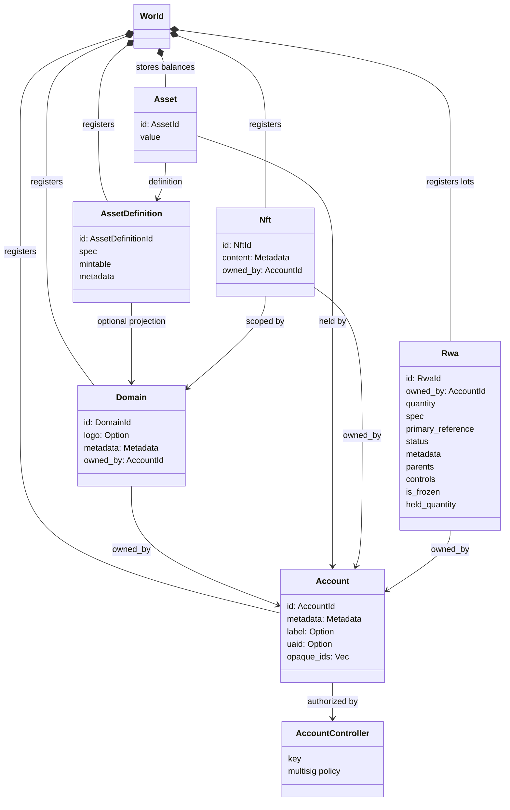
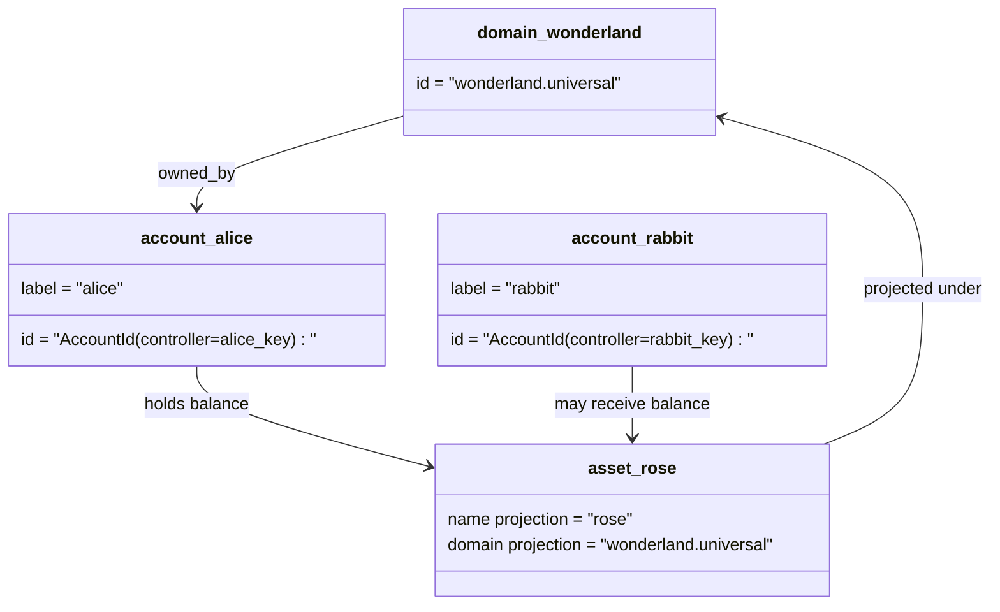

# གནད་སྡུད་གི་རྣམ་གཞག་ {#data-model}

Iroha གིས་ `World` ནང་གི་རྩིས་དེབ་ཀྱི་གནས་སྟངས་འདི་བཙུགསཔ་ཨིན། ཨང་དང་པ་ཐོན་པའི་ གནས་སྡུད་བཟོ་རྣམ་འདི་གིས་ འོག་གི་དབྱེ་བ་དང་མཐུན་རྐྱེན་ཚུ་ལག་ལེན་འཐབ་ཨིན།

- མངའ་ཁོངས་ཚུ་ གནད་སྡུད་ས་སྒོ་-ཤེས་ཚད་ཡོདཔ་ཨིན་ དཔེར་ན་ `payments.universal`
- རྩིས་ཐོ་ཚུ་ ཚད་ལྡན་དང་ མངའ་ཁོངས་མེདཔ་ཨིན། རྩིས་ཐོའི་ཨའི་ཌི་འདི་རྩིས་ཐོ་ཚད་འཛིན་ལས་འབྱུང་ཡོདཔ་ཨིན།
- རྒྱུ་དངོས་ངེས་ཚིག་ཚུ་གིས་ མངའ་ཁོངས་/མིང་པར་བརྙན་ཅིག་བཞག་ཚུགས་ དེ་འབདཝ་ད་ ཁོང་གི་ ཚད་ལྡན་ཚིག་ཡིག་ཁ་བྱང་འདི་ དྭངས་གསལ་མེད་པའི་ Base58 ངོས་འཛིན་འབད་མི་ཅིག་ཨིན།
- རྒྱུ་དངོས་ཚུ་ དམིགས་བསལ་གྱི་རྒྱུ་དངོས་ངེས་ཚིག་ཅིག་གི་དོན་ལུ་ རྩིས་ཐོ་ཚུ་གིས་ བདག་འཛིན་འཐབ་མི་ ལྷག་ལུས་ཚུ་ཨིན།
- NFTs འདི་ མངའ་ཁོངས-ཆ་རྐྱེན་ཚང་བ IDs དང་ ཟུར་གནས་གནད་སྡུད ནང་དོན ཡོད་པའི་རང་རྐྱང་གི་ཐོ་ཡིག་ཨིན།
- RWAs ཚུ་ ད་ལྟོའི་ཇོ་བདག་དང་ འབོར་ཚད་ འབྱུང་ཁུངས་ མེ་ཊ་ཌེ་ཊ་ བཀག་ཆ་ གྱང་ཤུགས་ དེ་ལས་ མི་ཚེ་འཁོར་རིམ་ཚད་འཛིན་ཚུ་དང་གཅིག་ཁར་ རིམ་སྒྲིག་ལས་ཕྱི་ཁའི་རྒྱུ་དངོས་ཚུ་ ངོ་བཏོན་འབད་མི་ བཟོ་བསྐྲུན་འབད་མི་-ID ལོཊི་ཚུ་ཨིན།

## དཔེ་གཅིག་ {#example}

Iroha 3 དྲ་རྒྱ ནང་ `wonderland.universal` འདི་ `universal` གནད་སྡུད་ས་སྟོང ནང་གི་ མངའ་ཁོངས ཅིག་ཨིན། དཔེ་འདི་ནང་གི་ ཚད་ལྡན རྩིས་ཐོ ཚུ་ ཁོང་རའི་ ལྡེ་མིག ཡང་ན་ སྲིད་བྱུས གིས་ཚད་འཛིན་འབད་དེ་ མངའ་ཁོངས་མེད I105 རྩིས་ཐོ IDs སྦེ་ ཨང་སྒྱུར འབད་ཡོད། `alice@wonderland.universal` བཟུམ་མའི་ ཀློག་ཚུགས་པའི་ ཁ༌ཡིག ཚུ་ IDs དེ་ཚུ་དང་སོ་སོར་བཅིངས་ཡོད་པའི་ མིང་གཞན ཨིན། ཚོད་དཔག་འབད་ཡོདཔ རྒྱུ་དངོས ངེས་ཚིག་ ཅིག་ `wonderland.universal` ནང་གི་ `rose` བཟུམ་མའི་ མངའ་ཁོངས དང་ མིང་ ལས་བཟོ་ཚུགས། ཨིན་རུང་ སྐྱེལ་སྒྲིག གུ་ལག་ལེན་འཐབ་མི་ ཚད་ལྡན རྒྱུ་དངོས་ངེས་ཚིག ཁ༌འབྱང༌ འདི་ བཏོན་ཡོདཔ Base58 ཁ༌འབྱང༌ ཨིན།

## མིང་རྟགས་ཚུ་ {#aliases}

མིང་མིང་འདི་ མི་གི་གདོང་ཁ་ལུ་ཡོད་མི་ མིང་མིང་ཨིན། འདི་ཚུ་ API, CLI, དངུལ་ཁུག, དང་ འཚོལ་ཞིབ་ལག་ཆས མཐའ་མཚམས་ཚུ ལུ་ཕན་ཐོགས་ཡོདཔ་ཨིན། ཨིན་རུང་ ཚད་ལྡན IDs གིས་ དྭངས་གསལ་ཅན་གྱི་ རྩིས་དེབ ས་སྒོ་ཚུ ནང་བཞག་མི་ གཏན་འཇགས ངོ་རྟགས སྦེ་རང་གནས་ཡོདཔ་ཨིན།

| དམིགས་ཚད། | ཚད་ལྡན་དམིགས་འབེན། | མིང་གཞན་མིང་ཚིག | རྒྱབ་སྐྱོར་དཔེ་ཚད། |
| -------------- | | | |
| ལག་ལེན་པའི་རྩིས་ཐོ་ | མངའ་ཁོངས་མེད `AccountId` འདི་ I105 ཁ་བྱང་སྦེ་ ཨེན་ཀོ་ཌི་འབད་ཡོདཔ། | `name@domain.dataspace` ཡང་ན་ `name@dataspace` | `AccountAlias`; གཞི་རྟེན་མིང་གཞན་འདི་ `Account.label` ཨིན། མིང་གཞན་ཁ་སྐོང་ཚུ་ བཱའིན་ཌིང་ཚུ་ཨིན། |
| རྒྱུ་དངོས་ངེས་ཚིག | ཚད་ལྡན `AssetDefinitionId` གཞི་རྟེན་༥༨ ཁ་བྱང་ | `name#domain.dataspace` ཡང་ན་ `name#dataspace` | `AssetDefinitionAlias` རྒྱུ་དངོས་ངེས་ཚིག་ཅིག་ལུ་བསྡམ་ཡོདཔ་ |
| གན་རྒྱ་ | ཚད་ལྡན བེཆ་༣༢ཨེམ་ `ContractAddress` | `name::domain.dataspace` ཡང་ན་ `name::dataspace` | `ContractAlias` བཀྲམ་སྤེལ་འབད་ཡོད་པའི་གན་རྒྱ་ཁ་བྱང་ཅིག་ལུ་བསྡམ་ཡོདཔ་ཨིན། |
| མངའ་ཁོངས་མིང་ | `DomainId` འབྲི་ཤོག་ནང་ `domain.dataspace` | `domain.dataspace` | SNS `domain` མིང་གནས་དྲན་ཐོ། |
|གནས་སྡུད་ཁ་གྲངས་གི་མིང་ |ཨང་གྲངས་ `DataSpaceId` ལས་འགུལ་ཅན་གྱི་ Nexus གི་ཐོ་ཡིག་ནང་ལས་ |ཌེ་ཊ་ས་པི་སི་གི་མིང་དཔེར་ན་ `universal`, `paynet`, ཡང་ན་ `zk`|SNS `dataspace` མིང་གི་ས་ཁོངས་ཀྱི་ཐོ་ཡིག་དང་འབྲེལ་བའི་ གནད་སྡུད ས་སྟོང་ཚུ གི་ལག་ལེན་གྱི་ཐོ་ཡིག་ |

རྩིས་ཐོའི་མིང་གཞན་ཚུ་ ལག་ལེན་པ་ལུ་གདོང་ཐུག་འབད་མི་རྩིས་ཐོའི་མིང་ཚུ་ཨིན། འཛམ་གླིང་མངའ་སྡེའི་ཟུར་ཐོ་དང་ རྩིས་ཐོ་བསྐྱར་བཟོ་དྲན་ཐོ་ཚུ་བརྒྱུད་དེ་ རྩིས་ཐོ་ཨའི་ཌི་ཤུགས་ལྡན་ལུ་ མིང་གཞན་འདི་གིས་ རྩིས་ཐོ་བསྐྱར་བཟོ་འབད་བའི་སྐབས་ལུ་ ཁོང་ཆ་ཁྱབ་ མཐར་འཁྱོལ་ཚུགསཔ་ཨིན། རྩིས་ཐོའི་གཞི་རིམ་ཁ་ཡིག་གི་དོན་ལུ་ `SetPrimaryAccountAlias` དང་ གཞི་རིམ་མེན་པའི་མིང་གཞན་ཁ་སྐོང་དོན་ལུ་ `SetAccountAliasBinding` དེ་ལས་ ལྷག་ནིའི་དོན་ལུ་ `FindAccountByAlias` ཡང་ན་ `FindAliasesByAccountId` ལག་ལེན་འཐབ། རྩིས་ཐོའི་མིང་གཞན་ཚུ་ལུ་ སྤྱིར་བཏང་ལུ་ SNS རྩིས་ཐོའི་མིང་གཞན་གླ་ཁར་ལེན་མི་འདི་ `AcquireAccountAliasLease` དང་ `RenewAccountAliasLease` དང་གཅིག་ཁར་བསྐྱར་གསོ་འབད་དགོཔ་ཨིན།

རྒྱུ་དངོས་མིང་གཞན་མིང་རྒྱུ་དངོས་ངེས་ཚིག་ཚུ་ མི་ངོ་རྐྱང་གི་རྩིས་ཐོ་ལྷག་ལུས་མེན། རྒྱུ་དངོས་མིང་གཞན་དང་ གན་རྒྱ་མིང་གཞན་ཚུ་ ལྷག་བཏུབ་པའི་མིང་ལས་ ད་ལྟོ་ཡོད་པའི་ ཁྲིམས་ལུགས་དམིགས་གཏད་ལུ་ ཐད་ཀར་དུ་ མཐུད་འབྲེལ་འབདཝ་ཨིན། རྒྱུ་དངོས་མིང་གཞན་ཚུ་ `SetAssetDefinitionAlias` དང་ཅིག་ཁར་གཞི་སྒྲིག་འབད་ཡོདཔ་ཨིན། མིང་གཞན་མིང་ཆ་ཤས་འདི་ རྒྱུ་དངོས་ངེས་ཚིག་བཀྲམ་སྟོན་མིང་ ཡང་ན་ དམིགས་ཚད་ངེས་ཚིག་མིང་དང་མཐུན་སྒྲིག་འབད་དགོ། གན་རྒྱ་མིང་གཞན་ཚུ་ `SetContractAlias` དང་ཅིག་ཁར་གཞི་སྒྲིག་འབད་ཡོདཔ་ཨིན། མིང་གཞན་གནད་སྡུད་ས་སྒོ་འདི་ གན་རྒྱ་ཁ་བྱང་ནང་ལུ་ ཨིན་ཀོ་ཌི་འབད་ཡོད་པའི་ གནད་སྡུད་ས་སྒོ་དང་མཐུན་སྒྲིག་འབད་དགོ། བཱའིན་ཌིང་གཉིས་ཆ་ར་གིས་ `lease_expiry_ms` འབག་ཚུགས། དུས་ཡུན་ཚང་བའི་ཤུལ་ལས་ ཁོང་གིས་ བྱིན་རླབས་སྒོ་སྒྲིག་འདི་ འགྱོ་བའི་སྐབས་ ཐག་བཅད་ནི་འདི་བཀག་ཞིནམ་ལས་ འཛམ་གླིང་གནས་སྟངས་ཀྱི་ཟུར་ཐོ་ཚུ་ལས་ ཕྱགས་བདའ་འགྱོཝ་ཨིན།

ཌོ་མེནཚུ་ནང་ལུ་ `DomainAlias` འདྲ་མཉམ་མེད་ཡོདཔ་ཨིན། ཌོ་མེནསི་ངོ་རྟགས་འདི་ ཧེ་མ་ལས་ `payments.universal` འདི་བཟུམ་སྦེ་ ཌེ་ཊ་ས་ཁོངས་ནང་ ཁྱད་ཚད་ཅན་གྱི་མིང་ཨིན། SNS གིས་ `domain` གི་མིང་གི་ས་ཁོངས་ནང་ ཌེ་ཀྲ་ས་ཁོངས་ཀྱི་མིང་དང་ `dataspace` གི་མིང་གི་ ས་ཁོངས་ནང་གི་ མིང་གི་མིང་ཚུ་གི་དོན་ལུ་ རིན་བསྡུར་གྱི་དབང་འཛིན་བཟུང་འབད་འོང་། ཟུར་བཞག་ཡོད་པའི་ `universal` ཌེ་ཊ་ས་པི་སི་གི་མིང་འདི་ ངེས་གཏན་སྦེ་བཞག་དགོཔ་ཨིན།

## འབྲེལ་ཡོད་ཡིག་ཚང་ཚུ་ {#related-docs}

| དོན་ཚན། | ག་ཏེ་འགྱོ་ནི་ |
| | |
|ས་ཁོངས་ཚུ་ | [ས་ཁོངས་](/dz/blockchain/domains.md) |
|རྩིས་ཐོ་ | [རྩིས་ཐོ་](/dz/blockchain/accounts.md) |
|རྒྱུ་དངོས་ཚུ་ | [རྒྱུ་ཆ། ](/dz/blockchain/assets.md) |
|NFTs | [NFTs](/dz/blockchain/nfts.md) |
|གནས་སྟངས་ངོ་མ་གི་ རྒྱུ་དངོས་ཚུ་ | [གནས་སྟངས་ངོ་མ་གི་ རྒྱུ་དངོས་ཚུ་](/dz/blockchain/rwas.md) |
|གཞི་རྟེན་རྩིས་ཐོ་བཀོད་ | [ཟུར་གནས་གནད་སྡུད](/dz/blockchain/metadata.md) |
|ཐོ་བཀོད་དང་ བསྒྱུར་བཅོས་ཀྱི་བསླབ་བྱ་ཚུ་ | [ལམ་སྟོན་ཚུ་ ](/dz/blockchain/instructions.md) |
|འགྲུལ་སྐྱོད་དུས་ཚོད་གི་ཆོག་ཐམ་ | [ངོས་ལེན་ཚུ་](/dz/blockchain/permissions.md) |
|མིང་བཏགས་ཐངས་ཚུ་ | [མིང་བཏགས་ནི་གི་ལམ་ལུགས་](/dz/reference/naming.md) |
