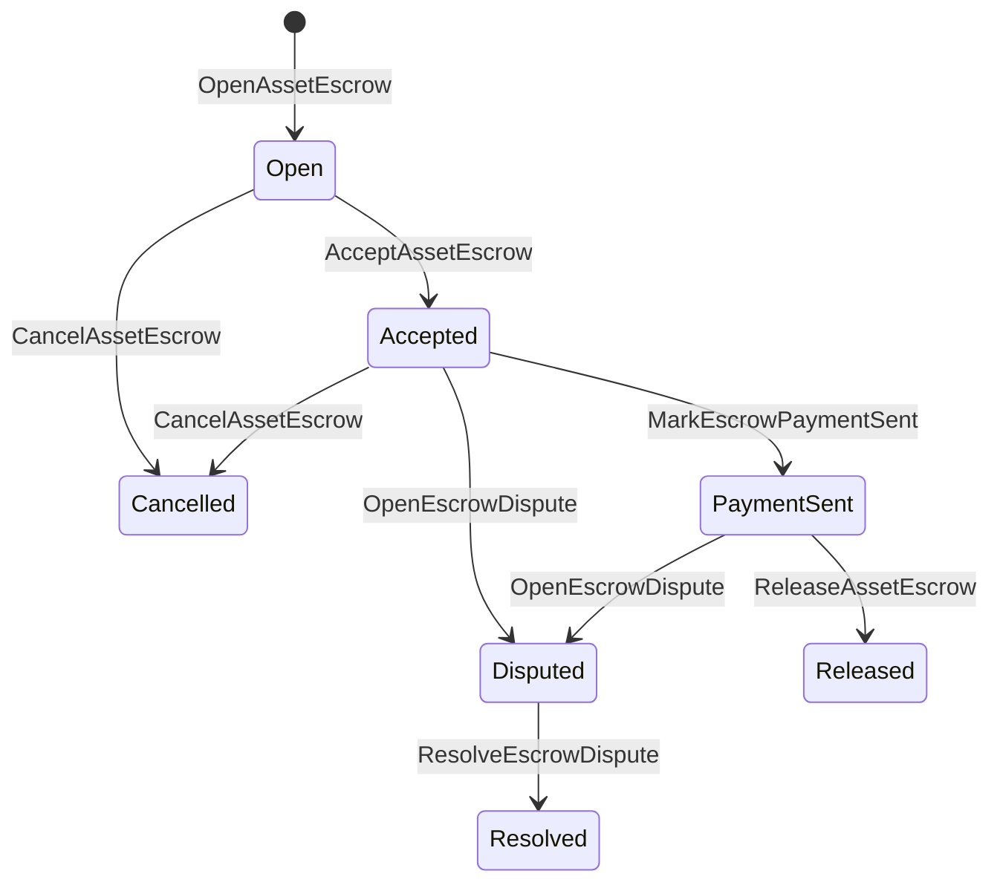

# རང་སོའི་རྒྱུ་དངོས་ཚུ་གི་ ཉེན་སྲུང་འབད་ཐབས། {#native-asset-escrow}

Native escrow འདི་ཨང་གྲངས་རྩིས་ཀྱི་ རྒྱུ་དངོས་ཚུ་གི་དོན་ལུ་ ལེ་ཇར་གིས་ འཛིན་སྐྱོང་འབད་ཡོད་པའི་ བདག་འཛིན་ལམ་ལུགས་ཅིག་ཨིན། དེ་ཚབ་ལུ་ ལག་ལེན་གྱི་བདག་དབང་གི་རྩིས་ཁྲ་ལུ་ རྒྱུ་དངོས་ཚུ་བཏང་ནི་དང་ ཐབས་ཤེས་ལག་ལེན་ཡིག་ཚང་ལུ་ བློ་གཏད་ནི་དེ་རྩིས་ཁྲ་སྲུང་ནིའི་དོན་ལུ་ཨིན། escrow ISIs གིས་ གནས་གོང་འདི་ deterministic protocol custody account ལུ་སྤོ་བཤུད་འབད་ཞིནམ་ལས་ འཛམ་གླིང་གནས་སྟངས་ནང་ escrow གི་ཚེ་རིང་སླར་ལོག་འབདཝ་ཨིན།

ཨའི་ཊའི་གི་རྣམ་གཞག་ནང་ ཚད་འཛིན་འབད་ནིའི་དོན་ལུ་ རང་སོའི་གཏེར་ཁ་ལག་ལེན་ཚུ་ ལག་ལེན་འཐབ་ནི་ འདི་ཡང་ Aitai གི་རྣམ་གཞག་ལས་ ཕྱི་འབྲེལ་སྤྲོད་ཁྲལ་གྱི་གཞི་སྒྲིག་འབད་ནི་དང་ མི་ལི་ཀྲོན་ལྡེ་མིག་ཚུ་ དེ་ལས་ ལྡོག་ཕྱོགས་ཀྱི་གཏེར་ཁ་ཚུ་གི་ ལཱ་འབད་ཐངས་ཚུ་ཨིནམ་ད་ དེ་ཚུ་ལུ་ ཐོ་བཀོད་འབད་མི་ཚེ་རིང་གནས་སྟངས་འདི་ དགོས་མཁོ་ཅན་ཨིན་མས།

## བསམ་འཆར་ཚུ་ {#concepts}

|མནོ་བསམ་བཟོ།|འགྲེལ་བཤད་ |
| --- | --- |
|`EscrowId` |འབོ་མི་གིས་བཙག་འཐུ་འབད་ཡོད་པའི་ ངོ་རྟགས་འདི་ ཧེཤ་ཅིག་ནང་བཀབ་དགོཔ་ཨིན། དྭངས་འཕྲོས་དང་མིང་མ་ཤེསཔ་གི་རྩིས་ཁྲ་ཚུ་ནང་ལུ་ ཁྱད་དུ་འཕགས་འགྱོ་དགོ།|
|`AssetEscrowRecord` |དྭངས་འཕྲོས་སྦེ་མཐོང་མི་ ཨང་གྲངས་ཅན་གྱི་ རྒྱུ་དངོས་གི་ གཏན་འཁེལ་ ཡང་ན་ལྡེ་མིག་རྩིས་ཐོ་ |
|`AnonymousAssetEscrowRecord` |གཏན་འཁེལ་གྱི་ཐོ་ཡིག་ཚུ་གི་རྒྱབ་སྐྱོར་ལུ་ ཆ་མེད་གཏང་མི་ཚུ་དང་ ཁས་བླངས་ཚུ་ དེ་ལས་ བདེན་ཁུངས་བཀལ་མི་ ཡིག་ཆ་ཚུ་ཡོདཔ་ཨིན།|
|སྲུང་སྐྱོབ་རྩིས་ཁྲ་ | ལྕགས་ཐག་ནང་ལས་ འབྱུང་འབབ་ཡོད་པའི་ དངོས་འཛིན་གྱི་རྩིས་ཁྲ་ ID, གཏན་འཁེལ་གྱི་དངུལ་ཁང་ ID, དེ་ལས་ རྒྱུ་དངོས་གི་འགྲེལ་བཤད་འབདཝ་ཨིན། |
|དཔྱད་ཡིག་གི་ཧེཤ་ |གློ་བུར་གྱི་རྩིས་ཁྲ་དང་བཅའ་ཁྲིམས་ དེ་ལས་ བརྡ་འཕྲིན་ཚུ་ གསལ་སྟོན་འབད་ཡོད་པའི་ ཡིག་ཆ་དང་ ཡང་ཅིན་ དངོས་པོ་གཞན་དག་པ་ཅིག་ ཐེ་ཚོམ་མེད་པར་བཞག་ཡོདཔ་ཨིན། དཔྱད་ཡིག་གི་ཁེ་ཕན་འདི་ གཏན་འཇགས་ཀྱི་ཐོ་ཡིག་ནང་མ་བཞག་པས། |

དྭངས་གསལ་ཅན་གྱི་ཐོ་ཡིག་ཚུ་ནང་བཙོང་མི་, གདམ་ཁ་རྐྱབ་མི་ཉོ་མི་, རྒྱུ་དངོས་གི་འགྲེལ་བཤད་, ཡོངས་བསྡོམས་དངུལ་ཀྲམ་, སྲུང་སྐྱོབ་རྩིས་ཁྲ་, ཚེ་འཁོར་གྱི་གནས་སྟངས་, བྱ་སྤྱོད་དབྱེ་བ་, ལྷག་ལུས་པའི་དངུལ་ཀྲམ་ཚུ་, གདམ་ཁ་རྐྱབས་གཏང་ནིའི་དབང་ཆ་, གདམ་ཁ་རྐྱང་མཇུག་བསྡུ་བའི་དུས་ཚོད་ཐོ་བཀོད་, དཔྱད་རྟགས་ཧེཤ་, དུས་ཚོད་ཐོ་བཀོད། དེ་ལས་ གདམ་ཁ་རྐྱབས་ཀྱི་ གྲོས་ཐག་བཅད་ནིའི་དོན་ལས་ གསལ་བཀོད་ཚུ་ཡོདཔ་ཨིན།

གཏན་འཁེལ་གྱི་དངུལ་ཀྲམ་ཚུ་ ཨང་གྲངས་ཀྱི་ནོར་རྫས་གི་གནས་གོང་དང་མཐུན་དགོཔ་ཨིན། གཏན་འཁུར་ ཡང་ན་ལྡེ་མིག་ཅིག་ལག་ལེན་འཐབ་པའི་སྐབས་ སྤྱིར་བཏང་ནོར་རྫས་འཛིན་སྐྱོང་རྩིས་ཁྲ་དེ་ བཏོན་མི་ཚུགས། གཏན་འཁོགས་ནང་ལས་ཐོན་འགྱོ་ནིའི་ལམ་འདི་ အောက်ལུ་བཤད་མི་ གཏན་འཁོར། ISIs ཨིན།

## ཚོང་འབྲེལ་ས་ཁོངས་གི་དངུལ་ཁང་ {#marketplace-escrow}

ཚོང་འབྲེལ་ས་ཁོངས་གི་དངུལ་ཁང་གིས་ ལྕགས་ཐག་ནང་ཡོད་པའི་ རྒྱུ་དངོས་ཚུ་ ཕྱིར་བཏོན་འབད་ནི་དང་ ལྕགས་ཀྱོག་ལས་ཕྱི་ཁར་གྱི་ དངུལ་ཕོགས་སྤྲོད་ནི་དང་ བསྐྱལ་ནིའི་ལཱ་ལམ་ལུགས་ཚུ་ གཅིག་སྒྲིལ་འབདཝ་ཨིན།



|ISI |དེ་ལུ་ ག་གིས་ ཞིབ་དཔྱད་རྐྱབ་ཨིན་ན?|ཕན་ཁྱད་ |
| --- | --- | --- |
|`OpenAssetEscrow` |ཚོང་བཙོང་པ་ |ཚོང་པ་གི་ཨང་གྲངས་ཅན་གྱི་ རྒྱུ་དངོས་ཚུ་ ཐོ་བཀོད་ལམ་ལུགས་ནང་བཞག་ཞིནམ་ལས་ `Open` ཚོང་ཁྲོམ་གྱི་ཐོ་ཡིག་བཟོ་ཡོདཔ་ཨིན།|
|`AcceptAssetEscrow` |ཚོང་ཉོ་མི་ |ཚོང་ཉོ་མི་ལུ་ ཡིག་ཐོག་བཙུགས་ཏེ་ `Open` ལས་ `Accepted` ལུ་སྤོ་བཤུད་འབདཝ་ཨིན། བཙོང་མི་ཚུ་གིས་ ཁོང་རའི་གཏའ་མ་དེ་ ཆ་མེད་གཏང་ཚུགས། |
|`MarkEscrowPaymentSent` |ངོས་ལེན་འབད་མི་ཉོ་མི་ |`Accepted`ལུ་ `PaymentSent`སྦེ་སྤོ་བཤུད་འབད་ཞིནམ་ལས་ ཉོ་མི་གིས་ གྲལ་ཐིག་གི་ཕྱི་ཁར་སྤྲོད་དེ་བཏང་ཚར་བའི་ཤུལ་ལས་ཨིན། |
|`ReleaseAssetEscrow` |ཚོང་བཙོང་པ་ |`PaymentSent`ལུ་ `Released`སྦེ་སྤོ་བཤུད་འབད་ཞིནམ་ལས་ ཉོ་མི་ལུ་ བསྐྱིན་འགྲུལ་གྱི་དངུལ་ཀྲམ་ཆ་མཉམ་སྤྲོད་འབདཝ་ཨིན། |
|`CancelAssetEscrow` |ཚོང་བཙོང་པ་ | གནས་སྟངས་ཚུ་ `Open` ཡང་ན་ `Accepted` འབད་ནི་ `Cancelled` དེ་ལས་ དངུལ་སྤྲོད་མ་ཚར་བའི་ཧེ་མ་ལས་ ཚོང་པ་ལུ་ ཏི་རུ་ལོག་བཏབ་ཨིན། |
|`OpenEscrowDispute` |ཚོང་བཙོང་མི་ ཡང་ན་ ངོས་ལེན་འབད་མི་ཉོ་མི་དེ་ |`Accepted` ཡང་ན་ `PaymentSent` ལུ་ `Disputed` ལུ་སྤོ་བཤུད་འབད་ཞིནམ་ལས་ དཔྱད་ཡིག་གི་ཧེཤ་ཚུ་ སྦྲེལ་གཏང་འོང་།|
|`ResolveEscrowDispute` |`CanResolveEscrowDispute` དང་གཅིག་ཁར་རྩིས་སྤྲོད་འབདཝ་ཨིན།|`Disputed`ལུ་ `Resolved`སྦེ་སྤོ་བཤུད་འབད་ཞིནམ་ལས་ ཉོ་མི་དང་བཙོང་མི་གི་བར་ན་ བགོ་བཀྲམ་འབད་འབདཝ་ཨིན། |

འཁྲུན་ཆོད་ཀྱི་གནས་ཚད་འདི་ ཁེ་ཕན་མེད་དགོཔ་ཨིན་ དེ་ལས་ `buyer_amount + seller_amount` གིས་ གཏན་འཁེལ་གྱི་གནས་གོང་དང་འདྲན་འདྲ་ཨིན། ཟད་འགྲོ་བཏང་མི་རྐ་ཚུ་ ཆ་འཇོག་འབད་ཡོདཔ་ཨིན་རུང་ དབྱེ་བ་ཆ་མཉམ་གྱིས་ ཟམ་བཞག་ཡོད་པའི་ལྷག་ལུས་ལུ་རྩིས་དགོཔ་ཨིན་མས།

### Rust དཔེ་ཡིག {#rust-example}

དཔེ་འདི་ནང་བཙོང་མི་དང་ཉོ་མི་གི་རྩིས་ཁྲ་ཚུ་ ཧེ་མ་ལས་རང་ཡོདཔ་ལས་ རྒྱུ་དངོས་ཀྱི་འགྲེལ་བཤད་དེ་ ཨང་གྲངས་སྦེ་ ཐོ་བཀོད་འབད་ཡོདཔ་མ་ཚད་ བཙོང་མི་དེ་གིས་ གནས་ཚད་མ་ལང་པར་ཡོད་པའི་གནས་གོང་ལུ་ གཞི་བཞག་འབདཝ་ཨིན།

```rust
use iroha::{
    client::Client,
    data_model::{
        isi::escrow::{
            AcceptAssetEscrow, MarkEscrowPaymentSent, OpenAssetEscrow,
            ReleaseAssetEscrow,
        },
        prelude::*,
    },
};
use iroha_crypto::Hash;

fn release_marketplace_escrow(
    seller_client: &Client,
    buyer_client: &Client,
    asset_definition_id: AssetDefinitionId,
) -> eyre::Result<()> {
    let escrow_id = EscrowId::new(Hash::new("docs-marketplace-escrow-001"));

    seller_client.submit_blocking(OpenAssetEscrow::with_evidence_hashes(
        escrow_id,
        asset_definition_id,
        Numeric::from(40_u64),
        vec![Hash::new("invoice:2026-001")],
    ))?;

    buyer_client.submit_blocking(AcceptAssetEscrow::new(escrow_id))?;
    buyer_client.submit_blocking(MarkEscrowPaymentSent::new(escrow_id))?;
    seller_client.submit_blocking(ReleaseAssetEscrow::new(escrow_id))?;

    let record = seller_client.query_single(FindAssetEscrowById::new(escrow_id))?;
    assert_eq!(record.status, AssetEscrowStatus::Released);
    assert_eq!(record.remaining_amount, Numeric::zero());

    Ok(())
}
```

## སྤྱིར་བཏང་ རྒྱུ་དངོས་ཀྱི་ལྡེ་མིག་ཚུ་ {#generic-asset-locks}

ཨེསི་ཀྲེཊི་ ལོཀསི་ (Asset Locks) གིས་ བདག་འཛིན་གྱི་ཐོ་ཡིག་གི་དབྱེ་བ་དེ་ ལག་ལེན་འཐབ་དོ་ཡོདཔ་ཨིན་རུང་ ཁོང་ཉོ་མི་དང་བཙོང་མི་གིས་ གྲོས་འདེབས་མ་འབད་བར་སྡོད་ཡོདཔ་ཨིན། ཁོང་གིས་ འོང་སའི་རྩིས་ཁྲ་གི་དོན་ལུ་ མ་དངུལ་ཚུ་ལྡོག་སྟེ་བཞག་དོ་ཡོདཔ་མ་ཚད་ མ་དངུལ་བཏོན་ནིའི་དོན་ལུ་ རང་སོའི་དབང་འཛིན་ཅིག་ལུ་ དགོངས་ཞུ་འབད་དགོཔ་ཨིན།

|ISI |དེ་ལུ་ ག་གིས་ ཞིབ་དཔྱད་རྐྱབ་ཨིན་ན?|ཕན་ཁྱད་ |
| --- | --- | --- |
|`OpenAssetLock` |གཞི་རྟེན་རྩིས་ཁྲ་ |གྲུབ་འབྲས་ཐོན་པའི་དངུལ་ཕོགས་འབད། ཐོ་བཀོད་འབད་སའི་ས་ཁོངས་འདི་ གཏན་འཁེལ་གྱི་ཉོ་མི་སྦེ་རྩིས་རྐྱབ་ཞིནམ་ལས་ གནས་སྟངས་དེ་ `Locked` ལུ་ གཞི་སྒྲིག་འབདཝ་ཨིན།|
|`DrawdownAssetLock` |བཙུགས་གཏང་ནིའི་དབང་ཆེན། ཡང་ན་ འགྲོ་འགྲུལ་འབད་སའི་ ས་ཁོངས་ནང་ལུ་ བཙུགས་གཏང་ནི་གི་དབང་ཆ་མེད་པ་ཅིན་ |ཟུར་བཞག་ལྷག་ལུས་ཀྱི་ཆ་ཤས་ཅིག་ ཡང་ན་ ཆ་མཉམ་སྦེ་ གནས་ཡུལ་ལུ་སྤོ་གཏང་། |
|`CancelAssetLock` |ལོགསི་སྒོ་ཕྱེ་པ་ |ལཱ་འབད་ཡོད་པའི་ལྡེ་མིག་ཅིག་ ཆ་མེད་གཏང་ནི་དང་ ལྷག་ལུས་ཡོད་མི་དེ་ སྒོ་ཕྱེ་མི་ལུ་ལོག་གཏངམ་ཨིན། |
|`ExpireAssetLock` |ཚོང་འབྲེལ་གྱི་དབང་འཛིན་ཚུ་ དུས་ཡུན་ཚང་བའི་ཤུལ་ལས་ |ཧེ་མ་ `expires_at_ms` ལུ་ལྡེ་མིག་བཙུགས་ཏེ་བཞག་མི་དེ་མཇུག་བསྡུ་ཞིནམ་ལས་ ལྷག་ལུས་ཀྱི་དངུལ་དེ་ སྒོ་ཕྱེ་མི་ལུ་ལོག་གཏངམ་ཨིན། |

`DrawdownAssetLock` གིས་ཐོ་ཡིག་འདི་ `Locked` ལུ་བཞག་དོ་ཡོདཔ་ད་ གནས་གོང་ཅིག་ར་ བཞག་ཡོདཔ་ཨིན། ལྷག་ལུས་ཡོད་མི་དེ་ ༠ ལུ་ལྷོད་པའི་བསྒང་ལས་ གནས་སྟངས་དེ་ `DrawnDown` སྦེ་འགྱུར་ཏེ་ ཐོ་བཀོད་འབད་ཚར་འོང་།

```rust
use iroha::{
    client::Client,
    data_model::{
        isi::escrow::{CancelAssetLock, DrawdownAssetLock, ExpireAssetLock, OpenAssetLock},
        prelude::*,
    },
};
use iroha_crypto::Hash;

fn drawdown_and_close_asset_locks(
    opener_client: &Client,
    destination_client: &Client,
    release_authority_client: &Client,
    asset_definition_id: AssetDefinitionId,
    destination: AccountId,
    release_authority: AccountId,
) -> eyre::Result<()> {
    let trusted_lock_id = EscrowId::new(Hash::new("docs-asset-lock-trusted"));

    opener_client.submit_blocking(OpenAssetLock::with_options(
        trusted_lock_id,
        asset_definition_id.clone(),
        destination.clone(),
        Numeric::from(40_u64),
        Some(release_authority),
        None,
        vec![Hash::new("milestone-plan-v1")],
    ))?;

    release_authority_client.submit_blocking(DrawdownAssetLock::new(
        trusted_lock_id,
        Numeric::from(15_u64),
    ))?;

    let partially_drawn =
        opener_client.query_single(FindAssetEscrowById::new(trusted_lock_id))?;
    assert_eq!(partially_drawn.status, AssetEscrowStatus::Locked);
    assert_eq!(partially_drawn.remaining_amount, Numeric::from(25_u64));

    opener_client.submit_blocking(CancelAssetLock::new(trusted_lock_id))?;
    let cancelled = opener_client.query_single(FindAssetEscrowById::new(trusted_lock_id))?;
    assert_eq!(cancelled.status, AssetEscrowStatus::Cancelled);

    let expiring_lock_id = EscrowId::new(Hash::new("docs-asset-lock-expiring"));
    opener_client.submit_blocking(OpenAssetLock::with_options(
        expiring_lock_id,
        asset_definition_id,
        destination,
        Numeric::from(10_u64),
        None,
        Some(0),
        Vec::new(),
    ))?;

    destination_client.submit_blocking(ExpireAssetLock::new(expiring_lock_id))?;
    let expired = opener_client.query_single(FindAssetEscrowById::new(expiring_lock_id))?;
    assert_eq!(expired.status, AssetEscrowStatus::Expired);

    Ok(())
}
```

Python ད་རེས་ནངས་པར་ generic lock ཚུ་གི་དོན་ལུ་ མཐོ་རིམ་གནས་ཚད་ཀྱི་ རྒྱབ་སྐྱོར་འབད་མི་ཚུ་ལུ་ ཁྱབ་སྤེལ་འབདཝ་ཨིན། `open_asset_lock`, `drawdown_asset_lock`, `cancel_asset_lock`, དང་ `expire_asset_lock`. ཚོང་འབྲེལ་གྱི་ས་ཁོངས་དང་མིང་མ་ཤེསཔ་གི་རྒྱབ་སྐྱོར་ལས་ Python, ལག་ལེན་འཐབ་ཐངས་ཚུ་ `InstructionBox` JSON རྒྱུད་ལས་ SDK འདི་ JSON འོག་ཐལ་ཐབ་ ཡང་ན་བརྒྱུད་དེ་ submit འབད་ནི་ SDK ཨང་དང་པ་གི་དངུལ་ཁང་བཟོ་སྐྲུན་འབད་མི་ཚུ་ལུ་ གསལ་སྟོན་འབདཝ་ཨིན།

## འཐབ་འཛིང་ {#disputes}

ཚོང་འབྲེལ་ས་ཁོངས་གི་གཏའ་མ་གིས་ རྩོད་གཞི་འདི་ `Accepted` ཡང་ན་ `PaymentSent` ལས་བཙུགས་ཚུགས། ཐོ་བཀོད་འབད་མི་བཙོང་མི་དང་ཉོ་མི་རྐྱངམ་གཅིག་གིས་ རྩོད་གཞི་དེ་ཕྱེ་ཚུགས། གྲོས་ཐག་བཅད་ནི་ལུ་ དགོཔ་ཨིན། `CanResolveEscrowDispute` འདི་ ཡང་ཅིན་ resolverརྩིས་ཁྲ་ལུ་ཐད་ཀར་དུ་བྱིན་པའམ། ཡང་ན་འགན་ཁུར་གྱི་ཐོག་ལས་ཐོབ་ཡོདཔ་ཨིན།

```rust
use iroha::{
    client::Client,
    data_model::{
        isi::escrow::{OpenEscrowDispute, ResolveEscrowDispute},
        prelude::*,
    },
};
use iroha_crypto::Hash;
use iroha_executor_data_model::permission::escrow::CanResolveEscrowDispute;

fn resolve_disputed_escrow(
    admin_client: &Client,
    buyer_client: &Client,
    court_client: &Client,
    court: AccountId,
    escrow_id: EscrowId,
) -> eyre::Result<()> {
    admin_client.submit_blocking(Grant::account_permission(
        Permission::from(CanResolveEscrowDispute),
        court,
    ))?;

    buyer_client.submit_blocking(OpenEscrowDispute::with_evidence_hashes(
        escrow_id,
        vec![Hash::new("buyer-payment-receipt")],
    ))?;

    court_client.submit_blocking(ResolveEscrowDispute::with_evidence_hashes(
        escrow_id,
        Numeric::from(30_u64),
        Numeric::from(10_u64),
        vec![Hash::new("court-judgement-001")],
    ))?;

    let record = admin_client.query_single(FindAssetEscrowById::new(escrow_id))?;
    assert_eq!(record.status, AssetEscrowStatus::Resolved);
    assert_eq!(
        record.resolution.as_ref().map(|resolution| resolution.buyer_amount.clone()),
        Some(Numeric::from(30_u64)),
    );

    Ok(())
}
```

## Anonymous Escrow {#anonymous-escrow}

ཨ་ནོ་ནིམསི་ ཨིསི་ཀོར (Anonymous escrow) གིས་ ཚོང་འབྲེལ་གྱི་གནས་ཚད་དེ་འདྲཝ་སྦེ་ ལག་ལེན་འཐབ་དོ་ཡོདཔ་ཨིན་རུང་ དངུལ་རྐྱང་དང་ སྒོ་བསྡམས་པའི་ རྒྱུ་དངོས་ཚུ་གི་ འགྲུལ་སྐྱོད་ཚུ་ ཉེན་སྐྱོབ་འབད་ཡོདཔ་ཨིན། མི་མང་གི་ཐོ་ཡིག་ནང་ལུ་ བཙོང་མི་དང་ཉོ་མི་ དེ་ལས་ གནས་སྟངས་ དེ་ལས་ དཔྱད་རྟགས་ཀྱི་ཧེཤ་དང་ དུས་ཡུན་ཐིབ། དེ་ལས་ གྲུབ་འབྲས་དང་འབྲེལ་བའི་ འགྲུལ་སྐྱིད་ཀྱི་ཐོ་ཡིག་ཚུ་ བཞག་སྟེ་ཡོདཔ་ཨིན། དངུལ་ཕོགས་དང་ཐོབ་མི་ཚུ་ ཤོག་ལེབ་ཚུ་གི་ནང་ན་ ཁས་བླངས་དང་ ཆ་མེད་གཏང་ཐོ་བཀོད་ དེ་ལས་ གྲུབ་རྟགས་ཀྱི་བཅའ་ཡིག་ཚུ་གིས་ངོ་སྤྲོད་འབད་ཡོདཔ་ཨིན།

|གསལ་ཏོག་ཏོ་སྦེ་ ISI |མིང་མ་ཤེསཔ་ ISI|
| --- | --- |
|`OpenAssetEscrow` |`OpenAnonymousAssetEscrow` |
|`AcceptAssetEscrow` |`AcceptAnonymousAssetEscrow` |
|`MarkEscrowPaymentSent` |`MarkAnonymousEscrowPaymentSent` |
|`ReleaseAssetEscrow` |`ReleaseAnonymousAssetEscrow` |
|`CancelAssetEscrow` |`CancelAnonymousAssetEscrow` |
|`OpenEscrowDispute` |`OpenAnonymousEscrowDispute` |
|`ResolveEscrowDispute` |`ResolveAnonymousEscrowDispute` |

Wallet ཡང་ན་ prov tooling གིས་ གྲུབ་རྟགས་ཀྱི་བཅའ་ཡིག་དང་ མི་མང་གི་སྣེ་ལེན་ཚུ་བཟོ་དགོཔ་ཨིན། སྒོ་ཕྱེས་ནི་དེ་ escrow ཁས་བླངས་ཅིག་བཟོཝ་ཨིན། བཙོག་འཇོག་འབད་ནི་དང་ ཆ་མེད་གཏང་ནི་དང་ ངོ་མ་ཤེས་པའི་ རྩོད་གཞི་འདི་ སེལ་ཐབས་འབད་ནིའི་དོན་ལུ་ Escrow ཁས་ལེན་གཅིག་རང་ ཟད་འགྲོ་གཏང་དགོཔ་དང་ ཚོང་ཉོ་མི་དང་བཙོང་མི་ དེ་ལས་ ཡང་ན་ བྱ་བ་འདི་གིས་ དགོས་མཁོ་ཅན་གྱི་ output ཁས་བླངས་ཚུ་བཟོ་དགོ།

```rust
use iroha::{
    client::Client,
    data_model::{
        isi::escrow::{
            AcceptAnonymousAssetEscrow, MarkAnonymousEscrowPaymentSent,
            OpenAnonymousAssetEscrow,
        },
        prelude::*,
        proof::ProofAttachment,
    },
};
use iroha_crypto::Hash;

fn open_anonymous_escrow(
    seller_client: &Client,
    buyer_client: &Client,
    escrow_id: EscrowId,
    asset_definition_id: AssetDefinitionId,
    funding_nullifiers: Vec<[u8; 32]>,
    escrow_commitment: [u8; 32],
    proof: ProofAttachment,
    root_hint: Option<[u8; 32]>,
) -> eyre::Result<()> {
    seller_client.submit_blocking(OpenAnonymousAssetEscrow::with_evidence_hashes(
        escrow_id,
        asset_definition_id,
        funding_nullifiers,
        escrow_commitment,
        proof,
        root_hint,
        vec![Hash::new("shielded-invoice")],
    ))?;

    buyer_client.submit_blocking(AcceptAnonymousAssetEscrow::new(escrow_id))?;
    buyer_client.submit_blocking(MarkAnonymousEscrowPaymentSent::new(escrow_id))?;

    Ok(())
}
```

གཞི་རྟེན་གི་ ཉེན་སྲུང་ཅན་གྱི་ཚོང་འབྲེལ་གྱི་རྣམ་གཞག་ལུ་བལྟ་བ་ཅིན་ [Anonymous Transactions](/dz/blockchain/anonymous-transactions.md).

## SDK ལག་ལེན་འཐབ་ནི་ {#sdk-usage}

Escrow རྒྱབ་སྐྱོར་འདི་ རྒྱལ་ཁབ་སོ་སོ་ནང་ཁྱད་པར་ཅན་སྦེ་བཏོན་ཡོདཔ་ཨིན། SDKs. Rust ཀ་ནོ་ནི་ཀཱན་གྱི་ ཐི་པ་ཌའི་ཊེཊ་ བཟུམ་སྒྲོམ་འདི་ཡོདཔ་ཨིན། Python ད་ལྟོའི་བར་ན་ཡང་ སྤྱིར་བཏང་གི་རྒྱུ་དངོས་བཀག་སྡོམ་ལས་འགུལ་གྱི་ རྒྱབ་སྐྱོར་འབད་མི་ཚུ་ གསལ་སྟོན་འབདཝ་ཨིན། JavaScript དང་ TypeScript ལག་ལེན་འཐབ་ནི་ Kotodama སྦ་སྒོར་གྱི་མགྲོན་པོ་ཚུ་གིས་ བསྐུལ་བསྒྲགས་འབད་དོ་ཡོདཔ་ཨིན། Kotlin/JVM དང་ Swift ཚོང་ཁྲོམ་གྱི་དོན་ལུ་ ཐི་པ་ཅ་ཆས་བཟོ་སྐྲུན་འབད་མི་ཚུ་དང་ ངོ་མ་ཤེས་པའི་གཏའ་མ་མཁོ་སྤྲོད་འབད་མི་ཚུ་ བྱིན་ནི།

|SDK |ས་དོང་འདི་ལག་ལེན་འཐབ་ |ས་ཁོངས།|
| --- | --- | --- |
| [Rust](#rust-sdk) |`iroha::data_model::isi::escrow` |ཚོང་ཁང་གི་གཏེར་ཁ་ཐོ་བཀོད་, སྤྱིར་བཏང་ལྡེ་མིག་ཚུ་, རྣམ་རྟོག་ཅན་གྱི་གཏེར་ཁ་, དྲི་བཀོད་དང་ ལས་རིམ་ཚུ་ |
| [Python](#python-asset-locks) |`Instruction.open_asset_lock`, `TransactionDraft.open_asset_lock`, དེ་ལས་མགྲོན་པ་ `*_and_wait` ཚུ་གི་ཆ་རོགས་འབད་མི་ཚུ་ |སྤྱིར་བཏང་གི་རྒྱུ་དངོས་ཀྱི་ལྡེ་མིག་ཚུ་ ཚོང་འབྲེལ་ས་ཁོངས་དང་མིང་མ་ཤེསཔ་གི་རྒྱབ་སྐྱོར་གྲོགས་རམ་འདི་ ཧེ་མ་ལས་ Python ཐབས་ལམ་ཚུ་མེདཔ། |
| [JavaScript / TypeScript](#javascript-and-typescript-kotodama) |`compileKotodamaProgram` ལས་ `@iroha/iroha-js/kotodama-compiler` |Kotodama ལས་བྱེདཔ་ཚུ་གི་ནང་འཁོད་ལུ་ Escrow host གྱི་ཁ་འབད། |
| [Kotlin / JVM](#kotlin-and-jvm) |`InstructionTemplate` ནང་གི་དབྱེ་བ་ཚུ་ནང་ `org.hyperledger.iroha.sdk.core.model.instructions` |ཚོང་ཁང་དང་མིང་མ་ཤེསཔ་གི་གཏེར་ཁའི་བརྡ་སྟོན་ཚུ་ ཨིན།|
| [Swift / iOS](#swift-and-ios) |`NativeEscrowInstructionBuilders`དང་ `IrohaSDK.build*Escrow*` ཆ་རོགས་འབད་མི་ཚུ་|ཚོང་འབྲེལ་ས་ཁོངས་དང་ གསང་བའི་རྩིས་ཁྲ་ Norito JSON སྟོན་ཐོ་བཀོད་འབད་ཐངས་ཚུ་ཨིན། |

འོག་གི་དཔེ་སྟོན་འདི་ བརྡ་བཀོད་བཟོ་སྐྲུན་ལུ་ གཙོ་བོར་བཏོན་དོ་ཡོདཔ་ཨིན། རྩིས་ཁྲ་དངུལ་, ལག་ལེན་འཛིན་སྐྱོང་དང་ བྱ་སྟབས་མ་བདེཝ་ཚུ་ བཏབ་ནི་དེ་ SDK གྱི་ཐད་ཁར་ རང་བཞིན་གནས་སྟངས་དང་འཁྲིལ་ཏེ་ཨིན་མས།

### Rust SDK {#rust-sdk}

ཁྱོད་ཀྱིས་ Rust SDK ལག་ལེན་འཐབ་ད་ ཁྱོད་ཀྱིས་ རང་བཞིན་གྱི་ཁྱབ་བསྒྲགས་ཆ་ཚང་དང་ ཡང་ན་ དྲི་བ་/དོན་རྐྱེན་ཚུ་གི་ རྒྱབ་སྐྱོར་དགོ་པའི་སྐབས་ ལག་ལེན་འཐབ་ཨིན། གོང་གི་དཔེ་ཁྲ་ཚུ་ནང་ `iroha::data_model::isi::escrow` དང་གཅིག་ཁར་ཚོང་འབྲེལ་གནས་སྟངས་སེལ་འཐུ་འབད་ཐབས། སྤྱིར་བཏང་སྒོ་དམ་ཁ་བཏོན་ཐབས། རྩོད་རྙོགས་སེལ་ཐབས། དེ་ལས་མིང་མ་ཤེསཔ་སྦེ་བཞག་སའི་བཟོ་སྐྲུན་འབདཝ་ཨིན།

```rust
use iroha::{
    client::Client,
    data_model::{isi::escrow::OpenAssetEscrow, prelude::*},
};
use iroha_crypto::Hash;

fn open_and_read(
    client: &Client,
    asset_definition_id: AssetDefinitionId,
) -> eyre::Result<AssetEscrowRecord> {
    let escrow_id = EscrowId::new(Hash::new("docs-rust-sdk-escrow"));

    client.submit_blocking(OpenAssetEscrow::new(
        escrow_id,
        asset_definition_id,
        Numeric::from(10_u64),
    ))?;

    client.query_single(FindAssetEscrowById::new(escrow_id))
}
```

### Python རྒྱུ་དངོས་ཀྱི་ལྡེ་མིག་ཚུ་ {#python-asset-locks}

Python SDK གིས་ ཨང་དང་པ་གི་ རྒྱབ་སྐྱོར་ཚུ་ལུ་ སྤྱིར་བཏང་ནོར་གྱི་ལྡེ་མིག་ཚུ་གི་དོན་ལུ་ གསལ་སྟོན་འབདཝ་ཨིན། འདི་ཚུ་ མཚམས་འཇོག་དབང་འཛིན་གྱིས་བཏོན་མི་དངུལ་ཕོགས་དང་ སྒོ་བསྡམ་མི་ཚུ་གིས་ ཆ་མེད་གཏང་ནི་དང་ དུས་ཡུན་ཚང་བའི་རྒྱབ་སྐྱོར་ཚུ་གི་དོན་ལུ་ ལག་ལེན་འཐབ་དགོ།

```python
client.open_asset_lock_and_wait(
    chain_id="dev-chain",
    authority="<source-account-id>",
    private_key_hex="<source-private-key-hex>",
    escrow_id="merchant-lock-001",
    asset_definition_id="<asset-definition-base58>",
    destination="<destination-account-id>",
    amount="2500",
    release_authority="<trusted-release-account-id>",
    expires_at_ms=1_704_000_000_000,
)

client.drawdown_asset_lock_and_wait(
    chain_id="dev-chain",
    authority="<trusted-release-account-id>",
    private_key_hex="<trusted-release-private-key-hex>",
    escrow_id="merchant-lock-001",
    amount="1000",
)

client.expire_asset_lock_and_wait(
    chain_id="dev-chain",
    authority="<any-account-id>",
    private_key_hex="<any-private-key-hex>",
    escrow_id="merchant-lock-001",
)
```

ཐོ་བཀོད་རྒྱབ་སྐྱོར་གྱི་དོན་ལུ་ `release_authority` བཏོན་གཏང་། ཤུལ་མའི་རྩིས་ཁྲ་དེ་ `drawdown_asset_lock` ཕུལ་ཚུགས།

### JavaScript དང་TypeScript Kotodama {#javascript-and-typescript-kotodama}

JavaScript SDK གིས་ ད་རེས་ ཐད་ཀར་དུ་ རང་སོའི་གཏེར་གྱི་ཚོང་འབྲེལ་བཟོ་སྐྲུན་འབད་མི་ཚུ་ལུ་ གསལ་སྟོན་མ་འབདཝ་ཨིན། JavaScript ཡང་ན་ TypeScript གི་ལག་ལེན་ཚུ་གི་དོན་ལུ་ Kotodama ཀྱི་འཆིང་ཡིག་ཚུ་སྤེལ་འབད་ནིའི་དོན་ལས་ Kotodama སྒྲིག་སྒྲོམ་དང་གཅིག་ཁར་གཏེར་གྱི་མགྲོན་པོ་གི་འབོ་ནི་ཚུ་ བསྡུ་སྒྲིག་འབད།

Native escrow host calls གིས་ explicit access hints དགོཔ་ཨིན་ ག་ཅི་སྨོ་ཟེར་བ་ཅིན་ compiler གིས་ opaque escrow ISIs གི་དོན་ལུ་ narrower access sets ཚུ་བཏོན་མ་ཚུགསཔ་ཨིན། Exported entrypoints ལུ་ wildcard hints ལག་ལེན་འཐབ་ནི་ འདི་གིས་ `escrow_*` builtins བཏོན་འོང་།

```js
import { compileKotodamaProgram } from "@iroha/iroha-js/kotodama-compiler";

const source = `
seiyaku MarketplaceEscrow {
  meta { abi_version: 1; }

  #[access(read="*", write="*")]
  kotoage fn run() permission(Admin) {
    let asset = asset_definition("62Fk4FPcMuLvW5QjDGNF2a4jAmjM");
    let offer = name("aitai_offer");
    let evidence = norito_bytes("00");

    call escrow_open_offer(offer, asset, 10, evidence);
    call escrow_accept(offer);
    call escrow_mark_payment_sent(offer);
    call escrow_release(offer);
  }
}
`;

const compiled = compileKotodamaProgram(source, {
  sourceName: "escrow.ko",
});

if (compiled.diagnostics.length > 0) {
  throw new Error(compiled.diagnostics.map((item) => item.message).join("\n"));
}
```

འཐབ་འཛིང་ཚུ་གི་དོན་ལུ་ `escrow_open_dispute(offer, evidence)` དང་ `escrow_resolve_dispute(offer, buyer_amount, seller_amount, evidence)` ལག་ལེན་འཐབ་ཨིན། Anonymous escrow host calls accept Norito request payload bytes དཔེར་ན་ `anonymous_escrow_open_offer(request)`.

### Kotlin དང་ JVM {#kotlin-and-jvm}

Kotlin/JVM SDK གིས་ རང་བཞིན་གྱི་ escrow འདི་ custom instruction templatesསྦེ་ བཟོ་ཡོདཔ་ཨིན། ཐེངས་རེ་གིས་ དགོས་མཁོ་ཅན་གྱི་ field ཚུ་ validates དེ་ལས་ transaction builderགིས་ལག་ལེན་འཐབ་མི་ canonical argument map འདི་བཏོན་འབདཝ་ཨིན།

```kotlin
import org.hyperledger.iroha.sdk.core.model.escrow.NativeEscrowPermissions
import org.hyperledger.iroha.sdk.core.model.instructions.AcceptAssetEscrowInstruction
import org.hyperledger.iroha.sdk.core.model.instructions.MarkEscrowPaymentSentInstruction
import org.hyperledger.iroha.sdk.core.model.instructions.OpenAssetEscrowInstruction
import org.hyperledger.iroha.sdk.core.model.instructions.ReleaseAssetEscrowInstruction
import org.hyperledger.iroha.sdk.core.model.instructions.ResolveEscrowDisputeInstruction

val open = OpenAssetEscrowInstruction(
    escrowId = "escrow-hash",
    assetDefinition = "xor#wonderland",
    amount = "42.5",
    evidenceHashes = listOf("invoice-hash"),
)
val accept = AcceptAssetEscrowInstruction("escrow-hash")
val paid = MarkEscrowPaymentSentInstruction("escrow-hash")
val release = ReleaseAssetEscrowInstruction("escrow-hash")
val resolve = ResolveEscrowDisputeInstruction(
    escrowId = "escrow-hash",
    buyerAmount = "30",
    sellerAmount = "12.5",
    evidenceHashes = listOf("judgement-hash"),
)

println(open.arguments)
println(NativeEscrowPermissions.CAN_RESOLVE_ESCROW_DISPUTE)
```

Anonymous Template འདི་ཚུ་ `OpenAnonymousAssetEscrowInstruction`, `AcceptAnonymousAssetEscrowInstruction`, `MarkAnonymousEscrowPaymentSentInstruction`, `ReleaseAnonymousAssetEscrowInstruction`, `CancelAnonymousAssetEscrowInstruction`, `OpenAnonymousEscrowDisputeInstruction`, དང་ `ResolveAnonymousEscrowDisputeInstruction`. Android Java འབོ་མི་ཚུ་གིས་ བསྡོམས་ཐངས་འདི་ལག་ལེན་འཐབ་ཚུགས། `NativeEscrowInstructions.*` བཟོ་སྐྲུན་ལས་ Android རིག་རྩལ་ཅན་ཅིག་

### Swift དང་ iOS {#swift-and-ios}

འདི་ཚུ་ Swift SDK སྦ་སྒོའི་བཀོད་རྒྱ་ཚུ་བཟོ་ནི་ཨིནམ་ད་ Norito JSON ཁེ་ཕན་གྱི་ཡོ་ཆས་ཚུ་ ལག་ལེན་འཐབ་ནི་ `NativeEscrowInstructionBuilders` ཐད་ཀར་དུ་ ཡང་ན་ དེ་དང་འདྲན་འདྲ་སྦེ་འབོ་འབད། `IrohaSDK.build*Escrow*` གྲོགས་རམ་འབད་ཐབས། ཁྱོད་ཀྱི་ལག་ལེན་འདི་ ལག་ལེན་འཐབ་ཡོད་པའི་བསྒང་ལས་ `IrohaSDK` གནད་དོན་འདི་

```swift
import IrohaSwift

let open = try NativeEscrowInstructionBuilders.openAssetEscrow(
    escrowId: "escrow-hash",
    assetDefinition: "xor#wonderland",
    amount: "42.5",
    evidenceHashes: ["invoice-hash"]
)
let accept = try NativeEscrowInstructionBuilders.acceptAssetEscrow(
    escrowId: "escrow-hash"
)
let paid = try NativeEscrowInstructionBuilders.markEscrowPaymentSent(
    escrowId: "escrow-hash"
)
let release = try NativeEscrowInstructionBuilders.releaseAssetEscrow(
    escrowId: "escrow-hash"
)
let resolve = try NativeEscrowInstructionBuilders.resolveEscrowDispute(
    escrowId: "escrow-hash",
    buyerAmount: "30",
    sellerAmount: "12.5",
    evidenceHashes: ["judgement-hash"]
)
```

Swift བཟོ་སྐྲུན་འབད་མི་ཚུ་གིས་ nullifier གི་ཐོ་ཡིག་དང་ output commitment གི་ཐོ་ཡིག་ དེ་ལས་ proof dictionary དང་ optional `rootHint` གྱི་གནས་གོང་ཚུ་ལེན་དོ་ཡོདཔ་ཨིན། རྩོད་གཞི་འདི་ resolver permission token གིས་ `NativeEscrowPermissions.canResolveEscrowDispute`སྦེ་ལག་ལེན་འཐབ་ཚུགས།

## དྲི་བཀོད་དང་བྱུང་རྐྱེན་ཚུ་ {#queries-and-events}

གནས་གོང་གི་ཤོག་ལེབ་ཚུ་དང་ མཐུན་ལམ་གྱི་ལཱ་ཚུ་ དེ་ལས་ རྒྱབ་སྐྱོར་ལག་ཆས་ཚུ་གི་དོན་ལུ་ Escrow འདྲི་དཔྱད་ཚུ་ ལག་ལེན་འཐབ་:

|དྲི་བཀོད་ |དམིགས་གཏད་ |
| --- | --- |
|`FindAssetEscrowById` |`EscrowId` ལུ་ གསལ་ཏོག་ཏོ་གི་གཏེར་མ་ ཡང་ན་ལྡེ་མིག་ཅིག་བཀླག་དགོ། |
|`FindAssetEscrows` |དྭངས་འཕྲོས་འཕྲོས་སྦེ་ཡོད་མི་ གཏན་འཁེལ་གྱི་ཐོ་ཡིག་དང་ལྡནམ་སྦེ་བཏོན་ཐབས།|
|`FindAssetEscrowsBySeller` |ཚོང་པ་ ཡང་ན་ལྡེ་མིག་ཕྱེ་མི་གིས་སྒོ་ཕྱེས་པའི་ཐོ་ཡིག་ཚུ་བཏོན་དགོ། |
|`FindAssetEscrowsByBuyer` |ཚོང་ཁང་གི་ཚོང་ཁང་ནང་ཉོ་མི་གིས་ཁས་ལེན་འབད་ཡོད་པའི་གཏེར་ཁ་ཚུ་ ཡོངས་བསྡོམས་རྐྱབས། ཡང་ན་ དམིགས་ཡུལ་ཅིག་ལུ་དམིགས་ཏེ་ ལྕགས་ཐག་འབད། |
|`FindAssetEscrowsByStatus` |`AssetEscrowStatus` ལུ་ཐོ་ཡིག་བཙུགས་དགོ། |
|`FindAnonymousAssetEscrowById` |`EscrowId` ལུ་མིང་མ་ཤེསཔ་གི་གཏེར་ཁ་ཅིག་ ཀློག་ཐེངས།|
|`FindAnonymousAssetEscrows*` |རིན་བསྡུར་འབད་མི་མིང་མ་ཤེསཔ་ཚུ་གི་ཐོ་ཡིག་ཚུ་བཙོང་མི་དང་ཉོ་མི་ དེ་ལས་ གནས་སྟངས་དང་འཁྲིལ་ཏེ་བཀོད་དགོ།|

`EscrowEventFilter` གིས་ གསལ་ཏོག་ཏོ་སྦེ་ རང་སོའི་གཏེར་ཁ་དང་ལྡནམ་སྦེ་བཞག་མི་ཅ་ཆས་ཚུ་ སྦ་སྒོར་ཐོག་ལས་བཙུགས་ཚུགས། ID,བཙོང་མི་དང་ཉོ་མི་, གནས་གོང་, དེ་ལས་ འབྱུང་རྐྱེན་-set mask. ལས་རིམ་གྱི་བཟའ་ཚན་དེ་ནང་ `Opened`, `Accepted`, `PaymentSent`, `Released`, `Cancelled`, `Expired`, `Disputed`, དང་ `Resolved` ཚུ་ཡོདཔ་ཨིན། གསང་བའི་དངུལ་ཁང་གི་ཐོ་ཡིག་ཚུ་ གསང་བའི་ དངུལ་ཁང་གི་དྲི་བའི་ཐོག་ལས་ བརྟག་ཞིབ་འབདཝ་ཨིན།

## ལག་ལེན་གྱི་ཐོ་ཚུ་ {#operational-notes}

- དངུལ་རྐྱང་གི་རྩིས་ཁྲ་སྦོམ་ཚུ་ ཐོ་བཀོད་འབད་ཞིནམ་ལས་ གྲོས་བསྡུར་གྱི་ཐོ་ཡིག་དང་ རྩིས་ཞིབ་ཀྱི་དཔྱད་ཡིག་ཚུ་ གཏན་འཁེལ་གྱི་ཐོ་ཡིག་ནང་མ་བཙུགས་པར་ བསྡུ་སྒྲིག་འབད་ཞིནམ་ལས་ རྟགས་མཚན་ཅིག་སྦེ་ ཧེཤ་འདི་ཚུ་ མཐུད་སྦྲེལ་གཏང་དགོ།
- གྲོས་འདེབས་ཚུ་ནང་ `EscrowId` ཡུན་བརྟན་སྦེ་བཏོན་ནི་དེ་ ལག་ལེན་འཐབ་ཡོདཔ་ལས་ བསྐྱར་ཞིབ་འབད་ནི་དེ་གིས་ གྲོས་འདེབས་གཅིག་གི་དོན་ལུ་ ཨེབ་ལྡོག་བཟོ་མི་ཚུགས།
- `CanResolveEscrowDispute` རྩིས་ཁྲ་དང་འཁྲིལཝ་ད་ རྩོད་གཞི་འདི་ འགོ་འདྲེན་འཐབ་མི་ ཁག་འབགཔ་ཚུ་ལུ་རྐྱངམ་གཅིག་བྱིན་ནི་ཨིན་མས།
- ཐོ་བཀོད་འབད་ནིའི་ལམ་ལུགས་ཅིག་སྦེ་ མཆིན་འགྲུལ་གྱི་ལྡེ་མིག་ནང་ལས་ ཕྱི་ཁར་སྤྲོད་ལེན་གྱི་བརྟག་དཔྱད་འབད་ནི་ཨིན། Iroha གིས་ སྲུང་སྐྱོབ་དང་ཚེ་རིང་མཐའ་འཁོར་གྱི་འགྱུར་བཅོས་ཚུ་ ཡིག་ཐོག་ལུ་བཙུགས་དོ་ཡོདཔ་ལས་ དངུལ་ཕོགས་དངུལ་ཀྲམ་དང་ ཡང་ན་ ཕྱི་འབྲེལ་སྤྲོད་ལེན་གི་ལམ་ལུགས་ཚུ་ རང་གིས་རང་ལུ་བརྟག་དཔྱད་མི་འབདཝ་ཨིན།
