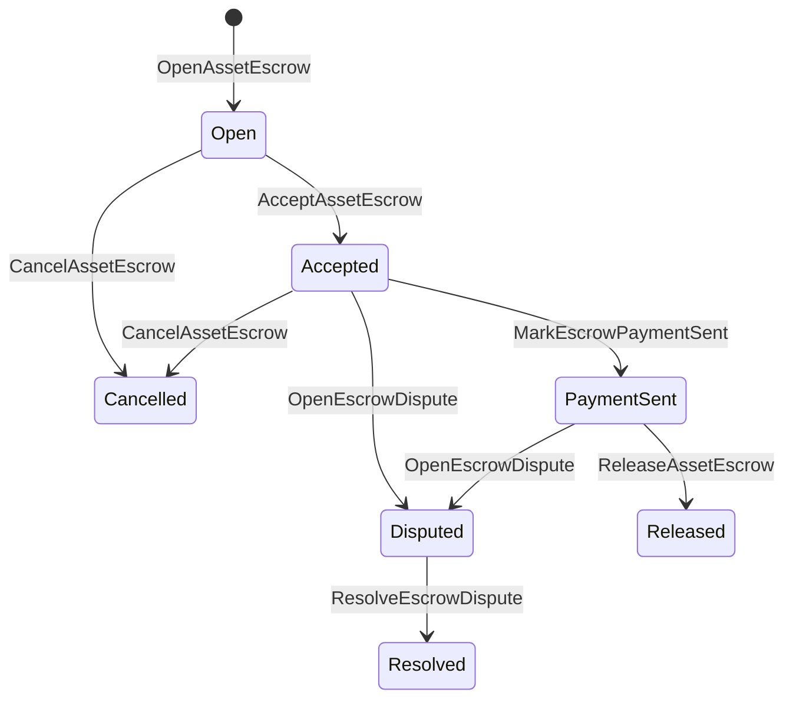

# རང་སོའི་རྒྱུ་དངོས་ཚུ་གི་ ཉེན་སྲུང་འབད་ཐབས། {#native-asset-escrow}

ནང་སྐྱེས བར་གཏོགས་བདག་ཉར འདི་ཨང་གྲངས་རྩིས་ཀྱི་ རྒྱུ་དངོས་ཚུ་གི་དོན་ལུ་ ལེ་ཇར་གིས་ འཛིན་སྐྱོང་འབད་ཡོད་པའི་ བདག་འཛིན་ལམ་ལུགས་ཅིག་ཨིན། དེ་ཚབ་ལུ་ ལག་ལེན་གྱི་བདག་དབང་གི་རྩིས་ཐོ་ལུ་ རྒྱུ་དངོས་ཚུ་བཏང་ནི་དང་ ཐབས་ཤེས་ལག་ལེན་ཡིག་ཚང་ལུ་ བློ་གཏད་ནི་དེ་རྩིས་ཐོ་སྲུང་ནིའི་དོན་ལུ་ཨིན། བར་གཏོགས་བདག་ཉར ISIs གིས་ གནས་གོང་འདི་ གཏན་འཁེལ་ཅན གནས་སྤོ་ལམ་ལུགས བདག་ཉར རྩིས་ཐོ ལུ་སྤོ་བཤུད་འབད་ཞིནམ་ལས་ འཛམ་གླིང་གནས་སྟངས་ནང་ བར་གཏོགས་བདག་ཉར གི་ཚེ་རིང་སླར་ལོག་འབདཝ་ཨིན།

ནང་སྐྱེས བར་གཏོགས་བདག་ཉར འདི་ ཚོང་ར རྩིས་རྒྱག, Aitai-བཟོ་རྣམ སྡེབ་ཐག་ཕྱི་ཁར དངུལ་སྤྲོད མཐུན་སྒྲིག, དམིགས་ཚད་གནས བཀག་སྡོམ དང་ རྩིས་དེབ ནང་མཐོང་ཚུགས་པའི་ ཚེ་རིམ གནས་སྟངས དགོ་པའི་ ཉེན་སྲུང་ཅན བར་གཏོགས་བདག་ཉར ལཱ་རྒྱུན ཚུ་ལུ་ལག་ལེན་འཐབ།

## བསམ་འཆར་ཚུ་ {#concepts}

| བསམ་གཞི་ | འགྲེལ་བཤད། |
| --- | --- |
| `EscrowId` | ཁ་སླབ་མི་གིས་སེལ་འཐུ་འབད་ཡོད་པའི་ངོས་འཛིན་པ་གིས་ ཧེཤ་ཅིག་བསྡམ་བཞགཔ་ཨིན། དྭངས་གསལ་དང་མིང་མེད་པའི་ བཀག་ཆ་ཚུ་གི་བར་ན་ ཁྱད་པར་ཅན་ཅིག་འོང་དགོ། |
|`AssetEscrowRecord` |དྭངས་འཕྲོས་སྦེ་མཐོང་མི་ ཨང་གྲངས་ཅན་གྱི་ རྒྱུ་དངོས་གི་ གཏན་འཁེལ་ ཡང་ན་བཀག་སྡོམ་རྩིས་ཐོ་ |
| `AnonymousAssetEscrowRecord` | ཆ་མེད་བཏང་མི་དང་ ཁས་བླངས་ དེ་ལས་ བདེན་ཁུངས་མཉམ་སྦྲགས་ཚུ་གིས་ རྒྱབ་སྐྱོར་འབད་མི་ བཀག་ཆ་འབད་ཡོད་པའི་ བཀག་འཛིན་ཐོ་བཀོད་ཚུ། |
| བདག་འཛིན་རྩིས་ཐོ་ | རིམ་སྒྲིག་ཨའི་ཌི་དང་ ཨེསི་ཀོརོ་ཨའི་ཌི་ དེ་ལས་ རྒྱུ་དངོས་ངེས་ཚིག་ལས་ འབྱུང་མི་ གཏན་འབེབས་མཐུན་སྒྲིག་རྩིས་ཐོ། |
| སྒྲུབ་བྱེད་ བསྡུས་རྟགས་ཚུ | སྒྲུབ་བྱེད་ཀྱི་ཧ་ཤི་ཚུ་གིས་ བྱུང་འཛིན་དང་ ཐག་བཅད་ བརྡ་འཕྲིན་ གསོག་འཇོག་གསལ་བསྒྲགས་ ཡང་ན་ གཞན་མི་རྒྱུན་རིམ་མེད་པའི་སྒྲུབ་བྱེད་ཚུ་ངོས་འཛིན་འབད་ཚུགས། སྒྲུབ་བྱེད་ཀྱི་ནང་དོན་གནད་སྡུད་འདི་རང་ ཨེསི་ཀོརོ་དྲན་ཐོ་ནང་ གསོག་འཇོག་འབད་དེ་མེདཔ་ཨིན། |

དྭངས་གསལ་གྱི་ཐོ་བཀོད་ཚུ་གིས་ བཙོང་མི་དང་ གདམ་ཁ་ཅན་ཉོ་མི་ རྒྱུ་དངོས་ངེས་ཚིག་ དངུལ་འབོར་ཡོངས་བསྡོམས་ བདག་འཛིན་རྩིས་ཐོ་ མི་ཚེ་འཁོར་རིམ་གནས་རིམ་ སྤྱོད་ལམ་གྱི་རིགས་ ལྷག་ལུས་དངུལ་འབོར་ གདམ་ཁ་ཅན་གྱི་གསར་བཏོན་དབང་ཚད་ གདམ་ཁ་ཅན་གྱི་དུས་ཚོད་རྫོགས་པའི་དུས་ཚོད་ སྒྲུབ་བྱེད་ཀྱི་ཧ་ཤི་ དུས་ཚོད་ཀྱི་རྟགས་མཚན་ དེ་ལས་ གདམ་ཁ་ཅན་གྱི་གྲོས་ཆོད་ཚུ་ འབག་འོང་།

བར་གཏོགས་བདག་ཉར འབོར༌ཚད༌ ཚུ་ ཕན་ཐོགས་ཡོད་པའི་ ཨང་གྲངས རྒྱུ་དངོས འབོར་ཚད་ ཨིན་དགོ་ དེ་ལས་ རྒྱུ་དངོས ངེས་ཚིག་ གི་ ཨང་གྲངས གསལ་བསྒྲགས དང་མཐུན་དགོ། བར་གཏོགས་བདག་ཉར ཡང་ན་ ལྡེ༌མིག༌ ཤུགས་ལྡན་སྦེ་ཡོདཔ་ད་ སྤྱིར་བཏང་ རྒྱུ་དངོས གནས་སོར་ གིས་ བདག་ཉར རྩིས་ཐོ སྟོངམ་བཏོན་མི་ཚུགས། བདག་ཉར ལས་ཐོན་ནིའི་ལམ་ཚུ་ འོག་ལུ་བཤད་པའི་ བར་གཏོགས་བདག་ཉར ISIs ཚུ་ཨིན།

## ཚོང་འབྲེལ་ས་ཁོངས་གི་དངུལ་ཁང་ {#marketplace-escrow}

ཁྲོམ་སྡེའི་ བཀག་ཆ་གིས་ རྒྱུན་རིམ་ནང་ རྒྱུ་དངོས་བཏོན་མི་འདི་ རྒྱུན་རིམ་ཕྱི་ཁར་ དངུལ་སྤྲོད་ནི་དང་ ཡང་ན་ སྐྱེལ་འདྲེན་གྱི་ ལཱ་གི་རྒྱུན་རིམ་དང་གཅིག་ཁར་ མཉམ་འབྲེལ་འབདཝ་ཨིན།



| ISI | ག་གིས་ཕུལ་ཡི་ག་ | ནུས་པ། |
| --- | --- | --- |
|`OpenAssetEscrow` |ཚོང་བཙོང་པ་ |ཚོང་པ་གི་ཨང་གྲངས་ཅན་གྱི་ རྒྱུ་དངོས་ཚུ་ ཐོ་བཀོད་ལམ་ལུགས་ནང་བཞག་ཞིནམ་ལས་ `Open` ཚོང་ཁྲོམ་གྱི་ཐོ་ཡིག་བཟོ་ཡོདཔ་ཨིན།|
| `AcceptAssetEscrow` | ཉོ་མཁན། | ཉོ་མི་འདི་དྲན་ཐོ་བཀོད་ཞིནམ་ལས་ `Open` འདི་ `Accepted` ལུ་སྤོ་བཤུད་འབདཝ་ཨིན། བཙོང་མི་གིས་ ཁོང་རའི་ བཀག་ཆ་འདི་ ངོས་ལེན་འབད་མི་ཚུགས། |
|`MarkEscrowPaymentSent` |ངོས་ལེན་འབད་མི་ཉོ་མི་ |`Accepted`ལུ་ `PaymentSent`སྦེ་སྤོ་བཤུད་འབད་ཞིནམ་ལས་ ཉོ་མི་གིས་ གྲལ་ཐིག་གི་ཕྱི་ཁར་སྤྲོད་དེ་བཏང་ཚར་བའི་ཤུལ་ལས་ཨིན། |
| `ReleaseAssetEscrow` | བཙོང་མཁན། | `PaymentSent` འདི་ `Released` ལུ་སྤོ་བཤུད་འབདཝ་ཨིནམ་དང་ ཉོ་མི་ལུ་ བཀག་ཆ་འབད་ཡོད་པའི་དངུལ་བསྡོམས་འདི་སྤོ་བཤུད་འབདཝ་ཨིན། |
| `CancelAssetEscrow` | བཙོང་མཁན། | `Open` ཡང་ན་ `Accepted` འདི་ `Cancelled` ལུ་སྤོ་བཤུད་འབདཝ་ཨིནམ་དང་ གླ་ཆ་རྟགས་མ་བཀལ་བའི་ཧེ་མ་ བཙོང་མི་ལུ་ དངུལ་ལོག་སྤྲོདཔ་ཨིན། |
| `OpenEscrowDispute` | བཙོང་པའམ་ཡང་ན་ངོས་ལེན་བྱས་པའི་ཉོ་མཁན། | `Accepted` ཡང་ན་ `PaymentSent` འདི་ `Disputed` ལུ་སྤོ་བཤུད་འབདཝ་ཨིནམ་དང་ སྒྲུབ་བྱེད་ཧ་ཤི་ཚུ་མཉམ་སྦྲགས་འབདཝ་ཨིན། |
|`ResolveEscrowDispute` |`CanResolveEscrowDispute` དང་གཅིག་ཁར་རྩིས་སྤྲོད་འབདཝ་ཨིན།|`Disputed`ལུ་ `Resolved`སྦེ་སྤོ་བཤུད་འབད་ཞིནམ་ལས་ ཉོ་མི་དང་བཙོང་མི་གི་བར་ན་ བགོ་བཀྲམ་འབད་འབདཝ་ཨིན། |

འཁྲུན་ཆོད་ཀྱི་གནས་ཚད་འདི་ མེད་ཆ མེན་དགོཔ་ཨིན་ དེ་ལས་ `buyer_amount + seller_amount` གིས་ གཏན་འཁེལ་གྱི་གནས་གོང་དང་འདྲན་འདྲ་ཨིན། ཟད་འགྲོ་བཏང་མི་རྐ་ཚུ་ ཆ་འཇོག་འབད་ཡོདཔ་ཨིན་རུང་ དབྱེ་བ་ཆ་མཉམ་གྱིས་ ཟམ་བཞག་ཡོད་པའི་ལྷག་ལུས་ལུ་རྩིས་དགོཔ་ཨིན་མས།

### Rust དཔེ་སྟོན་འབདཝ་ཨིན། {#rust-example}

དཔེ་འདི་གིས་ བཙོང་མི་དང་ཉོ་མི་གི་རྩིས་ཐོ་ཚུ་ཧེ་མ་ལས་ཡོདཔ་སྦེ་ བསམ་ཞིབ་འབདཝ་ཨིན་ རྒྱུ་དངོས་ངེས་ཚིག་འདི་ཨང་གྲངས་སྦེ་ཐོ་བཀོད་འབད་ཡོདཔ་དང་ བཙོང་མི་ལུ་ལྷག་ལུས་ལངམ་སྦེ་ཡོདཔ་ཨིན།

```rust
use iroha::{
    client::Client,
    data_model::{
        isi::escrow::{
            AcceptAssetEscrow, MarkEscrowPaymentSent, OpenAssetEscrow,
            ReleaseAssetEscrow,
        },
        prelude::*,
    },
};
use iroha_crypto::Hash;

fn release_marketplace_escrow(
    seller_client: &Client,
    buyer_client: &Client,
    asset_definition_id: AssetDefinitionId,
) -> eyre::Result<()> {
    let escrow_id = EscrowId::new(Hash::new("docs-marketplace-escrow-001"));

    seller_client.submit_blocking(OpenAssetEscrow::with_evidence_hashes(
        escrow_id,
        asset_definition_id,
        Numeric::from(40_u64),
        vec![Hash::new("invoice:2026-001")],
    ))?;

    buyer_client.submit_blocking(AcceptAssetEscrow::new(escrow_id))?;
    buyer_client.submit_blocking(MarkEscrowPaymentSent::new(escrow_id))?;
    seller_client.submit_blocking(ReleaseAssetEscrow::new(escrow_id))?;

    let record = seller_client.query_single(FindAssetEscrowById::new(escrow_id))?;
    assert_eq!(record.status, AssetEscrowStatus::Released);
    assert_eq!(record.remaining_amount, Numeric::zero());

    Ok(())
}
```

## སྤྱིར་བཏང་ རྒྱུ་དངོས་ཀྱི་བཀག་སྡོམ་ཚུ་ {#generic-asset-locks}

ཨེསི་ཀྲེཊི་ ལོཀསི་ (རྒྱུ་དངོས བཀག་སྡོམ་ཚུ) གིས་ བདག་འཛིན་གྱི་ཐོ་ཡིག་གི་དབྱེ་བ་དེ་ ལག་ལེན་འཐབ་དོ་ཡོདཔ་ཨིན་རུང་ ཁོང་ཉོ་མི་དང་བཙོང་མི་གིས་ གྲོས་འདེབས་མ་འབད་བར་སྡོད་ཡོདཔ་ཨིན། ཁོང་གིས་ འོང་སའི་རྩིས་ཐོ་གི་དོན་ལུ་ མ་དངུལ་ཚུ་ལྡོག་སྟེ་བཞག་དོ་ཡོདཔ་མ་ཚད་ མ་དངུལ་བཏོན་ནིའི་དོན་ལུ་ རང་སོའི་དབང་འཛིན་ཅིག་ལུ་ དགོངས་ཞུ་འབད་དགོཔ་ཨིན།

| ISI | ག་གིས་ཕུལ་ཡི་ག་ | ནུས་པ། |
| --- | --- | --- |
|`OpenAssetLock` |གཞི་རྟེན་རྩིས་ཐོ་ |གྲུབ་འབྲས་ཐོན་པའི་དངུལ་ཕོགས་འབད། ཐོ་བཀོད་འབད་སའི་ས་ཁོངས་འདི་ གཏན་འཁེལ་གྱི་ཉོ་མི་སྦེ་རྩིས་རྐྱབ་ཞིནམ་ལས་ གནས་སྟངས་དེ་ `Locked` ལུ་ གཞི་སྒྲིག་འབདཝ་ཨིན།|
| `DrawdownAssetLock` | བཏོན་གཏང་དབང་ཚད་ ཡང་ན་ བཏོན་གཏང་དབང་ཚད་གཞི་སྒྲིག་མ་འབད་བའི་སྐབས་ འགྲོ་ཡུལ་ | ལྷག་ལུས་བདག་འཛིན་གྱི་ཆ་ཤས་ཡང་ན་ཆ་མཉམ་ འགྲོ་ཡུལ་ལུ་སྤོ་བཤུད་འབདཝ་ཨིན། |
|`CancelAssetLock` |ལོགསི་སྒོ་ཕྱེ་པ་ |ལཱ་འབད་ཡོད་པའི་བཀག་སྡོམ་ཅིག་ ཆ་མེད་གཏང་ནི་དང་ ལྷག་ལུས་ཡོད་མི་དེ་ སྒོ་ཕྱེ་མི་ལུ་ལོག་གཏངམ་ཨིན། |
|`ExpireAssetLock` |ཚོང་འབྲེལ་གྱི་དབང་འཛིན་ཚུ་ དུས་ཡུན་ཚང་བའི་ཤུལ་ལས་ |ཧེ་མ་ `expires_at_ms` ལུ་བཀག་སྡོམ་བཙུགས་ཏེ་བཞག་མི་དེ་མཇུག་བསྡུ་ཞིནམ་ལས་ ལྷག་ལུས་ཀྱི་དངུལ་དེ་ སྒོ་ཕྱེ་མི་ལུ་ལོག་གཏངམ་ཨིན། |

`DrawdownAssetLock` གིས་ཐོ་ཡིག་འདི་ `Locked` ལུ་བཞག་དོ་ཡོདཔ་ད་ གནས་གོང་ཅིག་ར་ བཞག་ཡོདཔ་ཨིན། ལྷག་ལུས་ཡོད་མི་དེ་ ༠ ལུ་ལྷོད་པའི་བསྒང་ལས་ གནས་སྟངས་དེ་ `DrawnDown` སྦེ་འགྱུར་ཏེ་ ཐོ་བཀོད་འབད་ཚར་འོང་།

```rust
use iroha::{
    client::Client,
    data_model::{
        isi::escrow::{CancelAssetLock, DrawdownAssetLock, ExpireAssetLock, OpenAssetLock},
        prelude::*,
    },
};
use iroha_crypto::Hash;

fn drawdown_and_close_asset_locks(
    opener_client: &Client,
    destination_client: &Client,
    release_authority_client: &Client,
    asset_definition_id: AssetDefinitionId,
    destination: AccountId,
    release_authority: AccountId,
) -> eyre::Result<()> {
    let trusted_lock_id = EscrowId::new(Hash::new("docs-asset-lock-trusted"));

    opener_client.submit_blocking(OpenAssetLock::with_options(
        trusted_lock_id,
        asset_definition_id.clone(),
        destination.clone(),
        Numeric::from(40_u64),
        Some(release_authority),
        None,
        vec![Hash::new("milestone-plan-v1")],
    ))?;

    release_authority_client.submit_blocking(DrawdownAssetLock::new(
        trusted_lock_id,
        Numeric::from(15_u64),
    ))?;

    let partially_drawn =
        opener_client.query_single(FindAssetEscrowById::new(trusted_lock_id))?;
    assert_eq!(partially_drawn.status, AssetEscrowStatus::Locked);
    assert_eq!(partially_drawn.remaining_amount, Numeric::from(25_u64));

    opener_client.submit_blocking(CancelAssetLock::new(trusted_lock_id))?;
    let cancelled = opener_client.query_single(FindAssetEscrowById::new(trusted_lock_id))?;
    assert_eq!(cancelled.status, AssetEscrowStatus::Cancelled);

    let expiring_lock_id = EscrowId::new(Hash::new("docs-asset-lock-expiring"));
    opener_client.submit_blocking(OpenAssetLock::with_options(
        expiring_lock_id,
        asset_definition_id,
        destination,
        Numeric::from(10_u64),
        None,
        Some(0),
        Vec::new(),
    ))?;

    destination_client.submit_blocking(ExpireAssetLock::new(expiring_lock_id))?;
    let expired = opener_client.query_single(FindAssetEscrowById::new(expiring_lock_id))?;
    assert_eq!(expired.status, AssetEscrowStatus::Expired);

    Ok(())
}
```

Python ད་རེས་ནངས་པར་ སྤྱིར་བཏང བཀག་སྡོམ ཚུ་གི་དོན་ལུ་ མཐོ་རིམ་གནས་ཚད་ཀྱི་ རྒྱབ་སྐྱོར་འབད་མི་ཚུ་ལུ་ ཁྱབ་སྤེལ་འབདཝ་ཨིན། `open_asset_lock`, `drawdown_asset_lock`, `cancel_asset_lock`, དང་ `expire_asset_lock`. ཚོང་འབྲེལ་གྱི་ས་ཁོངས་དང་མིང་མ་ཤེསཔ་གི་རྒྱབ་སྐྱོར་ལས་ Python, ལག་ལེན་འཐབ་ཐངས་ཚུ་ `InstructionBox` JSON རྒྱུད་ལས་ SDK འདི་ JSON འོག་ཐལ་ཐབ་ ཡང་ན་བརྒྱུད་དེ་ ཕུལ འབད་ནི་ SDK ཨང་དང་པ་གི་དངུལ་ཁང་བཟོ་སྐྲུན་འབད་མི་ཚུ་ལུ་ གསལ་སྟོན་འབདཝ་ཨིན།

## འཐབ་འཛིང་ {#disputes}

ཚོང་འབྲེལ་ས་ཁོངས་གི་གཏའ་མ་གིས་ རྩོད་གཞི་འདི་ `Accepted` ཡང་ན་ `PaymentSent` ལས་བཙུགས་ཚུགས། ཐོ་བཀོད་འབད་མི་བཙོང་མི་དང་ཉོ་མི་རྐྱངམ་གཅིག་གིས་ རྩོད་གཞི་དེ་ཕྱེ་ཚུགས། གྲོས་ཐག་བཅད་ནི་ལུ་ དགོཔ་ཨིན། `CanResolveEscrowDispute` འདི་ ཡང་ཅིན་ སེལ་བྱེདརྩིས་ཐོ་ལུ་ཐད་ཀར་དུ་བྱིན་པའམ། ཡང་ན་འགན་ཁུར་གྱི་ཐོག་ལས་ཐོབ་ཡོདཔ་ཨིན།

```rust
use iroha::{
    client::Client,
    data_model::{
        isi::escrow::{OpenEscrowDispute, ResolveEscrowDispute},
        prelude::*,
    },
};
use iroha_crypto::Hash;
use iroha_executor_data_model::permission::escrow::CanResolveEscrowDispute;

fn resolve_disputed_escrow(
    admin_client: &Client,
    buyer_client: &Client,
    court_client: &Client,
    court: AccountId,
    escrow_id: EscrowId,
) -> eyre::Result<()> {
    admin_client.submit_blocking(Grant::account_permission(
        Permission::from(CanResolveEscrowDispute),
        court,
    ))?;

    buyer_client.submit_blocking(OpenEscrowDispute::with_evidence_hashes(
        escrow_id,
        vec![Hash::new("buyer-payment-receipt")],
    ))?;

    court_client.submit_blocking(ResolveEscrowDispute::with_evidence_hashes(
        escrow_id,
        Numeric::from(30_u64),
        Numeric::from(10_u64),
        vec![Hash::new("court-judgement-001")],
    ))?;

    let record = admin_client.query_single(FindAssetEscrowById::new(escrow_id))?;
    assert_eq!(record.status, AssetEscrowStatus::Resolved);
    assert_eq!(
        record.resolution.as_ref().map(|resolution| resolution.buyer_amount.clone()),
        Some(Numeric::from(30_u64)),
    );

    Ok(())
}
```

## མིང་མེད་པའི་བཅོལ་བཞག་ {#anonymous-escrow}

མིང་མེད་པའི་ཨེས་ཀོ་རོ་གིས་ ཁྲོམ་གྱི་མི་ཚེ་འཁོར་རིམ་གཅིག་མཚུངས་ལག་ལེན་འཐབ་ཨིན་རུང་ མ་དངུལ་དང་ མཇུག་བསྡུའི་རྒྱུ་དངོས་འགུལ་སྐྱོད་འདི་ བཀག་འཛིན་འབདཝ་ཨིན། མི་མང་གི་ཐོ་བཀོད་འདི་གིས་ ད་ལྟོ་ཡང་ བཙོང་མི་དང་ ཉོ་མི་ གནས་རིམ་ སྒྲུབ་བྱེད་ཀྱི་ཧ་ཤི་ དུས་ཚོད་ཀྱི་རྟགས་མཚན་ དེ་ལས་ སྒྲུབ་བྱེད་འབྲེལ་མཐུད་ཡོད་པའི་འགུལ་སྐྱོད་ཀྱི་ཐོ་བཀོད་ཚུ་ གསོག་འཇོག་འབདཝ་ཨིན། བཀག་ཆ་འབད་ཡོད་པའི་དྲན་ཐོ་ནང་ལུ་ཡོད་པའི་ དངུལ་འབོར་དང་ ཐོབ་མི་ཚུ་ ཁས་བླངས་དང་ ཆ་མེད་བཏང་མི་ དེ་ལས་ བདེན་ཁུངས་མཉམ་སྦྲགས་ཚུ་གིས་ ངོས་འཛིན་འབདཝ་ཨིན།

|གསལ་ཏོག་ཏོ་སྦེ་ ISI |མིང་མ་ཤེསཔ་ ISI|
| --- | --- |
| `OpenAssetEscrow` | `OpenAnonymousAssetEscrow` |
| `AcceptAssetEscrow` | `AcceptAnonymousAssetEscrow` |
| `MarkEscrowPaymentSent` | `MarkAnonymousEscrowPaymentSent` |
| `ReleaseAssetEscrow` | `ReleaseAnonymousAssetEscrow` |
| `CancelAssetEscrow` | `CancelAnonymousAssetEscrow` |
| `OpenEscrowDispute` | `OpenAnonymousEscrowDispute` |
| `ResolveEscrowDispute` | `ResolveAnonymousEscrowDispute` |

དངུལ་ཁུག་ཡང་ན་ བདེན་ཁུངས་ལག་ཆས་ཚུ་གིས་ བདེན་ཁུངས་མཉམ་སྦྲགས་དང་ མི་མང་གི་ འབྲེལ་གཏུག་ཚུ་ བཟོ་བསྐྲུན་འབད་དགོ། ཁ་ཕྱེ་མི་འདི་གིས་ བཀག་ཆ་ཁས་བླངས་གཅིག་བཟོཝ་ཨིན། བཏོན་གཏང་ནི་དང་ ཆ་མེད་གཏང་ནི་ དེ་ལས་ མིང་མ་བཀོད་པའི་རྩོད་རྙོག་སེལ་ཐབས་ལུ་ གཏན་གཏན་སྦེ་ བཀག་ཆ་ཁས་བླངས་གཅིག་ ཟད་འགྲོ་བཏང་དགོཔ་མ་ཚད་ བྱ་བ་འདི་གིས་ དགོ་པའི་ ཉོ་མི་དང་ བཙོང་མི་ ཡང་ན་ ཐོན་འབྲས་ཁས་བླངས་ཚུ་ བགོ་བཤའ་རྐྱབ་དགོཔ་ཨིན།

```rust
use iroha::{
    client::Client,
    data_model::{
        isi::escrow::{
            AcceptAnonymousAssetEscrow, MarkAnonymousEscrowPaymentSent,
            OpenAnonymousAssetEscrow,
        },
        prelude::*,
        proof::ProofAttachment,
    },
};
use iroha_crypto::Hash;

fn open_anonymous_escrow(
    seller_client: &Client,
    buyer_client: &Client,
    escrow_id: EscrowId,
    asset_definition_id: AssetDefinitionId,
    funding_nullifiers: Vec<[u8; 32]>,
    escrow_commitment: [u8; 32],
    proof: ProofAttachment,
    root_hint: Option<[u8; 32]>,
) -> eyre::Result<()> {
    seller_client.submit_blocking(OpenAnonymousAssetEscrow::with_evidence_hashes(
        escrow_id,
        asset_definition_id,
        funding_nullifiers,
        escrow_commitment,
        proof,
        root_hint,
        vec![Hash::new("shielded-invoice")],
    ))?;

    buyer_client.submit_blocking(AcceptAnonymousAssetEscrow::new(escrow_id))?;
    buyer_client.submit_blocking(MarkAnonymousEscrowPaymentSent::new(escrow_id))?;

    Ok(())
}
```

གཞི་རྟེན་གི་ ཉེན་སྲུང་ཅན་གྱི་ཚོང་འབྲེལ་གྱི་རྣམ་གཞག་ལུ་བལྟ་བ་ཅིན་ [རྣམ་རྟོག་ཅན་གྱི་ཚོང་འབྲེལ་ཚུ་](/dz/blockchain/anonymous-transactions.md).

## SDK ལག་ལེན་འཐབ་ནི་ {#sdk-usage}

བར་གཏོགས་བདག་ཉར རྒྱབ་སྐྱོར འདི་ SDKs སོ་སོ་ནང་མ་འདྲཝ་སྦེ་བཏོནམ་ཨིན། Rust ལུ་ ཚད་ལྡན དབྱེ་བ་ཅན གནད་སྡུད དཔེ་ཚད ཡོད། Python གིས་ ད་ལྟོ་ སྤྱིར་བཏང རྒྱུ་དངོས-བཀག་སྡོམ རོགས་ལས་རིམ ཚུ་བཏོནམ་ཨིན། JavaScript དང་ TypeScript གིས་ Kotodama བར་གཏོགས་བདག་ཉར མགྲོན་སྐྱོང་གློག་འཕྲུལ ལས་རིམ་འབོད ལག་ལེན་འཐབ། Kotlin/JVM དང་ Swift གིས་ ཚོང་ར དང་ མིང་མེད བར་གཏོགས་བདག་ཉར ལུ་ དབྱེ་བ་ཅན ནང་དོན་གནད་སྡུད བཟོ་བྱེད སྤྲོདཔ་ཨིན།

| SDK | ཁ་ཐོག་འདི་ལག་ལེན་འཐབ། | ཁྱབ་ཁོངས། |
| --- | --- | --- |
| [Rust](#rust-sdk) |`iroha::data_model::isi::escrow` |ཚོང་ཁང་གི་བར་གཏོགས་བདག་ཉར་ཐོ་བཀོད་, སྤྱིར་བཏང་བཀག་སྡོམ་ཚུ་, རྣམ་རྟོག་ཅན་གྱི་བར་གཏོགས་བདག་ཉར་, དྲི་བཀོད་དང་ ལས་རིམ་ཚུ་ |
| [Python](#python-asset-locks) |`Instruction.open_asset_lock`, `TransactionDraft.open_asset_lock`, དེ་ལས་མགྲོན་པ་ `*_and_wait` ཚུ་གི་ཆ་རོགས་འབད་མི་ཚུ་ |སྤྱིར་བཏང་གི་རྒྱུ་དངོས་ཀྱི་བཀག་སྡོམ་ཚུ་ ཚོང་འབྲེལ་ས་ཁོངས་དང་མིང་མ་ཤེསཔ་གི་རྒྱབ་སྐྱོར་གྲོགས་རམ་འདི་ ཧེ་མ་ལས་ Python ཐབས་ལམ་ཚུ་མེདཔ། |
| [JavaScript / TypeScript](#javascript-and-typescript-kotodama) |`compileKotodamaProgram` ལས་ `@iroha/iroha-js/kotodama-compiler` |Kotodama ལས་བྱེདཔ་ཚུ་གི་ནང་འཁོད་ལུ་ བར་གཏོགས་བདག་ཉར འགོ་འདྲེན་འཐབ་མི་ གྱི་ཁ་འབད། |
| [Kotlin / JVM](#kotlin-and-jvm) |`InstructionTemplate` ནང་གི་དབྱེ་བ་ཚུ་ནང་ `org.hyperledger.iroha.sdk.core.model.instructions` |ཚོང་ཁང་དང་མིང་མ་ཤེསཔ་གི་བར་གཏོགས་བདག་ཉརའི་བརྡ་སྟོན་ཚུ་ ཨིན།|
| [Swift / iOS](#swift-and-ios) |`NativeEscrowInstructionBuilders`དང་ `IrohaSDK.build*Escrow*` ཆ་རོགས་འབད་མི་ཚུ་|ཚོང་འབྲེལ་ས་ཁོངས་དང་ གསང་བའི་རྩིས་ཐོ་ Norito JSON སྟོན་ཐོ་བཀོད་འབད་ཐངས་ཚུ་ཨིན། |

འོག་གི་དཔེ་སྟོན་འདི་ བརྡ་བཀོད་བཟོ་སྐྲུན་ལུ་ གཙོ་བོར་བཏོན་དོ་ཡོདཔ་ཨིན། རྩིས་ཐོ་དངུལ་, ལག་ལེན་འཛིན་སྐྱོང་དང་ བྱ་སྟབས་མ་བདེཝ་ཚུ་ བཏབ་ནི་དེ་ SDK གྱི་ཐད་ཁར་ རང་བཞིན་གནས་སྟངས་དང་འཁྲིལ་ཏེ་ཨིན་མས།

### Rust SDK {#rust-sdk}

ཁྱོད་ཀྱིས་ Rust SDK ལག་ལེན་འཐབ་ད་ ཁྱོད་ཀྱིས་ རང་བཞིན་གྱི་ཁྱབ་བསྒྲགས་ཆ་ཚང་དང་ ཡང་ན་ དྲི་བ་/དོན་རྐྱེན་ཚུ་གི་ རྒྱབ་སྐྱོར་དགོ་པའི་སྐབས་ ལག་ལེན་འཐབ་ཨིན། གོང་གི་དཔེ་ཁྲ་ཚུ་ནང་ `iroha::data_model::isi::escrow` དང་གཅིག་ཁར་ཚོང་འབྲེལ་གནས་སྟངས་སེལ་འཐུ་འབད་ཐབས། སྤྱིར་བཏང་སྒོ་དམ་ཁ་བཏོན་ཐབས། རྩོད་རྙོགས་སེལ་ཐབས། དེ་ལས་མིང་མ་ཤེསཔ་སྦེ་བཞག་སའི་བཟོ་སྐྲུན་འབདཝ་ཨིན།

```rust
use iroha::{
    client::Client,
    data_model::{isi::escrow::OpenAssetEscrow, prelude::*},
};
use iroha_crypto::Hash;

fn open_and_read(
    client: &Client,
    asset_definition_id: AssetDefinitionId,
) -> eyre::Result<AssetEscrowRecord> {
    let escrow_id = EscrowId::new(Hash::new("docs-rust-sdk-escrow"));

    client.submit_blocking(OpenAssetEscrow::new(
        escrow_id,
        asset_definition_id,
        Numeric::from(10_u64),
    ))?;

    client.query_single(FindAssetEscrowById::new(escrow_id))
}
```

### Python རྒྱུ་དངོས་ཀྱི་བཀག་སྡོམ་ཚུ་ {#python-asset-locks}

Python SDK གིས་ ཨང་དང་པ་གི་ རྒྱབ་སྐྱོར་ཚུ་ལུ་ སྤྱིར་བཏང་ནོར་གྱི་བཀག་སྡོམ་ཚུ་གི་དོན་ལུ་ གསལ་སྟོན་འབདཝ་ཨིན། འདི་ཚུ་ མཚམས་འཇོག་དབང་འཛིན་གྱིས་བཏོན་མི་དངུལ་ཕོགས་དང་ སྒོ་བསྡམ་མི་ཚུ་གིས་ ཆ་མེད་གཏང་ནི་དང་ དུས་ཡུན་ཚང་བའི་རྒྱབ་སྐྱོར་ཚུ་གི་དོན་ལུ་ ལག་ལེན་འཐབ་དགོ།

```python
client.open_asset_lock_and_wait(
    chain_id="dev-chain",
    authority="<source-account-id>",
    private_key_hex="<source-private-key-hex>",
    escrow_id="merchant-lock-001",
    asset_definition_id="<asset-definition-base58>",
    destination="<destination-account-id>",
    amount="2500",
    release_authority="<trusted-release-account-id>",
    expires_at_ms=1_704_000_000_000,
)

client.drawdown_asset_lock_and_wait(
    chain_id="dev-chain",
    authority="<trusted-release-account-id>",
    private_key_hex="<trusted-release-private-key-hex>",
    escrow_id="merchant-lock-001",
    amount="1000",
)

client.expire_asset_lock_and_wait(
    chain_id="dev-chain",
    authority="<any-account-id>",
    private_key_hex="<any-private-key-hex>",
    escrow_id="merchant-lock-001",
)
```

ཐོ་བཀོད་རྒྱབ་སྐྱོར་གྱི་དོན་ལུ་ `release_authority` བཏོན་གཏང་། ཤུལ་མའི་རྩིས་ཐོ་དེ་ `drawdown_asset_lock` ཕུལ་ཚུགས།

### JavaScript དང་TypeScript Kotodama {#javascript-and-typescript-kotodama}

JavaScript SDK གིས་ ད་རེས་ ཐད་ཀར་དུ་ རང་སོའི་བར་གཏོགས་བདག་ཉར གི་ཚོང་འབྲེལ་བཟོ་སྐྲུན་འབད་མི་ཚུ་ལུ་ གསལ་སྟོན་མ་འབདཝ་ཨིན། JavaScript ཡང་ན་ TypeScript གི་ལག་ལེན་ཚུ་གི་དོན་ལུ་ Kotodama ཀྱི་འཆིང་ཡིག་ཚུ་སྤེལ་འབད་ནིའི་དོན་ལས་ Kotodama སྒྲིག་སྒྲོམ་དང་གཅིག་ཁར་བར་གཏོགས་བདག་ཉར གི་མགྲོན་པོ་གི་འབོ་ནི་ཚུ་ བསྡུ་སྒྲིག་འབད།

ནང་སྐྱེས བར་གཏོགས་བདག་ཉར མགྲོན་སྐྱོང་གློག་འཕྲུལ ལས་རིམ་འབོད་ཚུ གིས་ གསལ་བཀོད འཛུལ་སྤྱོད བརྡ་སྟོན་ཚུ དགོཔ་ཨིན་ ག་ཅི་སྨོ་ཟེར་བ་ཅིན་ སྒྱུར་བྱེད གིས་ མཐོང་མེད བར་གཏོགས་བདག་ཉར ISIs གི་དོན་ལུ་ ཁྱབ་ཚད་ཆུང་བ འཛུལ་སྤྱོད ཚན ཚུ་བཏོན་མ་ཚུགསཔ་ཨིན། ཕྱིར་འདྲེན འཛུལ་ས ལུ་ ག་ར་མཚོན་རྟགས བརྡ་སྟོན་ཚུ ལག་ལེན་འཐབ་ནི་ འདི་གིས་ `escrow_*` ནང་སྐྱེས་བྱ་རིམ བཏོན་འོང་།

```js
import { compileKotodamaProgram } from "@iroha/iroha-js/kotodama-compiler";

const source = `
seiyaku MarketplaceEscrow {
  meta { abi_version: 1; }

  #[access(read="*", write="*")]
  kotoage fn run() permission(Admin) {
    let asset = asset_definition("62Fk4FPcMuLvW5QjDGNF2a4jAmjM");
    let offer = name("aitai_offer");
    let evidence = norito_bytes("00");

    call escrow_open_offer(offer, asset, 10, evidence);
    call escrow_accept(offer);
    call escrow_mark_payment_sent(offer);
    call escrow_release(offer);
  }
}
`;

const compiled = compileKotodamaProgram(source, {
  sourceName: "escrow.ko",
});

if (compiled.diagnostics.length > 0) {
  throw new Error(compiled.diagnostics.map((item) => item.message).join("\n"));
}
```

རྩོད་གཞི་ཚུ་གི་དོན་ལུ་ `escrow_open_dispute(offer, evidence)` དང་ `escrow_resolve_dispute(offer, buyer_amount, seller_amount, evidence)` ལག་ལེན་འཐབ། མིང་མེད་ཨེསི་ཀོརོ་ཧོསིཊི་འབོད་བརྡ་ཚུ་གིས་ Norito ཞུ་བ་ནང་དོན་གནད་སྡུད་བཱའིཊི་ཚུ་ངོས་ལེན་འབདཝ་ཨིན། དཔེར་ན་ `anonymous_escrow_open_offer(request)`.

### Kotlin དང་ JVM {#kotlin-and-jvm}

Kotlin/JVM SDK གིས་ རང་བཞིན་གྱི་བཀོད་རྒྱ་ཊེམ་པེལེཊི་སྦེ་ ས་གནས་ཀྱི་ཨེསི་ཀོརོ་འདི་ དཔེ་སྟོན་འབདཝ་ཨིན། ཊེམ་པེལེཊི་རེ་རེ་གིས་ དགོས་མཁོའི་ས་སྒོ་ཚུ་ བདེན་དཔྱད་འབདཝ་ཨིནམ་དང་ བརྗེ་སོར་བཟོ་བསྐྲུན་པ་གིས་ལག་ལེན་འཐབ་མི་ ཚད་ལྡན་སྒྲུབ་བྱེད་སབ་ཁྲ་འདི་ གསལ་སྟོན་འབདཝ་ཨིན།

```kotlin
import org.hyperledger.iroha.sdk.core.model.escrow.NativeEscrowPermissions
import org.hyperledger.iroha.sdk.core.model.instructions.AcceptAssetEscrowInstruction
import org.hyperledger.iroha.sdk.core.model.instructions.MarkEscrowPaymentSentInstruction
import org.hyperledger.iroha.sdk.core.model.instructions.OpenAssetEscrowInstruction
import org.hyperledger.iroha.sdk.core.model.instructions.ReleaseAssetEscrowInstruction
import org.hyperledger.iroha.sdk.core.model.instructions.ResolveEscrowDisputeInstruction

val open = OpenAssetEscrowInstruction(
    escrowId = "escrow-hash",
    assetDefinition = "xor#wonderland",
    amount = "42.5",
    evidenceHashes = listOf("invoice-hash"),
)
val accept = AcceptAssetEscrowInstruction("escrow-hash")
val paid = MarkEscrowPaymentSentInstruction("escrow-hash")
val release = ReleaseAssetEscrowInstruction("escrow-hash")
val resolve = ResolveEscrowDisputeInstruction(
    escrowId = "escrow-hash",
    buyerAmount = "30",
    sellerAmount = "12.5",
    evidenceHashes = listOf("judgement-hash"),
)

println(open.arguments)
println(NativeEscrowPermissions.CAN_RESOLVE_ESCROW_DISPUTE)
```

མིང་མེད དཔེ་གཞི འདི་ཚུ་ `OpenAnonymousAssetEscrowInstruction`, `AcceptAnonymousAssetEscrowInstruction`, `MarkAnonymousEscrowPaymentSentInstruction`, `ReleaseAnonymousAssetEscrowInstruction`, `CancelAnonymousAssetEscrowInstruction`, `OpenAnonymousEscrowDisputeInstruction`, དང་ `ResolveAnonymousEscrowDisputeInstruction`. Android Java འབོ་མི་ཚུ་གིས་ བསྡོམས་ཐངས་འདི་ལག་ལེན་འཐབ་ཚུགས། `NativeEscrowInstructions.*` བཟོ་སྐྲུན་ལས་ Android རིག་རྩལ་ཅན་ཅིག་

### Swift དང་ iOS {#swift-and-ios}

འདི་ཚུ་ Swift SDK སྦ་སྒོའི་བཀོད་རྒྱ་ཚུ་བཟོ་ནི་ཨིནམ་ད་ Norito JSON ནང་དོན་གནད་སྡུད་གྱི་ཡོ་ཆས་ཚུ་ ལག་ལེན་འཐབ་ནི་ `NativeEscrowInstructionBuilders` ཐད་ཀར་དུ་ ཡང་ན་ དེ་དང་འདྲན་འདྲ་སྦེ་འབོ་འབད། `IrohaSDK.build*Escrow*` གྲོགས་རམ་འབད་ཐབས། ཁྱོད་ཀྱི་ལག་ལེན་འདི་ ལག་ལེན་འཐབ་ཡོད་པའི་བསྒང་ལས་ `IrohaSDK` གནད་དོན་འདི་

```swift
import IrohaSwift

let open = try NativeEscrowInstructionBuilders.openAssetEscrow(
    escrowId: "escrow-hash",
    assetDefinition: "xor#wonderland",
    amount: "42.5",
    evidenceHashes: ["invoice-hash"]
)
let accept = try NativeEscrowInstructionBuilders.acceptAssetEscrow(
    escrowId: "escrow-hash"
)
let paid = try NativeEscrowInstructionBuilders.markEscrowPaymentSent(
    escrowId: "escrow-hash"
)
let release = try NativeEscrowInstructionBuilders.releaseAssetEscrow(
    escrowId: "escrow-hash"
)
let resolve = try NativeEscrowInstructionBuilders.resolveEscrowDispute(
    escrowId: "escrow-hash",
    buyerAmount: "30",
    sellerAmount: "12.5",
    evidenceHashes: ["judgement-hash"]
)
```

མིང་མེད་ Swift བཟོ་བསྐྲུན་པ་ཚུ་གིས་ ནུས་མེད་ཐོ་ཡིག་དང་ ཐོན་འབྲས་ཁས་ལེན་ཐོ་ཡིག་ བདེན་ཁུངས་ཚིག་མཛོད་ དེ་ལས་ གདམ་ཁ་ཅན་གྱི་ `rootHint` གནས་གོང་ཚུ་ལེནམ་ཨིན། རྩོད་རྙོགས་སེལ་ཐབས་གནང་བ་རྟགས་མཚན་འདི་ `NativeEscrowPermissions.canResolveEscrowDispute` བཟུམ་སྦེ་འཐོབ་ཚུགས།

## དྲི་བཀོད་དང་བྱུང་རྐྱེན་ཚུ་ {#queries-and-events}

གནས་ཚད་ཤོག་ལེབ་དང་ མཐུན་སྒྲིག་ལཱ་ཚུ་ དེ་ལས་ རྒྱབ་སྐྱོར་ལག་ཆས་ཚུ་གི་དོན་ལུ་ ཨེསི་ཀོརོ་འདྲི་དཔྱད་ཚུ་ལག་ལེན་འཐབ།

| འདྲི་དཔྱད་ | དམིགས་ཡུལ། |
| --- | --- |
|`FindAssetEscrowById` |`EscrowId` ལུ་ གསལ་ཏོག་ཏོ་གི་བར་གཏོགས་བདག་ཉར་ ཡང་ན་བཀག་སྡོམ་ཅིག་བཀླག་དགོ། |
|`FindAssetEscrows` |དྭངས་འཕྲོས་འཕྲོས་སྦེ་ཡོད་མི་ གཏན་འཁེལ་གྱི་ཐོ་ཡིག་དང་ལྡནམ་སྦེ་བཏོན་ཐབས།|
|`FindAssetEscrowsBySeller` |ཚོང་པ་ ཡང་ན་བཀག་སྡོམ་ཕྱེ་མི་གིས་སྒོ་ཕྱེས་པའི་ཐོ་ཡིག་ཚུ་བཏོན་དགོ། |
|`FindAssetEscrowsByBuyer` |ཚོང་ཁང་གི་ཚོང་ཁང་ནང་ཉོ་མི་གིས་ཁས་ལེན་འབད་ཡོད་པའི་བར་གཏོགས་བདག་ཉར་ཚུ་ ཡོངས་བསྡོམས་རྐྱབས། ཡང་ན་ དམིགས་ཡུལ་ཅིག་ལུ་དམིགས་ཏེ་ ལྕགས་ཐག་འབད། |
| `FindAssetEscrowsByStatus` | `AssetEscrowStatus` གིས་ཐོ་བཀོད་ཐོ་བཀོད་འབད། |
| `FindAnonymousAssetEscrowById` | `EscrowId` གིས་ མིང་མེད་པའི་ བཀག་ཆ་གཅིག་ལྷག། |
| `FindAnonymousAssetEscrows*` འཚོལ། | ཐོ་བཀོད་ཆ་མཉམ་དང་ བཙོང་མི་ ཉོ་མི་ ཡང་ན་ གནས་རིམ་ཚུ་གིས་ མིང་མེད་ཨེསི་ཀོརཝ་ཚུ་ཐོ་བཀོད་འབད། |

`EscrowEventFilter` གིས་ དྭངས་གསལ་གྱི་ ས་གནས་ཀྱི་ བཀག་ཆ་དང་ བཀག་ཆ་ཨའི་ཌི་ བཙོང་མི་ ཉོ་མི་ གནས་ཚད་ དེ་ལས་ བྱུང་རིམ་སྒྲིག་ཆས་ཁ་རས་ཚུ་གིས་ བྱུང་ལས་ཚུ་ བསྡམ་བཞག་ཚུགས། བྱུང་རིམ་གྱི་བཟའ་ཚང་ནང་ `Opened`, `Accepted`, `PaymentSent`, `Released`, `Cancelled`, `Expired`, `Disputed`, དང་ `Resolved` ཚུ་ཚུདཔ་ཨིན། མིང་མེད་པའི་ བཀག་ཆ་ཐོ་བཀོད་ཚུ་ མིང་མེད་ བཀག་ཆ་འདྲི་དཔྱད་ཚུ་བརྒྱུད་དེ་ བརྟག་དཔྱད་འབདཝ་ཨིན།

## ལག་ལེན་གྱི་ཐོ་ཚུ་ {#operational-notes}

- བྱུང་འཛིན་སྦོམ་དང་ ཁ་སླབ་དྲན་ཐོ་ འཁྲུན་ཆོད་ ཡང་ན་ རྩིས་ཞིབ་བང་སྒྲིག་ཚུ་ ཨེསི་ཀོརོ་ཐོ་བཀོད་ཀྱི་ཕྱི་ཁར་ གསོག་འཇོག་འབད་དེ་ དེ་ཚུ་གི་ཧ་ཤི་ཚུ་ སྒྲུབ་བྱེད་སྦེ་ མཉམ་སྦྲགས་འབད།
- གྲོས་འདེབས་ཚུ་ནང་ `EscrowId` ཡུན་བརྟན་སྦེ་བཏོན་ནི་དེ་ ལག་ལེན་འཐབ་ཡོདཔ་ལས་ བསྐྱར་ཞིབ་འབད་ནི་དེ་གིས་ གྲོས་འདེབས་གཅིག་གི་དོན་ལུ་ ཨེབ་ལྡོག་བཟོ་མི་ཚུགས།
- `CanResolveEscrowDispute` འདི་ རྩོད་གཞི་བྱ་རིམ་ལག་ལེན་འཐབ་མི་ རྩིས་ཐོ་ཡང་ན་འགན་ཁུར་ཚུ་ལུ་རྐྱངམ་ཅིག་བྱིན།
- རིམ་སྒྲིག་ལས་ཕྱི་ཁའི་དངུལ་སྤྲོད་བདེན་དཔྱད་འདི་ ཞུ་ཡིག་སྲིད་བྱུས་སྦེ་བརྩི་དགོ། Iroha གིས་ བདག་འཛིན་དང་ མི་ཚེའི་འཁོར་རིམ་གྱི་ འགྱུར་བ་ཚུ་ ཐོ་བཀོད་འབདཝ་ཨིན། དེ་གིས་ ཕིཊི་ཡང་ན་ ཕྱིའི་དངུལ་སྤྲོད་ཀྱི་ རེ་ལི་ཚུ་ རང་སོའི་ཐོག་ལས་ བདེན་དཔྱད་མི་འབད།
