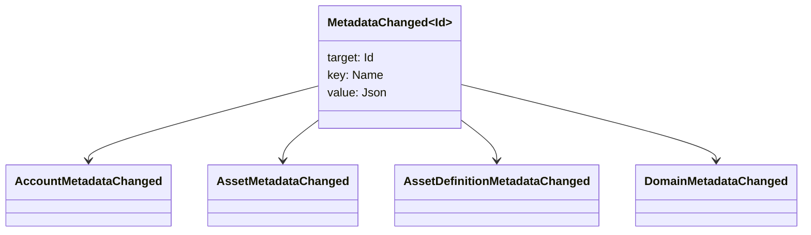

# གཞི་རྟེན་འབྱུང་ཁུངས་ {#metadata}

metadataའདི་ key-value map འདི་ ledger objects ལུ་བཏགས་ཡོདཔ་ཨིན། key འདི་ `Name` values དང་ value འདི་ JSON (`Json`) payloadsཨིན།

འ་ནི་དངོས་པོ་ཚུ་ནང་ metadata འབག་འོང་ཚུགས།

- ས་ཁོངས་ཚུ་
- རྩིས་ཁྲ་
- རྒྱུ་དངོས་ཚུ་
- རྒྱུ་དངོས་གི་འགྲེལ་བཤད་ཚུ་
- NFTs
- RWAs
- ཐིག་ཁྲམ་ཚུ་
- ཚོང་འབྲེལ་ཚུ་

ཟུར་ཐོ་ནང་ཚུད་མི་ འགྲེལ་བཤད་ཀྱི་ས་ཁོངས་ཆུང་ཤོས་དང་ ཚད་འཛིན་གྱི་ས་ཁོངས་ཚུ་གི་དོན་ལུ་ མེ་ཊ་ཌེ་ཊ་ཚུ་ལག་ལེན་འཐབ་ཨིན། ཟུར་ཐོ་སྦོམ་འདི་ WSV གི་ཕྱི་ཁར་བཞག་དགོཔ་དང་ ཐོ་བཀོད་འབད་དགོཔ་ཨིན། URI ཡང་ན་ SoraFS ལྕགས་ལམ་གྱིས་ བསྡུ་ལེན་འབདཝ་ཨིན།

NFTs, RWAs ཡང་ན་ ལྕགས་ཐག་གི་ཕྱི་ཁར་ གསོག་འཇོག་འབད་ནི་ལུ་ གཞི་རྟེན་རྩིས་ཁྲ་དང་ རྒྱུ་དངོས་ཚུ་གདམ་ཁ་འབད་ནིའི་ལམ་སྟོན་གི་དོན་ལུ་ [ Metadata དང་ Ledger Storage Choices](/dz/guide/configure/metadata-and-store-assets.md) ལུ་བལྟ་དགོ།

## Taira ལུ་ བརྟག་དཔྱད་རྐྱབས། {#try-it-on-taira}

མེ་ཊ་ཌེ་ཊ་དེ་ སྤྱིར་བཏང་ཐོན་ཁུངས་ཀྱི་བཀླག་ཐངས་ཐོག་ལས་མཐོང་ཚུགསཔ་ཨིན། འ་ནི་བཀའ་རྒྱ་འདི་ Taira རྒྱུ་དངོས་གི་འགྲེལ་བཤད་ཚུ་ནང་ལུ་ ད་རེས་ མེ་ཊ་དའི་ཊ་ཡོད་མི་ཚུ་ཡོདཔ་ཨིན།

```bash
curl -fsS 'https://taira.sora.org/v1/assets/definitions?limit=100' \
  | jq '.items[]
    | select((.metadata | length) > 0)
    | {id, name, metadata}'
```

domain དང་རྩིས་ཁྲ་ཚུ་གི་དོན་ལུ་ དཔེ་འདི་རང་ལག་ལེན་འཐབ་:

```bash
curl -fsS 'https://taira.sora.org/v1/domains?limit=20' \
  | jq '.items[] | select((.metadata // {} | length) > 0)'

curl -fsS 'https://taira.sora.org/v1/accounts?limit=20' \
  | jq '.items[] | select((.metadata // {} | length) > 0)'
```

སྟོངམ་ཐོན་ཐོ་བཀོད་འདི་ ཆ་གནས་གྲུབ་འབྲས་ཅིག་སྦེ་བརྩི་དགོ། འདི་གིས་དོན་ནི་ Taira འདྲ་མཉམ་ཚུ་གི་ ད་ལྟོའི་ཤོག་ལེབ་ནང་ལུ་ metadata མེད་འདུག་ཟེར་མ་བཤད་པར་ མཇུག་མཐའན་མཇུག་གི་ཐོ་བཀོད་ཀྱི་ཐོ་བཀུད་དེ་ རྩ་མེད་བཏང་ཡི་ཟེར་ཨིན་པས།

## Metadata འདི་ ད་ལྟོའི་བར་དུ་བཟོ་བཀོད་འབདཝ་ཨིན། {#updating-metadata}

metadataའདི་ Iroha དམིགས་བསལ་བསླབ་བྱ་ཚུ་དང་གཅིག་ཁར་ བསྒྱུར་བཅོས་འབདཝ་ཨིན།

- [`SetKeyValue`](/dz/blockchain/instructions.md#setkeyvalue-removekeyvalue)གིས་ལྡེ་མིག་ཚུ་བཙུགས་ཏེ་ བསྒྱུར་བཅོས་འབདཝ་ཨིན།
- [`RemoveKeyValue`](/dz/blockchain/instructions.md#setkeyvalue-removekeyvalue) གིས་ལྡེ་མིག་ཅིག་བཏོན་འབདཝ་ཨིན།

གནད་དོན་འདི་ བགོ་བཀྲམ་འབད་མི་དབང་འཛིན་དེ་ ལཱ་འབད་ཡོད་པའི་ runtime validator གིས་ དགོས་མཁོ་ཅན་གྱི་ ངོས་ལེན་ཡོད་དགོཔ་ཨིན། རང་བཞིན་གྱི་ ངོས་ལེན་གི་མཐར་ཐུག་གི་དོན་ལུ་ [ permission tokens](/dz/reference/permissions.md)བལྟ་དགོ།

## འབྱུང་རྐྱེན་ཚུ་ {#events}

གནས་སྡུད་འབྱུང་རྐྱེན་ཚུ་ མེ་ཊ་ཌའི་ཊ་ལུ་འགྱུར་བཅོས་འབད་བའི་སྐབས་ བཏབ་ཨིན། སྤྱིར་བཏང་བྱུང་རྐྱེན་གྱི་ཁེ་ཕན་འདི་ `MetadataChanged<Id>`:



[data event filter](/dz/blockchain/filters.md#data-event-filters) ལག་ལེན་འཐབ་སྟེ་ འབྲེལ་གཏོགས་འབད་ནིའི་དོན་ལས་ ཁག་ཆེཝ་ཨིན་མི་ གནད་སྡུད་གི་དབྱེ་བ་དང་ ཡང་ན་ བྱ་སྟབས་མ་བདེཝ་ཚུ་གི་དོན་ལུ་ metadata events ID ལུ་རྐྱངམ་ཅིག་ ཐོ་བཀོད་འབདཝ་ཨིན།

## དྲི་བཀོད་ཚུ་ {#queries}

མེ་ཊ་ཌེ་ཊ་དེ་ བརྟག་ཞིབ་འབད་ཡོད་པའི་དངོས་རྫས་ཀྱི་ཆ་ཤས་ཅིག་སྦེ་ལོག་གཏོགསཔ་ཨིན། དཔེར་ན་ [`FindAccountById`](/dz/reference/queries.md#accounts-and-permissions), [`FindDomainById`](/dz/reference/queries.md#domains-and-peers) ཡང་ན་ [`FindAssetDefinitionById`](/dz/reference/queries.md#assets-nfts-and-rwas) ལག་ལེན་འཐབ་ཨིན། [`FindNfts`](/dz/reference/queries.md#assets-nfts-and-rwas) ཡང་ན་ [`FindNftsByAccountId`](/dz/reference/queries.md#assets-nfts-and-rwas) གི་དོན་ལས་ NFTs དང་ [`FindRwas`](/dz/reference/queries.md#assets-nfts-and-rwas) གི་དོན་ལས་RWA ལོཊ་ཚུ་ལག་ལེན་འཐབ་ཞིནམ་ལས་ གནད་སྡུད་ཀྱི་དོན་ལུ་ metadata field ཀློག་ཐེངསམ་ཨིན། NFT འདྲི་བ་གི་ལན་ལུ་ NFT `content` མ་པ་འདི་ record metadataསྦེ་བཏོན་འོང་།

metadata keys འདི་ ledger state གི་ཆ་ཤས་ཅིག་ཨིནམ་ལས་ དེ་ཚུ་གནས་གོང་ཅན་སྦེ་བཞག་ནི་དང་ ལག་ལེན་གྱི་ཐད་ལུ་ འདྲ་བཤུས་ཀྱི་མིང་ནང་ལུ་ churn ཨེབ་གཏང་ནི་ལས་བསྲུང་ནི་དེ་ JSON གནས་གོང་འདི་གིས་ འདྲ་བཤུད་འདི་ གསལ་ཏོག་ཏོ་སྦེ་འབག་ཚུགས་པའི་སྐབས་ཨིན།
