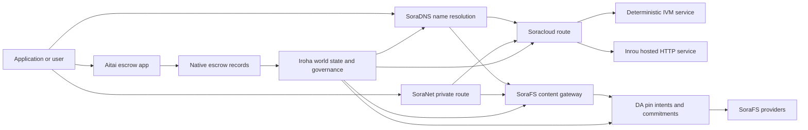

# ཞབས་ཏོག་ཚུ་ SORA Nexus {#sora-nexus-services}

SORA Nexus གིས་ app-ཁ་ཐུག་གི་ ཞབས་ཏོག་གནམ་གྲུ་ཚུ་ Iroha 3 གི་མཐའ་འཁོར་ལུ་བཙུགས་དོ་ཡོདཔ་ཨིན། འ་ནི་ ཞབས་ཏོག་འདི་སོ་སོ་ཨིན་མི་ ལྡེ་མིག་ཚུ་ཨིན། ཁོང་ Iroha འཛམ་གླིང་མངའ་སྡེ། Norito འགྲེམ་སྟོན་དང་ གཞུང་སྐྱོང་ཐོ་ཡིག་ དེ་ལས་ Torii ཕྲང་ལམ་གྱི་བཟའ་ཚན་ཚུ་གིས་གཞི་བཙུགས་འབད་ཡོདཔ་ཨིན།

གྲུབ་འབྲས་འདི་ node build དང་ network profile ལུ་བརྟེན་ཨིན། [`/openapi`](/dz/reference/torii-endpoints.md#app-and-sora-route-families) འདི་ target node ནང་ལུ་ enable routes གི་མིང་ཐོ་སྦེ་ལག་ལེན་འཐབ་དགོ།

## སྣུམ་འཁོར་གྱི་ ས་ཁྲ་ {#component-map}

|ཁག་འབགཔ་ |འགན་འཁྲི་ |མང་ཤོས་ཀྱི་ ས་ཁུལ |
| ---------------------- | ------------------------------------------------------------------------------------------------------------------------------------------- | ---------------------------------------------------------------------------------------- |
|Soracloud |ལག་ལེན་གྱི་ལག་ལེན་སྤེལ་འབད་ནི་དང་ ཞབས་ཏོག་མཁོ་སྤྲོད་འབད་ཐབས། སྒེར་གྱི་བཟོ་རྣམ་ / དུས་རྒྱུན་གནས་སྟངས་ དེ་ལས་ ཞབས་ཏོག་གི་ཚེ་རིང་འཛིན་སྐྱོང་། |`/v1/soracloud/`, `/api/`, `iroha app soracloud ...` |
|ནང་འཁོད་ལུ་ |Soracloud གིས་ HTTP རྒྱུན་འགྲུལ་འབད་ནིའི་དུས་ཚོད་འདི་ ཞབས་ཏོག་བསྐྱར་བཅོས་འབད་མི་ཚུ་གི་དོན་ལུ་ བསྡུ་སྒྲིག་འབད་ཡོདཔ་ད་ འདི་གིས་ HTTP གློག་ཐག་ར་བ་ལུ་ དགོཔ་ཨིན། |Soracloud རྒྱུན་སྐྱོང་དུས་ཚོད་སྒྲིག་གཞི། མགྲོན་བརྡ་འབད་ཐངས་གསལ་སྒྲགས་ཚུ་ རིམ་ལུགས་རྒྱུན་སྐྱོང་དུས་ཀྱི་གནས་སྟངས་ |
|SoraNet |སྲུང་སྐྱོབ་དང་ སྣུམ་འཁོར་གྱི་ཁེབས་ཀྱི་དོན་ལུ་ རེ་རེ་རྒྱུན་འགྲུལ་, VPN, མཉམ་འབྲེལ་ཞལ་འཛོམས་ཚུ་དང་ རྒྱང་བསྒྲགས་ལམ་ཐོ་བཀོད་འབད་ཚུགས།|`/v1/connect/`, `/v1/vpn/`, SoraNet ཕྲང་ལམ་གྱི་བརྡ་དོན་ཚུ་ |
|གནད་སྡུད་ཚུ་ འཐོབ་ཚུགསཔ་ (DA) |འོང་འབབ་ཀྱི་དཔང་རྟགས་དང་ ཁས་བླངས་ དེ་ལས་ ཕན་ཐོགས་ཅན་གྱི་མཁོ་ཆས་ཚུ་གི་དོན་ལུ་ ཤོག་ལེབ་ཚུ་ Nexus ཕྲང་ལམ་, SoraFS གསལ་སྟོན་ཚུ་དང་ བརྟག་དཔྱད་རྒྱུགས་ཆའི་ནང་བཀོད་ཡོདཔ་ཨིན། |`/v1/da/`, `FindDaPinIntent`, `[sumeragi.da]` |
|SoraFS |ནང་དོན་ཁ་ཐུག་གི་ གནས་སྡུད་ཀྱི་ཐིག་ཁྲ། CAR ཁེ་ཕན་གྱི་མཁོ་ཆས་ཚུ་ ཐོ་བཀོད་འབད་ཡོད་པའི་གནས་སྡུད་དང་ gateway fetches དེ་ལས་ ལོག་ཐོབ་ཚུགསཔ་བཟོ་ནིའི་ཁུངས་ཀྱི་རྒྱུགས་ཆུའི་དོན་ལུ་|`/v1/sorafs/`, `/sorafs/`, `FindSorafsProviderOwner` |
|SoraDNS |SORA ནང་འདྲེན་འབད་མི་ ཞབས་ཏོག་དང་ གནད་དོན་ཚུ་གི་དོན་ལུ་ དངོས་གྲུབ་ཅན་གྱི་ མིང་བཏགས་ནི་དང་ resolver-attestation layer། |`/v1/soradns/`, `/soradns/`, resolver directory events |
|Aitai |ཨེཔ་གི་གནས་ཚད་ནང་ ཕི་ཊ་དང་ རྒྱུ་དངོས་ཚུ་ གྲོས་བསྡུར་འབད་ནིའི་ལམ་ལུགས་དེ་ རང་བཞིན་གྱི་གཏེར་ཐོ་ཡིག་ཚུ་གིས་ རྒྱབ་སྐྱོར་འབདཝ་ལས་ သီးခြားརྩིས་དེབ་ཅིག་གིས་མེདཔ། |`OpenAssetEscrow`, `FindAssetEscrow*`,`EscrowEventFilter`, Kotodama `escrow_*` བཟོ་སྐྲུན་འབད་ཐབས། |



## སྤྱིར་བཏང་གནས་རིམ་ཚུ་ {#common-flows}

### སྦྲེལ་མཐུད་འབད་ནིའི་ལག་ལེན་ hosted {#hosted-split-application}

མཉམ་སྒྲིག་གི་ལག་ལེན་ཅིག་གིས་ དབྱེ་ཁག་ཚུ་མཉམ་འབྲེལ་འབད་དོ་ཡོདཔ་ཨིན།

1. ཐོ་བཀོད་འབད་ཐངས་ཚུ་ SoraFS གི་ནང་འཁོད་ལུ་ བསྡུ་སྒྲིག་འབད་ཞིནམ་ལས་ སྦ་བཞག་ཡོདཔ་ཨིན།
2. དཔེ་འབད་བ་ཅིན་ མི་མང་གི་མགྲོན་ཁང་ `<app>.sora`, ཐོ་བཀོད་འབད་ཡོདཔ་ཨིན། SoraDNS.
3. Soracloud ཕྲང་ལམ་ཚུ་ `/api/v1/search` ཡང་ན་ `/api/v1/stream` ལུ་ Inrou HTTP ཞབས་ཏོག་ལུ་གཏང་གཏངམ་ཨིན་མས།
4. Soracloud ཕྲང་ལམ་ཚུ་ `/api/auth` དང་ `/api/v1/user` ཌེ་ཊི་མཱནསི་ཏིག་ IVM ལག་ལེན་པ་ཚུ་ལུ་ བཏོན་གཏང་།
5. སྲུང་སྐྱོབ་ཀྱི་ དགོས་མཁོ་ཡོད་མི་ ཚོང་མགྲོན་པ་ཚུ་གིས་ གནད་སྡུད་དེ་དང་འདྲན་འདྲ་ ཡང་ན་ API ཕྲང་ལམ་བརྒྱུད་དེ་ SoraNet ཕྲང་ཐིག་བརྒྱུད་དེ་ འགྱོ་ཚུགས།

|ལམ་འདི་ |རྒྱབ་སྐྱོར་གནམ་གྲུ་ |ག་ཅི་འབད་ |
| ----------------- | --------------------- | ------------------------------------------------- |
| `/`               |SoraFS རྒྱུན་མ་ཆད་པའི་གནས་ཚད་ |སླར་ལོག་འབད་ཚུགས་པའི་ ནང་དོན་ root དང་ gateway caching |
|`/assets/*` |SoraFS རྒྱུན་མ་ཆད་པའི་གནས་ཚད་ |གནད་སྡུད་དང་འབྲེལ་བའི་ རྒྱུ་དངོས་ཚུ་དང་ གསལ་སྟོན་རྟགས་ཚུ་ |
|`/api/auth*` |Soracloud IVM |སླར་ལོག་འབད་ནིའི་ ཉེན་སྲུང་ཅན་གྱི་ auth དང་ wallet challenge state |
|`/api/v1/user*` |Soracloud IVM |གཞུང་སྐྱོང་ལ་སོགས་པ་ལུ་ གནོད་འགེལ་བྱུང་མི་ རྒྱལ་ཁབ་ཀྱི་འགྱུར་བཅོས་ |
|`/api/v1/search*` |Soracloud Inrou |HTTP ཞབས་ཏོག་, ཀ་ཤེ, SSE ཡང་ན་ བསྡུ་ལེན་འབད་མི་གནས་སྟངས་ |

### ནང་དོན་གསལ་བསྒྲགས། {#content-publication}

SoraFS དཔར་བསྐྲུན་ནང་ལུ་ མིང་རྟགས་བཀོད་པའི་ཧེ་མར་ ཡུན་བརྟན་ཅན་གྱི་ལག་ཆས་ཚུ་ བཟོ་སྐྲུན་འབད་ཡོདཔ་ཨིན།

1. ཁེ་ཕན་གྱི་ཡོ་བྱད་ ཡང་ན་ཐོ་ཡིག་བཟོ་དགོ།
2. འདི་ལུ་ CAR ཡིག་སྣོད་ནང་སྦ་ཆག་འབད་ཞིནམ་ལས་ འཆར་གཞི་དུམ་གྲ་ཅིག་བཟོ་སྟེ་བཞག་དགོ།
3. Norito བརྡ་འགྲེལཔ་ཅིག་བཟོ་ནི་ འདི་ནང་ལུ་ པིན་ སྲིད་བྱུས་དང་ གཞུང་སྐྱོང་གི་ གནད་དོན་ཚུ་ཡོདཔ་ཨིན།
4. ཤོག་ལེབ་འདི་ Torii ལུ་བཙུགས་དགོ།
5. DA པིན་གྱི་དམིགས་གཏད་ ཡང་ན་ འོས་འབབ་གི་བཅའ་ཡིག་ཚུ་ ཡིག་ཐོག་ལུ་བཙུགས་ནི་དེ་ དམིགས་གཏད་ཀྱི་ཐོ་ཡིག་ནང་ གསལ་ཏོག་ཏོ་སྦེ་སྟོན་དགོཔ་སྦེ་བཀོད་འོང་།
6. བརྡ་བྱང་འདི་ SoraDNS མིང་རྟགས་ ཡང་ན་ Soracloud གནས་སྟངས་ཀྱི་གདོང་ཐུག་གི་ལམ་ཁར་བསྡམ་དགོ།

### སྒེར་གྱི་སྐྱེལ་འདྲེན་ ཡང་ན་ འགྲུལ་བསྐྱོད་ལམ་ {#private-fetch-or-streaming-route}

SoraNet གིས་ SoraFS ཡང་ན་ Soracloud གི་གདོང་ཁ་ལུ་སྡོད་ཚུགས།

1. མཁན་པོ་གིས་མིང་དང་ཡིག་གཟུགས་འདི་ སེལ་འཐུ་འབད།
2. སྲུང་རྒྱབ་ཀྱི་ཐོ་ཡིག་ཡང་ན་ལམ་སྟོན་ནང་འཛུལ་སྒོ་དང་ཐོན་ཐངས་ཚུ་ གདམ་ཁ་རྐྱབ་ཨིན།
3. སྣུམ་འཁོར་དེ་ བཀྲམ་སྤེལ་འབད་ཞིནམ་ལས་ SoraNet ཕྲང་ལམ་བརྒྱུད་དེ་བཏང་ནུག
4. ཕྱིར་ཐོན་ཐངས་དེ་ SoraFS gateway, Torii stream, ཡང་ན་ Soracloud route ལུ་ལྷོད་ནུག

## ཨའི་ཊི་ {#aitai}

Aitaiའདི་ SORA ཚོང་ལམ་གྱི་རྣམ་ཐོར་ལུ་ བགོ་བཀྲམ་འབད་བའི་དོན་ལུ་ ལག་ལེན་ལམ་ཨིན་ འདི་ནང་ལུ་ཉོ་མི་དང་བཙོང་མི་གིས་ ཟ་ཁང་ལས་ཕྱི་ཁར་སྤྲོད་ལེན་ཚུ་ མཉམ་འབྲེལ་འབད་དོ་ཡོདཔ་ད་ Iroha གིས་ ཟ་ཁང་གི་ཁ་ཐུག་ལས་སྤྲོད་ལེན་འཐབ་ནི་དེ་ ལེན་དོ་ཡོདཔ་ཨིན། གྲལ་ཐིག་ནང་ཡོད་པའི་ རྒྱུ་དངོས་ཚུ་གི་ ཉེན་སྲུང་། ཨང་གྲངས་ཀྱི་རྒྱུ་དངོས་ཚུ་གི་ ཉེན་སྐྱོབ་གི་རྒྱུན་འགྲུལ་གྱི་དོན་ལུ་ ཁེ་གདམ་ཁ་ཅན་གྱི་རྩིས་ཁྲའི་ཚབ་ལུ་ རང་ལུགས་ཀྱི་ ཉེན་སྲུང་གི་བརྡ་སྟོན་བཟའ་ཚན་འདི་ ལག་ལེན་འཐབ་དགོ།

Native escrow གིས་རྩིས་དེབ་ནང་བདག་འཛིན་འཐབ་དོ་ཡོདཔ་ཨིན། བཙོང་མི་དེ་གིས་ `OpenAssetEscrow`སྦེ་ གྲོས་འདེབས་འདི་འགོ་བཙུགསཔ་ཨིན། ཉོ་མི་དེ་གིས་ `AcceptAssetEscrow` དང་ `MarkEscrowPaymentSent`དང་གཅིག་ཁར་ ཁས་ལེན་འབད་ཞིནམ་ལས་ ཟིན་འགྲུལ་གྱི་ཧེ་མར་ཐོ་བཀོད་རྐྱབ་ཨིན། དེ་ལས་བཙོང་མི་ཚུ་གིས་ `ReleaseAssetEscrow` དང་གཅིག་ཁར་གླར་སྤྱོད་འབད་ནི་དང་ ཡང་ན་ སྐྱིན་འགྲུལ་མ་སྤྲོད་པའི་ཧེ་མ་ ཆ་མེད་གཏང་ནི་ཨིན་མས། བཙོང་མི་དང་བཙོང་མི་གཉིས་ཆ་ར་གིས་ ངོས་ལེན་མ་འབད་བ་ཅིན་ རྩོད་གཞི་ཕྱེ་ནི་དང་ `CanResolveEscrowDispute` དང་གཅིག་ཁར་ གྲོས་ཐག་བཅད་མི་དེ་གིས་ ཟད་འགྲོ་དེ་ བགོ་བཤའ་བརྐྱབ་ཚུགས།

སྲོལ་རྒྱུན་གྱི་འཁོར་ལོའི་མཐའ་མ་ཚུ་གི་དོན་ལུ་ སྤྱིར་བཏང་བཅའ་ཡིག་གི་ལྡེ་མིག་ཚུ་དང་ གསང་བའི་གཏེར་ཁའི་རྩིས་ཁྲ་ཚུ་ དྲི་བཀོད་དང་བྱུང་རྐྱེན་ཚུ་ དེ་ལས་ Rust དཔེ་འབད་བ་ཅིན་ [Native Asset Escrow](/dz/blockchain/escrow.md) ལུ་བལྟ་དགོ།

|Aitai ས་ཁུལ |འདི་གི་དོན་ལུ་ལག་ལེན་འཐབ་ |
| ------------------------------------------------------------------------------------------------------------------------------------------------------------- | ----------------------------------------------------------------------------------------- |
|`OpenAssetEscrow`, `AcceptAssetEscrow`,`MarkEscrowPaymentSent`, `ReleaseAssetEscrow`, `CancelAssetEscrow` |XOR ནང་གི་རྩིས་ཁྲ་ཐོན་སྐྱེད་ཚུ་རྩིས་ཏེ་ དྭངས་འཕྲོས་འཕྲོས་སྦེ་ཡོད་མི་ ཨང་གྲངས་ཀྱི་རྒྱུ་དངོས་གྱི་ གྲལ་འདེབས་ཚུ་ཨིན། |
|`OpenAnonymousAssetEscrow`, `AcceptAnonymousAssetEscrow`,`MarkAnonymousEscrowPaymentSent`, `ReleaseAnonymousAssetEscrow`, `CancelAnonymousAssetEscrow` |Shielded offers གིས་ གྲོགས་རམ་དང་ ཟད་འགྲོ་བཏང་ནི་གི་ལཱ་ཚུ་གི་དོན་ལུ་ ལག་ལེན་རྟགས་ཀྱི་ གྲོགས་རམ་གྱི་ལག་ལེན་འཐབ་ཨིན། |
|`OpenEscrowDispute`,`ResolveEscrowDispute`, `OpenAnonymousEscrowDispute`, `ResolveAnonymousEscrowDispute` |རྩོད་གཞི་བཙུགས་འབད་ནི་དང་ ཁྲིམས་འདུན་གྱི་ལམ་ལུགས་ནང་ གྲོས་ཐག་བཅད་ནི་ |
|`FindAssetEscrowById`,`FindAssetEscrowsBySeller`, `FindAssetEscrowsByBuyer`, `FindAssetEscrowsByStatus` |གློག་འཕྲིན་གི་གནས་གོང་གི་ཤོག་ལེབ་ཚུ་, མཐུན་ལམ་གྱི་ལཱ་དང་ རྒྱབ་སྐྱོར་ལག་ཆས་ཚུ་ |
|`EscrowEventFilter` |སྲིད་འཛིན་གྱི་ངོ་རྟགས་,བཙོང་མི་,ཉོ་མི་, གནས་གོང་, ཡང་ན་ ལས་རིམ་གི་དབྱེ་བ་ལུ་བརྟེན་ འགྲུལ་སྒོ་ཕྱེ་ཡོད་པའི་ སྦ་སྒོའི་གླ་འཐུས་སྤྲོད་ཚུགས། |
| Kotodama `escrow_open_offer`, `escrow_accept`, `escrow_mark_payment_sent`, `escrow_release`, `escrow_cancel`, `escrow_open_dispute`, `escrow_resolve_dispute` |Kotodama སྦ་སྒོའི་བརྡ་དོན་འདི་ V1 escrow syscalls གིས་རྒྱབ་སྐྱོར་འབད་ཡོདཔ་ཨིན།|

མི་མང་གི་ Taira ཡང་ན་ Minamoto གི་ལག་ལེན་གྱི་དོན་ལུ་ ལག་ལེན་ལམ་ལུགས་དང་ རྒྱབ་སྐྱོར་ཡང་ན་ ཁྲིམས་ཁང་ནང་ ལཱ་འབད་ཐངས་ག་ཅི་ར་ཨིན་རུང་ ཞུ་ཡིག་གི་ སྲིད་བྱུས་ལྟར་དུ་བརྩི་དགོ། Iroha གིས་ བདག་འཛིན་གནས་སྟངས་, ཚེ་འཁོར་གྱི་བྱུང་རྐྱེན་, དཔྱད་རྟགས་ཀྱི་ཧེཤ་དང་ རྒྱུ་དངོས་མཐའ་མའི་སྤོ་འགྲུལ་ཚུ་ ཐོ་བཀོད་འབདཝ་ཨིན་; འདི་གིས་ རང་གིས་རང་ལུ་ Fiat གྲོས་བསྡུར་མ་འཐབ་ཚུགས།

## དམིགས་གཏད་ལྡེ་མིག་ཚུ་ བརྟག་དཔྱད་འབད་ {#check-a-target-node}

འ་ནི་ཤོག་ལེབ་འདི་ནང་ལས་ དཔེ་སྟོན་ཚུ་ལག་ལེན་འཐབ་པའི་ཧེ་མར་ ཁྱོད་ཀྱིས་དམིགས་གཏད་འབད་ཡོད་པའི་ཨེབ་ཐོར་ནང་ལུ་ ཕྲང་ལམ་གྱི་བཟའ་ཚན་ཡོད་མི་འདི་ ངེས་གཏན་རྐྱབས་:

```bash
export TORII_URL=https://taira.sora.org

curl -fsS "$TORII_URL/openapi.json" \
  | jq '.paths | keys[] | select(test("^/v1/(soracloud|sorafs|soradns|connect|vpn|da)/"))'

curl -fsS -H 'Accept: application/json' "$TORII_URL/status" | jq .
```

གལ་སྲིད་ `/openapi.json` འདྲ་བཤུས་ཀྱིས་མངོན་གསལ་མ་བཟོཝ་ཨིན་པ་ཅིན་ `/openapi` བརྟག་དཔྱད་འབད་ཐབས། ཐབས་ལམ་ཚུ་ ངེས་བདེན་སྦེ་བཟོ་ནིའི་ཁྱད་ཆོས་དང་ ཡོངས་འབྲེལ་གྱི་སྒྲིག་གཞི་ལུ་བསྟུན་ཨིན།

### Taira Read Only Smoke Checks {#taira-read-only-smoke-checks}

མི་མང་གི་ Taira ཚད་མཇུག་དེ་ ཀློག་ཐངས་ཀྱི་བརྟག་དཔྱད་ཚུ་གི་དོན་ལུ་ ཕན་ཐོགས་ཅན་ཨིན་ དེ་འབདཝ་ད་ ཁྱོད་ཀྱིས་ ངོས་འཛིན་ཅན་གྱི་རྩིས་ཁྲ་ལག་ལེན་འཐབ་དོ་ཡོདཔ་དང་ བསྒྱུར་བཅོས་འབད་ནིའི་འཆར་གཞི་མེད་པ་ཅིན་ འགྱུར་བཅོས་འབད་མི་དཔེ་སྟོན་ཚུ་གི་དོན་ལུ་ ལག་ལེན་འཐབ་མ་བཅུག།

```bash
export TORII_URL=https://taira.sora.org

curl -fsS -H 'Accept: application/json' "$TORII_URL/status" \
  | jq '{version: .build.version, peers, blocks, lanes: (.teu_lane_commit | length)}'

curl -fsS "$TORII_URL/v1/connect/status" | jq '{enabled, sessions_active}'

curl -fsS "$TORII_URL/v1/vpn/profile" \
  | jq '{available, relay_endpoint, supported_exit_classes}'

curl -fsS "$TORII_URL/v1/sorafs/storage/state" \
  | jq '{bytes_capacity, bytes_used, pin_queue_depth, por_inflight}'

curl -fsS -H 'Accept: application/json' "$TORII_URL/v1/soracloud/status" \
  | jq '.control_plane | {service_count, services: [.services[] | {service_name, current_version}]}'
```

Taira གིས་ OpenAPI གི་ལམ་ཐིག་ནང་བཀོད་མི་ འགྲུལ་སྐྱོད་ཚད་འཛིན་གྱི་འཆར་གཞི་ཚུ་ གསལ་སྟོན་འབད་ཚུགས། ཁྱོད་ཀྱིས་ `/openapi` ལུ་ གཞི་རྟེན་བཟོ་ཡོད་པའི་ API གི་འཆམ་ཡིག་ཅིག་སྦེ་ལག་ལེན་འཐབ་ཞིནམ་ལས་ ཐད་ཀར་དུ་ འགྲུལ་བསྐྱོད་ཀྱི་འཆར་སྒོ་གང་རུང་ཅིག་ལུ་ ངོས་ལེན་མ་འབད་བའི་ཧེ་མར་ བཏོན་གཏང་དགོ།

## Soracloud {#soracloud}

Soracloud འདི་ SORA ལག་ལེན་འཛིན་སྐྱོང་ཐང་ཨིན། འདི་གིས་ལག་ལེན་འཐབ་ནིའི་མཐུན་རྐྱེན་ཚུ་ བརྟག་ཞིབ་འབད་དོ་ཡོདཔ་ཨིན། ཞབས་ཏོག་བསྐྱར་བཅོས་, ལམ་སྟོན་, བཙུགས་ནི་གི་གནས་སྟངས་, ངོས་འཛིན་ཅན་གྱི་སྒྲིག་གཞི་བཀོད་ཐོ་བཀོད་, ཞབས་ཏོག་གི་གསང་བ་སྦྲགས་གཏང་། དཔེ་སྒྲོམ་ཐོ་ཡིག་, སྒེར་གྱི་བརྟག་དཔྱད་ལས་རིམ་དང་ རྩིས་སྤྲོད་ཐོ་བཀོད་ཀྱི་དུས་ཚོད་ཚུ་

Soracloud གིས་ལག་ལེན་འཐབ་མི་གནམ་གྲུ་གཉིས་:

|བཙན་སྐྱོགས་ཀྱི་འཆར་གཞི་ |འགྲུལ་བསྐྱོད་དུས་ཚོད་ |འདི་གི་དོན་ལུ་ལག་ལེན་འཐབ་ |
| ---------------------- | ------- | -------------------------------------------------------------------------------------------- |
|`DeterministicService` |`Ivm` |ངོས་འཛིན་, ཁང་མིག་གི་གནས་གོང་། ཐོ་བཀོད་ཅན་གྱི་བཀླག་ཐངས་། བརྒྱུད་འཕྲིན་ཨེབ་རྟ་ལག་ལེན་འབད་མི་ཚུ་། གཞུང་སྐྱོང་ལ་སོགས་པའི་འགྱུར་བཅོས་ |
|`HttpService` |`Inrou` |ཐད་ཀར་དུ་ HTTP APIs, བསྡུ་ལེན་འབད་ནིའི་ལཱ་ལྗིད་དྲགས་, ཀ་ཤི་གིས་རྒྱབ་སྐྱོར་འབད་མི་ ཞབས་ཏོག་, SSE, གློག་ཀླད་ལག་ལེན་འཐབ་མི་ རྒྱུན་འགྲུལ་འཐབ་ནི་ |

ཚད་འཛིན་གྱི་གནས་ཚད་འདི་ ཡིད་ཆེས་ཅན་ཨིན། ལག་ལེན་འཐབ་ནི་, ཡར་དྲག་གཏང་ནི་, རྒྱབ་སྐྱོར་འབད་ནི་, གཞི་སྒྲིག་འབད་ནི་, གསང་བ་, བཟོ་བཀོད་དང་ གནས་སྟངས་ཀྱི་བཀའ་རྒྱ་ཚུ་ Torii གི་ཐོག་ལས་བཙུགས་ཞིནམ་ལས་ བསྐྱར་ཞིབ་འབད་དགོཔ་ཨིན། ཁོང་རང་སོ་སོ་གི་ CLI ས་གནས་ཀྱི་མེ་ལོང་ལུ་བློ་གཏད་མི་འབདཝ་ཨིན། མི་མང་གི་ལམ་སྟོན་འདི་ ཡུན་རིང་ཤོས་ སྔོན་སྒྲིག་ལུ་གཞི་བཞག་སྟེ་ཡོདཔ་ལས་ ཐོ་བཀོད་ཅན་གྱི་མགྲོན་སྡེ་ཅིག་གིས་ རྒྱུན་འགྲུལ་འཐབ་མི་ཚུ་ལུ་ HTTP ལམ་ལུགས་དང་ deterministic API ལམ་ལུགས་ཚུ་གི་བར་ན་ བཀྲམ་སྤེལ་འབད་ཚུགས།

### སྦྲེལ་མཐུད་འབད་ནིའི་ལག་ལེན་འདི་སྒྲོམ་བཟོ། {#scaffold-a-split-app}

བཀྲམ་སྤེལ་འབད་ཡོད་པའི་ལག་ལེན་གྱི་ ཐོ་བཀོད་འདི་གིས་ static frontend plus one hosted live API དང་ deterministic vault/API ཞབས་ཏོག་ཅིག་བཟོ་ཡོདཔ་ཨིན།

```bash
iroha app soracloud app init \
  --template split-app \
  --app-name solswap_indexer \
  --app-version 0.1.0 \
  --public-host solswap-indexer.sora \
  --output-dir ./apps/solswap-indexer

iroha app soracloud app local-plan \
  --manifest ./apps/solswap-indexer/app_manifest.json

iroha app soracloud app doctor \
  --manifest ./apps/solswap-indexer/app_manifest.json
```

`local-plan` ཕྲང་ལམ་བཀྲམ་སྤེལ་འབད་ནི་དང་ ཨ་ལོ་ཚུ་གི་ཞབས་ཏོག་གི་གསལ་སྒྲགས་ཚུ་ ལཱ་འབད་སའི་ས་ཁོངས་ནང་ ཡིག་འབྲུ་ཐོ་བཀོད་འབད་ནི་གི་ ཐབས་ལམ་ དེ་ལས་ རེ་བ་ཅན་གྱི་གདོང་ཐུག་གི་ དཔར་བསྐྲུན་འབད་ནིའི་ ཐབས་ལམ་ཚུ་ ཨེབ་གཏང་འབདཝ་ཨིན། `doctor` ཁྱོད་ཀྱིས་མ་གཏོགསཔ་ད་ ས་གནས་ཀྱི་རང་དབང་སྤྲོད་ལེན་གྱི་ཆིངས་ཡིག་འདི་ ཆ་མེད་གཏང་། Torii.

### ལག་ཆས་ཚུ་ལག་ལེན་འཐབ་ནི་དང་ བརྟག་ཞིབ་འབད་ནིའི་ གནས་སྟངས་ {#deploy-and-inspect-app-state}

```bash
export SORACLOUD_TORII_URL=https://<soracloud-enabled-torii>

iroha app soracloud app deploy \
  --manifest ./apps/solswap-indexer/app_manifest.json \
  --torii-url "$SORACLOUD_TORII_URL"

iroha app soracloud app status \
  --manifest ./apps/solswap-indexer/app_manifest.json \
  --torii-url "$SORACLOUD_TORII_URL"
```

ལག་ལེན་འཐབ་ཚར་བའི་ ཞབས་ཏོག་གི་དོན་ལུ་ ཞབས་ཏོག་གི་ཚད་གཞི་ཡོད་པའི་བཀའ་རྒྱ་ཚུ་ལག་ལེན་འཐབ་དགོ།

```bash
iroha app soracloud status \
  --service-name solswap_indexer_live \
  --torii-url "$SORACLOUD_TORII_URL"

iroha app soracloud rollback \
  --service-name solswap_indexer_live \
  --target-version 0.1.0 \
  --torii-url "$SORACLOUD_TORII_URL"
```

### གསང་བའི་ཡིག་ཆ་དང་ ཡིག་ཆ་ཚུ་ {#config-and-secret-material}

Soracloud སྒྲིག་གཞི་དང་ གསང་བའི་ཨེབ་ཐོར་ཚུ་ ངོས་འཛིན་ཅན་གྱི་ལག་ལེན་གནས་སྟངས་ཀྱི་ཆ་ཤས་ཅིག་ཨིན། དགོས་མཁོ་ཅན་གྱི་ སྒྲིག་གཞི་ ཡང་ན་ གསང་བའི་བཅའ་ཡིག་ཚུ་མེད་པ་ཅིན་ ཡང་ན་ བྱ་བ་ཅན་ལག་དེབ་ཚུ་དང་གཅིག་ཁར་མ་མཐུན་པའི་སྐབས་ ལག་ལེན་འཐབ་ནི་དང་ ཡར་དྲག་གཏང་ནི་ དེ་ལས་ རྒྱབ་སྐྱོར་འབད་ནི་ཚུ་ མཚམས་འཇོག་འབད་ཚུགས།

```bash
iroha app soracloud config-set \
  --service-name solswap_indexer_live \
  --config-name indexer/public_config \
  --value-file ./config/public-config.json \
  --torii-url "$SORACLOUD_TORII_URL"

iroha app soracloud secret-set \
  --service-name solswap_indexer_live \
  --secret-name indexer/api_key \
  --secret-file ./secrets/api-key.envelope.json \
  --torii-url "$SORACLOUD_TORII_URL"
```

ཁྱོད་ཀྱིས་ CLI གྲོགས་རམ་འདི་ལག་ལེན་འཐབ་སྟེ་ ཁྱོད་ཀྱི་ཡིག་གཟུགས་ཀྱིས་ དགོས་མཁོ་ཅན་གྱི་ ངོ་སྤྲོད་རྟགས་ཚུ་འཚོལ་ཚུགས།

```bash
iroha app soracloud config-set --help
iroha app soracloud secret-set --help
```

## ནང་ཐིག་ཚུ་ {#inrou}

Inrou འདི་མགྱོནམ་ཅིག་ཨིན། HTTP ལག་ལེན་འཐབ་མི་ runtime Soracloud. གཅིག་ Iroha སྦྲེལ་ཡོད་པའི་ཨེབ་ཐག་ Soracloud འགོ་བཙུགས་ནིའི་དུས་ཚོད་ཀྱི་ ལས་སྣ་ཚུ་ འཛུལ་ཞུགས་འབད་ཡོདཔ་ཨིན། Soracloud ས་གནས་ཀྱི་ལག་ལེན་གྱི་འཆར་གཞི་ནང་ ནང་འཁོད་ལུ་བཙུགས་ནི་ དེ་ལས་ བཀྲམ་སྤེལ་འབད་ཡོད་པའི་ ཞབས་ཏོག་གི་འདྲ་བཤུས་ཚུ་ loopback ཞབས་ཏོག་སྦེ་ འགོ་བཙུགས་ནི། འདི་ཡང་ སྙན་ཞུ་ཚུ་ runtime state replica སླར་ལོག་ལུ་ ངོས་འཛིན་ཅན་གྱི་དཔེ་རིམ་ནང་

Inrou ལག་ལེན་འཐབ་ནི་ ལཱ་གི་ཐོ་བཀོད་ནང་ལུ་ ཁྱོད་ཀྱིས་ HTTP ཕྲ་རིང་འབད་དགོཔ་ཨིན་ དཔེར་ན་ བསྡུ་ལེན་འབད་མི་ལྗིད་དྲགས་ APIs, SSE རྒྱུགས་ཆུའི་དོན་ལུ་ ཀེཤ་རྒྱབ་སྐྱོར་ཅན་གྱི་ལག་ལེན་འཕྲུལ་ཆས་ཚུ་དང་ ཡང་ན་ བརྒྱུད་འཕྲིན་ལས་ གྲོགས་རམ་ཐོབ་མི་ ཞབས་ཏོག་ཚུ་གི་དོན་ལུ་།

### དུས་རྒྱུན་གྱི་ དགོས་མཁོ་ཚུ་ {#runtime-requirements}

- container manifest runtime འདི་ `Inrou` འབད་ནི་ཨིན།
- ཞབས་ཏོག་གསལ་སྒྲགས་ལག་ལེན་གྱི་གནས་ཚད་འདི་ `HttpService` ཨིན་དགོ།
- `HttpService + Inrou` གིས་ `PersistentRootLeaseVolume` ལུ་བཙུགསཔ་ཨིན། `/`
- Inrou ཞབས་ཏོག་ཚུ་ཡང་ མཉམ་འབྲེལ་གྱི་ཞབས་ཏོག་དང་ ཡང་ཅིན་ གསང་བའི་གླ་འཐུས་ཀྱི་ གནས་སྡུད་ལུ་ དགོས་མཁོ་ཡོདཔ་ད་ དེ་ཚུ་གིས་ བསྒྱུར་བཅོས་འབད་བཏུབ་པའི་ མཉམ་འབྲེལ་མཐུན་རྐྱེན་ཚུ་ བཞག་དོ་ཡོདཔ་ཨིན་པས།
- བཟོ་སྐྲུན་གྱི་མགྲོན་བརྡ་བསྡུར་འབད་སའི་ མཚམས་ཅོག་ཚུ་གིས་ Inrou གི་དངོས་གྲུབ་ཚུ་ གསལ་བསྒྲགས་འབད་དགོ་ནི་ཨིནམ་མ་ཚད་ བརྒྱུད་ཚབ་སྦེ་རྐྱངམ་གཅིག་ ལག་ལེན་འཐབ་དགོ།

### དབྱེ་ཁག་གསལ་ཏོག་ཏོ་ {#manifest-fragment}

འོག་གི་དཔེ་འདི་ manifest གཉིས་ཀྱི་དབྱིབས་ལུ་སྟོན་དོ་ཡོདཔ་ཨིན། འདི་ཆ་ཤས་ཅིག་ཨིན་མི་ བསྡུ་སྒྲིག་ལག་ལེན་འཐབ་མ་བཏུབ་ཨིན།

```jsonc
// container_manifest.json
{
  "schema_version": 1,
  "runtime": { "runtime": "Inrou", "value": null },
  "bundle_path": "/bundles/solswap-indexer.inrou",
  "entrypoint": "/app/bin/launch-indexer.sh",
  "args": [],
  "env": {
    "RUST_LOG": "info",
  },
  "inrou": {
    "schema_version": 1,
    "guest_os": { "guest_os": "DebianSlim", "value": null },
    "guest_images": {
      "x86_64": {
        "kernel_image_path": "/inrou/x86_64/vmlinux",
        "rootfs_image_path": "/inrou/x86_64/rootfs.ext4",
        "initrd_image_path": null,
      },
      "aarch64": {
        "kernel_image_path": "/inrou/aarch64/vmlinux",
        "rootfs_image_path": "/inrou/aarch64/rootfs.ext4",
        "initrd_image_path": null,
      },
    },
  },
  "lifecycle": {
    "start_grace_secs": 60,
    "stop_grace_secs": 30,
    "healthcheck_path": "/api/indexer/v1/health",
  },
}
```

```jsonc
// service_manifest.json
{
  "schema_version": 1,
  "service_name": "solswap_indexer_live",
  "service_version": "0.1.0",
  "execution_plane": { "execution_plane": "HttpService", "value": null },
  "replicas": 2,
  "route": {
    "host": "solswap-indexer.sora",
    "path_prefix": "/api/v1/search",
    "service_port": 8080,
    "visibility": { "visibility": "Public", "value": null },
    "tls_mode": { "tls": "Required", "value": null },
  },
  "lease_volumes": [
    {
      "volume_name": "root_disk",
      "kind": {
        "lease_volume": "PersistentRootLeaseVolume",
        "value": null,
      },
      "storage_class": { "storage_class": "Warm", "value": null },
      "mount_path": "/",
      "max_total_bytes": 8589934592,
    },
    {
      "volume_name": "index_state",
      "kind": { "lease_volume": "ServiceLeaseVolume", "value": null },
      "storage_class": { "storage_class": "Warm", "value": null },
      "mount_path": "/var/lib/solswap-indexer",
      "max_total_bytes": 1073741824,
    },
  ],
}
```

རྒྱུན་འགྲུལ་གྱི་དུས་ཚོད་ལུ་ གློག་ཐག་ར་བ་གི་ཨང་གྲངས་རེ་གིས་ ཨང་གྲངས་ཀྱི་མིང་ནང་ལས་ འབྱུང་མི་ གནས་སྟངས་འགྱུར་བཅོས་ཚུ་གི་ཐོག་ལས་ ཁེ་སང་སྤྲོད་ནི་ཨིན་མས།

```text
SORACLOUD_LEASE_VOLUME_ROOT_DISK_DIR
SORACLOUD_LEASE_VOLUME_ROOT_DISK_MOUNT_PATH
SORACLOUD_LEASE_VOLUME_INDEX_STATE_DIR
SORACLOUD_LEASE_VOLUME_INDEX_STATE_MOUNT_PATH
```

## SoraNet {#soranet}

SoraNet འདི་ སྲུང་སྐྱོབ་དང་ སྐྱེལ་འདྲེན་གི་ཐོ་བཀོད་ཨིན། འདི་གིས་ འགྲུལ་ལམ་གྱི་དོན་ལུ་ འབྲེལ་མཐུད་ལམ་གཞི་བཙུགས་འབད་མི་དེ་ དམིགས་གཏད་ཀྱི་སྒོ་ར་སྒོ་ཡང་ན་ ཞབས་ཏོག་ལུ་ ཐད་ཀར་དུ་ མཐུད་མི་དགོ་པས། སྣུམ་འཁོར་གྱི་བཟོ་རྣམ་ནང་ འཛུལ་སྒོ་དང་ བར་མཚམས་ དེ་ལས་ ཕྱི་ཐུག་ལུ་ བཏང་ནིའི་ འགན་འཁྲི་ཚུ་ ལག་ལེན་འཐབ་ནི་ཨིནམ་ད་ QUIC རྒྱུན་འགྲུལ་འཐབ་ནི་ འདི་ཡང་ དབྱངས་ཅན་ལུ་བརྟེན་པའི་ ཧའི་བི་རི་ཌ་ལག་ལེན་སྤྲོད་ནི་དང་ ལྕོགས་གྲུབ་ཀྱི་ གྲོས་བསྟུན་འབད་ནི་ དེ་ལས་ བཏང་ཐོའི་ཐོ་ཡིག་གི་ མེ་ཊ་ཌེ་ཊ་ཌ་དང་ ཐིམ་ཕུག་ཆེ་ཚད་ཅན་གྱི་ གློག་ཐག་ཚུ་ ལག་ལེན་འཐབ་ཡོདཔ་ཨིན།

Nexus གཞི་བཙུགས་ནང་ལུ་ SoraNet གིས་ གནད་སྡུད་ལེན་ཐོ་བཀོད་འབད་ནི་དང་ gateway རྒྱུན་འགྲུལ་འཐབ་ནི་ དེ་ལས་ VPN ཡང་ན་ Connect ལས་རིམ་ཚུ་དང་ Norito རྒྱང་བསྒྲགས་ལམ་སྟོན་ཚུ་འབད་ཚུགས། ཐོ་བཀོད་ཐོ་ཡིག་ནང་འཛུལ་མི་གིས་ `norito-stream` རྒྱབ་སྐྱོར་འབད་མི་ བརྒྱུད་འཕྲིན་ཚུ་རྟགས་དཔྱད་འབད་ཚུགས། དེ་གིས་མགྲོན་པ་ཚུ་ལུ་ Torii RPC ཡང་ན་ རྒྱང་བསྒྲགས།གི་དོན་ལུ་ འོས་འབབ་ཅན་གྱི་ལམ་ལུགས་ཚུ་ གདམ་ཁ་རྐྱབས་ཚུགསཔ་ཨིན།

### གློག་ཐག་ར་བ་གི་སྒྲིག་སྒྲིག {#streaming-configuration}

Nexus གི་ཡིག་གཟུགས་འདི་གིས་ SoraNet རྒྱུན་འགྲུལ་ལམ་གྱི་དོན་ལུ་ གྲ་སྒྲིག་འབད་ཚུགསཔ་ཨིན།

```toml
[streaming]
feature_bits = 0b11

[streaming.soranet]
enabled = true
exit_multiaddr = "/dns/torii/udp/9443/quic"
padding_budget_ms = 25
access_kind = "authenticated"
provision_spool_dir = "./storage/streaming/soranet_routes"
provision_spool_max_bytes = 0
provision_window_segments = 4
provision_queue_capacity = 256
```

ཁྱོད་ཀྱིས་ `access_kind = "read-only"` ལག་ལེན་འཐབ་ནི་དེ་ བལྟ་མི་གི་བདེན་འཛིན་མ་དགོ་པའི་ གནད་དོན་ཚུ་གི་དོན་ལུ་ཨིན། ཁྱོད་ཀྱིས་ `authenticated` ལག་ལེན་འཐབ་པ་ཅིན་ ཕྱིར་ཐོན་ཐངས་ཀྱིས་ ཐོ་བཀོད་ཚུ་དང་ ཡང་ན་ བལྟ་མི་གྱི་ ངོས་འཛིན་འདི་ Torii དང་ ཡང་ན་ ཞབས་ཏོག་མངམ་ཅིག་ལུ་ ཕར་འགྱོ་སའི་ཧེ་མ་ལག་ལེན་འབད་དགོ།

### SoraNet-ཤེས་ SoraFS འབག་ཤོག {#soranet-aware-sorafs-fetch}

SoraFS འབག་འོང་མི་ CLI གིས་ ས་གནས་ནང་ལུ་ proxy manifest བཏོན་གཏང་ཚུགས་ནི་ དེ་ལས་ SoraNet བརྒྱུད་བཤེར་གྱི་ཁྱབ་སྒྲགས་དང་ ཡང་ན་ SDK ཨཌ་པེ་ཊར་ཚུ་གི་དོན་ལུ་ལམ་ལུགས་ metadata འདི་ spool བཟོ་ཚུགས།

```bash
sorafs_cli fetch \
  --plan artifacts/payload_plan.json \
  --manifest-id 7bb2...9d31 \
  --provider name=alpha,provider-id=9f5c...73aa,base-url=https://gw-alpha.example.org/,stream-token="$(cat alpha.token)" \
  --output artifacts/payload.bin \
  --json-out artifacts/fetch_summary.json \
  --local-proxy-manifest-out artifacts/proxy_manifest.json \
  --local-proxy-mode bridge \
  --local-proxy-norito-spool storage/streaming/soranet_routes \
  --local-proxy-kaigi-spool storage/streaming/soranet_routes \
  --local-proxy-kaigi-policy authenticated \
  --max-peers=2 \
  --retry-budget=4
```

མཚམས་སྡོམ་ཐོ་སྤྲོད་མི་གིས་ སྙན་ཞུ་ཚུ་ བཏང་དོ་ཡོདཔ་ད་ བཏང་ཐོ་བཀོད་དང་ ས་གནས་ཀྱི་བརྡ་དོན་ཚུ་ དེ་ལས་ བཏང་ནིའི་དོན་ལུ་ ལག་ལེན་འཐབ་མི་ ཐབས་ལམ་གྱི་ གཞི་སྒྲིག་ཚུ་ཨིན།

### Relay Incentive Verifier གི་ཐོ་ཡིག་འདི་ {#relay-incentive-verifier-roster}

འབྲེལ་མཐུད་ཤུགས་སྣེ་ལེན་ཚུ་ མཚམས་འཇོག་འབད་ཡོདཔ་ཨིན། `incentives.enable` འདི་བདེན་པ་ཡིན། `incentives.trusted_verifier_ids` ཟད་ཐོ་ཡིག་ཅིག་དང་ མཐོ་ཤོས་ར་ ཀ་ནོ་ནི་ཀཱན་གྱི་རྩིས་ཐོ་བཀོད་ཐེངས་༦༤ ཨིན། IDs. runtime གིས་ roster འདི་ deterministic ordered set བཟོ་སྟེ་བཞག་ཡོདཔ་དང་ རེ་རེ་འགོ་བཙུགས་པའི་སྐབས་ལུ་ invalid roster geometry འདི་མ་བཏུབ་བཟོཝ་ཨིན།

`RelayBandwidthProof` ཆ་མཉམ་འདི་ གཞི་སྒྲིག་འབད་ཡོད་པའི་ཡིག་གཟུགས་དང་ བཀྲམ་སྤེལ་གྱི་ འཆར་དངུལ་དང་འཁྲིལ་ དཀའཝ་སྤྱད་དོ་ཡོདཔ་ལས་ ཡིག་གཟུགས་ཆ་མཉམ་དེ་ མཁོ་སྒྲུབ་འབད་དགོཔ་ཨིན། དཔྱད་ཡིག་གི་བདེན་འཛིན་ཅན་གྱི་རྩིས་ཁྲ་དེ་ སྒྲིག་གཞི་བཟོ་མི་ཐོ་ནང་ཡོད་དགོཔ་ཨིན། དེ་ལས་ `RelayBandwidthProof::verify_signature()` གིས་ གྲུབ་འབྲས་ཐོབ་དགོཔ་ཨིན། སྣུམ་འཁོར་དེ་ བཏོན་མ་ཚར་བའི་ཧེ་མར་ རིན་བསྡུར་འབད་ནིའི་འཕྲུལ་ཆས་འདི་ ལྕོགས་གྲུབ་ཅན་གྱི་ལག་ལེན་གྱི་གློག་མེ་འཕྲུལ་ཆས་ལུ་ ལེགས་བཅོས་འབད་ནི་དང་ བསྒྱུར་བཅོས་འབད་ནི་ཨིན། འདི་འབདཝ་ལས་ ཡིད་ཆེས་མེད་མི་ ལག་ལེན་པ་ཅིག་གིས་ ཐོ་བཀོད་མ་བཏུབ་པའི་རྟགས་མཚན་ (signature invalid/tampered proof) གིས་ ཚད་འཇལ་ནི་ལུ་ ཕན་ཐོགས་ག་ནི་ཡང་མེདཔ་མ་ཚད་ གློག་ཤུགས་ཀྱི་གློག་བརྙན་ཡང་ བཟོ་མི་ཚུགས་པས།

## གནས་སྡུད་ཚུ་ཐོབ་ཚུགསཔ་ (DA) {#data-availability-da}

DA འདི་ འཛམ་གླིང་གི་གནས་སྟངས་ནང་ ཐད་ཀར་དུ་བཞག་ནི་ལུ་ ཕན་ཐོགས་ཆེ་བའི་ཁེ་ཕན་གྱི་དོན་ལུ་ གྲུབ་འབྲས་ལུ་བརྟག་དཔྱད་འབད་ནིའི་ མཐུད་སྦྲེལ་ཐངས་ཨིན་མི་ ཁེ་ཕན་གྱི་ཁེ་ཕན་དེ་ ལེ་ཤ་ལས་བརྒལ་མེད་མི་ ཡང་ན་ སྲུང་སྐྱོབ་ལ་སོགས་པ་ལུ་ གནོད་སྐྱོན་རྐྱབ་ནི་མེད་མི་དང་ ཡང་ཅིན་ ཞབས་ཏོག་ལ་སོགས་པ་ཚུ་ བཟོ་ནི་གི་ ཉེན་ཁ་ཡོདཔ་ཨིན། འདི་ནང་ དངོས་གྲུབ་ཅན་གྱི་ ཁས་བླངས་དང་ བསྡུ་ལེན་གྱི་འགན་ཁུར་ཚུ་ ཐོ་བཀོད་འབད་ཡོདཔ་ལས་ ངོས་འཛིན་འབད་མི་དང་ གེ་ཊི་བེཌ་ དེ་ལས་ ཚོང་མགྲོན་པ་ཚུ་གིས་ བའི་ཊི་ག་རེ་ལུ་ཁས་བླངས་འབད་ཡོདཔ་ཨིན་ན་དང་ སྲིད་བྱུས་ག་འདྲ་ཅིག་ ལག་ལེན་འཐབ་ཡོདཔ་ཨིན་ན་ དེ་ལས་ ག་ཅི་གི་ཁུངས་ཡོད་མེད་ཚུ་ གྲོས་བསྟུན་འབད་ཚུགས་ནི་ཨིན་པས།

DA གིས་ Kura ཡང་ན་ SoraFS གི་ཚབ་མ་ལུ་མེན།

- Kura གིས་ མཇུག་བསྡུ་ཚུགས་པའི་ བཀྲམ་སྤེལ་དང་ གྲོས་བསྟུན་སླར་གསོ་ ཌེ་ཊ་ཚུ་ གསལ་སྟོན་འབདཝ་ཨིན།
- SoraFS ཚོས་གཞི་དང་འབྲེལ་བའི་ བའི་ཊི་ཚུ་ ཐོ་བཀོད་འབད་ནི་དང་ ཞབས་ཏོག་སྤྲོད་ནི་, CAR ཕན་ཐོགས་ཅན་ཅ་ལ་ཚུ་ དེ་ལས་ manifests.
- DA གིས་ ཁས་བླངས་ཚུ་ ཐེ་ཚོམ་གི་ སྲིད་བྱུས་དང་ ཐེ་ཚམ་གྱི་སྒོ་ཕྱེ་ཐངས་ དེ་ལས་ ཨེབ་གཏང་འབད་ནིའི་དམིགས་གཏད་ཚུ་ ཐོ་བཀོད་འབདཝ་ཨིན། དེ་ཚུ་གིས་ བའི་ཊི་ཚུ་ དུས་ཡུན་ཐུང་ཀུ་བཟོ་ནི་དང་ དབྱེ་ཞིབ་འབད་ཞིནམ་ལས་ ལྡོག་ཕྱོགས་རྩིས་ཁྲ་ལུ་ འབྲེལ་མཐུད་འབད་ཚུགས།

ཁྱོད་ཀྱིས་ DA ལག་ལེན་འཐབ་དོ་ཡོདཔ་ད་ ཞུ་ཡིག་ ཡང་ན་ Nexus ཕྲང་ལམ་ཅིག་ལུ་ ལེ་ཇར་ནང་མཐོང་ཚུགས་པའི་ ཁས་བླངས་འདི་ལག་ལེན་འབད་ཚུགསཔ་ཨིན། འཕྲལ་འཕྲལ་གྱི་དཔེ་གཞན་ཚུ་ནང་ གྲོས་འདེབས་རྒྱུན་འགྲུལ་ཚུ་གི་དོན་ལུ་ ཕྲང་རིང་གི་ཁེ་ཕན་གྱི་འགན་ཁུར་ཚུ་ཚུདཔ་ཨིན། དཔར་བསྐྲུན་ཡོད་པའི་དོན་ཆས་ཚུ་གི་དོན་ལུ་ SoraFS པིན་དམིགས་གཏད། དབྱེ་ཞིབ་འབད་ནིའི་དོན་ལུ་བཞག་དགོཔ་ཨིན་མི་ བརྟག་དཔྱད་ལག་ཁྱེར་དང་ ལག་ལེན་ལག་ཆས་ཚུ་ ཡོངས་འབྲེལ་གྱི་གནས་སྟངས་དེ་ ཕན་ཐོགས་ཅན་མཁོ་ཆས་ཀྱི་ཚབ་ལུ་ ཐོ་བཀོད་འབད་དགོཔ་ཨིན།

### སྲོལ་འཁོར་ {#lifecycle}

|རིམ་པ་ |ཐོ་བཀོད་འབད་མི་འདི་|
| ---------- | ----------------------------------------------------------------------------------------------------------------------------------------------------- |
|དམིགས་གཏད་ |ཐོ་བཀོད་ཐོ་བཀོད་, མངོན་གསལ་བཀོད་ཐོ་བཀོད་ཀྱི་མིང་། ལེན་ / དུས་རབས་ / ཤུལ་སྒྲིག་གི་མིང་། སྲིད་བྱུས་བཞག་ནི་དང་ ཡང་ན་ ལོག་སྤྱོད་འབད་ནིའི་ དམིགས་གཏད་ |
|ཁས་བླངས་ |དངོས་པོ་ཚུ་ ཨེབ་གཏང་འབད་ནིའི་དོན་ལས་ ཌི་ཇི་ཨེཕ་ཌི (Degest material) གིས་ བརྡ་བཀོད་དང་ ལེན་གྱི་ཁེ་རྒུད་ དེ་ལས་ བརྟག་དཔྱད་ཀྱི་ཐིག་ཁྲམ་ ཡང་ན་ ནང་དོན་རྩ་བ་ཚུ་ དཔེ་དེབ་ནང་མཐོང་ཚུགས་པའི་ ཐོ་བཀོད་ལུ་ འབྲེལ་མཐུད་འབདཝ་ཨིན།|
|གནད་ཁུངས་ཚུ་ |གྲུབ་འབྲས་ཐོན་ཚུགས་པའི་ ཚོགས་རྒྱུགས་ཚུ་ བརྟག་དཔྱད་འབད་ནི་དང་ ཞབས་ཏོག་བྱིན་མི་གི་བཅའ་ཡིག་ཚུ་ ཡང་ན་ དམིགས་གཏད་ཅན་གྱི་དྲ་ལམ་གིས་ ངོས་ལེན་འབད་ཡོད་པའི་ ངོ་རྟགས་གཞན་ཚུ་ཨིན། |
|དྲི་བཀོད་ |`FindDaPinIntentByTicket`, `FindDaPinIntentByManifest`, `FindDaPinIntentByAlias` ཡང་ན་ `FindDaPinIntentByLaneEpochSequence` གྱི་ཐོག་ལས་ བརྟག་ཞིབ་འབད་ནིའི་དོན་ལས་ ཤོག་ལེབ་ཚུ་ཨེབ་གཏང་འབདཝ་ཨིན།|

DA གིས་རྒྱབ་སྐྱོར་འབད་མི་ དཔར་བསྐྲུན་ཐོ་བཀོད་ལམ་ལུགས་འདི་:

1. WSV གི་ཕྱི་ཁར་ ཁེ་ཕན་གྱི་ཁེ་རྒུད་བཟོ་ནི་དང་ ཐོབ་ནི་ དཔེར་ན་ SoraFS CAR ཡིག་སྣོད་ ཡང་ན་ Nexus ཕྲང་ལམ་གི་ ཁེ་རྒུད་ཚུ་ཨིན།
2. Norito manifest ཡང་ན་ route-specific commitment recordནང་ལུ་ ཁེ་ཕན་གྱི་འགན་ཁུར་ཚུ་ གསལ་བཀོད་འབད་ཞིནམ་ད།
3. བརྡ་འགྲེལམ། པིན་གི་དམིགས་གཏད་ ཡང་ན་ ཁས་བླངས་འདི་ `/v1/da/*` ནང་ལུ་བཙུགས་གཏང་ནི་དེ་ལམ་གྱི་བཟའ་ཚན་འདི་གིས་བཟོ་བཅོས་འབད་ཡོདཔ་ད་ ཡང་ན་ཁ་ཐོ་བཀོད་ཅན་གྱི་ཚོང་འབྲེལ་ལམ་བརྒྱུད་དེ་ཨིན།
4. བརྟན་རྟགས་དཔྱད་འབད་མི་ཚུ་དང་ ཐོབ་ཚུགསཔ་བཟོ་མི་ ཞབས་ཏོག་བྱིན་མི་ཚུ་གིས་ གྲུབ་འབྲས་ཚུ་ བསྡུ་བསྒྱོམ་འབད་དགོཔ་སྦེ་ སྲིད་བྱུས་ནང་བཀོད་ནུག།
5. མིང་རྟགས་མ་བཟོ་གོང་ལུ་ པིན་གྱི་དམིགས་གཏད་དང་ ཁས་བླངས་ཚུ་ བརྟག་ཞིབ་འབད་ཞིནམ་ལས་ ཕན་ཐོགས་ཅན་གི་ཅ་ལ་གུ་བརྟེན་མི་ ཟད་འགྲོ་བཏང་ཐངས་ ཡང་ན་ གེ་ཊི་བེཌི་ལམ་སེལ་འཐུ་འབད་ཚུགས།

### Algorithmic Model འདི་ {#algorithmic-model}

DA གིས་ ཁེ་ཕན་གྱི་ཁེ་རྒུད་ཅིག་ལུ་ ཐོ་བཀོད་འབད་ཡོདཔ་དང་ བསྐྱར་གསོ་འབད་བའི་ཐོག་ལས་ ཉེན་སྲུང་ཅན་གྱི་ ཁེ་རྒུད་ཅན་སྦེ་བསྒྱུར་བཅོས་འབདཝ་ཨིན། ཁག་ཆེ་བའི་ ཨལ་ག་རི་ཏིམ་ཚུ་ ངེས་གཏན་འབདཝ་ལས་ ངོས་འཛིན་འབད་མི་ཚུ་དང་ gateways འདི་བཟུམ་སྦེ་ same bytes ལས་ digests སླར་ལོག་རྩིས་རྐྱབ་ཚུགས།

1. བཏང་མི་ཁེ་ཕན་གྱི་ཐོ་བཀོད་དེ་ ཀ་ནོ་སི་ཡཱན་བཟོ། Torii གིས་ `(lane_id, epoch, sequence)` དང་ཁེ་ཕན་གི་ཐོ་བཀོད་ཀྱི་ཐོ་བཀོད། སྦྲེལ་འབད་ནིའི་དོན་ལས་ metadata, ཤོག་ལེབ་ཀྱི་ཆེ་ཆུང་། སོར་བཤུད་ཀྱི་ཐོ་ཡིག་ཚུ་དང་གཅིག་ཁར་ མཁོ་འདོད་ལེན་ཚུགས། བསྡུ་སྒྲིག་གི་ སྲིད་བྱུས་དང་ བཏང་མི་གི་མིང་ཐོ་བཀོད་ཨིན། node གིས་ དགོས་མཁོ་འབད་བའི་སྐབས་ལུ་ gzip, deflate, ཡང་ན་ Zstandard གི་ཁེ་ཕན་གྱི་ཅ་ལ་ཚུ་སེལ་འཐུ་འབད་ཞིནམ་ལས་ canonical byte length equal `total_size` ཨིན་མི་འདི་ བདེན་དཔྱད་འབདཝ་ཨིན།
2. ཕྲང་ལམ་དང་ བཀྲམ་སྤེལ་གྱི་བརྡ་དོན་ཚུ་ ངོས་འཛིན་འབད་ཐབས། ཐབས་ལམ་དེ་ Nexus ཕྲང་གི་ཐོ་ནང་ཡོད་དགོཔ་ཨིན། `chunk_size` འདི་ ༠ ལས་བརྒལ་མེད་མི་ གློག་ཤུགས་ ༢ དང་ ཉུང་ཤོས་ར་ བི་ཊ་༢ འབད་མི་ལུ་དགོ། སྦྲགས་གཏང་ནིའི་ཡིག་གཟུགས་ནང་ གནད་སྡུད་ཀྱི་ཐིག་ཁྲམ་དང་ ཉུང་ཤོས་རང་ ཐིག་ཁྲམ་གཉིས་ཆ་ར་ ཡོདཔ་ཨིན། བརྒྱུད་ལམ་གྱི་ཐོ་ཡིག་ནང་ལུ་ གྲུབ་རྟགས་བཟོ་རྣམ་ `merkle_sha256` ཡང་ན་ `kzg_bls12_381` བཙག་འཐུ་འབད་ཡོདཔ་ཨིན།
3. འབྲེལ་མཐུད་ཀྱི་ སྲིད་བྱུས་ལག་ལེན་འཐབ་ཨིན། མཚམས་འཇོག་འབད་མི་འདི་ བཱལོབསློབ་རིམ་གྱི་དོན་ལུ་ བཟོ་བཀོད་དང་བཞག་ཐངས་ གཞི་སྒྲིག་འབདཝ་ཨིན། མི་མང་གི་ metadata འདི་པི་ལེནཊེཀསི་སྦེ་བཞག་དགོཔ་ཨིན། གཞུང་སྐྱོང་རྐྱངམ་ཅིག་འབད་མི་ metadata དེ་ manifest ལུ་བྲིས་པའི་ཧེ་མར་ node གི་ configured governance metadata key ལག་ལེན་ཐོག་ལས་སྦྲེལ་འབད་ཡོདཔ་ཨིན།
4. བཀྲམ་སྤེལ་དང་བཅའ་གཏད། ཀ་ནོ་ནི་ཀཱན་གྱི་འགན་ཁུར་འདི་ `chunk_size` ལས་བྱུང་མི་གནས་ཚད་ཅན་གྱི་ཡིག་གཟུགས་དང་གཅིག་ཁར་བཅའ་གཏད་འབདཝ་ཨིན། Torii གིས་ཁེ་ཕན་གྱི་འགན་ཁུར་ཚུ་ རྩིས་ཞིབ་འབད་དོ་ཡོདཔ་མ་ཚད་ དངོས་ལེན་སླར་ལོག་འབད་ནིའི་རྟགས་མཚན་གི་ཤིང་གི་རྩ་དང་ བཀྲམ་སོ་སོར་ལུ་བཅའ་གཏདཔ་ཨིན། གནད་སྡུད་ཀྱི་འགན་ཁུར་དེ་ BLAKE3 ལུ་བཅའ་གཏོགས།།
5. བསྡུ་སྒྲིག་འབད་ནིའི་འགན་ཁུར་ཚུ་ ཁ་སྐོང་རྐྱབས། སྦྲག་འདི་ `data_shards` གི་ཐིག་ཁྲམ་སྦེ་སྡེ་ཚན། མཐའ་མཇུག་གི་ཐིག་ཁྲམ་གྱི་ནང་མེད་པའི་ཐིག་ཁྲ་དེ་འདྲ་མཉམ་རྩིས་ཀྱི་དོན་ལུ་ ༠ ལུ་བཀབ་ཡོདཔ་ཨིན། RS (༡༦) གཅིག་མཚུངས་བཟོ་ནི་ གྲལ་ཐིག་ / འཛམ་གླིང་གི་ལྡེ་མིག་ཚུ་; གདམ་ཁ་རྐྱབས་ `row_parity_stripes` ཀི་ལོ་མི་ཊར་གི་རྣམ་པ་ལུ་ stripe parity མེ་རླུང་རྒྱ་རྫི་ནང་བཙུགས་འབདཝ་ཨིན། Parity shard commitments are BLAKE3 digests of small-endian `u16` symbols.
6. འགྲེམ་སྟོན་བཟོ་ཐབས། `DaManifestV1` གིས་ ཕྲང་ལམ་, དུས་རབས་, བལབ་གི་དབྱེ་རིམ་, codec, ཁེ་ཕན་གྱི་ཁེ་རྒུད་ཐོ་བཀོད་, ཐིག་ཁྲམ་རྩ་ཆ། ཐིག་ཁྲམ་གྱི་ཆེ་ཆུང་། མཚམས་འཇོག་འབད་ཐབས། སྲིད་བྱུས་, རིན་བསྡུར་གནས་གོང་། ཐིག་ཚད་ཀྱི་བཅའ་གཏད། གདམ་ཁ་རྐྱབས་ཅན་གྱི་ IPA བཅའ་གཏད་ཐོ་བཀོད། མེ་ཊ་ཌའི་ཊ་ཊཱལ་དང་ ཐོན་སྐྱེད་དུས་ཚོད་ཚུ་ཨིན། ཐོ་བཀོད་ཐོ་བཀོད་འདི་ ངེས་གཏན་ཅན་ཨིན། node གིས་ འགོ་དང་པ་ manifest template འདི་ empty ticket དང་གཅིག་ཁར་ hashs བཏོན་ཞིནམ་ལས་ མཐའ་མཇུག་གི་ `storage_ticket`སྦེ་མཛུབ་རྟགས་དེ་ལོག་འབྲི་འོང་།
7. སླར་ལོག་འཐབ་འཛིང་ཚུ་མ་བཏུབ་པར་བཟོ། སླར་ལོག་ལྡེ་མིག་འདི་ `(lane_id, epoch, sequence, manifest_fingerprint)`ཨིན། ལག་མཛུབ་རྟགས་དེ་འདྲ་མཉམ་ཡོད་པའི་ཨེབ་སྒྲོམ་འདི་མི་ནུས་པ་ལྡན་ཨིན། ལག་མཛོག་གི་ཐིག་ཁྲ་རྙིངམ་ཡང་ན་ལག་མཛུབ་རྟགས་གཞན་གྱི་ཐིག་ཁྲའི་ཐིག་ཁྲ། འདི་ཡང་མ་བཏུབ་ཨིན།
8. ཡིག་རྟགས་བཀོད་མི་ ཅ་ཆས་ཚུ་ བཏོན་གཏང་། Torii ཀི་པུ་ཊ་ PDP ཁས་བླངས་, ཡིག་རྟགས་ཚུ་ `DaIngestReceipt`, བཟོ་སྐྲུན་འབདཝ་ཨིན། `DaCommitmentRecord`, དེ་ལས་དཔེ་སྐྲུན་ཁང་གི་བཟོ་རྣམ་ཚུ་ གསལ་སྟོན་འབད་ནི་གི་དོན་ལུ་ བཙུགས་ཏེ་བྲིས་བཞག་ནུག PDP ཁས་བླངས་, ཁས་བླངས་ཀྱི་ཐོ་ཡིག་, ཁས་ལེན་གྱི་དུས་ཡུན་, པིན་གི་དམིགས་གཏད་, འཁྲུན་ཆོད་ཡིག་སྣོད་དང་ འཁྲུན་རྟགས་ཀྱི་ཐོ་ཡིག་. སྐྱིན་འགྲུལ་ཐོ་བཀོད་ cursor འདི་ནང་ལུ་ monotonously `(lane_id, epoch)`.

ཁས་བླངས་ཀྱི་ཐོ་ཡིག་འདི་ སྦྲག་ཚུ་གིས་འབག་འོང་མི་འདི་ཨིན། ཐོ་བཀོད་ཅིག་གིས་ བསྡུ་སྒྲིག་འབདཝ་ཨིན།

- ཕྲང་ལམ་, དུས་ཚོད། དང་རིམ་ཐིག་
- caller blob ID དང་ canonical manifest hash
- རྒྱང་ལམ་བརྟག་དཔྱད་འཆར་གཞི།
- འོག་གི་ཤོག་ལེབ་ཚུ་
- KZG ཕྲང་ལམ་ཚུ་གི་དོན་ལུ་ གདམ་ཁ་རྐྱབ་བཏུབ་པའི་ ཁས་བླངས་དེ་ KZG
- PDP/བརྟག་དཔྱད་འབད་ཐངས་
- ཟུར་བཞག་ཐོ་བཀོད་དང་ ཐོ་བཀོད་ཐོ་བཀོད།
- Torii DA ངོས་ལེན་གྱི་རྟགས་མཚན་

སྦྲག་ནང་ DA ཐོ་བཀོད་ཚུ་བཙུགས་མ་ཚར་བའི་ཧེ་མར་ སྦྲགས་ཀྱི་བཅའ་སྒྲིག་ལམ་འདི་གིས་ བུད་སྒྲོམ་དེ་ བདེན་ཁུངས་བཀལ་འོང་།

- `(lane_id, epoch, sequence)` སྦ་སྒོར་གྱི་ནང་ན་ ཁྱད་ཅན་སྦེ་བཞག་དགོཔ་ཨིན།
- མངོན་གསལ་འབད་ཡོད་པའི་ཧེཤ་ཚུ་ བུན་གྱི་ནང་ན་ སྟོང་མེད་དང་ ཁྱད་དུ་འཕགས་སྦེ་དགོཔ་ཨིན།
- ཁས་བླངས་ཀྱི་རྟགས་བཀོད་ལམ་ལུགས་འདི་ གཞི་སྒྲིག་འབད་ཡོད་པའི་ལམ་ལུགས་དང་མཐུན་དགོ།
- Merkle ཕྲང་ལམ་ཚུ་ reject KZG ཁས་བླངས་ཚུ་ KZG ཕྲང་ལམ་ཚུ་ནང་ ༠ ལས་བརྒལ་མེད་དགོཔ་ཨིན། KZG ཁས་བླངས་འབད་ནི་
- པིན་གྱི་དམིགས་དོན་ཚུ་ ཕྲང་ལམ་དང་ manifest hash ཐོ་བཀོད་ཐོ་བཀོད་, བདག་འཛིན་གི་རྩིས་ཁྲ་ དེ་ལས་ Alias-collision ཁྲིམས་ལུགས་ཚུ་གིས་དབྱེ་ཞིབ་འབད་ཞིནམ་ལས་ སེལ་འཐུ་འབདཝ་ཨིན།

Block header གིས་ DA proof སྲིད་བྱུས་དང་ ཁས་བླངས་ དེ་ལས་ pin intent གི་དོན་ལུ་ hash ཚུ་ གསོག་འཇོག་འབདཝ་ཨིན། membership proofs ལུ་ commit bond འདི་ཡང་ Merkle root འདི་གི་ leaves ཀྱི་སྒོ་ལས་བཏོན་འོང་། འདི་ཡང་ Norito-codeed `DaCommitmentRecord` values གི་ hashesཨིན། ཕམ་ཨེབ་གཏང་འབད་ཡོད་པའི་ node ཚུ་གིས་ links དང་ right children གི་ concatenation ཚུ་ hash བཏོན་དོ་ཡོདཔ་ད་ ཨེབ་གཏང་འབད་མི་ sheet དེ་ཤུལ་མའི་ layer ལུ་འགྱུར་བ་མེད་པར་ཡར་སེང་འབདཝ་ཨིན།

### གྲུབ་འབྲས་ཚུ་ བརྟག་དཔྱད་འབད་ནི་ {#proof-verification}

`/v1/da/commitments/prove` གིས་ བཀྲམ་སྤེལ་འབད་ནིའི་ ཁས་བླངས་གཅིག་གི་དོན་ལུ་ གྲུབ་རྟགས་བཟོ་ཚུགས། གྲུབ་རྟགས་ནང་ ཁས་བླངས་, བཀྲམ་དབྱངས་མཐོ་ཚད་, སྦ་སྒོར་ནང་གི་ཐོ་བཀོད་, སྦལ་སྒོར་ཧེཤ་, སྦང་སྒོར་རིང་ཐུང་, Merkle root, དང་སྲིངམོ་ལམ་ཚུ་ཡོདཔ་ཨིན། བདེན་དཔྱད་བརྟག་དཔྱད་:

1. བརྟག་དཔྱད་ཐིག་གི་ཧེཤ་འདི་ block header གི་ DA commitment hash དང་འདྲ་མཉམ་ཨིན།
2. དཔྱད་ཡིག་གི་ཐིག་ཚད་འདི་ གྲོས་བསྡུར་འབད་ཡོད་པའི་ཐིག་ཚད་ཀྱི་ཐིག་ཚད་དང་མཐུནམ་ཨིན།
3. ཚད་འཛིན་དེ་ མཐའ་མཚམས་ནང་ཡོདཔ་དང་ ཁས་བླངས་འདི་ ནང་ཐིག་གི་ཐོ་ཡིག་ལུ་འདྲན་འདྲ་ཨིན།
4. རྒྱང་ལམ་བརྟག་དཔྱད་ཀྱི་ སྲིད་བྱུས་འདི་གིས་ ཁས་བླངས་འདི་ཁས་ལེན་འབད་ཡོདཔ་ཨིན།
5. ཁས་བླངས་ཀྱི་ལྕོག་གུ་ལས་ སྤུན་ཆ་གི་ལམ་ལོག་བཏོག་པ་ཅིན་ གཞི་བཙུགས་འབད་ཡོད་པའི་རྩ་བ་འདི་ སླར་ཡང་བཟོ་ཡོདཔ་ཨིན།
6. བཟོ་སྐྲུན་འབད་ཡོད་པའི་རྩ་བ་འདི་ སྦྲེལ་གྱི་རྩ་བ་དང་འདྲན་འདྲ་ཨིན།

འདི་གིས་ བཀྲམ་སྤེལ་འབད་ནིའི་ ཁས་བླངས་དེ་ དམིགས་བསལ་གྱི་ སྦྲག་གི་ཁེ་ཕན་ནང་ལུ་ཚུད་ཡོད་པའི་ཁུངས་བཀལཝ་ཨིན། དེ་གིས་དཔེ་ཆ་རེ་རེ་ལུ་ ད་ལྟོའི་བར་ན་ཡང་ ཡོངས་འབྲེལ་ནང་ཡོད་མེད་ཀྱི་ཁུངས་བཀལཝ་མེདཔ། སྲོག་ཐོག་སླར་ལོག་འབད་ནི་དེ་ SoraFS ཞབས་ཏོག་མཁོ་སྤྲོད་कर्ताལུ་ བསྡུ་ལེན་འབད་ནི་དང་ PDP/PoTR བརྟག་དཔྱད་འབད་ནི་དང་ ཡང་ན་ ཌེ་བི་སི་ཊི་བཱལ་གྱི་དོན་ལུ་ ཐོབ་ཐངས་ཀྱི་རྟགས་མཚན་ཚུ་ཐོག་ལས་ ལགཔ་སོ་སོར་སྦེ་བརྟག་ཞིབ་འབདཝ་ཨིན།

### གྲོས་བསྟུན་གྱི་འབྲེལ་བ་འཐབ་ནི་ {#consensus-interaction}

DA གིས་ ཡིད་རྟོན་རུང་གི་ བརྒྱུད་འཕྲིན་ (RBC) གྱི་ཐོག་ལས་ Sumeragi ལུ་མཐུད་སྦྲེལ་འབད་དོ་ཡོདཔ་ཨིན་རུང་ གཉིས་པ་སྦེ་མཇུག་བསྡུཝ་མ་ཚུགསཔ་ཨིན། RBC གིས་ གྲོས་འདེབས་ཀྱི་ ཁེ་ཕན་གྱི་ལཱ་ཚུ་སྤེལ་ཏེ་ ལོག་ཐོབ་དོ་ཡོདཔ་ཨིན། གྲོས་འདེབས་कर्ताགིས་ `(height, view, payload_hash)` གྱི་དོན་ལུ་ ཚོགས་ཐེངས་ཅིག་ རྐྱབ་ནི་ཟེར་ གསལ་བསྒྲགས་འབད་དོ་ཡོདཔ་ད་ གཞན་མི་ཚོགས་པ་ཚུ་གིས་ བརྗེ་སོར་འབད་དོ་ཡོདཔ་དང་ `READY`/`DELIVER` བརྡ་སྟོན་གྱིས་ དངོས་ལེན་བསྟར་སྤྱོད་འབད་མི་ ལེ་ཤ་གིས་ ཁེ་ཕན་གྱི་ཅ་ཆས་དེ་ བརྟག་ཞིབ་འབད་དེ་ཡོད་མེད་ཚུ་ བརྟག་ཞིབ་འབད་དོ་ཡོདཔ་ཨིན་པས།

Iroha 3 ནང་ལུ་ གྲྭ་ཚང་ཅིག་གིས་ བཀྲམ་སྤེལ་འབད་ཡོད་པའི་པི་ལཱག་གི་ ཁེ་ཕན་གྱི་འགན་ཁུར་འདི་ ལག་ལེན་འཐབ་ཚུགསཔ་སྦེ་བརྩི་དོ་ཡོདཔ་ད་ དེ་ཡང་:

- ས་གནས་ཀྱི་སྒོ་བསྡམས་ཡོད་པའི་སྦྲག་འདི་ བའི་ཊི་ཧེཤ་ལུ་ རེ་བ་བསྐྱེད་མི་ཁེ་ཕན་གྱི་ཧེཤ་ཅིག་སྦེ་སྟོནམ་ཨིན། ཡང་ན་
- RBC གིས་ བཀྲམ་སྤེལ་འབད་ཡོདཔ་ ཁེ་ཕན་གྱི་ཁེ་རྒུད་ལྡནམ་སྦེ་ སྦྲག་ཧེཤ་, མཐོ་ཚད་, མཐོང་སྣང་དང་ ཁེ་ཕན་གི་ཁེ་རྒུདཔ་.

གནས་སྟངས་གཉིས་ཆ་ར་ཡང་མ་གྲུབ་པ་ཅིན་ གྲྭ་ཚང་གི་ཡིག་སྣོད་ `missing_local_data` གིས་ འཕྲོ་མཐུད་དེ་ RBC ཡང་ན་ བཀྲམ་སྤེལ་འབད་ཐོག་ལས་ ཁེ་ཕན་གྱི་ཅ་ལ་སླར་གསོ་འབད་ནི་ལུ་བརྩོན་ཤུགས་བསྐྱེད་དོ་ཡོདཔ་མ་ཚད་ གནས་གོང་དང་ ཊེ་ལེ་མེ་ཊི་རི་ནང་ལུ་ DA gate འདི་ སྙན་ཞུ་འབདཝ་ཨིན། ད་ལྟོའི་ལག་ལེན་ནང་ལུ་ འ་ནི་ DA བརྡ་སྟོན་ཚུ་ མཐའ་མཇུག་གི་དོན་ལུ་ གྲོས་བསྟུན་འབད་དོ་ཡོདཔ་ཨིན། དབྱེ་ཁག་ཅིག་གིས་ commit certificate plus the matching local payloadལས་ མཇུག་བསྡུ་དོ་ཡོདཔ་མ་གཏོགས་ သီးခြား DA quorum certificate ལས་མེན་པས།

DA དུས་ཡུན་སླར་གསོ་ སྒོ་སྒྲིག་ཚུ་རྒྱ་ཆེར་འགྱུརཝ་ཨིན། ཕན་ནུས་ཅན་གྱི་ DA quorum timeout འདི་ གཞི་སྒྲིག་འབད་ཡོད་པའི་སྦྲག་དང་ commit timings ལས་བཏོན་ཏེ་ཡོདཔ་ད་ འདི་གི་ཤུལ་ལས་ `sumeragi.advanced.da.quorum_timeout_multiplier` ལུ་ལྡོག་སྟེ་ཡོདཔ་ཨིན། གྲ་སྒྲིག་གི་དུས་ཚོད་འདི་ `max(quorum_timeout, availability_timeout_floor_ms) * availability_timeout_multiplier` ཨིན་པས། དུས་ཚོད་དེ་མཇུག་མ་བསྡུ་བའི་ཧེ་མར་ node གིས་ ཁེ་ཕན་གྱི་ཁེ་རྒུད་སླར་གསོ་འབད་ནི་ལུ་ རྒྱབ་སྐྱོར་འབད་དོ་ཡོདཔ་མ་ཚད་ དུས་ཡུན་མ་རན་པར་བསྐྱར་བཅོས་འབད་ནི་སྤང་སྟེ་སྡོད་དོ་ཡོདཔ་ཨིན། དེ་མཇུག་མ་འགྱོ་བའི་ཤུལ་ལས་ རང་ལུགས་ཀྱི་སླར་གསོ་དང་ བལྟ་བཤལཔ་འགྱུར་ལྡནམ་ཚུ་ འགོ་བཙུགས་ཚུགས།

### ལས་འཛིན་གྱི་ཡི་གུ་ཚུ་ {#operator-notes}

Iroha 3 གི་མཐུན་ལམ་གྱི་ཡིག་གཟུགས་ཚུ་ནང་ RBC གིས་རྒྱབ་སྐྱོར་འབད་ཡོད་པའི་ ཁེ་ཕན་གྱི་ཁྱབ་སྤེལ་, manifest guards, DA bond validation, and recovery telemetry ཚུ་ཡོདཔ་ཨིན། peer template གིས་ `[sumeragi.da]` གི་ཚད་འཛིན་ཚུ་བཏོན་འབདཝ་ཨིན། ཁས་བླངས་དང་ བརྟག་དཔྱད་སྒོ་ཕྱེ་ཐོ་བཀོད་རེ་ལུ་ དུས་ཡུན་འགོར་ཐོ་བཀོད་ཀྱི་དོན་ལུ་ `[sumeragi.advanced.da]` timeout multipliers for quorum and availability behaviour བཟོ་ནི་ འདི་ཚུ་གི་སྒྲིག་གཞི་ཚུ་ གྲ་སྒྲིག་སྦེ་བཞག་ནི། སྒྲིག་ལམ་གཅིག་གི་ནང་ validators ནང་།

ཕྲང་ལམ་འཚོལ་ནིའི་དོན་ལུ་ node གི་ཡིག་ཆ་ OpenAPI ལས་འགོ་བཙུགས་དགོ།

```bash
curl -fsS "$TORII_URL/openapi.json" \
  | jq '.paths | keys[] | select(startswith("/v1/da/"))'
```

ད་ལྟོའི་ DA དྲི་བའི་མིང་ཚུ་གི་དོན་ལུ་ [དྲི་བ་གི་ཡིག་སྣོད་](/dz/reference/queries.md#nexus-data-availability-and-packages)དང་ ཁྱོད་ཀྱི་བཟོ་སྐྲུན་གྱིས་བཏོན་མི་ ས་གནས་ཀྱི་ `[sumeragi.da]`ལྡེ་མིག་ཚུ་གི་དོན་ལུ་ [ peer configure template](/dz/reference/peer-config/) ལག་ལེན་འཐབ་།

## SoraFS {#sorafs}

SoraFS འདི་ ཚད་མེད་ཅན་གྱི་ ནང་དོན་ཁ་ཐུག་གི་ སྒྲིང་སྒྲི་ཨིན། འདི་གིས་ བའི་ཊ་ཚུ་ དད་འགྲོ་བཏོན་པའི་ཧྲིལ་བུསི་སྦེ་སྦྲེལ་འབདཝ་ཨིན། CAR ཡིག་སྣོད་དང་ Norito གསལ་སྟོན་ཚུ་ནང་ ནང་དོན་རྩ་བ་ཚུ་བཅའ་མར་གཏོགས་དོ་ཡོདཔ་ཨིན། ཐོ་བཀོད་ལམ་ལུགས་དང་ གཞུང་སྐྱོང་གི་བཅའ་ཡིག་ཚུ་ བསྡུ་སྒྲིག་འབད་དོ་ཡོདཔ་ཨིན། སྒྲིང་ཁྱིམ་ ཞབས་ཏོག་མཁོ་ཆས་ཚུ་གིས་ ཚད་ capacity དང་ content availability གསལ་བསྒྲགས་འབད་དོ་ཡོདཔ་ད་ gateways གིས་ ཤོག་སྒྲིལ་དང་ chunk commitments འདི་ content བྱིན་པའི་ཧེ་མར་ བརྟག་ཞིབ་འབདཝ་ཨིན།

SoraFS གི་ལག་ལེན་འཐབ་ཐངས་ཚུ་ནང་ ཐིམ་ཕུག་གི་ལག་ལེན་གྱི་ རྒྱུ་དངོས་དང་ ཡིག་ཆ་བཟོ་སྐྲུན་འབད་ཐངས་ དེ་ལས་ ས་ཁོངས་ཀྱི་སྦ་སྒོར་དང་ བཟུམ་སྒྲིག ཡང་ན་ ཨེ་རེ་ཕ་ཀེཊི་ འབྲི་ཐངས་ དེ་ལས་ གཞུང་སྐྱོང་གི་དཔང་རྟགས་ཚུ་གི་སྦ་སྒར། Iroha ཌའི་ཊ་མོ་བིན་ལེནཌ་གིས་ SoraFS gateway འབྱུང་རྐྱེན་ཚུ་དང་ ཞབས་ཏོག་སྤྲོད་མི་གི་དབང་འཛིན་གྱི་དོན་ལུ་ [`FindSorafsProviderOwner`](/dz/reference/queries.md#nexus-data-availability-and-packages) འདྲི་དཔྱད་འབདཝ་ཨིན།

### མི་མང་གི་ས་གནས་ CID དང་ ས་ཁོངས་ཀྱི་སྒོ་ར་སྒོ་ཚུ་ {#public-local-cid-and-site-gateways}

SoraFS ཤུགས་ཅན་གྱི་ Torii མཚམས་སྦྱོར་འདི་ཚུ་གིས་ མིང་མ་བཏགས་མི་ མི་མང་གི་ལམ་ལུགས་ཚུ་བཟོ་དོ་ཡོདཔ་ད་ གདམ་ཁ་གྱི་ལག་ལེན་ API བཟོ་སྐྲུན་འབད་མེད་རུང་ཡང་:

|ཐབས་ལམ་དང་མཇུག་ཐིག་ |དམིགས་གཏད་ |
| --- | --- |
|`GET /.well-known/sorafs/manifest` |ཀ་ནོ་ནི་ཀཱན་གྱི་ཞུ་ཡིག་གི་མགྲོན་ཁང་གིས་ གདམ་ཁ་རྐྱབ་མི་ འགྲེམས་སྟོན་འདི་ལོག་གཏང་ |
|`GET /v1/sorafs/cid/{cid}` |CID གི་དོན་ལུ་ ས་གནས་ཀྱི་བརྡ་དོན་དང་ ཡིག་སྣོད་ནང་ཐོ་བཀོད་འབད་ཡོད་པའི་ གནས་སྡུད་ཚུ་སླར་ལོག་འབདཝ་ཨིན། |
|`GET /sorafs/cid/{cid}` |གནས་སྡུད་འདི་ ས་གནས་ཀྱི་ཡིག་ཆ་གཅིག་གི་དོན་ལུ་ ཞབས་ཏོག་བྱིན་ནི་ |
|`GET /sorafs/cid/{cid}/{*path}` |CID གི་འོག་ལུ་ གནས་ཚད་ཅན་ལམ་གཅིག་དང་ ཡང་ན་ བའི་ཊི་གི་མཐའ་མཚམས་གཅིག་ ཞབས་ཏོག་བྱིན་དགོ།|

འ་ནི་ལམ་ལུགས་འདི་ `x-sorafs-stream-token` ཡང་ན་ `x-sorafs-token-id` འདི་རྩ་བ་ལས་ར་མ་ལེན་པར་ཡོདཔ་ཨིན། མགོ་ཡིག་གཉིས་ཆ་ར་ལུ་ཡོད་མི་དེ་ ཞུ་བ་ངན་པ་ཅིག་ཨིན། ཚད་འཛིན་གྱི་གནས་སྟངས་ནང་ཡོད་པའི་ canonical manifest འདི་ node གི་ local store ནང་ལུ་ཡོད་མི་འདི་ཨིན། public reading ability; cache miss གིས་ remote provider hydration འབད་ནི་ལུ་ ངོས་ལེན་མི་འབདཝ་ཨིན། protected provider CAR དང་ chunk routes འདི་སོ་སོ་སྦེ་ authenticated protocol surfaces ཨིན་པིན་ཨིན།

བི་ཊ་ཚུ་མ་ལྷག་པའི་ཧེ་མར་ Torii གིས་ ས་གནས་ཀྱི་བརྡ་སྟོན་གྱི་ ཀ་ནོ་ནི་ཀིཌ་དང་ བརྡ་དོན་གི་བཅའ་ཁྲིདཔ་ དེ་ལས་ ཌི་ཇི་ཨེསི་ཊི་དང་ རོཊི་ CID འདི་ཆ་བཞག་པ་ཅིན་ local provider ངོ་རྐྱང་དང་ governance admmission དེ་ལས་ rule compliance and takedown checks for the manifesto, CID འདི་ཆ་འཇོག་འབད་དགོཔ་ཨིན། Gateway rate/ban policy གིས་ client address འདི་ལག་ལེན་འཐབ་དོ་ཡོདཔ་ད་ forwarded address ཚུ་ configured trusted proxies གི་ཐོག་ལས་རྐྱངམ་ཅིག་ honoringའབདཝ་ཨིན། missing policy, compliance, takedown, identity, or admission state སྒོ་བསྡམས་མ་ཚུགས་པས།

ཞུ་བ་གཅིག་ནང་ མཐའ་མཇུག་གི་གཞུང་སྒོ་གི་དོན་ལུ་ ངོས་ལེན་འབད་ཡོདཔ་ད་ བྱ་རིམ་ཡོངས་བསྡོམས་ཀྱི་མཐའ་མ་དེ་ བསྐྱར་ཞིབ་ཐེངས་༦༤ དང་ཕྱདཔ་ད་ མཁོ་འདོད་ཆེ་ཤོས་འདི་ `503 Service Unavailable`དང་ `Retry-After: 1` ལུ་ལོག་གཏོགསཔ་ཨིན་པས། མངོན་གསལ་གྱི་ལན་འདི་ ༡༦ MiB ལུ་ བཀག་ཆ་འབད་ཡོདཔ་ད་ ཡིག་སྣོད་གི་ཐོ་ཡིག་ཚུ་ སྔོན་སྒྲིག་སྦེ་ ཐོ་བཀོད་༥༠ དང་ མང་ཤོས་ར་ ངོས་ལེན་༥༠༠ ལུ་ བཀག་འཛིན་འབད་ཡོདཔ་ད་ ཤོག་སྒྲིལ་གང་རུང་ ཡང་ན་ བི་ཊ་རྐྱང་གི་དབྱེ་མཚམས་དེ་༨ MiB ལུ་ བཀག་དམ་འབད་ཡོདཔ་ཨིན། CIDs, དྲི་བཀོད་, hosts, paths, and range headers must use their canonical single-valued forms. Active HTML, script, SVG, XML, PDF, ཡང་ན་ Wasm content འདི་ གཞི་སྒྲིག་འབད་ཡོད་མི་ CID ལས་འབྱུང་ཁུངས་སོ་སོ་ལས་ (ཡང་ན་ དེ་ནང་ལུ་ བསྒྱུར་བཅོས་འབད་ཡོདཔ་) ནང་ལས་རྐྱངམ་ཅིག་ ཞབས་ཏོག་སྤྲོད་ནི་ཨིནམ་ད་ འདི་གིས་བཟོ་བཀོད་འབད་མི་ Path-gateway origin གྱིས་ དོགས་པ་མ་བསྐྱེད་པའི་དོན་ལས་ བཀག་ཆ་འབདཝ་ཨིན།

### མཉམ་ཆུང་གི་དཀའ་ངལ་ཚུ་ {#moderation-challenges}

SoraFS མཉམ་ཆུང་གི་དཀའ་ངལ་གྱི་དཔལ་འབྱོར་འདི་ གྲོས་བསྟུན་ཀྱི་གནས་སྟངས་ཨིན། སྲིད་བྱུས་བརྟན་ཅན་གྱིས་ གཞུང་སྐྱོང་ཚོགས་རྒྱན་ཐོབ་མི་ རྒྱུ་དངོས་དང་ རྒྱུན་སྐྱོང་རྩིས་ཁྲ་ཚུ་ ཨེསི་ཅོ་ཨར་དང་ ཨེསི་ཇོ་ཨར་གི་དོན་ལུ་ལག་ལེན་འཐབ་དོ་ཡོདཔ་ཨིན། དཀའ་སྡུག་རེ་རེ་གི་དོན་ལུ་ དེ་བཟུམ་མའི་རྒྱུ་དངོས་ཀྱི་ ཡུ་ནིཊ་༡༥༠ དགོཔ་ཨིན། འདི་ཡར་སེང་འབད་ནི་དེ་གིས་ བཱན་ཌི་དེ་ ཨེསི་ཤོ་ཨར་ལུ་སྤོ་བཞིན་ཚུགས། གནད་དོན་ཅིག་གིས་ དབྱེ་ཁག་གཉིས་ཆ་ར་གི་ངོ་རྟགས་དེ་ ཆ་མེད་གཏང་ནི་ཨིནམ་ད་ རྩིས་ལོ་གཅིག་མཚུངས་ཀྱི་ དབྱེ་ཞིབ་ཐེངས་གཉིས་པ་ ཡང་ན་ དབྱེ་ཐང་དང་ དབྱེ་དཔྱད་རྩིས་ཁྲམ་ཚུ་ བསྒྱུར་བཅོས་མ་འབད་བར་ ལོག་སྟེ་ལག་ལེན་འཐབ་མི་ བདེན་ཁུངས་འདི་ ཆ་མེད་གཏང་ཚུགས།

བརྩོན་འགྲུས་བཙུགས་ནི་གི་ དུས་ཚོད་གངམ་དང་ བརྩོན་བསྡུར་ཐག་བཅད་ནིའི་ དུས་ཚོད་གངམ་འདི་ ཁྱད་པར་ཅན་ཨིན། གཞུང་སྐྱོང་གིས་ བརྩོན་འདུས་འབད་ཡོད་པའི་ བརྩོན་རྩོད་དེ་ ངོས་ལེན་འབད་ནི་དང་ ཆ་མེད་གཏང་ནི་ལུ་ ཉེ་འདབས་ལུ་ཡོད་མི་ བརྩོན་འདེབས་ཚུ་ནང་ལས་ དུས་ཡུན་ཆུ་ཚོད་༢༤ གི་ཧེ་མར་ ཡོངས་ཁྱབ་སྦེ་ཐོབ་ཡོདཔ་ཨིན། བརྩོན་ཤུགས་ཅན་གྱི་ བཀྲམ་སྤེལ་ཚོགས་རྒྱན་ཚུ་གིས་ བརྩོན་བརྡ་བཀོད་པའི་ དུས་ཚོད་གངམ་གི་ཧེ་མར་རྐྱངམ་གཅིག་ གསལ་སྟོན་འབདཝ་ཨིན།

- གྲོས་ཐག་བཅད་པའི་རྩོད་རྙོག་དེ་ བཀག་དམ་འབད་ཡོདཔ་མ་ཚད་ ཁེ་ཕན་གྱི་དངུལ་ཕོགས་ཡང་ བསྐྱིན་འགྲུལ་བསྐྱོད་འབད་དགོཔ་ཨིན།
- གྲོས་ཐག་མ་བཅད་པའི་ཧེ་མར་ རྩོད་གཞི་འདི་ འཕྲོ་མཐུད་དེ་ར་ བཏོན་གཏང་ནི་ཨིནམ་ལས་ བུ་ལོན་གི་བརྒྱ་ཆ་༢༥ པོ་དེ་ སྐྱིན་འགྲུལ་ཐོབ་མི་ལུ་ གཏང་ནི་ཨིན་ (བཙག་འཐུའི་མཐུན་རྐྱེན་གྱི་ དབྱེ་ཞིབ་དང་བསྟུན་ཏེ་ མར་ཕབ་འབད་ཡོདཔ་) དེ་ལས་ ལྷག་ལུས་ཀྱི་དངུལ་ཀྲམ་ཚུ་ ལོག་སྤྲོད་དགོཔ་ཨིན།
- གྲོས་ཐག་མ་བཅད་པའི་ རྩོད་རྙོགས་འདི་ དགོངས་ཡངས་ཀྱི་ སྒོ་སྒྲིག་མཇུག་བསྡུ་ཞིནམ་ལས་ སྒོ་ཕྱེ་མ་ཚུགས་པར་ འགྱོཝ་ཨིན། དེ་ལས་ bond འདི་ཆ་མཉམ་སླར་ལོག་འབདཝ་ཨིན།

`ExpireSorafsModerationChallenge` གིས་ ངོས་ལེན་མེདཔ་དང་ ཧེ་མ་ལས་མཇུག་བསྡུ་ཚར་མི་ རྩོད་བཤེར་གྱི་དོན་ལུ་ དབང་ཚད་མེད་ཨིན། གནད་དོན་འདི་ མཇུག་བསྡུ་ནི་གིས་ རྒྱབ་སྐྱོར་འབད་མི་འདི་བཟུམ་སྦེ་ དུས་ཚོད་མཇུག་བསྡུ་བའི་ གྲོས་ཐག་བཅད་འོང་། འདི་འབདཝ་ལས་ འཛིན་སྐྱོང་འཐབ་མི་ཅིག་གིས་ མ་དངུལ་ཚུ་ ལྕགས་མ་སྦེ་བཞག་མི་ཚུགས་ ཡང་ན་ གསལ་སྟོན་འབད་མི་ཚུ་ བཀག་དམ་སྦེ་བཞག་ཚུགས། གྲོས་འདེབས་རེ་ཡང་ ཨེ་མ་ཨིནམ་ཨིན། གལ་སྲིད་ སྐྱིན་འགྲུལ་བསྐྱོད་དང་ ཟད་འགྲོ་བཏབ་མ་བཏུབ་པ་ཅིན་ གྲོས་ཆོད་ཆ་མཉམ་འདི་ ལོག་སྟེ་ར་ལོག་འགྱོ་འོང་།

Moderation སྲིད་བྱུས་དང་ གནད་དོན་ཐོ་ཡིག་ཚུ་ནང་ འགོ་དང་པ་བཏང་བའི་འཆར་གཞི་འདི་ ཐད་ཀར་དུ་ལག་ལེན་འཐབ་ཨིན། node ཚུ་གིས་ genesis/state initialisation གི་སྐབས་ལུ་ precut persisted layouts འདི་བཀོག་བཞག་ཡོདཔ་ཨིན། ཡང་ན་གློག་བརྙན་བསྐྱར་བཟོའི་; ཚོགས་རྒྱན་བཙུགས་མི་རྒྱུ་དངོས་, སྲུང་སྐྱོབ་རྩིས་ཁྲ་, དུས་ཡུན་ཚད། ཡང་ན་ དཔལ་འབྱོར་གྱི་གནས་སྟངས་ལས་ འཁྱིད་བསྡུད་འབད་བ་ཀྱི་ཚབ་ལུ་ མཐུན་རྐྱེན་ཚུ་སླར་གསོ་འབདཝ་ཨིན།

### བསྡུ་སྒྲིག་འབད་ ཤོག་སྒྲིལ་དང་རྟགས་བཀོད་ དེ་ལས་གཏང་རག་ {#pack-manifest-sign-and-submit}

```bash
cargo run -p sorafs_car --features cli --bin sorafs_cli -- \
  car pack \
  --input ./dist \
  --car-out artifacts/site.car \
  --plan-out artifacts/site.chunk-plan.json \
  --summary-out artifacts/site.car-summary.json

cargo run -p sorafs_car --features cli --bin sorafs_cli -- \
  manifest build \
  --summary artifacts/site.car-summary.json \
  --manifest-out artifacts/site.manifest.to \
  --manifest-json-out artifacts/site.manifest.json \
  --pin-min-replicas=3 \
  --pin-storage-class=warm \
  --pin-retention-epoch=42

SIGSTORE_ID_TOKEN=$(oidc-client fetch-token) \
cargo run -p sorafs_car --features cli --bin sorafs_cli -- \
  manifest sign \
  --manifest artifacts/site.manifest.to \
  --bundle-out artifacts/site.manifest.bundle.json \
  --signature-out artifacts/site.manifest.sig

cargo run -p sorafs_car --features cli --bin sorafs_cli -- \
  manifest submit \
  --manifest artifacts/site.manifest.to \
  --chunk-plan artifacts/site.chunk-plan.json \
  --torii-url "$TORII_URL" \
  --resolve-submitted-epoch=true \
  --authority=<i105-account-id> \
  --private-key-file ./secrets/authority.ed25519 \
  --summary-out artifacts/site.manifest.submit.json \
  --response-out artifacts/site.manifest.submit.body
```

གལ་སྲིད་ `/v1/sorafs/pin/register` ལུ་ དམིགས་གཏད་གྱི་ཨེབ་གཏང་འབད་མ་བཏུབ་པ་ཅིན་, CLI གིས་ `/transaction` ཡིག་སྣོད་གུ་ར་ལོག་འགྱོ་སྟེ་ terminal pipeline status བར་ན་སྒུག་སྡོད་འོང་།

### བརྟག་ཞིབ་དང་འབག་ཐོབ། {#verify-and-fetch}

```bash
cargo run -p sorafs_car --features cli --bin sorafs_cli -- \
  proof verify \
  --manifest artifacts/site.manifest.to \
  --car artifacts/site.car \
  --chunk-plan artifacts/site.chunk-plan.json \
  --summary-out artifacts/site.verify.json

sorafs_cli fetch \
  --plan artifacts/site.chunk-plan.json \
  --manifest-id <manifest-digest-hex> \
  --provider name=primary,provider-id=<provider-id-hex>,base-url=https://gateway.example.org/,stream-token="$(cat provider.token)" \
  --output artifacts/site.fetch.tar \
  --json-out artifacts/site.fetch.json
```

### བསྐྱར་གསོ་འབད་ཚུགས་པའི་ཁུངས་ཀྱི་བརྟག་དཔྱད་ཚུ་ {#proof-of-retrievability-checks}

ལས་འཛིན་གྱིས་ བརྟག་ཞིབ་འབད་ཚུགས་ནི་དང་ ཚོད་བསྲེ་བཞག་སའི་ ཞབས་ཏོག་བྱིན་མི་ཚུ་ལུ་ བརྟག་དཔྱད་ཚུ་ འགོ་བཙུགས་ཚུགས།

```bash
sorafs_cli por status \
  --torii-url "$TORII_URL" \
  --manifest <manifest-digest-hex> \
  --status=failed \
  --limit=20

sorafs_cli por trigger \
  --torii-url "$TORII_URL" \
  --manifest <manifest-digest-hex> \
  --provider <provider-id-hex> \
  --reason=latency_probe \
  --samples=48 \
  --auth-token artifacts/challenge_token.to
```

## SoraDNS {#soradns}

SoraDNS འདི་ SORA ཞབས་ཏོག་དང་ ནང་དོན་ཚུ་གི་དོན་ལུ་ དངོས་གྲུབ་ཅན་གྱི་ མིང་བཏགས་ཐིག་ཨིན། དེ་གིས་མིང་ཚུ་ ངོ་མ་བཟོ་དོ་ཡོདཔ་མ་ཚད་ Resolver Directory ཚར་གསོའི་གནས་སྟངས་འདི་ Iroha ལུ་ བསྡུ་སྒྲིག་འབད་དོ་ཡོདཔ་ཨིན། དེ་ལས་ SoraFS གྱི་ཐོག་ལས་ མཚམས་འཇོག་འབད་ཡོད་པའི་ ས་ཁོངས་ ཡང་ན་ resolver བུན་ཐིག་ཚུ་བགོ་བཀྲམ་འབདཝ་ཨིན། Resolvers དང་ gateways གིས་ discover metadata ལུ་ བློ་གཏད་པའི་ཧེ་མར་ resolver attestation documents འདི་བདེན་འཛིན་རེ་ཡོདཔ་ཨིན།

འགྲུལ་འཕྲིན་ལག་ལེན་ཚུ་གི་དོན་ལུ་ SoraDNS གིས་ ཐོ་བཀོད་འབད་ཡོད་པའི་ FQDN ལས་ gateway hosts ཕྱིར་བཏོན་འབདཝ་ཨིན། ཐོ་བཀོད་ཀྱི་ vanity host འདི་ canonical application origin སྦེ་ར་ བཞག་དོ་ཡོདཔ་ད་ deployed gateway profiles ལུ་ browser དང་ Torii fallback routes for that origin ཚུ་ གསལ་སྟོན་འབདཝ་ཨིན་པས།

### མཉམ་འབྲེལ་བཟོ་རྣམ་ཚུ་ {#host-forms}

|ཐོ་བཀོད་ |དཔེ་གཅིག་ |དམིགས་གཏད་ |
| --- | --- | --- |
|ཁུངས་མེད་པའི་འབྱུང་ཁུངས་ |`https://<fqdn>/<path>` |Canonical app URL གིས་ འགྲེམ་ཐོག་ལག་ལེན་དང་ ཐོ་བཀོད་གསལ་སྒྲགས་ཚུ་ནང་བཀོད་ཡོདཔ་ཨིན། |
|Taira བལྟ་བཤལཔ་གི་སྒོ་སྒྲིག་ |`https://<fqdn>.mon.taira.sora.net/<path>` |Active aliasགི་དོན་ལུ་ public browser gateway |
|Torii རྒྱབ་འགྱོ་སའི་ལམ་ |`https://taira.sora.org/soradns/<fqdn>/<path>` |Torii ཌེ་བི་གཱོན་དང་རྒྱབ་སྐྱོར་ལམ་གྱི་དོན་ལུ་ ལཱ་འབད་ཡོད་པའི་མིང་རྟགས་ |
|Canonical hash gateway |`<base32(blake3(name))>.gw.sora.id` |ངོས་འཛིན་གྱི་སྒོ་སྒྲིག་ཚུ་དང་ GAR བརྟག་དཔྱད་འབད་ནི་|

`/soradns/<alias>/...` fallbackའདི་ མི་མང་གི་དགའ་ཤོས་ཅིག་མེན་ URL. ལག་ཆས་བཟོ་སྐྲུན་དང་ app manifests དེ་ལས་ frontend སྒྲིག་གཞི་འདི་གིས་ vainity host འདི་རང་ལུ་དགའ་དགོཔ་ཨིན། གལ་སྲིད་ Taira ལུ་མིང་རྟགས་མ་བཙུགས་པ་ཅིན་ བརྒྱུད་འཕྲིན་ gateway ཡང་ན་ fallback path གིས་ application routing འགོ་བཙུགས་པའི་ཧེ་མར་ `404` སླར་ལོག་འབད་ཚུགས། ཡང་ན་ TLS ཕྱིར་འབུད་འབད་འོང་།

### Derive Gateway hosts {#derive-gateway-hosts}

```ts
import {
  deriveSoradnsGatewayHosts,
  hostPatternsCoverDerivedHosts,
} from '@iroha/iroha-js'

const derived = deriveSoradnsGatewayHosts('docs.sora')
console.log(derived.canonicalHost)
console.log(derived.prettyHost)

const taira = deriveSoradnsGatewayHosts('solswap-indexer.sora', {
  prettySuffix: 'mon.taira.sora.net',
})
console.log(taira.prettyHost)

const patterns = [
  derived.canonicalHost,
  derived.canonicalWildcard,
  derived.prettyHost,
]
console.log(hostPatternsCoverDerivedHosts(patterns, derived))
```

GAR ཁེ་ཕན་གྱི་ཐོ་བཀོད་འདི་ ཀ་ནོ་ནི་ཡཱན་ ཧེཤ་མགྲོན་ཁང་དང་ ཀ་ནཱོ་ནི་ཡན་གྱི་ wildcard དེ་ལས་ གདམ་ཁ་རྐྱབ་མི་མཛེས་སྡུག་ཅན་གྱི་མགྲོན་ཁང་ནང་ཚུད་དགོ།

### Resolver Directory གི་གློག་བརྙན་ལེན་ཚུགས། {#fetch-a-resolver-directory-snapshot}

```bash
curl -i "$TORII_URL/v1/soradns/directory/latest"

soradns_resolver directory fetch \
  --record-url "$TORII_URL/v1/soradns/directory/latest" \
  --directory-url https://gateway.example.org/soradns/directory/latest.car \
  --output ./state/soradns-directory

soradns_resolver rad verify \
  --rad ./state/soradns-directory/rad/resolver-a.norito
```

Gateways གིས་ Resolver attestation document འདི་ཡག་སོང་ཡོདཔ་དང་ དུས་ཡུན་ཚད། ཐོ་བཀོད་མ་འབད་མི་ ཡང་ན་ Merkle root གི་མཐའན་མཇུག་གི་ directory ནང་ anchored ཡོད་མི་ resolvers འདི་བཀོག་བཞག་དགོ། གྲོག་ཐིག་ནང་ལུ་ Resolver directory མ་བསྐྲུན་པའི་བསྒང་ཡོད་རུང་ `/v1/soradns/directory/latest` འདི་གིས་ `404` སླར་ལོག་འབད་ཚུགས།

### མི་མང་གི་ངོ་ཚབ་ DNS {#public-dns-delegation}

SoraDNS host derivation གིས་ Internet DNS delegation རྒྱུན་མ་ཆད་པར་ བསྒྱུར་བཅོས་འབད་མ་ཚུགསཔ་ཨིན། མི་མང་གི་མིང་ DNS གིས་ SoraDNS gateway ལུ་བཏོན་པ་ཅིན་:

- subdomains གི་དོན་ལུ་ གདམ་ཁ་རྐྱབ་མི་ host ལུ་ CNAME གསལ་སྟོན་འབད་
- ཨེཔི་ཀསི་གི་མིང་ཚུ་གི་དོན་ལུ་ ALIAS/ANAME ཡང་ན་ A/AAAA ཡིག་ཆ་ཚུ་ gateway anycast IPs ལུ་ལག་ལེན་འཐབ་དགོ།
- SoraDNS gateway domain གི་འོག་ལུ་ GAR checks གི་དོན་ལུ་ canonical hash host བཞག་དགོ།

## FHE དང་ UAID {#fhe-and-uaid}

FHE འབྲེལ་ཡོད་ས་ཁོངས་ཚུ་ནང་ Nexus ཞབས་ཏོག་ཚུ་བཙུགས་ཏེ་ ལག་ལེན་འཐབ་ནི་དེ་གི་གྲལ་ཁར་:

- `iroha_crypto::fhe_bfv` གིས་ scalar ciphertext evaluationགི་དོན་ལུ་ deterministic BFV རྒྱབ་སྐྱོར་ལག་ལེན་འཐབ་ཨིན། ངོས་འཛིན་འབད་ཐངས་འདི་ `BfvIdentifierPublicParameters` དང་ `BfvIdentifierCiphertext` ལག་ལེན་འཐབ་དོ་ཡོདཔ་ད་ slot 0 གིས་ནང་སྣོད་ byte གི་རིང་ཚད་དང་ཤུལ་མའི་ slots གིས་ གཅིག་རེ་ལུ་ encrypted byte བཟོ་སྟེ་བཞག་ནུག
- Soracloud state and job schemes model FHE code text workloads with governance-managed parameter sets, execution policies, code text commitments, query envelopes, and disclosure requests. ཌོག་ཊར་དང་ལཱ་གི་འཆར་གཞི་ཚུ་ བཟོ་སྐྲུན་འབད་ནི་ལུ་ གྲོས་ཐག་བཅད་ཡོདཔ་ཨིན།

BFV ངོས་འཛིན་ལམ་དེ་ སྲུང་སྐྱོབ་ཀྱི་དོན་ལུ་ ལག་ལེན་འཐབ་ཨིན། ཁྱོད་ཀྱིས་ Torii གྲུབ་ཐངས་ལུ་ སྦ་ཆག་ཅན་གྱི་ ངོས་འཛིན་འདི་བཙུགས་ཚུགས། གྲུབ་ཐོད་འདི་གིས་ ལས་འགན་ཅན་གྱི་ ངོས་འཛིན་གྱི་ སྲིད་བྱུས་དང་འཁྲིལ་བ་ཅིན་ `OpaqueAccountId` ཨེབ་གཏང་འབད་ཞིནམ་ལས་ བརྒྱུད་འཕྲིན་ཨེབ་གཏང་འབདཝ་ཨིན། `ClaimIdentifier` དེ་ལས་ བརྒྱུད་འཕྲིན་འདི་ དམིགས་གཏད་རྩིས་ཁྲ་དང་གཅིག་ཁར་ འབྲེལ་མཐུད་འབད་ཡོད་པའི་ UAID ལུ་བཅའ་མར་གཏོགས་འོང་།

འདི་ཚུ་ UAID འདི་ཡང་ ངོ་རྟགས་དང་ནུས་ཤུགས་གི་མཐའ་འཁོར་ལུ་ རྒྱུགས་ཆུའི་མཐའ་བསྐོར་ནང་ལུ་ཨིན། `UniversalAccountId` འདི་ hash-རྒྱབ་སྐྱོར་ཡོད་མི་དང་འདི་ནང་ལུ་ `uaid:<hash>`. བརྟག་ཞིབ་འབད་མི་ཚུ་གིས་ ཆ་མཉམ་ཁས་ལེན་འབདཝ་ཨིན། `uaid:<hash>` ཡང་ན་ བཀྲམ་སྤེལ་འབད་མི་ ༦༤ ཧེཀ་སི་འབད་ཐངས་ཚུ་ཨིན། `Account` དང་ `NewAccount` གདམ་ཁ་རྐྱབས། `uaid` དང་ `opaque_ids` རྒྱུན་འགྲུལ་འཐབ་ནིའི་དུས་ཚོད་ནང་ ཐོ་བཀོད་འབད་མི་དེ་ གཅིག་-གཅིག་གི་ཐོག་ལས་ UAID-རྩིས་ཁྲ་ལུ་ཐོ་བཀོད་འབད་མི་ ཨང་གྲངས་ཚུ་ ཆ་མེད་གཏང་ནི་ ཡང་ན་ དབྱངས་ཅན་མ་བཟོ་མི་ ངོ་རྟགས་ཚུ་དང་ མགུ་འཐོམ་མེད་པའི་ ངོ་རྟགས་ཚུ་ ཆ་མེད་བཏང་ནི་ UAID. ནམ་རང་འབད་རུང་ a UAID account binding བསྒྱུར་བཅོས་འབད་བ་ཅིན་ runtime འདི་གི་དོན་ལུ་ Space Directory database bindings སླར་ལོག་འབདཝ་ཨིན། UAID.

Space Directory manifests སྒྲིག་འཇུག་བྱས་ཚད། ཐེངས་ 3 ལས་ཉུང་བ། ཐོན་རིམ་ 5.7.1 ནང་དུ་ཚོད་ལྟ་བྱས་ཟིན། ལོ 5 སྔོན་ལ་གསར་བཅོས་བྱས། UAID. གཅིག་ `AssetPermissionManifest` མིང་ཐོ་ཚུ་ UAID, ཌེ་ཊ་ས་པི་ལེན (data space) དང་ སི་ཊི་ཨེམ་ (activation and optional expiry epoch) དེ་ལས་ ཌེ་ཀྲ་ས་པིལ (data space), ལས་རིམ་ (program), ཐབས་ལམ་ (method), རྒྱུ་དངོས་ (asset) དེ་ལས་ AMX འགན་འཁྲི་བརྟག་དཔྱད་འབད་ཐངས་འདི་ གྲུབ་འབྲས་ལུ་མ་དགའ་ནི་འདི་ཨིན། དང་པ་ར་ གྲུབ་འབྲས་དང་བསྟུན་པའི་ གྲུབ་འབྲས་དེ་ དགོས་མཁོ་ལུ་མ་དགའ་མི་འདི་ཨིན། དེ་མེན་པ་ཅིན་ དོ་འགྲན་འབད་ནིའི་ གོ་སྐབས་ཐོབ་མི་ འཕྲལ་ཁམས་ཅིག་ཁར་ ཚད་གཞི་དང་ཕྱདཔ་ད་ བརྟག་དཔྱད་འབད་ནི་ཨིན། དཔར་བསྐྲུན་འབད་ནི་དང་ དུས་ཡུན་མཇུག་བསྡུ་ནི་ དེ་ལས་ ཁ་གསལ་ཚུ་ ཆ་མེད་གཏང་ནི་དེ་ ཁྲིམས་སྲུང་འགག་པ་གིས་ བདག་འཛིན་འཐབ་ཡོདཔ་ཨིན། `CanPublishSpaceDirectoryManifest`.

Soracloud FHE གི་གནས་གོང་གི་དོན་ལུ་ ལག་ལེན་འཐབ་མི་འཆར་གཞི་ཚུ་འདི་ཨིན:

|འཆར་གཞི་ |འདི་ག་ཅི་ལུ་ལག་ལེན་འཐབ་དོ་ཡོདཔ་ཨིན་ན?|
| ----------------------------------------- | --------------------------------------------------------------------------------------------------------------------------- |
|`SoraStateBindingV1` དང་གཅིག་ཁར་ `FheCiphertext` |མངོན་གསལ་འབད་མིའི་ནང་ གནས་གོང་ཚུ་ state key prefix གི་འོག་ལུ་ FHE ciphertext ཨིན།|
|`FheParamSetV1` |མིང་ཐོ་, backend, modulus chain, polynomial degree, slot count, security target, life cycle, and parameter digest ཚུ་ཨིན།|
|`FheExecutionPolicyV1` |ཨེབ་གཏང་ཡིག་ཆ་གི་ཚད་དང་ དྭངས་གསལ་ཡིག་ཆ་ཀྱི་ཚད་ དེ་ལས་ ནང་ཐིག་/མཐར་འཁྱོལ་གྲངས་ ཐོ་བཀོད་འབད་ནིའི་གཏིང་ འདི་ཡང་ བསྒྱུར་བཅོས་ཚུ་ བཀྲམ་སྤེལ་འབད་ནི་དང་ གློག་ཐག་བཙུགས་ནི་ དེ་ལས་ འཁོར་བའི་གནས་སྟངས་ཚུ་ |
|`FheGovernanceBundleV1` |འཛུལ་ཞུགས་ལག་ལེན་གྱི་དོན་ལུ་ ཁྱད་ཚད་གཅིག་ གཞི་སྒྲིག་འབད་ཡོད་པའི་ཁར་ ལག་ལེན་ལམ་ལུགས་ཅིག་ཡང་ འབདཝ་ཨིན།|
|`FheJobSpecV1` |`Add`, `Multiply`, `RotateLeft` ཡང་ན་ `Bootstrap` གི་གནས་སྟངས་ཀྱི་ལྡེ་མིག་ཚུ་དང་ ཁས་བླངས་ཚུ་གི་སྐོར་ལས་ གསལ་སྟོན་འབདཝ་ཨིན། |
|`CiphertextQuerySpecV1` |འདྲི་དཔྱད་ཚུ་ codetextརྐྱངམ་ཅིག་ཨིན་ ཞབས་ཏོག་, binding, key prefix, result limit, metadata level, དང་ optional inclusion proof ཟེར་བཀོད་ནུག|
|`DecryptionRequestV1` |ཨེབ་གཏང་འབད་ནིའི་དབང་འཛིན་གྱི་ སྲིད་བྱུས་དང་འཁྲིལ་ སྦ་གསང་ཡིག་ཆ་གཅིག་གི་དོན་ལུ་ གསལ་སྟོན་འབད་དགོཔ་སྦེ་ ཞུ་བ་འབདཝ་ཨིན།|

`FheJobSpecV1::validate_for_execution` གིས་ ལས་འགན་དང་ ལག་ལེན་ལམ་ལུགས་ དེ་ལས་ ཁྱད་ཚད་གཞི་ གཞི་སྒྲིག་ཚུ་ འཛུལ་ཞུགས་མ་འབད་བའི་ཧེ་མར་ གྲོས་བསྟུན་འབད་ཡོདཔ་ཨིན་ན་ བརྟག་ཞིབ་འབདཝ་ཨིན། དེ་མ་ཚད་ ལཱ་གི་ཐད་ལུ་ འགན་འཁྲི་ཅན་གྱི་ ཁྲིམས་ལུགས་ཚུ་ཡང་ བཏོན་དོ་ཡོདཔ་ཨིན། ཨང་བསྡོམས་དང་ལྡནམ་སྦེ་འབད་བ་ཅིན་ ཉུང་ཤོས་ཨེབ་ཐོར་༢ དགོཔ་ཨིན། rotate དང་ bootstrap འདི་ནང་ ནང་ཐོ་བཀོད་གཅིག་ དགོས་མཁོ་ཡོདཔ་ད་ ཌེ་པི་ཊེཀ་ཨེབ་གཏང་འབད་དགོ་པའི་དོན་ལས་ ཨེབ་གཏང་འབད་ཡོད་པའི་གཏིང་ཚད་དང་ བཀྲམ་སྤེལ་གྱི་གྱངས་ཁ་དང་ གློག་ཐོ་བཀོད་ཀྱི་གྱངས་ཁ་ དེ་ལས་ ཕན་ཐོགས་ཅན་གྱི་ཁེ་རྒུད་ཀྱི་བའི་ཊི་ཚུ་ དེ་ལས་ ཐབས་ཤེས་བཏོན་མི་ཐོན་སྐྱེད་གི་སྦོམ་ཚད་ཚུ་ སྲིད་བྱུས་ཀྱི་མཐའ་མཚམས་ལུ་ བཞག་དགོཔ་ཨིན།

UAID འདི་ སྦྲགས་ཡིག་དང་ FHE སྲིད་བྱུས་ངོ་མ་མེདཔ། འདི་རྩིས་འཚོལ་ནིའི་དོན་ལུ་ལག་ལེན་འཐབ་མི་ stable account capability anchor དང་ opaque identifier claims དེ་ལས་ space directory bindings གིས་ ཞབས་ཏོག་དང་ data space flow ངོས་ལེན་འབདཝ་ཨིན། FHE གི་འཆར་གཞི་ཚུ་གིས་ སྦ་གསང་འབད་ཡོད་པའི་ ཁེ་ཕན་གྱི་འགན་ཁུར་ཚུ་ བཏང་ནི་དང་ བཏོན་གཏང་ནི་དེ་ ཁྱད་ཚད་ གཞི་སྒྲིག་འབད་ནི་དང་ བཏོན་ནི་གི་ སྲིད་བྱུས་ དེ་ལས་ སྦ་ཆུའི་ཡིག་ཆ་གི་བཅའ་ཁྲིམས་ དེ་ལས་ གསལ་བཀོད་དབང་འཛིན་ཚུ་གི་ སྲིད་བྱོས་ཐོག་ལས་ ལགཔ་སོ་སོར་སྦེ་བསྲུང་དོ་ཡོདཔ་ཨིན།

འབྲེལ་ཡོད་ Torii ས་ཁུདཔ་ཚུ་ནང་:

- `/v1/identifier-policies`
- `/v1/identifiers/resolve`
- `/v1/accounts/{account_id}/identifiers/claim-receipt`
- `/v1/identifiers/receipts/{receipt_hash}`
- `/v1/accounts/{uaid}/portfolio`
- `/v1/space-directory/uaids/{uaid}`
- `/v1/space-directory/uaids/{uaid}/manifests`
- `/v1/soracloud/model/run-private`
- `/v1/soracloud/model/run-private/finalize`
- `/v1/soracloud/model/decrypt-output`

མི་མང་གི་ metadata གི་མཐའ་མཚམས་འདི་ འཆར་གཞི་ཚུ་ནང་ གསལ་ཏོག་ཏོ་སྦེ་བཀོད་ཡོདཔ་ཨིན། UAID bondings, opaque identifier records, manifest lifecycle, state key digests, ciphertext sizes, cipher text commitments, policy names, parameter-set versions, job operations, output state keys གསལ་སྟོན་གྱི་ཞུ་ཡིག་གི་ metadata འདི་མཐོང་ཚུགསཔ་ཨིན། ངོས་འཛིན་འབད་ཐངས་ཀྱི་ཡི་གུ་ཚུ་, ཌི་ཀིཔ་ཊར་ཅན་གྱི་གནས་སྟངས་, བཟོ་རྣམ་ནང་འོང་ཁབ་དང་ཐོན་ཁུངས། དེ་ལས་ FHE གསང་བའི་ལྡེ་མིག་འདི་ མི་མང་གི་དྲི་བཀོད་ཐོ་ཡིག་ཚུ་གི་ཕྱི་ཁར་ཡོད།

## ལས་འགུལ་གྱི་བརྟག་དཔྱད་ཐོ་ {#operational-checklist}

- གྲུབ་འབྲས་འདི་ Torii མཚམས་ཚོད་ལུ་ `/openapi` ལུ་ གཞི་བཙུགས་འབད་ཡོད་པའི་ ཞབས་ཏོག་བཟའ་ཚང་ཚུ་ ངེས་གཏན་བཟོ་དགོ།
- སྨན་བཅོས་འབད་ Soracloud འོག་གི་ཤོག་ལེབ་ཚུ་: SoraFS ཐོ་བཀོད་ཚུ་ SoraDNS resolver གི་ཐོ་ཡིག་ཚུ་ SoraNet བརྒྱུད་འཕྲིན་ཐོ་ཡིག་ཚུ་དང་ DA གཞུང་སྐྱོང་ལུ་ ཉེན་ཁ་ཡོད་པའི་ལག་ཆས་ཚུ་ཨིནམ་སྦེ་ ཚད་འཛིན་གྱི་དམིགས་གཏད་དང་ ཐོབ་ཐངས་ཀྱི་བཅའ་མར་གཏོགས་མི་ཚུ་ཨིན།
- ཁྱོད་ཀྱིས་ SORA Nexus འདྲ་མཉམ་གི་ཡིག་གཟུགས་འདི་ མཐུད་སྦྲེལ་མཐུད་འབད་ཡོད་པའི་ནང་ལག་ལེན་འཐབ་དགོ།
- Inrou root དང་ shared lease volumes འདི་ ad hoc node-local paths གི་ཚབ་ལུ་ manifest ནང་བཞག་དགོ།
- འབྲེལ་ཡོད་མིང་རྟགས་མ་སྤེལ་བའི་ཧེ་མར་ SoraFS བདེན་ཁུངས་བརྟག་དཔྱད་ལག་ལེན་འཐབ་དགོ།
- SoraNet ལག་ལེན་མ་ཐོབ། DA ཀོ་རོ་མའུའུཌ་ ཡང་ན་ གྲལ་གཏོགས་འབད་ནིའི་དུས་ཚོད་བཏོན་ནི་SoraFS gateway refusals, SoraDNS RAD freshness, and Soracloud rollout health འདི་སེལ་འཐུ་འབད།
- མི་མང་གི་དོན་ལས་ Taira ཡང་ན་ Minamoto ལག་ལེན་འཐབ་ནིའི་དོན་ལུ་ [དང་གཅིག་ཁར་འགོ་འགོ་བཙུགསཔ་ཨིན། SORA Nexus ཌེ་ཊའི་བཱསི་ཚུ་དང་འབྲེལ་མཐུད་འབད་ ](/dz/get-started/sora-nexus-dataspaces.md).

འདི་ཡང་བལྟ་:

- [Torii ཚད་མཇུག་གི་ཐིག་ཁྲ།](/dz/reference/torii-endpoints.md)
- [ཌེ་ཊ་གི་བྱུང་རྐྱེན་བརྟག་དཔྱད་](/dz/blockchain/filters.md#data-event-filters)
- [དྲི་བཀོད་གི་ཁ་བྱང་](/dz/reference/queries.md#nexus-data-availability-and-packages)
