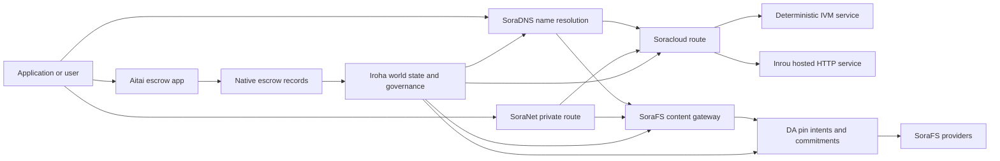

# ཞབས་ཏོག་ཚུ་ SORA Nexus {#sora-nexus-services}

SORA Nexus གིས་ Iroha 3 གི་མཐའ་འཁོར་ལུ་ གློག་རིམ་ཕྱོགས་ཀྱི ཞབས་ཏོག་གནམ་གྲུ་ཚུ་ཁ་སྐོང་འབདཝ་ཨིན། འདི་ཚུ་ Iroha འཛམ་གླིང་མངའ་སྡེ་དང་ Norito གི་གསལ་བསྒྲགས་ དེ་ལས་ གཞུང་གི་ཐོ་བཀོད་དང་ Torii གི་ལམ་གྱི་བཟའ་ཚང་ཚུ་གིས་ གཞི་བཙུགས་འབད་དེ་ཡོདཔ་ཨིན།

གྲུབ་འབྲས་འདི་ མཐུད་མཚམས བཟོ་སྐྲུན་ དང་ དྲ་རྒྱ གསལ་ཐོ ལུ་བརྟེན་ཏེ་ཨིན། ཁྱོད་ཀྱིས་ དམིགས༌པ༌ མཐུད་མཚམས ནང་ལུ་ ཨེཔ-ཨེ་པི གི་ལམ་འཚོལ་ནིའི་དོན་ལུ་ [ `/openapi.json`](/dz/reference/torii-endpoints.md#app-and-sora-route-families) ལག་ལེན་འཐབ་དགོ། མི་མང་གི་ ས་གནས་ཀྱི་ SoraFS CID དང་ ངོ་ཤེས་ཅན་གྱི་ལམ་ཚུ་ ཐོན་སྐྱེད་འབད་མི་ཡིག་ཆ་དེ་གི་ཕྱི་ཁར་བཙུགས་ཡོདཔ་ལས་ བརྟག་ཞིབ་འབད་བའི་སྐབས་ ལམ་འདི་ཐད་ཀར་དུ་བརྟག་དཔྱད་འབད་འོང་།

## ཆ་ཤས་ས་ཁྲ། {#component-map}

| ཆ་ཤས། | འགན་ཁུར། | ཁ་ཐོག་གཙོ་བོ། |
| ---------------------- | --------------------------------------------------------------- ------------------------------------------------------------------ | |
|Soracloud |ལག་ལེན་གྱི་ལག་ལེན་སྤེལ་འབད་ནི་དང་ ཞབས་ཏོག་མཁོ་སྤྲོད་འབད་ཐབས། སྒེར་གྱི་བཟོ་རྣམ་ / དུས་རྒྱུན་གནས་སྟངས་ དེ་ལས་ ཞབས་ཏོག་གི་ཚེ་རིང་འཛིན་སྐྱོང་། |`/v1/soracloud/*`, `/api/*`, `iroha soracloud service ...` |
|Inrou|ཐད་ཀར་གྱི་ HTTP རིམ་པ་དགོ་མི་ ཞབས་ཏོག བསྐྱར་བཅོས ཚུ་གི་དོན་ལུ་ Soracloud གིས་མགྲོན་སྐྱོང་འབད་མི་ HTTP ལག་བསྟར་མཉེན་ཆས།|Soracloud ལག་བསྟར་མཉེན་ཆས སྒྲིག་གཞི་, མགྲོན་སྐྱོང་གློག་འཕྲུལ ལྕོགས་གྲུབ གསལ་སྒྲགས་ཚུ་, འདྲ་བཤུས ལག་བསྟར་མཉེན་ཆས གནས་སྟངས་|
| SoraNet | གློག་ལམ་ བརྒྱུད་བཏང་རྒྱུན་འགྲུལ་ VPN འབྲེལ་མཐུད་ཚོགས་ཐེངས་ དེ་ལས་ རྒྱུན་འགྲུལ་ལམ་ཚུ་གི་གསང་སྲུང་དང་སྐྱེལ་འདྲེན་སྟེང་རིམ། | `/v1/connect/*`, `/v1/vpn/*`, SoraNet ལམ་གྱི་ཟུར་གནས་གནད་སྡུད། |
|གནད་སྡུད་ཚུ་ འཐོབ་ཚུགསཔ་ (DA) |འོང་འབབ་ཀྱི་དཔང་རྟགས་དང་ ཁས་བླངས་ དེ་ལས་ འབབ་ཁུངས་གི་དོན་ལུ་ ཤོག་ལེབ་ཚུ་ Nexus ཕྲང་ལམ་, SoraFS གསལ་སྟོན་ཚུ་དང་ བརྟག་དཔྱད་བྱ་རིམའི་ནང་བཀོད་ནུག |`/v1/da/*`, `FindDaPinIntent*`, `[nexus.da]` |
|SoraFS |ནང་དོན་ཁ་ཐུག་གི་ གནས་སྡུད་ཀྱི་ཐིག་ཁྲ། CAR ནང་དོན་གནད་སྡུད་གྱི་མཁོ་ཆས་ཚུ་ ཐོ་བཀོད་འབད་ཡོད་པའི་གནས་སྡུད་དང་ སྒོ་ལམ ལེན དེ་ལས་ ལོག་ཐོབ་ཚུགསཔ་བཟོ་ནིའི་ཁུངས་ཀྱི་བྱ་རིམའི་དོན་ལུ་|`/v1/sorafs/*`, `/sorafs/*`, `FindSorafsProviderOwner` |
|SoraDNS |SORA ནང་འདྲེན་འབད་མི་ ཞབས་ཏོག་དང་ གནད་དོན་ཚུ་གི་དོན་ལུ་ དངོས་གྲུབ་ཅན་གྱི་ མིང་བཏགས་ནི་དང་ སེལ་བྱེད་ངོས་སྦྱོར རིམ༌པ༌། |`/v1/soradns/*`, `/soradns/*`, སེལ་བྱེད ཐོ་གཞུང བྱུང་རིམ |
|Aitai |ཨེཔ་གི་གནས་ཚད་ནང་ ཕི་ཊ་དང་ རྒྱུ་དངོས་ཚུ་ གྲོས་བསྡུར་འབད་ནིའི་ལམ་ལུགས་དེ་ ནང་སྐྱེས བར་གཏོགས་བདག་ཉར ཐོ་ཡིག་ཚུ་གིས་ རྒྱབ་སྐྱོར་འབདཝ་ལས་ སོ་སོ་རྩིས་དེབ་ཅིག་གིས་མེདཔ། |`OpenAssetEscrow`, `FindAssetEscrow*`,`EscrowEventFilter`, Kotodama `escrow_*` བཟོ་སྐྲུན་འབད་ཐབས། |



## སྤྱིར་བཏང་གནས་རིམ་ཚུ་ {#common-flows}

### གནས་སྡོད་ཅན་གྱི་གློག་རིམ་ལག་ལེན་འཐབ་ནི་ {#hosted-split-application}

སྤྱིར་བཏང་སླ་བསྲེ་གནམ་གྲུའི་མཉེན་ཆས་ཀྱིས་ ཆ་ཤས་ཆ་མཉམ་གཅིག་ཁར་ལག་ལེན་འཐབ་ཨིན།

1. ཐོ་བཀོད་འབད་ཐངས་ཚུ་ SoraFS གི་ནང་འཁོད་ལུ་ བསྡུ་སྒྲིག་འབད་ཞིནམ་ལས་ སྦ་བཞག་ཡོདཔ་ཨིན།
2. དཔེ་འབད་བ་ཅིན་ མི་མང་གི་མགྲོན་ཁང་ `<app>.sora`, ཐོ་བཀོད་འབད་ཡོདཔ་ཨིན། SoraDNS.
3. Soracloud ཕྲང་ལམ་ཚུ་ `/api/v1/search` ཡང་ན་ `/api/v1/stream` ལུ་ Inrou HTTP ཞབས་ཏོག་ལུ་གཏང་གཏངམ་ཨིན་མས།
4. Soracloud ཕྲང་ལམ་ཚུ་ `/api/auth` དང་ `/api/v1/user` ཌེ་ཊི་མཱནསི་ཏིག་ IVM ལག་ལེན་པ་ཚུ་ལུ་ བཏོན་གཏང་།
5. སྲུང་སྐྱོབ་ཀྱི་ དགོས་མཁོ་ཡོད་མི་ ཚོང་མགྲོན་པ་ཚུ་གིས་ གནད་སྡུད་དེ་དང་འདྲན་འདྲ་ ཡང་ན་ API ཕྲང་ལམ་བརྒྱུད་དེ་ SoraNet ཕྲང་ཐིག་བརྒྱུད་དེ་ འགྱོ་ཚུགས།

| ལམ་ | རྒྱབ་སྐྱོར་གནམ་གྲུ། | ག་ཅི་འབད་ |
| ----------------- | --------------------- | |
| `/`               |SoraFS རྒྱུན་མ་ཆད་པའི་གནས་ཚད་ |སླར་ལོག་འབད་ཚུགས་པའི་ ནང་དོན་ ར༌ཏོག༌ དང་ སྒོ་ལམ གནས་སྐབས་གསོག |
|`/assets/*` |SoraFS རྒྱུན་མ་ཆད་པའི་གནས་ཚད་ |གནད་སྡུད་དང་འབྲེལ་བའི་ རྒྱུ་དངོས་ཚུ་དང་ གསལ་སྟོན་རྟགས་ཚུ་ |
|`/api/auth*` |Soracloud IVM |སླར་ལོག་འབད་ནིའི་ ཉེན་སྲུང་ཅན་གྱི་ བདེན་དཔྱད དང་ དངུལ་ཁུག འགྲན་རྟགས གནས་སྟངས |
|`/api/v1/user*` |Soracloud IVM |གཞུང་སྐྱོང-ཉེན་ཅན གནས་སྟངས འགྱུར་བ ཚུ་ |
|`/api/v1/search*` |Soracloud Inrou |HTTP ཞབས་ཏོག་, ཀ་ཤེ, SSE ཡང་ན་ བསྡུ་ལེན་འབད་མི་གནས་སྟངས་ |

### ནང་དོན་གསལ་བསྒྲགས། {#content-publication}

SoraFS དཔར་བསྐྲུན་ནང་ལུ་ མིང་རྟགས་བཀོད་པའི་ཧེ་མར་ ཡུན་བརྟན་ཅན་གྱི་ལག་ཆས་ཚུ་ བཟོ་སྐྲུན་འབད་ཡོདཔ་ཨིན།

1. ནང་དོན་གནད་སྡུད་གྱི་ཡོ་བྱད་ ཡང་ན་ཐོ་ཡིག་བཟོ་དགོ།
2. དེ་ CAR ཡིག་མཛོད་དང་ ཆ་ཤས་འཆར་གཞི་ནང་ བསྡུ་སྒྲིག་འབད།
3. Norito བརྡ་འགྲེལཔ་ཅིག་བཟོ་ནི་ འདི་ནང་ལུ་ པིན་ སྲིད་བྱུས་དང་ གཞུང་སྐྱོང་གི་ གནད་དོན་ཚུ་ཡོདཔ་ཨིན།
4. ཤོག་ལེབ་འདི་ Torii ལུ་བཙུགས་དགོ།
5. DA པིན་གྱི་དམིགས་གཏད་ ཡང་ན་ འོས་འབབ་གི་བཅའ་ཡིག་ཚུ་ ཡིག་ཐོག་ལུ་བཙུགས་ནི་དེ་ དམིགས་གཏད་ཀྱི་ཐོ་ཡིག་ནང་ གསལ་ཏོག་ཏོ་སྦེ་སྟོན་དགོཔ་སྦེ་བཀོད་འོང་།
6. བརྡ་བྱང་འདི་ SoraDNS མིང་རྟགས་ ཡང་ན་ Soracloud གནས་སྟངས་ཀྱི་གདོང་ཐུག་གི་ལམ་ཁར་བསྡམ་དགོ།

### སྒེར་གྱི་སྐྱེལ་འདྲེན་ ཡང་ན་ འགྲུལ་བསྐྱོད་ལམ་ {#private-fetch-or-streaming-route}

SoraNet གིས་ SoraFS ཡང་ན་ Soracloud གི་གདོང་ཁ་ལུ་སྡོད་ཚུགས།

1. མཁན་པོ་གིས་མིང་དང་ཡིག་གཟུགས་འདི་ སེལ་འཐུ་འབད།
2. སྲུང་རྒྱབ་ཀྱི་ཐོ་ཡིག་ཡང་ན་ལམ་སྟོན་ནང་འཛུལ་སྒོ་དང་ཐོན་ཐངས་ཚུ་ གདམ་ཁ་རྐྱབ་ཨིན།
3. རྒྱུན་འགྲུལ་ལུ་བར་ཤབས་བཙུགས་ཏེ་ SoraNet གློག་ལམ་བརྒྱུད་དེ་བཏངམ་ཨིན།
4. ཕྱིར་ཐོན་ཐངས་དེ་ SoraFS སྒོ་ལམ, Torii རོང་ཆུ་, ཡང་ན་ Soracloud རྒྱུན་ལམ ལུ་ལྷོད་ནུག

## ཨའི་ཊི་ {#aitai}

Aitaiའདི་ SORA ཚོང་ལམ་གྱི་རྣམ་ཐོར་ལུ་ བགོ་བཀྲམ་འབད་བའི་དོན་ལུ་ ལག་ལེན་ལམ་ཨིན་ འདི་ནང་ལུ་ཉོ་མི་དང་བཙོང་མི་གིས་ ཟ་ཁང་ལས་ཕྱི་ཁར་སྤྲོད་ལེན་ཚུ་ མཉམ་འབྲེལ་འབད་དོ་ཡོདཔ་ད་ Iroha གིས་ ཟ་ཁང་གི་ཁ་ཐུག་ལས་སྤྲོད་ལེན་འཐབ་ནི་དེ་ ལེན་དོ་ཡོདཔ་ཨིན། གྲལ་ཐིག་ནང་ཡོད་པའི་ རྒྱུ་དངོས་ཚུ་གི་ ཉེན་སྲུང་། ཨང་གྲངས་ཀྱི་རྒྱུ་དངོས་ཚུ་གི་ ཉེན་སྐྱོབ་གི་རྒྱུན་འགྲུལ་གྱི་དོན་ལུ་ ཁེ་གདམ་ཁ་ཅན་གྱི་རྩིས་ཐོའི་ཚབ་ལུ་ རང་ལུགས་ཀྱི་ ཉེན་སྲུང་གི་བརྡ་སྟོན་བཟའ་ཚན་འདི་ ལག་ལེན་འཐབ་དགོ།

ས་གནས་ཀྱི་བདག་དབང་གིས་ རྩིས་ཐོ་ནང་ བདག་འཛིན་འཐབ་ཨིན། བཙོང་མི་གིས་ `OpenAssetEscrow` དང་ཅིག་ཁར་ མཁོ་སྤྲོད་ཅིག་ཁ་ཕྱེ་སྟེ་ ཉོ་མི་གིས་ `AcceptAssetEscrow` དང་ `MarkEscrowPaymentSent` དང་ཅིག་ཁར་ རིམ་སྒྲིག་ཕྱི་ཁའི་གླ་ཆ་འདི་ངོས་ལེན་འབད་དེ་ རྟགས་བཀལཝ་ཨིནམ་དང་ བཙོང་མི་གིས་ `ReleaseAssetEscrow` དང་ཅིག་ཁར་ བཏོན་གཏངམ་ཨིན་ ཡང་ན་ གླ་ཆ་འདི་རྟགས་མ་བཀལ་བའི་ཧེ་མ་ ཆ་མེད་བཏངམ་ཨིན། ཉོ་མི་དང་བཙོང་མི་གིས་ མོས་མཐུན་མེད་པ་ཅིན་ ཕྱོགས་གང་རུང་གིས་ རྩོད་རྙོགས་ཁ་ཕྱེ་ཚུགས་ནི་དང་ `CanResolveEscrowDispute` དང་ཅིག་ཁར་ སེལ་འཐུ་འབད་མི་ཅིག་གིས་ བསྡམ་བཞག་ཡོད་པའི་དངུལ་འབོར་འདི་ བགོ་བཤའ་རྐྱབ་ཚུགས།

སྲོལ་རྒྱུན་གྱི་འཁོར་ལོའི་མཐའ་མ་ཚུ་གི་དོན་ལུ་ སྤྱིར་བཏང་བཅའ་ཡིག་གི་བཀག་སྡོམ་ཚུ་དང་ གསང་བའི་བར་གཏོགས་བདག་ཉརའི་རྩིས་ཐོ་ཚུ་ དྲི་བཀོད་དང་བྱུང་རྐྱེན་ཚུ་ དེ་ལས་ Rust དཔེ་འབད་བ་ཅིན་ [རང་སའི་རྒྱུ་དངོས་བཅོལ་ཉར](/dz/blockchain/escrow.md) ལུ་བལྟ་དགོ།

| Aitai ཁ་ངོས། | འདི་གི་དོན་ལུ་ལག་ལེན་འཐབ། |
| ----------------------------------------------------------------------- ----------------------------------------------------------------- | |
|`OpenAssetEscrow`, `AcceptAssetEscrow`,`MarkEscrowPaymentSent`, `ReleaseAssetEscrow`, `CancelAssetEscrow` |XOR ནང་གི་རྩིས་ཐོ་ཐོན་སྐྱེད་ཚུ་རྩིས་ཏེ་ དྭངས་འཕྲོས་འཕྲོས་སྦེ་ཡོད་མི་ ཨང་གྲངས་ཀྱི་རྒྱུ་དངོས་གྱི་ གྲལ་འདེབས་ཚུ་ཨིན། |
| `OpenAnonymousAssetEscrow`, `AcceptAnonymousAssetEscrow`, `MarkAnonymousEscrowPaymentSent`, `ReleaseAnonymousAssetEscrow`, `CancelAnonymousAssetEscrow` | མ་དངུལ་དང་ མཇུག་བསྡུའི་འགུལ་སྐྱོད་ཚུ་གི་དོན་ལུ་ བདེན་ཁུངས་མཉམ་སྦྲགས་ཚུ་ལག་ལེན་འཐབ་ཨིན། |
| `OpenEscrowDispute`, `ResolveEscrowDispute`, `OpenAnonymousEscrowDispute`, `ResolveAnonymousEscrowDispute` | རྩོད་རྙོགས་འཛུལ་ཞུགས་དང་ ཁྲིམས་ཁང་གི་ལུགས་སྲོལ་གྱི་ཐག་གཅོད། |
| `FindAssetEscrowById`, `FindAssetEscrowsBySeller`, `FindAssetEscrowsByBuyer`, `FindAssetEscrowsByStatus` | གློག་རིམ་གནས་ཚད་ཤོག་ལེབ་ཚུ་དང་ མཐུན་སྒྲིག་ལཱ་ཚུ་ དེ་ལས་ རྒྱབ་སྐྱོར་ལག་ཆས་ཚུ། |
| `EscrowEventFilter` | དྭངས་གསལ་གྱི་ཨེསི་ཀོརོ་མིང་རྟགས་བཀོད་མི་ཚུ་ ཨེསི་ཀོརོ་ཨའི་ཌི་ བཙོང་མི་ ཉོ་མི་ གནས་རིམ་ ཡང་ན་ བྱུང་རིམ་གྱི་རིགས་ཚུ་གིས་ འཚོ་བ་སྐྱེལ་དགོ། |
| Kotodama `escrow_open_offer`, `escrow_accept`, `escrow_mark_payment_sent`, `escrow_release`, `escrow_cancel`, `escrow_open_dispute`, `escrow_resolve_dispute` |Kotodama སྦ་སྒོའི་བརྡ་དོན་འདི་ V1 བར་གཏོགས་བདག་ཉར རིམ་ལུགས་འབོད གིས་རྒྱབ་སྐྱོར་འབད་ཡོདཔ་ཨིན།|

མི་མང་ Taira ཡང་ན་ Minamoto ལག་ལེན་གྱི་ མཐུད་མཚམས་ཕྱི་ཁའི་ དངུལ་སྤྲོད་ལྕགས་ལམ་དང་ རྒྱབ་སྐྱོར་གང་རུང་ ཡང་ན་ ཁྲིམས་ཁང་གི་ ལཱ་གི་རྒྱུན་རིམ་ཚུ་ ཞུ་ཡིག་སྲིད་བྱུས་སྦེ་ བརྩི་འཇོག་འབད། Iroha བདག་འཛིན་གནས་སྟངས་དང་ མི་ཚེའི་འཁོར་རིམ་གྱི་བྱུང་རིམ་ སྒྲུབ་བྱེད་ཀྱི་གསང་ཡིག་ཧ་ཤི་དང་ མཐའ་མའི་རྒྱུ་དངོས་འགུལ་སྐྱོད་ཚུ་ཐོ་བཀོད་འབདཝ་ཨིན། དེ་གིས་ ཕིཊ་གཞི་ཆགས་འདི་ རང་གིས་སྦེ་ བདེན་དཔྱད་མི་འབད།

## དམིགས་གཏད་ལྡེ་མིག་ཚུ་ བརྟག་དཔྱད་འབད་ {#check-a-target-node}

ཤོག་ལེབ་འདི་ནང་ལས་དཔེ་ཚུ་ལག་ལེན་མ་འཐབ་པའི་ཧེ་མ་ ཁྱོད་ཀྱིས་དམིགས་གཏད་བསྐྱེད་མི་ མཐུད་མཚམས་གུ་ལུ་ འགྲུལ་ལམ་བཟའ་ཚང་འདི་ཡོདཔ་ངེས་གཏན་བཟོ།

```bash
export TORII_URL=https://taira.sora.org

curl -fsS "$TORII_URL/openapi.json" \
  | jq '.paths | keys[] | select(test("^/v1/(soracloud|sorafs|soradns|connect|vpn|da)/"))'

curl -fsS -H 'Accept: application/json' "$TORII_URL/status" | jq .
```

`/openapi.json`འདི་ ཀ་ནོ་ནི་ཀིསི་ OpenAPI ཚད་མཇུག་ཨིན། ལམ་ཕྲང་གི་ཐོབ་ཐངས་དེ་ བཟོ་བསྐྲུན་འབད་ནིའི་ ཁྱད་ཆོས་དང་ གྲོག་ཐིག་བཟོ་སྒྲིག་ལས་བརྟེན་ཨིན། ཡིག་ཆ་འདི་གིས་ མི་མང་གི་ ས་གནས་ SoraFS CID དང་ ཡོངས་གྲགས་ཅན་གྱི་ལམ་ཕྲང་ཚུ་མ་བཀོད་དོ་ཡོདཔ་ཨིན། འདི་ཚུ་ཡང་ འོག་ལུ་བཤད་དོཝ་བཟུམ་སྦེ་ ཐད་ཀར་དུ་བརྟག་དཔྱད་འབད་དགོ།

### Taira ཀློག་ཆོག་པའི་ཐ་མག་བརྟག་དཔྱད། {#taira-read-only-smoke-checks}

མི་མང་ Taira API མཇུག་སྣོད་འདི་ ལྷག་ཕྱོགས་ཞིབ་དཔྱད་ཚུ་གི་དོན་ལུ་ཕན་ཐོགས་ཡོདཔ་ཨིན་ དེ་འབདཝ་ད་ ཁྱོད་ཀྱིས་ དབང་སྤྲོད་རྩིས་ཐོ་ཅིག་བཀོལ་སྤྱོད་འབད་དེ་ མི་མང་བརྟག་དཔྱད་ནེཊི་གནས་སྟངས་བསྒྱུར་བཅོས་འབད་ནི་གི་དམིགས་ཡུལ་མ་གཏོགས་ དཔེ་འགྱུར་བཅོས་འབད་ནིའི་དོན་ལུ་ ལག་ལེན་མ་འཐབ།

```bash
export TORII_URL=https://taira.sora.org

curl -fsS -H 'Accept: application/json' "$TORII_URL/status" \
  | jq '{version: .build.version, peers, blocks, lanes: (.teu_lane_commit | length)}'

curl -fsS "$TORII_URL/v1/vpn/profile" \
  | jq '{available, relay_endpoint, supported_exit_classes}'

curl -fsS "$TORII_URL/v1/sorafs/storage/peers?limit=4" \
  | jq '{gateway_base_url, pin_torii_urls}'

curl -fsS -H 'Accept: application/json' "$TORII_URL/v1/soracloud/status" \
  | jq '.control_plane | {service_count, services: [.services[] | {service_name, current_version}]}'
```

Taira གིས་ OpenAPI རྒྱུན་ལམ སྦྲེལ་སྒྲིག ནང་མ་བཀོད་པའི་ བཀྲམ་སྤེལ་དམིགས་བསལ ཚད་འཛིན་རིམ་པ རྒྱུན་ལམ ཚུ་སྟོན་ཚུགས། `/openapi.json` འདི་ དེ་ནང་ཡོད་མི་ རྒྱུན་ལམ ཚུ་གི་དོན་ལུ་བཟོ་ཡོད་པའི་ གན་རྒྱ་ སྦེ་བརྩི་དགོ། བཀྲམ་སྤེལ་དམིགས་བསལ རྒྱུན་ལམ ཚུ་དང་ མི༌མང༌ ས་གནས SoraFS རྒྱུན་ལམ ཚུ་ཐོབ་ཚུགསཔ་སྦེ་ཡིག་ཐོག་མ་བཀོད་པའི་ཧེ་མར་ དེ་ཚུ་ཐད་ཀར་དུ་ངོས་ལེན་འབད་དགོ།

## Soracloud {#soracloud}

Soracloud ནི་ SORA ལག་ལེན་ཚོད་འཛིན་ཁོད་སྙོམས་ཡིན། འདི་གིས་ བཀྲམ་སྤེལ་གྱི་བང་རིམ་དང་ ཞབས་ཏོག་བསྐྱར་ཞིབ་ འགྲུལ་ལམ་ བཀྲམ་སྤེལ་གནས་སྟངས་ དབང་ཚད་ཅན་གྱི་རིམ་སྒྲིག་ཐོ་བཀོད་ གསང་བཟོས་ཞབས་ཏོག་གསང་བ་ དཔེ་ཚད་ཐོ་བཀོད་དྲན་ཐོ་ སྒེར་གྱི་གྲུབ་འབྲས་ལཱ་ཡུན་ དེ་ལས་ མཉེན་ཆས་ལག་བསྟར་མཉེན་ཆས་མཐུན་འབྲེལ་གྲུབ་འབྲས་དྲན་ཐོ་ཚུ་ བརྟག་ཞིབ་འབདཝ་ཨིན།

Soracloud གིས་ ལག་ལེན་གྱི་རིམ་པ་གཉིས་ལག་ལེན་འཐབ་ཨིན།

| ལག་ལེན་འཐབ་ནིའི་གནམ་གྲུ། | གཡོག་བཀོལ་བའི་དུས་ཚོད། | འདི་གི་དོན་ལུ་ལག་ལེན་འཐབ། |
| ---------------------- | ------- | |
| `DeterministicService` | `Ivm` | དབང་ཆ, ཉེན་སྲུང་མཛོད གནས་སྟངས, ངོས་ལེན་འབད་ཡོད་པའི་ལྷག་ཐངས་ཚུ་ བཀོད་སྒྲིག་འབད་ཡོད་པའི་ཡིག་སྣོད་འཛིན་སྐྱོང་པ་ཚུ་ གཞུང་སྐྱོང་ལུ་ཚོར་ཤུགས་ཅན་གྱི་འགྱུར་བཅོས་ཚུ་ |
|`HttpService` |`Inrou` |ཐད་ཀར་དུ་ HTTP APIs, བསྡུ་ལེན་འབད་ནིའི་ལཱ་ལྗིད་དྲགས་, ཀ་ཤི་གིས་རྒྱབ་སྐྱོར་འབད་མི་ ཞབས་ཏོག་, SSE, གློག་ཀླད་ལག་ལེན་འཐབ་མི་ རྒྱུན་འགྲུལ་འཐབ་ནི་ |

ཚད་འཛིན་གྱི་གནས་ཚད་འདི་ ཡིད་ཆེས་ཅན་ཨིན། ལག་ལེན་འཐབ་ནི་, ཡར་དྲག་གཏང་ནི་, རྒྱབ་སྐྱོར་འབད་ནི་, གཞི་སྒྲིག་འབད་ནི་, གསང་བ་, བཟོ་བཀོད་དང་ གནས་སྟངས་ཀྱི་བཀའ་རྒྱ་ཚུ་ Torii གི་ཐོག་ལས་བཙུགས་ཞིནམ་ལས་ བསྐྱར་ཞིབ་འབད་དགོཔ་ཨིན། ཁོང་རང་སོ་སོ་གི་ CLI ས་གནས་ཀྱི་མེ་ལོང་ལུ་བློ་གཏད་མི་འབདཝ་ཨིན། མི་མང་གི་ལམ་སྟོན་འདི་ ཡུན་རིང་ཤོས་ སྔོན་སྒྲིག་ལུ་གཞི་བཞག་སྟེ་ཡོདཔ་ལས་ ཐོ་བཀོད་ཅན་གྱི་མགྲོན་སྡེ་ཅིག་གིས་ རྒྱུན་འགྲུལ་འཐབ་མི་ཚུ་ལུ་ HTTP ལམ་ལུགས་དང་ གཏན་འཁེལ་ཅན API ལམ་ལུགས་ཚུ་གི་བར་ན་ བཀྲམ་སྤེལ་འབད་ཚུགས།

### སྦྲེལ་མཐུད་འབད་ནིའི་ལག་ལེན་འདི་སྒྲོམ་བཟོ། {#scaffold-a-split-app}

བགོ་བཤའ་རྐྱབ་མི་མཉེན་ཆས་ཊེམ་པེལེཊི་གིས་ གནས་སྟངས་གདོང་ཕྱོགས་དང་ ཧོསཊི་འབད་ཡོད་པའི་ ཐད་རི་བ་རི་ API དང་ གཏན་འབེབས་བཟོ་མི་ བང་མཛོད་/API ཞབས་ཏོག་གཅིག་གསར་བསྐྲུན་འབདཝ་ཨིན།

```bash
iroha soracloud app init \
  --template split-app \
  --app-name solswap_indexer \
  --app-version 0.1.0 \
  --public-host solswap-indexer.sora \
  --output-dir ./apps/solswap-indexer

iroha soracloud app plan \
  --manifest ./apps/solswap-indexer/app_manifest.json

iroha soracloud app doctor \
  --manifest ./apps/solswap-indexer/app_manifest.json
```

`plan` གིས་ འགྲུལ་ལམ་བགོ་བཤའ་རྐྱབ་ནི་དང་ ཨ་ལུའི་ཞབས་ཏོག་གསལ་སྟོན་ ལཱ་གི་ས་སྒོ་ཡིག་གཟུགས་འགྲུལ་ལམ་ཚུ་ དེ་ལས་ རེ་བ་བསྐྱེད་ཡོད་པའི་གདོང་ཕྱོགས་དཔར་བསྐྲུན་ཐབས་ལམ་ཚུ་དཔར་བསྐྲུན་འབདཝ་ཨིན། `doctor` གིས་ ཁྱོད་ཀྱིས་ Torii འབྲེལ་གཏོགས་མ་འབད་བའི་ཧེ་མ་ ས་གནས་ཀྱི་གསར་བཏོན་གན་རྒྱ་འདི་ བདེན་དཔྱད་འབདཝ་ཨིན།

### ལག་ཆས་ཚུ་ལག་ལེན་འཐབ་ནི་དང་ བརྟག་ཞིབ་འབད་ནིའི་ གནས་སྟངས་ {#deploy-and-inspect-app-state}

གསར་བཏོན ལོག་སྟེ་འབད་ཐེངས་རེ་ལུ་ མ་འོངས་པའི་ SoraFS རང༌བཞག དུས་རིམ གཅིག་རང་ལོག་སྤྱོད་རྐྱབ། ལག་ལེན་མཉེན་ཆས་ཁ་ཕྱེ་བ ཊེམ་པེལེཊ ནང་ Inrou ཞབས་ཏོག ཡོདཔ་ལས་ ཡོངས༌འབྲེལ༌ཐོག༌ལས༌ འགྱུར་བ མ་འབད་བའི་ཧེ་མ་ གདམ་ཁ་རྐྱབ་པའི་ ཨོཕ་ལཱའིན བྱིན་མི བསགས་བཞག་ནི་ ཚུ་ནང་དེ་གི་ བཟོ་ཐོན ཏག་ཏག་ངོས་འཛིན་འབད།

```bash
export SORACLOUD_TORII_URL=https://<soracloud-enabled-torii>
export SORAFS_RETENTION_EPOCH=<future-unix-seconds>

iroha soracloud app preseed \
  --manifest ./apps/solswap-indexer/app_manifest.json \
  --sorafs-retention-epoch "$SORAFS_RETENTION_EPOCH" \
  --inrou-preseed-target <validator-account,peer-id,absolute-store-path> \
  --inrou-preseed-max-capacity-bytes <bytes> \
  --inrou-preseed-helper /absolute/path/to/sorafs-node \
  --inrou-preseed-helper-sha256 <lowercase-sha256> \
  --receipt-out /absolute/path/to/solswap-inrou-preseed.json

iroha soracloud app release \
  --manifest ./apps/solswap-indexer/app_manifest.json \
  --sorafs-retention-epoch "$SORAFS_RETENTION_EPOCH" \
  --inrou-preseed-receipt /absolute/path/to/solswap-inrou-preseed.json \
  --torii-url "$SORACLOUD_TORII_URL"

iroha soracloud app status \
  --manifest ./apps/solswap-indexer/app_manifest.json \
  --torii-url "$SORACLOUD_TORII_URL"
```

བཀྲམ་སྤེལ་སྲིད་བྱུས་ཀྱིས་དགོ་པའི་ཞབས་ཏོག་སྤྲོད་མིའི་གསོག་འཇོག་རེ་རེའི་དོན་ལུ་ `--inrou-preseed-target` ལོག་སྟེ་བཀོད། `release` གིས་གསལ་ཐོ་ཚུ་བཟོ་སྟེ་མཉམ་མཐུན་འབདཝ་དང་ ཨེཔ་གི་ `doctor` ལག་ལེན་འཐབ་ ཚད་ལྡན་ཨེཔ་གཞི་རྟེན་གྱི་བསྒྱུར་བཅོས་གཅིག་ཕུལ་ དབང་ཚད་ཅན་གྱི་གནས་སྟངས་མཐུན་སྒྲིག་འབད་ དེ་ལས་ གསལ་བསྒྲགས་འབད་ཡོད་པའི་ཐད་ཀར་དམིགས་གཏད་ཚུ་བདེན་དཔྱད་འབད། ཨེཔ་ནང་ Inrou ཅ་ཆས་ཡོད་པ་ཅིན་ སྔོན་སྒྲིག་འབྱོར་རྟགས་འདི་གདམ་ཁ་ཅན་མེན།

ཧེ་མ་ལས་བཀྲམ་སྤེལ་འབད་ཡོད་པའི་ཞབས་ཏོག་ཅིག་གི་དོན་ལུ་ ཞབས་ཏོག་ཁྱབ་ཚད་བརྡ་བཀོད་ཚུ་ལག་ལེན་འཐབ།

```bash
iroha soracloud service status \
  --service-name solswap_indexer_live \
  --torii-url "$SORACLOUD_TORII_URL"

iroha soracloud service rollback \
  --service-name solswap_indexer_live \
  --target-version 0.1.0 \
  --torii-url "$SORACLOUD_TORII_URL"
```

### གསང་བའི་ཡིག་ཆ་དང་ ཡིག་ཆ་ཚུ་ {#config-and-secret-material}

Soracloud རིམ་སྒྲིག་དང་གསང་བའི་ཐོ་བཀོད་ཚུ་ དབང་ཚད་ཅན་གྱི་བཀྲམ་སྤེལ་གནས་སྟངས་ཀྱི་ཆ་ཤས་ཨིན། དགོས་མཁོའི་རིམ་སྒྲིག་ཡང་ན་གསང་བའི་བཱའིན་ཌིང་ཚུ་ བརླག་སྟོར་ཞུགས་པའི་སྐབས་ ཡང་ན་ ཤུགས་ལྡན་གསལ་སྟོན་ཚུ་དང་ མ་མཐུནམ་སྦེ་ཡོད་པའི་སྐབས་ བཀྲམ་སྤེལ་དང་ཡར་འཕར་ དེ་ལས་ ལོག་བསྐོར་འཐུས་ཤོར་ཚུ་ ཁ་བསྡམ་ཡོདཔ་ཨིན།

```bash
iroha soracloud service config-set \
  --service-name solswap_indexer_live \
  --config-name indexer/public_config \
  --value-file ./config/public-config.json \
  --torii-url "$SORACLOUD_TORII_URL"

iroha soracloud service secret-set \
  --service-name solswap_indexer_live \
  --secret-name indexer/api_key \
  --secret-file ./secrets/api-key.envelope.json \
  --torii-url "$SORACLOUD_TORII_URL"
```

ཁྱོད་ཀྱིས་ CLI གྲོགས་རམ་འདི་ལག་ལེན་འཐབ་སྟེ་ ཁྱོད་ཀྱི་ཡིག་གཟུགས་ཀྱིས་ དགོས་མཁོ་ཅན་གྱི་ ངོ་སྤྲོད་རྟགས་ཚུ་འཚོལ་ཚུགས།

```bash
iroha soracloud service config-set --help
iroha soracloud service secret-set --help
```

## ནང་ཐིག་ཚུ་ {#inrou}

Inrou འདི་མགྱོནམ་ཅིག་ཨིན། HTTP ལག་ལེན་འཐབ་མི་ ལག་བསྟར་མཉེན་ཆས Soracloud. གཅིག་ Iroha སྦྲེལ་ཡོད་པའི་ཨེབ་ཐག་ Soracloud འགོ་བཙུགས་ནིའི་དུས་ཚོད་ཀྱི་ ལས་སྣ་ཚུ་ འཛུལ་ཞུགས་འབད་ཡོདཔ་ཨིན། Soracloud ས་གནས་ཀྱི་ལག་ལེན་གྱི་འཆར་གཞི་ནང་ ནང་འཁོད་ལུ་བཙུགས་ནི་ དེ་ལས་ བཀྲམ་སྤེལ་འབད་ཡོད་པའི་ ཞབས་ཏོག་གི་འདྲ་བཤུས་ཚུ་ རང་ལོག ཞབས་ཏོག་སྦེ་ འགོ་བཙུགས་ནི། འདི་ཡང་ སྙན་ཞུ་ཚུ་ ལག་བསྟར་མཉེན་ཆས གནས་སྟངས འདྲ་བཤུས སླར་ལོག་ལུ་ ངོས་འཛིན་ཅན་གྱི་དཔེ་རིམ་ནང་

Inrou ལག་ལེན་འཐབ་ནི་ ལཱ་གི་ཐོ་བཀོད་ནང་ལུ་ ཁྱོད་ཀྱིས་ HTTP ཕྲ་རིང་འབད་དགོཔ་ཨིན་ དཔེར་ན་ བསྡུ་ལེན་འབད་མི་ལྗིད་དྲགས་ APIs, SSE རྒྱུནའི་དོན་ལུ་ ཀེཤ་རྒྱབ་སྐྱོར་ཅན་གྱི་ལག་ལེན་འཕྲུལ་ཆས་ཚུ་དང་ ཡང་ན་ བརྒྱུད་འཕྲིན་ལས་ གྲོགས་རམ་ཐོབ་མི་ ཞབས་ཏོག་ཚུ་གི་དོན་ལུ་།

### དུས་རྒྱུན་གྱི་ དགོས་མཁོ་ཚུ་ {#runtime-requirements}

- དོས་ཆས་གསལ་སྟོན་ལག་བསྟར་མཉེན་ཆས་འདི་ `Inrou` འོང་དགོ།
- ཞབས་ཏོག་གསལ་སྟོན་ལག་ལེན་འཐབ་ནིའི་ཁོད་སྙོམས་འདི་ `HttpService` འོང་དགོ།
- `HttpService + Inrou` ལུ་ `PersistentRootLeaseVolume` ལུ་སྦྱར་བརྩེགས་འབད་ཡོད་པའི་ `/` གཅིག་གཏན་གཏན་དགོཔ་ཨིན།
- འདྲ་བཤུས་རྐྱབ་ཡོད་པའི་ཨིན་རོ་ཞབས་ཏོག་ཚུ་ལུ་ཡང་ བསྒྱུར་བཅོས་འབད་བཏུབ་པའི་ བརྗེ་སོར་གནས་སྟངས་འདི་ བདག་འཛིན་འཐབ་པའི་སྐབས་ བརྗེ་སོར་ཞབས་ཏོག་ཡང་ན་ གསང་བའི་གླ་ཁར་གསོག་འཇོག་དགོཔ་ཨིན།
- ཐོན་སྐྱེད་གཙོ་བོར་བཏོན་མི་ མཐུད་མཚམས་ཚུ་གིས་ ངོ་ཚབ་སྦེ་རྐྱངམ་ཅིག་ ལག་ལེན་འཐབ་ནིའི་ཚབ་ལུ་ ཨིན་རོའུ་གི་ནུས་ཤུགས་ངོ་མ་ཚུ་ ཁྱབ་བསྒྲགས་འབད་དགོ།

### གསལ་སྟོན་ཡིག་ཆ གི་ཆ་ཤས {#manifest-fragment}

འོག་གི་དཔེ་འདི་ གསལ་སྟོན་ཡིག་ཆ གཉིས་ཀྱི་དབྱིབས་ལུ་སྟོན་དོ་ཡོདཔ་ཨིན། འདི་ཆ་ཤས་ཅིག་ཨིན་མི་ བསྡུ་སྒྲིག་ལག་ལེན་འཐབ་མ་བཏུབ་ཨིན།

```jsonc
// container_manifest.json
{
  "schema_version": 1,
  "runtime": { "runtime": "Inrou", "value": null },
  "bundle_path": "/bundles/solswap-indexer.inrou",
  "entrypoint": "/app/bin/launch-indexer.sh",
  "args": [],
  "env": {
    "RUST_LOG": "info",
  },
  "inrou": {
    "schema_version": 1,
    "guest_os": { "guest_os": "DebianSlim", "value": null },
    "guest_images": {
      "x86_64": {
        "kernel_image_path": "/inrou/x86_64/vmlinux",
        "rootfs_image_path": "/inrou/x86_64/rootfs.ext4",
        "initrd_image_path": null,
      },
      "aarch64": {
        "kernel_image_path": "/inrou/aarch64/vmlinux",
        "rootfs_image_path": "/inrou/aarch64/rootfs.ext4",
        "initrd_image_path": null,
      },
    },
  },
  "lifecycle": {
    "start_grace_secs": 60,
    "stop_grace_secs": 30,
    "healthcheck_path": "/api/indexer/v1/health",
  },
}
```

```jsonc
// service_manifest.json
{
  "schema_version": 1,
  "service_name": "solswap_indexer_live",
  "service_version": "0.1.0",
  "execution_plane": { "execution_plane": "HttpService", "value": null },
  "replicas": 2,
  "route": {
    "host": "solswap-indexer.sora",
    "path_prefix": "/api/v1/search",
    "service_port": 8080,
    "visibility": { "visibility": "Public", "value": null },
    "tls_mode": { "tls": "Required", "value": null },
  },
  "lease_volumes": [
    {
      "volume_name": "root_disk",
      "kind": {
        "lease_volume": "PersistentRootLeaseVolume",
        "value": null,
      },
      "storage_class": { "storage_class": "Warm", "value": null },
      "mount_path": "/",
      "max_total_bytes": 8589934592,
    },
    {
      "volume_name": "index_state",
      "kind": { "lease_volume": "ServiceLeaseVolume", "value": null },
      "storage_class": { "storage_class": "Warm", "value": null },
      "mount_path": "/var/lib/solswap-indexer",
      "max_total_bytes": 1073741824,
    },
  ],
}
```

ལག་བསྟར་མཉེན་ཆས་ལུ་ སྦྱར་བརྩེགས་འབད་ཡོད་པའི་གླ་ཁར་སྐད་ཤུགས་རེ་རེ་བཞིན་དུ་ སྐད་ཤུགས་མིང་ལས་འབྱུང་བའི་མཐའ་འཁོར་འགྱུར་ཅན་ཚུ་བརྒྱུད་དེ་ གསལ་སྟོན་འབདཝ་ཨིན།

```text
SORACLOUD_LEASE_VOLUME_ROOT_DISK_DIR
SORACLOUD_LEASE_VOLUME_ROOT_DISK_MOUNT_PATH
SORACLOUD_LEASE_VOLUME_INDEX_STATE_DIR
SORACLOUD_LEASE_VOLUME_INDEX_STATE_MOUNT_PATH
```

## SoraNet {#soranet}

SoraNet འདི་ གསང་སྲུང་དང་སྐྱེལ་འདྲེན་སྟེང་རིམ་ཨིན། དམིགས་གཏད་སྒོ་ར་ཡང་ན་ ཞབས་ཏོག་ལུ་ཐད་ཀར་མཐུད་མ་དགོ་པའི་རྒྱུན་འགྲུལ་ལུ་ བརྒྱུད་སྐྱེལ་གཞི་བཞག་གི་ལམ་ཚུ་སྤྲོདཔ་ཨིན། སྐྱེལ་འདྲེན་བཟོ་རྣམ་གྱིས་ འཛུལ་སྒོ་ བར་མ་ དེ་ལས་ ཐོན་སྒོའི་བརྒྱུད་སྐྱེལ་འགན་ཁུར་ QUIC སྐྱེལ་འདྲེན་ Noise གཞི་བཞག་གི་སྦྲེལ་མཐུད་སྣ་འདུས་ ལྕོགས་གྲུབ་གྲོས་མཐུན་ བརྒྱུད་སྐྱེལ་ཐོ་ཡིག་གི་ཟུར་གནས་གནད་སྡུད་ དེ་ལས་ ཆེ་ཚད་གཏན་འབེབས་ཀྱི་བར་ཤབས་ཅན་གྱི་སྡེ་ཕྲན་ཚུ་ལག་ལེན་འཐབ།

Nexus གཞི་བཙུགས་ནང་ལུ་ SoraNet གིས་ གནད་སྡུད་ལེན་ཐོ་བཀོད་འབད་ནི་དང་ སྒོ་ལམ རྒྱུན་འགྲུལ་འཐབ་ནི་ དེ་ལས་ VPN ཡང་ན་ མཐུད་སྦྲེལ ལས་རིམ་ཚུ་དང་ Norito རྒྱང་བསྒྲགས་ལམ་སྟོན་ཚུ་འབད་ཚུགས། ཐོ་བཀོད་ཐོ་ཡིག་ནང་འཛུལ་མི་གིས་ `norito-stream` རྒྱབ་སྐྱོར་འབད་མི་ བརྒྱུད་འཕྲིན་ཚུ་རྟགས་དཔྱད་འབད་ཚུགས། དེ་གིས་མགྲོན་པ་ཚུ་ལུ་ Torii RPC ཡང་ན་ རྒྱང་བསྒྲགས།གི་དོན་ལུ་ འོས་འབབ་ཅན་གྱི་ལམ་ལུགས་ཚུ་ གདམ་ཁ་རྐྱབས་ཚུགསཔ་ཨིན།

### གློག་ཐག་ར་བ་གི་སྒྲིག་སྒྲིག {#streaming-configuration}

Nexus གི་ཡིག་གཟུགས་འདི་གིས་ SoraNet རྒྱུན་འགྲུལ་ལམ་གྱི་དོན་ལུ་ གྲ་སྒྲིག་འབད་ཚུགསཔ་ཨིན།

```toml
[streaming]
feature_bits = 0b11

[streaming.soranet]
enabled = true
exit_multiaddr = "/dns/torii/udp/9443/quic"
padding_budget_ms = 25
access_kind = "authenticated"
provision_spool_dir = "./storage/streaming/soranet_routes"
provision_spool_max_bytes = 0
provision_window_segments = 4
provision_queue_capacity = 256
```

ཁྱོད་ཀྱིས་ `access_kind = "read-only"` ལག་ལེན་འཐབ་ནི་དེ་ བལྟ་མི་གི་བདེན་འཛིན་མ་དགོ་པའི་ གནད་དོན་ཚུ་གི་དོན་ལུ་ཨིན། ཁྱོད་ཀྱིས་ `authenticated` ལག་ལེན་འཐབ་པ་ཅིན་ ཕྱིར་ཐོན་ཐངས་ཀྱིས་ ཐོ་བཀོད་ཚུ་དང་ ཡང་ན་ བལྟ་མི་གྱི་ ངོས་འཛིན་འདི་ Torii དང་ ཡང་ན་ ཞབས་ཏོག་མངམ་ཅིག་ལུ་ ཕར་འགྱོ་སའི་ཧེ་མ་ལག་ལེན་འབད་དགོ།

### SoraNet-ཤེས་ SoraFS འབག་ཤོག {#soranet-aware-sorafs-fetch}

SoraFS བཏབ་ནི་དེ་ CLI གིས་ ས་གནས་ནང་ལུ་ ངོ་ཚབ གསལ་སྟོན་ཡིག་ཆ དང་ SoraNet ཕྲང་ལམ་གྱི་ ཟུར་གནས་གནད་སྡུད གློག་ཀླད་ཁ་སྐོང་ ཡང་ན་ SDK མཐུན་སྒྲིག་འབད་མི་ཚུ གི་དོན་ལུ་དཀར་ཆག་བཟོཝ་ཨིན། རོལ་དབྱངས་སྒྲིག་མཁན JSON གིས་ `"emit_browser_manifest": true` ལུ་ `local_proxy` གསལ་སྟོན་འབད་དགོ་ དེ་ལས་ CLI འདི་ `local-quic-proxy` རྒྱབ་སྐྱོར་དང་གཅིག་ཁར་བཟོ་དགོཔ་ཨིན་མས། Taira ལུ་ ཐོ་བཀོད་འབད་ཡོད་པའི་ ཞབས་ཏོག་བྱིན་མི་གི་ཐོ་ཡིག་འདི་ མི་མང་གི་བརྟག་དཔྱད་དྲ་ལམ་གྱི་རྩ་བ་ལུ་ བརྟག་ཞིབ་འབད་ཞིནམ་ལས་ ཞབས་ཏོག་སྤྲོད་མི་གི་དོན་ལུ་ ཕྱིར་བཏོན་འབད་མི་ ཉེན་སྲུང་ཅན་གྱི་ ཞབས་ཏོག་སྐྱེལ་འདྲེན་ཐུབ་འདི་གང་གཏང་དགོ།

```bash
export TAIRA_ROOT=https://taira.sora.org
curl -fsS "$TAIRA_ROOT/v1/sorafs/providers?limit=20" | jq '.providers'

: "${TAIRA_SORAFS_PROVIDER_ID:?set the admitted provider ID from Taira discovery}"
: "${TAIRA_SORAFS_GATEWAY_KEY:?set the provider gateway key}"
: "${TAIRA_SORAFS_PROVIDER_URL:?set the advertised provider base URL}"
: "${TAIRA_SORAFS_STREAM_TOKEN_FILE:?set the issued stream-token file}"

cargo run -p sorafs_orchestrator --features=local-quic-proxy --bin=sorafs_cli -- \
  fetch \
  --plan=artifacts/payload_plan.json \
  --manifest-id=<manifest-digest-hex> \
  --orchestrator-config=artifacts/orchestrator.json \
  --provider=name=taira,provider-id="$TAIRA_SORAFS_PROVIDER_ID",gateway-key="$TAIRA_SORAFS_GATEWAY_KEY",base-url="$TAIRA_SORAFS_PROVIDER_URL",stream-token="$(cat "$TAIRA_SORAFS_STREAM_TOKEN_FILE")" \
  --output=artifacts/payload.bin \
  --json-out=artifacts/fetch_summary.json \
  --local-proxy-manifest-out=artifacts/proxy_manifest.json \
  --local-proxy-mode=bridge \
  --local-proxy-norito-spool=storage/streaming/soranet_routes \
  --local-proxy-kaigi-spool=storage/streaming/soranet_routes \
  --local-proxy-kaigi-policy=authenticated \
  --max-peers=2 \
  --retry-budget=4
```

བཅུད་དོན་འདི་གིས་ བྱིན་མི་གི་སྙན་ཞུ་དང་ ཆ་ཤས་ཐོབ་ཐངས་ ས་གནས་ཀྱི་ངོ་ཚབ་མེ་ཊ་ཌེ་ཊ་ དེ་ལས་ ལེན་ནིའི་དོན་ལུ་ལག་ལེན་འཐབ་མི་ ཕན་ནུས་ཅན་གྱི་འགྲུལ་ལམ་སྒྲིག་སྟངས་ཚུ་ ཐོ་བཀོད་འབདཝ་ཨིན།

### བརྒྱུད་སྤྲོད་སྐུལ་འདེད་བདེན་དཔྱད་པའི་ཐོ་ཡིག་ {#relay-incentive-verifier-roster}

རི་ལེ་སྐུལ་སློང་བཙུགས་ནི་འདི་ འཐུས་ཤོར་-ཁ་བསྡམས་ཡོདཔ་ཨིན། `incentives.enable` བདེན་པ་ཨིན་པའི་སྐབས་ `incentives.trusted_verifier_ids` ནང་ལུ་ ཉུང་མཐའ་ལུ་ ཚད་ལྡན་རྩིས་ཐོའི་ཨའི་ཌི་གཅིག་འོང་དགོ། སྐུལ་སློང་ཚུ་ ལྕོགས་མིན་བཟོ་བའི་སྐབས་ལུ་ཡང་ ཐོ་ཡིག་འདི་ ཐོ་བཀོད་༦༤ ལས་ལྷག་སྟེ་ ནམ་ཡང་ མ་བརྒལ་དགོ། རན་ཊའིམ་འདི་གིས་ གཏན་འབེབས་བཟོ་ཡོད་པའི་གོ་རིམ་སྒྲིག་ཡོད་པའི་ཆ་ཚན་སྦེ་གསོག་འཇོག་འབདཝ་ཨིནམ་དང་ རི་ལེ་འགོ་བཙུགས་པའི་སྐབས་ ནུས་མེད་ཐོ་ཡིག་དབྱིབས་རྩིས་འདི་བཀག་ཆ་འབདཝ་ཨིན།

`RelayBandwidthProofV1` རེ་རེ་བཞིན་དུ་ གཏན་འཇགས་གཞི་ཁྲམ་/བགོ་བཀྲམ་གྱི་འཆར་དངུལ་འོག་ལུ་ ཌི་ཀོཌི་འབད་ཡོདཔ་ལས་ གཞི་ཁྲམ་ཆ་ཚང་འདི་ ཟ་དགོཔ་ཨིན། བདེན་ཁུངས་ཀྱི་བདེན་དཔྱད་རྩིས་ཐོ་འདི་ རིམ་སྒྲིག་འབད་ཡོད་པའི་ཐོ་ཡིག་ནང་ལུ་འོང་དགོཔ་དང་ `RelayBandwidthProofV1::verify_signature()` མཐར་འཁྱོལ་དགོཔ་ཨིན། བློ་གཏད་མེད་པའི་ ཀིརིཔ་ཊོ་གཱར་ཕིག་མིང་རྟགས་བཀོད་མི་ ཡང་ན་ མིང་རྟགས་ནུས་མེད་/བརྡལ་བཤིག་གཏང་ཡོད་པའི་བདེན་ཁུངས་འདི་གིས་ འཇལ་ཚད་ཅིག་ཡང་ ཕན་གྲོགས་མི་འབདཝ་ལས་ སྐུལ་སློང་པར་རིས་ཅིག་ བཟོ་མི་ཚུགས།

## གནས་སྡུད་ཚུ་ཐོབ་ཚུགསཔ་ (DA) {#data-availability-da}

DA འདི་ འཛམ་གླིང་གནས་སྟངས་ནང་ ཐད་ཀར་དུ་ བཙུགས་ནིའི་དོན་ལུ་ མཐོ་དྲགས་དང་ སྒེར་གསང་ཚོར་ཤུགས་ཅན་ ཡང་ན་ ཞབས་ཏོག་དམིགས་བསལ་ཅན་ཚུ་གི་དོན་ལུ་ ཐོབ་ཚུགས་པའི་ སྒྲུབ་བྱེད་བང་རིམ་ཨིན། འདི་གིས་ ཁས་བླངས་དང་ ལོག་ཐོབ་ནིའི་འགན་ཁུར་ཚུ་ ཐོ་བཀོད་འབདཝ་ལས་ བདེན་དཔྱད་འབད་མི་དང་ འཛུལ་སྒོ་ དེ་ལས་ མཁོ་མངགས་འབད་མི་ཚུ་གིས་ བཱའིཊ་ག་འདི་ ཁས་བླངས་འབད་ཡོདཔ་ཨིན་ན་དང་ སྲིད་བྱུས་ག་འདི་ ལག་ལེན་འཐབ་ནི་ཨིན་ན་ དེ་ལས་ སྒྲུབ་བྱེད་ག་འདི་ བལྟ་བརྟོག་འབད་ཡི་ག་ ཁ་འཆམ་ཚུགསཔ་ཨིན།

DA གིས་ Kura ཡང་ན་ SoraFS གི་ཚབ་མ་ལུ་མེན།

- Kura གིས་ མཇུག་བསྡུ་ཚུགས་པའི་ བཀྲམ་སྤེལ་དང་ གྲོས་བསྟུན་སླར་གསོ་ ཌེ་ཊ་ཚུ་ གསལ་སྟོན་འབདཝ་ཨིན།
- SoraFS ཚོས་གཞི་དང་འབྲེལ་བའི་ བའི་ཊི་ཚུ་ ཐོ་བཀོད་འབད་ནི་དང་ ཞབས་ཏོག་སྤྲོད་ནི་, CAR འབབ་ཁུངས་ དེ་ལས་ མངོན་གསལ་བྱུང༌.
- DA གིས་ ཁས་བླངས་དང་ བདེན་ཁུངས་སྲིད་བྱུས་ བདེན་ཁུངས་ཁ་ཕྱེ་ནི་ དེ་ལས་ བཱའིཊི་དེ་ཚུ་ དུས་ཚོད་བཀོད་ནི་དང་ རྩིས་ཞིབ་འབད་ནི་ དེ་ལས་ རྩིས་ཐོ་གནས་སྟངས་ལུ་ ལོག་འབྲེལ་མཐུད་འབད་བཅུག་མི་ པིན་དམིགས་ཡུལ་ཚུ་ ཐོ་བཀོད་འབདཝ་ཨིན།

ཁྱོད་ཀྱིས་ DA ལག་ལེན་འཐབ་དོ་ཡོདཔ་ད་ ཞུ་ཡིག་ ཡང་ན་ Nexus ཕྲང་ལམ་ཅིག་ལུ་ ལེ་ཇར་ནང་མཐོང་ཚུགས་པའི་ ཁས་བླངས་འདི་ལག་ལེན་འབད་ཚུགསཔ་ཨིན། འཕྲལ་འཕྲལ་གྱི་དཔེ་གཞན་ཚུ་ནང་ གྲོས་འདེབས་རྒྱུན་འགྲུལ་ཚུ་གི་དོན་ལུ་ ཕྲང་རིང་གི་ནང་དོན་གནད་སྡུད་གྱི་འགན་ཁུར་ཚུ་ཚུདཔ་ཨིན། དཔར་བསྐྲུན་ཡོད་པའི་དོན་ཆས་ཚུ་གི་དོན་ལུ་ SoraFS པིན་དམིགས་གཏད། དབྱེ་ཞིབ་འབད་ནིའི་དོན་ལུ་བཞག་དགོཔ་ཨིན་མི་ བརྟག་དཔྱད་ལག་ཁྱེར་དང་ ལག་ལེན་ལག་ཆས་ཚུ་ ཡོངས་འབྲེལ་གྱི་གནས་སྟངས་དེ་ ནང་དོན་གནད་སྡུད ཡོངས་རྫོགས་ཀྱི་ཚབ་ལུ་ ཐོ་བཀོད་འབད་དགོཔ་ཨིན།

### སྲོལ་འཁོར་ {#lifecycle}

| གར་སྟེགས་ | ག་ཅི་སྒྲ་བཟུང་འབད་ཡི་ག་ |
| ---------- | ----------------------------------------------------------------------- ------------------------------------------------------------------------ |
| དམིགས་ཡུལ་ | ཤོག་བྱང་ མངོན་གསལ་གཞི་བསྟུན་ མིང་གཞན་ ལམ་/དུས་སྐབས་/གོ་རིམ་གཞི་བསྟུན་ བདག་འཛིན་སྲིད་བྱུས་ ཡང་ན་ འདྲ་བཤུས་དམིགས་ཚད། |
| ཁས་ལེན། | མངོན་གསལ་དང་ ལམ་གྱི་ནང་དོན་གནད་སྡུད་ བདེན་ཁུངས་བང་སྒྲིག་ ཡང་ན་ ནང་དོན་རྩ་བ་འདི་ ལེ་ཇར་མཐོང་ཚུགས་པའི་དྲན་ཐོ་ལུ་ བསྡམ་བཞག་མི་ དྲའི་ཇེསི་དངོས་པོ་ཚུ། |
| སྒྲུབ་བྱེད་ | ཐོབ་ཚུགས་པའི་ཚོགས་རྒྱན་ བདེན་ཁུངས་ཁ་ཕྱེ་མི་ བྱིན་མི་བདེན་ཁུངས་ ཡང་ན་ དམིགས་གཏད་ཡོངས་འབྲེལ་གྱིས་ངོས་ལེན་འབད་མི་ གསལ་སྡུད་དམིགས་བསལ་གྱི་བདེན་ཁུངས་གཞན་ཚུ། |
|དྲི་བཀོད་ |`FindDaPinIntentByTicket`, `FindDaPinIntentByManifest`, `FindDaPinIntentByAlias` ཡང་ན་ `FindDaPinIntentByLaneEpochSequence` གྱི་ཐོག་ལས་ བརྟག་ཞིབ་འབད་ནིའི་དོན་ལས་ ཤོག་ལེབ་ཚུ་ཨེབ་གཏང་འབདཝ་ཨིན།|

DA གིས་རྒྱབ་སྐྱོར་འབད་མི་ དཔར་བསྐྲུན་ཐོ་བཀོད་ལམ་ལུགས་འདི་:

1. WSV གི་ཕྱི་ཁར་ ནང་དོན་གནད་སྡུད་གྱི་ཁེ་རྒུད་བཟོ་ནི་དང་ ཐོབ་ནི་ དཔེར་ན་ SoraFS CAR ཡིག་སྣོད་ ཡང་ན་ Nexus ཕྲང་ལམ་གི་ ཁེ་རྒུད་ཚུ་ཨིན།
2. Norito གསལ་སྟོན་ཡིག་ཆ ཡང་ན་ རྒྱུན་ལམ-དམིགས་བསལ ཁས་ལེན ཐོ་བཀོདནང་ལུ་ ནང་དོན་གནད་སྡུད་གྱི་འགན་ཁུར་ཚུ་ གསལ་བཀོད་འབད་ཞིནམ་ད།
3. འགྲུལ་ལམ་བཟའ་ཚང་དེ་ལྕོགས་ཅན་བཟོ་བའི་སྐབས་ ཡང་ན་ ཡོངས་འབྲེལ་གྱི་མིང་རྟགས་བཀོད་ཡོད་པའི་ཚོང་འབྲེལ་འགྲུལ་ལམ་བརྒྱུད་དེ་ `/v1/da/*` བརྒྱུད་དེ་ གསལ་བསྒྲགས་དང་ པིན་དམིགས་ཡུལ་ ཡང་ན་ ཁས་བླངས་ཚུ་ བཙུགས།
4. བརྟན་རྟགས་དཔྱད་འབད་མི་ཚུ་དང་ ཐོབ་ཚུགསཔ་བཟོ་མི་ ཞབས་ཏོག་བྱིན་མི་ཚུ་གིས་ གྲུབ་འབྲས་ཚུ་ བསྡུ་བསྒྱོམ་འབད་དགོཔ་སྦེ་ སྲིད་བྱུས་ནང་བཀོད་ནུག།
5. མིང་རྟགས་མ་བཟོ་གོང་ལུ་ པིན་གྱི་དམིགས་གཏད་དང་ ཁས་བླངས་ཚུ་ བརྟག་ཞིབ་འབད་ཞིནམ་ལས་ ནང་དོན་གནད་སྡུད གུ་བརྟེན་མི་ ཟད་འགྲོ་བཏང་ཐངས་ ཡང་ན་ གེ་ཊི་བེཌི་ལམ་སེལ་འཐུ་འབད་ཚུགས།

### རྩིས་ཐབས་ཀྱི་དཔེ་གཞི་ {#algorithmic-model}

DA གིས་ ནང་དོན་གནད་སྡུད་འདི་ མིང་རྟགས་བཀོད་ཡོད་པའི་ བསྐྱར་རྩེད་ཉེན་སྲུང་འབད་མི་ སྡེབ་ཚན་ཟུར་ཐོ་བཀོད་ཡོད་པའི་ཁས་བླངས་ལུ་བསྒྱུར་བཅོས་འབདཝ་ཨིན། ཁག་ཆེ་བའི་ཨཱལ་གོ་རི་དམ་ཚུ་ ཐག་བཅད་ཚུགསཔ་ལས་ བདེན་དཔྱད་འབད་མི་དང་ འཛུལ་སྒོ་ཚུ་གིས་ བཱའིཊི་ཅོག་འཐདཔ་ནང་ལས་ བཅུད་བསྡུ་ཚད་ཅོག་འཐདཔ་ཚུ་ ལོག་སྟེ་རྩིས་རྐྱབ་ཚུགས།

1. བཏང་མི་ནང་དོན་གནད་སྡུད་གྱི་ཐོ་བཀོད་དེ་ ཀ་ནོ་སི་ཡཱན་བཟོ། Torii གིས་ `(lane_id, epoch, sequence)` དང་ནང་དོན་གནད་སྡུད་གི་ཐོ་བཀོད་ཀྱི་ཐོ་བཀོད། སྦྲེལ་འབད་ནིའི་དོན་ལས་ ཟུར་གནས་གནད་སྡུད, ཤོག་ལེབ་ཀྱི་ཆེ་ཆུང་། སོར་བཤུད་ཀྱི་ཐོ་ཡིག་ཚུ་དང་གཅིག་ཁར་ མཁོ་འདོད་ལེན་ཚུགས། བསྡུ་སྒྲིག་གི་ སྲིད་བྱུས་དང་ བཏང་མི་གི་མིང་ཐོ་བཀོད་ཨིན། མཐུད་མཚམས གིས་ དགོས་མཁོ་འབད་བའི་སྐབས་ལུ་ gzip, DEFLATE, ཡང་ན་ Zstandard གི་ནང་དོན་གནད་སྡུད་གྱི་ཅ་ལ་ཚུ་སེལ་འཐུ་འབད་ཞིནམ་ལས་ ཚད་ལྡན བཱའིཊི རིང་ཚད འདྲ༌མཉམ `total_size` ཨིན་མི་འདི་ བདེན་དཔྱད་འབདཝ་ཨིན།
2. ཕྲང་ལམ་དང་ བཀྲམ་སྤེལ་གྱི་བརྡ་དོན་ཚུ་ ངོས་འཛིན་འབད་ཐབས། ཐབས་ལམ་དེ་ Nexus ཕྲང་གི་ཐོ་ནང་ཡོད་དགོཔ་ཨིན། `chunk_size` འདི་ ༠ ལས་བརྒལ་མེད་མི་ གློག་ཤུགས་ ༢ དང་ ཉུང་ཤོས་ར་ བི་ཊ་༢ འབད་མི་ལུ་དགོ། སྦྲགས་གཏང་ནིའི་ཡིག་གཟུགས་ནང་ གནད་སྡུད་ཀྱི་ཐིག་ཁྲམ་དང་ ཉུང་ཤོས་རང་ ཐིག་ཁྲམ་གཉིས་ཆ་ར་ ཡོདཔ་ཨིན། བརྒྱུད་ལམ་གྱི་ཐོ་ཡིག་ནང་ལུ་ གྲུབ་རྟགས་བཟོ་རྣམ་ `merkle_sha256` ཡང་ན་ `kzg_bls12_381` བཙག་འཐུ་འབད་ཡོདཔ་ཨིན།
3. **ཡོངས་འབྲེལ་སྲིད་བྱུས་འཇུག་སྤྱོད་འབད།** མཐུད་མཚམས་འདི་གིས་ བོལབ་དབྱེ་རིམ་གྱི་དོན་ལུ་ རིམ་སྒྲིག་འབད་ཡོད་པའི་འདྲ་བཤུས་དང་ བདག་འཛིན་གཞི་རྟེན་འདི་ བཀག་དམ་འབདཝ་ཨིན། མི་མང་མེ་ཊ་ཌེ་ཊ་འདི་ ཚིག་ཡིག་གཙང་མ་སྦེ་སྡོད་དགོ། གཞུང་སྐྱོང་རྐྱངམ་ཅིག་གི་མེ་ཊ་གནད་སྡུད་འདི་ གསལ་སྟོན་ནང་ལུ་མ་བྲིས་པའི་ཧེ་མ་ མཐུད་མཚམས་ཀྱི་རིམ་སྒྲིག་འབད་ཡོད་པའི་གཞུང་སྐྱོང་མེ་ཊ་གནད་སྡུད་ལྡེ་མིག་དང་གཅིག་ཁར་ གསང་བཟོ་འབད་ཡོདཔ་ཨིན།
4. **ཆ་ཤས དང གཏན་འཁེལ.** ཚད་ལྡན་ནང་དོན་གནད་སྡུད་འདི་ `chunk_size` ལས་འབྱུང་མི་ གཏན་བཟོས་ཚད་གསལ་སྡུད་དང་གཅིག་ཁར་ ཆ་ཤས་བཟོཝ་ཨིན། Torii གིས་ ནང་དོན་གནད་སྡུད བསྡུས་རྟགས དང་ ལོག་ཐོབ་ཚུགས་པའི་བདེན་ཁུངས་ཤིང་གི་རྩ་བ་ དེ་ལས་ ཆ་ཤས་རེ་རེ་གི་ཁས་བླངས་ཚུ་ རྩིས་སྟོནམ་ཨིན། གནད་སྡུད་ཆ་ཤས་ཚུ་གིས་ ཁོང་རའི་བཱའིཊི་ཚུ་གུར་ BLAKE3 ཁས་བླངས་ཚུ་འབག་འོང་།
5. **བཏོན་གཏང་ནིའི་ཁས་ལེན་ཚུ་ཁ་སྐོང་རྐྱབས།** ཆ་ཤས་ཚུ་ `data_shards` གི་ཐིག་ཁྲམ་ཚུ་ནང་སྡེ་ཚན་བཟོཝ་ཨིན། མཐའ་མཇུག་གི་ཐིག་ཁྲམ་ནང་ལུ་བརླག་སྟོར་ཤོར་བའི་ནང་ཐིག་ཚུ་ འདྲ་མཉམ་རྩིས་སྟོན་གྱི་དོན་ལུ་ ཀླད་ཀོར་བཀང་ཡོདཔ་ཨིན། RS(16) ཆ་མཉམ་གྱིས་གྲལ་ཐིག་/ཡོངས་ཁྱབ་ཆ་མཉམ་ཤརཌི་ཚུ་གསར་བསྐྲུན་འབདཝ་ཨིན། གདམ་ཁ་ཅན་གྱི་ `row_parity_stripes` མེ་ཊིགསི་བདའ་སྟེ་ ཀེར་ཐིག་བཟོ་རྣམ་གྱི་ ཐིག་ཁྲམ་འདྲ་མཉམ་ཁ་སྐོང་འབད། པེ་རི་ཊི་ཤཱརཌི་ཁས་ལེན་ཚུ་ ལི་ཊིལ་ཨེན་ཌི་ཡན་ `u16` བརྡ་མཚོན་ཚུ་གི་ BLAKE3 དྲའི་ཇེསཊི་ཚུ་ཨིན།
6. འགྲེམ་སྟོན་བཟོ་ཐབས། `DaManifestV1` གིས་ ཕྲང་ལམ་, དུས་རབས་, བལབ་གི་དབྱེ་རིམ་, ཨང་སྒྱུར, ནང་དོན་གནད་སྡུད་གྱི་ཁེ་རྒུད་ཐོ་བཀོད་, ཐིག་ཁྲམ་རྩ་ཆ། ཐིག་ཁྲམ་གྱི་ཆེ་ཆུང་། མཚམས་འཇོག་འབད་ཐབས། སྲིད་བྱུས་, རིན་བསྡུར་གནས་གོང་། ཐིག་ཚད་ཀྱི་བཅའ་གཏད། གདམ་ཁ་རྐྱབས་ཅན་གྱི་ IPA བཅའ་གཏད་ཐོ་བཀོད། མེ་ཊ་ཌའི་ཊ་ཊཱལ་དང་ ཐོན་སྐྱེད་དུས་ཚོད་ཚུ་ཨིན། ཐོ་བཀོད་ཐོ་བཀོད་འདི་ ངེས་གཏན་ཅན་ཨིན། མཐུད་མཚམས གིས་ འགོ་དང་པ་ གསལ་སྟོན་ཡིག་ཆ དཔེ་གཞི འདི་ སྟོངམ འཛུལ་རྟགས དང་གཅིག་ཁར་ བསྡུས་རྟགས་ཚུ བཏོན་ཞིནམ་ལས་ མཐའ་མཇུག་གི་ `storage_ticket`སྦེ་མཛུབ་རྟགས་དེ་ལོག་འབྲི་འོང་།
7. **བསྐྱར་གཏང་རྩོད་རྙོག་ཚུ་བཀག་ཆ་འབད།** བསྐྱར་གཏང་ལྡེ་མིག་འདི་ `(lane_id, epoch, sequence, manifest_fingerprint)` ཨིན། མཛུབ་མོ་གཅིག་མཚུངས་ཡོད་པའི་འདྲ་བཤུས་འདི་ ནུས་མེད་ཨིན། གོ་རིམ་རྙིངམ་ཅིག་ཡང་ན་ མཛུབ་མོ་གི་པར་སོ་སོ་ཡོད་པའི་གོ་རིམ་གཅིག་པ་འདི་ བཀག་ཆ་འབད་ཡོདཔ་ཨིན།
8. ཡིག་རྟགས་བཀོད་མི་ ཅ་ཆས་ཚུ་ བཏོན་གཏང་། Torii ཀི་པུ་ཊ་ PDP ཁས་བླངས་, ཡིག་རྟགས་ཚུ་ `DaIngestReceipt`, བཟོ་སྐྲུན་འབདཝ་ཨིན། `DaCommitmentRecord`, དེ་ལས་དཔེ་སྐྲུན་ཁང་གི་བཟོ་རྣམ་ཚུ་ གསལ་སྟོན་འབད་ནི་གི་དོན་ལུ་ བཙུགས་ཏེ་བྲིས་བཞག་ནུག PDP ཁས་བླངས་, ཁས་བླངས་ཀྱི་ཐོ་ཡིག་, ཁས་ལེན་གྱི་དུས་ཡུན་, པིན་གི་དམིགས་གཏད་, འཁྲུན་ཆོད་ཡིག་སྣོད་དང་ འཁྲུན་རྟགས་ཀྱི་ཐོ་ཡིག་. སྐྱིན་འགྲུལ་ཐོ་བཀོད་ འཚོལ་རྟགས འདི་ནང་ལུ་ གཅིག་རྐྱང་ `(lane_id, epoch)`.

ཁས་བླངས་ཐོ་བཀོད་ཚུ་ བཀག་ཆ་ཚུ་གིས་ ག་ཅི་འབག་འོང་ག། དྲན་ཐོ་ཅིག་གིས་ བསྡམ་བཞགཔ་ཨིན།

- ལམ་ཐིག་དང་དུས་སྐབས་ དེ་ལས་གོ་རིམ།
- འབོད་བརྡ་འབད་མི་ བློཔ་ཨའི་ཌི་དང་ ཚད་ལྡན་ མེ་ནིཕཊ་ཧ་ཤི།
- ལམ་བདེན་དཔང་འཆར་གཞི།
- ཆ་ཤས་རྩ་བ།
- KZG ཕྲང་ལམ་ཚུ་གི་དོན་ལུ་ གདམ་ཁ་རྐྱབ་བཏུབ་པའི་ ཁས་བླངས་དེ་ KZG
- PDP/བརྟག་དཔྱད་འབད་ཐངས་
- ཉར་ཚགས་འཛིན་གྲྭ་དང་གསོག་འཇོག་འཛིན་བྱང་།
- Torii DA ངོས་ལེན་གྱི་རྟགས་མཚན་

སྦྲག་ནང་ DA ཐོ་བཀོད་ཚུ་བཙུགས་མ་ཚར་བའི་ཧེ་མར་ སྦྲགས་ཀྱི་བཅའ་སྒྲིག་ལམ་འདི་གིས་ བུད་སྒྲོམ་དེ་ བདེན་ཁུངས་བཀལ་འོང་།

- `(lane_id, epoch, sequence)` འདི་ བང་རིམ་ནང་ལུ་ གཞན་དང་མ་འདྲཝ་སྦེ་དགོཔ་ཨིན།
- གསལ་སྟོན་ཧ་ཤི་ཚུ་ བང་རིམ་ནང་ལུ་ ཀླད་ཀོར་མེན་མི་དང་ གཞན་དང་མ་འདྲཝ་སྦེ་དགོ།
- ཁས་བླངས་བདེན་དཔང་འཆར་གཞི་འདི་ རིམ་སྒྲིག་འབད་ཡོད་པའི་ ལམ་སྲིད་བྱུས་དང་མཐུན་དགོ།
- Merkle ཕྲང་ལམ་ཚུ་ ངོས་ལེན་མ་འབད KZG ཁས་བླངས་ཚུ་ KZG ཕྲང་ལམ་ཚུ་ནང་ ༠ ལས་བརྒལ་མེད་དགོཔ་ཨིན། KZG ཁས་བླངས་འབད་ནི་
- པིན་དམིགས་ཡུལ་ཚུ་ ལམ་ལུགས་དང་ དབྱེ་སེལ་འབད་དེ་ ལམ་ལུགས་དང་ གསལ་སྟོན་ཧེཤ་ གསོག་འཇོག་ཤོག་བྱང་ ཇོ་བདག་རྩིས་ཐོ་ དེ་ལས་ མིང་གཞན་ཁ་ཐུག་རྐྱབ་ནིའི་ལམ་ལུགས་ཚུ་གིས་ ཚགས་མ་བཏངམ་ཨིན།

སྡེབ་ཚན་མགོ་ཡིག་འདི་གིས་ DA བདེན་ཁུངས་སྲིད་བྱུས་དང་ཁས་བླངས་ དེ་ལས་ པིན་དམིགས་ཡུལ་ཚུ་གི་དོན་ལུ་ གསང་ཡིག་ཧ་ཤི་ཚུ་གསོག་འཇོག་འབདཝ་ཨིན། འཐུས་མིའི་བདེན་ཁུངས་ཚུ་གི་དོན་ལུ་ ཁས་བླངས་བང་སྒྲིག་འདི་གིས་ མར་ཀལ་རྩ་བ་འདི་ཡང་ གསལ་སྟོན་འབདཝ་ཨིནམ་ད་ དེ་གི་འདབ་མ་ཚུ་ ཚད་ལྡན་ Norito ཨང་སྒྱུར་ཅན `DaCommitmentRecord` གནས་གོང་ཚུ་གི་ གསང་ཡིག་ཧ་ཤི་ཚུ་ཨིན། ཕམ་གྱི་མཐུད་མཚམས་ཚུ་ གཡོན་དང་གཡས་ཀྱི་ཨ་ལོ་ཚུ་གི་མཉམ་མཐུད་འདི་ ཀིརིཔ་ཊོ་གཱར་ཕིག་གིས་ ཧེཤ་འབདཝ་ཨིན། འདབ་མ་ཕྱེད་ཀ་ཅིག་ ཤུལ་མམ་གྱི་བང་རིམ་ལུ་ བསྒྱུར་བཅོས་མེད་པར་ ཡར་འཕར་འབདཝ་ཨིན།

### གྲུབ་འབྲས་ཚུ་ བརྟག་དཔྱད་འབད་ནི་ {#proof-verification}

`/v1/da/commitments/prove` གིས་ བཀྲམ་སྤེལ་འབད་ནིའི་ ཁས་བླངས་གཅིག་གི་དོན་ལུ་ གྲུབ་རྟགས་བཟོ་ཚུགས། གྲུབ་རྟགས་ནང་ ཁས་བླངས་, བཀྲམ་དབྱངས་མཐོ་ཚད་, ཆ་ཚན་ནང་གི་ཐོ་བཀོད་, ཆ་ཚན་ཧེཤ་, ཆ་ཚན་རིང་ཐུང་, Merkle རྩ་བ, དང་སྲིངམོ་ལམ་ཚུ་ཡོདཔ་ཨིན། བདེན་དཔྱད་བརྟག་དཔྱད་:

1. བརྟག་དཔྱད་ཐིག་གི་ཧེཤ་འདི་ སྡེབ་ཚན མགོ་ཡིག གི་ DA ཁས་ལེན བསྡུས་རྟགས དང་འདྲ་མཉམ་ཨིན།
2. བདེན་དཔང་སྡེབ་ཚན་མཐོ་ཚད་འདི་གཞི་བསྟུན་སྡེབ་ཚན་མགོ་ཡིག་དང་མཐུན་སྒྲིག་འབདཝ་ཨིན།
3. ཚད་འཛིན་དེ་ མཐའ་མཚམས་ནང་ཡོདཔ་དང་ ཁས་བླངས་འདི་ ནང་ཐིག་གི་ཐོ་ཡིག་ལུ་འདྲན་འདྲ་ཨིན།
4. རྒྱང་ལམ་བརྟག་དཔྱད་ཀྱི་ སྲིད་བྱུས་འདི་གིས་ ཁས་བླངས་འདི་ཁས་ལེན་འབད་ཡོདཔ་ཨིན།
5. ཁས་བླངས་ཀྱི་ལྕོག་གུ་ལས་ སྤུན་ཆ་གི་ལམ་ལོག་བཏོག་པ་ཅིན་ གཞི་བཙུགས་འབད་ཡོད་པའི་རྩ་བ་འདི་ སླར་ཡང་བཟོ་ཡོདཔ་ཨིན།
6. བསྐྱར་བཟོ་འབད་ཡོད་པའི་རྩ་འདི་ བང་སྒྲིག་རྩ་དང་འདྲ་མཉམ།

འདི་གིས་ བཀྲམ་སྤེལ་འབད་ནིའི་ ཁས་བླངས་དེ་ དམིགས་བསལ་གྱི་ སྦྲག་གི་ནང་དོན་གནད་སྡུད་ནང་ལུ་ཚུད་ཡོད་པའི་ཁུངས་བཀལཝ་ཨིན། དེ་གིས་དཔེ་ཆ་རེ་རེ་ལུ་ ད་ལྟོའི་བར་ན་ཡང་ ཡོངས་འབྲེལ་ནང་ཡོད་མེད་ཀྱི་ཁུངས་བཀལཝ་མེདཔ། སྲོག་ཐོག་སླར་ལོག་འབད་ནི་དེ་ SoraFS ཞབས་ཏོག་མཁོ་སྤྲོད་མི་ལུ་ བསྡུ་ལེན་འབད་ནི་དང་ PDP/PoTR བརྟག་དཔྱད་འབད་ནི་དང་ ཡང་ན་ ཌེ་བི་སི་ཊི་བཱལ་གྱི་དོན་ལུ་ ཐོབ་ཐངས་ཀྱི་རྟགས་མཚན་ཚུ་ཐོག་ལས་ ལགཔ་སོ་སོར་སྦེ་བརྟག་ཞིབ་འབདཝ་ཨིན།

### གྲོས་བསྟུན་གྱི་འབྲེལ་བ་འཐབ་ནི་ {#consensus-interaction}

གྲོས་བསྟུན་ཅན་གྱི་ ནང་དོན་གནད་སྡུད་གྱི་ནང་དོན་གནད་སྡུད་དེ་ དགོངས་མཁོ་ཅན་ཅིག་ཨིན་ དེ་འབདཝ་ད་ འདི་མཇུག་བསྡུ་ནིའི་དོན་ལས་ གཉིས་པ་མིན་འདུག་ འགོ་དཔོན་གྱིས་ `PayloadManifest` ཚོགས་སྡེ་ཡོངས་ལུ་ ཕྱག་རྟགས་བཀོད་མི་ `3f + 1` བཏང་དོ་ཡོདཔ་ཨིན། འགོ་དང་པ་གི་གཟུགས་དང་ RS16 སྦྲག་འབྱུང་ནིའི་ དམིགས་གཏད་དེ་ གཞི་སྒྲིག་ A འདི་ཨིནམ་ད་ `2f + 1` གི་འཐུས་མི་ཚུ་ནང་ དོ་དཔོན་དང་ བཀྲམ་སྤེལ་འབད་མི་ཚུ་གི་མཇུགཔ་ཡང་ ཡོདཔ་ཨིན། མཐའ་ཟུར་གྱི་ མཐོང་སྣང་སླར་ལོག་ཀྱིས་ གཟུགས་དང་ སྦྲགས་ཀྱི་ཞབས་ཏོག་འདི་ ཚོགས་སྡེ་ཡོངས་ལུ་ རྒྱ་སྐྱེད་འབདཝ་ཨིན།

གསལ་སྟོན་ཡིག་ཆ ཡང་ན་ ཆ་ཤས ཤརཌ སྡེ༌ཚན༌ རྐྱངམ་གཅིག་གིས་ ཚོགས་རྒྱན འབད་ནི་ལུ་མི་འདང་། གྲ་སྒྲིག་འབད་བ་ གི་ཧེ་མར་ བདེན་དཔྱད་པ རེ་རེ་གིས་ དུམ་བུ ཚུ་ བདེན་དཔྱད འབད་དེ་ ཆ་ཚང ཚད་ལྡན ནང་དོན སླར་བཟོ་དགོ། དེ་གི་ རིང་ཚད་, དུམ་བུ ར༌ཏོག༌ དང་ ནང་དོན བསྡུས་རྟགས བདེན་དཔྱད་འབད་དེ་ ནང་དོན འདི་ཉར་ཚགས་འབད་ཞིནམ་ལས་ གཏན་འབེབས་རིང་ལུགས སྡེབ་ཚན བདེན་དཔང་ མཇུག་བསྡུ་དགོ། བདེན་དཔྱད་པ གིས་ ནང་དོན ཏག་ཏག་ འདི་ CommitQC ལག་ལེན་མཉེན་ཆས ཡང་ན་ ངོས་སྦྱོར་ཅན ལོག༌ཐོབ༌ ཚུན་ཚོད་བཞག་དགོ།

མཉམ་རོགས་ཀྱིས་ གཟུགས་མ་ཐོབ་པའི་ཧེ་མ་ ལག་ཁྱེར་ཅིག་ལྷབ་པའི་སྐབས་ དང་པ་ ལག་ཁྱེར་གྱི་མཚན་རྟགས་བཀོད་མི་ཚུ་ལས་ བདེན་བཤད་འབད་ཡོད་པའི་ ཆ་ཤས་ཚུ་ ཡང་ན་ ཚད་ལྡན་གྱི་ གཟུགས་འདི་ ཞུ་བ་འབད་ཞིནམ་ལས་ གྱང་ཤུགས་ཅན་གྱི་ཚོགས་ཆུང་ལུ་ ལོག་ཐོབ་ནི་འདི་ རྒྱ་སྐྱེད་འབདཝ་ཨིན། ལན་རེ་རེ་བཞིན་དུ་ མཐོ་ཚད་ཀྱི་སྐབས་དོན་དང་ གྲོས་འཆར་སྐོར་རིམ་ གསལ་བསྒྲགས་ དེ་ལས་ གཟུགས་ཀྱི་དོན་ཚན་ཚུ་ལུ་ བརྟེན་ཏེ་སྡོདཔ་ཨིན། སྡེབ་ཚན་འདི་ ས་གནས་ནང་བསྐྱར་བཟོ་འབད་ཡོད་པའི་གཟུགས་འདི་ ལག་ཁྱེར་དང་མཐུན་སྒྲིག་འབད་བའི་ཤུལ་ལས་རྐྱངམ་ཅིག་ འཇུག་སྤྱོད་འབདཝ་ཨིན།

### ལས་འཛིན་གྱི་ཡི་གུ་ཚུ་ {#operator-notes}

Iroha 3 མོས་མཐུན་གསལ་སྡུད་ནང་ དུས་རྒྱུན་དུ་ མཚན་རྟགས་བཀོད་ཡོད་པའི་ གསལ་བསྒྲགས་དང་ RS16 ནང་དོན་གནད་སྡུད ཁྱབ་སྤེལ་ གཟུགས་ཆ་ཚང་ གྲ་སྒྲིག་འབད་བའི་ཧེ་མ་ བདེན་དཔྱད་ DA བཱན་ཌལ་བདེན་དཔྱད་ དེ་ལས་ མཐའ་མཚམས་སླར་གསོའི་ ཊེ་ལི་མི་ཊི་ཚུ་ ཚུདཔ་ཨིན། བཀོད་སྒྲིག་དང་མཐུན་འབྲེལ་མཚམས་ཚུ་ མཚན་རྟགས་བཀོད་ཡོད་པའི་མཐོ་ཚད་སྐབས་དོན་ནང་ལུ་ གྱང་ཤུགས་ཅན་སྦེ་ཡོདཔ་ཨིན། དེ་ཚུ་ལྕོགས་མིན་བཟོ་ནི་ཡང་ན་ ལོག་ངེས་འཛིན་འབད་ཚུགས་པའི་ ཉེ་གནས་སོར་བསྒྱུར་ཡང་ན་ དུས་ཚོད་རྫོགས་པའི་གསལ་སྡུད་མེདཔ་ཨིན། མཐུད་མཚམས་-ས་གནས་ཀྱི་སྡེབ་ཚན་དང་ བང་རིམ་མཚམས་ཚུ་ ད་ལྟོ་ཡང་ བཀྲམ་སྤེལ་གྱི་མིང་རྟགས་བཀོད་ཡོད་པའི་སྒྲིག་བཀོད་དང་ ལཱ་གི་མངོན་གསལ་ཚུ་ མཐུན་སྒྲིག་འབད་དགོཔ་ཨིན།

ཕྲང་ལམ་འཚོལ་ནིའི་དོན་ལུ་ མཐུད་མཚམས གི་ཡིག་ཆ་ OpenAPI ལས་འགོ་བཙུགས་དགོ།

```bash
curl -fsS "$TORII_URL/openapi.json" \
  | jq '.paths | keys[] | select(startswith("/v1/da/"))'
```

ད་ལྟོའི་ DA འདྲི་དཔྱད གི་མིང་ཚུ་གི་དོན་ལུ་ [འདྲི་དཔྱད ཁ་བྱང་](/dz/reference/queries.md#nexus-data-availability-and-packages) ལག་ལེན་འཐབ། གློག་རིམ གནས་རིམ་གྱི་ `[nexus.da]` ནང་འཇུག དང་ དཔེ་ལེན དེ་ལས་ རྩིས་ཞིབ དང་ སླར་གསོ གི་ཚད་ཚུ་ དེ་ལས་ས་གནས་ཀྱི་ Sumeragi སྡེབ་ཚན དང་ གྲལ་ཐིག གི་ཚད་ཚུ་གི་དོན་ལུ་ [མཐུད་མཚམས་སྒྲིག་འགོད་དཔེ་གཞི](/dz/reference/peer-config/) ལག་ལེན་འཐབ།

## SoraFS {#sorafs}

SoraFS འདི་ ཚད་མེད་ཅན་གྱི་ ནང་དོན་ཁ་ཐུག་གི་ སྒྲིང་སྒྲི་ཨིན། འདི་གིས་ བའི་ཊ་ཚུ་ དད་འགྲོ་བཏོན་པའི་ཧྲིལ་བུསི་སྦེ་སྦྲེལ་འབདཝ་ཨིན། CAR ཡིག་སྣོད་དང་ Norito གསལ་སྟོན་ཚུ་ནང་ ནང་དོན་རྩ་བ་ཚུ་བཅའ་མར་གཏོགས་དོ་ཡོདཔ་ཨིན། ཐོ་བཀོད་ལམ་ལུགས་དང་ གཞུང་སྐྱོང་གི་བཅའ་ཡིག་ཚུ་ བསྡུ་སྒྲིག་འབད་དོ་ཡོདཔ་ཨིན། སྒྲིང་ཁྱིམ་ ཞབས་ཏོག་མཁོ་ཆས་ཚུ་གིས་ ཚད་ ཤོང་ཚད དང་ བརྗོད༌དོན༌ ཐོབ་ཚུགས་ཚད གསལ་བསྒྲགས་འབད་དོ་ཡོདཔ་ད་ འཛུལ་སྒོ་ཚུ གིས་ ཤོག་སྒྲིལ་དང་ དུམ་བུ ཁས་ལེན འདི་ བརྗོད༌དོན༌ བྱིན་པའི་ཧེ་མར་ བརྟག་ཞིབ་འབདཝ་ཨིན།

SoraFS གི་ལག་ལེན་འཐབ་ཐངས་ཚུ་ནང་ ཐིམ་ཕུག་གི་ལག་ལེན་གྱི་ རྒྱུ་དངོས་དང་ ཡིག་ཆ་བཟོ་སྐྲུན་འབད་ཐངས་ དེ་ལས་ ས་ཁོངས་ཀྱི་ཆ་ཚན་དང་ བཟུམ་སྒྲིག ཡང་ན་ ཨེ་རེ་ཕ་ཀེཊི་ འབྲི་ཐངས་ དེ་ལས་ གཞུང་སྐྱོང་གི་དཔང་རྟགས་ཚུ་གི་སྦ་སྒར། Iroha ཌའི་ཊ་མོ་བིན་ལེནཌ་གིས་ SoraFS སྒོ་ལམ འབྱུང་རྐྱེན་ཚུ་དང་ ཞབས་ཏོག་སྤྲོད་མི་གི་དབང་འཛིན་གྱི་དོན་ལུ་ [`FindSorafsProviderOwner`](/dz/reference/queries.md#nexus-data-availability-and-packages) འདྲི་དཔྱད་འབདཝ་ཨིན།

### Taira བརྟག་དཔྱད་འབད་ཐངས་ཀྱི་ཐོ་ཡིག་ {#taira-testnet-profile}

Taira འདི་ ཀ་ནོ་ནིག མི༌མང༌ SoraFS བརྟག་དཔྱད་དྲ་རྒྱཨིན། འདི་ནང་ལུ་ མཛོད་ནང་བཙུགས་ཡོདཔ བདེན་དཔྱད་པ གསལ་ཐོ གིས་ སྡེབ་ཐག `fc56984b-2be7-431d-840e-21514d1883f0` དང་ སྡེབ་ཐག དབྱེ་འབྱེད་ཅན `369` ལག་ལེན་འཐབ་ཡོདཔ་ཨིན། འ་ནི་ `NetworkId` འདི་ ད་ལྟོ་ སྦྱར་ཡོདཔ Taira འགོ་ཐོག་གནས་སྟངས གི་བདེན་པའི་ངོ་རྟགས་ཨིན། Taira སླར་ལོག་བཟོཝ་གིས་ ལྕགས་ཀྱི་མིང་ཐོ་བཀོད་དེ་ བཞག་པའི་བསྒང་ལས་ ཧེཤ་འདི་བསྒྱུར་བཅོས་འབད་ཚུགས། འདི་འབདཝ་ལས་ ད་ལྟོའི་བཀོད་རྒྱ་ཅན་གྱི་གཞི་བཙུགས་ཡིག་གཟུགས་ནང་ལས་ གསར་གཏོགསཔ་ད་ UUID ལྕགས་ཐག་ནང་ལས་རྩ་ལས་རང་བཏོན་མ་ཚུགས། Taira གི་གྲུབ་འབྲས་ཅན་ SoraFS གཞི་སྒྲིག་ཚུ་འདི་:

- ཡོངས་འབྲེལ་ཨའི་ཌི་: `hash:82531CE8EAE8BFF6BEECA4698BFD13A3BC8BEC5F0EE0D23D428C97FC17AB0F3B#3E94`
- སྒོ་སྒྲིག་གི་གཞི་རྟེན་ URL: `https://taira.sora.org`
- གཏན་སྦྱར Torii URLs: `https://taira-validator-1.sora.org` བརྒྱུད་དེ་ `https://taira-validator-4.sora.org`
- མཐུན་རྐྱེན་ཚུ་: `torii_gateway`, `chunk_range_fetch`,དང་ `potr_mldsa`
- རང་རྐྱང་གི་ཐོན་ཁུངས་: `https://{cid}.sorafs.taira.sora.org/{path}`
- མི་མང་པིན་སྲིད་བྱུས་: གནང་བ་མེད་པ་དང་འཐུས་སྤྲོད་མི་ `require_council_signatures = false` དང་ཅིག་ཁར།

```toml
[sorafs.storage]
enabled = false
max_capacity_bytes = 13743895347

[sorafs.discovery]
discovery_enabled = true
known_capabilities = ["torii_gateway", "chunk_range_fetch", "potr_mldsa"]

[sorafs.discovery.admission]
envelopes_dir = "configs/soranexus/taira/sorafs_admission"
trusted_council_keys = ["REPLACE_WITH_TAIRA_SORAFS_COUNCIL_PUBLIC_KEY"]
signature_threshold = "REPLACE_WITH_TAIRA_SORAFS_COUNCIL_SIGNATURE_THRESHOLD"

[sorafs.discovery.publish]
gateway_base_url = "https://taira.sora.org"
pin_torii_urls = [
  "https://taira-validator-1.sora.org",
  "https://taira-validator-2.sora.org",
  "https://taira-validator-3.sora.org",
  "https://taira-validator-4.sora.org",
]

[sorafs.gateway]
require_manifest_envelope = true
enforce_admission = true
enforce_capabilities = true

[sorafs.gateway.untrusted_hosting]
enabled = true
path_gateway_redirect = true
redirect_html_only = true

[sorafs.gateway.untrusted_hosting.cid_host_suffixes]
live = "sorafs.sora.org"
taira = "sorafs.taira.sora.org"

[sorafs.repair]
enabled = false
claim_ttl_secs = 900
heartbeat_interval_secs = 60
max_attempts = 3
worker_concurrency = 4

[sorafs.gc]
enabled = false
interval_secs = 900
max_deletions_per_run = 500
retention_grace_secs = 86400

[gov.sorafs_pin_policy]
require_council_signatures = false
```

མཐོ་རིམ་སྒོ་སྒྲིག་གནས་གོང་གསུམ་འདི་ ཤུལ་འཛིན་འབད་ཡོད་པའི་འཐུས་ཤོར་ཁ་བསྡམས་པའི་སྔོན་སྒྲིག་ཚུ་ཨིན། བཅུད་བསྡུས་ནང་ལུ་ཡོད་པའི་གནས་གོང་གཞན་ཆ་མཉམ་ Taira གི་ཞིབ་དཔྱད་འབད་ཡོད་པའི་གསལ་སྡུད་ནང་ལུ་གསལ་ཏོག་ཏོ་ཨིན། བཀོལ་སྤྱོད་པ་ཅིག་གིས་ འཚོལ་ཞིབ་-འཛུལ་སྤྱོད་ས་གནས་འཛིན་མི་ཚུ་ མིང་རྟགས་བཀོད་ཡོད་པའི་བཀྲམ་སྤེལ་རྒྱུ་ཆ་དང་གཅིག་ཁར་ ཚབ་བཙུགས་དགོ། ཞབས་ཏོག་བྱིན་མི་ཞུ་བ་ག་ར་གིས་ འཕྲུལ་རིག་གསལ་སྟོན་གནས་སྡུད་ཀྱི་དོས་ཆས་འབག་དགོཔ་དང་ བྱིན་མི་འཛུལ་ཞུགས་འབད་དགོཔ་ དེ་ལས་ ཁྱབ་བསྒྲགས་འབད་ཡོད་པའི་ལྕོགས་གྲུབ་ལག་ལེན་འཐབ་དགོ།

Taira བརྟན་དཔྱད་འཕྲུལ་ཆས་ཚུ་ནང་ SoraFS སྒྲིང་སྒྲི་བཟོ་ནི་དང་ ཉམས་བཅོས་འབད་ནི་ དེ་ལས་ ཕྱགས་སྙིགས་བསྡུ་བསྒྱོམ་འབད་མི་ཚུ་ བཀག་ཆ་འབད་ཚར་ཡོདཔ་ཨིན། ཁོང་རའི་བཟོ་བཀོད་ཅན་གྱི་ནུས་ཤུགས་འདི་ བརྟན་རྟགས་དཔྱད་འཕྲུལ་ཆས་ཀྱི་ཡན་ལག་ཅིག་སྦེ་ར་ བཞག་ནུག ཌི་སི་ཀིཊ་དངུལ་ཀྲམ་བརྟག་དཔྱད་འབད་ནི་འདི་གིས་ བརྟག་ཞིབ་འབད་མི་དེ་ སྒྲིང་སྒྲི་སྤྲོད་མི་ཅིག་ཨིནམ་མེན་ ཁྱོད་ཀྱིས་ `GET /v1/sorafs/storage/peers?limit=4` ལག་ལེན་འཐབ་སྟེ་ བརྟག་དཔྱད་འབད་བའི་ཧེ་མར་ ད་ལྟོའི་སྒོ་སྒྲིག་དང་ པིན་གྱི་གནས་ཚད་ཚུ་ ཀློག་ཚུགས།

Taira' s གཞི་བཀོད རིམ་སྒྲིག གཉིས་ཆ་ར་ལུ་ངོས་ལེན་འབདཝ་ཨིན། `live` དང་ `taira` CID མི་མང-བརྟག་དཔྱད་དྲ་རྒྱ གསལ་སྟོན་ཡིག་ཆ་ཚུ, འབྱུང་ས ཞིབ་དཔྱད་ཚུ དང་ དྲ་བཤེར བརྟག་དཔྱད འདི་ཚུ་ལག་ལེན་འཐབ་དགོ། `sorafs.taira.sora.org` འདི་འབདཝ་ལས་ ཁོང་རའི་འབྱུང་ཁུངས་འདི་ མཐོང་སྣང་སྦེ་བསྡམས་ཏེ་ཡོདཔ་ཨིན། Taira; ཁ་བཟེད་མི་དེ་ཚུ་ལུ་ སྤྱོད་མི་དགོ། `live` འདི་ཡང་ བརྟག་དཔྱད་དྲ་ལམ་ནང་ལུ་ ཐོན་སྐྱེད་དང་འབྲེལ་བའི་ འབྱུང་ཁུངས་ཡོད་པའི་ནང་འཁོད་ལུ་ དཔར་བསྐྲུན་འབད་ནི་གི་ གྲོས་འདེབས་ཅིག་སྦེ་ཨིན། ལས་འཛིན་གཞན་ཚུ་གིས་ ཁོང་རའི་དྲ་ལམ་གི་ ངོ་རྟགས་དང་ གཞུང་སྐྱོང་ལྡེ་མིག་ཚུ་ ལག་ལེན་འཐབ་དགོཔ་ཨིན། ཞབས་ཏོག་མཁོ་སྤྲོད་འབད་མི་ཚུ་གི་དོན་ལུ་ འཛུལ་ཞུགས་ཀྱི་ཡིག་ཆ་དང་ ཌི་པིན་མཇུག་གི་སྒོ་ར་ཚུ་ དེ་ལས་ ལྕོགས་གྲུབ་/ཉམས་བཅོས་ཀྱི་ སྲིད་བྱུས་།

### མི་མང་གི་ས་གནས་ CID དང་ ས་ཁོངས་ཀྱི་སྒོ་ར་སྒོ་ཚུ་ {#public-local-cid-and-site-gateways}

SoraFS ཤུགས་ཅན་གྱི་ Torii མཐུད་མཚམས་རེ་རེ་གིས་ མིང་མ་ཤེས་པའི་སྤྱི་སྤྱོད་ལམ་འདི་ཚུ་བཙུགས་ཏེ་ གདམ་ཁ་ཅན་གྱི་ ལག་ལེན་མཉེན་ཆས API ལས་བཟོ་མ་ཚུགས་རུང་:

| ཐབས་ལམ་དང་མཇུག་ཚད། | དམིགས་ཡུལ། |
| ------------------------------- | |
| `GET /.well-known/sorafs/manifest` | ཚད་ལྡན་ཞུ་བ་ཧོསིཊི་གིས་སེལ་འཐུ་འབད་ཡོད་པའི་གསལ་སྟོན་འདི་སླར་ལོག་འབད། |
|`GET /v1/sorafs/cid/{cid}` |CID གི་དོན་ལུ་ ས་གནས་ཀྱི་བརྡ་དོན་དང་ ཡིག་སྣོད་ནང་ཐོ་བཀོད་འབད་ཡོད་པའི་ གནས་སྡུད་ཚུ་སླར་ལོག་འབདཝ་ཨིན། |
| `GET /sorafs/cid/{cid}` | ཉེ་གནས་ནང་དོན་ཁ་བྱང་ཅན་གྱི་ས་ཁོངས་གཅིག་གི་དོན་ལུ་ རྩ་བའི་ཡིག་ཆ་འདི་ཞབས་ཏོག་སྤྲོད། |
|`GET /sorafs/cid/{cid}/{*path}` |CID གི་འོག་ལུ་ གནས་ཚད་ཅན་ལམ་གཅིག་དང་ ཡང་ན་ བའི་ཊི་གི་མཐའ་མཚམས་གཅིག་ ཞབས་ཏོག་བྱིན་དགོ།|

འ་ནི་འགྲུལ་ལམ་ཚུ་གིས་ `x-sorafs-stream-token` ཡང་ན་ `x-sorafs-token-id` ནམ་ཡང་ངོས་ལེན་མི་འབད། མགོ་ཡིག་གང་རུང་ཅིག་ཡོད་མི་འདི་ ཞུ་བ་ངན་པ་ཅིག་ཨིན། མཐུད་མཚམས་ཀྱི་དབང་ཚད་ཅན་གྱི་ས་གནས་ཀྱི་ཚོང་ཁང་ནང་ ཧེ་མ་ལས་རང་ ཡོད་པའི་ ཁྲིམས་ལུགས་གསལ་སྟོན་འདི་ མི་མང་ལྷག་ཚུགས་པའི་ ལྕོགས་གྲུབ་ཨིན། འདྲ་མཛོད་བརླག་སྟོར་ཞུགས་མི་འདི་གིས་ ཐག་རིང་བྱིན་མི་ ཆུ་བཏང་ནི་གི་དབང་ཚད་མི་བྱིན། ཉེན་སྲུང་འབད་ཡོད་པའི་བྱིན་མི་ CAR དང་ ཅངཀ་འགྲུལ་ལམ་ཚུ་ བདེན་བཤད་འབད་ཡོད་པའི་མཐུན་འབྲེལ་ཁ་ཐོག་སོ་སོ་སྦེ་ལུསཔ་ཨིན།

བའི་ཊ་ཚུ་མ་ལྷག་པའི་ཧེ་མར་ Torii གིས་ ས་གནས་ཀྱི་ བརྡ་བཀོད་གི་ ཀན་ནོ་སི་ཀོཌ་དང་ ཚད་འཛིན་གྱི་བཅའ་ཁྲིདཔ་ དེ་ལས་ ཨེབ་གཏང་དང་རྩ་བ་ CID འདི་ཆ་བཞག་ཞིནམ་ལས་ ས་གནས་ཀྱི་ ཞབས་ཏོག་སྤྲོད་མི་ ངོ་རྐྱང་དང་ གཞུང་སྐྱོང་གི་ངོས་ལེན་ དེ་ལས་ བརྡ་སྤྲོད་སྤྲོད་འབད་མིའི་ CID དང་ ཞབས་ཏོག་བྱིན་མི་ཚུ་གི་དོན་ལུ་ ཚད་ལྡན་བཟོ་དགོཔ་ཨིན། སྒོ་ལམ གོང་ཚད་/བཀག་སྡོམ སྲིད་བྱུས གིས་ ཞབས་ཏོག་ལེན་མི ཁ་བྱང འདི་ལག་ལེན་འཐབ་དོ་ཡོདཔ་ད་ མདུན་བསྐྱོད་བཏང་ཡོད ཁ་བྱང ཚུ་ རིམ་སྒྲིག་འབད་ཡོདཔ བློ་གཏད་ཅན བརྒྱུད་ཚབ གི་ཐོག་ལས་རྐྱངམ་ཅིག་ བཏོན་དོ་ཡོདཔ་ཨིན། སྲིད་བྱུས, མཐུན་སྒྲིག, ངོ་རྟགས ཡང་ན་ འཛུལ་ཆོག གནས་སྟངས མེད་པ་ཅིན འཐུས་ཤོར ཁ་བསྡམས འབདཝ་ཨིན།

ཞུ་བ་རེ་རེ་གིས་ འགོ་ལས་མཇུག་ཚུན་གྱི་མི་མང་སྒོ་རའི་གནང་བ་གཅིག་བཟུངམ་ཨིན། བྱ་རིམ་ཧྲིལ་བུ་ནང་ དུས་མཉམ་སྦེ་ཀློག་ནིའི་ཚད་ 64 ཨིནམ་དང་ ཚད་ལས་བརྒལ་བའི་ཞུ་བ་ཚུ་ལུ་ `503 Service Unavailable` དང་ `Retry-After: 1` ལོག་གཏངམ་ཨིན། གསལ་སྟོན་ཡིག་ཆའི་ལན་འདི་ 16 MiB ལུ་ཚད་བཀག་ཡོད། ཡིག་སྣོད་ཐོ་ཡིག་གིས་ སྔོན་སྒྲིག་ལུ་ཐོ་བཀོད་ 50 དང་ མང་མཐའ་ 500 ལོག་གཏངམ་ཨིན། ཡིག་སྣོད་ཧྲིལ་བུ་ ཡང་ན་ བཱའིཊི་གི་ཁྱབ་ཚད་རྐྱང་པ་ཅིག་གི་ཚད་ 8 MiB ཨིན། འདྲི་བཀོད་དབྱེ་ཞིབ་འདི་ བཟོ་བཀོད་ལུ་རག་ལསཔ་ཨིན། བཀྲམ་སྤེལ་འབད་མི་ `app_api` བཟོ་བཀོད་ཀྱིས་ ཀོཌ་བཤོལ་འབད་ཡོད་པའི་ མིང་རྟགས་མེད་པའི་ 32-བིཊ `limit` ལེནམ་ཨིན། འདྲི་བཀོད་ལྡེ་མིག་གཞན་ཚུ་སྣང་མེད་བཞགཔ་དང་ ཡང་བསྐྱར་བཀོད་པའི་ `limit` ཚུ་ལས་ མཐའ་མཇུག་གི་གནས་གོང་འདི་ལེན་ཞིནམ་ལས་ གནས་གོང་དེ་ `1..=500` ནང་ཚད་བཀག་འབདཝ་ཨིན། `app_api` མེད་པའི་ཁྱད་ཆོས་ཉུང་ཤོས་ཀྱི་བཟོ་བཀོད་ཀྱིས་ ཚད་ལྡན་ `limit=1..500` ཆ་གཅིག་རྐྱངམ་གཅིག་ལེན་ཏེ་ མ་ཤེས་པའི་ ཡང་བསྐྱར་བཀོད་པའི་ བརྒྱ་ཆའི་ཀོཌ་ཅན་ ཡང་ན་ ཚད་ལྡན་མེན་པའི་བཟོ་རྣམ་ཚུ་ཆ་མེད་གཏངམ་ཨིན། བཟོ་བཀོད་གཉིས་ཆ་ར་ནང་ སྤྱོད་ལམ་གཅིག་པ་ཐོབ་ནིའི་དོན་ལུ་ `limit=<1..500>` ཆ་གཅིག་ཏག་ཏག་བཏང་། བཟོ་བཀོད་གཉིས་ཆ་ར་ནང་ CIDs དང་ ཧོསཊི་ཚུ་ ལམ་ཚུ་ དེ་ལས་ ཁྱབ་ཚད་ཀྱི་མགོ་ཡིག་ཚུ་ ཚད་ལྡན་དང་གནས་གོང་རྐྱང་པ་སྦེ་ར་བཞག་དགོ། ལས་ཅན་གྱི་ HTML, CSS, JavaScript, SVG, XML, PDF ཡང་ན་ Wasm ནང་དོན་ཚུ་ གཞི་སྒྲིག་འབད་ཡོད་པའི་ CID ལས་བཟོས་པའི་འབྱུང་ཁུངས་སོ་སོ་ནང་ལས་རྐྱངམ་གཅིག་ཞབས་ཏོག་བྱིནམ་ཨིན་ ཡང་ན་ དེ་ཁར་ལམ་སྟོན་འབདཝ་ཨིན། དེ་གིས་ བགོ་བཤའ་ཅན་གྱི་ལམ་སྒོ་རའི་འབྱུང་ཁུངས་གུ་ བློ་གཏད་མེད་པའི་ནང་དོན་ཚུ་ལག་ལེན་འཐབ་ནི་ལས་བཀགཔ་ཨིན།

### བསྡུ་སྒྲིག་དང་བཟོ་སྐྲུན་འབད་ དེ་ལས་ཕུལ་ {#pack-build-and-submit}

འོག་གི་རིགས་འགྱུར་དཔེ་འདི་གིས་ ད་ལྟོའི་པིན་ Taira `NetworkId` དང་ པིན་ API མཐའ་མཚམས་ འདྲ་བཤུས་ཐོག་ཁང་ དེ་ལས་ གཞུང་སྐྱོང་སྲིད་བྱུས་ཚུ་ལག་ལེན་འཐབ་ཨིན། མ་དངུལ་བཏང་ཡོད་པའི་བརྟག་དཔྱད་ནེཊི་རྩིས་ཐོ་དང་ བཀོག་བཞག་བཏུབ་པའི་ཇོ་བདག་རྐྱངམ་ཅིག་གི་ལྡེ་མིག་ཡིག་སྣོད་ལག་ལེན་འཐབ། Taira ཚོགས་སྡེའི་མིང་རྟགས་མེད་པར་ ཆོག་ཐམ་མེད་པའི་ པིན་ཚུ་ ངོས་ལེན་འབདཝ་ཨིན་རུང་ ད་ལྟོ་ཡང་ གཞུང་སྐྱོང་འཐུས་ཚུ་ བཏབ་དགོཔ་ཨིན།

```bash
cargo run -p sorafs_orchestrator --bin sorafs_cli -- \
  car pack \
  --input=./dist \
  --car-out=artifacts/site.car \
  --plan-out=artifacts/site.chunk-plan.json \
  --summary-out=artifacts/site.car-summary.json

: "${TAIRA_AUTHORITY:?set a funded Taira I105 account}"
export TAIRA_NETWORK_ID='hash:82531CE8EAE8BFF6BEECA4698BFD13A3BC8BEC5F0EE0D23D428C97FC17AB0F3B#3E94'
export TAIRA_PIN_TORII_URL=https://taira-validator-1.sora.org
export TAIRA_PRIVATE_KEY_FILE="${TAIRA_PRIVATE_KEY_FILE:-./secrets/taira-authority.ed25519}"
export TAIRA_RETENTION_EPOCH=$(( $(date -u +%s) + 86400 ))

cargo run -p sorafs_orchestrator --bin sorafs_cli -- \
  manifest build \
  --summary=artifacts/site.car-summary.json \
  --manifest-out=artifacts/site.manifest.to \
  --manifest-json-out=artifacts/site.manifest.json \
  --pin-min-replicas=1 \
  --pin-storage-class=warm \
  --pin-retention-epoch="$TAIRA_RETENTION_EPOCH"

cargo run -p sorafs_orchestrator --bin sorafs_cli -- \
  manifest submit \
  --manifest=artifacts/site.manifest.to \
  --chunk-plan=artifacts/site.chunk-plan.json \
  --torii-url="$TAIRA_PIN_TORII_URL" \
  --network-id="$TAIRA_NETWORK_ID" \
  --authority="$TAIRA_AUTHORITY" \
  --private-key-file="$TAIRA_PRIVATE_KEY_FILE" \
  --summary-out=artifacts/site.manifest.submit.json \
  --response-out=artifacts/site.manifest.submit.body
```

`manifest submit` གིས་ `/v1/sorafs/pin/register` དགོངསམ་ཨིན། དམིགས་གཏད་ མཐུད་མཚམས འདི་ལམ་སྟོན་མ་འབད་བ་ཅིན་ བཀའ་རྒྱ་འདི་སེལ་འཐུ་འབད་མི་ཚུགས། འགོ་དང་པ་བཏང་བའི་ CLI གིས་ སྤྱིར་བཏང་གི་ `/transaction` ཚད་མཇུག་ལུ་ལོག་མི་འགྱོ།

### བརྟག་ཞིབ་དང་འབག་ཐོབ། {#verify-and-fetch}

སྲུང་སྐྱོབ་ཐོབ་ཐངས་འདི་ ཞབས་ཏོག་བྱིན་མི་ལུ་དམིགས་ཏེ་ཨིན། ཞབས་ཏོག་སྤྲོད་མི་ ID དང་གསལ་བསྒྲགས་འབད་མི་གཞི་རྟེན་ URL འདི་ Taira གྱི་ ཞབས་ཏོག་མཁོ་ཆས་གི་ཐོ་ཡིག་ནང་ལས་ལེན་ཞིནམ་ལས་ སྒོ་ལམ ལྡེ་མིགདང་ རྒྱུན ཊོ་ཀེན འདི་བརྒྱུད་དེ་ལེན་ཚུགས། ཞབས་ཏོག་བྱིན་མི་གི་ འཛུལ་ཞུགས་རྒྱུན་འཁྱུག་ཐབས། གོང་གསལ་གྱི་གོང་ཚད་ཚུ་ སྒྲུབ་བྱེད་བཞག་སའི་གནས་སྟངས་མེན། ཐོ་བཀོད་འབད་ཡོད་པའི་ Taira སྒྲུབ་བྱེད་ཚུ་ནང་ སྒྲུབ་བྱེད་གནས་སྟངས་མེདཔ་བཟོཝ་ཨིནམ་ལས་ སྒྲུབ་བྱེད་འཛིན་སྐྱོང་པ་ URL གི་ཚབ་ལུ་ སྒྲུབ་བྱེད་ URL ཅིག་བཙུགས་ནི་མི་འོང་།

```bash
export TAIRA_ROOT=https://taira.sora.org
curl -fsS "$TAIRA_ROOT/v1/sorafs/providers?limit=20" | jq '.providers'

: "${TAIRA_SORAFS_PROVIDER_ID:?set the admitted provider ID from Taira discovery}"
: "${TAIRA_SORAFS_GATEWAY_KEY:?set the provider gateway key}"
: "${TAIRA_SORAFS_PROVIDER_URL:?set the advertised provider base URL}"
: "${TAIRA_SORAFS_STREAM_TOKEN_FILE:?set the issued stream-token file}"

cargo run -p sorafs_orchestrator --bin sorafs_cli -- \
  proof verify \
  --manifest=artifacts/site.manifest.to \
  --car=artifacts/site.car \
  --chunk-plan=artifacts/site.chunk-plan.json \
  --summary-out=artifacts/site.verify.json

cargo run -p sorafs_orchestrator --bin sorafs_cli -- \
  fetch \
  --plan=artifacts/site.chunk-plan.json \
  --manifest-id=<manifest-digest-hex> \
  --provider=name=taira,provider-id="$TAIRA_SORAFS_PROVIDER_ID",gateway-key="$TAIRA_SORAFS_GATEWAY_KEY",base-url="$TAIRA_SORAFS_PROVIDER_URL",stream-token="$(cat "$TAIRA_SORAFS_STREAM_TOKEN_FILE")" \
  --output=artifacts/site.fetch.tar \
  --json-out=artifacts/site.fetch.json
```

### བསྐྱར་གསོ་འབད་ཚུགས་པའི་ཁུངས་ཀྱི་བརྟག་དཔྱད་ཚུ་ {#proof-of-retrievability-checks}

བཀོལ་སྤྱོད་པ་ཚུ་གིས་ བརྟག་ཞིབ་དང་ཕྱིར་འདྲེན་ དེ་ལས་ ལོག་ཐོབ་ཚུགས་པའི་ བདེན་ཁུངས་གྲུབ་འབྲས་ཚུ་ སྙན་ཞུ་འབད་ཚུགས། གདོང་ལེན་ཚུ་ ཡོངས་འབྲེལ་གྱི་བདེན་ཁུངས་མདོང་ལམ་གྱིས་ དུས་ཚོད་བཀོད་ཡོདཔ་ཨིན། དེ CLI གིས་ ཁོང་རའི་གྲུབ་འབྲས་ཚུ་ ཁ་ཐོག་ལུ་བཏོནམ་ཨིན།

```bash
cargo run -p sorafs_orchestrator --bin sorafs_cli -- \
  por status \
  --torii-url="$TAIRA_PIN_TORII_URL" \
  --manifest=<manifest-digest-hex> \
  --status=failed \
  --limit=20

cargo run -p sorafs_orchestrator --bin sorafs_cli -- \
  por report \
  --torii-url="$TAIRA_PIN_TORII_URL" \
  --week=<YYYY-Www> \
  --format=json
```

## SoraDNS {#soradns}

SoraDNS འདི་ SORA ཞབས་ཏོག་དང་ ནང་དོན་ཚུ་གི་དོན་ལུ་ དངོས་གྲུབ་ཅན་གྱི་ མིང་བཏགས་ཐིག་ཨིན། དེ་གིས་མིང་ཚུ་ ངོ་མ་བཟོ་དོ་ཡོདཔ་མ་ཚད་ སེལ་བྱེད ཐོ་གཞུང ཚར་གསོའི་གནས་སྟངས་འདི་ Iroha ལུ་ བསྡུ་སྒྲིག་འབད་དོ་ཡོདཔ་ཨིན། དེ་ལས་ SoraFS གྱི་ཐོག་ལས་ མཚམས་འཇོག་འབད་ཡོད་པའི་ ས་ཁོངས་ ཡང་ན་ སེལ་བྱེད བུན་ཐིག་ཚུ་བགོ་བཀྲམ་འབདཝ་ཨིན། ཐབས་ཤེས་བཏོན་མི དང་ འཛུལ་སྒོ་ཚུ གིས་ འགོ་དང་པ་འཐོབ་ནི་ ཟུར་གནས་གནད་སྡུད ལུ་ བློ་གཏད་པའི་ཧེ་མར་ སེལ་བྱེད ངོས་སྦྱོར ཡིག་ཆ འདི་བདེན་འཛིན་རེ་ཡོདཔ་ཨིན།

དྲ་བཤར་ཆས གྱིས་འཛུལ་ནིའི་དོན་ལུ་ SoraDNS གིས་ཐོ་བཀོད་ཅན་གྱི་ FQDN ལས་ སྒོ་ལམ འགོ་འདྲེན་འཐབ་མི་ ཚུ་བཏོནམ་ཨིན། ཐོ་བཀོད་ཅན་གྱི་ ཁེངས་དྲགས འགོ་འདྲེན་འཐབ་མི་ འདི་ ཚད་ལྡན ལག་ལེན་མཉེན་ཆས འབྱུང༌ཁུངས སྦེ་བཞག་སྟེ་ བཀྲམ་སྤེལ་འབད་ནི འབད་མི་ སྒོ་ལམ གསལ་ཐོ ཚུ་གིས་ འབྱུང༌ཁུངས དེ་གི་དོན་ལུ་ དྲ་བཤར་ཆས དང་ Torii གི་ ཕོལབེཀ རྒྱུན་ལམ ཚུ་སྟོནམ་ཨིན།

### མཉམ་འབྲེལ་བཟོ་རྣམ་ཚུ་ {#host-forms}

| འབྲི་ཤོག་ | དཔེ་ | དམིགས་ཡུལ། |
| ---------------------- | | |
|ཁུངས་མེད་པའི་འབྱུང་ཁུངས་ |`https://<fqdn>/<path>` |ཚད་ལྡན གློག་རིམ URL གིས་ འགྲེམ་ཐོག་ལག་ལེན་དང་ ཐོ་བཀོད་གསལ་སྒྲགས་ཚུ་ནང་བཀོད་ཡོདཔ་ཨིན། |
| Taira བརྡ་འཚོལ་སྒོ་སྒྲིག་ | `https://<fqdn>.mon.taira.sora.net/<path>` | ཤུགས་ལྡན་མིང་གཞན་ཅིག་གི་དོན་ལུ་ མི་མང་བརྡ་འཚོལ་སྒོ་སྒྲིག་ |
| Torii ཕོལ་བེཀ་ལམ། | `https://taira.sora.org/soradns/<fqdn>/<path>` | ཤུགས་ལྡན་མིང་གཞན་ཅིག་གི་དོན་ལུ་ Torii རྐྱེན་སེལ་དང་ ཕོལབེཀ་འགྲུལ་ལམ། |
|ཚད་ལྡན བསྡུས་རྟགས སྒོ་ལམ |`<base32(blake3(name))>.gw.sora.id` |ངོས་འཛིན་གྱི་སྒོ་སྒྲིག་ཚུ་དང་ GAR བརྟག་དཔྱད་འབད་ནི་|

`/soradns/<alias>/...` རྒྱབ་ཐབས འདི་ མི་མང་གི་དགའ་གདམ་ URL མེན། ལག་ཆས, གློག་རིམ གསལ་སྟོན་ཡིག་ཆ དང་ མདུན་ངོས རིམ་སྒྲིག གིས་ མཛེས་རྟགས མགྲོན་སྐྱོང་གློག་འཕྲུལ འདི་རང་གདམ་ཁ་རྐྱབ་དགོ། Taira ནང་མིང་རྟགས་མ་བཙུགས་པ་ཅིན་ སྒོ་ལམ ཡང་ན་ རྒྱབ་ཐབས ཡིག་ལམ གིས་ གློག་རིམ ལམ་སྟོན མ་འགོ་བཙུགས་པའི་ཧེ་མ་ `404` སླར་ལོག་འབད་ཚུགས་ ཡང་ན་ TLS ཆ་མེད་གཏང་འོང་།

### ཌི་རི་ཝེ་གྷེ་ཊི་ཝེ་ཧོསཊི་ཚུ། {#derive-gateway-hosts}

```ts
import {
  deriveSoradnsGatewayHosts,
  hostPatternsCoverDerivedHosts,
} from '@iroha/iroha-js'

const derived = deriveSoradnsGatewayHosts('docs.sora')
console.log(derived.canonicalHost)
console.log(derived.prettyHost)

const taira = deriveSoradnsGatewayHosts('solswap-indexer.sora', {
  prettySuffix: 'mon.taira.sora.net',
})
console.log(taira.prettyHost)

const patterns = [
  derived.canonicalHost,
  derived.canonicalWildcard,
  derived.prettyHost,
]
console.log(hostPatternsCoverDerivedHosts(patterns, derived))
```

GAR ནང་དོན་གནད་སྡུད་ཚུ གིས་ ཚད་ལྡན་ཧེཤ་ཧོསིཊི་དང་ ཚད་ལྡན་ཝའིལ་ཀརཌི་ དེ་ལས་ སེལ་འཐུ་འབད་ཡོད་པའི་ མཛེས་སྡུག་ཅན་གྱི་ཧོསིཊི་ཚུ་ ཁྱབ་དགོ།

### དཀའ་སེལ་སྣོད་ཐོའི་གནས་སྟངས་འདྲ་བཤུས་ལེན་ནི་ {#fetch-a-resolver-directory-snapshot}

```bash
curl -i "$TORII_URL/v1/soradns/directory/latest"

soradns_resolver directory fetch \
  --record-url "$TORII_URL/v1/soradns/directory/latest" \
  --directory-url https://gateway.example.org/soradns/directory/latest.car \
  --output ./state/soradns-directory

soradns_resolver rad verify \
  --rad ./state/soradns-directory/rad/resolver-a.norito
```

སྒོ་སྒྲིག་ཚུ་གིས་ ཐབས་ཤེས་བདེན་དཔྱད་ཡིག་ཆ་མེད་མི་དང་ དུས་ཚོད་རྫོགས་མི་ མིང་རྟགས་མ་བཀོད་མི་ ཡང་ན་ སྣོད་ཐོ་གསརཔ་ མར་ཀལ་རྩ་བ་ནང་ ཨེན་ཀོར་མ་འབད་མི་ ཐབས་ཤེས་བཏོན་མི་ཚུ་ ངོས་ལེན་མ་འབད་དགོ། ད་ལྟོ་ཡང་ ཐབས་ཤེས་སྣོད་ཐོ་ཅིག་ དཔར་བསྐྲུན་མ་འབད་བའི་ ཡོངས་འབྲེལ་གུ་ `/v1/soradns/directory/latest` གིས་ འགྲུལ་ལམ་ལྕོགས་ཅན་བཟོ་ཡོད་རུང་ `404` སླར་ལོག་འབད་ཚུགས།

### མི་མང་གི་ངོ་ཚབ་ DNS {#public-dns-delegation}

SoraDNS འགོ་འདྲེན་འཐབ་མི་ བཏོན་རིམ གིས་ དྲ་རྒྱ DNS སྐུ་ཚབ རྒྱུན་མ་ཆད་པར་ བསྒྱུར་བཅོས་འབད་མ་ཚུགསཔ་ཨིན། མི་མང་གི་མིང་ DNS གིས་ SoraDNS སྒོ་ལམ ལུ་བཏོན་པ་ཅིན་:

- ཡན་ལག་མངའ་ཁོངས་ཚུ་གི་དོན་ལུ་ སེལ་འཐུ་འབད་ཡོད་པའི་ མཛེས་སྡུག་ཅན་གྱི་ཧོསིཊི་ལུ་ CNAME དཔར་བསྐྲུན་འབད།
- མཐོ་ཚད་མིང་ཚུ་གི་དོན་ལུ་ ALIAS/ANAME ཡང་ན་ A/AAAA དྲན་ཐོ་ཚུ་ སྒོ་སྒྲིག་ཨེ་ནི་ཀཱསིཊི་ IPs ལུ་ལག་ལེན་འཐབ།
- SoraDNS སྒོ་ལམ མངའ་ཁོངས གི་འོག་ལུ་ GAR ཞིབ་དཔྱད་འབདཝ་ཨིན གི་དོན་ལུ་ ཚད་ལྡན བསྡུས་རྟགས འགོ་འདྲེན་འཐབ་མི་ བཞག་དགོ།

## FHE དང་ UAID {#fhe-and-uaid}

FHE འབྲེལ་ཡོད་ས་ཁོངས་ཚུ་ནང་ Nexus ཞབས་ཏོག་ཚུ་བཙུགས་ཏེ་ ལག་ལེན་འཐབ་ནི་དེ་གི་གྲལ་ཁར་:

- `iroha_crypto::fhe_bfv` གིས་ སི་ཀེ་ལར་སི་ཕར་ཊེགསི་བརྟག་དཔྱད་ཀྱི་དོན་ལུ་ གཏན་འབེབས་ BFV རྒྱབ་སྐྱོར་ལག་ལེན་འཐབ་ཨིན། ངོས་འཛིན་འབད་མི་ཐག་རིང་ཚད་འདི་གིས་ `BfvIdentifierPublicParameters` དང་ `BfvIdentifierCiphertext` ལག་ལེན་འཐབ་ཨིན་ དེ་ཡང་ ས་སྒོ་༠ གིས་ ཨིན་པུཊི་བཱའིཊི་རིང་ཚད་གསོག་འཇོག་འབདཝ་ཨིནམ་དང་ ཤུལ་ལས་ས་སྒོ་ཚུ་གིས་ གསང་བཟོས་བཱའིཊི་རེ་རེ་གསོག་འཇོག་འབདཝ་ཨིན།
- Soracloud གི་གནས་སྟངས་དང་ལས་གཡོག་གི་བཟོ་རྣམ་ཚུ་གིས་ དཔེ་ཚད་བཟོ་མི་ FHE སི་ཕར་ཊེགསི་ལཱ་འགན་ཚུ་ གཞུང་འཛིན་སྐྱོང་འཐབ་མི་ ཚད་གཞི་ཆ་ཚན་དང་ ལག་ལེན་འཐབ་སྲིད་བྱུས་ སི་ཕར་ཊེགསི་ཁས་བླངས་ འདྲི་དཔྱད་ཡིག་ཆ་ དེ་ལས་ གསལ་བསྒྲགས་ཞུ་བ་ཚུ་དང་གཅིག་ཁར་ཨིན།

BFV ངོས་འཛིན་ལམ་དེ་ སྲུང་སྐྱོབ་ཀྱི་དོན་ལུ་ ལག་ལེན་འཐབ་ཨིན། ཁྱོད་ཀྱིས་ Torii གྲུབ་ཐངས་ལུ་ སྦ་ཆག་ཅན་གྱི་ ངོས་འཛིན་འདི་བཙུགས་ཚུགས། གྲུབ་ཐོད་འདི་གིས་ ལས་འགན་ཅན་གྱི་ ངོས་འཛིན་གྱི་ སྲིད་བྱུས་དང་འཁྲིལ་བ་ཅིན་ `OpaqueAccountId` ཨེབ་གཏང་འབད་ཞིནམ་ལས་ བརྒྱུད་འཕྲིན་ཨེབ་གཏང་འབདཝ་ཨིན། `ClaimIdentifier` དེ་ལས་ བརྒྱུད་འཕྲིན་འདི་ དམིགས་གཏད་རྩིས་ཐོ་དང་གཅིག་ཁར་ འབྲེལ་མཐུད་འབད་ཡོད་པའི་ UAID ལུ་བཅའ་མར་གཏོགས་འོང་།

UAID འདི་ ལས་རིམ་འདི་གི་ངོ་རྟགས་དང་ལྕོགས་གྲུབ་ཀྱི་གཞི་རྟེན་ཨིན། གནད་སྡུད དཔེ་ཚད ནང་ `UniversalAccountId` འདི་ བསྡུས་རྟགས གིས་རྒྱབ་སྐྱོར་འབད་དེ་ `uaid:<hash>` སྦེ་སྟོནམ་ཨིན། དབྱེ་བྱེད གིས་ `uaid:<hash>` དང་ མ་བཅོས 64-བཅུ་དྲུག་རྟེན བསྡུས་རྟགས གཉིས་ཆ་ར་ལེནམ་ཨིན། `Account` དང་ `NewAccount` ནང་ གདམ་ཁ་ཅན་གྱི་ `uaid` དང་ `opaque_ids` ས་སྒོ ཚུ་ཡོད། ལག་བསྟར་མཉེན་ཆས ཐོ་བཀོད གིས་ UAID གཅིག་དང་ རྩིས་ཐོ གཅིག་རྐྱངམ་གཅིག་མཐུད་པའི་ ཟུར་ཐོ བཙན་ཐབས་འབདཝ་ཨིན། དེ་གིས་ འདྲ་བཤུས ཡང་ན་ རྡུང་ཐུག ཡོད་པའི་ མཐོང་མེད ངོ་རྟགས ཚུ་དང་ UAID མེད་པའི་ མཐོང་མེད ངོ་རྟགས ཚུ་ཆ་མེད་གཏངམ་ཨིན། UAID དང་ རྩིས་ཐོ གི་མཐུད་མཚམས་འགྱུརཝ་ད་ ལག་བསྟར་མཉེན་ཆས གིས་ UAID དེ་གི་ ས་སྟོང སྣོད་ཐོ གནད་སྡུད་ས་སྟོང མཐུད་སྦྲེལ ཚུ་ལོག་བཟོཝ་ཨིན།

ས་སྟོང སྣོད་ཐོ གསལ་སྟོན་ཡིག་ཆ ཚུ་གིས་ ལྕོགས་གྲུབ ཚུ་ UAID ལུ་མཉམ་སྦྲེལ་འབདཝ་ཨིན། `AssetPermissionManifest` ཅིག་གིས་ UAID དང་ གནད་སྡུད་ས་སྟོང དེ་ལས་ལག་ལེན་འགོ་བཙུགས་པའི་ དུས་རིམ དང་གདམ་ཁ་ཅན་གྱི་དུས་ཡུན་རྫོགས་པའི་ དུས་རིམ གསལ་བཀོད་འབདཝ་ཨིན། དེ་ནང་ གནད་སྡུད་ས་སྟོང དང་ ལས་རིམ དེ་ལས་ ཐབས་ལམ དང་ རྒྱུ་དངོས དེ་ལས་ AMX འགན་ཁུར གི་ཁྱབ་ཚད་ཅན་གྱི་ ཆོག/ངོས་ལེན་མ་འབད ཐོ་འགོད གོ་རིམ་བཞིན་ཡོད། དབྱེ་ཞིབ་ནང་ ངོས་ལེན་མ་འབད གིས་རྒྱལཝ་ཨིན། མཐུན་པའི་ ངོས་ལེན་མ་འབད དང་པ་གིས་ཞུ་བ་ཆ་མེད་གཏངམ་ཨིན། དེ་མེན་པ་ཅིན་ མཐུན་པའི་ ཆོག འོས་མི གསར་ཤོས་འདི་དངུལ་གྱི་ཚད་ག་ཅི་ཡོད་རུང་དེ་དང་བསྡུར་ཏེ་བརྟགཔ་ཨིན། གསལ་སྟོན་ཡིག་ཆ ཚུ་དཔར་བསྐྲུན་ དུས་ཡུན་རྫོགས་ནི་དང་ཆ་མེད་གཏང་ནི་ཚུ་ `CanPublishSpaceDirectoryManifest` གིས་སྲུངམ་ཨིན།

Soracloud FHE གི་གནས་གོང་གི་དོན་ལུ་ ལག་ལེན་འཐབ་མི་འཆར་གཞི་ཚུ་འདི་ཨིན:

| འཆར་གཞི་ | འདི་གིས་ག་ཅི་ཚད་འཛིན་འབདཝ་ཨིན་ན |
| | -------------------------------------------- ---------------------------------------------------------- |
|`SoraStateBindingV1` དང་གཅིག་ཁར་ `FheCiphertext` |མངོན་གསལ་འབད་མིའི་ནང་ གནས་གོང་ཚུ་ གནས་སྟངས ལྡེ་མིག སྔོན་ཚིག གི་འོག་ལུ་ FHE གསང་ཡིག ཨིན།|
| `FheParamSetV1` | འཆར་གཞི་དང་རྒྱབ་ཁེནཌི་ མོ་ཌཱལསི་རྒྱུན་རིམ་ པོ་ལི་ནོ་མིའལ་ཁུག་ཚད་ ས་སྒོ་གྱངས་ཁ་ ཉེན་སྲུང་དམིགས་གཏད་ མི་ཚེ་འཁོར་རིམ་ དེ་ལས་ པེ་ར་མི་ཊར་ཌའི་ཇེསཊི་ཚུ་ལུ་མིང་བཏགསཔ་ཨིན། |
| `FheExecutionPolicyV1` | མཚམས་ཐིག་ཚུ་ སི་ཕར་ཊེགསི་ཚད་དང་ ཚིག་ཡིག་གསལ་སྟོན་གྱི་ཚད་ ཨིན་པུཊི་/ཨའུཊི་པུཊི་གྱངས་ཁ་ བསྒྱུར་རྩིས་གཏིང་ཚད་ བསྒྱིར་ཚད་ བུཊི་སི་ཊརཔ་ དེ་ལས་ སྐོར་སྒྲིག་ཐབས་ལམ་ཚུ་ཨིན། |
| `FheGovernanceBundleV1` | འཛུལ་ཞུགས་བདེན་དཔྱད་ཀྱི་དོན་ལུ་ ལག་ལེན་འཐབ་སྲིད་བྱུས་གཅིག་དང་གཅིག་ཁར་ ཚད་གཞི་གཅིག་གཞི་སྒྲིག་འབདཝ་ཨིན། |
| `FheJobSpecV1` | སི་ཕར་ཊེགསི་གནས་སྟངས་ལྡེ་མིག་དང་ཁས་བླངས་ཚུ་གུ་ལུ་ གཏན་འབེབས་ཅན་གྱི་ `Add`, `Multiply`, `RotateLeft`, ཡང་ན་ `Bootstrap` ལཱ་ཚུ་འགྲེལ་བཤད་རྐྱབ་ཨིན། |
| `CiphertextQuerySpecV1` | ཞབས་ཏོག་དང་ བཱའིན་ཌིང་ ལྡེ་མིག་སྔོན་སྒྲིག་ གྲུབ་འབྲས་ཚད་ མེ་ཊ་ཌེ་ཊ་གནས་རིམ་ དེ་ལས་ གདམ་ཁ་ཅན་གྱི་གྲངས་བཙུགས་བདེན་ཁུངས་ཚུ་གི་ཐོག་ལས་ སི་ཕར་ཊེགསི་-རྐྱངམ་ཅིག་གི་གནས་སྟངས་འདྲི་དཔྱད་འབདཝ་ཨིན། |
| `DecryptionRequestV1` | གསང་བཟོའི་དབང་ཚད་སྲིད་བྱུས་འོག་ལུ་ གསང་ཡིག་ཚིག་ཡིག་ཁས་བླངས་གཅིག་གི་དོན་ལུ་ གསལ་བསྒྲགས་འབད་དགོ་པའི་ཞུ་བ་འབདཝ་ཨིན། |

`FheJobSpecV1::validate_for_execution` གིས་ ལས་འགན་དང་ ལག་ལེན་ལམ་ལུགས་ དེ་ལས་ ཁྱད་ཚད་གཞི་ གཞི་སྒྲིག་ཚུ་ འཛུལ་ཞུགས་མ་འབད་བའི་ཧེ་མར་ གྲོས་བསྟུན་འབད་ཡོདཔ་ཨིན་ན་ བརྟག་ཞིབ་འབདཝ་ཨིན། དེ་མ་ཚད་ ལཱ་གི་ཐད་ལུ་ འགན་འཁྲི་ཅན་གྱི་ ཁྲིམས་ལུགས་ཚུ་ཡང་ བཏོན་དོ་ཡོདཔ་ཨིན། ཨང་བསྡོམས་དང་ལྡནམ་སྦེ་འབད་བ་ཅིན་ ཉུང་ཤོས་ཨེབ་ཐོར་༢ དགོཔ་ཨིན། བསྐོར་བརྗེ དང་ འགོ་སྒྲིག འདི་ནང་ ནང་ཐོ་བཀོད་གཅིག་ དགོས་མཁོ་ཡོདཔ་ད་ ཌེ་པི་ཊེཀ་ཨེབ་གཏང་འབད་དགོ་པའི་དོན་ལས་ ཨེབ་གཏང་འབད་ཡོད་པའི་གཏིང་ཚད་དང་ བཀྲམ་སྤེལ་གྱི་གྱངས་ཁ་དང་ གློག་ཐོ་བཀོད་ཀྱི་གྱངས་ཁ་ དེ་ལས་ ནང་དོན་གནད་སྡུད བཱའིཊི་ཚུ་ དེ་ལས་ ཐབས་ཤེས་བཏོན་མི་ཐོན་སྐྱེད་གི་སྦོམ་ཚད་ཚུ་ སྲིད་བྱུས་ཀྱི་མཐའ་མཚམས་ལུ་ བཞག་དགོཔ་ཨིན།

UAID འདི་ སྦྲགས་ཡིག་དང་ FHE སྲིད་བྱུས་ངོ་མ་མེདཔ། འདི་རྩིས་འཚོལ་ནིའི་དོན་ལུ་ལག་ལེན་འཐབ་མི་ གཏན་འཇགས རྩིས་ཐོ ལྕོགས་གྲུབ གཞི་བརྟན དང་ མཐོང་མེད ངོ་རྟགས ཐོབ་བརྗོད དེ་ལས་ ས་སྟོང སྣོད་ཐོ མཐུད་སྦྲེལ གིས་ ཞབས་ཏོག་དང་ གནད་སྡུད ས་སྟོང བྱ་རིམ ངོས་ལེན་འབདཝ་ཨིན། FHE གི་འཆར་གཞི་ཚུ་གིས་ སྦ་གསང་འབད་ཡོད་པའི་ ནང་དོན་གནད་སྡུད་གྱི་འགན་ཁུར་ཚུ་ བཏང་ནི་དང་ བཏོན་གཏང་ནི་དེ་ ཁྱད་ཚད་ གཞི་སྒྲིག་འབད་ནི་དང་ བཏོན་ནི་གི་ སྲིད་བྱུས་ དེ་ལས་ སྦ་ཆུའི་ཡིག་ཆ་གི་བཅའ་ཁྲིམས་ དེ་ལས་ གསལ་བཀོད་དབང་འཛིན་ཚུ་གི་ སྲིད་བྱོས་ཐོག་ལས་ ལགཔ་སོ་སོར་སྦེ་བསྲུང་དོ་ཡོདཔ་ཨིན།

འབྲེལ་ཡོད་ Torii ས་ཁུདཔ་ཚུ་ནང་:

- `/v1/identifier-policies`
- `/v1/identifiers/resolve`
- `/v1/accounts/{account_id}/identifiers/claim-receipt`
- `/v1/identifiers/receipts/{receipt_hash}`
- `/v1/accounts/{uaid}/portfolio`
- `/v1/space-directory/uaids/{uaid}`
- `/v1/space-directory/uaids/{uaid}/manifests`
- `/v1/soracloud/fhe/job/run`
- `/v1/soracloud/ciphertext/query`
- `/v1/soracloud/decrypt/request`

མི་མང་གི་ ཟུར་གནས་གནད་སྡུད གི་མཐའ་མཚམས་འདི་ འཆར་གཞི་ཚུ་ནང་ གསལ་ཏོག་ཏོ་སྦེ་བཀོད་ཡོདཔ་ཨིན། UAID སྦྲེལ་མཐུད, མཐོང་མེད ངོ་རྟགས ཐོ་བཀོད་ཚུ, གསལ་སྟོན་ཡིག་ཆ ཚེ་རིམ, གནས་སྟངས ལྡེ་མིག བསྡུས་རྟགས་ཚུ, གསང་ཡིག ཆེ་ཆུང, གསང་ཡིག་བཟོ་ཐབས ཡིག་ཚིག ཁས་ལེན་ཚུ, སྲིད་བྱུས མིང་, ཚད་བཟུང-ཆ་ཚན ཐོན་རིམ, ལས་གཡོག བཀོལ་སྤྱོད་ཚུ, ཐོན་འབྲས གནས་སྟངས ལྡེ་མིག་ཚུ གསལ་སྟོན་གྱི་ཞུ་ཡིག་གི་ ཟུར་གནས་གནད་སྡུད འདི་མཐོང་ཚུགསཔ་ཨིན། ངོས་འཛིན་འབད་ཐངས་ཀྱི་ཡི་གུ་ཚུ་, ཌི་ཀིཔ་ཊར་ཅན་གྱི་གནས་སྟངས་, བཟོ་རྣམ་ནང་འོང་ཁབ་དང་ཐོན་ཁུངས། དེ་ལས་ FHE གསང་བའི་ལྡེ་མིག་འདི་ མི་མང་གི་དྲི་བཀོད་ཐོ་ཡིག་ཚུ་གི་ཕྱི་ཁར་ཡོད།

## ལས་འགུལ་གྱི་བརྟག་དཔྱད་ཐོ་ {#operational-checklist}

- ཁྱོད་ཀྱིས་ Torii མཚམས་ཚོད་ལུ་ `/openapi.json` ལུ་ གཞི་བཙུགས་འབད་ཡོད་པའི་ཞབས་ཏོག་གི་བཟའ་ཚང་ཚུ་ངོས་ལེན་འབད་ཞིནམ་ལས་ ས་གནས་ཀྱི་མི་མང་གི་ SoraFS CID དང་ ངོ་ཤེས་པའི་ལམ་སྒོ་ཚུ་ལུ་ ཐད་ཀར་དུ་བརྟག་དཔྱད་འབད།
- སྨན་བཅོས་འབད་ Soracloud འོག་གི་ཤོག་ལེབ་ཚུ་: SoraFS ཐོ་བཀོད་ཚུ་ SoraDNS སེལ་བྱེད གི་ཐོ་ཡིག་ཚུ་ SoraNet བརྒྱུད་འཕྲིན་ཐོ་ཡིག་ཚུ་དང་ DA གཞུང་སྐྱོང་ལུ་ ཉེན་ཁ་ཡོད་པའི་ལག་ཆས་ཚུ་ཨིནམ་སྦེ་ ཚད་འཛིན་གྱི་དམིགས་གཏད་དང་ ཐོབ་ཐངས་ཀྱི་བཅའ་མར་གཏོགས་མི་ཚུ་ཨིན།
- ཡོངས་འབྲེལ་གཅིག་ནང་ བདེན་དཔྱད་འབད་མི་ཚུ་གི་བར་ན་ SORA Nexus གསལ་སྡུད་གཅིགཔོ་འདི་ རྟག་བརྟན་སྦེ་ལག་ལེན་འཐབ།
- ཨིན་རོའུ་རྩ་བ་དང་ བརྗེ་སོར་འབད་ཡོད་པའི་གླ་ཁར་གཏང་ནིའི་སྐད་ཤུགས་ཚུ་ དུས་ཐོག་མཛུབ་གནོན་-ས་གནས་ཀྱི་འགྲུལ་ལམ་ཚུ་ལུ་བརྟེན་མ་དགོ་པར་ གསལ་བསྒྲགས་ནང་བཞག།
- འབྲེལ་ཡོད་མིང་རྟགས་མ་སྤེལ་བའི་ཧེ་མར་ SoraFS བདེན་ཁུངས་བརྟག་དཔྱད་ལག་ལེན་འཐབ་དགོ།
- SoraNet མཐུད་སྦྲེལ་འགོ་རིམ འཐུས་ཤོར་ Sumeragi ནང་དོན གནས་སྟངས་དང་ ནང་དོན་གནད་སྡུད བྱང་མིའི་སླར་གསོ་ SoraFS སྒོ་ལམ གི་ཆ་མེད་ SoraDNS RAD གི་གསར་ཚད་དང་ Soracloud རོལ་ཨའུཊ གི་གནས་སྟངས་ཚུ་བལྟ་རྟོག་འབད།
- མི་མང་གི་ བརྟག་དཔྱད་དྲ་རྒྱ ལག་ལེན་གྱི་དོན་ལུ་ Taira གསལ་སྡུད ལག་ལེན་འཐབ་སྟེ་ [SORA Nexus གི་ གནད་སྡུད་ས་སྟོང་ཚུ ལུ་མཐུད་སྦྲེལ་འབད་](/dz/get-started/sora-nexus-dataspaces.md) ལས་འགོ་བཙུགས་དགོ།

ད་དུང་གཟིགས།

- [Torii ཚད་མཇུག་གི་ཐིག་ཁྲ།](/dz/reference/torii-endpoints.md)
- [ཌེ་ཊ་གི་བྱུང་རྐྱེན་བརྟག་དཔྱད་](/dz/blockchain/filters.md#data-event-filters)
- [དྲི་བཀོད་གི་ཁ་བྱང་](/dz/reference/queries.md#nexus-data-availability-and-packages)
- [ཚད་ལྡན Taira གཏན་སྦྱར་ཡོད་པའི་ Git commit ནང་ལུ་ བདེན་དཔྱད་པ སྒྲིག་སྒྲིག](https://github.com/hyperledger-iroha/iroha/blob/0010c5a70039eac101a4846499ba9ceaf43eb65c/configs/soranexus/taira/config.toml)
