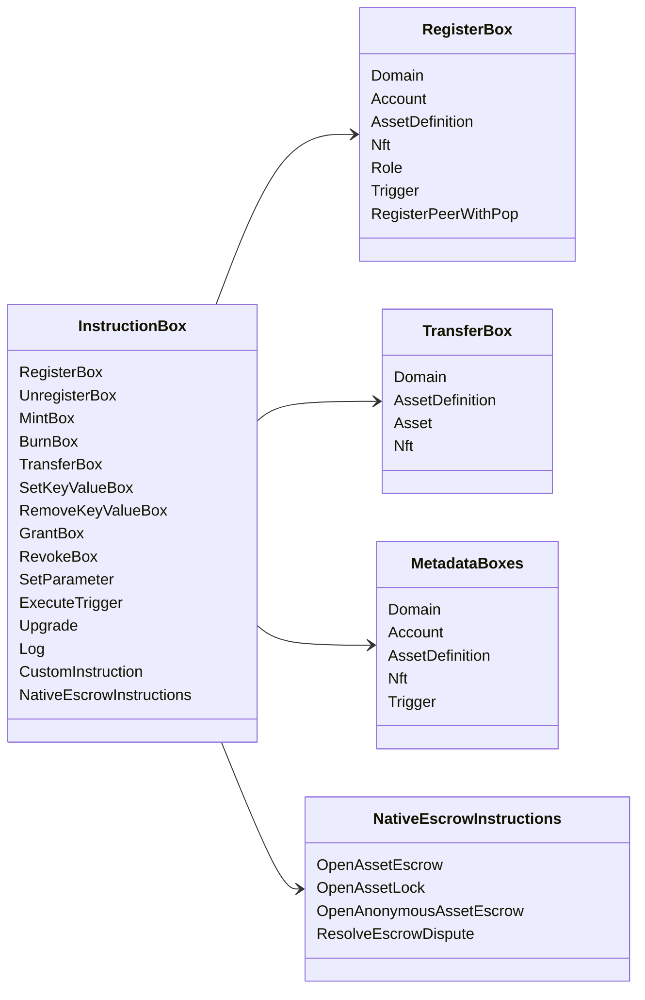

# Iroha ཁྱད་ཆོས་ཀྱི་བསླབ་བྱ་ཚུ་ {#iroha-special-instructions}

ད་ལྟོའི་གནས་སྡུད་ཀྱི་དཔེ་སྟོན་འདི་ནང་བཙུགས་ཡོད་པའི་བསླབ་བྱ་གི་བཟའ་ཚན་ཚུ་ གསལ་སྟོན་འབདཝ་ཨིན།

|བརྡ་སྟོན་ |ཁྱད་ཆོས་ཚུ་ |
| --- | --- |
| [`RegisterBox`](/dz/blockchain/instructions.md#un-register) | `Domain`, `Account`, `AssetDefinition`, `Nft`, `Role`, `Trigger`, `RegisterPeerWithPop` |
| [`UnregisterBox`](/dz/blockchain/instructions.md#un-register) | `Peer`, `Domain`, `Account`, `AssetDefinition`, `Nft`, `Role`, `Trigger` |
| [`MintBox`](/dz/blockchain/instructions.md#mint-burn) |ཨང་གྲངས་ `Asset`, སླར་ལོག་འབད་ནི་ འགོ་བཙུགས་ |
| [`BurnBox`](/dz/blockchain/instructions.md#mint-burn) |ཨང་གྲངས་ `Asset`, སླར་ལོག་འབད་ནི་ འགོ་བཙུགས་ |
| [`TransferBox`](/dz/blockchain/instructions.md#transfer) |`Domain`, `AssetDefinition`, གྱངས་ཁ་ཐོ་བཀོད་ `Asset`, `Nft`|
| [`SetKeyValueBox`](/dz/blockchain/instructions.md#setkeyvalue-removekeyvalue) | `Domain`, `Account`, `AssetDefinition`, `Nft`, `Trigger` metadata |
| [`RemoveKeyValueBox`](/dz/blockchain/instructions.md#setkeyvalue-removekeyvalue) | `Domain`, `Account`, `AssetDefinition`, `Nft`, `Trigger` metadata |
| [`GrantBox`](/dz/blockchain/instructions.md#grant-revoke) | `Permission` (`Grant<Permission, Account>`), `Role` (`Grant<RoleId, Account>`), `RolePermission` (`Grant<Permission, Role>`) |
| [`RevokeBox`](/dz/blockchain/instructions.md#grant-revoke) | `Permission` (`Revoke<Permission, Account>`), `Role` (`Revoke<RoleId, Account>`), `RolePermission` (`Revoke<Permission, Role>`) |
| [`SetParameter`](/dz/blockchain/instructions.md#setparameter) |ལྕགས་ཀྱུའི་བརྡ་དོན་ཚུ་ ད་ལྟོའི་བར་ན་ཡང་ |
| [`ExecuteTrigger`](/dz/blockchain/instructions.md#executetrigger) |འགོ་བཙུགས་ཐངས་ |
| [`Upgrade`](/dz/blockchain/instructions.md#other-instructions) |ལག་ལེན་པ་ཡར་དྲག་གཏང་ནི་ |
| [`Log`](/dz/blockchain/instructions.md#other-instructions) |ཁྲིམས་སྲུང་འགག་པ་གི་ཐོ་ཡིག་ནང་བཙུགས་ |
| [`CustomInstruction`](/dz/blockchain/instructions.md#other-instructions) |ལག་བསྟར་སྤྱོད་འབད་མི་ལུ་ ཁྱད་དུ་འཕགས་པའི་ JSON ཁེ་ཕན་གྱི་འགན་ཁུར་ |
| [རང་བཞིན་གྱི་རྒྱུ་དངོས་གི་གཏའ་མ་ ](/dz/blockchain/escrow.md) | `OpenAssetEscrow`, `AcceptAssetEscrow`, `MarkEscrowPaymentSent`, `ReleaseAssetEscrow`, `CancelAssetEscrow`, `OpenEscrowDispute`, `ResolveEscrowDispute` |
| [སྤྱིར་བཏང་གི་ རྒྱུ་དངོས་ཀྱི་ལྡེ་མིག་ཚུ་ ](/dz/blockchain/escrow.md#generic-asset-locks) |`OpenAssetLock`,`DrawdownAssetLock`, `CancelAssetLock`, `ExpireAssetLock` |
| [དངུལ་རྐྱང་གི་མིང་མ་ཤེསཔ་](/dz/blockchain/escrow.md#anonymous-escrow) | `OpenAnonymousAssetEscrow`, `AcceptAnonymousAssetEscrow`, `MarkAnonymousEscrowPaymentSent`, `ReleaseAnonymousAssetEscrow`, `CancelAnonymousAssetEscrow`, `OpenAnonymousEscrowDispute`, `ResolveAnonymousEscrowDispute` |
| [རང་རྐྱང་གི་བར་ནའི་མཐུན་རྐྱེན་ཚུ་](/dz/blockchain/instructions.md#atomic-private-settlement) | `ActivatePrivateSettlementPoolV1`, `RotatePrivateSettlementPoolPolicyV1`, `FinalizeAtomicPrivateSettlementV1`, `AbortAtomicPrivateSettlementV1` |

Iroha 3 ཚད་གཞིའི་ཆ་ཤས་གཞན་ཚུ་གིས་ བརྡ་བཀོད་ཡིག་ཚང་ནང་ལུ་ domain-specific instruction type ཐོ་བཀོད་འབད་ཚུགས། ད་ལྟོའི་ source tree ལས་འབྱུང་འོང་མི་ schema level གི་ཐོ་ཡིག་གི་དོན་ལུ་ [Data Model Schema](./data-model-schema.md) ལུ་བལྟ་དགོ།

::: details རྩིག་ཁྲམ་: བཟའ་ཚང་ཚུ་གི་དོན་ལུ་ གཞི་རྟེན་བསླབ་བྱ་

:::
