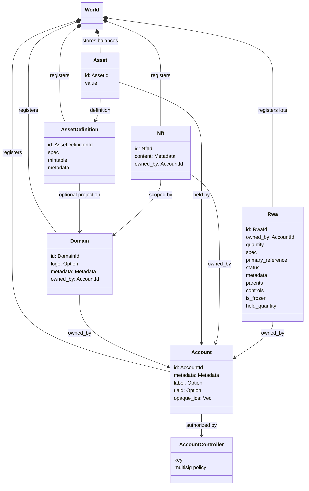
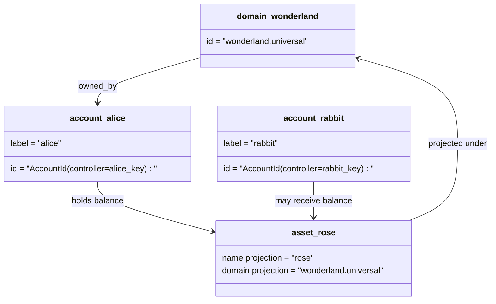

# Modelo de datos {#data-model}

Iroha almacena el estado del libro mayor en el `World`. Su modelo de datos de primera publicación utiliza las siguientes identidades y entidades canónicas:

- los dominios están calificados para el espacio de datos, por ejemplo `payments.universal`
- Las cuentas son canónicas y no tienen dominio; la cuenta ID se deriva del responsable del control de la cuenta
- las definiciones de activos pueden mantener una proyección de dominio/nombre, pero su dirección textual canónica es un identificador Base58 opaco
- activos son saldos mantenidos en cuentas de una definición específica de activo
- NFTs son registros de propiedad única con dominio calificado IDs y contenido de metadatos.
- RWAs se generan lotes de ID que representan activos fuera de la cadena con control del propietario actual, cantidad, procedencia, metadatos, retenciones, congelaciones y ciclo de vida

## Ejemplo {#example}

En una red Iroha 3, `wonderland.universal` es un dominio dentro del espacio de datos `universal`. Las cuentas canónicas en este ejemplo son controladas por sus claves o políticas y codificadas como cuenta I105 sin dominio IDs. Las etiquetas legibles tales como `alice@wonderland.universal` son alias separados vinculados a los IDs Una definición de activo proyectada aún puede construirse a partir de un dominio y nombre como `rose` en `wonderland.universal`, mientras que la dirección canónica de definición de activos utilizada en el cable es la dirección Base58 generada.

## Los alias {#aliases}

Los alias son nombres dirigidos al ser humano superpuestos a capas sobre los identificadores de un libro mayor canónico. Son útiles en API, CLI, cartera y límites exploradores, pero el canónico IDs sigue siendo los identificadores estables almacenados en campos estrictos del libro mayor.

|Objetivo .|Objetivo canónico |Alias literalmente |Modelo de apoyo |
| -------------- | --------------------------------------------------- | ------------------------------------------------------ | ----------------------------------------------------------------------------- |
|Cuenta de usuario |sin dominio `AccountId` codificado como dirección de I105 |`name@domain.dataspace` o `name@dataspace` |`AccountAlias`; el alias primario es `Account.label`, los alias adicionales son vinculantes |
|Definición de activos |canónica `AssetDefinitionId` Dirección Base58 |`name#domain.dataspace` o `name#dataspace` |`AssetDefinitionAlias` vinculado a una definición de activo |
|Contrato |canónica Bech32m `ContractAddress` |`name::domain.dataspace` o `name::dataspace` |`ContractAlias` ligado a una dirección de contrato desplegada |
|Nombre de dominio |`DomainId` en el formulario `domain.dataspace` |`domain.dataspace` |SNS `domain` registro del espacio de nombres |
|Nombre del espacio de datos |número `DataSpaceId` del catálogo activo de Nexus |Los alias de espacio de datos tales como `universal`, `paynet` o `zk` |SNS `dataspace` registro del espacio de nombres más el catálogo del espacio de datos activo |

Los alias de cuentas son los nombres de las cuentas orientadas al usuario. sobreviven a la recreación de cuentas porque el alias apunta a la cuenta activa ID a través de índices de estados mundiales y registros de recreaciones de cuentas. Utilice `SetPrimaryAccountAlias` para la etiqueta primaria de la cuenta, `SetAccountAliasBinding` para los alias no primarios adicionales y `FindAccountByAlias` o `FindAliasesByAccountId` para las lecturas. Los alias de la cuenta normalmente requieren un contrato activo de arrendamiento de alias de cuentas SNS adquirido con `AcquireAccountAliasLease` y renovado con `RenewAccountAliasLease`.

Los alias de activos son las definiciones de activos, no los saldos de cuentas individuales. Los alias de activos y los alias de contratos son vínculos directos entre un nombre legible y un objetivo canónico existente. Los alias de activos se definen con: `SetAssetDefinitionAlias`; El segmento del nombre de alias debe coincidir con el nombre de visualización de la definición de activo o el nombre de la definición proyectada. `SetContractAlias`; El espacio de datos alias debe coincidir con el espacio de datos codificado en la dirección del contrato. Ambas obligaciones pueden llevar `lease_expiry_ms`; Después de la expiración, dejarán de resolver cuando transcurra la ventana de gracia y serán barridos de los índices de estados mundiales.

Los dominios no tienen un objeto `DomainAlias` separado. Un identificador de dominio ya es un nombre calificado para el espacio de datos como `payments.universal`. SNS rastrea la propiedad del arrendamiento de nombres de dominio en el espacio de nombres `domain` y para los alias del espacio de datos en el espacio de nombres `dataspace`. El alias de espacio de datos reservado `universal` debe seguir siendo definido.

## Documentación relacionada {#related-docs}

|Tema |¿ A dónde ir ?|
| -------------------------------------- | ------------------------------------------- |
|Los dominios | [Los dominios ](/es/blockchain/domains.md) |
|Cuentas | [Cuentas](/es/blockchain/accounts.md) |
|Activos | [Activos](/es/blockchain/assets.md) |
|NFTs | [NFTs](/es/blockchain/nfts.md) |
|Activos del mundo real | [Activos en el mundo real](/es/blockchain/rwas.md) |
|Metadatos | [Metadatos](/es/blockchain/metadata.md) |
|Instrucciones de registro y transferencia | [Instrucciones](/es/blockchain/instructions.md) |
|Los permisos de tiempo de ejecución | [Las autorizaciones ](/es/blockchain/permissions.md) |
|Reglas de denominación | [Reglas de denominación](/es/reference/naming.md) |
