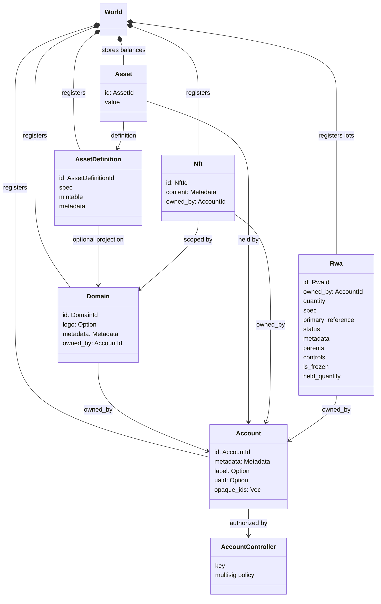
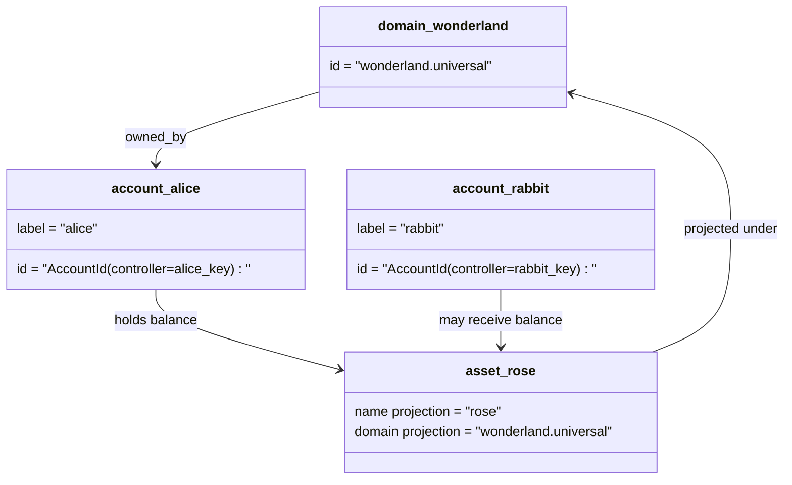

# Modelo de Datos {#data-model}

Iroha almacena el estado del libro mayor de blockchain en el `World`. Su modelo de datos de primera versión utiliza las siguientes identidades y entidades canónicas:

- los dominios están calificados por espacio de datos, por ejemplo `payments.universal`
- las cuentas son canónicas y sin dominio; la ID de la cuenta se deriva del controlador de la cuenta
- las definiciones de activos pueden mantener una proyección de dominio/nombre, pero su dirección textual canónica es un identificador opaco en Base58
- los activos son saldos que tienen las cuentas para una definición de activo específica
- NFTs son registros de propiedad única con IDs calificados por dominio y contenido de metadatos
- RWAs son lotes con ID generados que representan activos fuera de la cadena con propietario actual, cantidad, procedencia, metadatos, retenciones, congelamientos y controles de ciclo de vida

## Ejemplo {#example}

En una red Iroha 3, `wonderland.universal` es un dominio dentro del espacio de datos `universal`. Las cuentas canónicas en este ejemplo están controladas por sus claves o políticas y codificadas como IDs de cuenta I105 sin dominio. Etiquetas legibles como `alice@wonderland.universal` son alias separados asociados a esos IDs. Una definición de activo proyectada todavía se puede construir a partir de un dominio y un nombre, como `rose` en `wonderland.universal`, mientras que la dirección de definición de activo canónica utilizada en la transmisión del protocolo es la dirección Base58 generada.

## Alias {#aliases}

Los alias son nombres orientados a humanos que se superponen sobre los identificadores canónicos del libro mayor de la blockchain. Son útiles en los límites de API, CLI, billetera y explorador, pero los IDs canónicos siguen siendo los identificadores estables almacenados en los campos estrictos del libro mayor de la blockchain.

|Objetivo|Objetivo canónico|Alias literal|Modelo de respaldo|
| -------------- | --------------------------------------------------- | ------------------------------------------------------ | ----------------------------------------------------------------------------- |
|Cuenta de usuario|sin dominio `AccountId` codificado como una dirección I105| `name@domain.dataspace` o `name@dataspace`            | `AccountAlias`; el alias principal es `Account.label`, los alias adicionales son enlaces |
|Definición de activo|dirección Base58 canónica `AssetDefinitionId`| `name#domain.dataspace` o `name#dataspace`            | `AssetDefinitionAlias` vinculado a una definición de activo |
|Contrato|Bech32m canónico `ContractAddress`| `name::domain.dataspace` o `name::dataspace`          | `ContractAlias` ligado a una dirección de contrato desplegada |
|Nombre de dominio| `DomainId` en forma de `domain.dataspace`               | `domain.dataspace`                                    | SNS `domain` registro de espacio de nombres |
|Nombre del espacio de datos| numérico `DataSpaceId` del catálogo activo Nexus |alias de espacio de datos como `universal`, `paynet` o `zk`| SNS `dataspace` registro de espacio de nombres más el catálogo de espacio de datos activo            |

Los alias de cuenta son los nombres de cuenta visibles para el usuario. Sobreviven a la reconfiguración de la cuenta porque el alias apunta al ID de cuenta activo a través de índices del estado mundial y registros de reconfiguración de cuenta. Use `SetPrimaryAccountAlias` para la etiqueta principal de la cuenta, `SetAccountAliasBinding` para alias adicionales que no sean principales, y `FindAccountByAlias` o `FindAliasesByAccountId` para lecturas. Los alias de cuenta normalmente requieren un arrendamiento de alias de cuenta activo SNS adquirido con `AcquireAccountAliasLease` y renovado con `RenewAccountAliasLease`.

Los alias de activos nombran definiciones de activos, no saldos individuales de cuentas. Los alias de activos y los alias de contratos son vinculaciones directas de un nombre legible a un destino canónico existente. Los alias de activos se configuran con `SetAssetDefinitionAlias`; el segmento del nombre del alias debe coincidir con el nombre para mostrar de la definición del activo o el nombre de la definición proyectada. Los alias de contrato se configuran con `SetContractAlias`; el alias dataspace debe coincidir con el dataspace codificado en la dirección del contrato. Ambos enlaces pueden llevar `lease_expiry_ms`; después de su vencimiento dejan de resolverse cuando se agota la ventana de gracia y se eliminan de los índices del estado mundial.

Los dominios no tienen un objeto `DomainAlias` separado. Un identificador de dominio ya es un nombre calificado por el espacio de datos, como `payments.universal`. SNS realiza un seguimiento de la propiedad del arrendamiento para nombres de dominio en el espacio de nombres `domain` y para alias de espacio de datos en el espacio de nombres `dataspace`. El alias de espacio de datos reservado `universal` debe permanecer definido.

## Documentos relacionados {#related-docs}

|Tema|A dónde ir|
| -------------------------------------- | ------------------------------------------- |
|Dominios| [Dominios](/es/blockchain/domains.md)           |
|Cuentas|[Cuentas](/es/blockchain/accounts.md)|
|Activos| [Activos](/es/blockchain/assets.md)             |
| NFTs                                   | [NFTs](/es/blockchain/nfts.md)                 |
|Activos del mundo real| [Activos del mundo real](/es/blockchain/rwas.md)    |
|Metadatos| [Metadatos](/es/blockchain/metadata.md)         |
|Instrucciones de registro y transferencia| [Instrucciones](/es/blockchain/instructions.md) |
|permisos de tiempo de ejecución del software| [Permisos](/es/blockchain/permissions.md)   |
|Reglas de nomenclatura| [Reglas de nomenclatura](/es/reference/naming.md)        |
