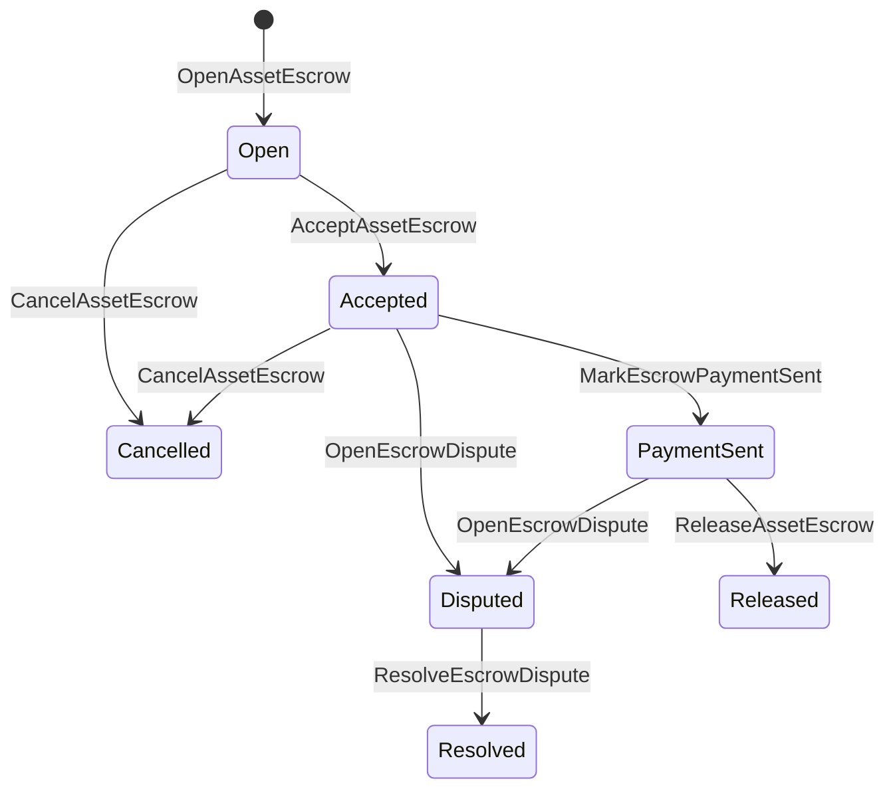

# Custodia de Activos Nativos {#native-asset-escrow}

El depósito en garantía nativo es un mecanismo de custodia gestionado por un libro mayor para activos numéricos. En lugar de enviar activos a una cuenta propiedad de la aplicación y depender del código de la aplicación para proteger esa cuenta, depósito en garantía ISIs mover el valor a una cuenta de custodia de protocolo determinista y registrar el ciclo de vida del depósito en garantía en el estado mundial.

Utilice depósito en garantía nativo para la liquidación del mercado, coordinación de pagos fuera de la cadena al estilo Aitai, bloqueos por hitos y flujos de trabajo de depósito en garantía protegidos que necesitan un estado del ciclo de vida visible en el libro mayor.

## Conceptos {#concepts}

|Concepto|Descripción|
| --- | --- |
| `EscrowId` |Identificador seleccionado por el llamante que encapsula un hash criptográfico. Debe ser único en los depósitos en garantía transparentes y anónimos.|
| `AssetEscrowRecord` |Registro transparente de fideicomiso o bloqueo de activos numéricos.|
| `AnonymousAssetEscrowRecord` |Registro de custodia protegido respaldado por anuladores, compromisos y anexos de prueba.|
|Cuenta de custodia|Cuenta de protocolo determinista derivada del ID de cadena, ID de depósito en garantía y definición de activo.|
|Evidencia de hashes criptográficos|Las pruebas de hashes criptográficos pueden identificar facturas, sentencias, mensajes, manifiestos técnicos de almacenamiento u otras pruebas fuera de la cadena. La propia carga útil de la prueba no se almacena en el registro de depósito en garantía.|

Los registros transparentes incluyen al vendedor, comprador opcional, definición del activo, monto total, cuenta de custodia, estado del ciclo de vida, tipo de comportamiento, monto restante, principal de autorización de liberación opcional, sello de tiempo de vencimiento opcional, hashes criptográficos de evidencia, sellos de tiempo y detalles de resolución opcionales.

Los montos en custodia deben ser cantidades de activos numéricos positivas y deben coincidir con la especificación numérica de la definición del activo. Mientras un depósito en custodia o bloqueo esté activo, las transferencias genéricas de activos no pueden vaciar la cuenta de custodia; las vías de salida de la custodia son el depósito en custodia ISIs descrito a continuación.

## Depósito en garantía del mercado {#marketplace-escrow}

El depósito en garantía del mercado coordina la liberación de un activo en la cadena con un flujo de trabajo de pago o entrega fuera de la cadena.



| ISI |Quién lo presenta|Efecto|
| --- | --- | --- |
| `OpenAssetEscrow` |vendedora|Bloquea el activo numérico del vendedor en la custodia del protocolo y crea un registro de mercado `Open`.|
| `AcceptAssetEscrow` |compradora|Registra al comprador y mueve `Open` a `Accepted`. El vendedor no puede aceptar su propio depósito en garantía.|
| `MarkEscrowPaymentSent` |Comprador aceptado|Traslada `Accepted` a `PaymentSent` después de que el comprador envíe el pago fuera de la cadena.|
| `ReleaseAssetEscrow` |vendedora| Mueve `PaymentSent` a `Released` y transfiere el monto total en custodia al comprador. |
| `CancelAssetEscrow` |vendedora|Mueve `Open` o `Accepted` a `Cancelled` y reembolsa al vendedor antes de que se marque el pago.|
| `OpenEscrowDispute` |Vendedor o comprador aceptado|Mueve `Accepted` o `PaymentSent` a `Disputed` y agrega hashes criptográficos de evidencia.|
| `ResolveEscrowDispute` |Cuenta con `CanResolveEscrowDispute`|Traslada `Disputed` a `Resolved` y divide la cantidad entre el comprador y el vendedor.|

Los montos de resolución de disputas deben ser no negativos, y `buyer_amount + seller_amount` debe ser igual al monto en custodia. Se permiten tramos con valor cero, pero toda la división debe tener en cuenta el saldo bloqueado.

### Rust Ejemplo {#rust-example}

Este ejemplo asume que las cuentas del vendedor y del comprador ya existen, la definición del activo está registrada como numérica, y el vendedor tiene suficiente saldo.

```rust
use iroha::{
    client::Client,
    data_model::{
        isi::escrow::{
            AcceptAssetEscrow, MarkEscrowPaymentSent, OpenAssetEscrow,
            ReleaseAssetEscrow,
        },
        prelude::*,
    },
};
use iroha_crypto::Hash;

fn release_marketplace_escrow(
    seller_client: &Client,
    buyer_client: &Client,
    asset_definition_id: AssetDefinitionId,
) -> eyre::Result<()> {
    let escrow_id = EscrowId::new(Hash::new("docs-marketplace-escrow-001"));

    seller_client.submit_blocking(OpenAssetEscrow::with_evidence_hashes(
        escrow_id,
        asset_definition_id,
        Numeric::from(40_u64),
        vec![Hash::new("invoice:2026-001")],
    ))?;

    buyer_client.submit_blocking(AcceptAssetEscrow::new(escrow_id))?;
    buyer_client.submit_blocking(MarkEscrowPaymentSent::new(escrow_id))?;
    seller_client.submit_blocking(ReleaseAssetEscrow::new(escrow_id))?;

    let record = seller_client.query_single(FindAssetEscrowById::new(escrow_id))?;
    assert_eq!(record.status, AssetEscrowStatus::Released);
    assert_eq!(record.remaining_amount, Numeric::zero());

    Ok(())
}
```

## Bloqueos de Activos Genéricos {#generic-asset-locks}

Los bloqueos de activos utilizan el mismo tipo de registro de custodia, pero no son ofertas de comprador-vendedor. Bloquean fondos para una cuenta de destino y, opcionalmente, requieren un principal de autorización de liberación separado para retirar los fondos.

| ISI |Quién lo presenta|Efecto|
| --- | --- | --- |
| `OpenAssetLock` |Cuenta de origen|Bloquea una cantidad positiva, registra el destino como el comprador registrado y establece el estado en `Locked`.|
| `DrawdownAssetLock` |Autorización de liberación principal, o destino cuando no se establece una autorización de liberación principal|Transfiere parte o la totalidad de la custodia restante al destino.|
| `CancelAssetLock` |Abridor de cerraduras|Cancela un bloqueo activo y devuelve la cantidad restante al que lo abrió.|
| `ExpireAssetLock` |Cualquier autorización de transacción principal después del plazo|Expira un bloqueo con `expires_at_ms` en el pasado y reembolsa la cantidad restante al iniciador.|

`DrawdownAssetLock` mantiene el registro en `Locked` mientras queda alguna cantidad. Cuando la cantidad restante llega a cero, el estado se convierte en `DrawnDown` y el registro se cierra.

```rust
use iroha::{
    client::Client,
    data_model::{
        isi::escrow::{CancelAssetLock, DrawdownAssetLock, ExpireAssetLock, OpenAssetLock},
        prelude::*,
    },
};
use iroha_crypto::Hash;

fn drawdown_and_close_asset_locks(
    opener_client: &Client,
    destination_client: &Client,
    release_authority_client: &Client,
    asset_definition_id: AssetDefinitionId,
    destination: AccountId,
    release_authority: AccountId,
) -> eyre::Result<()> {
    let trusted_lock_id = EscrowId::new(Hash::new("docs-asset-lock-trusted"));

    opener_client.submit_blocking(OpenAssetLock::with_options(
        trusted_lock_id,
        asset_definition_id.clone(),
        destination.clone(),
        Numeric::from(40_u64),
        Some(release_authority),
        None,
        vec![Hash::new("milestone-plan-v1")],
    ))?;

    release_authority_client.submit_blocking(DrawdownAssetLock::new(
        trusted_lock_id,
        Numeric::from(15_u64),
    ))?;

    let partially_drawn =
        opener_client.query_single(FindAssetEscrowById::new(trusted_lock_id))?;
    assert_eq!(partially_drawn.status, AssetEscrowStatus::Locked);
    assert_eq!(partially_drawn.remaining_amount, Numeric::from(25_u64));

    opener_client.submit_blocking(CancelAssetLock::new(trusted_lock_id))?;
    let cancelled = opener_client.query_single(FindAssetEscrowById::new(trusted_lock_id))?;
    assert_eq!(cancelled.status, AssetEscrowStatus::Cancelled);

    let expiring_lock_id = EscrowId::new(Hash::new("docs-asset-lock-expiring"));
    opener_client.submit_blocking(OpenAssetLock::with_options(
        expiring_lock_id,
        asset_definition_id,
        destination,
        Numeric::from(10_u64),
        None,
        Some(0),
        Vec::new(),
    ))?;

    destination_client.submit_blocking(ExpireAssetLock::new(expiring_lock_id))?;
    let expired = opener_client.query_single(FindAssetEscrowById::new(expiring_lock_id))?;
    assert_eq!(expired.status, AssetEscrowStatus::Expired);

    Ok(())
}
```

Python actualmente expone ayudantes de alto nivel para bloqueos genéricos: `open_asset_lock`, `drawdown_asset_lock`, `cancel_asset_lock` y `expire_asset_lock`. Para el mercado y el depósito en garantía anónimo de Python, usa el `InstructionBox` JSON canónico a través de la escotilla de escape JSON de SDK, o envía a través de un SDK que expone a los constructores de depósito en garantía de primera clase.

## Disputas {#disputes}

Un depósito en garantía del mercado puede entrar en disputa desde `Accepted` o `PaymentSent`. Solo el vendedor o comprador registrado puede abrir la disputa. La resolución requiere `CanResolveEscrowDispute`, ya sea otorgada directamente a la cuenta del resolutor o heredada a través de un rol.

```rust
use iroha::{
    client::Client,
    data_model::{
        isi::escrow::{OpenEscrowDispute, ResolveEscrowDispute},
        prelude::*,
    },
};
use iroha_crypto::Hash;
use iroha_executor_data_model::permission::escrow::CanResolveEscrowDispute;

fn resolve_disputed_escrow(
    admin_client: &Client,
    buyer_client: &Client,
    court_client: &Client,
    court: AccountId,
    escrow_id: EscrowId,
) -> eyre::Result<()> {
    admin_client.submit_blocking(Grant::account_permission(
        Permission::from(CanResolveEscrowDispute),
        court,
    ))?;

    buyer_client.submit_blocking(OpenEscrowDispute::with_evidence_hashes(
        escrow_id,
        vec![Hash::new("buyer-payment-receipt")],
    ))?;

    court_client.submit_blocking(ResolveEscrowDispute::with_evidence_hashes(
        escrow_id,
        Numeric::from(30_u64),
        Numeric::from(10_u64),
        vec![Hash::new("court-judgement-001")],
    ))?;

    let record = admin_client.query_single(FindAssetEscrowById::new(escrow_id))?;
    assert_eq!(record.status, AssetEscrowStatus::Resolved);
    assert_eq!(
        record.resolution.as_ref().map(|resolution| resolution.buyer_amount.clone()),
        Some(Numeric::from(30_u64)),
    );

    Ok(())
}
```

## Fideicomiso Anónimo {#anonymous-escrow}

El depósito en garantía anónimo utiliza el mismo ciclo de vida del mercado, pero la financiación y el movimiento de activos al cerrar están protegidos. El registro público aún almacena vendedor, comprador, estado, pruebas hashes criptográficos, sellos de tiempo y registros de movimiento vinculados a pruebas. Los montos y los destinatarios dentro de las notas protegidas se representan mediante compromisos, anuladores y adjuntos de prueba.

|Transparente ISI|Anónimo ISI|
| --- | --- |
| `OpenAssetEscrow` | `OpenAnonymousAssetEscrow` |
| `AcceptAssetEscrow` | `AcceptAnonymousAssetEscrow` |
| `MarkEscrowPaymentSent` | `MarkAnonymousEscrowPaymentSent` |
| `ReleaseAssetEscrow` | `ReleaseAnonymousAssetEscrow` |
| `CancelAssetEscrow` | `CancelAnonymousAssetEscrow` |
| `OpenEscrowDispute` | `OpenAnonymousEscrowDispute` |
| `ResolveEscrowDispute` | `ResolveAnonymousEscrowDispute` |

La cartera o las herramientas del verificador deben construir el adjunto de prueba y las entradas públicas. Al abrir se crea un compromiso de depósito en garantía. La liberación, cancelación y resolución anónima de disputas deben gastar exactamente un compromiso de depósito en garantía y crear los compromisos de salida del comprador, vendedor o divididos requeridos por la acción.

```rust
use iroha::{
    client::Client,
    data_model::{
        isi::escrow::{
            AcceptAnonymousAssetEscrow, MarkAnonymousEscrowPaymentSent,
            OpenAnonymousAssetEscrow,
        },
        prelude::*,
        proof::ProofAttachment,
    },
};
use iroha_crypto::Hash;

fn open_anonymous_escrow(
    seller_client: &Client,
    buyer_client: &Client,
    escrow_id: EscrowId,
    asset_definition_id: AssetDefinitionId,
    funding_nullifiers: Vec<[u8; 32]>,
    escrow_commitment: [u8; 32],
    proof: ProofAttachment,
    root_hint: Option<[u8; 32]>,
) -> eyre::Result<()> {
    seller_client.submit_blocking(OpenAnonymousAssetEscrow::with_evidence_hashes(
        escrow_id,
        asset_definition_id,
        funding_nullifiers,
        escrow_commitment,
        proof,
        root_hint,
        vec![Hash::new("shielded-invoice")],
    ))?;

    buyer_client.submit_blocking(AcceptAnonymousAssetEscrow::new(escrow_id))?;
    buyer_client.submit_blocking(MarkAnonymousEscrowPaymentSent::new(escrow_id))?;

    Ok(())
}
```

Para el modelo subyacente de transacción protegida, consulte [Transacciones anónimas](/es/blockchain/anonymous-transactions.md).

## SDK Uso {#sdk-usage}

El soporte de depósito en garantía se expone de manera diferente a través de SDKs. Rust tiene el modelo de datos tipado canónico. Python actualmente expone helpers genéricos de bloqueo de activos. JavaScript y TypeScript utilizan llamadas de host de depósito en garantía Kotodama. Kotlin/JVM y Swift proporcionan constructores de carga útil tipados para el mercado y el depósito en garantía anónimo.

| SDK |Usa esta superficie|Alcance|
| --- | --- | --- |
| [Rust](#rust-sdk) | `iroha::data_model::isi::escrow` |Depósito en garantía del mercado, cerraduras genéricas, depósito en garantía anónimo, consultas y eventos.|
| [Python](#python-asset-locks) | `Instruction.open_asset_lock`, `TransactionDraft.open_asset_lock`, y los ayudantes del cliente `*_and_wait` |Bloqueos de activos genéricos. Los asistentes de mercado y de depósito en garantía anónimo aún no son métodos de primera clase Python.|
| [JavaScript / TypeScript](#javascript-and-typescript-kotodama) | `compileKotodamaProgram` de `@iroha/iroha-js/kotodama-compiler` |El anfitrión de custodia llama dentro de los contratos Kotodama.|
| [Kotlin / JVM](#kotlin-and-jvm) | `InstructionTemplate` clases en `org.hyperledger.iroha.sdk.core.model.instructions` |Plantillas de instrucciones personalizadas de mercado y custodia anónima.|
| [Swift / iOS](#swift-and-ios) |`NativeEscrowInstructionBuilders` y `IrohaSDK.build*Escrow*` ayudantes|Mercado y cargas útiles de instrucciones de depósito en garantía anónimo Norito JSON.|

Los ejemplos a continuación se centran en la construcción de instrucciones. La financiación de cuentas, la gestión de firmas y la presentación de transacciones siguen el flujo normal para cada SDK.

### Rust SDK {#rust-sdk}

Use el Rust SDK cuando necesite cobertura nativa completa o soporte de consultas/eventos. Los ejemplos anteriores muestran lanzamiento en el mercado, reducción genérica de bloqueo, resolución de disputas y construcción de fideicomiso anónimo con `iroha::data_model::isi::escrow`.

```rust
use iroha::{
    client::Client,
    data_model::{isi::escrow::OpenAssetEscrow, prelude::*},
};
use iroha_crypto::Hash;

fn open_and_read(
    client: &Client,
    asset_definition_id: AssetDefinitionId,
) -> eyre::Result<AssetEscrowRecord> {
    let escrow_id = EscrowId::new(Hash::new("docs-rust-sdk-escrow"));

    client.submit_blocking(OpenAssetEscrow::new(
        escrow_id,
        asset_definition_id,
        Numeric::from(10_u64),
    ))?;

    client.query_single(FindAssetEscrowById::new(escrow_id))
}
```

### Python Bloqueos de activos {#python-asset-locks}

El Python SDK expone ayudantes de primera clase para bloqueos de activos genéricos. Úselos para pagos por hitos, desembolsos por un principal de autorización de liberación, cancelación por el iniciador y reembolsos por vencimiento.

```python
client.open_asset_lock_and_wait(
    chain_id="dev-chain",
    authority="<source-account-id>",
    private_key_hex="<source-private-key-hex>",
    escrow_id="merchant-lock-001",
    asset_definition_id="<asset-definition-base58>",
    destination="<destination-account-id>",
    amount="2500",
    release_authority="<trusted-release-account-id>",
    expires_at_ms=1_704_000_000_000,
)

client.drawdown_asset_lock_and_wait(
    chain_id="dev-chain",
    authority="<trusted-release-account-id>",
    private_key_hex="<trusted-release-private-key-hex>",
    escrow_id="merchant-lock-001",
    amount="1000",
)

client.expire_asset_lock_and_wait(
    chain_id="dev-chain",
    authority="<any-account-id>",
    private_key_hex="<any-private-key-hex>",
    escrow_id="merchant-lock-001",
)
```

Para un bloqueo de dos partes, omita `release_authority`; la cuenta de destino luego puede enviar `drawdown_asset_lock`.

### JavaScript y TypeScript Kotodama {#javascript-and-typescript-kotodama}

El JavaScript SDK actualmente no expone constructores de transacciones de escrow nativos directos. Para aplicaciones JavaScript o TypeScript que despliegan contratos Kotodama, compile las llamadas del host de escrow con el compilador Kotodama.

Las llamadas nativas al anfitrión de depósito en garantía requieren indicaciones de acceso explícitas porque el compilador no puede derivar conjuntos de acceso más restringidos para depósitos opacos ISIs. Use indicaciones comodín en los puntos de entrada exportados que llamen a las funciones incorporadas `escrow_*`.

```js
import { compileKotodamaProgram } from "@iroha/iroha-js/kotodama-compiler";

const source = `
seiyaku MarketplaceEscrow {
  meta { abi_version: 1; }

  #[access(read="*", write="*")]
  kotoage fn run() permission(Admin) {
    let asset = asset_definition("62Fk4FPcMuLvW5QjDGNF2a4jAmjM");
    let offer = name("aitai_offer");
    let evidence = norito_bytes("00");

    call escrow_open_offer(offer, asset, 10, evidence);
    call escrow_accept(offer);
    call escrow_mark_payment_sent(offer);
    call escrow_release(offer);
  }
}
`;

const compiled = compileKotodamaProgram(source, {
  sourceName: "escrow.ko",
});

if (compiled.diagnostics.length > 0) {
  throw new Error(compiled.diagnostics.map((item) => item.message).join("\n"));
}
```

Para disputas, use `escrow_open_dispute(offer, evidence)` y `escrow_resolve_dispute(offer, buyer_amount, seller_amount, evidence)`. El anfitrión de depósito en garantía anónimo acepta llamadas de Norito con bytes de solicitud de carga útil, por ejemplo `anonymous_escrow_open_offer(request)`.

### Kotlin y JVM {#kotlin-and-jvm}

Los modelos Kotlin/JVM SDK modelan la custodia nativa como plantillas de instrucciones personalizadas. Cada plantilla valida los campos requeridos y expone el mapa de argumentos canónico utilizado por el generador de transacciones.

```kotlin
import org.hyperledger.iroha.sdk.core.model.escrow.NativeEscrowPermissions
import org.hyperledger.iroha.sdk.core.model.instructions.AcceptAssetEscrowInstruction
import org.hyperledger.iroha.sdk.core.model.instructions.MarkEscrowPaymentSentInstruction
import org.hyperledger.iroha.sdk.core.model.instructions.OpenAssetEscrowInstruction
import org.hyperledger.iroha.sdk.core.model.instructions.ReleaseAssetEscrowInstruction
import org.hyperledger.iroha.sdk.core.model.instructions.ResolveEscrowDisputeInstruction

val open = OpenAssetEscrowInstruction(
    escrowId = "escrow-hash",
    assetDefinition = "xor#wonderland",
    amount = "42.5",
    evidenceHashes = listOf("invoice-hash"),
)
val accept = AcceptAssetEscrowInstruction("escrow-hash")
val paid = MarkEscrowPaymentSentInstruction("escrow-hash")
val release = ReleaseAssetEscrowInstruction("escrow-hash")
val resolve = ResolveEscrowDisputeInstruction(
    escrowId = "escrow-hash",
    buyerAmount = "30",
    sellerAmount = "12.5",
    evidenceHashes = listOf("judgement-hash"),
)

println(open.arguments)
println(NativeEscrowPermissions.CAN_RESOLVE_ESCROW_DISPUTE)
```

Las plantillas anónimas están disponibles como `OpenAnonymousAssetEscrowInstruction`, `AcceptAnonymousAssetEscrowInstruction`, `MarkAnonymousEscrowPaymentSentInstruction`, `ReleaseAnonymousAssetEscrowInstruction`, `CancelAnonymousAssetEscrowInstruction`, `OpenAnonymousEscrowDisputeInstruction` y `ResolveAnonymousEscrowDisputeInstruction`. Los llamadores de Java Android pueden usar los constructores correspondientes `NativeEscrowInstructions.*` del artefacto Android.

### Swift y iOS {#swift-and-ios}

El Swift SDK crea instrucciones de depósito en garantía como cargas útiles Norito JSON. Use `NativeEscrowInstructionBuilders` directamente, o llame al asistente equivalente `IrohaSDK.build*Escrow*` cuando su aplicación ya tenga una instancia de `IrohaSDK`.

```swift
import IrohaSwift

let open = try NativeEscrowInstructionBuilders.openAssetEscrow(
    escrowId: "escrow-hash",
    assetDefinition: "xor#wonderland",
    amount: "42.5",
    evidenceHashes: ["invoice-hash"]
)
let accept = try NativeEscrowInstructionBuilders.acceptAssetEscrow(
    escrowId: "escrow-hash"
)
let paid = try NativeEscrowInstructionBuilders.markEscrowPaymentSent(
    escrowId: "escrow-hash"
)
let release = try NativeEscrowInstructionBuilders.releaseAssetEscrow(
    escrowId: "escrow-hash"
)
let resolve = try NativeEscrowInstructionBuilders.resolveEscrowDispute(
    escrowId: "escrow-hash",
    buyerAmount: "30",
    sellerAmount: "12.5",
    evidenceHashes: ["judgement-hash"]
)
```

Los constructores anónimos Swift toman listas de anuladores, listas de compromisos de salida, un diccionario de pruebas y valores opcionales `rootHint`. El token de permiso del resolutor de disputas está disponible como `NativeEscrowPermissions.canResolveEscrowDispute`.

## Consultas y Eventos {#queries-and-events}

Utilice consultas en custodia para páginas de estado, trabajos de conciliación y herramientas de soporte:

|Consulta|Propósito|
| --- | --- |
| `FindAssetEscrowById` |Lea un depósito en garantía transparente o bloqueo por `EscrowId`.|
| `FindAssetEscrows` |Listado de registros de fideicomiso transparente y bloqueo.|
| `FindAssetEscrowsBySeller` |Lista de registros abiertos por un vendedor o abridor de cerraduras.|
| `FindAssetEscrowsByBuyer` |Enumere las custodied de mercado aceptadas por un comprador o los bloqueos dirigidos a un destino.|
| `FindAssetEscrowsByStatus` |Listar registros por `AssetEscrowStatus`.|
| `FindAnonymousAssetEscrowById` |Lee un fideicomiso anónimo por `EscrowId`.|
| `FindAnonymousAssetEscrows*` |Lista las cuentas de depósito en garantía anónimas por todos los registros, vendedor, comprador o estado.|

`EscrowEventFilter` puede suscribirse a eventos de depósito en garantía nativo transparente y de bloqueo por ID de depósito, vendedor, comprador, estado y máscara de conjunto de eventos. La familia de eventos incluye `Opened`, `Accepted`, `PaymentSent`, `Released`, `Cancelled`, `Expired`, `Disputed` y `Resolved`. Los registros de fideicomiso anónimos se inspeccionan a través de las consultas de fideicomiso anónimas.

## Notas operativas {#operational-notes}

- Almacene facturas grandes, registros de chat, sentencias o paquetes de auditoría fuera del registro de depósito en garantía y adjunte sus hashes criptográficos como evidencia.
- Utilice la derivación estable `EscrowId` en las aplicaciones para que los reintentos no puedan crear depósitos en garantía duplicados para la misma oferta.
- Conceda `CanResolveEscrowDispute` solo a cuentas o roles que operen el proceso de disputas.
- Trate la verificación de pagos fuera de la cadena como una política de la aplicación. Iroha registra la custodia y las transiciones del ciclo de vida; no verifica por sí mismo las redes de pago en moneda fiduciaria o externas.
