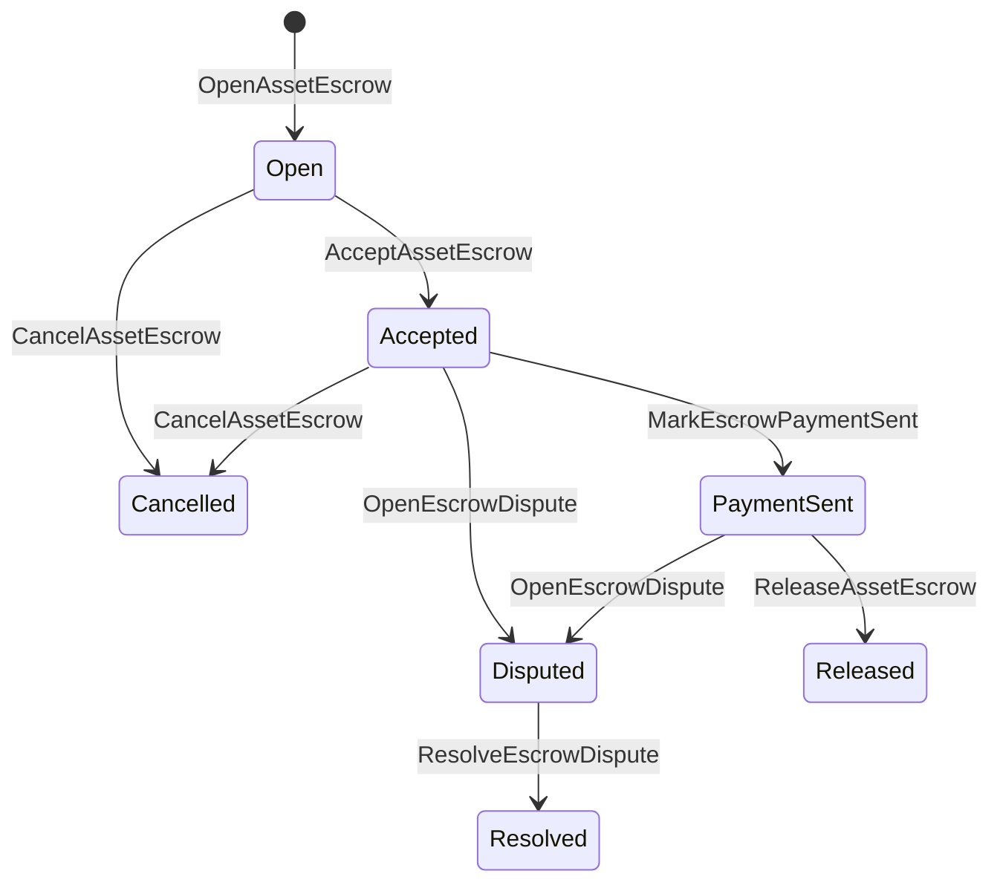

# Aseguración de activos nativos {#native-asset-escrow}

Native escrow es un mecanismo de custodia administrado por el libro mayor para activos numéricos. En lugar de enviar activos a una cuenta propiedad de la aplicación y depender del código de la aplicación para proteger esa cuenta, El escrow ISIs transferirá el valor a una cuenta de custodia del protocolo determinista y registrará el ciclo de vida del escrow en estado mundial.

Utilice el escrow nativo para la liquidación del mercado, la coordinación de pagos fuera de cadena al estilo Aitai, las cerraduras de hitos y los flujos de trabajo de escrow protegidos que requieren estado del ciclo de vida visible en un libro mayor.

## Conceptos {#concepts}

|Concepto .|Descripción |
| --- | --- |
|`EscrowId` |El identificador seleccionado por el llamador envuelve un hash. Debe ser único entre las garantías transparentes y anónimas. |
|`AssetEscrowRecord` |Registro de garantía o bloqueo numérico transparente de activos. |
|`AnonymousAssetEscrowRecord` |El registro de garantía protegido respaldado por anuladores, compromisos y adjuntos de prueba. |
|Cuenta de custodia |Cuenta de protocolo determinístico derivada de la cadena ID, garantía ID, y definición de activo. |
|La evidencia se hacha .|Los hashes de pruebas pueden identificar facturas, juicios, mensajes, manifiestos de almacenamiento u otras evidencias fuera de la cadena.|

Los registros transparentes contienen al vendedor, comprador opcional, definición de activo, monto total, cuenta de custodia, estado del ciclo de vida, tipo de comportamiento, cantidad restante, autoridad de liberación opcional, sello de tiempo de vencimiento opcional, hashes de evidencia, sellas de tiempo y detalles de resolución opcionales.

Las cantidades de escrow deben ser cantidades numéricas positivas de activos y deben coincidir con la especificación numérica de la definición de activo. Mientras que un escrow o bloqueo está activo, las transferencias genéricas de activos no pueden drenar la cuenta de custodia; las vías de salida de custodia son el escrow ISIs descrito a continuación.

## Escrow en el mercado {#marketplace-escrow}

El mercado de garantía coordina una liberación de activos en cadena con un flujo de trabajo de pago o entrega fuera de la cadena.



|ISI |¿ Quién lo presenta ?|El efecto |
| --- | --- | --- |
|`OpenAssetEscrow` |Vendedor |Se bloquea el activo numérico del vendedor en custodia de protocolo y se crea un registro de mercado `Open`. |
|`AcceptAssetEscrow` |Comprador |Registra al comprador y transfiere `Open` a `Accepted`. El vendedor no puede aceptar su propio garantía. |
|`MarkEscrowPaymentSent` |Comprador aceptado |Trasladar `Accepted` a `PaymentSent` después de que el comprador envíe el pago fuera de la cadena. |
|`ReleaseAssetEscrow` |Vendedor |Se traslada `PaymentSent` a `Released` y se transfiere al comprador el importe total garantizado. |
|`CancelAssetEscrow` |Vendedor |Traslada `Open` o `Accepted` a `Cancelled` y reembolsa al vendedor antes de que se marque el pago. |
|`OpenEscrowDispute` |Vendedor o comprador aceptado |Se mueve `Accepted` o `PaymentSent` a `Disputed` y se añaden hashes de pruebas. |
|`ResolveEscrowDispute` |Cuenta con `CanResolveEscrowDispute` |Se traslada `Disputed` a `Resolved` y se divide la cantidad entre el comprador y el vendedor |

Los importes de resolución de litigios no deben ser negativos y `buyer_amount + seller_amount` deben ser iguales al importe de la garantía. Las piernas de valor cero están permitidas, pero toda la división debe tener en cuenta el saldo bloqueado.

### Rust Ejemplo {#rust-example}

Este ejemplo supone que las cuentas del vendedor y del comprador ya existen, la definición de activo se registra como numérica y el vendedor tiene un saldo suficiente.

```rust
use iroha::{
    client::Client,
    data_model::{
        isi::escrow::{
            AcceptAssetEscrow, MarkEscrowPaymentSent, OpenAssetEscrow,
            ReleaseAssetEscrow,
        },
        prelude::*,
    },
};
use iroha_crypto::Hash;

fn release_marketplace_escrow(
    seller_client: &Client,
    buyer_client: &Client,
    asset_definition_id: AssetDefinitionId,
) -> eyre::Result<()> {
    let escrow_id = EscrowId::new(Hash::new("docs-marketplace-escrow-001"));

    seller_client.submit_blocking(OpenAssetEscrow::with_evidence_hashes(
        escrow_id,
        asset_definition_id,
        Numeric::from(40_u64),
        vec![Hash::new("invoice:2026-001")],
    ))?;

    buyer_client.submit_blocking(AcceptAssetEscrow::new(escrow_id))?;
    buyer_client.submit_blocking(MarkEscrowPaymentSent::new(escrow_id))?;
    seller_client.submit_blocking(ReleaseAssetEscrow::new(escrow_id))?;

    let record = seller_client.query_single(FindAssetEscrowById::new(escrow_id))?;
    assert_eq!(record.status, AssetEscrowStatus::Released);
    assert_eq!(record.remaining_amount, Numeric::zero());

    Ok(())
}
```

## Bloques de activos genéricos {#generic-asset-locks}

Los bloqueos de activos utilizan el mismo tipo de registro de custodia, pero no son ofertas entre compradores y vendedores. Bloquean fondos para una cuenta de destino y opcionalmente requieren una autoridad de liberación separada para retirar los fondos.

|ISI |¿ Quién lo presenta ?|Efecto .|
| --- | --- | --- |
|`OpenAssetLock` |Cuenta de origen |Se fija una cantidad positiva, se registra el destino como comprador registrado y se establece el estado en `Locked`. |
|`DrawdownAssetLock` |Autoridad de liberación, o destino cuando no se haya establecido ninguna autoridad de liberación |Transfiere parte o toda la custodia restante a su destino. |
|`CancelAssetLock` |Abre la cerradura|Cancela una cerradura activa y devuelve el importe restante al abre. |
|`ExpireAssetLock` |Cualquier autoridad de transacciones después del plazo |Expirará un bloqueo con `expires_at_ms` en el pasado y se reembolsará el importe restante al titular. |

`DrawdownAssetLock` mantiene el registro en `Locked` mientras permanece cierta cantidad. Cuando la cantidad restante alcanza cero, el estado se convierte en `DrawnDown` y el registro se cierra.

```rust
use iroha::{
    client::Client,
    data_model::{
        isi::escrow::{CancelAssetLock, DrawdownAssetLock, ExpireAssetLock, OpenAssetLock},
        prelude::*,
    },
};
use iroha_crypto::Hash;

fn drawdown_and_close_asset_locks(
    opener_client: &Client,
    destination_client: &Client,
    release_authority_client: &Client,
    asset_definition_id: AssetDefinitionId,
    destination: AccountId,
    release_authority: AccountId,
) -> eyre::Result<()> {
    let trusted_lock_id = EscrowId::new(Hash::new("docs-asset-lock-trusted"));

    opener_client.submit_blocking(OpenAssetLock::with_options(
        trusted_lock_id,
        asset_definition_id.clone(),
        destination.clone(),
        Numeric::from(40_u64),
        Some(release_authority),
        None,
        vec![Hash::new("milestone-plan-v1")],
    ))?;

    release_authority_client.submit_blocking(DrawdownAssetLock::new(
        trusted_lock_id,
        Numeric::from(15_u64),
    ))?;

    let partially_drawn =
        opener_client.query_single(FindAssetEscrowById::new(trusted_lock_id))?;
    assert_eq!(partially_drawn.status, AssetEscrowStatus::Locked);
    assert_eq!(partially_drawn.remaining_amount, Numeric::from(25_u64));

    opener_client.submit_blocking(CancelAssetLock::new(
        trusted_lock_id,
        partially_drawn.remaining_amount.clone(),
    ))?;
    let cancelled = opener_client.query_single(FindAssetEscrowById::new(trusted_lock_id))?;
    assert_eq!(cancelled.status, AssetEscrowStatus::Cancelled);

    let expiring_lock_id = EscrowId::new(Hash::new("docs-asset-lock-expiring"));
    opener_client.submit_blocking(OpenAssetLock::with_options(
        expiring_lock_id,
        asset_definition_id,
        destination,
        Numeric::from(10_u64),
        None,
        Some(0),
        Vec::new(),
    ))?;

    destination_client.submit_blocking(ExpireAssetLock::new(expiring_lock_id))?;
    let expired = opener_client.query_single(FindAssetEscrowById::new(expiring_lock_id))?;
    assert_eq!(expired.status, AssetEscrowStatus::Expired);

    Ok(())
}
```

Python En la actualidad expone a los auxiliares de alto nivel para cerraduras genéricas: `open_asset_lock`, `drawdown_asset_lock`, `cancel_asset_lock`, y `expire_asset_lock`. Para el mercado y la garantía anónima de Python, uso canónico `InstructionBox` JSON a través de la SDK- ¿ Qué ? JSON escape hatch, o someterse a través de un SDK que expone a los constructores de garantías de primera clase.

## Las disputas {#disputes}

Una garantía de mercado puede entrar en disputa desde: `Accepted` o `PaymentSent`. Sólo el comprador o vendedor registrado puede abrir la disputa. `CanResolveEscrowDispute`, Se otorgará directamente a la cuenta del resolver o se heredará a través de una función.

```rust
use iroha::{
    client::Client,
    data_model::{
        isi::escrow::{OpenEscrowDispute, ResolveEscrowDispute},
        prelude::*,
    },
};
use iroha_crypto::Hash;
use iroha_executor_data_model::permission::escrow::CanResolveEscrowDispute;

fn resolve_disputed_escrow(
    admin_client: &Client,
    buyer_client: &Client,
    court_client: &Client,
    court: AccountId,
    escrow_id: EscrowId,
) -> eyre::Result<()> {
    admin_client.submit_blocking(Grant::account_permission(
        Permission::from(CanResolveEscrowDispute),
        court,
    ))?;

    buyer_client.submit_blocking(OpenEscrowDispute::with_evidence_hashes(
        escrow_id,
        vec![Hash::new("buyer-payment-receipt")],
    ))?;

    court_client.submit_blocking(ResolveEscrowDispute::with_evidence_hashes(
        escrow_id,
        Numeric::from(30_u64),
        Numeric::from(10_u64),
        vec![Hash::new("court-judgement-001")],
    ))?;

    let record = admin_client.query_single(FindAssetEscrowById::new(escrow_id))?;
    assert_eq!(record.status, AssetEscrowStatus::Resolved);
    assert_eq!(
        record.resolution.as_ref().map(|resolution| resolution.buyer_amount.clone()),
        Some(Numeric::from(30_u64)),
    );

    Ok(())
}
```

## Escrow anónimo {#anonymous-escrow}

El registro público aún almacena el vendedor, comprador, estado, hashes de evidencia, sellos de tiempo y registros de movimiento vinculados a pruebas. Las cantidades y los destinatarios dentro de los billetes protegidos están representados por compromisos, anuladores y adjuntos de prueba.

|Transparencia ISI |Anónimo ISI |
| --- | --- |
|`OpenAssetEscrow` |`OpenAnonymousAssetEscrow` |
|`AcceptAssetEscrow` |`AcceptAnonymousAssetEscrow` |
|`MarkEscrowPaymentSent` |`MarkAnonymousEscrowPaymentSent` |
|`ReleaseAssetEscrow` |`ReleaseAnonymousAssetEscrow` |
|`CancelAssetEscrow` |`CancelAnonymousAssetEscrow` |
|`OpenEscrowDispute` |`OpenAnonymousEscrowDispute` |
|`ResolveEscrowDispute` |`ResolveAnonymousEscrowDispute` |

La apertura crea un compromiso de garantía. la liberación, cancelación y resolución anónima de disputas deben gastar exactamente un compromiso de fianza y crear el comprador, vendedor o los compromisos de salida divididos requeridos por la acción.

```rust
use iroha::{
    client::Client,
    data_model::{
        isi::escrow::{
            AcceptAnonymousAssetEscrow, MarkAnonymousEscrowPaymentSent,
            OpenAnonymousAssetEscrow,
        },
        prelude::*,
        proof::ProofAttachment,
    },
};
use iroha_crypto::Hash;

fn open_anonymous_escrow(
    seller_client: &Client,
    buyer_client: &Client,
    escrow_id: EscrowId,
    asset_definition_id: AssetDefinitionId,
    funding_nullifiers: Vec<[u8; 32]>,
    escrow_commitment: [u8; 32],
    proof: ProofAttachment,
    root_hint: Option<[u8; 32]>,
) -> eyre::Result<()> {
    seller_client.submit_blocking(OpenAnonymousAssetEscrow::with_evidence_hashes(
        escrow_id,
        asset_definition_id,
        funding_nullifiers,
        escrow_commitment,
        proof,
        root_hint,
        vec![Hash::new("shielded-invoice")],
    ))?;

    buyer_client.submit_blocking(AcceptAnonymousAssetEscrow::new(escrow_id))?;
    buyer_client.submit_blocking(MarkAnonymousEscrowPaymentSent::new(escrow_id))?;

    Ok(())
}
```

Para el modelo de transacciones protegidas subyacente, véase [Transformaciones anónimas ](/es/blockchain/anonymous-transactions.md).

## SDK Uso {#sdk-usage}

El apoyo a los depósitos es expuesto de manera diferente en todos los países. SDKs. Rust tiene el modelo de datos de tipo canónico. Python Actualmente expone a los ayudantes genéricos de bloqueo de activos. JavaScript y TypeScript el uso Kotodama Escrutar las llamadas del anfitrión. Kotlin/JVM y Swift proveer constructores de cargas útiles para el mercado y garantías anónimas.

|SDK |Utilice esta superficie .|Ámbito de aplicación|
| --- | --- | --- |
| [Rust](#rust-sdk) |`iroha::data_model::isi::escrow` |Escrow de mercado, cerraduras genéricas, escro anónimas, consultas y eventos. |
| [Python](#python-asset-locks) |`Instruction.open_asset_lock`, `TransactionDraft.open_asset_lock`, y los ayudantes del cliente `*_and_wait` |Cerraduras genéricas de activos. El mercado y los ayudantes de fianza anónimos aún no son métodos Python de primera clase. |
| [JavaScript / TypeScript](#javascript-and-typescript-kotodama) |`compileKotodamaProgram` de `@iroha/iroha-js/kotodama-compiler` |Las llamadas del anfitrión de garantía dentro de los contratos Kotodama. |
| [Kotlin / JVM](#kotlin-and-jvm) |`InstructionTemplate` clases en `org.hyperledger.iroha.sdk.core.model.instructions` |Marketplace y plantillas de instrucciones personalizadas anónimas.|
| [Swift / iOS](#swift-and-ios) |Los auxiliares `NativeEscrowInstructionBuilders` y `IrohaSDK.build*Escrow*` |Mercado y garantía anónima Norito JSON carga útil de instrucciones. |

Los ejemplos siguientes se centran en la construcción de instrucciones. La financiación de cuentas, la gestión de firmas y la presentación de transacciones siguen el flujo normal para cada SDK.

### Rust SDK {#rust-sdk}

Utilice el Rust SDK cuando necesite cobertura nativa completa o soporte de consultas/eventos. Los ejemplos anteriores muestran la liberación en el mercado, el desbloqueo genérico, la resolución de disputas y la construcción anónima de garantía con `iroha::data_model::isi::escrow`.

```rust
use iroha::{
    client::Client,
    data_model::{isi::escrow::OpenAssetEscrow, prelude::*},
};
use iroha_crypto::Hash;

fn open_and_read(
    client: &Client,
    asset_definition_id: AssetDefinitionId,
) -> eyre::Result<AssetEscrowRecord> {
    let escrow_id = EscrowId::new(Hash::new("docs-rust-sdk-escrow"));

    client.submit_blocking(OpenAssetEscrow::new(
        escrow_id,
        asset_definition_id,
        Numeric::from(10_u64),
    ))?;

    client.query_single(FindAssetEscrowById::new(escrow_id))
}
```

### Python Cerraduras de activos {#python-asset-locks}

La Python SDK expone a los ayudantes de primera clase para bloqueos genéricos de activos. Utilizarlos para pagos de hitos, retiros por una autoridad de liberación, cancelación por el abridor y reembolsos por vencimiento.

```python
client.open_asset_lock_and_wait(
    chain_id="dev-chain",
    authority="<source-account-id>",
    private_key_hex="<source-private-key-hex>",
    escrow_id="merchant-lock-001",
    asset_definition_id="<asset-definition-base58>",
    destination="<destination-account-id>",
    amount="2500",
    release_authority="<trusted-release-account-id>",
    expires_at_ms=1_704_000_000_000,
)

client.drawdown_asset_lock_and_wait(
    chain_id="dev-chain",
    authority="<trusted-release-account-id>",
    private_key_hex="<trusted-release-private-key-hex>",
    escrow_id="merchant-lock-001",
    amount="1000",
)

client.expire_asset_lock_and_wait(
    chain_id="dev-chain",
    authority="<any-account-id>",
    private_key_hex="<any-private-key-hex>",
    escrow_id="merchant-lock-001",
)
```

En el caso de un bloqueo de dos partes, omita `release_authority`; la cuenta de destino podrá entonces enviar `drawdown_asset_lock`.

### JavaScript y TypeScript Kotodama {#javascript-and-typescript-kotodama}

El JavaScript SDK no expone actualmente a los constructores directos nativos de transacciones de escrow. Para las aplicaciones JavaScript o TypeScript que implementan contratos Kotodama, compilarán llamadas al host de escrow con el compilador Kotodama.

Las llamadas nativas de escrow host requieren sugerencias explícitas de acceso porque el compilador no puede derivar conjuntos de acceso más estrechos para escrow opaco ISIs. Utilice indicios de tarjeta salvaje en los puntos de entrada exportados que llaman a los built-ins `escrow_*`.

```js
import { compileKotodamaProgram } from "@iroha/iroha-js/kotodama-compiler";

const source = `
seiyaku MarketplaceEscrow {
  meta { abi_version: 1; }

  #[access(read="*", write="*")]
  kotoage fn run() permission(Admin) {
    let asset = asset_definition("62Fk4FPcMuLvW5QjDGNF2a4jAmjM");
    let offer = name("aitai_offer");
    let evidence = norito_bytes("00");

    call escrow_open_offer(offer, asset, 10, evidence);
    call escrow_accept(offer);
    call escrow_mark_payment_sent(offer);
    call escrow_release(offer);
  }
}
`;

const compiled = compileKotodamaProgram(source, {
  sourceName: "escrow.ko",
});

if (compiled.diagnostics.length > 0) {
  throw new Error(compiled.diagnostics.map((item) => item.message).join("\n"));
}
```

En caso de disputas, utilice `escrow_open_dispute(offer, evidence)` y `escrow_resolve_dispute(offer, buyer_amount, seller_amount, evidence)`. Las llamadas anónimas del host escrow aceptan los bytes de carga útil de las solicitudes Norito, por ejemplo, `anonymous_escrow_open_offer(request)`.

### Kotlin y JVM {#kotlin-and-jvm}

El Kotlin/JVM SDK modela escrow nativo como plantillas de instrucciones personalizadas. Cada plantilla valida los campos requeridos y expone el mapa canónico del argumento utilizado por el constructor de transacciones.

```kotlin
import org.hyperledger.iroha.sdk.core.model.escrow.NativeEscrowPermissions
import org.hyperledger.iroha.sdk.core.model.instructions.AcceptAssetEscrowInstruction
import org.hyperledger.iroha.sdk.core.model.instructions.MarkEscrowPaymentSentInstruction
import org.hyperledger.iroha.sdk.core.model.instructions.OpenAssetEscrowInstruction
import org.hyperledger.iroha.sdk.core.model.instructions.ReleaseAssetEscrowInstruction
import org.hyperledger.iroha.sdk.core.model.instructions.ResolveEscrowDisputeInstruction

val open = OpenAssetEscrowInstruction(
    escrowId = "escrow-hash",
    assetDefinition = "xor#wonderland",
    amount = "42.5",
    evidenceHashes = listOf("invoice-hash"),
)
val accept = AcceptAssetEscrowInstruction("escrow-hash")
val paid = MarkEscrowPaymentSentInstruction("escrow-hash")
val release = ReleaseAssetEscrowInstruction("escrow-hash")
val resolve = ResolveEscrowDisputeInstruction(
    escrowId = "escrow-hash",
    buyerAmount = "30",
    sellerAmount = "12.5",
    evidenceHashes = listOf("judgement-hash"),
)

println(open.arguments)
println(NativeEscrowPermissions.CAN_RESOLVE_ESCROW_DISPUTE)
```

Las plantillas anónimas están disponibles como: `OpenAnonymousAssetEscrowInstruction`, `AcceptAnonymousAssetEscrowInstruction`, `MarkAnonymousEscrowPaymentSentInstruction`, `ReleaseAnonymousAssetEscrowInstruction`, `CancelAnonymousAssetEscrowInstruction`, `OpenAnonymousEscrowDisputeInstruction`, y `ResolveAnonymousEscrowDisputeInstruction`. Android Las llamadas de Java pueden usar la coincidencia `NativeEscrowInstructions.*` los constructores de la Android Un artefacto.

### Swift y iOS {#swift-and-ios}

El Swift SDK construye instrucciones de custodia como cargas útiles Norito JSON. Utilice `NativeEscrowInstructionBuilders` directamente, o llame al ayudante equivalente `IrohaSDK.build*Escrow*` cuando su aplicación ya tenga una instancia `IrohaSDK`.

```swift
import IrohaSwift

let open = try NativeEscrowInstructionBuilders.openAssetEscrow(
    escrowId: "escrow-hash",
    assetDefinition: "xor#wonderland",
    amount: "42.5",
    evidenceHashes: ["invoice-hash"]
)
let accept = try NativeEscrowInstructionBuilders.acceptAssetEscrow(
    escrowId: "escrow-hash"
)
let paid = try NativeEscrowInstructionBuilders.markEscrowPaymentSent(
    escrowId: "escrow-hash"
)
let release = try NativeEscrowInstructionBuilders.releaseAssetEscrow(
    escrowId: "escrow-hash"
)
let resolve = try NativeEscrowInstructionBuilders.resolveEscrowDispute(
    escrowId: "escrow-hash",
    buyerAmount: "30",
    sellerAmount: "12.5",
    evidenceHashes: ["judgement-hash"]
)
```

Anónimo Swift los constructores toman listas de anuladores, listas de compromisos de salida, un diccionario de prueba y opcionales `rootHint` El token de permiso para resolver disputas está disponible como: `NativeEscrowPermissions.canResolveEscrowDispute`.

## Las preguntas y los acontecimientos {#queries-and-events}

Utilice consultas de garantía para páginas de estado, trabajos de reconciliación y herramientas de soporte:

|Pregunta .|El propósito .|
| --- | --- |
|`FindAssetEscrowById` |Leer una fianza transparente o bloquear por `EscrowId`. |
|`FindAssetEscrows` |Enumera los registros transparentes de garantía y bloqueo. |
|`FindAssetEscrowsBySeller` |Lista de registros abiertos por un vendedor o abre cerraduras. |
|`FindAssetEscrowsByBuyer` |Lista de garantías de mercado aceptadas por un comprador o bloqueos dirigidos a un destino. |
|`FindAssetEscrowsByStatus` |Lista de los registros hasta `AssetEscrowStatus`. |
|`FindAnonymousAssetEscrowById` |Leer una fianza anónima por `EscrowId`. |
|`FindAnonymousAssetEscrows*` |Enumera las garantías anónimas por todos los registros, vendedor, comprador o estado. |

`EscrowEventFilter` puede suscribirse a eventos nativos transparentes de garantía y bloqueo por garantía ID, el vendedor, el comprador, el estado y la máscara del evento. `Opened`, `Accepted`, `PaymentSent`, `Released`, `Cancelled`, `Expired`, `Disputed`, y `Resolved`. Los registros de fianza anónimos se inspeccionan a través de las consultas anónimas de fianza.

## Notas de funcionamiento {#operational-notes}

- Almacenar grandes facturas, registros de chat, juicios o paquetes de auditoría fuera del registro de garantía y adjuntar sus hashes como evidencia.
- Utilice la derivación estable `EscrowId` en las solicitudes para que los retos no puedan crear garantías duplicadas de la misma oferta.
- Conceder `CanResolveEscrowDispute` únicamente a las cuentas o funciones que operan el proceso de litigio.
- Tratar la verificación de pagos fuera de la cadena como una política de aplicación. Iroha registra la custodia y las transiciones del ciclo de vida; no verifica por sí solo las vías de pago fiduciarias o externas.
