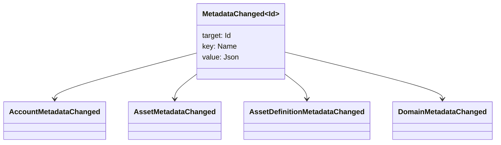

# Metadatos {#metadata}

Los metadatos son un mapa validado de claves y valores asociado a los objetos del libro mayor. Las claves son valores `Name` y los valores, cargas JSON (`Json`).

Los siguientes objetos pueden contener metadatos:

- dominios
- cuentas
- activos
- definiciones de activos
- NFTs
- RWAs
- desencadenantes
- transacciones

Utilice metadatos para campos pequeños descriptivos o de indexación que pertenezcan al estado del libro mayor de la blockchain. Las cargas útiles grandes deben almacenarse fuera del WSV y referenciarse mediante un valor de resumen criptográfico, URI, o una ruta SoraFS.

Para saber cuándo usar metadatos, activos, NFTs, RWAs o almacenamiento externo, consulte [Opciones de metadatos y almacenamiento del libro mayor](/es/guide/configure/metadata-and-store-assets.md).

## Pruébalo en Taira {#try-it-on-taira}

Los metadatos son visibles a través de lecturas normales de recursos. Este comando lista las definiciones de activos Taira que actualmente tienen metadatos:

```bash
curl -fsS 'https://taira.sora.org/v1/assets/definitions?limit=100' \
  | jq '.items[]
    | select((.metadata | length) > 0)
    | {id, name, metadata}'
```

Usa el mismo patrón para dominios y cuentas:

```bash
curl -fsS 'https://taira.sora.org/v1/domains?limit=20' \
  | jq '.items[] | select((.metadata // {} | length) > 0)'

curl -fsS 'https://taira.sora.org/v1/accounts?limit=20' \
  | jq '.items[] | select((.metadata // {} | length) > 0)'
```

Trata la salida vacía como un resultado válido. Significa que la página actual de objetos Taira no contiene metadatos, no que el endpoint API haya fallado.

## Actualizando metadatos {#updating-metadata}

Los metadatos se cambian con las operaciones de instrucción Iroha:

- [`SetKeyValue`](/es/blockchain/instructions.md#setkeyvalue-removekeyvalue) inserta o reemplaza una clave
- [`RemoveKeyValue`](/es/blockchain/instructions.md#setkeyvalue-removekeyvalue) elimina una clave

El principal de autorización que envía la transacción debe tener el permiso requerido por el validador de tiempo de ejecución de software activo. Para la superficie de permisos predeterminada, consulte [Tokens de permiso](/es/reference/permissions.md).

## Eventos {#events}

Los eventos de datos se emiten cuando los metadatos cambian. La carga útil del evento genérico es `MetadataChanged<Id>`:



Use [filtros de eventos de datos](/es/blockchain/filters.md#data-event-filters) para suscribirse únicamente a eventos de metadatos para el tipo de entidad o ID de objeto que sea relevante para una integración.

## Consultas {#queries}

Los metadatos se devuelven como parte del objeto consultado. Por ejemplo, use [`FindAccountById`](/es/reference/queries.md#accounts-and-permissions), [`FindDomainById`](/es/reference/queries.md#domains-and-peers), o [`FindAssetDefinitionById`](/es/reference/queries.md#assets-nfts-and-rwas). Usar [`FindNfts`](/es/reference/queries.md#assets-nfts-and-rwas) o [`FindNftsByAccountId`](/es/reference/queries.md#assets-nfts-and-rwas) para NFTs, y [`FindRwas`](/es/reference/queries.md#assets-nfts-and-rwas) para RWA muchos. Luego lea el campo de metadatos del objeto. NFT las respuestas de la consulta exponen el NFT `content` mapa como los metadatos del registro.

Las claves de metadatos son parte del estado del libro mayor de la blockchain, por lo que deben mantenerse estables y evitar codificar cambios de versión específicos de la aplicación en el nombre de la clave cuando un valor JSON puede llevar esa versión de manera explícita.
