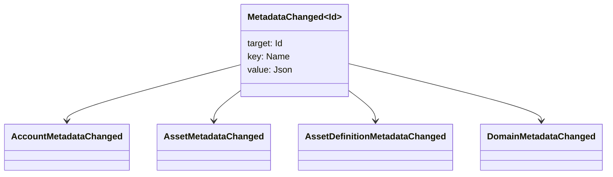

# Metadatos {#metadata}

Metadatos es un mapa de valor de clave comprobado adjunto a objetos del libro mayor. Las claves son los valores `Name` y los valores son las cargas útiles JSON (`Json`.

Los siguientes objetos pueden contener metadatos:

- dominios
- cuentas
- activos
- definiciones de activos
- NFTs
- RWAs
- desencadenantes
- transacciones

Utilice metadatos para pequeños campos de descripción o indexación que pertenecen al estado del libro mayor. WSV y se hace referencia por un digesto, URI, o SoraFS El camino.

Para obtener orientación sobre la elección de los metadatos, activos NFTs, RWAs o almacenamiento fuera de la cadena, véase [ Metadatos y opciones de almacenamiento de libros de contactos ](/es/guide/configure/metadata-and-store-assets.md).

## Pruébalo en Taira {#try-it-on-taira}

Los metadatos son visibles a través de las lecturas normales de recursos. Este comando enumera las definiciones de activos Taira que actualmente tienen metadatos:

```bash
curl -fsS 'https://taira.sora.org/v1/assets/definitions?limit=100' \
  | jq '.items[]
    | select((.metadata | length) > 0)
    | {id, name, metadata}'
```

Utilice el mismo patrón para dominios y cuentas:

```bash
curl -fsS 'https://taira.sora.org/v1/domains?limit=20' \
  | jq '.items[] | select((.metadata // {} | length) > 0)'

curl -fsS 'https://taira.sora.org/v1/accounts?limit=20' \
  | jq '.items[] | select((.metadata // {} | length) > 0)'
```

Tratar el resultado vacío como un resultado válido. Significa que la página actual de los objetos Taira no contiene metadatos, no es que el punto final falló.

## Actualización de los metadatos {#updating-metadata}

Los metadatos se cambian con Iroha Instrucciones especiales:

- [`SetKeyValue`](/es/blockchain/instructions.md#setkeyvalue-removekeyvalue) inserta o sustituye una clave.
- [`RemoveKeyValue`](/es/blockchain/instructions.md#setkeyvalue-removekeyvalue) elimina una llave

La autoridad que presente la transacción debe tener el permiso requerido por el validador de tiempo de ejecución activo. Para la superficie de autorización predeterminada, ver [Permission Tokens](/es/reference/permissions.md).

## Los acontecimientos {#events}

Los eventos de datos se emiten cuando los metadatos cambian. La carga útil del evento genérico es `MetadataChanged<Id>`:



Utilice los filtros de eventos de datos [ ](/es/blockchain/filters.md#data-event-filters) para suscribirse únicamente a eventos de metadatos para el tipo de entidad o objeto ID que sea importante para una integración.

## Las consultas {#queries}

Los metadatos se devuelven como parte del objeto consultado. Por ejemplo, utilice [`FindAccountById`](/es/reference/queries.md#accounts-and-permissions), [`FindDomainById`](/es/reference/queries.md#domains-and-peers) o [`FindAssetDefinitionById`](/es/reference/queries.md#assets-nfts-and-rwas). Utilice [`FindNfts`](/es/reference/queries.md#assets-nfts-and-rwas) o [`FindNftsByAccountId`](/es/reference/queries.md#assets-nfts-and-rwas) para NFTs, y [`FindRwas`](/es/reference/queries.md#assets-nfts-and-rwas) para los lotes RWA. Luego lea el campo de metadatos del objeto. Las respuestas a la consulta NFT exponen el mapa NFT `content` como los metadatos registrados.

Las claves de metadatos forman parte del estado del libro mayor, por lo que manténgalos estables y evite codificar la versión específica de la aplicación en el nombre de la clave cuando un valor JSON puede llevar esa versión explícitamente.
