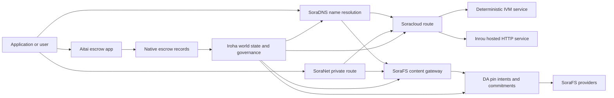

# SORA Nexus Servicios {#sora-nexus-services}

SORA Nexus agrega aviones de servicio orientados a aplicaciones alrededor de Iroha 3. Estos servicios no son libros principales separados. Están anclados por los estados mundiales Iroha, manifiestos Norito, registros de gobernanza y familias de rutas Torii.

La disponibilidad depende de la construcción del nodo y el perfil de red. Utilice [`/openapi`](/es/reference/torii-endpoints.md#app-and-sora-route-families) en el nodo objetivo como la lista autorizada de rutas activadas.

## Mapa de componentes {#component-map}

|Componente |El papel |Superficies principales |
| ---------------------- | ------------------------------------------------------------------------------------------------------------------------------------------- | ---------------------------------------------------------------------------------------- |
|Soracloud |Despliegue de aplicaciones, servicios alojados, modelo privado/tiempo de ejecución y control del ciclo de vida del servicio. |`/v1/soracloud/`, `/api/`, `iroha app soracloud ...` |
|En el interior|Soracloud alojado HTTP tiempo de ejecución para las revisiones de servicio que requieren un avión en vivo HTTP. |Soracloud Configuración de tiempo de ejecución, anuncios de capacidad del anfitrión, estado de replicación del tiempo de ejecución |
|SoraNet |Privacidad y superposición de transporte para los circuitos, el tráfico de relés, VPN, las sesiones de conexión y las rutas de transmisión. |Metadatos de la ruta `/v1/connect/`, `/v1/vpn/`, SoraNet |
|Disponibilidad de los datos (DA) |Evidencia de disponibilidad, compromiso y capa de intención para las cargas útiles referenciadas por carriles Nexus, manifiestos SoraFS y flujos de prueba. |`/v1/da/`, `FindDaPinIntent`, `[sumeragi.da]` |
|SoraFS |Tela de almacenamiento dirigida al contenido para los manifiestos, las cargas útiles CAR, el contenido fijado, las capturas en la puerta de entrada y los flujos de prueba de recuperación. |`/v1/sorafs/`, `/sorafs/`, `FindSorafsProviderOwner` |
|SoraDNS |Nombramiento determinístico y capa de certificación de resolver para los servicios y contenidos alojados en SORA. |`/v1/soradns/`, `/soradns/`, eventos del directorio de resolver |
|Aitai |Corredor de liquidación fiduciaria y de activos a nivel de aplicaciones respaldado por registros fiduciarios nativos, no por un libro mayor separado. | `OpenAssetEscrow`, `FindAssetEscrow*`, `EscrowEventFilter`, Kotodama `escrow_*` edificaciones |



## Los flujos comunes {#common-flows}

### Aplicación compartida alojada {#hosted-split-application}

Una aplicación típica de plano mixto utiliza todas las piezas juntas:

1. Los activos estáticos de frontend se empaquetan y fijan a través de SoraFS.
2. El anfitrión público, por ejemplo `<app>.sora`, está registrado a través de SoraDNS.
3. Las rutas Soracloud `/api/v1/search` o `/api/v1/stream` a un servicio de Inrou HTTP.
4. Las rutas Soracloud `/api/auth` y `/api/v1/user` a los manipuladores deterministas IVM.
5. Los clientes que necesitan privacidad pueden llegar al mismo contenido o a la ruta API a través de un circuito SoraNet.

|Camino .|Avión de apoyo .|¿ Por qué ?|
| ----------------- | --------------------- | ------------------------------------------------- |
| `/`               |SoraFS contenido estático |Caching de contenido reproducible root y gateway |
|`/assets/*` |SoraFS contenido estático |Activos con contenido y pruebas manifiestas |
|`/api/auth*` |Soracloud IVM |Estado del reto de autor y billetera seguro para reproducción |
|`/api/v1/user*` |Soracloud IVM |Las mutaciones de los estados sensibles a la gobernanza |
|`/api/v1/search*` |Soracloud Inrou |Servicio HTTP en vivo, caché, SSE o estado de colector |

### Publicación del contenido {#content-publication}

La publicación SoraFS produce artefactos duraderos antes de que una denominación los apunte:

1. Construye una carga útil o un directorio.
2. Envuelve en un CAR archivo y pieza del plan.
3. Construir un manifiesto Norito con datos de política y gobernanza del pin.
4. Enviar el manifiesto a Torii.
5. Registrar una intención o compromiso de disponibilidad del pin DA cuando el perfil objetivo requiera pruebas explícitas.
6. Enlazar el manifiesto con un nombre SoraDNS o una ruta estática frontal de Soracloud.

### Tráfico privado o ruta de transmisión {#private-fetch-or-streaming-route}

SoraNet puede sentarse delante de SoraFS o Soracloud:

1. El cliente resuelve el nombre o manifiesto.
2. Un directorio de vigilancia o un manifiesto de ruta elige los relés de entrada y salida.
3. El tráfico se rellena y se envía a través del circuito SoraNet.
4. El relé de salida llega a la puerta de entrada SoraFS, corriente Torii o ruta Soracloud.

## Aitai {#aitai}

Aitai es el corredor de aplicaciones SORA para la liquidación al estilo del mercado donde un comprador y un vendedor coordinan un pago fuera de la cadena mientras que Iroha controla la transacción. la custodia de activos en cadena. Debería utilizar la familia nativa de instrucciones de escrow en lugar de una cuenta de escrow propiedad de un contrato para los nuevos flujos de custodia numérica de activos.

El banco nativo mantiene la custodia en el libro mayor. `OpenAssetEscrow`, El comprador acepta y marca el pago fuera de la cadena con: `AcceptAssetEscrow` y `MarkEscrowPaymentSent`, y el vendedor libera con `ReleaseAssetEscrow` Si el comprador y el vendedor no están de acuerdo, cualquiera de las partes puede abrir una disputa y resolverla con un `CanResolveEscrowDispute` puede dividir la cantidad bloqueada.

Para el ciclo de vida completo, bloqueos genéricos de activos, garantía anónima, consultas, eventos y ejemplos Rust, vea [Native Asset Escrow](/es/blockchain/escrow.md).

|Superficie de Aitai |Utilizarlo para|
| ------------------------------------------------------------------------------------------------------------------------------------------------------------- | ----------------------------------------------------------------------------------------- |
| `OpenAssetEscrow`, `AcceptAssetEscrow`, `MarkEscrowPaymentSent`, `ReleaseAssetEscrow`, `CancelAssetEscrow`                                                    |Oferta de activos numéricos transparentes, incluidos los flujos de liquidación denominados en XOR. |
| `OpenAnonymousAssetEscrow`, `AcceptAnonymousAssetEscrow`, `MarkAnonymousEscrowPaymentSent`, `ReleaseAnonymousAssetEscrow`, `CancelAnonymousAssetEscrow`       |Ofertas protegidas utilizan adjuntos de prueba para la financiación y el cierre de movimientos. |
|`OpenEscrowDispute`, `ResolveEscrowDispute`, `OpenAnonymousEscrowDispute`, `ResolveAnonymousEscrowDispute` |Introducción de litigios y resolución judicial. |
|`FindAssetEscrowById`, `FindAssetEscrowsBySeller`, `FindAssetEscrowsByBuyer`, `FindAssetEscrowsByStatus` |Páginas de estado de la aplicación, trabajos de conciliación y herramientas de soporte. |
|`EscrowEventFilter` |Las suscripciones transparentes a escrow en vivo por identificación de escrow, vendedor, comprador, estado o tipo de evento. |
| Kotodama `escrow_open_offer`, `escrow_accept`, `escrow_mark_payment_sent`, `escrow_release`, `escrow_cancel`, `escrow_open_dispute`, `escrow_resolve_dispute` |Las llamadas contractuales Kotodama respaldadas por los sistemas de fianza V1. |

Para el uso público Taira o Minamoto, trate la línea de pago fuera de la cadena y cualquier flujo de trabajo de soporte o tribunal como política de aplicación. Iroha registra el estado de custodia, eventos del ciclo de vida, hashes de pruebas y movimiento final de activos; no verifica el liquidación fiduciaria por sí misma.

## Compruebe un nodo objetivo {#check-a-target-node}

Antes de usar ejemplos de esta página, confirme que la familia de rutas existe en el nodo al que está apuntando:

```bash
export TORII_URL=https://taira.sora.org

curl -fsS "$TORII_URL/openapi.json" \
  | jq '.paths | keys[] | select(test("^/v1/(soracloud|sorafs|soradns|connect|vpn|da)/"))'

curl -fsS "$TORII_URL/status" | jq .
```

Si `/openapi.json` no está expuesto por el perfil, pruebe `/openapi`. La disponibilidad exacta de la ruta depende de las características de construcción y la configuración de red.

### Taira Cheques de humo sólo para lectura {#taira-read-only-smoke-checks}

El punto final público Taira es útil para las comprobaciones en el lado de lectura, pero no lo utilice para ejemplos de mutación a menos que esté operando una cuenta autorizada y tenga la intención de cambiar el estado en vivo.

```bash
export TORII_URL=https://taira.sora.org

curl -fsS "$TORII_URL/status" \
  | jq '{version: .build.version, peers, blocks, lanes: (.teu_lane_commit | length)}'

curl -fsS "$TORII_URL/v1/connect/status" | jq '{enabled, sessions_active}'

curl -fsS "$TORII_URL/v1/vpn/profile" \
  | jq '{available, relay_endpoint, supported_exit_classes}'

curl -fsS "$TORII_URL/v1/sorafs/storage/state" \
  | jq '{bytes_capacity, bytes_used, pin_queue_depth, por_inflight}'

curl -fsS -H 'Accept: application/json' "$TORII_URL/v1/soracloud/status" \
  | jq '.control_plane | {service_count, services: [.services[] | {service_name, current_version}]}'
```

Taira puede exponer rutas del plano de control específicas para el despliegue que no se enumeran en el mapa de trayectoria OpenAPI. Trate a `/openapi` como el contrato generado primario API, y luego confirme cualquier ruta específica para la implementación directamente antes de documentarla como en vivo.

## Soracloud {#soracloud}

Soracloud es el plano de control de aplicaciones SORA. Rastrea paquetes de implementación, revisiones de servicios, enrutamiento, estado de lanzamiento, entradas de configuración autorizadas, secretos de servicio cifrados, registros de registro de modelos, sesiones privadas de inferencia y recibos de tiempo de ejecución.

Soracloud utiliza dos aviones de ejecución:

|Avión de ejecución |Tiempo de ejecución |Utilizarlo para|
| ---------------------- | ------- | -------------------------------------------------------------------------------------------- |
|`DeterministicService` |`Ivm` |Autor, estado de la bóveda, lecturas certificadas, manipuladores de buzones ordenados, mutaciones sensibles a la gobernanza |
|`HttpService` |`Inrou` |En vivo HTTP APIs, trabajo pesado para colectores, servicios respaldados por caché, SSE, flujos con ayuda del navegador |

Los comandos de despliegue, actualización, retroceso, configuración, secreto, modelo y estado se envían a través de Torii y leen el estado del mundo comprometido; no dependen de un espejo local separado CLI. El enrutamiento público se basa en el prefijo más largo, por lo que un anfitrión registrado puede dividir el tráfico entre las rutas de HTTP alojadas y las rutas deterministas API.

### Estafón de una aplicación dividida {#scaffold-a-split-app}

La plantilla de aplicaciones divididas crea un frontend estático más uno alojado en vivo API y un servicio determinístico de bóveda / API:

```bash
iroha app soracloud app init \
  --template split-app \
  --app-name solswap_indexer \
  --app-version 0.1.0 \
  --public-host solswap-indexer.sora \
  --output-dir ./apps/solswap-indexer

iroha app soracloud app local-plan \
  --manifest ./apps/solswap-indexer/app_manifest.json

iroha app soracloud app doctor \
  --manifest ./apps/solswap-indexer/app_manifest.json
```

`local-plan` imprime la división de ruta, los manifiestos del servicio infantil, las rutas de guiones del espacio de trabajo y el modo de publicación esperado en frontend. `doctor` valida el contrato local de lanzamiento antes de que usted involucre a Torii.

### Despliegue e inspeccione el estado de la aplicación {#deploy-and-inspect-app-state}

```bash
export SORACLOUD_TORII_URL=https://<soracloud-enabled-torii>

iroha app soracloud app deploy \
  --manifest ./apps/solswap-indexer/app_manifest.json \
  --torii-url "$SORACLOUD_TORII_URL"

iroha app soracloud app status \
  --manifest ./apps/solswap-indexer/app_manifest.json \
  --torii-url "$SORACLOUD_TORII_URL"
```

Para un servicio ya desplegado, utilice los comandos de alcance del servicio:

```bash
iroha app soracloud status \
  --service-name solswap_indexer_live \
  --torii-url "$SORACLOUD_TORII_URL"

iroha app soracloud rollback \
  --service-name solswap_indexer_live \
  --target-version 0.1.0 \
  --torii-url "$SORACLOUD_TORII_URL"
```

### Materiales config y secretos {#config-and-secret-material}

Soracloud configuración y entradas secretas son parte del estado de implementación autorizado. La implementación, actualización y retroceso fallan en cerrarse cuando las configuraciones o vínculos secretos requeridos faltan o no son consistentes con los manifestos activos.

```bash
iroha app soracloud config-set \
  --service-name solswap_indexer_live \
  --config-name indexer/public_config \
  --value-file ./config/public-config.json \
  --torii-url "$SORACLOUD_TORII_URL"

iroha app soracloud secret-set \
  --service-name solswap_indexer_live \
  --secret-name indexer/api_key \
  --secret-file ./secrets/api-key.envelope.json \
  --torii-url "$SORACLOUD_TORII_URL"
```

Utilice la ayuda CLI para obtener las fichas de credenciales exactas requeridas por su perfil:

```bash
iroha app soracloud config-set --help
iroha app soracloud secret-set --help
```

## En el interior {#inrou}

Inrou es el anfitrión HTTP tiempo de ejecución utilizado por Soracloud. Una Iroha nodo con el embedded Soracloud proyectos de tiempo de ejecución admitidos Soracloud el estado en un plan de materialización local, comienza las réplicas asignadas del servicio alojado como servicios loopback, y los informes replican el estado de tiempo de ejecución de nuevo en el modelo autorizado.

Utilizar Inrou para las cargas de trabajo que requieren una superficie en vivo HTTP, como los flujos pesados con el colector APIs, SSE, manipuladores respaldados por caché o servicios asistidos por el navegador.

### Requisitos del tiempo de ejecución {#runtime-requirements}

- El tiempo de funcionamiento del manifiesto del contenedor deberá ser `Inrou`.
- El plano de ejecución del manifiesto de servicio debe ser `HttpService`.
- El `HttpService + Inrou` requiere exactamente un `PersistentRootLeaseVolume` montado en `/`.
- Los servicios Inrou replicados también necesitan un servicio compartido o almacenamiento confidencial de arrendamientos cuando mantienen el estado compartido mutable.
- Los nodos de alojamiento de producción deben anunciar la capacidad real de Inrou en lugar de funcionar solo como un proxy.

### Un fragmento manifiesto {#manifest-fragment}

El siguiente ejemplo muestra la forma de los dos manifestos. Es un fragmento, no un conjunto completo de implementación.

```jsonc
// container_manifest.json
{
  "schema_version": 1,
  "runtime": { "runtime": "Inrou", "value": null },
  "bundle_path": "/bundles/solswap-indexer.inrou",
  "entrypoint": "/app/bin/launch-indexer.sh",
  "args": [],
  "env": {
    "RUST_LOG": "info",
  },
  "inrou": {
    "schema_version": 1,
    "guest_os": { "guest_os": "DebianSlim", "value": null },
    "guest_images": {
      "x86_64": {
        "kernel_image_path": "/inrou/x86_64/vmlinux",
        "rootfs_image_path": "/inrou/x86_64/rootfs.ext4",
        "initrd_image_path": null,
      },
      "aarch64": {
        "kernel_image_path": "/inrou/aarch64/vmlinux",
        "rootfs_image_path": "/inrou/aarch64/rootfs.ext4",
        "initrd_image_path": null,
      },
    },
  },
  "lifecycle": {
    "start_grace_secs": 60,
    "stop_grace_secs": 30,
    "healthcheck_path": "/api/indexer/v1/health",
  },
}
```

```jsonc
// service_manifest.json
{
  "schema_version": 1,
  "service_name": "solswap_indexer_live",
  "service_version": "0.1.0",
  "execution_plane": { "execution_plane": "HttpService", "value": null },
  "replicas": 2,
  "route": {
    "host": "solswap-indexer.sora",
    "path_prefix": "/api/v1/search",
    "service_port": 8080,
    "visibility": { "visibility": "Public", "value": null },
    "tls_mode": { "tls": "Required", "value": null },
  },
  "lease_volumes": [
    {
      "volume_name": "root_disk",
      "kind": {
        "lease_volume": "PersistentRootLeaseVolume",
        "value": null,
      },
      "storage_class": { "storage_class": "Warm", "value": null },
      "mount_path": "/",
      "max_total_bytes": 8589934592,
    },
    {
      "volume_name": "index_state",
      "kind": { "lease_volume": "ServiceLeaseVolume", "value": null },
      "storage_class": { "storage_class": "Warm", "value": null },
      "mount_path": "/var/lib/solswap-indexer",
      "max_total_bytes": 1073741824,
    },
  ],
}
```

En el tiempo de ejecución, cada volumen montado del arrendamiento se expone a través de variables ambientales derivadas del nombre del volumen:

```text
SORACLOUD_LEASE_VOLUME_ROOT_DISK_DIR
SORACLOUD_LEASE_VOLUME_ROOT_DISK_MOUNT_PATH
SORACLOUD_LEASE_VOLUME_INDEX_STATE_DIR
SORACLOUD_LEASE_VOLUME_INDEX_STATE_MOUNT_PATH
```

## SoraNet {#soranet}

SoraNet es la superposición de privacidad y transporte. Proporciona rutas basadas en el relevo para el tráfico que no deben conectarse directamente a la puerta de entrada o al servicio objetivo. El diseño del transporte utiliza roles de relevo de entrada, medio y salida, transporte QUIC, un apretón de manos híbrido basado en ruido, negociación de capacidades, metadatos de directorio de relevo y celdas acolchadas de tamaño fijo.

En el Nexus las implementaciones, SoraNet puede transportar contenidos, tráfico por puertas de entrada, VPN o sesiones de conexión, y Norito las rutas de transmisión. Las entradas del directorio pueden marcar los relés que admiten `norito-stream`, que permite a los clientes preferir rutas adecuadas para Torii RPC o la transmisión de tráfico.

### Configuración de transmisión {#streaming-configuration}

El perfil de Nexus permite la provisión de SoraNet para las rutas de transmisión:

```toml
[streaming]
feature_bits = 0b11

[streaming.soranet]
enabled = true
exit_multiaddr = "/dns/torii/udp/9443/quic"
padding_budget_ms = 25
access_kind = "authenticated"
provision_spool_dir = "./storage/streaming/soranet_routes"
provision_spool_max_bytes = 0
provision_window_segments = 4
provision_queue_capacity = 256
```

Usar `access_kind = "read-only"` para las rutas de contenido que no requieren autenticación del espectador. Utilizar `authenticated` cuando el relevo de salida debe hacer cumplir los boletos o la identidad del espectador antes de llegar a Torii o a un servicio alojado.

### SoraNet-Actualización SoraFS Traer {#soranet-aware-sorafs-fetch}

El SoraFS fetch CLI puede emitir un manifiesto de proxy local y rodar metadatos de ruta SoraNet para extensiones de navegador o adaptadores SDK:

```bash
sorafs_cli fetch \
  --plan artifacts/payload_plan.json \
  --manifest-id 7bb2...9d31 \
  --provider name=alpha,provider-id=9f5c...73aa,base-url=https://gw-alpha.example.org/,stream-token="$(cat alpha.token)" \
  --output artifacts/payload.bin \
  --json-out artifacts/fetch_summary.json \
  --local-proxy-manifest-out artifacts/proxy_manifest.json \
  --local-proxy-mode bridge \
  --local-proxy-norito-spool storage/streaming/soranet_routes \
  --local-proxy-kaigi-spool storage/streaming/soranet_routes \
  --local-proxy-kaigi-policy authenticated \
  --max-peers=2 \
  --retry-budget=4
```

Los informes del proveedor de registros resumidos, recibos en pedazos, metadatos proxy locales y las configuraciones efectivas de ruta utilizadas para la recogida.

## Disponibilidad de los datos (DA) {#data-availability-da}

DA es la capa de evidencia de disponibilidad para las cargas útiles que son demasiado grandes, demasiado sensibles a la privacidad o demasiado específicas del servicio para colocarlas directamente en el estado mundial. Registra compromisos deterministas y obligaciones de recuperación para que los validadores, pasarelas y clientes puedan acordar sobre qué bytes se prometieron, qué política se aplica y cuáles pruebas se han observado.

DA no sustituye a Kura ni a SoraFS:

- Kura almacena el flujo de bloques finalizado y los datos de recuperación por consenso.
- SoraFS almacena y sirve bytes con dirección de contenido, cargas útiles CAR, y manifestos.
- DA registra compromisos, políticas de prueba, aberturas de prueba y intenciones pin que permiten programar, auditar y vincular esos bytes al estado del libro mayor.

Usar DA cuando una aplicación o un carril Nexus necesite una promesa visible en el libro mayor de que los datos fuera de la cadena siguen siendo recuperables. Los ejemplos comunes incluyen compromisos de carga útil del carril para flujos de liquidación, intenciones de pin SoraFS para el contenido publicado, los paquetes de pruebas que deben conservarse para una posterior verificación, y los artefactos de aplicación cuyo estado público debe ser un digesto en lugar de la carga útil completa.

### Ciclo de vida {#lifecycle}

|Escenario .|Lo que se registra |
| ---------- | ----------------------------------------------------------------------------------------------------------------------------------------------------- |
|La intención .|Un boleto, referencia manifiesta, alias, referencia de carril/epoca/secuencia, política de retención o objetivo de replicación. |
|Compromiso |Digest material que une el manifiesto, la carga útil del carril, el paquete de pruebas o el contenido raíz al registro visible en el libro mayor. |
|Las pruebas |Votos de disponibilidad, aberturas de pruebas, acreditaciones de proveedores u otras pruebas específicas del perfil aceptadas por la red objetivo. |
|Pregunta .|Las búsquedas de la intención de fijación a través de `FindDaPinIntentByTicket`, `FindDaPinIntentByManifest`, `FindDaPinIntentByAlias` o `FindDaPinIntentByLaneEpochSequence`. |

El flujo de publicación típico respaldado por DA es:

1. Construir o recibir la carga útil fuera del WSV, por ejemplo un archivo de SoraFS CAR o una carga útil del carril Nexus.
2. En el caso de la carga útil, se indicará el valor de la carga y se describirá la carga útil en un manifiesto Norito o en un registro de compromiso específico de la ruta.
3. Enviar el manifiesto, la intención del pin o el compromiso a través de `/v1/da/*` cuando esa familia de rutas esté habilitada, o a través de la ruta de transacción firmada de la red.
4. Que los validadores o proveedores de disponibilidad recopilen las pruebas requeridas por la política de prueba activa.
5. Pregunte la intención o el compromiso del pin resultante antes de promocionar un alias, prueba de liquidación o ruta de pasarela que dependa de la carga útil.

### Modelo algorítmico {#algorithmic-model}

DA convierte una carga útil en un compromiso firmado, protegido por reproducción e indexado por bloques. Los algoritmos importantes son deterministas para que los validadores y las pasarelas puedan volver a calcular los mismos digestos de los mismos bytes.

1. Canonizar la carga útil presentada. Torii acepta una solicitud de ingesta con `(lane_id, epoch, sequence)`, bytes de carga útil, metadatos de compresión, tamaño de pieza, perfil de borrado, la política de retención y la firma del remitente. El nodo descomprime las cargas útiles gzip, deflate o Zstandard cuando se solicita, luego verifica que la longitud canónica de byte es igual a `total_size`.
2. Valida los parámetros de carril y piezas. El carril debe existir en el catálogo de carril Nexus. `chunk_size` debe tener una potencia no cero de dos, al menos dos bytes, y no mayor que el máximo configurado. El perfil de borrado debe incluir fragmentos de datos y al menos dos fragmentos de paridad. En el catálogo de carriles se selecciona el esquema de prueba, ya sea `merkle_sha256` o `kzg_bls12_381`.
3. Aplicar la política de red. El nodo impone la línea de base de replicación y retención configurada para la clase blob. Los metadatos públicos deben permanecer en texto plano; los metadatos solo de gobierno se cifran con la clave de metadatos de gobernanza configurada del nodo antes de que se escriba en el manifiesto.
4. Chunk and commit. La carga útil canónica se divide con un perfil de tamaño fijo derivado de `chunk_size`. Torii calcula la digestión de la carga útil, la raíz del árbol de prueba de recuperación y los compromisos por trozo. Los fragmentos de datos llevan compromisos BLAKE3 sobre sus bytes.
5. Añadir compromisos de borrado. Los trozos se agrupan en bandas de `data_shards`. Las células faltantes en la franja final están llenas de cero para el cálculo de la paridad. RS(16) la paridad crea fragmentos de paridad en filas/global; opcional `row_parity_stripes` añadir la paridad de las tiras de estilo columna en toda la matriz. BLAKE3 digestivos de los pequeños andinos `u16` Los símbolos.
6. Construye el manifiesto. `DaManifestV1` registra el carril, la época, la clase de manchas, el codec, la digestión de carga útil, la raíz del trozo, el tamaño del trozo , el perfil de borrado, la política de retención, la cotización de alquiler, los compromisos por trozo, compromiso opcional IPA, metadatos y el tiempo de emisión. El boleto de almacenamiento es determinista: el nodo primero hashes una plantilla del manifiesto con un boleto vacío, luego escribe esa huella digital como la última `storage_ticket`.
7. Rechazar conflictos de reproducción. La clave de repetición es `(lane_id, epoch, sequence, manifest_fingerprint)`. Un duplicado con la misma huella digital es idempotente. Una secuencia obsoleta o la misma secuencia con una huella digital diferente es rechazada.
8. Emitir artefactos firmados. Torii calcula un compromiso de PDP, firma un `DaIngestReceipt`, construye un `DaCommitmentRecord` y escribe artefactos enrollados para el manifiesto; PDP compromiso, registro de compromiso, calendario de compromiso, intención del pin, archivo de recibo y registro de recibo. El cursor de recibo avanza monótono por `(lane_id, epoch)`.

Los registros de compromiso son lo que llevan los bloques.

- Carretera, época y secuencia
- la mancha de llamada ID y el hash del manifiesto canónico.
- esquema de prueba de carril
- raíz de trozo
- Compromiso opcional KZG para carriles KZG
- PDP/digestación de pruebas
- Clase de retención y billete de almacenamiento
- Torii Firma de reconocimiento DA

Antes de que un bloque incorpore los registros DA, la ruta de ensamblaje del bloque valida el paquete:

- `(lane_id, epoch, sequence)` debe ser único en el paquete.
- Los hashes manifestados deben ser no cero y únicos en el paquete.
- El esquema de prueba de compromiso debe coincidir con la política de vía configurada.
- Las rutas de Merkle rechazan los compromisos KZG; las rutas KZG requieren un compromiso no cero KZG.
- Las intenciones de pin se canonizan, clasifican y filtran por carril, hash manifestado, boleto de almacenamiento, cuenta del propietario y reglas de colisión de alias.

El encabezado del bloque almacena hashes para las políticas de prueba DA, compromisos y intenciones de pin. Para comprobantes de membresía, el paquete de compromiso también expone una raíz Merkle cuyas hojas son hashes de valores canónicos Norito codificados en `DaCommitmentRecord`. Los nodos padres hash la concatenación de los hijos izquierdo y derecho; se promueve una hoja impar sin cambios a la siguiente capa.

### Verificación de la prueba {#proof-verification}

`/v1/da/commitments/prove` puede producir una prueba de un compromiso en un bloque. La prueba contiene el compromiso, la altura del bloque, el índice en el paquete, el hash de paquete, la longitud del paquete, raíz Merkle y el camino hermano. Verificación verifica:

1. El hash del paquete de pruebas coincide con el hash de compromiso DA del encabezado del bloque.
2. La altura del bloque de prueba coincide con el encabezado del bloque en referencia.
3. El índice está en límites y el compromiso es igual a la entrada del paquete de ese índice.
4. La política de prueba de carril acepta el compromiso.
5. Doblar el camino de hermanos desde la hoja del compromiso reconstruye la raíz suministrada.
6. La raíz reconstruida es igual a la raíz del paquete.

Esto demuestra que se incluyó un compromiso específico de disponibilidad en una carga útil específica de bloques; no prueba que todas las copias estén actualmente en línea. La capacidad de recuperación en vivo se comprueba por separado a través de las recogidas del proveedor SoraFS, las verificaciones PDP/PoTR o la evidencia de disponibilidad específica del perfil.

### Interacción con el consenso {#consensus-interaction}

DA se acopla a Sumeragi mediante una difusión confiable (RBC), pero no es un segundo protocolo de finalidad. RBC difunde y recupera cargas útiles de propuestas: el proponente anuncia una sesión para `(height, view, payload_hash)`, los fragmentos de intercambio entre pares y las señales `READY`/`DELIVER` que rastrean si suficientes validadores observaron la misma carga útil.

En Iroha 3, un peer considera que la carga útil pendiente del bloque está disponible cuando:

- el bloque pendente local hash bytes al hash de carga útil esperada, o
- RBC ha recuperado una carga útil que coincide con el bloque hash, altura, vista y carga útil hash.

Si ninguna de las condiciones es válida, el registro de pares `missing_local_data`, continúa intentando recuperar la carga útil a través de RBC o sincronización de bloqueo, y informa la puerta DA en estado y telemetría. En la implementación actual, estas señales DA son de asesoramiento para la finalidad: un bloque todavía termina a partir del certificado de compromiso más la carga útil local correspondiente, no a partir de un certificado de quórum separado DA.

El cronograma DA amplía las ventanas de recuperación. El cronograma efectivo del quórum DA se deriva del bloque configurado y los cronogramas de compromiso, luego multiplicado por `sumeragi.advanced.da.quorum_timeout_multiplier`. El cronograma de disponibilidad es `max(quorum_timeout, availability_timeout_floor_ms) * availability_timeout_multiplier`. Antes de que expire ese plazo de disponibilidad, el nodo favorece la recuperación de carga útil y evita un reprogramamiento prematuro; después de que expira, los caminos normales de recuperación y cambio de vista pueden continuar.

### Notas del operador {#operator-notes}

Los perfiles de consenso Iroha 3 incluyen la difusión de cargas útiles respaldada por RBC, los controles manifestos, la validación del paquete DA y la telemetría de recuperación. La plantilla de pares expone límites `[sumeragi.da]` para los compromisos y las aberturas de prueba por bloque, más multiplicadores de tiempo `[sumeragi.advanced.da]` para el comportamiento de quorum y disponibilidad. Mantenga estas configuraciones consistentes entre validadores en un perfil de red.

Para el descubrimiento de la ruta, comience con el documento OpenAPI del nodo:

```bash
curl -fsS "$TORII_URL/openapi.json" \
  | jq '.paths | keys[] | select(startswith("/v1/da/"))'
```

Utilizar el [referencia de la consulta](/es/reference/queries.md#nexus-data-availability-and-packages) para la corriente DA los nombres de las consultas, y el [Modelo de configuración entre pares](/es/reference/peer-config/) para el local `[sumeragi.da]` los botones expuestos por su construcción.

## SoraFS {#sorafs}

SoraFS es el tejido de almacenamiento descentralizado dirigido al contenido. empaca los bytes en trozos deterministas, archivos CAR y manifiestos Norito que unen las raíces del contenido, Los proveedores de almacenamiento anuncian la capacidad y la disponibilidad del contenido, mientras que los gateways verifican los manifestos y los compromisos de fragmentos antes de ofrecer el contenido.

Los usos típicos de SoraFS incluyen activos estáticos de aplicaciones, edificaciones de documentación, paquetes de zonas, referencias a modelos o artefactos y paquetes de pruebas de gobernanza. El modelo de datos Iroha expone los eventos de la puerta de enlace SoraFS y una consulta [ `FindSorafsProviderOwner`](/es/reference/queries.md#nexus-data-availability-and-packages) para resolución de propiedad del proveedor.

### Envasar, manifestar, firmar y presentar {#pack-manifest-sign-and-submit}

```bash
cargo run -p sorafs_car --features cli --bin sorafs_cli -- \
  car pack \
  --input ./dist \
  --car-out artifacts/site.car \
  --plan-out artifacts/site.chunk-plan.json \
  --summary-out artifacts/site.car-summary.json

cargo run -p sorafs_car --features cli --bin sorafs_cli -- \
  manifest build \
  --summary artifacts/site.car-summary.json \
  --manifest-out artifacts/site.manifest.to \
  --manifest-json-out artifacts/site.manifest.json \
  --pin-min-replicas=3 \
  --pin-storage-class=warm \
  --pin-retention-epoch=42

SIGSTORE_ID_TOKEN=$(oidc-client fetch-token) \
cargo run -p sorafs_car --features cli --bin sorafs_cli -- \
  manifest sign \
  --manifest artifacts/site.manifest.to \
  --bundle-out artifacts/site.manifest.bundle.json \
  --signature-out artifacts/site.manifest.sig

cargo run -p sorafs_car --features cli --bin sorafs_cli -- \
  manifest submit \
  --manifest artifacts/site.manifest.to \
  --chunk-plan artifacts/site.chunk-plan.json \
  --torii-url "$TORII_URL" \
  --resolve-submitted-epoch=true \
  --authority=<i105-account-id> \
  --private-key-file ./secrets/authority.ed25519 \
  --summary-out artifacts/site.manifest.submit.json \
  --response-out artifacts/site.manifest.submit.body
```

Si `/v1/sorafs/pin/register` no está enrutado en el nodo objetivo, el CLI puede volver a una presentación firmada `/transaction` y esperar un estado de tubería terminal.

### Verifique y traiga {#verify-and-fetch}

```bash
cargo run -p sorafs_car --features cli --bin sorafs_cli -- \
  proof verify \
  --manifest artifacts/site.manifest.to \
  --car artifacts/site.car \
  --chunk-plan artifacts/site.chunk-plan.json \
  --summary-out artifacts/site.verify.json

sorafs_cli fetch \
  --plan artifacts/site.chunk-plan.json \
  --manifest-id <manifest-digest-hex> \
  --provider name=primary,provider-id=<provider-id-hex>,base-url=https://gateway.example.org/,stream-token="$(cat provider.token)" \
  --output artifacts/site.fetch.tar \
  --json-out artifacts/site.fetch.json
```

### Verificación de la prueba de recuperabilidad {#proof-of-retrievability-checks}

Los operadores podrán inspeccionar y activar controles de prueba para los proveedores de almacenamiento:

```bash
sorafs_cli por status \
  --torii-url "$TORII_URL" \
  --manifest <manifest-digest-hex> \
  --status=failed \
  --limit=20

sorafs_cli por trigger \
  --torii-url "$TORII_URL" \
  --manifest <manifest-digest-hex> \
  --provider <provider-id-hex> \
  --reason=latency_probe \
  --samples=48 \
  --auth-token artifacts/challenge_token.to
```

## SoraDNS {#soradns}

SoraDNS es la capa de denominación determinista para los servicios y el contenido de SORA. Normaliza los nombres, ancla las actualizaciones del directorio de resolver en Iroha, y distribuye paquetes de zona o resolución firmados a través de SoraFS. Los resolvedores y gateways verifican los documentos de certificación del resolver antes de confiar en los metadatos de descubrimiento.

Para el acceso al navegador, SoraDNS deriva los hosts de pasarela de un FQDN registrado. El host de vanidad registrado sigue siendo el origen canónico de la aplicación, mientras que los perfiles de gateway desplegados exponen las rutas de retroceso del navegador y Torii para ese origen.

### Formularios de acogida {#host-forms}

|Formulario |Ejemplo |Propósito |
| --- | --- | --- |
|Origen de la vanidad |`https://<fqdn>/<path>` |Aplicación canónica URL registrada en los manifiestos y notas de publicación |
| Taira puerta de acceso del navegador |`https://<fqdn>.mon.taira.sora.net/<path>` |Puerta de acceso del navegador público para un alias activo |
|Torii Camino de retroceso |`https://taira.sora.org/soradns/<fqdn>/<path>` |Torii debug y ruta de retroceso para un alias activo |
|Puerta de hash canónica |`<base32(blake3(name))>.gw.sora.id` |Identidad determinística de la puerta de entrada y verificación GAR |

El fallback `/soradns/<alias>/...` no es el público preferido URL. La configuración de herramientas, los manifestos de aplicaciones y la configuración del frontend deben preferir al propio host vanity. Si un alias no está activo en Taira, el gateway del navegador o la ruta de retroceso puede regresar a `404` o fallar TLS antes de que se inicie el enrutamiento de la aplicación.

### Anfitriones de la puerta de entrada derivada {#derive-gateway-hosts}

```ts
import {
  deriveSoradnsGatewayHosts,
  hostPatternsCoverDerivedHosts,
} from '@iroha/iroha-js'

const derived = deriveSoradnsGatewayHosts('docs.sora')
console.log(derived.canonicalHost)
console.log(derived.prettyHost)

const taira = deriveSoradnsGatewayHosts('solswap-indexer.sora', {
  prettySuffix: 'mon.taira.sora.net',
})
console.log(taira.prettyHost)

const patterns = [
  derived.canonicalHost,
  derived.canonicalWildcard,
  derived.prettyHost,
]
console.log(hostPatternsCoverDerivedHosts(patterns, derived))
```

GAR cargas útiles deben cubrir el anfitrión hash canónico, la tarjeta salvaje canónica, y el anfitrió bonito seleccionado.

### Traiga una instantánea del directorio de resolución {#fetch-a-resolver-directory-snapshot}

```bash
curl -i "$TORII_URL/v1/soradns/directory/latest"

soradns_resolver directory fetch \
  --record-url "$TORII_URL/v1/soradns/directory/latest" \
  --directory-url https://gateway.example.org/soradns/directory/latest.car \
  --output ./state/soradns-directory

soradns_resolver rad verify \
  --rad ./state/soradns-directory/rad/resolver-a.norito
```

Los gateways deben rechazar los resolvers cuyo documento de certificación del resolver está faltando, expirado, sin firmar o no anclado en el último directorio Merkle root. En una red donde aún no se ha publicado un directorio del resolver, `/v1/soradns/directory/latest` puede devolver `404` aunque la ruta esté activada.

### Delegación pública DNS {#public-dns-delegation}

La derivación del host SoraDNS no sustituye la delegación regular de Internet DNS. Si un nombre público DNS debe apuntar a una puerta de entrada SoraDNS:

- para los subdominios, publique un CNAME al host bonito seleccionado
- para los nombres de ápice, utilice los registros ALIAS/ANAME o A/AAAA en el gateway anycast IPs.
- Mantenga el host hash canónico bajo el dominio de entrada SoraDNS para los controles GAR

## FHE y UAID {#fhe-and-uaid}

Las superficies relacionadas con FHE disponibles para los servicios de Nexus incluyen:

- `iroha_crypto::fhe_bfv` implementa el soporte determinístico de BFV para la evaluación del texto cifrado escalar. La resolución del identificador utiliza `BfvIdentifierPublicParameters` y `BfvIdentifierCiphertext`, donde la ranura 0 almacena la longitud de byte de entrada y las ranuras posteriores almacenan un byte cifrado cada una.
- Soracloud estado y esquemas de trabajo modelo FHE cargas de trabajo de texto cifrado con conjuntos de parámetros administrados por gobernanza, políticas de ejecución, compromisos de texto cifre, sobres de consultas y solicitudes de divulgación.

El camino del identificador BFV se utiliza para la inscripción que preserva la privacidad. Un cliente puede enviar un identificador cifrado al resolvador Torii. en el marco de la política de identificación activa, obtendrá un `OpaqueAccountId`, y emitirá un recibo `ClaimIdentifier`. Luego vincula ese recibo al UAID adjunto a la cuenta de destino.

El Consejo UAID Es el anclaje de identidad y capacidad alrededor de ese flujo. En el modelo de datos, `UniversalAccountId` está respaldado por hash y se muestra como `uaid:<hash>`. Los analizadores aceptan cualquiera de los dos . `uaid:<hash>` o la digestión cruda de 64 hex. `Account` y `NewAccount` incluye opcional `uaid` y `opaque_ids` El registro en el tiempo de ejecución impone un uno a uno UAID- índice de contabilidad, rechaza los identificadores opacos duplicados o en colisión y rechaza los identificables opacos sin un UAID. Cada vez que UAID los cambios en la vinculación de cuentas, el tiempo de ejecución reconstruye las obligaciones del espacio directorio de datos UAID.

Directorio Espacial manifiesta conectar capacidades a una UAID. Una `AssetPermissionManifest` los nombres de las UAID, espacio de datos, activación y época de vencimiento opcional, así como las entradas permitidas/deniadas ordenadas en el ámbito del espacio, programa, método, activo, y AMX La evaluación es negativa-ganas: la primera negación de coincidencia rechaza la solicitud, En caso contrario, el último permiso de coincidencia del candidato se comprobará contra cualquier límite de cantidad. La publicación, expiración y revocación de estos manifestos está protegida por el `CanPublishSpaceDirectoryManifest`.

Para el estado de Soracloud FHE, los regímenes implementados son:

|Esquema |¿ Qué controla ?|
| ----------------------------------------- | --------------------------------------------------------------------------------------------------------------------------- |
|`SoraStateBindingV1` con `FheCiphertext` |Declare que los valores bajo un prefijo de clave de estado son FHE textos cifrados. |
|`FheParamSetV1` |Nombres del esquema, backend, cadena de módulos, grado polinómico, número de ranuras, objetivo de seguridad, ciclo de vida y digestión de parámetros. |
|`FheExecutionPolicyV1` |Limita el tamaño del texto cifrado, el tamaño de texto plano, el número de entradas/salidas, la profundidad de multiplicación, las rotaciones, los arranques y el modo redondeo. |
|`FheGovernanceBundleV1` |Un par de un parámetro establecido con una política de ejecución para la validación de admisión. |
|`FheJobSpecV1` |Describe el trabajo determinista `Add`, `Multiply`, `RotateLeft` o `Bootstrap` sobre las claves y compromisos de estado del texto cifrado. |
|`CiphertextQuerySpecV1` |Las consultas sólo contienen texto cifrado por servicio, vinculación, prefijo de clave, límite de resultados, nivel de metadatos y prueba de inclusión opcional. |
|`DecryptionRequestV1` |Solicita la divulgación de un compromiso con el texto cifrado en virtud de una política de autoridad de descifrado. |

`FheJobSpecV1::validate_for_execution` comprueba que el trabajo, la política de ejecución y el conjunto de parámetros coinciden antes de la admisión. También impone reglas específicas de operación: sumar y multiplicar necesitan al menos dos entradas; rotate y bootstrap necesitan exactamente una entrada, y la profundidad solicitada, el recuento de rotación, el recueno de bootstrap, el número de entradas, los bytes de carga útil y el tamaño de salida determinista deben permanecer dentro de los límites de las políticas.

UAID no es el texto cifrado y no la política de FHE en sí misma. Es el anclaje de capacidad estable de cuenta utilizado para encontrar la cuenta, las reclamaciones de identificador opaco y los vínculos del Directorio Espacial que autorizan un servicio o flujo del espacio de datos. Los esquemas FHE rigen la admisión y ejecución de cargas útiles cifradas por separado a través de conjuntos de parámetros, políticas de ejecución, compromisos en el texto cifrado y políticas de autoridad de descifrado.

Las superficies pertinentes Torii incluyen:

- `/v1/identifier-policies`
- `/v1/identifiers/resolve`
- `/v1/accounts/{account_id}/identifiers/claim-receipt`
- `/v1/identifiers/receipts/{receipt_hash}`
- `/v1/accounts/{uaid}/portfolio`
- `/v1/space-directory/uaids/{uaid}`
- `/v1/space-directory/uaids/{uaid}/manifests`
- `/v1/soracloud/model/run-private`
- `/v1/soracloud/model/run-private/finalize`
- `/v1/soracloud/model/decrypt-output`

El límite de metadatos públicos está explícito en los esquemas: UAID vinculaciones, registros opacos de identificadores, ciclo de vida del manifiesto, digestos de claves de estado, tamaños de texto cifrado, compromisos de texto cifreado, nombres de políticas, versiones de parámetros definidos, operaciones de trabajo, llaves de estado de salida, y los metadatos de la solicitud de divulgación pueden ser visibles. Los textos claros de identificación, el estado descifrado, las entradas y salidas del modelo y las claves secretas FHE están fuera de estos registros públicos de consultas.

## Lista de control operativo {#operational-checklist}

- Confirmar a las familias de servicios habilitadas con `/openapi` en el nodo objetivo Torii.
- Tratar los manifestos de despliegue Soracloud, los manifestos SoraFS, los registros del directorio de resolver SoraDNS, los archivos del directorio en relevo SoraNet y las intenciones de pin o compromisos de disponibilidad DA como artefactos sensibles a la gobernanza.
- Utilice el mismo perfil SORA Nexus de manera consistente entre los validadores en una red.
- Mantenga los volúmenes de arrendamiento Inrou root y compartidos en manifiestos en lugar de depender de las rutas ad hoc node-local.
- Utilice la verificación de la prueba SoraFS antes de promover los alias de contenido.
- Monitoreo SoraNet fallas en el apretón de manos, DA el quórum o los plazos de disponibilidad, SoraFS rechazos de la puerta de entrada, SoraDNS RAD frescura, y Soracloud La salud del despliegue.
- Para el uso público Taira o Minamoto, comience con [Conectar a los bancos de datos SORA Nexus](/es/get-started/sora-nexus-dataspaces.md).

Véase también:

- [Puntos finales Torii](/es/reference/torii-endpoints.md)
- [Filtros de eventos de datos ](/es/blockchain/filters.md#data-event-filters)
- [Referencia de la consulta ](/es/reference/queries.md#nexus-data-availability-and-packages)
