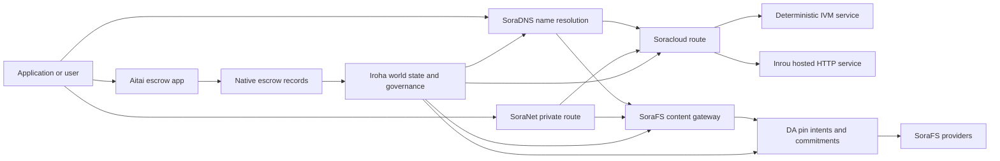

# SORA Nexus Servicios {#sora-nexus-services}

SORA Nexus agrega planos de servicio orientados a la aplicación alrededor de Iroha 3. Estos servicios no son libros mayores de blockchain separados. Están anclados por el estado mundial de Iroha, los manifiestos técnicos de Norito, los registros de gobernanza y las familias de rutas de Torii.

La disponibilidad depende de la compilación del nodo y del perfil de red. Use [`/openapi.json`](/es/reference/torii-endpoints.md#app-and-sora-route-families) para descubrir las rutas generadas de la API de aplicaciones en el nodo de destino. Las rutas públicas para CID locales de SoraFS y las rutas conocidas se publican fuera de ese documento generado; compruébelas directamente al verificar un despliegue.

## Mapa de componentes {#component-map}

|Componente|Rol|Superficies principales|
| ---------------------- | ------------------------------------------------------------------------------------------------------------------------------------------- | ---------------------------------------------------------------------------------------- |
| Soracloud              |Despliegue de aplicaciones, servicios alojados, estado privado del modelo/tiempo de ejecución y control del ciclo de vida del servicio.| `/v1/soracloud/*`, `/api/*`, `iroha soracloud service ...`                                   |
|Inrou|Entorno de ejecución HTTP alojado de Soracloud para revisiones de servicios que necesitan un plano HTTP activo.|Configuración del entorno de ejecución de Soracloud, anuncios de capacidad del host y estado de ejecución de las réplicas|
| SoraNet                |Privacidad y superposición de transporte para circuitos, tráfico de relevo, VPN, sesiones de conexión y rutas de transmisión.| `/v1/connect/*`, `/v1/vpn/*`, SoraNet metadatos de ruta                                     |
|Disponibilidad de Datos (DA)|Evidencia de disponibilidad, compromiso y capa de intención de fijación para cargas útiles que son referenciadas por carriles de ejecución Nexus, manifiestos técnicos SoraFS y flujos de prueba.| `/v1/da/*`, `FindDaPinIntent*`, `[nexus.da]`                                             |
| SoraFS                 |Tejido de almacenamiento dirigido por contenido para manifiestos técnicos, cargas CAR, contenido fijado, recuperaciones de puerta de enlace y flujos de prueba de recuperabilidad.| `/v1/sorafs/*`, `/sorafs/*`, `FindSorafsProviderOwner`                                   |
| SoraDNS                |Capa de nomenclatura determinista y de atestación de resolutor para servicios y contenido alojados en SORA.| `/v1/soradns/*`, `/soradns/*`, resolver eventos del directorio |
|Aitai|Corredor de liquidación de activos y moneda fiduciaria de la aplicación, respaldado por registros nativos de depósito en garantía, no por un libro mayor separado.|`OpenAssetEscrow`, `FindAssetEscrow*`, `EscrowEventFilter` y funciones integradas `escrow_*` de Kotodama|



## Flujos Comunes {#common-flows}

### Aplicación Dividida Alojada {#hosted-split-application}

Una aplicación de plano mixto típica utiliza todas las piezas juntas:

1. Los activos estáticos del frontend se empaquetan y se fijan a través de SoraFS.
2. El anfitrión público, por ejemplo `<app>.sora`, está registrado a través de SoraDNS.
3. Soracloud enruta `/api/v1/search` o `/api/v1/stream` a un servicio Inrou HTTP.
4. Soracloud enruta `/api/auth` y `/api/v1/user` a manejadores deterministas IVM.
5. Los clientes que necesitan privacidad pueden acceder al mismo contenido o a la ruta API a través de un circuito SoraNet.

|Ruta|Plano de respaldo|Por qué|
| ----------------- | --------------------- | ------------------------------------------------- |
| `/`               | SoraFS contenido estático |Caché de raíz de contenido reproducible y de puerta de enlace|
| `/assets/*`       | SoraFS contenido estático |Activos direccionados por contenido y pruebas del manifiesto técnico|
| `/api/auth*`      | Soracloud IVM         |Estado de desafío de autenticación y billetera seguro contra repetición|
| `/api/v1/user*`   | Soracloud IVM         |Mutaciones estatales sensibles a la gobernanza|
| `/api/v1/search*` | Soracloud Inrou       |Estado en vivo HTTP del servicio, caché, SSE o colector|

### Publicación de contenido {#content-publication}

SoraFS la publicación produce artefactos duraderos antes de que un nombre los señale:

1. Construir una carga útil o directorio.
2. Empáquelo en un archivo CAR y planifique en fragmentos.
3. Construya un manifiesto técnico Norito con política de pines y datos de gobernanza.
4. Envíe el manifiesto técnico a Torii.
5. Registre una intención de pin DA o un compromiso de disponibilidad cuando el perfil objetivo requiera evidencia explícita.
6. Vincula el manifiesto técnico a un nombre SoraDNS o a una ruta de frontend estática Soracloud.

### Ruta de Obtención Privada o de Transmisión {#private-fetch-or-streaming-route}

SoraNet puede situarse delante de SoraFS o Soracloud:

1. El cliente resuelve el nombre o el manifiesto técnico.
2. Un directorio de guardias o manifiesto técnico de ruta elige los relés de entrada y salida.
3. El tráfico se rellena y se envía a través del circuito SoraNet.
4. El relé de salida alcanza la puerta de enlace SoraFS, la transmisión Torii o la ruta Soracloud.

## Aitai {#aitai}

Aitai es el corredor de aplicaciones SORA para liquidaciones de mercado en las que un comprador y un vendedor coordinan un pago fuera de la cadena mientras Iroha mantiene la custodia de los activos en la cadena. Para los nuevos flujos de custodia de activos numéricos, use la familia de instrucciones de custodia nativas en lugar de una cuenta de custodia controlada por un contrato.

El depósito en garantía nativo mantiene la custodia en el libro mayor de la blockchain. El vendedor abre una oferta con `OpenAssetEscrow`, el comprador acepta y marca el pago fuera de la cadena con `AcceptAssetEscrow` y `MarkEscrowPaymentSent`, y el vendedor libera con `ReleaseAssetEscrow` o cancela antes de que se marque el pago. Si el comprador y el vendedor no están de acuerdo, cualquiera de las partes puede abrir una disputa y un resolutor con `CanResolveEscrowDispute` puede dividir el monto bloqueado.

Para el ciclo de vida completo, bloqueos de activos genéricos, depósito en garantía anónimo, consultas, eventos y ejemplos Rust, consulte [Custodia de Activos Nativos](/es/blockchain/escrow.md).

|Superficie Aitai|Úsalo para|
| ------------------------------------------------------------------------------------------------------------------------------------------------------------- | ----------------------------------------------------------------------------------------- |
| `OpenAssetEscrow`, `AcceptAssetEscrow`, `MarkEscrowPaymentSent`, `ReleaseAssetEscrow`, `CancelAssetEscrow`                                                    |Ofertas de activos numéricos transparentes, incluidos los flujos de liquidación denominados en XOR.|
| `OpenAnonymousAssetEscrow`, `AcceptAnonymousAssetEscrow`, `MarkAnonymousEscrowPaymentSent`, `ReleaseAnonymousAssetEscrow`, `CancelAnonymousAssetEscrow`       |Las ofertas protegidas usan adjuntos de prueba para movimientos de financiamiento y cierre.|
| `OpenEscrowDispute`, `ResolveEscrowDispute`, `OpenAnonymousEscrowDispute`, `ResolveAnonymousEscrowDispute`                                                    |Entrada de disputa y resolución al estilo judicial.|
| `FindAssetEscrowById`, `FindAssetEscrowsBySeller`, `FindAssetEscrowsByBuyer`, `FindAssetEscrowsByStatus` |Páginas de estado de la aplicación, trabajos de conciliación y herramientas de soporte.|
| `EscrowEventFilter` |Suscripciones de depósito en garantía en vivo por ID de depósito, vendedor, comprador, estado o tipo de evento.|
| Kotodama `escrow_open_offer`, `escrow_accept`, `escrow_mark_payment_sent`, `escrow_release`, `escrow_cancel`, `escrow_open_dispute`, `escrow_resolve_dispute` | Kotodama contratos llaman respaldados por los V1 syscalls de depósito en garantía. |

Para el uso público Taira o Minamoto, trata la vía de pago fuera de la cadena y cualquier flujo de trabajo de soporte o judicial como política de aplicación. Iroha registra el estado de custodia, los eventos del ciclo de vida, los hashes criptográficos de evidencia y el movimiento final de activos; no verifica la liquidación en moneda fiduciaria por sí mismo.

## Verificar un nodo objetivo {#check-a-target-node}

Antes de usar ejemplos de esta página, confirme que la familia de rutas existe en el nodo al que se está dirigiendo:

```bash
export TORII_URL=https://taira.sora.org

curl -fsS "$TORII_URL/openapi.json" \
  | jq '.paths | keys[] | select(test("^/v1/(soracloud|sorafs|soradns|connect|vpn|da)/"))'

curl -fsS -H 'Accept: application/json' "$TORII_URL/status" | jq .
```

`/openapi.json` es el endpoint canónico OpenAPI API. La disponibilidad exacta de la ruta depende de las características de la construcción y la configuración de la red. El documento no enumera las rutas públicas locales SoraFS CID y las rutas conocidas; consulte esos endpoints API directamente como se describe a continuación.

### Taira Verificaciones de humo solo de lectura {#taira-read-only-smoke-checks}

El endpoint público Taira API es útil para verificaciones del lado de lectura, pero no lo use para ejemplos de mutación a menos que esté operando una cuenta autorizada y tenga la intención de cambiar el estado de la testnet pública.

```bash
export TORII_URL=https://taira.sora.org

curl -fsS -H 'Accept: application/json' "$TORII_URL/status" \
  | jq '{version: .build.version, peers, blocks, lanes: (.teu_lane_commit | length)}'

curl -fsS "$TORII_URL/v1/vpn/profile" \
  | jq '{available, relay_endpoint, supported_exit_classes}'

curl -fsS "$TORII_URL/v1/sorafs/storage/peers?limit=4" \
  | jq '{gateway_base_url, pin_torii_urls}'

curl -fsS -H 'Accept: application/json' "$TORII_URL/v1/soracloud/status" \
  | jq '.control_plane | {service_count, services: [.services[] | {service_name, current_version}]}'
```

Taira puede exponer rutas del plano de control específicas de la implementación que no están listadas en el mapa de rutas OpenAPI. Trate `/openapi.json` como el contrato generado para las rutas que contiene, luego confirme las rutas específicas de la implementación y las rutas locales públicas SoraFS directamente antes de documentarlas como disponibles.

## Soracloud {#soracloud}

Soracloud es el plano de control de aplicaciones de SORA. Rastrea paquetes de implementación, revisiones de servicios, enrutamiento, estado de despliegue, entradas de configuración autorizadas, secretos de servicio encriptados, registros del registro de modelos, sesiones de inferencia privadas y registros de resultados del protocolo de ejecución de software.

Soracloud utiliza dos planos de ejecución:

|Plano de ejecución|entorno de ejecución de software|Úsalo para|
| ---------------------- | ------- | -------------------------------------------------------------------------------------------- |
| `DeterministicService` | `Ivm`   |Autenticación, estado de la bóveda, lecturas certificadas, manejadores de buzón ordenados, mutaciones sensibles a la gobernanza|
| `HttpService`          | `Inrou` |En vivo HTTP APIs, trabajo pesado de colectores, servicios respaldados por caché, SSE, flujos asistidos por navegador|

El plano de control es autoritativo. Los comandos de despliegue, actualización, reversión, configuración, secreto, modelo y estado se envían a través de Torii y leen el estado del mundo confirmado; no dependen de un espejo local separado CLI. El enrutamiento público se basa en el prefijo más largo, por lo que un host registrado puede dividir el tráfico entre rutas alojadas HTTP y rutas deterministas API.

### estructura inicial generada para una aplicación dividida {#scaffold-a-split-app}

La plantilla de aplicación dividida crea un frontend estático más un API en vivo alojado y un servicio determinista de vault/API:

```bash
iroha soracloud app init \
  --template split-app \
  --app-name solswap_indexer \
  --app-version 0.1.0 \
  --public-host solswap-indexer.sora \
  --output-dir ./apps/solswap-indexer

iroha soracloud app plan \
  --manifest ./apps/solswap-indexer/app_manifest.json

iroha soracloud app doctor \
  --manifest ./apps/solswap-indexer/app_manifest.json
```

`plan` imprime la división de la ruta, los manifiestos técnicos del servicio hijo, las rutas de los scripts del espacio de trabajo y el modo de publicación esperado en el frontend. `doctor` valida el contrato de lanzamiento local antes de que involucres a Torii.

### Desplegar e Inspeccionar el Estado de la Aplicación {#deploy-and-inspect-app-state}

Reutilice una futura época de retención SoraFS por cada reintento del lanzamiento. Dado que la plantilla de aplicación dividida contiene un servicio Inrou, califique su artefacto exacto en los almacenes de proveedores fuera de línea seleccionados antes de la mutación en línea:

```bash
export SORACLOUD_TORII_URL=https://<soracloud-enabled-torii>
export SORAFS_RETENTION_EPOCH=<future-unix-seconds>

iroha soracloud app preseed \
  --manifest ./apps/solswap-indexer/app_manifest.json \
  --sorafs-retention-epoch "$SORAFS_RETENTION_EPOCH" \
  --inrou-preseed-target <validator-account,peer-id,absolute-store-path> \
  --inrou-preseed-max-capacity-bytes <bytes> \
  --inrou-preseed-helper /absolute/path/to/sorafs-node \
  --inrou-preseed-helper-sha256 <lowercase-sha256> \
  --receipt-out /absolute/path/to/solswap-inrou-preseed.json

iroha soracloud app release \
  --manifest ./apps/solswap-indexer/app_manifest.json \
  --sorafs-retention-epoch "$SORAFS_RETENTION_EPOCH" \
  --inrou-preseed-receipt /absolute/path/to/solswap-inrou-preseed.json \
  --torii-url "$SORACLOUD_TORII_URL"

iroha soracloud app status \
  --manifest ./apps/solswap-indexer/app_manifest.json \
  --torii-url "$SORACLOUD_TORII_URL"
```

Repite `--inrou-preseed-target` para cada tienda de proveedor requerida por la política de despliegue. `release` construye y sincroniza los manifiestos técnicos, ejecuta el doctor de la aplicación, presenta una mutación canónica de la infraestructura de la aplicación, reconcilia el estado autoritativo y verifica los objetivos en vivo declarados. Un registro de resultado del protocolo presemilla no es opcional cuando la aplicación contiene artefactos Inrou.

Para un servicio ya implementado, utilice comandos específicos del servicio:

```bash
iroha soracloud service status \
  --service-name solswap_indexer_live \
  --torii-url "$SORACLOUD_TORII_URL"

iroha soracloud service rollback \
  --service-name solswap_indexer_live \
  --target-version 0.1.0 \
  --torii-url "$SORACLOUD_TORII_URL"
```

### Configuración y Material Secreto {#config-and-secret-material}

Soracloud Las entradas de configuración y secretos son parte del estado de implementación autorizado. La implementación, actualización y reversión fallan de manera cerrada cuando los enlaces de configuración o secretos requeridos faltan o son inconsistentes con los manifiestos técnicos activos.

```bash
iroha soracloud service config-set \
  --service-name solswap_indexer_live \
  --config-name indexer/public_config \
  --value-file ./config/public-config.json \
  --torii-url "$SORACLOUD_TORII_URL"

iroha soracloud service secret-set \
  --service-name solswap_indexer_live \
  --secret-name indexer/api_key \
  --secret-file ./secrets/api-key.envelope.json \
  --torii-url "$SORACLOUD_TORII_URL"
```

Utilice la ayuda de CLI para conocer las banderas de credenciales exactas requeridas por su perfil:

```bash
iroha soracloud service config-set --help
iroha soracloud service secret-set --help
```

## Inrou {#inrou}

Inrou es el entorno de ejecución de software alojado HTTP utilizado por Soracloud. Un nodo Iroha con el entorno de ejecución de software integrado Soracloud proyecta el estado admitido Soracloud en un plan de materialización local, inicia réplicas de servicios alojados asignadas como servicios de retorno en bucle y reporta el estado de ejecución del software de la réplica de nuevo en el modelo autorizado.

Usa Inrou para cargas de trabajo que necesiten una superficie HTTP en vivo, como flujos APIs, SSE con muchos recolectores, manejadores respaldados por caché o servicios asistidos por navegador.

### Requisitos de ejecución del software {#runtime-requirements}

- El tiempo de ejecución del software del manifiesto técnico del contenedor debe ser `Inrou`.
- El plano de ejecución del manifiesto técnico del servicio debe ser `HttpService`.
- `HttpService + Inrou` requiere exactamente un `PersistentRootLeaseVolume` montado en `/`.
- Los servicios Inrou replicados también necesitan almacenamiento de servicio compartido o arrendamiento confidencial cuando conservan un estado compartido mutable.
- Los nodos de alojamiento de producción deberían anunciar la capacidad real de Inrou en lugar de operar solo como un proxy.

### Fragmento de manifiesto técnico {#manifest-fragment}

El ejemplo a continuación muestra la forma de los dos manifiestos técnicos. Es un fragmento, no un paquete de implementación completo.

```jsonc
// container_manifest.json
{
  "schema_version": 1,
  "runtime": { "runtime": "Inrou", "value": null },
  "bundle_path": "/bundles/solswap-indexer.inrou",
  "entrypoint": "/app/bin/launch-indexer.sh",
  "args": [],
  "env": {
    "RUST_LOG": "info",
  },
  "inrou": {
    "schema_version": 1,
    "guest_os": { "guest_os": "DebianSlim", "value": null },
    "guest_images": {
      "x86_64": {
        "kernel_image_path": "/inrou/x86_64/vmlinux",
        "rootfs_image_path": "/inrou/x86_64/rootfs.ext4",
        "initrd_image_path": null,
      },
      "aarch64": {
        "kernel_image_path": "/inrou/aarch64/vmlinux",
        "rootfs_image_path": "/inrou/aarch64/rootfs.ext4",
        "initrd_image_path": null,
      },
    },
  },
  "lifecycle": {
    "start_grace_secs": 60,
    "stop_grace_secs": 30,
    "healthcheck_path": "/api/indexer/v1/health",
  },
}
```

```jsonc
// service_manifest.json
{
  "schema_version": 1,
  "service_name": "solswap_indexer_live",
  "service_version": "0.1.0",
  "execution_plane": { "execution_plane": "HttpService", "value": null },
  "replicas": 2,
  "route": {
    "host": "solswap-indexer.sora",
    "path_prefix": "/api/v1/search",
    "service_port": 8080,
    "visibility": { "visibility": "Public", "value": null },
    "tls_mode": { "tls": "Required", "value": null },
  },
  "lease_volumes": [
    {
      "volume_name": "root_disk",
      "kind": {
        "lease_volume": "PersistentRootLeaseVolume",
        "value": null,
      },
      "storage_class": { "storage_class": "Warm", "value": null },
      "mount_path": "/",
      "max_total_bytes": 8589934592,
    },
    {
      "volume_name": "index_state",
      "kind": { "lease_volume": "ServiceLeaseVolume", "value": null },
      "storage_class": { "storage_class": "Warm", "value": null },
      "mount_path": "/var/lib/solswap-indexer",
      "max_total_bytes": 1073741824,
    },
  ],
}
```

En tiempo de ejecución del software, cada volumen de arrendamiento montado se expone a través de variables de entorno derivadas del nombre del volumen:

```text
SORACLOUD_LEASE_VOLUME_ROOT_DISK_DIR
SORACLOUD_LEASE_VOLUME_ROOT_DISK_MOUNT_PATH
SORACLOUD_LEASE_VOLUME_INDEX_STATE_DIR
SORACLOUD_LEASE_VOLUME_INDEX_STATE_MOUNT_PATH
```

## SoraNet {#soranet}

SoraNet es la capa de privacidad y transporte. Proporciona rutas basadas en relés para el tráfico que no debería conectarse directamente con la puerta de enlace o el servicio destino. El diseño de transporte utiliza roles de relé de entrada, medio y salida, transporte QUIC, un apretón de manos híbrido basado en ruido, negociación de capacidades, metadatos del directorio de relés y celdas de tamaño fijo con relleno.

En los despliegues Nexus, SoraNet puede manejar recuperaciones de contenido, tráfico de puerta de enlace, VPN o sesiones de Connect, y rutas de transmisión Norito. Las entradas del directorio pueden marcar relés que soporten `norito-stream`, lo que permite a los clientes preferir rutas adecuadas para Torii RPC o tráfico de transmisión.

### Configuración de transmisión {#streaming-configuration}

El perfil Nexus habilita el aprovisionamiento SoraNet para rutas de transmisión:

```toml
[streaming]
feature_bits = 0b11

[streaming.soranet]
enabled = true
exit_multiaddr = "/dns/torii/udp/9443/quic"
padding_budget_ms = 25
access_kind = "authenticated"
provision_spool_dir = "./storage/streaming/soranet_routes"
provision_spool_max_bytes = 0
provision_window_segments = 4
provision_queue_capacity = 256
```

Use `access_kind = "read-only"` para rutas de contenido que no requieren autenticación del espectador. Use `authenticated` cuando el relé de salida deba hacer cumplir tickets o la identidad del espectador antes de conectar con Torii o un servicio alojado.

### SoraNet-Consciente SoraFS Obtener {#soranet-aware-sorafs-fetch}

El SoraFS fetch CLI puede emitir un manifiesto técnico de proxy local y almacenar en cola SoraNet metadatos de rutas para extensiones de navegador o SDK adaptadores. El orquestador JSON debe definir `local_proxy` con `"emit_browser_manifest": true`, y el CLI debe construirse con soporte `local-quic-proxy`. En Taira, inspeccione el catálogo de proveedores admitidos en la raíz de la red de prueba pública, luego complete la tupla de proveedor protegido emitida para ese proveedor:

```bash
export TAIRA_ROOT=https://taira.sora.org
curl -fsS "$TAIRA_ROOT/v1/sorafs/providers?limit=20" | jq '.providers'

: "${TAIRA_SORAFS_PROVIDER_ID:?set the admitted provider ID from Taira discovery}"
: "${TAIRA_SORAFS_GATEWAY_KEY:?set the provider gateway key}"
: "${TAIRA_SORAFS_PROVIDER_URL:?set the advertised provider base URL}"
: "${TAIRA_SORAFS_STREAM_TOKEN_FILE:?set the issued stream-token file}"

cargo run -p sorafs_orchestrator --features=local-quic-proxy --bin=sorafs_cli -- \
  fetch \
  --plan=artifacts/payload_plan.json \
  --manifest-id=<manifest-digest-hex> \
  --orchestrator-config=artifacts/orchestrator.json \
  --provider=name=taira,provider-id="$TAIRA_SORAFS_PROVIDER_ID",gateway-key="$TAIRA_SORAFS_GATEWAY_KEY",base-url="$TAIRA_SORAFS_PROVIDER_URL",stream-token="$(cat "$TAIRA_SORAFS_STREAM_TOKEN_FILE")" \
  --output=artifacts/payload.bin \
  --json-out=artifacts/fetch_summary.json \
  --local-proxy-manifest-out=artifacts/proxy_manifest.json \
  --local-proxy-mode=bridge \
  --local-proxy-norito-spool=storage/streaming/soranet_routes \
  --local-proxy-kaigi-spool=storage/streaming/soranet_routes \
  --local-proxy-kaigi-policy=authenticated \
  --max-peers=2 \
  --retry-budget=4
```

El proveedor de registros de resumen informa, los registros de resultados del protocolo de fragmentos, los metadatos del proxy local y la configuración de ruta efectiva utilizada para la obtención.

### Listado del Verificador de Incentivos de Relevo {#relay-incentive-verifier-roster}

La ingestión de incentivos de retransmisión falla en cerrado. Cuando `incentives.enable` es verdadero, `incentives.trusted_verifier_ids` debe contener al menos un ID de cuenta canónica. La lista nunca debe exceder de 64 entradas, incluso mientras los incentivos están desactivados. El tiempo de ejecución del software lo almacena como un conjunto ordenado determinista y rechaza la geometría de lista inválida durante el arranque del relé.

Cada `RelayBandwidthProofV1` se descodifica bajo un presupuesto fijo de marco/asignación y debe consumir el marco completo. La cuenta del verificador de la prueba debe estar presente en la lista configurada, y `RelayBandwidthProofV1::verify_signature()` debe tener éxito, antes de que el relé bloquee o cambie su acumulador de rendimiento. Un firmante criptográfico no confiable o una prueba con firma inválida/manipulada, por lo tanto, no contribuye con ninguna medición y no puede producir un resumen de incentivos.

## Disponibilidad de Datos (DA) {#data-availability-da}

DA es la capa de evidencia de disponibilidad para cargas útiles que son demasiado grandes, demasiado sensibles en cuanto a privacidad o demasiado específicas del servicio para colocarlas directamente en el estado del mundo. Registra compromisos deterministas y obligaciones de recuperación para que los validadores, gateways y clientes puedan acordar qué bytes fueron prometidos, qué política se aplica y qué evidencia ha sido observada.

DA no reemplaza a Kura o SoraFS:

- Kura almacena el flujo de bloques finalizado y los datos de recuperación de consenso.
- SoraFS almacena y sirve bytes direccionados por contenido, CAR cargas útiles y manifiestos técnicos.
- DA registra compromisos, políticas de prueba, aperturas de prueba e intenciones de pin que permiten que esos bytes sean programados, auditados y vinculados de vuelta al estado del libro mayor de blockchain.

Use DA cuando una aplicación o un carril de ejecución Nexus necesite una promesa visible en el libro mayor de que los datos fuera de la cadena permanezcan recuperables. Ejemplos comunes incluyen compromisos de carga útil del carril de ejecución para flujos de liquidación, intenciones de fijación SoraFS para contenido publicado, paquetes de prueba que deben conservarse para una verificación posterior, y artefactos de aplicación cuyo estado público debe ser un valor de resumen criptográfico en lugar de la carga completa.

### Ciclo de vida {#lifecycle}

|Escenario|Qué está registrado|
| ---------- | ----------------------------------------------------------------------------------------------------------------------------------------------------- |
|Intención|Un boleto, referencia de manifiesto técnico, alias, referencia de carril/época/secuencia, política de retención o destino de replicación.|
|Compromiso|Material de resumen que vincula el manifiesto, la carga útil de la vía, el paquete de pruebas o la raíz de contenido con el registro visible en el registro distribuido.|
|Evidencia|Votos de disponibilidad, aperturas de prueba, certificaciones de proveedores u otras pruebas específicas del perfil aceptadas por la red objetivo.|
|Consulta|Búsquedas de intención de pines a través de `FindDaPinIntentByTicket`, `FindDaPinIntentByManifest`, `FindDaPinIntentByAlias` o `FindDaPinIntentByLaneEpochSequence`.|

Un flujo de publicación típico respaldado por DA es:

1. Construya o reciba la carga útil fuera del WSV, por ejemplo un archivo SoraFS CAR o la carga útil de la vía de ejecución Nexus.
2. hash criptográfico y describir la carga útil en un manifiesto técnico Norito o en un registro de compromiso específico de ruta.
3. Envíe el manifiesto técnico, la intención de pin o el compromiso a través de `/v1/da/*` cuando esa familia de rutas esté habilitada, o a través de la ruta de transacción firmada de la red.
4. Permita que los validadores o proveedores de disponibilidad recopilen la evidencia requerida por la política de prueba activa.
5. Consulta la intención o compromiso del pin resultante antes de promover un alias, prueba de liquidación o ruta de puerta de enlace que dependa de la carga útil.

### Modelo Algorítmico {#algorithmic-model}

DA convierte una carga útil en un compromiso firmado, protegido contra repetición e indexado por bloques. Los algoritmos importantes son deterministas, por lo que los validadores y las puertas de enlace pueden recalcular los mismos resúmenes criptográficos a partir de los mismos bytes.

1. Normalice la carga enviada en forma canónica. Torii acepta una solicitud de ingestión con `(lane_id, epoch, sequence)`, bytes de la carga, metadatos de compresión, tamaño de fragmento, perfil de borrado, política de retención y firma del remitente. El nodo descomprime cargas útiles gzip, deflate o Zstandard cuando se solicita, y luego verifica que la longitud en bytes canónica sea igual a `total_size`.
2. Validar los parámetros de la vía de ejecución y del fragmento. La vía de ejecución debe existir en el catálogo de vías de ejecución Nexus. `chunk_size` debe ser una potencia de dos diferente de cero, de al menos dos bytes. y no mayor que el máximo configurado. El perfil de borrado debe incluir fragmentos de datos y al menos dos fragmentos de paridad. El catálogo de carriles de ejecución selecciona el esquema de prueba, ya sea `merkle_sha256` o `kzg_bls12_381`.
3. Aplicar la política de red. El nodo aplica la línea base de replicación y retención configurada para la clase de blobs. Los metadatos públicos deben permanecer en texto claro; los metadatos solo de gobernanza se cifran con la clave de metadatos de gobernanza configurada del nodo antes de ser escritos en el manifiesto técnico.
4. Fragmentar y comprometer. La carga útil canónica se fragmenta con un perfil de tamaño fijo derivado de `chunk_size`. Torii calcula el valor del digest criptográfico de la carga útil, la raíz del árbol de prueba de recuperabilidad y los compromisos por fragmento. Los fragmentos de datos llevan compromisos BLAKE3 sobre sus bytes.
5. Agregar compromisos de borrado. Los fragmentos se agrupan en franjas de `data_shards`. Las celdas faltantes en la última franja se rellenan con ceros para el cálculo de paridad. La paridad RS(16) crea fragmentos de paridad fila/global; opcional `row_parity_stripes` agregar paridad al estilo de columna a través de la matriz. Los compromisos de fragmentos de paridad son BLAKE3 resúmenes criptográficos de símbolos `u16` en little-endian.
6. Construya el manifiesto técnico. `DaManifestV1` registra la pista de ejecución, la época, la clase de blob, el códec, el valor del resumen criptográfico de la carga útil, la raíz del fragmento, el tamaño del fragmento, el perfil de borrado, la política de retención, la cotización de alquiler, los compromisos de fragmentos, el compromiso opcional IPA, los metadatos y la hora de emisión. El ticket de almacenamiento es determinista: el nodo primero realiza un hash criptográfico de una plantilla de manifiesto técnico con un ticket vacío, luego escribe esa huella de nuevo como el `storage_ticket` final.
7. Rechazar conflictos de repetición. La clave de repetición es `(lane_id, epoch, sequence, manifest_fingerprint)`. Un duplicado con la misma huella digital es idempotente. Una secuencia obsoleta o la misma secuencia con una huella digital diferente es rechazada.
8. Emitir artefactos firmados. Torii calcula un compromiso PDP, firma un `DaIngestReceipt`, construye un `DaCommitmentRecord`, y escribe artefactos en el búfer para el manifiesto técnico, compromiso PDP, registro de compromiso, calendario de compromiso, intención de PIN, archivo de registro de resultados del protocolo y registro de resultados del protocolo. El cursor del registro de resultados del protocolo avanza de manera monótona según `(lane_id, epoch)`.

Los registros de compromiso son lo que contienen los bloques. Un registro vincula:

- carril de ejecución, época y secuencia
- ID de blob del llamador y hash criptográfico del manifiesto técnico canónico
- esquema de prueba de carril de ejecución
- raíz de trozo
- compromiso opcional KZG para carriles de ejecución KZG
- PDP/valor de resumen criptográfico de prueba
- clase de retención y ticket de almacenamiento
- Torii DA firma de acuse de recibo

Antes de que un bloque inserte DA registros, la ruta de ensamblaje del bloque valida el paquete:

- `(lane_id, epoch, sequence)` debe ser único dentro del paquete.
- Los hashes criptográficos del manifiesto técnico deben ser distintos de cero y únicos dentro del paquete.
- El esquema de prueba de compromiso debe coincidir con la política de la vía de ejecución configurada.
- Las vías Merkle rechazan los compromisos KZG; las vías KZG exigen un compromiso KZG distinto de cero.
- Los intentos de fijación se normalizan, ordenan y filtran por carril, hash del manifiesto, ticket de almacenamiento, cuenta propietaria y reglas de colisión de alias.

El encabezado del bloque almacena hashes criptográficos para las políticas de prueba DA, compromisos e intenciones de pin. Para pruebas de membresía, el paquete de compromisos también expone una raíz de Merkle cuyas hojas son Hashes criptográficos de valores `DaCommitmentRecord` codificados Norito canónicos. Los nodos padre hacen hash criptográfico de la concatenación de los hijos izquierdo y derecho; una hoja impar se promociona sin cambios a la siguiente capa.

### Verificación de prueba {#proof-verification}

`/v1/da/commitments/prove` puede producir una prueba para un compromiso en un bloque. La prueba contiene el compromiso, la altura del bloque, el índice en el paquete, el hash criptográfico del paquete, la longitud del paquete, la raíz de Merkle y la ruta de hermanos. La verificación comprueba:

1. El hash criptográfico del paquete de prueba coincide con el hash criptográfico del compromiso DA del encabezado del bloque.
2. La altura del bloque de prueba coincide con el encabezado del bloque referenciado.
3. El índice está dentro de los límites y el compromiso es igual a la entrada del paquete en ese índice.
4. La política de prueba de la vía de ejecución acepta el compromiso.
5. Plegar la ruta de los hermanos desde la hoja del compromiso reconstruye la raíz suministrada.
6. La raíz reconstruida es igual a la raíz del conjunto.

Esto demuestra que se incluyó un compromiso de disponibilidad específico en una carga útil de bloque específica; no demuestra que cada réplica esté actualmente en línea. La recuperabilidad en vivo se verifica por separado a través de las recopilaciones del proveedor SoraFS, las comprobaciones PDP/PoTR, o la evidencia de disponibilidad específica del perfil.

### Interacción de consenso {#consensus-interaction}

La disponibilidad de la carga útil de consenso es obligatoria, pero no es un protocolo de segunda finalidad. El líder transmite un `PayloadManifest` firmado al comité completo de `3f + 1`. El primer cuerpo y la ocurrencia del fragmento RS16 apuntan al Conjunto A, cuyos miembros `2f + 1` incluyen al líder y la cola proxy. Una retransmisión limitada en la misma vista expande el servicio de cuerpo y fragmento a todo el comité.

Un manifiesto técnico o un conjunto parcial de fragmentos no es suficiente para votar. Antes de Preparar, cada validador debe autenticar los fragmentos, reconstruir el cuerpo canónico completo, verificar su longitud, hash criptográfico de raíz de fragmento y de cuerpo, persiste ese cuerpo y finaliza la validación determinista del bloque. El validador retiene el cuerpo exacto a través de la aplicación CommitQC o recuperación certificada.

Cuando un par de red aprende un certificado antes de tener el cuerpo, primero solicita fragmentos autenticados o el cuerpo canónico a los firmantes criptográficos del certificado, luego amplía la recuperación al comité congelado. Cada respuesta permanece vinculada al contexto de altura exacta, la ronda de propuestas, el manifiesto técnico y el sujeto del cuerpo. El bloque se aplica solo después de que el cuerpo reconstruido localmente coincida con el certificado.

### Notas del operador {#operator-notes}

Iroha 3 los perfiles de consenso siempre incluyen manifiesto técnico firmado y RS16 difusión de la carga útil, validación de cuerpo completo antes de Prepare, DA validación del paquete y telemetría de recuperación acotada. El diseño y los límites del protocolo están congelados en el contexto de altura firmado; no existe un perfil local de cambio o tiempo de espera que pueda deshabilitarlos o redefinirlos. Los límites de bloques y colas locales del nodo aún deben ajustarse al diseño firmado y a la carga de trabajo del despliegue.

Para el descubrimiento de rutas, comience con el documento OpenAPI del nodo:

```bash
curl -fsS "$TORII_URL/openapi.json" \
  | jq '.paths | keys[] | select(startswith("/v1/da/"))'
```

Use el [referencia de consulta](/es/reference/queries.md#nexus-data-availability-and-packages) para los nombres de consulta actuales DA, y el [plantilla de configuración de par de red](/es/reference/peer-config/) para los límites de ingestión, muestreo, auditoría y recuperación a nivel de aplicación `[nexus.da]`, además de los límites locales de bloque y cola Sumeragi.

## SoraFS {#sorafs}

SoraFS es la estructura de almacenamiento descentralizado direccionado por contenido. Empaqueta bytes en fragmentos deterministas, archivos CAR y manifiestos técnicos Norito que vinculan raíces de contenido, perfiles de fragmentación, políticas de fijación y atestaciones de gobernanza. Los proveedores de almacenamiento publicitan la capacidad y la disponibilidad de contenido, mientras que las pasarelas verifican manifiestos técnicos y compromisos de fragmentos antes de servir el contenido.

típica SoraFS los usos incluyen activos de aplicaciones estáticas, compilaciones de documentación, zona paquetes, referencias de modelos o artefactos y paquetes de evidencia de gobernanza. El Iroha el modelo de datos expone SoraFS eventos de puerta de enlace y un [`FindSorafsProviderOwner`](/es/reference/queries.md#nexus-data-availability-and-packages) consulta para la resolución de propiedad del proveedor.

### Taira Perfil de Testnet {#taira-testnet-profile}

Taira es la red de prueba pública canónica SoraFS. Su perfil de validador registrado utiliza la cadena `fc56984b-2be7-431d-840e-21514d1883f0` y el discriminante de cadena `369`. El `NetworkId` a continuación es la identidad exacta del génesis de la cadena de bloques Taira actual fijada. Un reinicio de Taira puede cambiar ese hash criptográfico mientras se mantiene la etiqueta de la cadena, así que actualízalo desde el perfil de implementación firmado actual y nunca lo derives de la cadena UUID. Los ajustes efectivos de Taira en SoraFS son:

- ID de red: `hash:82531CE8EAE8BFF6BEECA4698BFD13A3BC8BEC5F0EE0D23D428C97FC17AB0F3B#3E94`
- base de puerta de enlace URL: `https://taira.sora.org`
- pin Torii URLs: `https://taira-validator-1.sora.org` a través de `https://taira-validator-4.sora.org`
- capacidades de descubrimiento: `torii_gateway`, `chunk_range_fetch` y `potr_mldsa`
- origen de contenido aislado: `https://{cid}.sorafs.taira.sora.org/{path}`
- política de pin público: sin permisos y con tarifa, con `require_council_signatures = false`

```toml
[sorafs.storage]
enabled = false
max_capacity_bytes = 13743895347

[sorafs.discovery]
discovery_enabled = true
known_capabilities = ["torii_gateway", "chunk_range_fetch", "potr_mldsa"]

[sorafs.discovery.admission]
envelopes_dir = "configs/soranexus/taira/sorafs_admission"
trusted_council_keys = ["REPLACE_WITH_TAIRA_SORAFS_COUNCIL_PUBLIC_KEY"]
signature_threshold = "REPLACE_WITH_TAIRA_SORAFS_COUNCIL_SIGNATURE_THRESHOLD"

[sorafs.discovery.publish]
gateway_base_url = "https://taira.sora.org"
pin_torii_urls = [
  "https://taira-validator-1.sora.org",
  "https://taira-validator-2.sora.org",
  "https://taira-validator-3.sora.org",
  "https://taira-validator-4.sora.org",
]

[sorafs.gateway]
require_manifest_envelope = true
enforce_admission = true
enforce_capabilities = true

[sorafs.gateway.untrusted_hosting]
enabled = true
path_gateway_redirect = true
redirect_html_only = true

[sorafs.gateway.untrusted_hosting.cid_host_suffixes]
live = "sorafs.sora.org"
taira = "sorafs.taira.sora.org"

[sorafs.repair]
enabled = false
claim_ttl_secs = 900
heartbeat_interval_secs = 60
max_attempts = 3
worker_concurrency = 4

[sorafs.gc]
enabled = false
interval_secs = 900
max_deletions_per_run = 500
retention_grace_secs = 86400

[gov.sorafs_pin_policy]
require_council_signatures = false
```

Los tres valores de puerta de enlace de nivel superior son predeterminados heredados de falla cerrada; todos los demás valores en el extracto son explícitos en el perfil registrado de Taira. Un operador debe reemplazar los marcadores de posición de descubrimiento y admisión con el material de implementación firmado. Cada solicitud atendida debe llevar un contenedor de datos de manifiesto técnico, pasar la admisión del proveedor y usar una capacidad anunciada.

Los validadores Taira tienen el almacenamiento SoraFS, la reparación y la recolección de basura deshabilitados. Su capacidad configurada sigue formando parte del validador verificación del presupuesto de disco; no significa que el validador sea un proveedor de almacenamiento. Use `GET /v1/sorafs/storage/peers?limit=4` para leer la puerta de enlace configurada y los destinos de fijación actuales antes de una prueba.

La configuración del esquema de Taira acepta tanto las claves con sufijo de host `live` como `taira` CID. Los manifiestos técnicos de la red de prueba pública, las verificaciones de origen y las pruebas en el navegador deben usar `sorafs.taira.sora.org` para que su origen esté visiblemente ligado a Taira; no trate la clave aceptada `live` como una recomendación para publicar contenido de testnet bajo un origen con apariencia de producción. Otros despliegues deben usar su propia identidad de red, claves de gobernanza, material de admisión de proveedores, puntos finales API de pin y política de capacidad/reparación.

### Puertas de enlace públicas para CID locales y sitios {#public-local-cid-and-site-gateways}

Cada nodo Torii compatible con SoraFS monta estas rutas públicas anónimas incluso cuando la aplicación opcional API no está construida:

|Método y endpoint API|Propósito|
| ---------------------------------- | -------------------------------------------------------------------- |
| `GET /.well-known/sorafs/manifest` |Devuelva el manifiesto técnico seleccionado por el host de la solicitud canónica|
| `GET /v1/sorafs/cid/{cid}`         |Devolver metadatos de manifiesto técnico local acotados y entradas de archivos para uno CID|
|`GET /sorafs/cid/{cid}`            |Servir el documento raíz para un sitio local con dirección de contenido|
| `GET /sorafs/cid/{cid}/{*path}`    |Sirve una ruta normalizada, o un rango de bytes limitado, bajo ese CID|

Estas rutas nunca aceptan `x-sorafs-stream-token` o `x-sorafs-token-id`. La presencia de cualquiera de estos encabezados es una solicitud incorrecta. Un manifiesto técnico canónico ya está presente en el almacén local autorizado del nodo es la capacidad de lectura pública; un fallo de caché no autoriza la hidratación desde el proveedor remoto. El proveedor protegido CAR y las rutas de fragmentos permanecen como superficies de protocolo autentificadas separadas.

Antes de leer bytes, Torii valida la codificación canónica, las restricciones semánticas, el valor del resumen criptográfico y la raíz CID del manifiesto técnico local. Luego requiere la identidad autorizada del proveedor local, la admisión de la gobernanza y el cumplimiento regulado para el manifiesto técnico, CID, y el proveedor. La política de tasa/prohibición de la puerta de enlace utiliza la dirección efectiva del cliente, respetando las direcciones reenviadas únicamente a través de proxies confiables configurados. La falta de política, cumplimiento, identidad o estado de admisión falla cerrado.

Una solicitud posee un permiso de puerta de enlace pública de extremo a extremo; el límite de todo el proceso es de 64 lecturas concurrentes, y las solicitudes excedentes retornan `503 Service Unavailable` y `Retry-After: 1`. las respuestas del manifiesto técnico están limitadas a 16 MiB, las listas de archivos tienen un valor predeterminado de 50 entradas y devuelven como máximo 500, y un archivo completo o un rango de un solo byte está limitado a 8 MiB. El análisis de consultas depende de la versión. La compilación de envío `app_api` acepta un `limit` de 32 bits sin signo decodificado, ignora otras claves de consulta, permite que gane el último `limit` repetido y ajusta el valor dentro de `1..=500`. Una compilación con funciones mínimas sin `app_api` acepta solo un par canónico `limit=1..500` y rechaza formas desconocidas, repetidas, codificadas en porcentaje o no canónicas. Envíe exactamente un par `limit=<1..500>` para un comportamiento que sea portátil entre compilaciones. CIDs, hosts, rutas y encabezados de rango permanecen canónicos y con un solo valor en ambas compilaciones. Activo HTML, CSS, JavaScript, SVG, XML, PDF, o el contenido Wasm se sirve solo desde un origen aislado derivado de CID configurado (o redirigido allí), evitando que un origen de pasarela de ruta compartida ejecute contenido no confiable.

### Empacar, Construir y Enviar {#pack-build-and-submit}

El siguiente ejemplo de mutación utiliza el Taira `NetworkId` fijado actual, el extremo de fijación API, el piso de replicación y la política de gobernanza. Usa un financiado cuenta de testnet y un archivo de clave desechable solo para el propietario. Taira admite pines sin permisos sin firmas del consejo, pero aún cobra la tarifa gobernada.

```bash
cargo run -p sorafs_orchestrator --bin sorafs_cli -- \
  car pack \
  --input=./dist \
  --car-out=artifacts/site.car \
  --plan-out=artifacts/site.chunk-plan.json \
  --summary-out=artifacts/site.car-summary.json

: "${TAIRA_AUTHORITY:?set a funded Taira I105 account}"
export TAIRA_NETWORK_ID='hash:82531CE8EAE8BFF6BEECA4698BFD13A3BC8BEC5F0EE0D23D428C97FC17AB0F3B#3E94'
export TAIRA_PIN_TORII_URL=https://taira-validator-1.sora.org
export TAIRA_PRIVATE_KEY_FILE="${TAIRA_PRIVATE_KEY_FILE:-./secrets/taira-authority.ed25519}"
export TAIRA_RETENTION_EPOCH=$(( $(date -u +%s) + 86400 ))

cargo run -p sorafs_orchestrator --bin sorafs_cli -- \
  manifest build \
  --summary=artifacts/site.car-summary.json \
  --manifest-out=artifacts/site.manifest.to \
  --manifest-json-out=artifacts/site.manifest.json \
  --pin-min-replicas=1 \
  --pin-storage-class=warm \
  --pin-retention-epoch="$TAIRA_RETENTION_EPOCH"

cargo run -p sorafs_orchestrator --bin sorafs_cli -- \
  manifest submit \
  --manifest=artifacts/site.manifest.to \
  --chunk-plan=artifacts/site.chunk-plan.json \
  --torii-url="$TAIRA_PIN_TORII_URL" \
  --network-id="$TAIRA_NETWORK_ID" \
  --authority="$TAIRA_AUTHORITY" \
  --private-key-file="$TAIRA_PRIVATE_KEY_FILE" \
  --summary-out=artifacts/site.manifest.submit.json \
  --response-out=artifacts/site.manifest.submit.body
```

`manifest submit` requiere `/v1/sorafs/pin/register`. Si el nodo de destino no lo enruta, el comando falla; el CLI de primera versión no recurre al `/transaction` genérico API.

### Verificar y Obtener {#verify-and-fetch}

La tupla de obtención protegida es específica del proveedor. Obtenga su ID de proveedor y la base anunciada URL del catálogo de proveedores de Taira, y obtenga la clave de puerta de enlace y el token de flujo a través de ese proveedor. flujo de admisión. Estos valores no son configuraciones de almacenamiento de validadores. Los validadores Taira registrados tienen el almacenamiento integrado deshabilitado, por lo que no se debe sustituir un PIN de validador URL por un proveedor URL.

```bash
export TAIRA_ROOT=https://taira.sora.org
curl -fsS "$TAIRA_ROOT/v1/sorafs/providers?limit=20" | jq '.providers'

: "${TAIRA_SORAFS_PROVIDER_ID:?set the admitted provider ID from Taira discovery}"
: "${TAIRA_SORAFS_GATEWAY_KEY:?set the provider gateway key}"
: "${TAIRA_SORAFS_PROVIDER_URL:?set the advertised provider base URL}"
: "${TAIRA_SORAFS_STREAM_TOKEN_FILE:?set the issued stream-token file}"

cargo run -p sorafs_orchestrator --bin sorafs_cli -- \
  proof verify \
  --manifest=artifacts/site.manifest.to \
  --car=artifacts/site.car \
  --chunk-plan=artifacts/site.chunk-plan.json \
  --summary-out=artifacts/site.verify.json

cargo run -p sorafs_orchestrator --bin sorafs_cli -- \
  fetch \
  --plan=artifacts/site.chunk-plan.json \
  --manifest-id=<manifest-digest-hex> \
  --provider=name=taira,provider-id="$TAIRA_SORAFS_PROVIDER_ID",gateway-key="$TAIRA_SORAFS_GATEWAY_KEY",base-url="$TAIRA_SORAFS_PROVIDER_URL",stream-token="$(cat "$TAIRA_SORAFS_STREAM_TOKEN_FILE")" \
  --output=artifacts/site.fetch.tar \
  --json-out=artifacts/site.fetch.json
```

### Comprobaciones de prueba de recuperabilidad {#proof-of-retrievability-checks}

Los operadores pueden inspeccionar, exportar e informar los resultados de la prueba de recuperabilidad. Los desafíos son programados por la canalización de procesamiento de pruebas de la red; el CLI muestra sus resultados.

```bash
cargo run -p sorafs_orchestrator --bin sorafs_cli -- \
  por status \
  --torii-url="$TAIRA_PIN_TORII_URL" \
  --manifest=<manifest-digest-hex> \
  --status=failed \
  --limit=20

cargo run -p sorafs_orchestrator --bin sorafs_cli -- \
  por report \
  --torii-url="$TAIRA_PIN_TORII_URL" \
  --week=<YYYY-Www> \
  --format=json
```

## SoraDNS {#soradns}

SoraDNS es la capa de nomenclatura determinista para los servicios y el contenido de SORA. Normaliza nombres y ancla las actualizaciones del directorio del resolvedor en Iroha, y distribuye paquetes de zona o de resolutor firmados a través de SoraFS. Los resolutores y puertas de enlace verifican los documentos de atestación del resolutor antes de confiar en los metadatos de descubrimiento.

Para el acceso desde el navegador, SoraDNS deriva los hosts de gateway de un FQDN registrado. El host de vanidad registrado sigue siendo el origen canónico de la aplicación, mientras que los perfiles de gateway desplegados exponen rutas de respaldo para navegador y Torii para ese origen.

### Formas de anfitrión {#host-forms}

|Formulario|Ejemplo|Propósito|
| ---------------------- | ---------------------------------------------- | --------------------------------------------------------- |
|Origen de la vanidad| `https://<fqdn>/<path>`                        |Aplicación canónica URL registrada en manifiestos técnicos y notas de la versión|
|Taira puerta de enlace del navegador|`https://<fqdn>.mon.taira.sora.net/<path>`     |Pasarela de navegador pública para un alias activo|
| Torii ruta de respaldo    | `https://taira.sora.org/soradns/<fqdn>/<path>` | Torii ruta de depuración y de respaldo para un alias activo        |
|Puerta de hash criptográfica canónica| `<base32(blake3(name))>.gw.sora.id`            |Identidad de puerta de enlace determinista y verificación GAR|

El fallback `/soradns/<alias>/...` no es el URL público preferido. Las herramientas, los manifiestos técnicos de la aplicación y la configuración del frontend deberían preferir el host personalizado en sí mismo. Si un alias no está activo en Taira, la puerta de enlace del navegador o la ruta de respaldo pueden devolver `404` o fallar TLS antes de que comience el enrutamiento de la aplicación.

### Derivar Hosts de Pasarela {#derive-gateway-hosts}

```ts
import {
  deriveSoradnsGatewayHosts,
  hostPatternsCoverDerivedHosts,
} from '@iroha/iroha-js'

const derived = deriveSoradnsGatewayHosts('docs.sora')
console.log(derived.canonicalHost)
console.log(derived.prettyHost)

const taira = deriveSoradnsGatewayHosts('solswap-indexer.sora', {
  prettySuffix: 'mon.taira.sora.net',
})
console.log(taira.prettyHost)

const patterns = [
  derived.canonicalHost,
  derived.canonicalWildcard,
  derived.prettyHost,
]
console.log(hostPatternsCoverDerivedHosts(patterns, derived))
```

GAR los payloads deben cubrir el host de hash criptográfico canónico, el comodín canónico y el host bonito seleccionado.

### Obtener una vista de datos de un Directorio de Resolutores en un momento específico {#fetch-a-resolver-directory-snapshot}

```bash
curl -i "$TORII_URL/v1/soradns/directory/latest"

soradns_resolver directory fetch \
  --record-url "$TORII_URL/v1/soradns/directory/latest" \
  --directory-url https://gateway.example.org/soradns/directory/latest.car \
  --output ./state/soradns-directory

soradns_resolver rad verify \
  --rad ./state/soradns-directory/rad/resolver-a.norito
```

Los gateways deben rechazar los resolutores cuyo documento de acreditación del resolutor esté ausente, haya caducado, no esté firmado o no esté anclado en la raíz Merkle del directorio más reciente. En una red donde aún no se ha publicado ningún directorio de resolutores, `/v1/soradns/directory/latest` puede devolver `404` aunque la ruta esté habilitada.

### Delegación Pública DNS {#public-dns-delegation}

SoraDNS la derivación del host no reemplaza la DNS delegación regular de internet. Si un DNS nombre público debe apuntar a un SoraDNS gateway:

- para subdominios, publica un CNAME en el host bonito seleccionado
- para nombres apex, use ALIAS/ANAME o registros A/AAAA al gateway anycast IPs
- mantener el host de hash criptográfico canónico bajo el dominio de la puerta de enlace SoraDNS para las verificaciones de GAR

## FHE y UAID {#fhe-and-uaid}

Las superficies relacionadas con FHE disponibles para los servicios de Nexus incluyen:

- `iroha_crypto::fhe_bfv` implementa soporte determinista de BFV para la evaluación de textos cifrados escalar. La resolución de identificadores utiliza `BfvIdentifierPublicParameters` y `BfvIdentifierCiphertext`, donde la ranura 0 almacena la longitud en bytes de la entrada y las ranuras posteriores almacenan un byte cifrado cada una.
- Soracloud los esquemas de estado y de trabajo modelan FHE cargas de trabajo cifradas con conjuntos de parámetros gestionados por la gobernanza, políticas de ejecución, compromisos cifrados, contenedores de datos de consulta y solicitudes de divulgación.

La ruta del identificador BFV se utiliza para la inscripción que preserva la privacidad. Un cliente puede enviar un identificador cifrado al resolutor Torii. El resolutor lo evalúa bajo el política de identificador activo, deriva un `OpaqueAccountId`, y emite un registro de resultado de protocolo. `ClaimIdentifier` luego vincula ese registro de resultado de protocolo al UAID adjunto a la cuenta objetivo.

El UAID es el ancla de identidad y capacidad alrededor de ese flujo. En el modelo de datos, `UniversalAccountId` está respaldado por hash y se muestra como `uaid:<hash>`. Los analizadores aceptan tanto `uaid:<hash>` como el valor de resumen criptográfico en 64 dígitos hexadecimales. `Account` y `NewAccount` incluyen opcionalmente los campos `uaid` y `opaque_ids`. El registro de tiempo de ejecución del software aplica un índice uno a uno UAID-a-cuenta, rechaza identificadores opacos duplicados o en conflicto, y rechaza opaco identificadores sin un UAID. Cada vez que cambia la vinculación de cuenta UAID, el tiempo de ejecución del software reconstruye las vinculaciones del espacio de datos del Directorio Espacial para ese UAID.

Los manifiestos técnicos del Directorio Espacial adjuntan capacidades a un UAID. Un `AssetPermissionManifest` nombra el UAID, el espacio de datos, la activación y la época de expiración opcional, y entradas de permitir/denegar ordenadas con alcance por espacio de datos, programa, método, activo y rol AMX. La evaluación es deny-wins: la primera denegación que coincida rechaza la solicitud, de lo contrario, el último candidato de permiso que coincida se verifica frente a cualquier límite de cantidad. La publicación, caducidad y revocación de estos manifiestos técnicos está protegida por `CanPublishSpaceDirectoryManifest`.

Para el estado Soracloud FHE, los esquemas implementados son:

|Esquema|Lo que controla|
| ----------------------------------------- | --------------------------------------------------------------------------------------------------------------------------- |
| `SoraStateBindingV1` con `FheCiphertext` |Declara que los valores bajo un prefijo de clave de estado son cifrados FHE.|
| `FheParamSetV1`                           |Nombra el esquema, el backend, la cadena de módulo, el grado del polinomio, el número de ranuras, el objetivo de seguridad, el ciclo de vida y el valor del resumen criptográfico de los parámetros.|
| `FheExecutionPolicyV1`                    |Limita el tamaño del texto cifrado, el tamaño del texto plano, el recuento de entrada/salida, la profundidad de multiplicación, las rotaciones, los reinicios (bootstraps) y el modo de redondeo.|
| `FheGovernanceBundleV1`                   |Empareja un conjunto de parámetros con una política de ejecución para la validación de admisión.|
| `FheJobSpecV1`                            |Describe el trabajo determinista `Add`, `Multiply`, `RotateLeft` o `Bootstrap` sobre claves de estado de texto cifrado y compromisos.|
| `CiphertextQuerySpecV1`                   |Consulta el estado solo de texto cifrado por servicio, enlace, prefijo de clave, límite de resultados, nivel de metadatos y prueba de inclusión opcional.|
| `DecryptionRequestV1`                     |Solicita la divulgación de un compromiso de texto cifrado bajo una política de autoridad de descifrado.|

`FheJobSpecV1::validate_for_execution` verifica que el trabajo, la política de ejecución y el conjunto de parámetros concuerden antes de la admisión. También aplica reglas específicas de operación: sumar y multiplicar necesitan al menos dos entradas, rotar y bootstrap requieren exactamente una entrada, y la profundidad solicitada, el recuento de rotaciones, el recuento de bootstrap, el recuento de entradas, los bytes de carga útil y el tamaño de salida determinista deben mantenerse dentro de los límites de la política. Los resultados de consultas de texto cifrado no deben devolver filas en texto plano.

UAID no es el texto cifrado ni la política FHE en sí misma. Es el ancla de capacidad de cuenta estable utilizada para encontrar la cuenta, las declaraciones de identificador opaco y las vinculaciones del Directorio del Espacio que autorizan un servicio o flujo de espacio de datos. FHE los esquemas rigen la admisión y ejecución de cargas útiles cifradas por separado a través de conjuntos de parámetros, políticas de ejecución, compromisos de texto cifrado y políticas de autorización de descifrado de los principales.

Las superficies relevantes Torii incluyen:

- `/v1/identifier-policies`
- `/v1/identifiers/resolve`
- `/v1/accounts/{account_id}/identifiers/claim-receipt`
- `/v1/identifiers/receipts/{receipt_hash}`
- `/v1/accounts/{uaid}/portfolio`
- `/v1/space-directory/uaids/{uaid}`
- `/v1/space-directory/uaids/{uaid}/manifests`
- `/v1/soracloud/fhe/job/run`
- `/v1/soracloud/ciphertext/query`
- `/v1/soracloud/decrypt/request`

El límite de metadatos públicos es explícito en los esquemas: UAID enlaces, registros de identificadores opacos, ciclo de vida del manifiesto técnico, resúmenes criptográficos de claves de estado, tamaños de texto cifrado, compromisos de texto cifrado, nombres de políticas, versiones de conjuntos de parámetros, operaciones de trabajo, claves de estado de salida, y los metadatos de la solicitud de divulgación pueden ser visibles. Los textos planos de los identificadores, el estado descifrado, las entradas y salidas del modelo, y las claves secretas FHE están fuera de estos registros públicos de consultas.

## Lista de verificación operativa {#operational-checklist}

- Confirme las familias de servicios generadas con `/openapi.json` en el nodo objetivo Torii, y explore las SoraFS CID locales públicas y las rutas conocidas directamente.
- Trate los manifiestos técnicos de implementación Soracloud, los manifiestos técnicos SoraFS, los registros del directorio del resolvedor SoraDNS, los registros del directorio de retransmisión SoraNet y los compromisos de intenciones de fijación o disponibilidad DA como artefactos sensibles a la gobernanza.
- Usa el mismo perfil SORA Nexus de manera consistente en los validadores de una red.
- Mantenga las raíces de Inrou y los volúmenes de arrendamiento compartidos en los manifiestos técnicos en lugar de depender de rutas locales de nodo ad hoc.
- Utilice la verificación de prueba SoraFS antes de promover alias de contenido.
- Monitorear SoraNet fallas de handshake, Sumeragi estado del cuerpo y recuperación de cargas útiles faltantes, SoraFS rechazos de la pasarela, SoraDNS RAD frescura y Soracloud salud del despliegue.
- Para el uso de la testnet pública, use el perfil Taira y comience con [Conectar a los espacios de datos SORA Nexus](/es/get-started/sora-nexus-dataspaces.md).

Véase también:

- [Torii API puntos finales](/es/reference/torii-endpoints.md)
- [Filtros de eventos de datos](/es/blockchain/filters.md#data-event-filters)
- [Referencia de consulta](/es/reference/queries.md#nexus-data-availability-and-packages)
- [Configuración del validador canónico Taira en el commit fijado](https://github.com/hyperledger-iroha/iroha/blob/0010c5a70039eac101a4846499ba9ceaf43eb65c/configs/soranexus/taira/config.toml)
