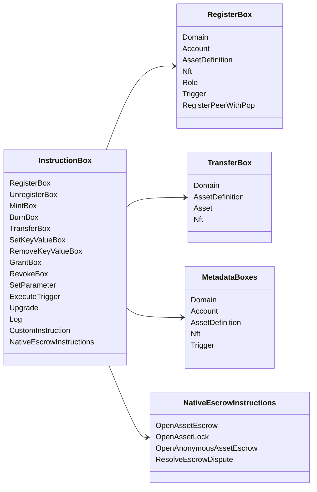

# Iroha Instrucciones especiales {#iroha-special-instructions}

El modelo de datos actual expone estas familias de instrucciones integradas:

|Instrucciones |Las variantes |
| --- | --- |
| [`RegisterBox`](/es/blockchain/instructions.md#un-register) | `Domain`, `Account`, `AssetDefinition`, `Nft`, `Role`, `Trigger`, `RegisterPeerWithPop` |
| [`UnregisterBox`](/es/blockchain/instructions.md#un-register) | `Peer`, `Domain`, `Account`, `AssetDefinition`, `Nft`, `Role`, `Trigger` |
| [`MintBox`](/es/blockchain/instructions.md#mint-burn) |número `Asset`, repeticiones de desencadenante |
| [`BurnBox`](/es/blockchain/instructions.md#mint-burn) |número `Asset`, repeticiones de desencadenante |
| [`TransferBox`](/es/blockchain/instructions.md#transfer) |`Domain`, `AssetDefinition`, numérico `Asset`, `Nft` |
| [`SetKeyValueBox`](/es/blockchain/instructions.md#setkeyvalue-removekeyvalue) | `Domain`, `Account`, `AssetDefinition`, `Nft`, `Trigger` Metadatos |
| [`RemoveKeyValueBox`](/es/blockchain/instructions.md#setkeyvalue-removekeyvalue) | `Domain`, `Account`, `AssetDefinition`, `Nft`, `Trigger` Metadatos |
| [`GrantBox`](/es/blockchain/instructions.md#grant-revoke) |Permiso de contabilidad, papel a la cuenta, permiso para el papel |
| [`RevokeBox`](/es/blockchain/instructions.md#grant-revoke) |Permiso de cuenta, papel de cuenta, permiso de rol |
| [`SetParameter`](/es/blockchain/instructions.md#setparameter) |actualización del parámetro de la cadena |
| [`ExecuteTrigger`](/es/blockchain/instructions.md#executetrigger) |desencadenar la ejecución |
| [`Upgrade`](/es/blockchain/instructions.md#other-instructions) |actualización del ejecutor |
| [`Log`](/es/blockchain/instructions.md#other-instructions) |Registro del registro ejecutor |
| [`CustomInstruction`](/es/blockchain/instructions.md#other-instructions) |carga útil JSON específica del ejecutor |
| [Préstamo de activos nativos ](/es/blockchain/escrow.md) | `OpenAssetEscrow`, `AcceptAssetEscrow`, `MarkEscrowPaymentSent`, `ReleaseAssetEscrow`, `CancelAssetEscrow`, `OpenEscrowDispute`, `ResolveEscrowDispute` |
| [Cierre de activos genéricos ](/es/blockchain/escrow.md#generic-asset-locks) |`OpenAssetLock`, `DrawdownAssetLock`, `CancelAssetLock`, `ExpireAssetLock` |
| [Asignación de activos anónimos](/es/blockchain/escrow.md#anonymous-escrow) | `OpenAnonymousAssetEscrow`, `AcceptAnonymousAssetEscrow`, `MarkAnonymousEscrowPaymentSent`, `ReleaseAnonymousAssetEscrow`, `CancelAnonymousAssetEscrow`, `OpenAnonymousEscrowDispute`, `ResolveAnonymousEscrowDispute` |

Los módulos adicionales Iroha 3 pueden registrar los tipos de instrucciones específicas del dominio a través del registro de instrucciones. Para la lista de nivel de esquema generada desde el árbol fuente actual, vea [Data Model Schema](./data-model-schema.md).

::: details Diagrama: Familias con instrucciones básicas

:::
