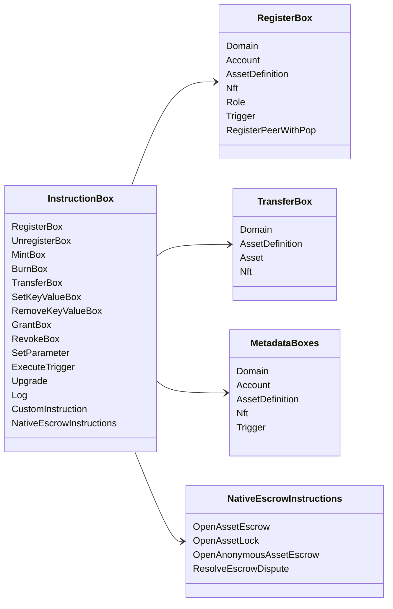

# Iroha Operaciones de instrucción {#iroha-special-instructions}

El modelo de datos actual expone estas familias de instrucciones integradas:

|Instrucción|Variantes|
| --- | --- |
| [`RegisterBox`](/es/blockchain/instructions.md#un-register) | `Domain`, `Account`, `AssetDefinition`, `Nft`, `Role`, `Trigger`, `RegisterPeerWithPop` |
| [`UnregisterBox`](/es/blockchain/instructions.md#un-register) | `Peer`, `Domain`, `Account`, `AssetDefinition`, `Nft`, `Role`, `Trigger` |
| [`MintBox`](/es/blockchain/instructions.md#mint-burn) |numérico `Asset`, activar repeticiones|
| [`BurnBox`](/es/blockchain/instructions.md#mint-burn) |numérico `Asset`, activar repeticiones|
| [`TransferBox`](/es/blockchain/instructions.md#transfer) | `Domain`, `AssetDefinition`, numérico `Asset`, `Nft` |
| [`SetKeyValueBox`](/es/blockchain/instructions.md#setkeyvalue-removekeyvalue) | `Domain`, `Account`, `AssetDefinition`, `Nft`, `Trigger` metadatos |
| [`RemoveKeyValueBox`](/es/blockchain/instructions.md#setkeyvalue-removekeyvalue) | `Domain`, `Account`, `AssetDefinition`, `Nft`, `Trigger` metadatos |
| [`GrantBox`](/es/blockchain/instructions.md#grant-revoke) | `Permission` (`Grant<Permission, Account>`), `Role` (`Grant<RoleId, Account>`), `RolePermission` (`Grant<Permission, Role>`) |
| [`RevokeBox`](/es/blockchain/instructions.md#grant-revoke) | `Permission` (`Revoke<Permission, Account>`), `Role` (`Revoke<RoleId, Account>`), `RolePermission` (`Revoke<Permission, Role>`) |
| [`SetParameter`](/es/blockchain/instructions.md#setparameter) |actualización del parámetro de la cadena|
| [`ExecuteTrigger`](/es/blockchain/instructions.md#executetrigger) |activar ejecución|
| [`Upgrade`](/es/blockchain/instructions.md#other-instructions) |actualización del ejecutor|
| [`Log`](/es/blockchain/instructions.md#other-instructions) |entrada de registro del ejecutor|
| [`CustomInstruction`](/es/blockchain/instructions.md#other-instructions) |carga útil específica del ejecutor JSON|
| [Fideicomiso de activos nativos](/es/blockchain/escrow.md) | `OpenAssetEscrow`, `AcceptAssetEscrow`, `MarkEscrowPaymentSent`, `ReleaseAssetEscrow`, `CancelAssetEscrow`, `OpenEscrowDispute`, `ResolveEscrowDispute` |
| [Bloqueos de activos genéricos](/es/blockchain/escrow.md#generic-asset-locks) | `OpenAssetLock`, `DrawdownAssetLock`, `CancelAssetLock`, `ExpireAssetLock` |
| [Fideicomiso de activos anónimo](/es/blockchain/escrow.md#anonymous-escrow) | `OpenAnonymousAssetEscrow`, `AcceptAnonymousAssetEscrow`, `MarkAnonymousEscrowPaymentSent`, `ReleaseAnonymousAssetEscrow`, `CancelAnonymousAssetEscrow`, `OpenAnonymousEscrowDispute`, `ResolveAnonymousEscrowDispute` |
| [Acuerdo privado atómico](/es/blockchain/instructions.md#atomic-private-settlement) | `ActivatePrivateSettlementPoolV1`, `RotatePrivateSettlementPoolPolicyV1`, `FinalizeAtomicPrivateSettlementV1`, `AbortAtomicPrivateSettlementV1` |

Los módulos adicionales Iroha 3 pueden registrar tipos de instrucciones específicas del dominio a través del registro de instrucciones. Para el esquema con autoridad del nodo y un comando que lo capture, véase [Esquema del Modelo de Datos](./data-model-schema.md).

::: details Diagrama: Familias de instrucciones principales

:::
