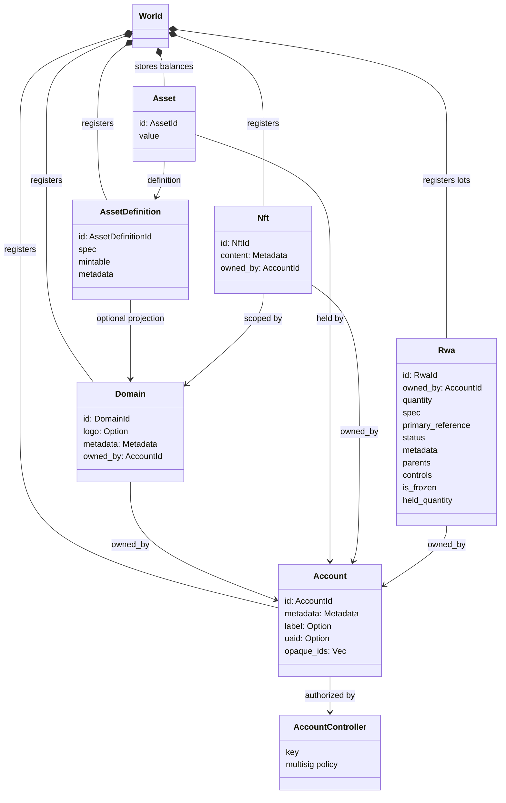
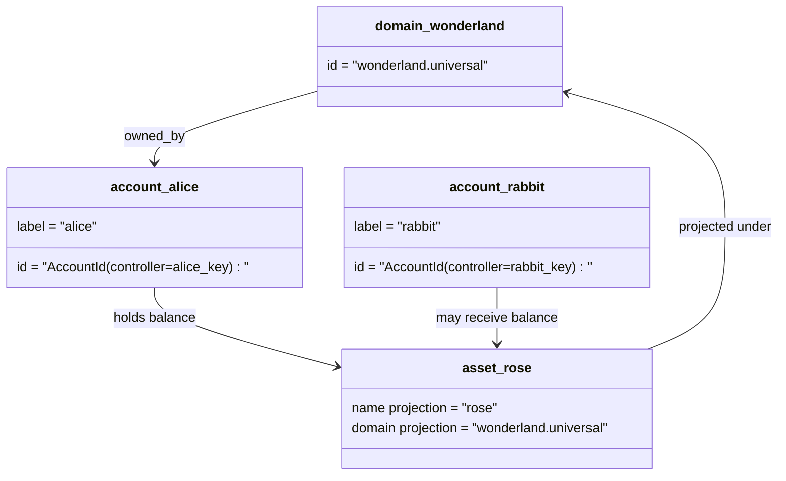

# Modèle de données {#data-model}

Iroha stocke l'état du registre blockchain dans le `World`. Son modèle de données de première version utilise les identités et entités canoniques suivantes :

- les domaines sont qualifiés par l'espace de données, par exemple `payments.universal`
- les comptes sont canoniques et sans domaine ; l'identifiant du compte est dérivé du contrôleur de compte
- Les définitions d'actifs peuvent conserver une projection de domaine/nom, mais leur adresse textuelle canonique est un identifiant opaque en Base58
- les actifs sont des soldes détenus par des comptes pour une définition d'actif spécifique
- les NFTs sont des enregistrements à propriétaire unique, avec un identifiant qualifié par domaine et des métadonnées
- RWAs sont des lots à ID générés qui représentent des actifs hors chaîne avec propriétaire actuel, quantité, provenance, métadonnées, blocages, gels et contrôles du cycle de vie

## Exemple {#example}

Dans un réseau Iroha 3, `wonderland.universal` est un domaine à l'intérieur de l'espace de données `universal`. Les comptes canoniques dans cet exemple sont contrôlés par leurs clés ou politiques et codés en tant qu'identifiants de compte I105 sans domaine. Des étiquettes lisibles telles que `alice@wonderland.universal` sont des alias séparés liés à ces identifiants. Une définition d'actif projetée peut encore être construite à partir d'un domaine et d'un nom tels que `rose` dans `wonderland.universal`, tandis que l'adresse de définition d'actif canonique utilisée dans la transmission du protocole est l'adresse Base58 générée.

## Alias {#aliases}

Les alias sont des noms destinés aux humains superposés aux identifiants canoniques du registre blockchain. Ils sont utiles aux niveaux de API, CLI, du portefeuille et de l'explorateur, mais les identifiants canoniques restent les identifiants stables stockés dans les champs stricts du registre blockchain.

|Cible|Cible canonique|Alias littéral| Modèle de soutien |
| -------------- | --------------------------------------------------- | ------------------------------------------------------ | ----------------------------------------------------------------------------- |
|Compte utilisateur|sans domaine `AccountId` encodé comme une adresse I105| `name@domain.dataspace` ou `name@dataspace`            | `AccountAlias` ; l'alias principal est `Account.label`, les alias supplémentaires sont des liaisons |
|Définition de l'actif|adresse canonique Base58 `AssetDefinitionId`| `name#domain.dataspace` ou `name#dataspace`            |`AssetDefinitionAlias` lié à une définition d'actif|
|Contrat|adresse canonique Bech32m `ContractAddress`                 | `name::domain.dataspace` ou `name::dataspace`          |`ContractAlias` lié à une adresse de contrat déployé|
|Nom de domaine| `DomainId` dans le formulaire `domain.dataspace` | `domain.dataspace`                                    | SNS `domain` enregistrement d'espace de noms |
|Nom de l'espace de données|numérique `DataSpaceId` du catalogue actif Nexus|alias d’espace de données tel que `universal`, `paynet`, ou `zk`| SNS `dataspace` enregistrement de l'espace de noms plus le catalogue de l'espace de données actif|

Les alias de compte sont les noms de compte visibles par l'utilisateur. Ils survivent à la réaffectation de clé du compte car l'alias pointe vers l'identifiant de compte actif via les index de l'état mondial et les enregistrements de réaffectation de clé de compte. Utilisez `SetPrimaryAccountAlias` pour l'étiquette principale du compte, `SetAccountAliasBinding` pour les alias supplémentaires non principaux, et `FindAccountByAlias` ou `FindAliasesByAccountId` pour les lectures. Les alias de compte nécessitent normalement un bail actif SNS d'alias de compte obtenu avec `AcquireAccountAliasLease` et renouvelé avec `RenewAccountAliasLease`.

Les alias d'actifs nomment les définitions d'actifs, pas les soldes de compte individuels. Les alias d'actifs et les alias de contrat sont des liaisons directes d'un nom lisible à une cible canonique existante. Les alias d'actifs sont définis avec `SetAssetDefinitionAlias` ; le segment du nom de l'alias doit correspondre au nom d'affichage de la définition de l'actif ou au nom de définition projeté. Les alias de contrat sont définis avec `SetContractAlias` ; L'alias de l'espace de données doit correspondre à l'espace de données encodé dans l'adresse du contrat. Les deux liaisons peuvent transporter `lease_expiry_ms` ; après expiration, elles cessent de se résoudre lorsque la période de grâce prend fin et sont supprimées des index de l'état mondial.

Les domaines n'ont pas d'objet `DomainAlias` séparé. Un identifiant de domaine est déjà un nom qualifié par l'espace de données tel que `payments.universal`. SNS suit la propriété du bail pour les noms de domaine dans l’espace de noms `domain` et pour les alias d’espace de données dans l’espace de noms `dataspace`. L’alias d’espace de données réservé `universal` doit rester défini.

## Documents liés {#related-docs}

|Sujet|Où aller|
| -------------------------------------- | ------------------------------------------- |
|Domaines| [Domaines](/fr/blockchain/domains.md)           |
|Comptes| [Comptes](/fr/blockchain/accounts.md)         |
|Actifs| [Actifs](/fr/blockchain/assets.md)             |
| NFTs                                   | [NFTs](/fr/blockchain/nfts.md)                 |
|Actifs du monde réel| [Actifs du monde réel](/fr/blockchain/rwas.md)    |
|Métadonnées| [Métadonnées](/fr/blockchain/metadata.md)         |
|Instructions d'enregistrement et de transfert| [Instructions](/fr/blockchain/instructions.md) |
|autorisations d'exécution du logiciel| [Autorisations](/fr/blockchain/permissions.md)   |
|Règles de dénomination| [Règles de dénomination](/fr/reference/naming.md)        |
