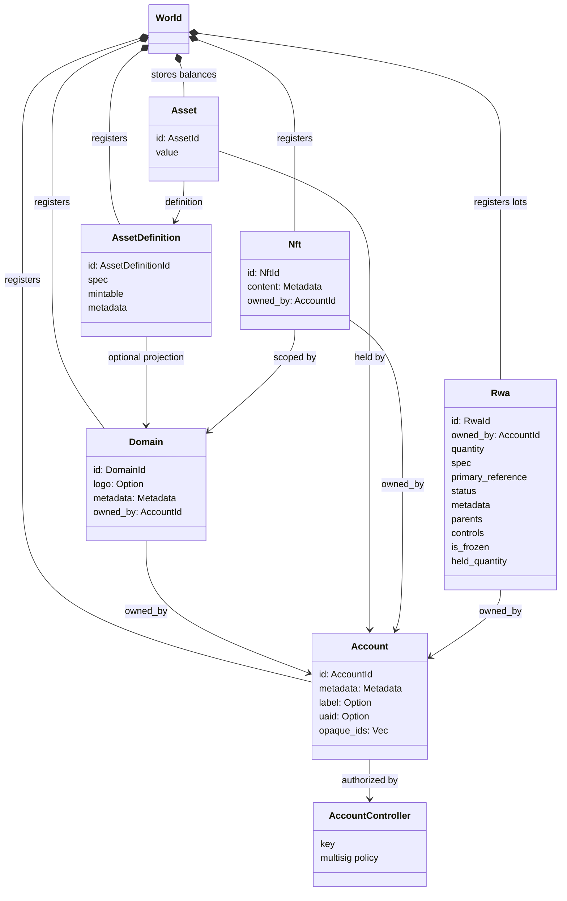
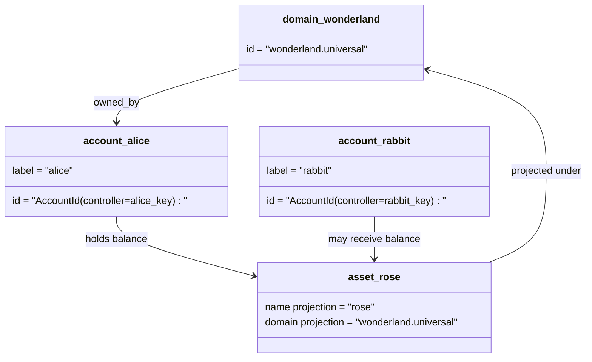

# Modèle de données

Iroha les magasins de l'état de l'État dans le `World`. Son modèle de données de première sortie utilise
les identités et entités canoniques suivantes:

- les domaines sont qualifiés par espace de données, par exemple `payments.universal`
- les comptes sont canoniques et sans domaine; l'ID du compte est dérivé du
  contrôleur de compte
- Les définitions d'actifs peuvent conserver une projection de domaine/nom, mais leurs définitions canoniques
  l'adresse texte est un identifiant Base58 opaque
- les actifs sont des soldes détenus par des comptes pour une définition d'actif spécifique
- Les NFT sont des enregistrements de propriété exclusive avec des identifiants et des métadonnées qualifiés par domaine.
  contenu
- Les RWA sont des lots d'ID générés qui représentent des actifs hors chaîne avec des actifs courants
  propriétaire, quantité, provenance, métadonnées, détention, gel et cycle de vie
  les contrôles

## Exemple

Dans un Iroha 3 réseau, `wonderland.universal` est un domaine dans le
`universal` espace de données. `alice` et `rabbit` ne sont pas codés comme
`alice@wonderland`; ce sont des comptes canoniques contrôlés par leurs clés ou
Une définition d'actif projetée peut encore être construite à partir d'une
nom de domaine et de domaine, tels que `rose` dans `wonderland.universal`, tandis que le
l'adresse canonique de définition d'actif utilisée sur le fil est la base58 générée
l'adresse.

## Nom de famille

Les pseudonymes sont des noms face à l'homme couchés sur des identifiants de registre canonique.
Ils sont utiles aux frontières API, CLI, portefeuille et explorateur, mais canoniques
Les identifiants restent les identifiants stables stockés dans des champs de registre stricts.

| Cible         | Cible canonique                                    | Alias littéralement                                          | Modèle de soutien                                                                 |
| -------------- | --------------------------------------------------- | ------------------------------------------------------ | ----------------------------------------------------------------------------- |
| Compte utilisateur   | sans domaine `AccountId` codé comme adresse I105   | `name@domain.dataspace` ou `name@dataspace`            | `AccountAlias`; le prénom principal est `Account.label`, les aliases supplémentaires sont liés  |
| Définition des actifs | canonique `AssetDefinitionId` Adresse de base58     | `name#domain.dataspace` ou `name#dataspace`            | `AssetDefinitionAlias` lié à une définition d'actif                           |
| Contrat       | canonique Bech32m `ContractAddress`                 | `name::domain.dataspace` ou `name::dataspace`          | `ContractAlias` lié à une adresse de contrat déployée                          |
| Nom de domaine    | `DomainId` dans `domain.dataspace` forme               | `domain.dataspace`                                    | SNS `domain` enregistrement de l'espace de noms                                                 |
| Nom du espace de données | numérique `DataSpaceId` du catalogue Nexus actif | des alias de espace de données tels que `universal`Il y en a . `paynet`ou `zk` | SNS `dataspace` enregistrement de l'espace de noms plus le catalogue de l'espace de données actif            |

Les pseudonymes de compte sont les noms des comptes utilisateurs. Ils survivent compte
Requieting parce que l' alias pointe à l' ID du compte actif à travers l' État mondial
les indices et les registres de compte. `SetPrimaryAccountAlias` pour le
l'étiquette principale du compte, `SetAccountAliasBinding` pour les services supplémentaires non primaires
des pseudonymes, et `FindAccountByAlias` ou `FindAliasesByAccountId` pour les lectures.
Les aliases de compte nécessitent normalement un alias de compte SNS actif acquis
avec `AcquireAccountAliasLease` et renouvelé par `RenewAccountAliasLease`- Je ne sais pas .

Les actifs sont désignés sous le nom d'actifs, et non des soldes individuels.
Les pseudonymes et les pseudonymes contractuels sont des liens directs d'un nom lisible à un nom
Les prénoms d'actifs sont définis avec `SetAssetDefinitionAlias`- le produit;
le segment du nom d'alias doit correspondre au nom d'affichage de la définition d'actif ou
Nom de définition projeté. `SetContractAlias`- le produit;
l'espace de données sous le pseudonyme doit correspondre à l'espace de données codé dans l'adresse du contrat.
Les deux liaisons peuvent transporter `lease_expiry_ms`Après expiration, ils cessent de se résoudre.
Quand la fenêtre de grâce passe et qu'ils sont balayés des indices des États mondiaux.

Les domaines ne disposent pas d'un domaine séparé `DomainAlias` Un identifiant de domaine est
déjà un nom qualifié pour l'espace de données tel que `payments.universal`Traces du SNS
le titre de propriété de domaine dans le `domain` espace de noms et pour espace de données
les aliases dans le `dataspace` L'espace de nom. `universal` alias espace de données
doit rester définie.

## Documents connexes

| Thème                                  | Où aller ?                                 |
| -------------------------------------- | ------------------------------------------- |
| Domaines                                | [Domaines](/blockchain/domains.md)           |
| Comptes                               | [Comptes](/blockchain/accounts.md)         |
| Les actifs                                 | [Les actifs](/blockchain/assets.md)             |
| NFTs                                   | [NFTs](/blockchain/nfts.md)                 |
| Les actifs du monde réel                      | [Les actifs du monde réel](/blockchain/rwas.md)    |
| Les métadonnées                               | [Les métadonnées](/blockchain/metadata.md)         |
| Instructions d'enregistrement et de transfert | [Instructions](/blockchain/instructions.md) |
| Autorisations d'exécution                    | [Autorisations](/blockchain/permissions.md)   |
| Règles de dénomination                           | [Règles de dénomination](/reference/naming.md)        |
