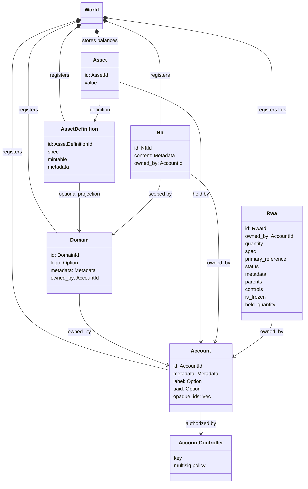
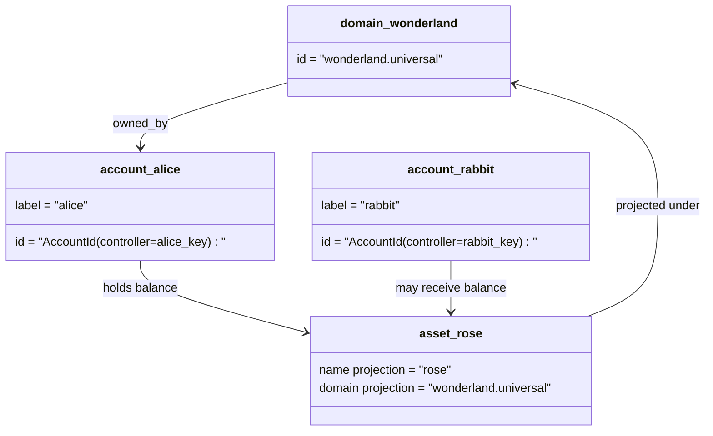

# Modèle de données {#data-model}

Iroha stocke l'état du registre dans le `World`. Son modèle de données de première sortie utilise les identités et entités canoniques suivantes:

- les domaines sont qualifiés pour l'espace de données, par exemple `payments.universal`
- les comptes sont canoniques et sans domaine; le compte ID est dérivé du responsable du contrôle du compte
- Les définitions d'actifs peuvent conserver une projection de domaine/nom, mais leur adresse textuelle canonique est un identifiant Base58 opaque.
- les actifs sont des soldes détenus par des comptes pour une définition d'actif spécifique;
- NFTs sont des enregistrements de propriété exclusive avec un domaine qualifié IDs et une teneur en métadonnées.
- RWAs sont générés- ID lots qui représentent des actifs hors chaîne avec contrôle du propriétaire actuel, de la quantité, de l'origine, des métadonnées, des détentions, des congelés et du cycle de vie

## Exemple {#example}

Dans un réseau Iroha 3, `wonderland.universal` est un domaine à l'intérieur de l'espace de données `universal`. Les comptes canoniques dans cet exemple sont contrôlés par leurs clés ou politiques et codés comme compte I105 sans domaine IDs. Les étiquettes lisibles telles que `alice@wonderland.universal` sont des pseudonymes distincts liés à ces IDs. Une définition d'actif projetée peut encore être construite à partir d'un domaine et d'un nom tels que `rose` dans `wonderland.universal`, tandis que l'adresse canonique de définition d 'actif utilisée sur le fil est l' adresse Base58 générée.

## Nom de famille {#aliases}

Les aliases sont des noms face à l'homme couchés sur des identifiants de registre canonique. Ils sont utiles aux frontières API, CLI, portefeuille et explorateur, mais les identifiants canoniques IDs restent les identifiants stables stockés dans des champs de registre stricts.

|Cible .|Cible canonique |Alias littéralement |Modèle de soutien |
| -------------- | --------------------------------------------------- | ------------------------------------------------------ | ----------------------------------------------------------------------------- |
|Compte utilisateur |sans domaine `AccountId` codé comme une adresse I105 |`name@domain.dataspace` ou `name@dataspace` |`AccountAlias`; le prénom principal est `Account.label`, les prénoms supplémentaires sont liés |
|Définition des actifs |l'adresse canonique `AssetDefinitionId` Base58 |`name#domain.dataspace` ou `name#dataspace` |`AssetDefinitionAlias` lié à une définition d'actif |
|Le contrat |le Bech32m canonique `ContractAddress` |`name::domain.dataspace` ou `name::dataspace` |`ContractAlias` lié à une adresse de contrat déployée |
|Nom de domaine |`DomainId` sous forme de `domain.dataspace` |`domain.dataspace` |SNS `domain` enregistrement de l'espace de noms |
|Nom du espace de données |Numérique `DataSpaceId` du catalogue actif Nexus |des pseudonymes de espace de données tels que `universal`, `paynet` ou `zk` |SNS `dataspace` enregistrement de l'espace nommé plus le catalogue actif de l' espace de données |

Les pseudonymes de compte sont les noms des comptes face à l'utilisateur. Ils survivent au renouvellement du compte parce que le pseudonyme pointe vers le compte actif ID Il s'agit d'un ouvrage qui se déroule à travers des indices de l'état mondial et des registres de comptes. `SetPrimaryAccountAlias` pour l'étiquette principale du compte, `SetAccountAliasBinding` pour les pseudonymes supplémentaires non primaires, et `FindAccountByAlias` ou `FindAliasesByAccountId` Les pseudonymes de compte exigent normalement un actif SNS contrat de location sous forme d'alias de compte acquis avec: `AcquireAccountAliasLease` et renouvelé par: `RenewAccountAliasLease`.

Les prénoms d'actifs désignent les définitions des actifs, et non les soldes de compte individuels. Les pseudonymes d'actifs et de contrats sont des liens directs entre un nom lisible et une cible canonique existante. Les pseudonymes d'actifs sont définis avec: `SetAssetDefinitionAlias`; Le segment de nom d'alias doit correspondre au nom d'affichage de la définition d'actif ou au nom de définition projeté. `SetContractAlias`; L'alias espace de données doit correspondre à l'espace de données codé dans l'adresse du contrat. `lease_expiry_ms`; Après l'expiration, ils cessent de résoudre quand la fenêtre de grâce expire et sont balayés des indices d'états mondiaux.

Les domaines ne disposent pas d'un objet séparé `DomainAlias`. Un identifiant de domaine est déjà un nom qualifié par l'espace de données tel que `payments.universal`. SNS suit la propriété de location pour les noms de domaine dans l'espace de noms `domain` et pour les aliases de l'escale de données dans l'escape de noms `dataspace`. L'alias réservé `universal` de l'espace de données doit rester défini.

## Documents connexes {#related-docs}

|Sujet |Où aller ?|
| -------------------------------------- | ------------------------------------------- |
|Domaines | [Nom de domaine ](/fr/blockchain/domains.md) |
|Comptes | [Les comptes ](/fr/blockchain/accounts.md) |
|Les actifs | [Les actifs ](/fr/blockchain/assets.md) |
|NFTs | [NFTs](/fr/blockchain/nfts.md) |
|Les actifs du monde réel | [Les actifs du monde réel ](/fr/blockchain/rwas.md) |
|Les métadonnées | [Les données métadonnées ](/fr/blockchain/metadata.md) |
|Instructions d' enregistrement et de transfert | [Instructions ](/fr/blockchain/instructions.md) |
|Permis d' exécution | [Autorisations ](/fr/blockchain/permissions.md) |
|Règles de dénomination | [Règles de dénomination ](/fr/reference/naming.md) |
