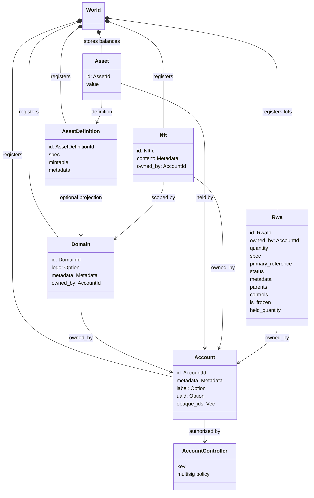
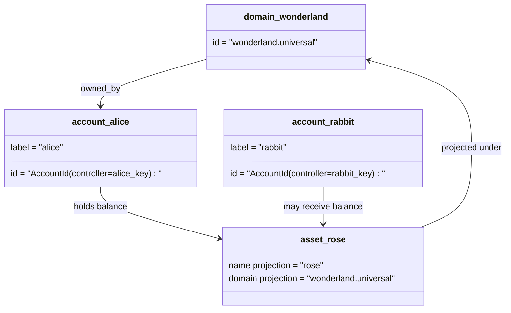

# Modèle de données {#data-model}

Iroha les magasins de l'état du registre dans `World`. Son modèle de données de première édition utilise
les identités et entités canoniques suivantes:

- les domaines sont qualifiés par espace de données, par exemple `payments.universal`
- les comptes sont canoniques et sans domaine; ID est dérivé de la
  contrôleur de compte
- Les définitions d'actifs peuvent conserver une projection de domaine/nom, mais leurs
  l'adresse texte est un identifiant Base58 opaque
- les actifs sont des soldes détenus par des comptes pour une définition d'actif spécifique
- NFTs sont des enregistrements de propriété unique avec un domaine qualifié IDs et métadonnées
  contenu
- RWAs sont générées-ID lots qui représentent des actifs hors chaîne avec un montant courant
  propriétaire, quantité, provenance, métadonnées, détention, gel et cycle de vie
  les contrôles

## Exemple {#example}

Dans un Iroha 3 réseau, `wonderland.universal` est un domaine à l'intérieur du
`universal` Les comptes canoniques dans cet exemple sont contrôlés
par leurs clés ou politiques et codées comme sans domaine I105 compte IDs. Lecteur
étiquettes telles que `alice@wonderland.universal` sont des pseudonymes distincts liés à ces
IDs. Une définition d'actif projetée peut encore être construite à partir d'un domaine et
nom tel que `rose` dans `wonderland.universal`, alors que l'actif canonique
l'adresse de définition utilisée sur le fil est l'adresse Base58 générée.

## Nom de famille {#aliases}

Les pseudonymes sont des noms face à l'homme placés sur des identifiants de registre canonique.
Ils sont utiles à API, CLI, portefeuille, et les frontières explorateurs, mais canoniques
IDs restent les identifiants stables stockés dans des champs de registre stricts.

| Cible         | Cible canonique                                    | Alias littéralement                                          | Modèle de soutien                                                                 |
| -------------- | --------------------------------------------------- | ------------------------------------------------------ | ----------------------------------------------------------------------------- |
| Compte utilisateur   | sans domaine `AccountId` codé comme un I105 adresse   | `name@domain.dataspace` ou `name@dataspace`            | `AccountAlias`; l'alias principal est `Account.label`, Les pseudonymes supplémentaires sont des liaisons  |
| Définition des actifs | canonique `AssetDefinitionId` Adresse de base58     | `name#domain.dataspace` ou `name#dataspace`            | `AssetDefinitionAlias` lié à une définition d'actif                           |
| Contrat       | canonique Bech32m `ContractAddress`                 | `name::domain.dataspace` ou `name::dataspace`          | `ContractAlias` lié à une adresse de contrat déployée                          |
| Nom de domaine    | `DomainId` dans `domain.dataspace` forme               | `domain.dataspace`                                    | SNS `domain` enregistrement de l'espace de noms                                                 |
| Nom du espace de données | numérique `DataSpaceId` de l'actif Nexus le catalogue | des alias de espace de données tels que `universal`, `paynet`, ou `zk` | SNS `dataspace` enregistrement de l'espace de noms plus le catalogue actif de l' espace de données            |

Les pseudonymes de compte sont les noms des comptes visés par l'utilisateur.
Récupération parce que l'alias pointe vers le compte actif ID à travers l'État mondial
les indices et les registres de compte. `SetPrimaryAccountAlias` pour le
l'étiquette principale du compte, `SetAccountAliasBinding` pour les services supplémentaires non primaires
des pseudonymes, et `FindAccountByAlias` ou `FindAliasesByAccountId` pour les lectures.
Les pseudonymes de compte nécessitent normalement un actif SNS contrat de location sous forme d'alias de compte acquis
avec `AcquireAccountAliasLease` et renouvelé par `RenewAccountAliasLease`.

Les actifs sont désignés sous le nom de définitions d'actifs, et non des soldes individuels.
Les pseudonymes et les pseudonymes contractuels sont des liens directs d'un nom lisible à un
Les prénoms d'actifs sont définis avec `SetAssetDefinitionAlias`;
le segment du nom d'alias doit correspondre au nom de l'affichage de la définition des actifs ou
Nom de définition projeté. `SetContractAlias`;
l'espace de données alias doit correspondre à l'esphere de données codée dans l'adresse du contrat.
Les deux liaisons peuvent transporter `lease_expiry_ms`; après expiration, ils cessent de se résoudre
Quand la fenêtre de grâce passe et qu'ils sont balayés des indices d'états mondiaux.

Les domaines ne disposent pas d'un domaine séparé `DomainAlias` Un identifiant de domaine est
déjà un nom qualifié pour l'espace de données tel que `payments.universal`. SNS traces
le titre de propriété des noms de domaine dans les `domain` espace de noms et pour l'espace de données
les aliases dans le `dataspace` L'espace de nom. `universal` alias espace de données
doit rester définie.

## Documents connexes {#related-docs}

| Thème                                  | Où aller ?                                 |
| -------------------------------------- | ------------------------------------------- |
| Domaines                                | [Domaines](/fr/blockchain/domains.md)           |
| Comptes                               | [Comptes](/fr/blockchain/accounts.md)         |
| Les actifs                                 | [Les actifs](/fr/blockchain/assets.md)             |
| NFTs                                   | [NFTs](/fr/blockchain/nfts.md)                 |
| Les actifs du monde réel                      | [Les actifs du monde réel](/fr/blockchain/rwas.md)    |
| Les métadonnées                               | [Les métadonnées](/fr/blockchain/metadata.md)         |
| Instructions d'enregistrement et de transfert | [Instructions](/fr/blockchain/instructions.md) |
| Autorisations d'exécution                    | [Autorisations](/fr/blockchain/permissions.md)   |
| Règles de dénomination                           | [Règles de dénomination](/fr/reference/naming.md)        |
