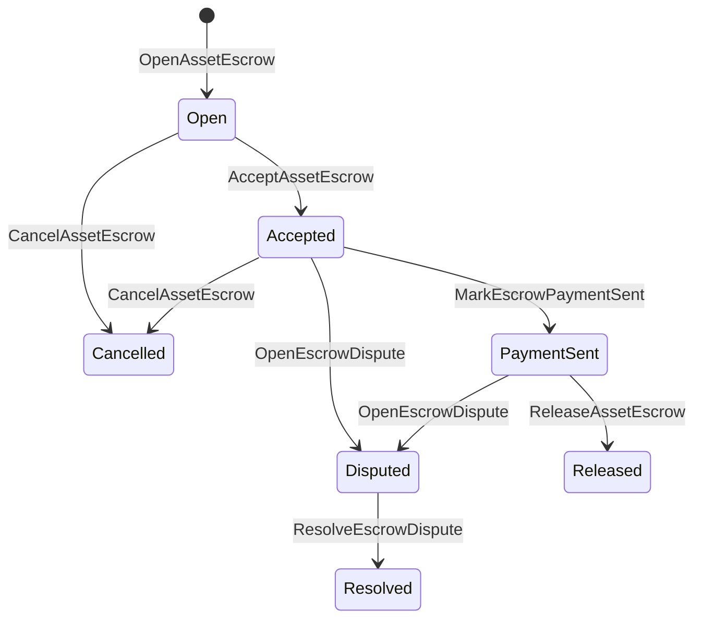

# Réservation des actifs natifs {#native-asset-escrow}

La fiducie native est un mécanisme de conservation des actifs numériques géré par le registre. Au lieu d'envoyer des actifs sur un compte appartenant à une application et de compter sur le code de l'application pour protéger ce compte, la garantie ISIs transfère la valeur dans un compte de détention du protocole déterministe et enregistre le cycle de vie de la garantie dans l'état mondial.

Utilisez l'escrow natif pour le règlement sur le marché, la coordination des paiements hors chaîne à la manière d'Aitai, les serrures de jalon et les flux de travail en escrow protégés qui nécessitent un état du cycle de vie visible dans le registre.

## Les concepts {#concepts}

|Le concept |La description |
| --- | --- |
|`EscrowId` |L'identifiant sélectionné par l'appelant enveloppant un hash. Il doit être unique entre les déposants transparents et anonymes. |
|`AssetEscrowRecord` |Un enregistrement numérique transparent de la fiducie d'actifs ou du verrouillage. |
|`AnonymousAssetEscrowRecord` |Des antécédents de garantie protégés, soutenus par des annulateurs, des engagements et des pièces jointes.|
|Compte de garde |Compte de protocole déterministique dérivé de la chaîne ID, de l'escrow ID et de la définition des actifs. |
|Les preuves sont hachées .|Les hashes de preuves peuvent identifier les factures, les jugements, les messages, les manifestes de stockage ou d'autres preuves hors chaîne. La charge utile des preuves elle-même n'est pas stockée dans le dossier de garantie. |

Les dossiers transparents portent le vendeur, l'acheteur facultatif, la définition des actifs, le montant total, le compte de détention, l'état du cycle de vie, le type de comportement, le montant restant, l'autorité de libération facultative, le timestamp d'expiration facultatif, les hachages de preuves, les timestamps et les détails de résolution facultatif.

Les montants de dépôt doivent être des quantités d'actifs numériques positives et doivent correspondre aux spécifications numériques de la définition d'actif. Alors qu'un dépôt ou un verrouillage est actif, les transferts génériques d'activos ne peuvent pas épuiser le compte de dépossession; les voies de sortie de déposition sont les dépositions ISIs décrites ci-dessous.

## Réservation du marché {#marketplace-escrow}

La fiducie sur le marché coordonne une libération d'actifs en chaîne avec un flux de travail de paiement ou de livraison hors chaîne.



|ISI |Qui le soumet ?|L' effet |
| --- | --- | --- |
|`OpenAssetEscrow` |Vendeur |Il bloque l'actif numérique du vendeur en détention de protocole et crée un enregistrement sur le marché `Open`. |
|`AcceptAssetEscrow` |Acheteur |Enregistre l'acheteur et passe `Open` à `Accepted`. Le vendeur ne peut pas accepter sa propre caution. |
|`MarkEscrowPaymentSent` |Acheteur accepté |Transférer `Accepted` à `PaymentSent` après que l'acheteur ait envoyé le paiement hors chaîne. |
|`ReleaseAssetEscrow` |Le vendeur |Transférer `PaymentSent` à `Released` et transférer l'intégralité du montant déposé à l'acheteur |
|`CancelAssetEscrow` |Le vendeur |Transférer `Open` ou `Accepted` à `Cancelled` et rembourser le vendeur avant que le paiement ne soit marqué. |
|`OpenEscrowDispute` |Vendeur ou acheteur accepté |Mette `Accepted` ou `PaymentSent` dans `Disputed` et ajoute des haches de preuve. |
|`ResolveEscrowDispute` |Compte auprès de `CanResolveEscrowDispute` |Transporte `Disputed` à `Resolved` et partage le montant entre l'acheteur et le vendeur. |

Les montants de règlement des différends doivent être non négatifs et `buyer_amount + seller_amount` doivent être égaux au montant de la garantie. Les jambes à valeur zéro sont autorisées, mais l'ensemble de la fraction doit tenir compte du solde verrouillé.

### Rust Exemple {#rust-example}

Cet exemple suppose que les comptes du vendeur et de l'acheteur existent déjà, que la définition des actifs est enregistrée comme numérique et que le vendeur dispose d'un solde suffisant.

```rust
use iroha::{
    client::Client,
    data_model::{
        isi::escrow::{
            AcceptAssetEscrow, MarkEscrowPaymentSent, OpenAssetEscrow,
            ReleaseAssetEscrow,
        },
        prelude::*,
    },
};
use iroha_crypto::Hash;

fn release_marketplace_escrow(
    seller_client: &Client,
    buyer_client: &Client,
    asset_definition_id: AssetDefinitionId,
) -> eyre::Result<()> {
    let escrow_id = EscrowId::new(Hash::new("docs-marketplace-escrow-001"));

    seller_client.submit_blocking(OpenAssetEscrow::with_evidence_hashes(
        escrow_id,
        asset_definition_id,
        Numeric::from(40_u64),
        vec![Hash::new("invoice:2026-001")],
    ))?;

    buyer_client.submit_blocking(AcceptAssetEscrow::new(escrow_id))?;
    buyer_client.submit_blocking(MarkEscrowPaymentSent::new(escrow_id))?;
    seller_client.submit_blocking(ReleaseAssetEscrow::new(escrow_id))?;

    let record = seller_client.query_single(FindAssetEscrowById::new(escrow_id))?;
    assert_eq!(record.status, AssetEscrowStatus::Released);
    assert_eq!(record.remaining_amount, Numeric::zero());

    Ok(())
}
```

## Les verrous d'actifs génériques {#generic-asset-locks}

Les serrures d'actifs utilisent le même type de registre de détention, mais ne sont pas des offres acheteurs-vendeurs. Elles verrouillent les fonds pour un compte de destination et nécessitent optionnellement une autorité de libération distincte pour retirer les fonds.

|ISI |Qui le soumet ?|L' effet |
| --- | --- | --- |
|`OpenAssetLock` |Compte source |Il bloque un montant positif, enregistre la destination comme l'acheteur enregistré et fixe le statut à `Locked`. |
|`DrawdownAssetLock` |Autorisation de libération, ou destination si aucune autorité de libération n'est définie |Transférer une partie ou la totalité de la garde restante à la destination. |
|`CancelAssetLock` |Ouverture de serrure |Il annule une serrure active et rembourse le montant restant à l'ouvreur.|
|`ExpireAssetLock` |Toute autorité de transaction après la date limite |Une serrure avec `expires_at_ms` expire dans le passé et rembourse le montant restant à l'ouvreur. |

`DrawdownAssetLock` conserve l'enregistrement dans `Locked` pendant qu'un certain montant reste. Lorsque le montant restant atteint zéro, le statut devient `DrawnDown` et l'enregistre est fermé.

```rust
use iroha::{
    client::Client,
    data_model::{
        isi::escrow::{CancelAssetLock, DrawdownAssetLock, ExpireAssetLock, OpenAssetLock},
        prelude::*,
    },
};
use iroha_crypto::Hash;

fn drawdown_and_close_asset_locks(
    opener_client: &Client,
    destination_client: &Client,
    release_authority_client: &Client,
    asset_definition_id: AssetDefinitionId,
    destination: AccountId,
    release_authority: AccountId,
) -> eyre::Result<()> {
    let trusted_lock_id = EscrowId::new(Hash::new("docs-asset-lock-trusted"));

    opener_client.submit_blocking(OpenAssetLock::with_options(
        trusted_lock_id,
        asset_definition_id.clone(),
        destination.clone(),
        Numeric::from(40_u64),
        Some(release_authority),
        None,
        vec![Hash::new("milestone-plan-v1")],
    ))?;

    release_authority_client.submit_blocking(DrawdownAssetLock::new(
        trusted_lock_id,
        Numeric::from(15_u64),
    ))?;

    let partially_drawn =
        opener_client.query_single(FindAssetEscrowById::new(trusted_lock_id))?;
    assert_eq!(partially_drawn.status, AssetEscrowStatus::Locked);
    assert_eq!(partially_drawn.remaining_amount, Numeric::from(25_u64));

    opener_client.submit_blocking(CancelAssetLock::new(trusted_lock_id))?;
    let cancelled = opener_client.query_single(FindAssetEscrowById::new(trusted_lock_id))?;
    assert_eq!(cancelled.status, AssetEscrowStatus::Cancelled);

    let expiring_lock_id = EscrowId::new(Hash::new("docs-asset-lock-expiring"));
    opener_client.submit_blocking(OpenAssetLock::with_options(
        expiring_lock_id,
        asset_definition_id,
        destination,
        Numeric::from(10_u64),
        None,
        Some(0),
        Vec::new(),
    ))?;

    destination_client.submit_blocking(ExpireAssetLock::new(expiring_lock_id))?;
    let expired = opener_client.query_single(FindAssetEscrowById::new(expiring_lock_id))?;
    assert_eq!(expired.status, AssetEscrowStatus::Expired);

    Ok(())
}
```

Python présente actuellement des aides de haut niveau pour les serrures génériques: `open_asset_lock`, `drawdown_asset_lock`, `cancel_asset_lock`, et `expire_asset_lock`. Pour le marché et les garanties anonymes de Python, utilisation canonique `InstructionBox` JSON à travers le SDK C' est ... JSON d'échappement ou de soumission à travers une SDK qui expose les créanciers de première classe.

## Les différends {#disputes}

Une garantie de marché peut entrer en dispute à partir d'un `Accepted` ou `PaymentSent`. Seul le vendeur ou l'acheteur enregistré peut ouvrir le différend. `CanResolveEscrowDispute`, soit est accordée directement au compte de résolveur ou héritée par un rôle.

```rust
use iroha::{
    client::Client,
    data_model::{
        isi::escrow::{OpenEscrowDispute, ResolveEscrowDispute},
        prelude::*,
    },
};
use iroha_crypto::Hash;
use iroha_executor_data_model::permission::escrow::CanResolveEscrowDispute;

fn resolve_disputed_escrow(
    admin_client: &Client,
    buyer_client: &Client,
    court_client: &Client,
    court: AccountId,
    escrow_id: EscrowId,
) -> eyre::Result<()> {
    admin_client.submit_blocking(Grant::account_permission(
        Permission::from(CanResolveEscrowDispute),
        court,
    ))?;

    buyer_client.submit_blocking(OpenEscrowDispute::with_evidence_hashes(
        escrow_id,
        vec![Hash::new("buyer-payment-receipt")],
    ))?;

    court_client.submit_blocking(ResolveEscrowDispute::with_evidence_hashes(
        escrow_id,
        Numeric::from(30_u64),
        Numeric::from(10_u64),
        vec![Hash::new("court-judgement-001")],
    ))?;

    let record = admin_client.query_single(FindAssetEscrowById::new(escrow_id))?;
    assert_eq!(record.status, AssetEscrowStatus::Resolved);
    assert_eq!(
        record.resolution.as_ref().map(|resolution| resolution.buyer_amount.clone()),
        Some(Numeric::from(30_u64)),
    );

    Ok(())
}
```

## Réservation anonyme {#anonymous-escrow}

L'escroquerie anonyme utilise le même cycle de vie du marché, mais le financement et la clôture des mouvements d'actifs sont protégés. Les montants et les destinataires à l'intérieur des billets protégés sont représentés par des engagements, des annulations et des pièces jointes de la preuve.

| Transparent ISI | Anonyme ISI |
| --- | --- |
|`OpenAssetEscrow` |`OpenAnonymousAssetEscrow` |
|`AcceptAssetEscrow` |`AcceptAnonymousAssetEscrow` |
|`MarkEscrowPaymentSent` |`MarkAnonymousEscrowPaymentSent` |
|`ReleaseAssetEscrow` |`ReleaseAnonymousAssetEscrow` |
|`CancelAssetEscrow` |`CancelAnonymousAssetEscrow` |
|`OpenEscrowDispute` |`OpenAnonymousEscrowDispute` |
|`ResolveEscrowDispute` |`ResolveAnonymousEscrowDispute` |

Le portefeuille ou l'outil de vérification doit constituer la pièce jointe à la preuve et les entrées publiques. L'ouverture crée un engagement de garantie. La libération, l'annulation et la résolution anonyme des différends doivent dépenser exactement un engagement de dépôt et créer l'acheteur, le vendeur, ou les engagements de sortie partagés requis par l'action.

```rust
use iroha::{
    client::Client,
    data_model::{
        isi::escrow::{
            AcceptAnonymousAssetEscrow, MarkAnonymousEscrowPaymentSent,
            OpenAnonymousAssetEscrow,
        },
        prelude::*,
        proof::ProofAttachment,
    },
};
use iroha_crypto::Hash;

fn open_anonymous_escrow(
    seller_client: &Client,
    buyer_client: &Client,
    escrow_id: EscrowId,
    asset_definition_id: AssetDefinitionId,
    funding_nullifiers: Vec<[u8; 32]>,
    escrow_commitment: [u8; 32],
    proof: ProofAttachment,
    root_hint: Option<[u8; 32]>,
) -> eyre::Result<()> {
    seller_client.submit_blocking(OpenAnonymousAssetEscrow::with_evidence_hashes(
        escrow_id,
        asset_definition_id,
        funding_nullifiers,
        escrow_commitment,
        proof,
        root_hint,
        vec![Hash::new("shielded-invoice")],
    ))?;

    buyer_client.submit_blocking(AcceptAnonymousAssetEscrow::new(escrow_id))?;
    buyer_client.submit_blocking(MarkAnonymousEscrowPaymentSent::new(escrow_id))?;

    Ok(())
}
```

Pour le modèle d'opération protégée sous-jacent, voir [Transactions anonymes ](/fr/blockchain/anonymous-transactions.md).

## SDK Utilisation {#sdk-usage}

Le soutien à l'épicerie est exposé différemment dans les SDKs. Rust a le modèle de données canoniques typées. Python Il expose actuellement des aides génériques au blocage d'actifs. JavaScript et TypeScript utilisation Kotodama Les appels de l'hôte. Kotlin/JVM et Swift fournir des constructeurs de charges utiles pour le marché et une garantie anonyme.

|SDK |Utilisez cette surface .|La portée |
| --- | --- | --- |
| [Rust](#rust-sdk) |`iroha::data_model::isi::escrow` |Les dépôts sur le marché, les verrous génériques, les dépôt anonymes, les requêtes et événements. |
| [Python](#python-asset-locks) |`Instruction.open_asset_lock`, `TransactionDraft.open_asset_lock`, et les aides au client `*_and_wait` |Le marché et les assistants anonymes ne sont pas encore des méthodes Python de première classe. |
| [JavaScript / TypeScript](#javascript-and-typescript-kotodama) |`compileKotodamaProgram` de `@iroha/iroha-js/kotodama-compiler` |Les appels de l'hôte d'escrow à l'intérieur des contrats Kotodama. |
| [Kotlin / JVM](#kotlin-and-jvm) |Les classes `InstructionTemplate` dans les catégories `org.hyperledger.iroha.sdk.core.model.instructions` |Le marché et les modèles d'instructions personnalisés anonymes. |
| [Swift / iOS](#swift-and-ios) |`NativeEscrowInstructionBuilders` et `IrohaSDK.build*Escrow*` aides |Places de marché et dépôt anonyme Norito JSON charges utiles d'instructions. |

Les exemples ci-dessous se concentrent sur la construction des instructions: le financement du compte, la gestion des signatures et la soumission de transactions suivent le flux normal pour chaque SDK.

### Rust SDK {#rust-sdk}

Utilisez Rust SDK lorsque vous avez besoin d'une couverture native complète ou d'un support de requête/événement. Les exemples ci-dessus montrent la sortie sur le marché, le retrait générique du verrouillage, la résolution des litiges et la construction anonyme de dépôt avec `iroha::data_model::isi::escrow`.

```rust
use iroha::{
    client::Client,
    data_model::{isi::escrow::OpenAssetEscrow, prelude::*},
};
use iroha_crypto::Hash;

fn open_and_read(
    client: &Client,
    asset_definition_id: AssetDefinitionId,
) -> eyre::Result<AssetEscrowRecord> {
    let escrow_id = EscrowId::new(Hash::new("docs-rust-sdk-escrow"));

    client.submit_blocking(OpenAssetEscrow::new(
        escrow_id,
        asset_definition_id,
        Numeric::from(10_u64),
    ))?;

    client.query_single(FindAssetEscrowById::new(escrow_id))
}
```

### Python Fermetures d'actifs {#python-asset-locks}

Le Python SDK expose les aides de première classe à des blocs d'actifs génériques. Utilisez-les pour les paiements d'une étape importante, les retraits par une autorité de libération, l'annulation par l'ouvreur et les remboursements à expiration.

```python
client.open_asset_lock_and_wait(
    chain_id="dev-chain",
    authority="<source-account-id>",
    private_key_hex="<source-private-key-hex>",
    escrow_id="merchant-lock-001",
    asset_definition_id="<asset-definition-base58>",
    destination="<destination-account-id>",
    amount="2500",
    release_authority="<trusted-release-account-id>",
    expires_at_ms=1_704_000_000_000,
)

client.drawdown_asset_lock_and_wait(
    chain_id="dev-chain",
    authority="<trusted-release-account-id>",
    private_key_hex="<trusted-release-private-key-hex>",
    escrow_id="merchant-lock-001",
    amount="1000",
)

client.expire_asset_lock_and_wait(
    chain_id="dev-chain",
    authority="<any-account-id>",
    private_key_hex="<any-private-key-hex>",
    escrow_id="merchant-lock-001",
)
```

Pour un verrouillage à deux parties, omettre `release_authority`; le compte de destination peut ensuite soumettre `drawdown_asset_lock`.

### JavaScript et TypeScript Kotodama {#javascript-and-typescript-kotodama}

Le JavaScript SDK n'expose pas actuellement les constructeurs de transactions en fiducie natives directes. Pour les applications JavaScript ou TypeScript qui déploient des contrats Kotodama, compilez les appels d'accueil en fiducieux avec le compilateur Kotodama.

Les appels d'accès natifs à l'escrow demandent des indices d'accéder explicites car le compilateur ne peut pas dériver des ensembles d'accés plus étroits pour un escrow opaque ISIs. Utilisez des indices de carte sauvage sur les points d'entrée exportés qui appellent des intégrations `escrow_*`.

```js
import { compileKotodamaProgram } from "@iroha/iroha-js/kotodama-compiler";

const source = `
seiyaku MarketplaceEscrow {
  meta { abi_version: 1; }

  #[access(read="*", write="*")]
  kotoage fn run() permission(Admin) {
    let asset = asset_definition("62Fk4FPcMuLvW5QjDGNF2a4jAmjM");
    let offer = name("aitai_offer");
    let evidence = norito_bytes("00");

    call escrow_open_offer(offer, asset, 10, evidence);
    call escrow_accept(offer);
    call escrow_mark_payment_sent(offer);
    call escrow_release(offer);
  }
}
`;

const compiled = compileKotodamaProgram(source, {
  sourceName: "escrow.ko",
});

if (compiled.diagnostics.length > 0) {
  throw new Error(compiled.diagnostics.map((item) => item.message).join("\n"));
}
```

Pour les litiges, utilisez `escrow_open_dispute(offer, evidence)` et `escrow_resolve_dispute(offer, buyer_amount, seller_amount, evidence)`. Les appels d'hébergement en escrow anonymes acceptent des octets de charge utile de demande Norito, par exemple `anonymous_escrow_open_offer(request)`.

### Kotlin et JVM {#kotlin-and-jvm}

Le Kotlin/JVM SDK modélise l'escrow natif en tant que modèle d'instructions personnalisé. Chaque modèle valide les champs requis et expose la carte des arguments canoniques utilisée par le constructeur de transaction.

```kotlin
import org.hyperledger.iroha.sdk.core.model.escrow.NativeEscrowPermissions
import org.hyperledger.iroha.sdk.core.model.instructions.AcceptAssetEscrowInstruction
import org.hyperledger.iroha.sdk.core.model.instructions.MarkEscrowPaymentSentInstruction
import org.hyperledger.iroha.sdk.core.model.instructions.OpenAssetEscrowInstruction
import org.hyperledger.iroha.sdk.core.model.instructions.ReleaseAssetEscrowInstruction
import org.hyperledger.iroha.sdk.core.model.instructions.ResolveEscrowDisputeInstruction

val open = OpenAssetEscrowInstruction(
    escrowId = "escrow-hash",
    assetDefinition = "xor#wonderland",
    amount = "42.5",
    evidenceHashes = listOf("invoice-hash"),
)
val accept = AcceptAssetEscrowInstruction("escrow-hash")
val paid = MarkEscrowPaymentSentInstruction("escrow-hash")
val release = ReleaseAssetEscrowInstruction("escrow-hash")
val resolve = ResolveEscrowDisputeInstruction(
    escrowId = "escrow-hash",
    buyerAmount = "30",
    sellerAmount = "12.5",
    evidenceHashes = listOf("judgement-hash"),
)

println(open.arguments)
println(NativeEscrowPermissions.CAN_RESOLVE_ESCROW_DISPUTE)
```

Les modèles anonymes sont disponibles comme: `OpenAnonymousAssetEscrowInstruction`, `AcceptAnonymousAssetEscrowInstruction`, `MarkAnonymousEscrowPaymentSentInstruction`, `ReleaseAnonymousAssetEscrowInstruction`, `CancelAnonymousAssetEscrowInstruction`, `OpenAnonymousEscrowDisputeInstruction`, et `ResolveAnonymousEscrowDisputeInstruction`. Android Les appelants Java peuvent utiliser la correspondance `NativeEscrowInstructions.*` les constructeurs de la Android Un artefact.

### Swift et iOS {#swift-and-ios}

Le Swift SDK crée des instructions de dépôt comme chargements utiles Norito JSON. Utilisez `NativeEscrowInstructionBuilders` directement, ou appelez l'assistant équivalent `IrohaSDK.build*Escrow*` lorsque votre application contient déjà une instance `IrohaSDK`.

```swift
import IrohaSwift

let open = try NativeEscrowInstructionBuilders.openAssetEscrow(
    escrowId: "escrow-hash",
    assetDefinition: "xor#wonderland",
    amount: "42.5",
    evidenceHashes: ["invoice-hash"]
)
let accept = try NativeEscrowInstructionBuilders.acceptAssetEscrow(
    escrowId: "escrow-hash"
)
let paid = try NativeEscrowInstructionBuilders.markEscrowPaymentSent(
    escrowId: "escrow-hash"
)
let release = try NativeEscrowInstructionBuilders.releaseAssetEscrow(
    escrowId: "escrow-hash"
)
let resolve = try NativeEscrowInstructionBuilders.resolveEscrowDispute(
    escrowId: "escrow-hash",
    buyerAmount: "30",
    sellerAmount: "12.5",
    evidenceHashes: ["judgement-hash"]
)
```

Les constructeurs anonymes Swift prennent des listes d'annulateurs, des listes de sorties d'engagements, un dictionnaire de preuve et des valeurs optionnelles `rootHint`. Le jeton d'autorisation de résolution des différends est disponible sous le nom de `NativeEscrowPermissions.canResolveEscrowDispute`.

## Des questions et des événements {#queries-and-events}

Utilisez des requêtes d'escrow pour les pages de statut, les tâches de réconciliation et les outils de support:

|Une question .|Objectif |
| --- | --- |
|`FindAssetEscrowById` |Lisez une caution ou verrouille transparente par `EscrowId`. |
|`FindAssetEscrows` |Liste des dossiers transparents de dépôt et de verrouillage. |
|`FindAssetEscrowsBySeller` |Liste des enregistrements ouverts par un vendeur ou un ouvrier de serrures. |
|`FindAssetEscrowsByBuyer` |Liste des contrats de marché acceptés par un acheteur ou verrouilles ciblant une destination. |
|`FindAssetEscrowsByStatus` |Liste des enregistrements par `AssetEscrowStatus`. |
|`FindAnonymousAssetEscrowById` |Lisez une garantie anonyme par `EscrowId`. |
|`FindAnonymousAssetEscrows*` |Liste des garanties anonymes par enregistrement, vendeur, acheteur ou statut. |

`EscrowEventFilter` peut s'abonner à des événements de dépôt et de verrouillage natifs transparents par dépôt ID, vendeur, acheteur, statut et masque d'établissement d'événements. La famille d'évènements comprend `Opened`, `Accepted`, `PaymentSent`, `Released`, `Cancelled`, `Expired`, `Disputed`, et `Resolved`. Les dossiers de dépôt anonymes sont inspectés par le biais des requêtes de dépôts anonymes.

## Notes d'exploitation {#operational-notes}

- Gardez les grandes factures, les journaux de discussion, les jugements ou les paquets d'audit en dehors du dossier de dépôt et attachez leurs hashes comme preuve.
- Utilisez la dérivée stable `EscrowId` dans les demandes afin que les essais répétitifs ne puissent pas créer de doublons d'escrocs pour la même offre.
- accorder `CanResolveEscrowDispute` uniquement aux comptes ou rôles qui gèrent le processus de litige.
- Traiter la vérification des paiements hors chaîne comme une politique d'application. Iroha enregistre les détentions et les transitions du cycle de vie; il ne vérifie pas par lui-même les voies de paiement fiduciaires ou externes.
