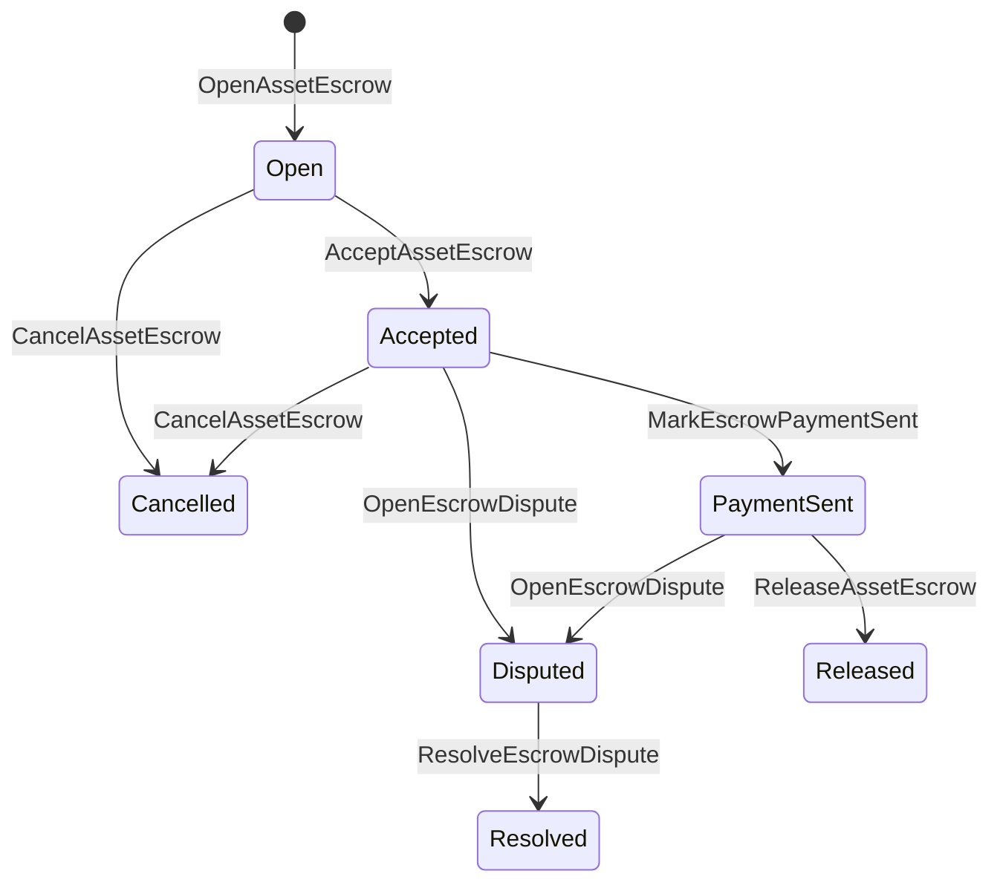

# Compte séquestre d'actif natif {#native-asset-escrow}

Le séquestre natif est un mécanisme de garde géré par un grand livre pour les actifs numériques. Au lieu d'envoyer des actifs à un compte détenu par l'application et de compter sur le code de l'application pour protéger ce compte, mise sous séquestre ISIs transférer la valeur dans un compte de garde de protocole déterministe et enregistrer le cycle de vie du séquestre dans l'état mondial.

Utilisez un séquestre natif pour le règlement de la place de marché, une coordination des paiements hors chaîne de style Aitai, des verrous d'étape et des flux de travail de séquestre protégés nécessitant un état du cycle de vie visible sur le grand livre.

## Concepts {#concepts}

|Concept|Description|
| --- | --- |
| `EscrowId` |Identifiant sélectionné par l'appelant encapsulant un hachage cryptographique. Il doit être unique à travers les séquestres transparents et anonymes.|
| `AssetEscrowRecord` |Enregistrement transparent de séquestre ou de verrouillage d'actif numérique.|
| `AnonymousAssetEscrowRecord` |Enregistrement séquestre protégé par des neutralisateurs, des engagements et des pièces justificatives de preuve.|
|Compte de garde|Compte de protocole déterministe dérivé de l'ID de chaîne, de l'ID d'entiercement et de la définition de l'actif.|
|Hachages de preuves|Ces hachages peuvent identifier des factures, des jugements, des messages, des manifestes de stockage ou d’autres preuves hors chaîne. La charge utile de la preuve elle-même n’est pas stockée dans l’enregistrement d’entiercement.|

Les enregistrements transparents contiennent le vendeur, l'acheteur optionnel, la définition de l'actif, le montant total, le compte de garde, le statut du cycle de vie, le type de comportement, le montant restant, le principal d'autorisation de libération optionnel, l'horodatage d'expiration optionnel, les hachages cryptographiques des preuves, les horodatages et les détails de résolution optionnels.

Les montants en séquestre doivent être des quantités d'actifs numériques positives et doivent correspondre à la spécification numérique de la définition de l'actif. Tant qu'un séquestre ou un verrouillage est actif, les transferts génériques d'actifs ne peuvent pas vider le compte de garde ; les voies de sortie de garde sont le séquestre ISIs décrit ci-dessous.

## Service séquestre du marché {#marketplace-escrow}

L'entiercement du marché coordonne la libération d'un actif sur la chaîne avec un processus de paiement ou de livraison hors chaîne.



| ISI |Qui le soumet|Effet|
| --- | --- | --- |
| `OpenAssetEscrow` |Vendeur|Verrouille l'actif numérique du vendeur sous la garde du protocole et crée un enregistrement de marché `Open`.|
| `AcceptAssetEscrow` |Acheteur|Enregistre l'acheteur et déplace `Open` vers `Accepted`. Le vendeur ne peut pas accepter sa propre escrow.|
| `MarkEscrowPaymentSent` |Acheteur accepté| Déplace `Accepted` vers `PaymentSent` après que l'acheteur envoie le paiement hors chaîne. |
| `ReleaseAssetEscrow` |Vendeur|Déplace `PaymentSent` vers `Released` et transfère le montant total en séquestre à l'acheteur.|
| `CancelAssetEscrow` |Vendeur|Déplace `Open` ou `Accepted` vers `Cancelled` et rembourse le vendeur avant que le paiement ne soit marqué.|
| `OpenEscrowDispute` |Vendeur ou acheteur accepté|Déplace `Accepted` ou `PaymentSent` vers `Disputed` et ajoute des hachages cryptographiques de preuves.|
| `ResolveEscrowDispute` |Compte avec `CanResolveEscrowDispute`|Déplace `Disputed` vers `Resolved` et répartit le montant entre l'acheteur et le vendeur.|

Les montants de résolution des litiges doivent être non négatifs, et `buyer_amount + seller_amount` doit être égal au montant de l'entiercement. Les parts de valeur zéro sont autorisées, mais la répartition totale doit tenir compte du solde bloqué.

### Rust Exemple {#rust-example}

Cet exemple suppose que les comptes du vendeur et de l'acheteur existent déjà, que la définition de l'actif est enregistrée comme numérique et que le vendeur dispose d'un solde suffisant.

```rust
use iroha::{
    client::Client,
    data_model::{
        isi::escrow::{
            AcceptAssetEscrow, MarkEscrowPaymentSent, OpenAssetEscrow,
            ReleaseAssetEscrow,
        },
        prelude::*,
    },
};
use iroha_crypto::Hash;

fn release_marketplace_escrow(
    seller_client: &Client,
    buyer_client: &Client,
    asset_definition_id: AssetDefinitionId,
) -> eyre::Result<()> {
    let escrow_id = EscrowId::new(Hash::new("docs-marketplace-escrow-001"));

    seller_client.submit_blocking(OpenAssetEscrow::with_evidence_hashes(
        escrow_id,
        asset_definition_id,
        Numeric::from(40_u64),
        vec![Hash::new("invoice:2026-001")],
    ))?;

    buyer_client.submit_blocking(AcceptAssetEscrow::new(escrow_id))?;
    buyer_client.submit_blocking(MarkEscrowPaymentSent::new(escrow_id))?;
    seller_client.submit_blocking(ReleaseAssetEscrow::new(escrow_id))?;

    let record = seller_client.query_single(FindAssetEscrowById::new(escrow_id))?;
    assert_eq!(record.status, AssetEscrowStatus::Released);
    assert_eq!(record.remaining_amount, Numeric::zero());

    Ok(())
}
```

## Verrous d'actifs génériques {#generic-asset-locks}

Les verrous d'actifs utilisent le même type d'enregistrement de garde, mais ils ne sont pas des offres acheteur-vendeur. Ils bloquent des fonds pour un compte de destination et nécessitent éventuellement un mandataire séparé d'autorisation de libération pour prélever les fonds.

| ISI |Qui le soumet|Effet|
| --- | --- | --- |
| `OpenAssetLock` |Compte source|Verrouille un montant positif, enregistre la destination comme l'acheteur du disque, et définit le statut sur `Locked`.|
| `DrawdownAssetLock` |Autorisation de libération principale, ou destination lorsque aucune autorisation de libération principale n'est définie|Transfère tout ou partie de la garde restante vers la destination.|
| `CancelAssetLock` |Ouvre-porte|Annule un verrou actif et rembourse le montant restant à l'initiateur.|
| `ExpireAssetLock` |Tout principal d'autorisation de transaction après la date limite|Expire un verrou avec `expires_at_ms` dans le passé et rembourse le montant restant à l'ouvreur.|

`DrawdownAssetLock` conserve l'enregistrement dans `Locked` tant qu'un certain montant reste. Lorsque le montant restant atteint zéro, le statut devient `DrawnDown` et l'enregistrement est fermé.

```rust
use iroha::{
    client::Client,
    data_model::{
        isi::escrow::{CancelAssetLock, DrawdownAssetLock, ExpireAssetLock, OpenAssetLock},
        prelude::*,
    },
};
use iroha_crypto::Hash;

fn drawdown_and_close_asset_locks(
    opener_client: &Client,
    destination_client: &Client,
    release_authority_client: &Client,
    asset_definition_id: AssetDefinitionId,
    destination: AccountId,
    release_authority: AccountId,
) -> eyre::Result<()> {
    let trusted_lock_id = EscrowId::new(Hash::new("docs-asset-lock-trusted"));

    opener_client.submit_blocking(OpenAssetLock::with_options(
        trusted_lock_id,
        asset_definition_id.clone(),
        destination.clone(),
        Numeric::from(40_u64),
        Some(release_authority),
        None,
        vec![Hash::new("milestone-plan-v1")],
    ))?;

    release_authority_client.submit_blocking(DrawdownAssetLock::new(
        trusted_lock_id,
        Numeric::from(15_u64),
    ))?;

    let partially_drawn =
        opener_client.query_single(FindAssetEscrowById::new(trusted_lock_id))?;
    assert_eq!(partially_drawn.status, AssetEscrowStatus::Locked);
    assert_eq!(partially_drawn.remaining_amount, Numeric::from(25_u64));

    opener_client.submit_blocking(CancelAssetLock::new(trusted_lock_id))?;
    let cancelled = opener_client.query_single(FindAssetEscrowById::new(trusted_lock_id))?;
    assert_eq!(cancelled.status, AssetEscrowStatus::Cancelled);

    let expiring_lock_id = EscrowId::new(Hash::new("docs-asset-lock-expiring"));
    opener_client.submit_blocking(OpenAssetLock::with_options(
        expiring_lock_id,
        asset_definition_id,
        destination,
        Numeric::from(10_u64),
        None,
        Some(0),
        Vec::new(),
    ))?;

    destination_client.submit_blocking(ExpireAssetLock::new(expiring_lock_id))?;
    let expired = opener_client.query_single(FindAssetEscrowById::new(expiring_lock_id))?;
    assert_eq!(expired.status, AssetEscrowStatus::Expired);

    Ok(())
}
```

Python expose actuellement des aides de haut niveau pour les verrous génériques : `open_asset_lock`, `drawdown_asset_lock`, `cancel_asset_lock` et `expire_asset_lock`. Pour la place de marché et l'entiercement anonyme à partir de Python, utilisez le `InstructionBox` canonique JSON par la trappe de secours JSON de SDK, ou soumettez via un SDK qui expose les constructeurs d'entiercement de première classe.

## Litiges {#disputes}

Un séquestre du marché peut entrer en litige depuis `Accepted` ou `PaymentSent`. Seul le vendeur ou l'acheteur enregistré peut ouvrir le litige. La résolution nécessite `CanResolveEscrowDispute`, accordé directement au compte du résolveur ou hérité par un rôle.

```rust
use iroha::{
    client::Client,
    data_model::{
        isi::escrow::{OpenEscrowDispute, ResolveEscrowDispute},
        prelude::*,
    },
};
use iroha_crypto::Hash;
use iroha_executor_data_model::permission::escrow::CanResolveEscrowDispute;

fn resolve_disputed_escrow(
    admin_client: &Client,
    buyer_client: &Client,
    court_client: &Client,
    court: AccountId,
    escrow_id: EscrowId,
) -> eyre::Result<()> {
    admin_client.submit_blocking(Grant::account_permission(
        Permission::from(CanResolveEscrowDispute),
        court,
    ))?;

    buyer_client.submit_blocking(OpenEscrowDispute::with_evidence_hashes(
        escrow_id,
        vec![Hash::new("buyer-payment-receipt")],
    ))?;

    court_client.submit_blocking(ResolveEscrowDispute::with_evidence_hashes(
        escrow_id,
        Numeric::from(30_u64),
        Numeric::from(10_u64),
        vec![Hash::new("court-judgement-001")],
    ))?;

    let record = admin_client.query_single(FindAssetEscrowById::new(escrow_id))?;
    assert_eq!(record.status, AssetEscrowStatus::Resolved);
    assert_eq!(
        record.resolution.as_ref().map(|resolution| resolution.buyer_amount.clone()),
        Some(Numeric::from(30_u64)),
    );

    Ok(())
}
```

## Séquestre anonyme {#anonymous-escrow}

L'entiercement anonyme utilise le même cycle de vie du marché, mais le financement et la clôture des mouvements d'actifs sont protégés. Le registre public conserve toujours le vendeur, l'acheteur, le statut, des preuves de hachages cryptographiques, des horodatages et des enregistrements de mouvements liés par preuve. Les montants et les destinataires à l'intérieur des notes protégées sont représentés par des engagements, des annulateurs et des pièces jointes de preuve.

|Transparent ISI|Anonyme ISI|
| --- | --- |
| `OpenAssetEscrow` | `OpenAnonymousAssetEscrow` |
| `AcceptAssetEscrow` | `AcceptAnonymousAssetEscrow` |
| `MarkEscrowPaymentSent` | `MarkAnonymousEscrowPaymentSent` |
| `ReleaseAssetEscrow` | `ReleaseAnonymousAssetEscrow` |
| `CancelAssetEscrow` | `CancelAnonymousAssetEscrow` |
| `OpenEscrowDispute` | `OpenAnonymousEscrowDispute` |
| `ResolveEscrowDispute` | `ResolveAnonymousEscrowDispute` |

L'outil de portefeuille ou de générateur de preuve doit construire la pièce justificative et les entrées publiques. L'ouverture crée un engagement d'entiercement. La libération, l'annulation et la résolution de litiges anonymes doivent consommer exactement un engagement d'entiercement et créer les engagements de sortie de l'acheteur, du vendeur ou partagés requis par l'action.

```rust
use iroha::{
    client::Client,
    data_model::{
        isi::escrow::{
            AcceptAnonymousAssetEscrow, MarkAnonymousEscrowPaymentSent,
            OpenAnonymousAssetEscrow,
        },
        prelude::*,
        proof::ProofAttachment,
    },
};
use iroha_crypto::Hash;

fn open_anonymous_escrow(
    seller_client: &Client,
    buyer_client: &Client,
    escrow_id: EscrowId,
    asset_definition_id: AssetDefinitionId,
    funding_nullifiers: Vec<[u8; 32]>,
    escrow_commitment: [u8; 32],
    proof: ProofAttachment,
    root_hint: Option<[u8; 32]>,
) -> eyre::Result<()> {
    seller_client.submit_blocking(OpenAnonymousAssetEscrow::with_evidence_hashes(
        escrow_id,
        asset_definition_id,
        funding_nullifiers,
        escrow_commitment,
        proof,
        root_hint,
        vec![Hash::new("shielded-invoice")],
    ))?;

    buyer_client.submit_blocking(AcceptAnonymousAssetEscrow::new(escrow_id))?;
    buyer_client.submit_blocking(MarkAnonymousEscrowPaymentSent::new(escrow_id))?;

    Ok(())
}
```

Pour le modèle de transaction protégé sous-jacent, voir [Transactions anonymes](/fr/blockchain/anonymous-transactions.md).

## SDK Utilisation {#sdk-usage}

Le support de l'entiercement est exposé différemment à travers le SDKs. Rust possède le modèle de données typé canonique. Python expose actuellement des assistants de verrouillage d'actifs génériques. JavaScript et TypeScript utilisent les appels hôtes d'entiercement Kotodama. Kotlin/JVM et Swift fournissent des constructeurs de charge utile typés pour le marché et l'entiercement anonyme.

| SDK |Utilisez cette surface|Portée|
| --- | --- | --- |
| [Rust](#rust-sdk) | `iroha::data_model::isi::escrow` |Séquestre du marché, verrous génériques, séquestre anonyme, requêtes et événements.|
| [Python](#python-asset-locks) | `Instruction.open_asset_lock`, `TransactionDraft.open_asset_lock`, et les assistants du client `*_and_wait` |Verrous d'actifs génériques. Les helpers de marché et d'entiercement anonyme ne sont pas encore des méthodes de première classe Python.|
| [JavaScript / TypeScript](#javascript-and-typescript-kotodama) | `compileKotodamaProgram` de `@iroha/iroha-js/kotodama-compiler` |L'hôte de séquestre appelle à l'intérieur des contrats Kotodama.|
| [Kotlin / JVM](#kotlin-and-jvm) |`InstructionTemplate` classes in `org.hyperledger.iroha.sdk.core.model.instructions`|Modèles d'instructions personnalisées pour place de marché et séquestre anonyme.|
| [Swift / iOS](#swift-and-ios) |`NativeEscrowInstructionBuilders` et `IrohaSDK.build*Escrow*` assistants| Marché et charges utiles d'instructions de séquestre anonyme Norito JSON. |

Les exemples ci-dessous se concentrent sur la construction des instructions. Le financement des comptes, la gestion des signatures et la soumission des transactions suivent le flux normal pour chaque SDK.

### Rust SDK {#rust-sdk}

Utilisez le Rust SDK lorsque vous avez besoin d'une couverture native complète ou du support pour les requêtes/événements. Les exemples ci-dessus montrent la publication sur le marché, le tirage générique de verrouillage, la résolution de litiges et la construction d'entiercement anonyme avec `iroha::data_model::isi::escrow`.

```rust
use iroha::{
    client::Client,
    data_model::{isi::escrow::OpenAssetEscrow, prelude::*},
};
use iroha_crypto::Hash;

fn open_and_read(
    client: &Client,
    asset_definition_id: AssetDefinitionId,
) -> eyre::Result<AssetEscrowRecord> {
    let escrow_id = EscrowId::new(Hash::new("docs-rust-sdk-escrow"));

    client.submit_blocking(OpenAssetEscrow::new(
        escrow_id,
        asset_definition_id,
        Numeric::from(10_u64),
    ))?;

    client.query_single(FindAssetEscrowById::new(escrow_id))
}
```

### Python Verrouillages d'actifs {#python-asset-locks}

Le Python SDK expose des aides de première classe pour les verrouillages d'actifs génériques. Utilisez-les pour les paiements liés à des étapes, les tirages par un responsable d'autorisation de libération, l'annulation par l'initiateur, et les remboursements à l'expiration.

```python
client.open_asset_lock_and_wait(
    chain_id="dev-chain",
    authority="<source-account-id>",
    private_key_hex="<source-private-key-hex>",
    escrow_id="merchant-lock-001",
    asset_definition_id="<asset-definition-base58>",
    destination="<destination-account-id>",
    amount="2500",
    release_authority="<trusted-release-account-id>",
    expires_at_ms=1_704_000_000_000,
)

client.drawdown_asset_lock_and_wait(
    chain_id="dev-chain",
    authority="<trusted-release-account-id>",
    private_key_hex="<trusted-release-private-key-hex>",
    escrow_id="merchant-lock-001",
    amount="1000",
)

client.expire_asset_lock_and_wait(
    chain_id="dev-chain",
    authority="<any-account-id>",
    private_key_hex="<any-private-key-hex>",
    escrow_id="merchant-lock-001",
)
```

Pour un verrouillage à deux parties, omettez `release_authority` ; le compte de destination peut ensuite soumettre `drawdown_asset_lock`.

### JavaScript et TypeScript Kotodama {#javascript-and-typescript-kotodama}

Le JavaScript SDK n'expose actuellement pas de générateurs de transactions d'entiercement natifs directs. Pour les applications JavaScript ou TypeScript qui déploient des contrats Kotodama, compilez les appels de l'hôte d'entiercement avec le compilateur Kotodama.

Les appels natifs d'hôte d'entiercement nécessitent des indications d'accès explicites car le compilateur ne peut pas dériver des ensembles d'accès plus restreints pour l'entiercement opaque ISIs. Utilisez des indications génériques sur les points d'entrée exportés qui appellent les fonctions intégrées `escrow_*`.

```js
import { compileKotodamaProgram } from "@iroha/iroha-js/kotodama-compiler";

const source = `
seiyaku MarketplaceEscrow {
  meta { abi_version: 1; }

  #[access(read="*", write="*")]
  kotoage fn run() permission(Admin) {
    let asset = asset_definition("62Fk4FPcMuLvW5QjDGNF2a4jAmjM");
    let offer = name("aitai_offer");
    let evidence = norito_bytes("00");

    call escrow_open_offer(offer, asset, 10, evidence);
    call escrow_accept(offer);
    call escrow_mark_payment_sent(offer);
    call escrow_release(offer);
  }
}
`;

const compiled = compileKotodamaProgram(source, {
  sourceName: "escrow.ko",
});

if (compiled.diagnostics.length > 0) {
  throw new Error(compiled.diagnostics.map((item) => item.message).join("\n"));
}
```

Pour les litiges, utilisez `escrow_open_dispute(offer, evidence)` et `escrow_resolve_dispute(offer, buyer_amount, seller_amount, evidence)`. L'hôte d'entiercement anonyme accepte les appels Norito avec les octets de charge utile de la requête, par exemple `anonymous_escrow_open_offer(request)`.

### Kotlin et JVM {#kotlin-and-jvm}

Les modèles Kotlin/JVM SDK modélisent l'entiercement natif en tant que modèles d'instructions personnalisées. Chaque modèle valide les champs requis et expose la carte d'arguments canonique utilisée par le générateur de transactions.

```kotlin
import org.hyperledger.iroha.sdk.core.model.escrow.NativeEscrowPermissions
import org.hyperledger.iroha.sdk.core.model.instructions.AcceptAssetEscrowInstruction
import org.hyperledger.iroha.sdk.core.model.instructions.MarkEscrowPaymentSentInstruction
import org.hyperledger.iroha.sdk.core.model.instructions.OpenAssetEscrowInstruction
import org.hyperledger.iroha.sdk.core.model.instructions.ReleaseAssetEscrowInstruction
import org.hyperledger.iroha.sdk.core.model.instructions.ResolveEscrowDisputeInstruction

val open = OpenAssetEscrowInstruction(
    escrowId = "escrow-hash",
    assetDefinition = "xor#wonderland",
    amount = "42.5",
    evidenceHashes = listOf("invoice-hash"),
)
val accept = AcceptAssetEscrowInstruction("escrow-hash")
val paid = MarkEscrowPaymentSentInstruction("escrow-hash")
val release = ReleaseAssetEscrowInstruction("escrow-hash")
val resolve = ResolveEscrowDisputeInstruction(
    escrowId = "escrow-hash",
    buyerAmount = "30",
    sellerAmount = "12.5",
    evidenceHashes = listOf("judgement-hash"),
)

println(open.arguments)
println(NativeEscrowPermissions.CAN_RESOLVE_ESCROW_DISPUTE)
```

Les modèles anonymes sont disponibles sous `OpenAnonymousAssetEscrowInstruction`, `AcceptAnonymousAssetEscrowInstruction`, `MarkAnonymousEscrowPaymentSentInstruction`, `ReleaseAnonymousAssetEscrowInstruction`, `CancelAnonymousAssetEscrowInstruction`, `OpenAnonymousEscrowDisputeInstruction` et `ResolveAnonymousEscrowDisputeInstruction`. Android Les appelants Java peuvent utiliser les constructeurs correspondants `NativeEscrowInstructions.*` de l'artifact Android.

### Swift et iOS {#swift-and-ios}

Le Swift SDK crée des instructions d'entiercement en tant que charges utiles Norito JSON. Utilisez `NativeEscrowInstructionBuilders` directement, ou appelez l'assistant équivalent `IrohaSDK.build*Escrow*` lorsque votre application possède déjà une instance `IrohaSDK`.

```swift
import IrohaSwift

let open = try NativeEscrowInstructionBuilders.openAssetEscrow(
    escrowId: "escrow-hash",
    assetDefinition: "xor#wonderland",
    amount: "42.5",
    evidenceHashes: ["invoice-hash"]
)
let accept = try NativeEscrowInstructionBuilders.acceptAssetEscrow(
    escrowId: "escrow-hash"
)
let paid = try NativeEscrowInstructionBuilders.markEscrowPaymentSent(
    escrowId: "escrow-hash"
)
let release = try NativeEscrowInstructionBuilders.releaseAssetEscrow(
    escrowId: "escrow-hash"
)
let resolve = try NativeEscrowInstructionBuilders.resolveEscrowDispute(
    escrowId: "escrow-hash",
    buyerAmount: "30",
    sellerAmount: "12.5",
    evidenceHashes: ["judgement-hash"]
)
```

Les constructeurs anonymes Swift prennent des listes de nullificateurs, des listes d'engagements de sortie, un dictionnaire de preuves, et des valeurs optionnelles `rootHint`. Le jeton de permission du résolveur de litiges est disponible en tant que `NativeEscrowPermissions.canResolveEscrowDispute`.

## Requêtes et événements {#queries-and-events}

Utilisez des requêtes en fiducie pour les pages de statut, les tâches de rapprochement et les outils de support :

|Requête|But|
| --- | --- |
| `FindAssetEscrowById` |Lisez un séquestre ou un verrou transparent par `EscrowId`.|
| `FindAssetEscrows` |Lister les registres de séquestre et de verrouillage transparents.|
| `FindAssetEscrowsBySeller` |Lister les dossiers ouverts par un vendeur ou un ouvreur de serrure.|
| `FindAssetEscrowsByBuyer` |Liste des séquestres de marché acceptés par un acheteur ou des verrous visant une destination.|
| `FindAssetEscrowsByStatus` |Lister les enregistrements par `AssetEscrowStatus`.|
| `FindAnonymousAssetEscrowById` |Lisez une séquestre anonyme par `EscrowId`.|
| `FindAnonymousAssetEscrows*` |Lister les séquestres anonymes par tous les enregistrements, vendeur, acheteur ou statut.|

`EscrowEventFilter` peut s'abonner à des événements d'entiercement natifs transparents et de verrouillage par ID d'entiercement, vendeur, acheteur, statut et masque d'ensemble d'événements. La famille d'événements inclut `Opened`, `Accepted`, `PaymentSent`, `Released`, `Cancelled`, `Expired`, `Disputed` et `Resolved`. Les dossiers d'entiercement anonymes sont inspectés via les requêtes d'entiercement anonymes.

## Notes opérationnelles {#operational-notes}

- Stockez les grosses factures, les journaux de discussion, les jugements ou les dossiers d'audit en dehors du registre d'entiercement et joignez leurs hachages cryptographiques comme preuve.
- Utilisez la dérivation stable `EscrowId` dans les applications afin que les nouvelles tentatives ne puissent pas créer de séquestres en double pour la même offre.
- Accorder `CanResolveEscrowDispute` uniquement aux comptes ou rôles qui gèrent le processus de litige.
- Considérez la vérification des paiements hors chaîne comme une politique d'application. Iroha enregistre la garde et les transitions de cycle de vie ; il ne vérifie pas les paiements en monnaie fiduciaire ou les rails de paiement externes par lui-même.
