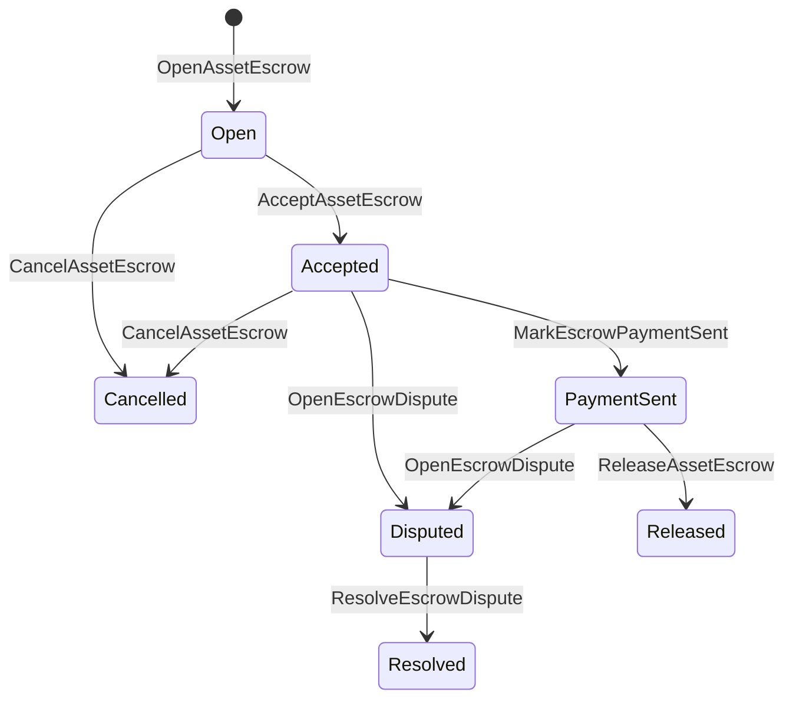

# Réservation des actifs natifs

L'escroquerie native est un mécanisme de détention géré par un registre pour les actifs numériques.
Au lieu d'envoyer des actifs sur un compte appartenant à l'application et de compter sur
le code de demande pour protéger ce compte, les ISI de garantie transférent la valeur dans un
compte de détention du protocole déterministe et enregistrer le cycle de vie de l'escroquerie en
l'état mondial.

Utilisez un escrow natif pour le règlement sur le marché, paiement hors chaîne à la manière d'Aitai
la coordination, les clôtures des étapes et les flux de travail de dépôt de dépôt protégés qui doivent être
l'état du cycle de vie visible dans le registre.

## Les concepts

| Concept | Définition |
| --- | --- |
| `EscrowId` | L'identifiant sélectionné par l'appelant enveloppant un hash. Il doit être unique entre les escrocs transparents et anonymes. |
| `AssetEscrowRecord` | Un enregistrement numérique transparent de l'actif en dépôt ou de verrouillage. |
| `AnonymousAssetEscrowRecord` | Des antécédents de garantie protégés, soutenus par des annulateurs, des engagements et des pièces jointes. |
| Compte de garde | Compte de protocole déterministe dérivé de l'ID de chaîne, de l'ID de dépôt et de la définition des actifs. |
| Hachage des preuves | Les éléments de preuve ne sont pas stockés dans le dossier de garantie. |

Les dossiers transparents portent le vendeur, l'acheteur facultatif, la définition des actifs,
montant total, compte de garde, statut du cycle de vie, type de comportement, résidu
montant, autorité de libération facultative, timbre d'expiration facultatif, preuve
des hash, des timestamps et des détails de résolution optionnels.

Les montants de garantie doivent être des montants d'actifs numériques positifs et doivent correspondre aux montants de garantie
la définition numérique de l'actif.
les transferts d'actifs génériques ne peuvent pas épuiser le compte de détention; la sortie de détention
les voies sont les ISI de dépôt de dépôt décrites ci-dessous.

## Réservation de la place de marché

Les opérations de garantie sur le marché coordonnent une libération d'actifs en chaîne avec une libération hors chaîne.
flux de travail de paiement ou de livraison.



| ISI | Qui le soumet ? | Effets |
| --- | --- | --- |
| `OpenAssetEscrow` | Vendeur | Il verrouille l'actif numérique du vendeur dans la garde du protocole et crée un `Open` enregistrement sur le marché. |
| `AcceptAssetEscrow` | Acheteur | Enregistrez l'acheteur et les mouvements `Open` à `Accepted`Le vendeur ne peut pas accepter sa propre caution. |
| `MarkEscrowPaymentSent` | Acheteur accepté | Les mouvements `Accepted` à `PaymentSent` après que l'acheteur ait envoyé le paiement hors chaîne. |
| `ReleaseAssetEscrow` | Vendeur | Les mouvements `PaymentSent` à `Released` et transfère l'intégralité du montant déposé à l'acheteur. |
| `CancelAssetEscrow` | Vendeur | Les mouvements `Open` ou `Accepted` à `Cancelled` et rembourse le vendeur avant que le paiement ne soit marqué. |
| `OpenEscrowDispute` | Vendeur ou acheteur accepté | Les mouvements `Accepted` ou `PaymentSent` à `Disputed` et ajoute des hashes de preuves. |
| `ResolveEscrowDispute` | Compte avec `CanResolveEscrowDispute` | Les mouvements `Disputed` à `Resolved` et partage le montant entre l'acheteur et le vendeur. |

Les montants de règlement des différends ne doivent pas être négatifs, et
`buyer_amount + seller_amount` doit être égal au montant de la caution.
les jambes sont autorisées, mais l'ensemble de la fraction doit tenir compte du solde bloqué.

### Exemple de rouille

Cet exemple suppose que les comptes du vendeur et de l'acheteur existent déjà, l'actif
la définition est enregistrée comme numérique, et le vendeur dispose d'un équilibre suffisant.

```rust
use iroha::{
    client::Client,
    data_model::{
        isi::escrow::{
            AcceptAssetEscrow, MarkEscrowPaymentSent, OpenAssetEscrow,
            ReleaseAssetEscrow,
        },
        prelude::*,
    },
};
use iroha_crypto::Hash;

fn release_marketplace_escrow(
    seller_client: &Client,
    buyer_client: &Client,
    asset_definition_id: AssetDefinitionId,
) -> eyre::Result<()> {
    let escrow_id = EscrowId::new(Hash::new("docs-marketplace-escrow-001"));

    seller_client.submit_blocking(OpenAssetEscrow::with_evidence_hashes(
        escrow_id,
        asset_definition_id,
        Numeric::from(40_u64),
        vec![Hash::new("invoice:2026-001")],
    ))?;

    buyer_client.submit_blocking(AcceptAssetEscrow::new(escrow_id))?;
    buyer_client.submit_blocking(MarkEscrowPaymentSent::new(escrow_id))?;
    seller_client.submit_blocking(ReleaseAssetEscrow::new(escrow_id))?;

    let record = seller_client.query_single(FindAssetEscrowById::new(escrow_id))?;
    assert_eq!(record.status, AssetEscrowStatus::Released);
    assert_eq!(record.remaining_amount, Numeric::zero());

    Ok(())
}
```

## Les verrous d'actifs génériques

Les serrures d'actifs utilisent le même type d'enregistrement de détention, mais elles ne sont pas acheteur-vendeur
Ils bloquent les fonds pour un compte de destination et nécessitent optionnellement un
autorité de délivrance séparée pour retirer les fonds.

| ISI | Qui le soumet ? | Effets |
| --- | --- | --- |
| `OpenAssetLock` | Compte source | Il bloque un montant positif, enregistre la destination en tant qu'acheteur enregistré et fixe le statut à `Locked`- Je ne sais pas . |
| `DrawdownAssetLock` | Autorisation de libération ou destination lorsque l'autorité de libération n'est pas définie | Transférer une partie ou la totalité de la garde restante à la destination. |
| `CancelAssetLock` | Ouverture à verrou | annule une serrure active et rembourse le montant restant à l'ouvreur. |
| `ExpireAssetLock` | Toute autorité de transaction après la date limite | Une serrure expire avec `expires_at_ms` dans le passé et rembourse le montant restant à l'ouvreur. |

`DrawdownAssetLock` conserve le dossier `Locked` pendant qu'une certaine quantité reste.
Lorsque le montant restant atteint zéro, le statut devient `DrawnDown` et
Le dossier est fermé.

```rust
use iroha::{
    client::Client,
    data_model::{
        isi::escrow::{CancelAssetLock, DrawdownAssetLock, ExpireAssetLock, OpenAssetLock},
        prelude::*,
    },
};
use iroha_crypto::Hash;

fn drawdown_and_close_asset_locks(
    opener_client: &Client,
    destination_client: &Client,
    release_authority_client: &Client,
    asset_definition_id: AssetDefinitionId,
    destination: AccountId,
    release_authority: AccountId,
) -> eyre::Result<()> {
    let trusted_lock_id = EscrowId::new(Hash::new("docs-asset-lock-trusted"));

    opener_client.submit_blocking(OpenAssetLock::with_options(
        trusted_lock_id,
        asset_definition_id.clone(),
        destination.clone(),
        Numeric::from(40_u64),
        Some(release_authority),
        None,
        vec![Hash::new("milestone-plan-v1")],
    ))?;

    release_authority_client.submit_blocking(DrawdownAssetLock::new(
        trusted_lock_id,
        Numeric::from(15_u64),
    ))?;

    let partially_drawn =
        opener_client.query_single(FindAssetEscrowById::new(trusted_lock_id))?;
    assert_eq!(partially_drawn.status, AssetEscrowStatus::Locked);
    assert_eq!(partially_drawn.remaining_amount, Numeric::from(25_u64));

    opener_client.submit_blocking(CancelAssetLock::new(trusted_lock_id))?;
    let cancelled = opener_client.query_single(FindAssetEscrowById::new(trusted_lock_id))?;
    assert_eq!(cancelled.status, AssetEscrowStatus::Cancelled);

    let expiring_lock_id = EscrowId::new(Hash::new("docs-asset-lock-expiring"));
    opener_client.submit_blocking(OpenAssetLock::with_options(
        expiring_lock_id,
        asset_definition_id,
        destination,
        Numeric::from(10_u64),
        None,
        Some(0),
        Vec::new(),
    ))?;

    destination_client.submit_blocking(ExpireAssetLock::new(expiring_lock_id))?;
    let expired = opener_client.query_single(FindAssetEscrowById::new(expiring_lock_id))?;
    assert_eq!(expired.status, AssetEscrowStatus::Expired);

    Ok(())
}
```

Python expose actuellement des aides de haut niveau pour les serrures génériques:
`open_asset_lock`Il y en a . `drawdown_asset_lock`Il y en a . `cancel_asset_lock`, et
`expire_asset_lock`Pour les marchés et les dépôts anonymes de Python, utilisez
canonique `InstructionBox` JSON par l'intermédiaire de l'escalier d'évacuation JSON du SDK, ou soumettre
grâce à un SDK qui expose les créanciers d'escrocs de première classe.

## Les différends

Une garantie sur le marché peut entrer en litige à partir de `Accepted` ou `PaymentSent`- Je ne sais pas .
Seul le vendeur ou l'acheteur enregistré peut ouvrir le litige.
`CanResolveEscrowDispute`, soit accordée directement au compte résolveur
ou hérité d'un rôle.

```rust
use iroha::{
    client::Client,
    data_model::{
        isi::escrow::{OpenEscrowDispute, ResolveEscrowDispute},
        prelude::*,
    },
};
use iroha_crypto::Hash;
use iroha_executor_data_model::permission::escrow::CanResolveEscrowDispute;

fn resolve_disputed_escrow(
    admin_client: &Client,
    buyer_client: &Client,
    court_client: &Client,
    court: AccountId,
    escrow_id: EscrowId,
) -> eyre::Result<()> {
    admin_client.submit_blocking(Grant::account_permission(
        Permission::from(CanResolveEscrowDispute),
        court,
    ))?;

    buyer_client.submit_blocking(OpenEscrowDispute::with_evidence_hashes(
        escrow_id,
        vec![Hash::new("buyer-payment-receipt")],
    ))?;

    court_client.submit_blocking(ResolveEscrowDispute::with_evidence_hashes(
        escrow_id,
        Numeric::from(30_u64),
        Numeric::from(10_u64),
        vec![Hash::new("court-judgement-001")],
    ))?;

    let record = admin_client.query_single(FindAssetEscrowById::new(escrow_id))?;
    assert_eq!(record.status, AssetEscrowStatus::Resolved);
    assert_eq!(
        record.resolution.as_ref().map(|resolution| resolution.buyer_amount.clone()),
        Some(Numeric::from(30_u64)),
    );

    Ok(())
}
```

## Réservation anonyme

Les garanties anonymes utilisent le même cycle de vie sur le marché, mais le financement et la
Le registre public stocke toujours le vendeur,
l'acheteur, l'état, les hachages des preuves, les timestamps et le mouvement lié aux preuves
Les montants et les destinataires des billets protégés sont représentés par:
les engagements, les annulations et les attachements de preuve.

| ISI transparent | ISI anonyme |
| --- | --- |
| `OpenAssetEscrow` | `OpenAnonymousAssetEscrow` |
| `AcceptAssetEscrow` | `AcceptAnonymousAssetEscrow` |
| `MarkEscrowPaymentSent` | `MarkAnonymousEscrowPaymentSent` |
| `ReleaseAssetEscrow` | `ReleaseAnonymousAssetEscrow` |
| `CancelAssetEscrow` | `CancelAnonymousAssetEscrow` |
| `OpenEscrowDispute` | `OpenAnonymousEscrowDispute` |
| `ResolveEscrowDispute` | `ResolveAnonymousEscrowDispute` |

Les outils de portefeuille ou de prover doivent constituer l'annexe de preuve et les entrées publiques.
L'ouverture crée un engagement de dépôt.
La résolution des litiges doit débourser exactement un engagement de garantie et créer le
les engagements d'acheteur, de vendeur ou de sortie partagée exigés par l'action.

```rust
use iroha::{
    client::Client,
    data_model::{
        isi::escrow::{
            AcceptAnonymousAssetEscrow, MarkAnonymousEscrowPaymentSent,
            OpenAnonymousAssetEscrow,
        },
        prelude::*,
        proof::ProofAttachment,
    },
};
use iroha_crypto::Hash;

fn open_anonymous_escrow(
    seller_client: &Client,
    buyer_client: &Client,
    escrow_id: EscrowId,
    asset_definition_id: AssetDefinitionId,
    funding_nullifiers: Vec<[u8; 32]>,
    escrow_commitment: [u8; 32],
    proof: ProofAttachment,
    root_hint: Option<[u8; 32]>,
) -> eyre::Result<()> {
    seller_client.submit_blocking(OpenAnonymousAssetEscrow::with_evidence_hashes(
        escrow_id,
        asset_definition_id,
        funding_nullifiers,
        escrow_commitment,
        proof,
        root_hint,
        vec![Hash::new("shielded-invoice")],
    ))?;

    buyer_client.submit_blocking(AcceptAnonymousAssetEscrow::new(escrow_id))?;
    buyer_client.submit_blocking(MarkAnonymousEscrowPaymentSent::new(escrow_id))?;

    Ok(())
}
```

Pour le modèle de transaction protégée sous-jacent, voir
[Transactions anonymes](/blockchain/anonymous-transactions.md)- Je ne sais pas .

## Utilisation du SDK

Le soutien à l'escrow est exposé différemment dans les SDK.
Python expose actuellement des aides génériques pour bloquer les actifs.
Utilisation de JavaScript et de TypeScript Kotodama Les appels d'accueil sont à l'échéance.
fournir des constructeurs de charges utiles pour le marché et des déposants anonymes.

| SDK | Utilisez cette surface | Scope |
| --- | --- | --- |
| [Rost](#rust-sdk) | `iroha::data_model::isi::escrow` | Garde de marché, verrouilles génériques, garde anonyme, requêtes et événements. |
| [Python](#python-asset-locks) | `Instruction.open_asset_lock`Il y en a . `TransactionDraft.open_asset_lock`, et le client `*_and_wait` les aides | Le marché et les assistants anonymes ne sont pas encore des méthodes Python de première classe. |
| [JavaScript / TypeScript](#javascript-and-typescript-kotodama) | `compileKotodamaProgram` à partir `@iroha/iroha-js/kotodama-compiler` | Les appels de l'hôte à l' intérieur Kotodama les contrats. |
| [Kotlin / JVM](#kotlin-and-jvm) | `InstructionTemplate` les classes en `org.hyperledger.iroha.sdk.core.model.instructions` | Des modèles d'instructions personnalisées sur le marché et les escrocs anonymes. |
| [Swift / iOS](#swift-and-ios) | `NativeEscrowInstructionBuilders` et `IrohaSDK.build*Escrow*` les aides | Places de marché et dépôt anonyme Norito Charges utiles d'instructions JSON. |

Les exemples ci-dessous se concentrent sur la construction d'instructions.
la gestion des signatures et la soumission des transactions suivent le flux normal pour
chaque SDK.

### SDK de la rouille

Utilisez le SDK Rust lorsque vous avez besoin d'une couverture native complète ou d'un support de requête/événement.
Les exemples ci-dessus montrent la libération sur le marché, le retrait générique, le débat.
de résolution et de construction de dépôt de garanties anonymes avec
`iroha::data_model::isi::escrow`- Je ne sais pas .

```rust
use iroha::{
    client::Client,
    data_model::{isi::escrow::OpenAssetEscrow, prelude::*},
};
use iroha_crypto::Hash;

fn open_and_read(
    client: &Client,
    asset_definition_id: AssetDefinitionId,
) -> eyre::Result<AssetEscrowRecord> {
    let escrow_id = EscrowId::new(Hash::new("docs-rust-sdk-escrow"));

    client.submit_blocking(OpenAssetEscrow::new(
        escrow_id,
        asset_definition_id,
        Numeric::from(10_u64),
    ))?;

    client.query_single(FindAssetEscrowById::new(escrow_id))
}
```

### Les verrous d'actifs Python

Le SDK Python expose les aides de première classe pour les verrous d'actifs génériques.
pour les paiements d'une étape importante, les retraits effectués par une autorité de libération, l'annulation par le
l'ouverture et les remboursements à expiration.

```python
client.open_asset_lock_and_wait(
    chain_id="dev-chain",
    authority="<source-account-id>",
    private_key_hex="<source-private-key-hex>",
    escrow_id="merchant-lock-001",
    asset_definition_id="<asset-definition-base58>",
    destination="<destination-account-id>",
    amount="2500",
    release_authority="<trusted-release-account-id>",
    expires_at_ms=1_704_000_000_000,
)

client.drawdown_asset_lock_and_wait(
    chain_id="dev-chain",
    authority="<trusted-release-account-id>",
    private_key_hex="<trusted-release-private-key-hex>",
    escrow_id="merchant-lock-001",
    amount="1000",
)

client.expire_asset_lock_and_wait(
    chain_id="dev-chain",
    authority="<any-account-id>",
    private_key_hex="<any-private-key-hex>",
    escrow_id="merchant-lock-001",
)
```

Pour une serrure à deux parties, omettre `release_authority`; le compte de destination peut
puis soumettre `drawdown_asset_lock`- Je ne sais pas .

### JavaScript et TypeScript Kotodama

Le SDK JavaScript n'expose pas actuellement la transaction de dépôt native directe
pour les applications JavaScript ou TypeScript qui déploient Kotodama
les contrats, compiler les appels d'hébergement d'escrocs avec le Kotodama le compilateur.

Les appels natifs d'hébergeurs d'escrocs nécessitent des astuces d'accès explicites car le compilateur
ne peut pas dériver des ensembles d'accès plus étroits pour les ISI de dépôt opaque.
points d'entrée exportés qui appellent `escrow_*` Les bâtiments.

```js
import { compileKotodamaProgram } from "@iroha/iroha-js/kotodama-compiler";

const source = `
seiyaku MarketplaceEscrow {
  meta { abi_version: 1; }

  #[access(read="*", write="*")]
  kotoage fn run() permission(Admin) {
    let asset = asset_definition("62Fk4FPcMuLvW5QjDGNF2a4jAmjM");
    let offer = name("aitai_offer");
    let evidence = norito_bytes("00");

    call escrow_open_offer(offer, asset, 10, evidence);
    call escrow_accept(offer);
    call escrow_mark_payment_sent(offer);
    call escrow_release(offer);
  }
}
`;

const compiled = compileKotodamaProgram(source, {
  sourceName: "escrow.ko",
});

if (compiled.diagnostics.length > 0) {
  throw new Error(compiled.diagnostics.map((item) => item.message).join("\n"));
}
```

Pour les litiges, utilisez `escrow_open_dispute(offer, evidence)` et
`escrow_resolve_dispute(offer, buyer_amount, seller_amount, evidence)`- Je ne sais pas .
Les appels d'hébergeurs anonymes sont acceptés Norito demander des octets de charge utile, par exemple
`anonymous_escrow_open_offer(request)`- Je ne sais pas .

### Kotlin et JVM

Le SDK Kotlin/JVM modélise la fiducie native en tant que modèle d'instructions personnalisé.
le modèle valide les champs requis et expose la carte d'arguments canoniques utilisée
par le constructeur des transactions.

```kotlin
import org.hyperledger.iroha.sdk.core.model.escrow.NativeEscrowPermissions
import org.hyperledger.iroha.sdk.core.model.instructions.AcceptAssetEscrowInstruction
import org.hyperledger.iroha.sdk.core.model.instructions.MarkEscrowPaymentSentInstruction
import org.hyperledger.iroha.sdk.core.model.instructions.OpenAssetEscrowInstruction
import org.hyperledger.iroha.sdk.core.model.instructions.ReleaseAssetEscrowInstruction
import org.hyperledger.iroha.sdk.core.model.instructions.ResolveEscrowDisputeInstruction

val open = OpenAssetEscrowInstruction(
    escrowId = "escrow-hash",
    assetDefinition = "xor#wonderland",
    amount = "42.5",
    evidenceHashes = listOf("invoice-hash"),
)
val accept = AcceptAssetEscrowInstruction("escrow-hash")
val paid = MarkEscrowPaymentSentInstruction("escrow-hash")
val release = ReleaseAssetEscrowInstruction("escrow-hash")
val resolve = ResolveEscrowDisputeInstruction(
    escrowId = "escrow-hash",
    buyerAmount = "30",
    sellerAmount = "12.5",
    evidenceHashes = listOf("judgement-hash"),
)

println(open.arguments)
println(NativeEscrowPermissions.CAN_RESOLVE_ESCROW_DISPUTE)
```

Des modèles anonymes sont disponibles sous la forme de:
`OpenAnonymousAssetEscrowInstruction`Il y en a . `AcceptAnonymousAssetEscrowInstruction`Il y en a .
`MarkAnonymousEscrowPaymentSentInstruction`Il y en a .
`ReleaseAnonymousAssetEscrowInstruction`Il y en a .
`CancelAnonymousAssetEscrowInstruction`Il y en a .
`OpenAnonymousEscrowDisputeInstruction`, et
`ResolveAnonymousEscrowDisputeInstruction`Les appels Android Java peuvent utiliser le
correspondance `NativeEscrowInstructions.*` Des constructeurs de l'artefact Android.

### Swift et iOS

Le Swift SDK crée des instructions de dépôt comme Norito Les charges utiles JSON.
`NativeEscrowInstructionBuilders` directement, ou appeler l'équivalent
`IrohaSDK.build*Escrow*` aide lorsque votre application a déjà un `IrohaSDK`
l'exemple.

```swift
import IrohaSwift

let open = try NativeEscrowInstructionBuilders.openAssetEscrow(
    escrowId: "escrow-hash",
    assetDefinition: "xor#wonderland",
    amount: "42.5",
    evidenceHashes: ["invoice-hash"]
)
let accept = try NativeEscrowInstructionBuilders.acceptAssetEscrow(
    escrowId: "escrow-hash"
)
let paid = try NativeEscrowInstructionBuilders.markEscrowPaymentSent(
    escrowId: "escrow-hash"
)
let release = try NativeEscrowInstructionBuilders.releaseAssetEscrow(
    escrowId: "escrow-hash"
)
let resolve = try NativeEscrowInstructionBuilders.resolveEscrowDispute(
    escrowId: "escrow-hash",
    buyerAmount: "30",
    sellerAmount: "12.5",
    evidenceHashes: ["judgement-hash"]
)
```

Les constructeurs Swift anonymes prennent des listes d'annulateurs, des listes d'engagement de sortie, une preuve
le dictionnaire et facultatif `rootHint` Les valeurs. L'autorisation de résolution des différends
le jeton est disponible comme `NativeEscrowPermissions.canResolveEscrowDispute`- Je ne sais pas .

## Questions et événements

Utilisez des requêtes de fiducie pour les pages d'état, les tâches de réconciliation et les outils de support:

| Résumé | Le but |
| --- | --- |
| `FindAssetEscrowById` | Lisez une caution transparente ou verrouillez `EscrowId`- Je ne sais pas . |
| `FindAssetEscrows` | Faites une liste des documents de dépôt et de verrouillage transparents. |
| `FindAssetEscrowsBySeller` | Liste des enregistrements ouverts par un vendeur ou un ouvrier de serrures. |
| `FindAssetEscrowsByBuyer` | Liste des garanties acceptées par un acheteur ou des verrous ciblant une destination. |
| `FindAssetEscrowsByStatus` | Liste des enregistrements par `AssetEscrowStatus`- Je ne sais pas . |
| `FindAnonymousAssetEscrowById` | Lisez une garantie anonyme par `EscrowId`- Je ne sais pas . |
| `FindAnonymousAssetEscrows*` | Listez les déposants anonymes par enregistrement, vendeur, acheteur ou statut. |

`EscrowEventFilter` peut s'abonner à des garanties et des verrous natifs transparents
événements par carte d'identité, vendeur, acheteur, statut et masque d'événement.
la famille comprend `Opened`Il y en a . `Accepted`Il y en a . `PaymentSent`Il y en a . `Released`Il y en a .
`Cancelled`Il y en a . `Expired`Il y en a . `Disputed`, et `Resolved`- Garde anonyme
Les dossiers sont vérifiés par le biais des requêtes de garantie anonymes.

## Notes opérationnelles

- Conserver les grandes factures, les journaux de chat, les jugements ou les paquets d'audit en dehors de la
  enregistrement de dépôt et joindre leurs hashes comme preuve.
- Utilisation stable `EscrowId` dérivation dans les applications de sorte que les retries ne peuvent pas créer
  double garantie pour la même offre.
- Grants `CanResolveEscrowDispute` uniquement aux comptes ou aux rôles qui gèrent le
  procédure de litige.
- Traiter la vérification des paiements hors chaîne comme une politique d'application. Iroha enregistrements
  transitions de garde et de cycle de vie; elle ne vérifie pas la fiducie ou la vérification externe
  les voies de paiement par elles-mêmes.
