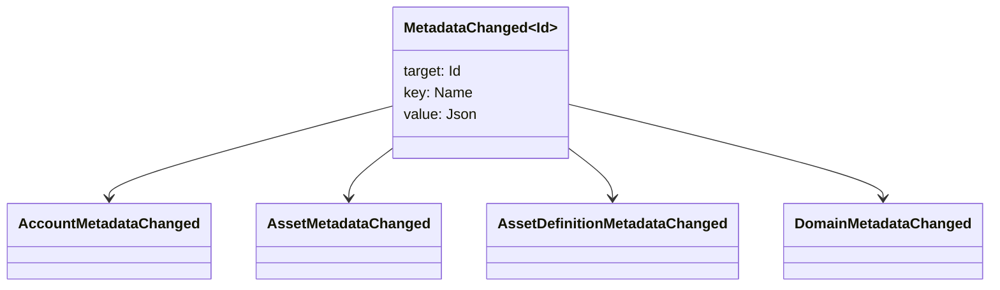

# Métadonnées {#metadata}

Les métadonnées sont une carte clé-valeur vérifiée attachée aux objets du grand livre blockchain. Les clés sont des valeurs `Name` et les valeurs sont des charges utiles JSON (`Json`).

Les objets suivants peuvent contenir des métadonnées :

- domaines
- comptes
- actifs
- définitions des actifs
- NFTs
- RWAs
- déclencheurs
- transactions

Utilisez des métadonnées pour de petits champs descriptifs ou d'indexation qui appartiennent à l'état du registre de la blockchain. Les charges utiles volumineuses doivent être stockées en dehors du WSV et référencées par une valeur de résumé cryptographique, URI, ou un chemin SoraFS.

Pour des conseils sur le choix des métadonnées, des ressources, NFTs, RWAs, ou du stockage hors chaîne, voir [Choix de stockage des métadonnées et du registre blockchain](/fr/guide/configure/metadata-and-store-assets.md).

## Essayez-le sur Taira {#try-it-on-taira}

Les métadonnées sont visibles via les lectures normales des ressources. Cette commande répertorie les définitions d'actifs Taira qui ont actuellement des métadonnées :

```bash
curl -fsS 'https://taira.sora.org/v1/assets/definitions?limit=100' \
  | jq '.items[]
    | select((.metadata | length) > 0)
    | {id, name, metadata}'
```

Utilisez le même modèle pour les domaines et les comptes :

```bash
curl -fsS 'https://taira.sora.org/v1/domains?limit=20' \
  | jq '.items[] | select((.metadata // {} | length) > 0)'

curl -fsS 'https://taira.sora.org/v1/accounts?limit=20' \
  | jq '.items[] | select((.metadata // {} | length) > 0)'
```

Considérez une sortie vide comme un résultat valide. Cela signifie que la page actuelle des objets Taira ne contient pas de métadonnées, et non que le point de terminaison API a échoué.

## Mise à jour des métadonnées {#updating-metadata}

Les métadonnées sont modifiées avec les opérations d'instruction Iroha :

- [`SetKeyValue`](/fr/blockchain/instructions.md#setkeyvalue-removekeyvalue) insère ou remplace une clé
- [`RemoveKeyValue`](/fr/blockchain/instructions.md#setkeyvalue-removekeyvalue) supprime une clé

Le principal autorisé soumettant la transaction doit avoir la permission requise par le validateur d'exécution logiciel actif. Pour la surface de permission par défaut, voir [Jetons de permission](/fr/reference/permissions.md).

## Événements {#events}

Les événements de données sont émis lorsque les métadonnées changent. La charge utile générique de l'événement est `MetadataChanged<Id>` :



Utilisez [filtres d'événements de données](/fr/blockchain/filters.md#data-event-filters) pour vous abonner uniquement aux événements de métadonnées pour le type d'entité ou l'ID d'objet qui importe pour une intégration.

## Requêtes {#queries}

Les métadonnées sont renvoyées dans le cadre de l'objet interrogé. Par exemple, utilisez [`FindAccountById`](/fr/reference/queries.md#accounts-and-permissions), [`FindDomainById`](/fr/reference/queries.md#domains-and-peers), ou [`FindAssetDefinitionById`](/fr/reference/queries.md#assets-nfts-and-rwas). Utiliser [`FindNfts`](/fr/reference/queries.md#assets-nfts-and-rwas) ou [`FindNftsByAccountId`](/fr/reference/queries.md#assets-nfts-and-rwas) pour NFTs, et [`FindRwas`](/fr/reference/queries.md#assets-nfts-and-rwas) pour RWA beaucoup. Ensuite, lisez le champ de métadonnées de l'objet. NFT les réponses aux requêtes exposent le NFT `content` carte en tant que métadonnées de l'enregistrement.

Les clés de métadonnées font partie de l'état du grand livre blockchain, il faut donc les maintenir stables et éviter d'encoder les changements de version spécifiques à l'application dans le nom de la clé lorsqu'une valeur JSON peut porter cette version explicitement.
