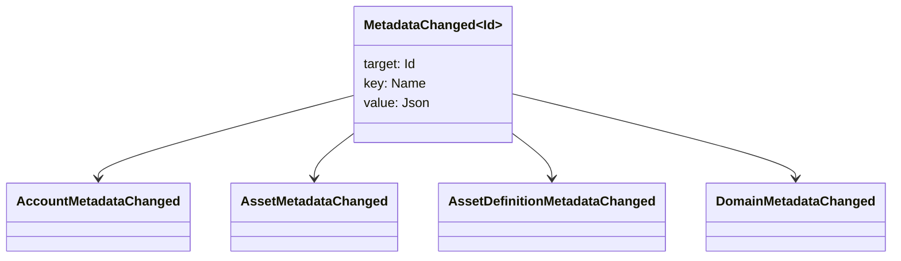

# Les métadonnées {#metadata}

Les métadonnées sont une carte de la valeur des clés vérifiée attachée aux objets du registre. `Name` Les valeurs et les valeurs JSON (`Json`) des charges utiles.

Les objets suivants peuvent contenir des métadonnées:

- les domaines
- comptes
- actifs
- définitions d'actifs
- NFTs
- RWAs
- déclencheurs
- des opérations

Utilisez des métadonnées pour de petits champs descriptifs ou d'indexation qui appartiennent à l'état du registre. Les grandes charges utiles doivent être stockées en dehors de la WSV et référencées par un digest, URI, ou SoraFS chemin.

Pour les conseils sur le choix des métadonnées, des actifs, NFTs, RWAs, ou de stockage hors chaîne, voir [Les options de stockage des métadonnées et du registre](/fr/guide/configure/metadata-and-store-assets.md).

## Essayez le sur Taira {#try-it-on-taira}

Les métadonnées sont visibles à travers des lectures de ressources normales. Cette commande répertorie les définitions d'actifs Taira qui contiennent actuellement des métadonnées:

```bash
curl -fsS 'https://taira.sora.org/v1/assets/definitions?limit=100' \
  | jq '.items[]
    | select((.metadata | length) > 0)
    | {id, name, metadata}'
```

Utilisez le même schéma pour les domaines et comptes:

```bash
curl -fsS 'https://taira.sora.org/v1/domains?limit=20' \
  | jq '.items[] | select((.metadata // {} | length) > 0)'

curl -fsS 'https://taira.sora.org/v1/accounts?limit=20' \
  | jq '.items[] | select((.metadata // {} | length) > 0)'
```

Traiter la sortie vide comme un résultat valide. Cela signifie que la page actuelle des objets Taira ne contient pas de métadonnées, ce qui ne veut pas dire que le point final n'a pas fonctionné.

## Mise à jour des métadonnées {#updating-metadata}

Les métadonnées sont modifiées par Iroha Instructions spéciales:

- [`SetKeyValue`](/fr/blockchain/instructions.md#setkeyvalue-removekeyvalue) insère ou remplace une clé.
- [`RemoveKeyValue`](/fr/blockchain/instructions.md#setkeyvalue-removekeyvalue) enlève une clé

L'autorité qui soumet la transaction doit avoir l'autorisation requise par le validateur d'exécution actif. Pour la surface d'autorisations par défaut, voir [Permission Tokens](/fr/reference/permissions.md).

## Les événements {#events}

Les événements de données sont émis lorsque les métadonnées changent. `MetadataChanged<Id>`:



Utilisez les filtres d'événements de données [ ](/fr/blockchain/filters.md#data-event-filters) pour souscrire uniquement à des événements de métadonnées pour le type d'entité ou l'objet ID qui sont importants pour une intégration.

## Questions posées {#queries}

Les métadonnées sont renvoyées dans le cadre de l'objet recherché. Par exemple, utilisez [`FindAccountById`](/fr/reference/queries.md#accounts-and-permissions), [`FindDomainById`](/fr/reference/queries.md#domains-and-peers) ou [`FindAssetDefinitionById` ](/fr/reference/queries.md#assets-nfts-and-rwas). Utilisez [`FindNfts`](/fr/reference/queries.md#assets-nfts-and-rwas) ou [`FindNftsByAccountId`](/fr/reference/queries.md#assets-nfts-and-rwas) pour NFTs, et [`FindRwas`](/fr/reference/queries.md#assets-nfts-and-rwas) pour les lots RWA. Ensuite, lisez le champ de métadonnées de l'objet. Les réponses à la requête NFT exposent la carte NFT `content` comme les métadonnées enregistrées.

Les clés de métadonnées font partie de l'état du registre, alors gardez-les stables et évitez d'encoder la version spécifique à l'application dans le nom de la clé lorsqu'une valeur JSON peut contenir explicitement cette version.
