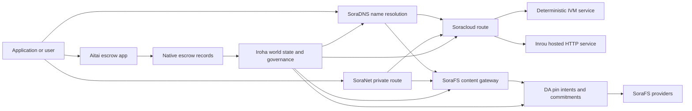

# SORA Nexus Services {#sora-nexus-services}

SORA Nexus ajoute des avions de service face à l'application autour Iroha 3. Ces services ne sont pas des registres séparés, ils sont ancrés par Iroha État mondial, Norito les manifestes, les registres de gouvernance et Torii les familles de la route.

La disponibilité dépend de la construction du nœud et du profil réseau. Utilisez [`/openapi`](/fr/reference/torii-endpoints.md#app-and-sora-route-families) sur le nœud cible comme liste d'autorité des itinéraires activés.

## Carte des composants {#component-map}

|Le composant |Rôle |Surfaces principales |
| ---------------------- | ------------------------------------------------------------------------------------------------------------------------------------------- | ---------------------------------------------------------------------------------------- |
|Soracloud |Déploiement des applications, services hébergés, mode privé/état d'exécution et contrôle du cycle de vie des services. |`/v1/soracloud/`, `/api/`, `iroha app soracloud ...` |
|À l' intérieur | Soracloud hébergé HTTP temps d'exécution pour les révisions de service qui nécessitent un HTTP Un avion.                                                            |Soracloud Configuration de l'heure d'exécution, annonces sur les capacités d'hébergement, réplique de l'état de l'exécution |
|SoraNet |La confidentialité et la couverture des transports pour les circuits, le trafic en relais, VPN, les sessions de connexion et les itinéraires de streaming. |`/v1/connect/`, `/v1/vpn/`, SoraNet métadonnées de la route |
|La disponibilité des données (DA) |La preuve de disponibilité, l'engagement et la couche d'intention pour les charges utiles référencées par les voies Nexus, les manifestes SoraFS et les flux de preuves. |`/v1/da/`, `FindDaPinIntent`, `[sumeragi.da]` |
|SoraFS |Tissu de stockage adressé au contenu pour les manifestes, les charges utiles CAR, le contenu fixé, les sorties par passerelle et les flux de preuve de récupérabilité. |`/v1/sorafs/`, `/sorafs/`, `FindSorafsProviderOwner` |
|SoraDNS |La couche de dénomination déterministique et d'attestation de résolution pour les services et le contenu hébergés dans SORA. |`/v1/soradns/`, `/soradns/`, événements du répertoire de résolutions |
|Aitai |Corridor de règlement des actifs au niveau de l'application, soutenu par des registres fiduciaires natifs et non par un registre séparé. | `OpenAssetEscrow`, `FindAssetEscrow*`, `EscrowEventFilter`, Kotodama `escrow_*` bâtiments |



## Les flux courants {#common-flows}

### L' application Split hébergée {#hosted-split-application}

Une application mixte typique utilise toutes les pièces ensemble:

1. Les actifs statiques de frontend sont emballés et fixés à travers SoraFS.
2. L'hôte public, par exemple `<app>.sora`, est enregistré par l'intermédiaire de SoraDNS.
3. Les routes Soracloud `/api/v1/search` ou `/api/v1/stream` vers un service Inrou HTTP.
4. Les routes Soracloud `/api/auth` et `/api/v1/user` aux gestionnaires déterministes IVM.
5. Les clients qui ont besoin de confidentialité peuvent accéder au même contenu ou à l'itinéraire API via un circuit SoraNet.

|Le chemin .|Avion d' arrière|Pourquoi ?|
| ----------------- | --------------------- | ------------------------------------------------- |
| `/`               |SoraFS contenu statique |La mise en cache de la racine et des passerelles du contenu reproduisable |
|`/assets/*` |SoraFS contenu statique |Les actifs adressés au contenu et les preuves manifestes |
|`/api/auth*` |Soracloud IVM |L' état de l' autorité et du défi au portefeuille en toute sécurité |
|`/api/v1/user*` |Soracloud IVM |Les mutations d' état sensibles à la gouvernance |
|`/api/v1/search*` |Soracloud À l'intérieur |Le service HTTP en direct, le cache, SSE ou l'état de collection |

### Publiation du contenu {#content-publication}

La publication SoraFS produit des artefacts durables avant qu'un nom ne les pointe:

1. Faites une charge utile ou un répertoire.
2. Mettez-le dans un CAR d'archives et le plan de pièces.
3. Construire un manifeste Norito avec des données sur les politiques de pin et la gouvernance.
4. Il est nécessaire de soumettre le manifeste à Torii.
5. Enregistrer l'intention ou l'engagement de disponibilité du pin DA lorsque le profil cible exige une preuve explicite.
6. Lier le manifeste à un nom SoraDNS ou à une route statique d'avant-plan Soracloud.

### Route privée de ramassage ou de diffusion {#private-fetch-or-streaming-route}

SoraNet peut s'asseoir en face de SoraFS ou Soracloud:

1. Le client résout le nom ou le manifeste.
2. Un répertoire de garde ou un manifeste de route choisit les relais d'entrée et de sortie.
3. Le trafic est rembourré et envoyé à travers le circuit SoraNet.
4. Le relais de sortie atteint la passerelle SoraFS, le cours d'eau Torii ou la route Soracloud.

## Aitai {#aitai}

Aitai est le corridor d'applications SORA pour les règlements de marché, où un acheteur et un vendeur coordonnent un paiement hors chaîne tandis que Iroha contrôle la détention des actifs en chaîne. Il devrait utiliser la famille d'instructions de fiducie native au lieu d'un compte en fiducie détenu par un contrat pour les nouveaux flux de garde des actifs numériques.

Le vendeur ouvre une offre avec `OpenAssetEscrow`, l'acheteur accepte et marque le paiement en dehors de la chaîne avec `AcceptAssetEscrow` et `MarkEscrowPaymentSent`, et le vendeur libère avec `ReleaseAssetEscrow` ou annule avant que le paiement ne soit marqué Si l'acheteur et le vendeur sont en désaccord, l'une ou l'autre des parties peut ouvrir un différend et un résolveur avec `CanResolveEscrowDispute` peut diviser le montant bloqué.

Pour le cycle de vie complet, les verrous d'actifs génériques, l'escrow anonyme, les requêtes, les événements et les exemples Rust, voir [Native Asset Escrow ](/fr/blockchain/escrow.md).

|La surface de l' Aitai|Utilisez-le pour |
| ------------------------------------------------------------------------------------------------------------------------------------------------------------- | ----------------------------------------------------------------------------------------- |
| `OpenAssetEscrow`, `AcceptAssetEscrow`, `MarkEscrowPaymentSent`, `ReleaseAssetEscrow`, `CancelAssetEscrow`                                                    |Offres transparentes d'actifs numériques, y compris les flux de règlement désignés en XOR. |
| `OpenAnonymousAssetEscrow`, `AcceptAnonymousAssetEscrow`, `MarkAnonymousEscrowPaymentSent`, `ReleaseAnonymousAssetEscrow`, `CancelAnonymousAssetEscrow`       |Offres protégées lorsque les mouvements de financement et de clôture sont effectués par des pièces jointes. |
|`OpenEscrowDispute`, `ResolveEscrowDispute`, `OpenAnonymousEscrowDispute`, `ResolveAnonymousEscrowDispute` |L'introduction de différends et la résolution à l'instance judiciaire. |
|`FindAssetEscrowById`, `FindAssetEscrowsBySeller`, `FindAssetEscrowsByBuyer`, `FindAssetEscrowsByStatus` |Pages d'état des applications, tâches de réconciliation et outils de support. |
|`EscrowEventFilter` |Les abonnements à escrow transparents en direct par identité d'escrow, vendeur, acheteur, statut ou type d'événement. |
| Kotodama `escrow_open_offer`, `escrow_accept`, `escrow_mark_payment_sent`, `escrow_release`, `escrow_cancel`, `escrow_open_dispute`, `escrow_resolve_dispute` |Kotodama appels contractuels soutenus par les systèmes de garantie V1. |

Pour l'utilisation publique Taira ou Minamoto, considérez la ligne de paiement hors chaîne et tout flux de travail d'assistance ou de justice comme une politique d'application. Iroha enregistre l'état de conservation, les événements du cycle de vie, les hachages des preuves et le mouvement final des actifs; il ne vérifie pas par lui-même le règlement fiduciaire.

## Vérifiez un nœud cible {#check-a-target-node}

Avant d'utiliser des exemples de cette page, confirmez que la famille des routes existe sur le nœud que vous ciblez:

```bash
export TORII_URL=https://taira.sora.org

curl -fsS "$TORII_URL/openapi.json" \
  | jq '.paths | keys[] | select(test("^/v1/(soracloud|sorafs|soradns|connect|vpn|da)/"))'

curl -fsS "$TORII_URL/status" | jq .
```

Si `/openapi.json` n'est pas exposé par le profil, essayez `/openapi`. La disponibilité exacte du chemin dépend des fonctionnalités de la construction et de la configuration du réseau.

### Taira Les contrôles de fumée à lire uniquement {#taira-read-only-smoke-checks}

Le point d'extrémité public Taira est utile pour les vérifications côté lecture, mais ne l'utilisez pas pour les exemples de mutation à moins que vous n'exploitiez un compte autorisé et que vous ayez l'intention de modifier l'état live.

```bash
export TORII_URL=https://taira.sora.org

curl -fsS "$TORII_URL/status" \
  | jq '{version: .build.version, peers, blocks, lanes: (.teu_lane_commit | length)}'

curl -fsS "$TORII_URL/v1/connect/status" | jq '{enabled, sessions_active}'

curl -fsS "$TORII_URL/v1/vpn/profile" \
  | jq '{available, relay_endpoint, supported_exit_classes}'

curl -fsS "$TORII_URL/v1/sorafs/storage/state" \
  | jq '{bytes_capacity, bytes_used, pin_queue_depth, por_inflight}'

curl -fsS -H 'Accept: application/json' "$TORII_URL/v1/soracloud/status" \
  | jq '.control_plane | {service_count, services: [.services[] | {service_name, current_version}]}'
```

Taira peut exposer des routes du plan de contrôle spécifiques au déploiement qui ne sont pas énumérées dans la carte de trajectoire OpenAPI. Traiter `/openapi` comme étant le contrat principal généré API, puis confirmer toute route spécifique au déploissement directement avant de la documenter en direct.

## Soracloud {#soracloud}

Soracloud est le plan de contrôle de l'application SORA. Il suit les paquets de déploiement, les révisions de service, le routage, l'état de mise en œuvre, les entrées de configuration autorisées, les secrets de service cryptés, les enregistrements du registre des modèles, les séances d'inférence privées et les reçus en cours d'exécution.

Soracloud utilise deux avions d'exécution:

|Avion d' exécution |Temps d' exécution |Utilisez-le pour |
| ---------------------- | ------- | -------------------------------------------------------------------------------------------- |
|`DeterministicService` |`Ivm` |L'auteur, l'état du coffre-fort, les lectures certifiées, les gestionnaires de boîtes postales commandés, les mutations sensibles à la gouvernance |
|`HttpService` |`Inrou` |En direct HTTP APIs, collecteur de travail lourd, services sauvegardés par cache, SSE, flux assisté par navigateur |

Le plan de contrôle est autoritaire. Les commandes déployer, mettre à niveau, renverser, configurer, secrètement, modèle et statut sont soumises via Torii et lisent l'état du monde engagé; elles ne dépendent pas d'un miroir local séparé CLI. Le routage public est basé sur le préfixe le plus long, de sorte qu'un hébergeur enregistré peut diviser le trafic entre les routes hébergées HTTP et les routes déterministes API.

### Établissez une application Split {#scaffold-a-split-app}

Le modèle split-app crée un frontend statique plus un service en direct hébergé API et un service déterministe vault/API:

```bash
iroha app soracloud app init \
  --template split-app \
  --app-name solswap_indexer \
  --app-version 0.1.0 \
  --public-host solswap-indexer.sora \
  --output-dir ./apps/solswap-indexer

iroha app soracloud app local-plan \
  --manifest ./apps/solswap-indexer/app_manifest.json

iroha app soracloud app doctor \
  --manifest ./apps/solswap-indexer/app_manifest.json
```

`local-plan` imprime la fraction de route, les manifestes de service enfant, les chemins du script de l'espace de travail et le mode de publication anticipé. `doctor` valide le contrat de sortie local avant que vous n'impliquiez Torii.

### Déploiement et inspection de l'état des applications {#deploy-and-inspect-app-state}

```bash
export SORACLOUD_TORII_URL=https://<soracloud-enabled-torii>

iroha app soracloud app deploy \
  --manifest ./apps/solswap-indexer/app_manifest.json \
  --torii-url "$SORACLOUD_TORII_URL"

iroha app soracloud app status \
  --manifest ./apps/solswap-indexer/app_manifest.json \
  --torii-url "$SORACLOUD_TORII_URL"
```

Pour un service déjà déployé, utilisez des commandes de portée de service:

```bash
iroha app soracloud status \
  --service-name solswap_indexer_live \
  --torii-url "$SORACLOUD_TORII_URL"

iroha app soracloud rollback \
  --service-name solswap_indexer_live \
  --target-version 0.1.0 \
  --torii-url "$SORACLOUD_TORII_URL"
```

### Le matériel config et le secret {#config-and-secret-material}

Les entrées config Soracloud et secrètes font partie de l'état d'implémentation autorisé. Le déploiement, la mise à niveau et le renouvellement échouent à fermer lorsque les liens config ou secrets requis manquent ou sont incompatibles avec les manifestes actifs.

```bash
iroha app soracloud config-set \
  --service-name solswap_indexer_live \
  --config-name indexer/public_config \
  --value-file ./config/public-config.json \
  --torii-url "$SORACLOUD_TORII_URL"

iroha app soracloud secret-set \
  --service-name solswap_indexer_live \
  --secret-name indexer/api_key \
  --secret-file ./secrets/api-key.envelope.json \
  --torii-url "$SORACLOUD_TORII_URL"
```

Utilisez l'aide CLI pour obtenir les signaux d'identification exacts exigés par votre profil:

```bash
iroha app soracloud config-set --help
iroha app soracloud secret-set --help
```

## Résultats de l'enquête {#inrou}

Inrou est l'hôte. HTTP temps d'exécution utilisé par Soracloud. Une Iroha le nœud avec l'embedded Soracloud projets en cours d'exécution admis Soracloud l'état dans un plan de matérialisation local, démarre les réplices assignées du service hébergé en tant que services de loopback; et rapporte une réplique de l'état d'exécution dans le modèle autorisé.

Utilisez Inrou pour les charges de travail qui nécessitent une surface HTTP en direct, telles que les flux APIs lourds avec le collecteur, SSE, les manipulateurs protégés par cache ou les services assistés par un navigateur.

### Exigences relatives à l'exécution {#runtime-requirements}

- Le temps d'exécution du manifeste de conteneur doit être `Inrou`.
- Le plan d'exécution du manifeste de service doit être `HttpService`.
- `HttpService + Inrou` nécessite exactement un `PersistentRootLeaseVolume` monté sur `/`.
- Les services Inrou répliqués ont également besoin d'un service partagé ou d'un stockage confidentiel de location lorsqu'ils conservent l'état partagé changeant.
- Les nœuds d'hébergement de production devraient annoncer la capacité réelle d'Inrou au lieu de fonctionner uniquement en tant que proxy.

### Un fragment manifeste {#manifest-fragment}

L'exemple ci-dessous montre la forme des deux manifestes: il s'agit d'un fragment, pas d'un ensemble complet de déploiements.

```jsonc
// container_manifest.json
{
  "schema_version": 1,
  "runtime": { "runtime": "Inrou", "value": null },
  "bundle_path": "/bundles/solswap-indexer.inrou",
  "entrypoint": "/app/bin/launch-indexer.sh",
  "args": [],
  "env": {
    "RUST_LOG": "info",
  },
  "inrou": {
    "schema_version": 1,
    "guest_os": { "guest_os": "DebianSlim", "value": null },
    "guest_images": {
      "x86_64": {
        "kernel_image_path": "/inrou/x86_64/vmlinux",
        "rootfs_image_path": "/inrou/x86_64/rootfs.ext4",
        "initrd_image_path": null,
      },
      "aarch64": {
        "kernel_image_path": "/inrou/aarch64/vmlinux",
        "rootfs_image_path": "/inrou/aarch64/rootfs.ext4",
        "initrd_image_path": null,
      },
    },
  },
  "lifecycle": {
    "start_grace_secs": 60,
    "stop_grace_secs": 30,
    "healthcheck_path": "/api/indexer/v1/health",
  },
}
```

```jsonc
// service_manifest.json
{
  "schema_version": 1,
  "service_name": "solswap_indexer_live",
  "service_version": "0.1.0",
  "execution_plane": { "execution_plane": "HttpService", "value": null },
  "replicas": 2,
  "route": {
    "host": "solswap-indexer.sora",
    "path_prefix": "/api/v1/search",
    "service_port": 8080,
    "visibility": { "visibility": "Public", "value": null },
    "tls_mode": { "tls": "Required", "value": null },
  },
  "lease_volumes": [
    {
      "volume_name": "root_disk",
      "kind": {
        "lease_volume": "PersistentRootLeaseVolume",
        "value": null,
      },
      "storage_class": { "storage_class": "Warm", "value": null },
      "mount_path": "/",
      "max_total_bytes": 8589934592,
    },
    {
      "volume_name": "index_state",
      "kind": { "lease_volume": "ServiceLeaseVolume", "value": null },
      "storage_class": { "storage_class": "Warm", "value": null },
      "mount_path": "/var/lib/solswap-indexer",
      "max_total_bytes": 1073741824,
    },
  ],
}
```

Au moment de l'exécution, chaque volume de location monté est exposé à travers des variables environnementales dérivées du nom du volume:

```text
SORACLOUD_LEASE_VOLUME_ROOT_DISK_DIR
SORACLOUD_LEASE_VOLUME_ROOT_DISK_MOUNT_PATH
SORACLOUD_LEASE_VOLUME_INDEX_STATE_DIR
SORACLOUD_LEASE_VOLUME_INDEX_STATE_MOUNT_PATH
```

## SoraNet {#soranet}

SoraNet est la couche de confidentialité et de transport. Elle fournit des itinéraires basés sur le relais pour le trafic qui ne devraient pas se connecter directement à la passerelle ou au service cible. La conception du transport utilise les rôles de relais d'entrée, de milieu et de sortie, le transport QUIC, une poignée de main hybride basée sur le bruit, la négociation des capacités, les métadonnées de l'annuaire de relais et les cellules rembourrées de taille fixe.

Dans les déploiements Nexus, SoraNet peut transporter des retransmissions de contenu, du trafic de passerelle, des sessions VPN ou Connect et des routes de streaming Norito. Les entrées de répertoire peuvent marquer des relais qui supportent `norito-stream`, ce qui permet aux clients de préférer les routes appropriées pour Torii RPC ou le trafic en continu.

### Configuration de diffusion {#streaming-configuration}

Le profil Nexus permet la fourniture de SoraNet pour les itinéraires de diffusion:

```toml
[streaming]
feature_bits = 0b11

[streaming.soranet]
enabled = true
exit_multiaddr = "/dns/torii/udp/9443/quic"
padding_budget_ms = 25
access_kind = "authenticated"
provision_spool_dir = "./storage/streaming/soranet_routes"
provision_spool_max_bytes = 0
provision_window_segments = 4
provision_queue_capacity = 256
```

Utiliser `access_kind = "read-only"` pour les itinéraires de contenu qui ne nécessitent pas d'authentification du spectateur. Utilisez `authenticated` lorsque le relais de sortie doit faire respecter les billets ou l'identité du spectator avant de rejoindre Torii ou un service hébergé.

### SoraNet-Connaître SoraFS Apporter {#soranet-aware-sorafs-fetch}

L'extrait SoraFS CLI peut émettre un manifeste proxy local et envoyer des métadonnées de route SoraNet pour les extensions de navigateur ou les adaptateurs SDK:

```bash
sorafs_cli fetch \
  --plan artifacts/payload_plan.json \
  --manifest-id 7bb2...9d31 \
  --provider name=alpha,provider-id=9f5c...73aa,base-url=https://gw-alpha.example.org/,stream-token="$(cat alpha.token)" \
  --output artifacts/payload.bin \
  --json-out artifacts/fetch_summary.json \
  --local-proxy-manifest-out artifacts/proxy_manifest.json \
  --local-proxy-mode bridge \
  --local-proxy-norito-spool storage/streaming/soranet_routes \
  --local-proxy-kaigi-spool storage/streaming/soranet_routes \
  --local-proxy-kaigi-policy authenticated \
  --max-peers=2 \
  --retry-budget=4
```

Les rapports du fournisseur d'enregistrements sommaires, les reçus partiels, les métadonnées proxy locales et les paramètres de route utilisés pour la récupération.

## Disponibilité des données (DA) {#data-availability-da}

DA est la couche de preuve de disponibilité pour les charges utiles qui sont trop grandes, trop sensibles à la vie privée ou trop spécifiques au service pour être placées directement dans l'état du monde. Il enregistre les engagements déterministes et les obligations de récupération afin que les validateurs, les passerelles et les clients puissent se mettre d'accord sur les octets qui ont été promis, quelle politique s'applique et quelles preuves ont été observées.

DA ne remplace pas Kura ou SoraFS:

- Kura stocke les données de récupération des blocs et du consensus finalisées.
- SoraFS stocke et sert les octets adressés au contenu, les charges utiles CAR et les manifestes.
- DA enregistre les engagements, les politiques de preuve, les ouvertures de preuve et les intentions de pin qui permettent à ces octets d'être programmées, vérifiées et liées à l'état du registre.

Utiliser DA lorsqu'une application ou une voie Nexus a besoin d'une promesse visible dans le registre selon laquelle les données hors chaîne restent récupérables. Les exemples courants comprennent les engagements de charge utile de la voie pour les flux de règlement, les intentions de pin SoraFS pour le contenu publié, les paquets de preuves qui doivent être conservés pour une vérification ultérieure, ainsi que les objets d'application dont l'état public devrait être un digeste plutôt que la charge utile complète.

### Cycle de vie {#lifecycle}

|Étapes |Ce qui est enregistré |
| ---------- | ----------------------------------------------------------------------------------------------------------------------------------------------------- |
|L' intention |Un billet, une référence manifeste, un pseudonyme, une référence à la voie/à l'époque/à la séquence, une politique de conservation ou une cible de réplication |
|Engagement |Digérer du matériel qui lie le manifeste, la charge utile de la voie, le paquet d'épreuves ou la racine du contenu au registre visible. |
|Des preuves .|Les votes sur la disponibilité, les ouvertures de preuve, les attestations des fournisseurs ou toute autre preuve spécifique au profil acceptée par le réseau cible. |
|Une question |Les vérifications d'intention à l'encre par le biais de `FindDaPinIntentByTicket`, `FindDaPinIntentByManifest`, `FindDaPinIntentByAlias` ou `FindDaPinIntentByLaneEpochSequence`. |

Un flux de publication typiquement soutenu par DA est:

1. Construire ou recevoir la charge utile en dehors du WSV, par exemple un fichier SoraFS CAR ou une charge utile de voie Nexus.
2. La charge utile doit être décrite dans un manifeste Norito ou un enregistrement d'engagement spécifique à l'itinéraire.
3. Envoyer le manifeste, l'intention de pin ou l'engagement via `/v1/da/*` lorsque cette famille de routes est activée, ou par le chemin de transaction signé du réseau.
4. Laissez les validateurs ou les fournisseurs de disponibilité recueillir les éléments de preuve requis par la politique d'épreuve active.
5. Demandez l'intention ou l'engagement de la broche résultant avant de promouvoir un alias, une preuve de règlement ou une route de passerelle qui dépend de la charge utile.

### Modèle algorithmique {#algorithmic-model}

DA transforme une charge utile en un engagement signé, protégé par la répétition, indexé par bloc. Les algorithmes importants sont déterministiques afin que les validateurs et les passerelles puissent recompter les mêmes digests à partir des mêmes octets.

1. Canonisez la charge utile envoyée. Torii accepte une demande d'ingestion avec `(lane_id, epoch, sequence)`, octets de charge utile, métadonnées de compression, taille de pièce, profil d'effacement, politique de conservation et signature du soumissionnaire. Le nœud décompresse les charges utiles gzip, deflate ou Zstandard lorsqu'il est demandé, puis vérifie que la longueur canonique du octet est égale à `total_size`.
2. Valider les paramètres de la voie et des pièces. La voie doit exister dans le catalogue de la voie Nexus. `chunk_size` doit avoir une puissance non zéro de deux, au moins deux octets, et ne pas dépasser le maximum configuré. Le profil d'effacement doit inclure des fragments de données et au moins deux fragments de parité. Le catalogue de voies sélectionne le schéma d'épreuve, soit `merkle_sha256` ou `kzg_bls12_381`.
3. Appliquer la politique de réseau. Le nœud impose la ligne de base de réplication et de rétention configurée pour la classe blob. Les métadonnées publiques doivent rester en texte clair; les métadonnées de gouvernance uniquement sont cryptées avec la clé de métadonnées configurée du nœud avant qu'elles ne soient écrites dans le manifeste.
4. La charge utile canonique est chargée d'un profil de taille fixe dérivé de `chunk_size`. Torii Compute le détail de la charge utile, la racine de l'arbre de preuve de récupérabilité et les engagements par morceau. BLAKE3 les engagements sur leurs octets.
5. Ajouter des engagements d'effacement. Les morceaux sont regroupés en bandes de `data_shards`. Les cellules manquantes dans la bande finale sont rembourrées à zéro pour le calcul de la parité. RS(16) La parité crée des fragments de parité rangée / globale; optionnel `row_parity_stripes` ajouter la parité de la bande de style colonne sur toute la matrice. Les engagements des fragments de parité sont des digestes BLAKE3 de symboles de petit enjeu `u16`.
6. Construisez le manifeste. `DaManifestV1` enregistre la voie, l'époque, la classe de blobs, le codec, le dépistage de la charge utile, la racine des morceaux, la taille du morceau, le profil d'effacement, la politique de rétention, la cotation de loyer, les engagements des morceaux, l'engagement optionnel IPA, les métadonnées et le temps d'émission. Le billet de stockage est déterministe: le nœud hashes d'abord un modèle de manifeste avec un billet vide, puis rédige cette empreinte digitale comme la dernière `storage_ticket`.
7. Rejetez les conflits de répétition. La clé de répètement est `(lane_id, epoch, sequence, manifest_fingerprint)`. Un double avec la même empreinte digitale est idempotent. Une séquence obsolète ou la même séquence avec une empreinte digitale différente est rejetée.
8. Émettre des artefacts signés. Torii calcule un engagement PDP, signe un `DaIngestReceipt`, construit un `DaCommitmentRecord` et écrit des artefaits de bobine pour le manifeste, l'engagement PDP, le dossier d'engagement, le calendrier d'engaissement, l'intention de pin, le fichier de réception et le journal des reçus. Le curseur de réception avance monotoniquement par `(lane_id, epoch)`.

Les enregistrements d'engagement sont ce que portent les blocs.

- tracé, époque et séquence
- le blob de l'appelant ID et le hash du manifeste canonique
- Système d'étanchéité à la voie
- racine en morceaux
- l'engagement facultatif KZG pour les voies de route KZG
- PDP/digest de la preuve
- classe de conservation et billet d'entreposage
- Torii Signe de reconnaissance DA

Avant qu'un bloc n'intègre des enregistrements DA, le parcours d'assemblage du bloc valide le paquet:

- `(lane_id, epoch, sequence)` doit être unique à l'intérieur de la boîte.
- Les hashes manifestes doivent être non zéro et uniques à l'intérieur du paquet.
- Le schéma de preuve d'engagement doit correspondre à la politique de voie configurée.
- Les lignes Merkle rejettent les engagements KZG; les lignes KZG exigent un engagement non nul KZG.
- Les intentions de pin sont canonisées, triées et filtrées par voie, hash manifeste, billet de stockage, compte propriétaire et règles d'alias de collision.

L'en-tête de bloc stocke des haches pour les politiques de preuve DA, les engagements et les intentions de pin. Pour les preuves d'adhésion, le paquet d'engagement expose également une racine Merkle dont les feuilles sont des haches de valeurs canoniques Norito codées `DaCommitmentRecord` Les nœuds parentaux combinent la concatenation des enfants de gauche et de droite; une feuille étrange est promue inchangée dans la couche suivante.

### Vérification de la preuve {#proof-verification}

`/v1/da/commitments/prove` peut produire une preuve d'un engagement dans un bloc. La preuve contient l'engagement, la hauteur du bloc, l'index dans le paquet, le hachage de paquet, la longueur du paquet, les racines Merkle et le chemin de parenté.

1. Le hash du paquet de preuve correspond au hash d'engagement DA de l'en-tête du bloc.
2. La hauteur du bloc de la preuve correspond à l'en-tête du bloc référencé.
3. L'indice est en limites et l'engagement équivaut à l'entrée de groupe sur cet indice.
4. L'engagement est accepté par la politique d'étanchéité à la voie.
5. Le pliage du chemin des frères et sœurs à partir de la feuille d'engagement reconstruit la racine fournie.
6. La racine reconstituée est égale à la racine de l'ensemble.

Cela prouve qu'un engagement spécifique en matière de disponibilité a été inclus dans une charge utile d'un bloc spécifique; cela ne prouve pas que chaque réplique soit actuellement en ligne. La récupérabilité en direct est vérifiée séparément par l'intermédiaire de recouvrements du fournisseur SoraFS, des contrôles PDP/PoTR ou des preuves de disponibilité spécifiques à un profil.

### Interaction par consensus {#consensus-interaction}

DA est relié à Sumeragi par la diffusion fiable (RBC), mais ce n'est pas un deuxième protocole de finalisation. RBC répand et récupère les charges utiles des propositions: le proposant annonce une session pour `(height, view, payload_hash)`, des blocs d'échange de pairs, et les signaux `READY`/`DELIVER` suivent si suffisamment de validateurs ont observé la même charge utile.

Dans Iroha 3, un homologue considère la charge utile de bloc en attente disponible lorsqu'il:

- le bloc local en attente hash des octets au hash de la charge utile attendue, ou
- RBC a récupéré une charge utile correspondant au hash du bloc, à la hauteur, à la vue et au hash de la charge utile.

Si aucune des deux conditions ne s'applique, les dossiers par rapport aux autres `missing_local_data`, continue d'essayer de récupérer la charge utile à travers RBC ou de bloquer la synchronisation, et rapporte le DA En ce qui concerne l'état et la télémétrie, la mise en DA Les signaux sont des conseils pour la finalité: un bloc se termine toujours à partir du certificat de mise en œuvre plus la charge utile locale correspondante, n'appartient pas à un DA certificat de quorum.

DA le temps élargit les fenêtres de récupération. DA Le délai de quorum est dérivé du bloc configuré et des temps d'engagement, puis multiplié par: `sumeragi.advanced.da.quorum_timeout_multiplier`. Le délai de disponibilité est `max(quorum_timeout, availability_timeout_floor_ms) * availability_timeout_multiplier`. Avant l'expiration de ce délai de disponibilité, le nœud favorise la récupération de la charge utile et évite une replanification prématurée; après son expiration, les voies normales de récupération et de changement de vue peuvent être poursuivies.

### Notes de l'exploitant {#operator-notes}

Les profils de consensus Iroha 3 comprennent la diffusion des charges utiles soutenues par RBC, les protections manifestes, la validation du paquet DA et la télémétrie de récupération. Le modèle partagé expose les limites `[sumeragi.da]` pour les engagements et les ouvertures de preuve par bloc, plus `[sumeragi.advanced.da]` multiplicateurs de délais pour le comportement du quorum et de la disponibilité. Gardez ces paramètres cohérents entre les validateurs dans un profil réseau.

Pour la découverte de l'itinéraire, commencez par le document OpenAPI du noeud:

```bash
curl -fsS "$TORII_URL/openapi.json" \
  | jq '.paths | keys[] | select(startswith("/v1/da/"))'
```

Utilisez le [référence de requête](/fr/reference/queries.md#nexus-data-availability-and-packages) pour le courant DA nom de la requête, et le [modèle de configuration par rapport aux pairs](/fr/reference/peer-config/) pour les locaux `[sumeragi.da]` Les boutons exposés par votre construction.

## SoraFS {#sorafs}

SoraFS est le tissu de stockage décentralisé axé sur le contenu. Il regroupe les octets en morceaux déterministes, les archives CAR et les manifestes Norito qui lient les racines du contenu, les profils de fragmentation, les politiques pin et les attestations de gouvernance. Les fournisseurs de stockage annoncent la capacité et la disponibilité du contenu, tandis que les passerelles vérifient les manifestes et les engagements en morceaux avant de diffuser le contenu.

Typique SoraFS Les utilisations comprennent les actifs d'application statique, les constructions de documentation, les paquets de zones, les références à des modèles ou à des artefacts; et les preuves de gouvernance. Iroha les expositions du modèle de données SoraFS événements de la porte d'entrée et un [`FindSorafsProviderOwner`](/fr/reference/queries.md#nexus-data-availability-and-packages) demande de résolution de la propriété du fournisseur.

### Emballez, manifestez- le, signez et soumettez {#pack-manifest-sign-and-submit}

```bash
cargo run -p sorafs_car --features cli --bin sorafs_cli -- \
  car pack \
  --input ./dist \
  --car-out artifacts/site.car \
  --plan-out artifacts/site.chunk-plan.json \
  --summary-out artifacts/site.car-summary.json

cargo run -p sorafs_car --features cli --bin sorafs_cli -- \
  manifest build \
  --summary artifacts/site.car-summary.json \
  --manifest-out artifacts/site.manifest.to \
  --manifest-json-out artifacts/site.manifest.json \
  --pin-min-replicas=3 \
  --pin-storage-class=warm \
  --pin-retention-epoch=42

SIGSTORE_ID_TOKEN=$(oidc-client fetch-token) \
cargo run -p sorafs_car --features cli --bin sorafs_cli -- \
  manifest sign \
  --manifest artifacts/site.manifest.to \
  --bundle-out artifacts/site.manifest.bundle.json \
  --signature-out artifacts/site.manifest.sig

cargo run -p sorafs_car --features cli --bin sorafs_cli -- \
  manifest submit \
  --manifest artifacts/site.manifest.to \
  --chunk-plan artifacts/site.chunk-plan.json \
  --torii-url "$TORII_URL" \
  --resolve-submitted-epoch=true \
  --authority=<i105-account-id> \
  --private-key-file ./secrets/authority.ed25519 \
  --summary-out artifacts/site.manifest.submit.json \
  --response-out artifacts/site.manifest.submit.body
```

Si `/v1/sorafs/pin/register` n'est pas parcouru sur le nœud cible, le CLI peut revenir à une soumission signée `/transaction` et attendre l'état d'un pipeline terminal.

### Vérifiez et apportez {#verify-and-fetch}

```bash
cargo run -p sorafs_car --features cli --bin sorafs_cli -- \
  proof verify \
  --manifest artifacts/site.manifest.to \
  --car artifacts/site.car \
  --chunk-plan artifacts/site.chunk-plan.json \
  --summary-out artifacts/site.verify.json

sorafs_cli fetch \
  --plan artifacts/site.chunk-plan.json \
  --manifest-id <manifest-digest-hex> \
  --provider name=primary,provider-id=<provider-id-hex>,base-url=https://gateway.example.org/,stream-token="$(cat provider.token)" \
  --output artifacts/site.fetch.tar \
  --json-out artifacts/site.fetch.json
```

### Vérifie de la preuve de récupérabilité {#proof-of-retrievability-checks}

Les exploitants peuvent inspecter et déclencher des vérifications de preuve pour les fournisseurs d'entreposage:

```bash
sorafs_cli por status \
  --torii-url "$TORII_URL" \
  --manifest <manifest-digest-hex> \
  --status=failed \
  --limit=20

sorafs_cli por trigger \
  --torii-url "$TORII_URL" \
  --manifest <manifest-digest-hex> \
  --provider <provider-id-hex> \
  --reason=latency_probe \
  --samples=48 \
  --auth-token artifacts/challenge_token.to
```

## SoraDNS {#soradns}

SoraDNS est la couche de nommage déterministique pour les services et le contenu de SORA. Il normalise les noms, ancrera les mises à jour du répertoire des résolveurs dans Iroha et distribue des paquets de zones ou de résolve signés par l'intermédiaire de SoraFS. Les résolveurs et les passerelles vérifient les documents d'attestation de résolution avant de faire confiance aux métadonnées de découverte.

Pour l'accès au navigateur, SoraDNS dérive les hôtes de passerelle d'un FQDN enregistré. L'hôte de vanité enregistré reste l'origine canonique de l'application, tandis que les profils de passerelle déployés exposent le navigateur et les routes de retour pour cette origine Torii.

### Formulaires d'hébergement {#host-forms}

|Formule |Exemple |Objectif |
| --- | --- | --- |
|Origine de la vanité |`https://<fqdn>/<path>` |Applications canoniques URL enregistrées dans les manifestes et les notes de sortie |
|Taira passerelle de navigateur |`https://<fqdn>.mon.taira.sora.net/<path>` |Une passerelle de navigateur publique pour un alias actif |
|Torii chemin de retour.|`https://taira.sora.org/soradns/<fqdn>/<path>` |Torii débogage et route de retour pour un alias actif |
|Gateway de hachage canonique |`<base32(blake3(name))>.gw.sora.id` |Identification déterministique de la passerelle et vérification GAR |

Le `/soradns/<alias>/...` fallback n'est pas le public préféré URL. L'outillage, les manifestes d'applications et la configuration du frontend devraient préférer l'hôte vanité lui-même. Si un alias n'est pas actif sur Taira, le gateway ou le chemin de retour du navigateur peut retourner `404` ou échouer TLS avant que la mise en route des applications ne démarre.

### Les hôtes dérivés de la passerelle {#derive-gateway-hosts}

```ts
import {
  deriveSoradnsGatewayHosts,
  hostPatternsCoverDerivedHosts,
} from '@iroha/iroha-js'

const derived = deriveSoradnsGatewayHosts('docs.sora')
console.log(derived.canonicalHost)
console.log(derived.prettyHost)

const taira = deriveSoradnsGatewayHosts('solswap-indexer.sora', {
  prettySuffix: 'mon.taira.sora.net',
})
console.log(taira.prettyHost)

const patterns = [
  derived.canonicalHost,
  derived.canonicalWildcard,
  derived.prettyHost,
]
console.log(hostPatternsCoverDerivedHosts(patterns, derived))
```

GAR charges utiles devraient couvrir l'hôte canonique hash, la carte sauvage canonique, et le sélectionné jolie hôte.

### Apportez une capture d'écran du répertoire résolveur {#fetch-a-resolver-directory-snapshot}

```bash
curl -i "$TORII_URL/v1/soradns/directory/latest"

soradns_resolver directory fetch \
  --record-url "$TORII_URL/v1/soradns/directory/latest" \
  --directory-url https://gateway.example.org/soradns/directory/latest.car \
  --output ./state/soradns-directory

soradns_resolver rad verify \
  --rad ./state/soradns-directory/rad/resolver-a.norito
```

Les passerelles doivent rejeter les résolveurs dont le document d'attestation de résolution manque, a expiré, n'a pas été signé ou n'est pas ancré dans le répertoire Merkle root. Sur un réseau où aucun répertoire de résoudre n'a encore été publié, `/v1/soradns/directory/latest` peut retourner `404` même si la route est activée.

### Delegation publique DNS {#public-dns-delegation}

La dérivée de l'hôte SoraDNS ne remplace pas la délégation régulière d'Internet DNS. Si un nom public DNS doit indiquer une passerelle SoraDNS:

- pour les sous-domaines, publier un CNAME à l'hôte choisie jolie
- pour les noms d'appendices, utiliser les enregistrements ALIAS/ANAME ou A/AAAA sur la passerelle anycast IPs;
- conserver l'hôte hash canonique sous le domaine de passerelle SoraDNS pour les contrôles GAR;

## FHE et UAID {#fhe-and-uaid}

Les surfaces liées à FHE disponibles pour les services de Nexus comprennent:

- `iroha_crypto::fhe_bfv` met en œuvre le support déterministique BFV pour l'évaluation du texte chiffré scalaire. La résolution de l'identificateur utilise `BfvIdentifierPublicParameters` et `BfvIdentifierCiphertext`, où la fente 0 stocke la longueur des octets d'entrée et les fentes ultérieures stockent chacun un octet crypté.
- Soracloud modèle de schéma d'état et d'emploi FHE charge de travail de texte crypté avec des ensembles de paramètres gérés par la gouvernance, des politiques d'exécution, des engagements en matière de texte cryptaire, des enveloppes de requêtes et des demandes de divulgation.

Le chemin d'identification BFV est utilisé pour l'inscription qui préserve la vie privée. Un client peut soumettre un identifiant crypté au résolveur Torii. Le résolveur l'évaluera dans le cadre de la politique d'identifiant actif, extraira un `OpaqueAccountId` et émet un reçu. `ClaimIdentifier` lie alors ce reçu au UAID joint au compte cible.

Les États membres UAID est l'ancrage de l'identité et des capacités autour de ce flux. `UniversalAccountId` est supporté par hash et affiche comme `uaid:<hash>`. Les parseurs acceptent les deux `uaid:<hash>` ou le digeste brut de 64 hex. `Account` et `NewAccount` inclure facultatif `uaid` et `opaque_ids` L'enregistrement en cours d'exécution impose un UAID- à l'indice de compte, rejette les identifiants opaques dupliqués ou en collision, et rejette les identificateurs opaques sans un UAID. Chaque fois qu'une UAID changements de liaison des comptes, le temps d'exécution reconstruit les liaisons de données du répertoire spatial pour cette UAID.

Le répertoire spatial manifeste des capacités de connexion à un UAID. Une `AssetPermissionManifest` les noms des UAID, l'espace de données, l'époque d'activation et d'expiration facultative, ainsi que les entrées autorisées/déniées commandées par espace de données, programme, méthode, actif et AMX L'évaluation est négative: le premier refus correspondant rejette la demande, Dans le cas contraire, l'autorisation de correspondance la plus récente du candidat est vérifiée contre une limite de montant. La publication, l'expiration et la révocation de ces manifestes sont protégées par: `CanPublishSpaceDirectoryManifest`.

Pour l'état de Soracloud FHE, les régimes mis en œuvre sont:

|Le schéma |Ce qu' elle contrôle |
| ----------------------------------------- | --------------------------------------------------------------------------------------------------------------------------- |
|`SoraStateBindingV1` avec le `FheCiphertext` |Déclare que les valeurs sous un préfixe de clé d'état sont des FHE chiffres. |
|`FheParamSetV1` |Nom du schéma, backend, chaîne de modules, degré polynomial, nombre de fentes, cible de sécurité, cycle de vie et digestation des paramètres. |
|`FheExecutionPolicyV1` |Limite la taille du texte crypté, la taille du texto ordinaire, le nombre d'entrées/sorties, la profondeur de multiplication, les rotations, les démarrages et le mode arrondissement. |
|`FheGovernanceBundleV1` |Couples d'un paramètre défini avec une politique d'exécution pour la validation de l'admission. |
|`FheJobSpecV1` |Décrit le travail déterministe `Add`, `Multiply`, `RotateLeft` ou `Bootstrap` sur les clés d'état du texte crypté et les engagements. |
|`CiphertextQuerySpecV1` |Les requêtes ne contiennent que du texte crypté en fonction du service, de la liaison, du préfixe clé, de la limite des résultats, du niveau des métadonnées et de la preuve d'inclusion optionnelle. |
|`DecryptionRequestV1` |Demande la divulgation d'un engagement en matière de texte crypté dans le cadre d'une politique de décryptage. |

`FheJobSpecV1::validate_for_execution` vérifie que le travail, la politique d'exécution et l'ensemble de paramètres sont d'accord avant l'admission. Il impose également des règles spécifiques à l'exploitation: ajouter et multiplier nécessitent au moins deux entrées, tourner et démarrer exactement une entrée, et la profondeur demandée, le nombre de rotations, le nombre d'entrées, les octets de charge utile et la taille de sortie déterministe doivent rester à l'intérieur des limites des politiques.

UAID n'est pas le texte cryptographique ni la politique FHE elle-même. C'est l'ancre de capacité de compte stable utilisé pour trouver le compte, les revendications d'identifiants opaques et les liaisons du répertoire spatial qui autorisent un flux de service ou d'espace de données. Les schémas FHE régissent l'admission et l'exécution de charges utiles cryptées séparément par le biais d'ensembles de paramètres, de politiques d'exécution, d'engagements en matière de texte chiffré et de politiques relatives aux autorités de décryptage.

Les surfaces Torii pertinentes comprennent:

- `/v1/identifier-policies`
- `/v1/identifiers/resolve`
- `/v1/accounts/{account_id}/identifiers/claim-receipt`
- `/v1/identifiers/receipts/{receipt_hash}`
- `/v1/accounts/{uaid}/portfolio`
- `/v1/space-directory/uaids/{uaid}`
- `/v1/space-directory/uaids/{uaid}/manifests`
- `/v1/soracloud/model/run-private`
- `/v1/soracloud/model/run-private/finalize`
- `/v1/soracloud/model/decrypt-output`

La limite des métadonnées publiques est explicite dans les schémas: liaisons UAID, enregistrements d'identifiants opaques, cycle de vie manifeste, digestations de clés d'état, tailles de texte chiffré, engagements de texte chiffre, noms de politiques, versions de paramètres définis, opérations d'emploi, clés de l'état de sortie, et les métadonnées des demandes de divulgation peuvent être visibles. Les textes clairs d'identification, l'état décrypté, les entrées et sorties du modèle et les clés secrètes FHE sont à l'extérieur de ces enregistrements de requête publics.

## Liste de contrôle opérationnelle {#operational-checklist}

- Confirmer les familles de service activées avec `/openapi` sur le nœud cible Torii.
- Traiter les manifestes de déploiement Soracloud, les manifestes SoraFS, les enregistrements du répertoire des résolveurs SoraDNS, les registres du référentiel de relais SoraNet et les intentions ou les engagements en matière de disponibilité des pin DA comme des objets sensibles à la gouvernance.
- Utilisez le même profil SORA Nexus de manière cohérente entre les validateurs d'un réseau.
- Gardez les volumes de location partagés et de racine Inrou dans des manifestes au lieu de s'appuyer sur des itinéraires ad hoc-nœud locaux.
- Utilisez la vérification des preuves SoraFS avant de promouvoir les pseudonymes de contenu.
- Moniteur SoraNet les défaillances de poignées de main, DA le quorum ou les délais de disponibilité, SoraFS les refus de passerelle, SoraDNS RAD fraîcheur et Soracloud La santé du déploiement.
- Pour une utilisation publique Taira ou Minamoto, commencez par [Connectez-vous aux bases de données SORA Nexus ](/fr/get-started/sora-nexus-dataspaces.md).

Voir aussi:

- [points d'extrémité Torii](/fr/reference/torii-endpoints.md)
- [Filtres d'événements de données ](/fr/blockchain/filters.md#data-event-filters)
- [Référence à la requête ](/fr/reference/queries.md#nexus-data-availability-and-packages)
