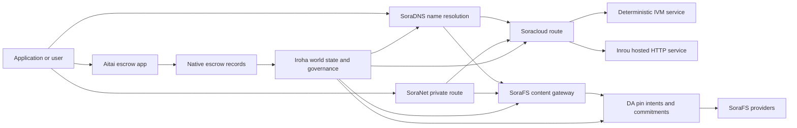

# Services applicatifs de SORA Nexus {#sora-nexus-services}

SORA Nexus ajoute des plans de service orientés application autour de Iroha 3. Ces services ne sont pas des registres séparés de la blockchain. Ils sont ancrés par l'état mondial de Iroha, les manifestes techniques de Norito, les registres de gouvernance et les familles de routes de Torii.

La disponibilité dépend de la version du nœud et du profil réseau. Utilisez [`/openapi.json`](/fr/reference/torii-endpoints.md#app-and-sora-route-families) pour découvrir les routes d’API applicatives générées sur le nœud cible. Les routes publiques des CID locaux de SoraFS et les routes bien connues sont publiées hors de ce document généré ; vérifiez-les directement lors du contrôle d’un déploiement.

## Carte des composants {#component-map}

|Composant|Rôle|Surfaces principales|
| ---------------------- | ------------------------------------------------------------------------------------------------------------------------------------------- | ---------------------------------------------------------------------------------------- |
| Soracloud              |Déploiement d’applications, services hébergés, état privé des modèles et de l’environnement d’exécution, et contrôle du cycle de vie des services.| `/v1/soracloud/*`, `/api/*`, `iroha soracloud service ...`                                   |
|Inrou|Environnement d’exécution HTTP hébergé de Soracloud pour les révisions de services qui nécessitent un plan HTTP actif.|Configuration de l’environnement d’exécution de Soracloud, annonces de capacité de l’hôte et état d’exécution des réplicas|
| SoraNet                |Confidentialité et superposition de transport pour les circuits, le trafic de relais, VPN, les sessions de connexion et les itinéraires de streaming.| `/v1/connect/*`, `/v1/vpn/*`, SoraNet métadonnées de route |
|Disponibilité des données (DA)|Preuves de disponibilité, engagement et couche d'intention directe pour les charges utiles qui sont référencées par les voies d'exécution Nexus, les manifestes techniques SoraFS et les flux de preuves.| `/v1/da/*`, `FindDaPinIntent*`, `[nexus.da]`                                             |
| SoraFS                 |Tissu de stockage adressé par le contenu pour les manifestes techniques, les charges utiles CAR, le contenu épinglé, les récupérations via passerelle et les flux de preuve de récupérabilité.| `/v1/sorafs/*`, `/sorafs/*`, `FindSorafsProviderOwner`                                   |
| SoraDNS                |Couche de nommage déterministe et d'attestation de résolveur pour les services et contenus hébergés sur SORA.| `/v1/soradns/*`, `/soradns/*`, résoudre les événements du répertoire|
|Aitai|Couloir applicatif de règlement en monnaie fiduciaire et en actifs, adossé aux enregistrements d’entiercement natifs plutôt qu’à un registre distinct.|`OpenAssetEscrow`, `FindAssetEscrow*`, `EscrowEventFilter` et fonctions intégrées `escrow_*` de Kotodama|



## Flux Communs {#common-flows}

### Application fractionnée hébergée {#hosted-split-application}

Une application à plans mixtes typique utilise toutes les parties ensemble :

1. Les ressources statiques du frontend sont emballées et épinglées via SoraFS.
2. L'hôte public, par exemple `<app>.sora`, est enregistré via SoraDNS.
3. Soracloud routes `/api/v1/search` ou `/api/v1/stream` vers un service Inrou HTTP.
4. Soracloud dirige `/api/auth` et `/api/v1/user` vers des gestionnaires déterministes IVM.
5. Les clients qui ont besoin de confidentialité peuvent accéder au même contenu ou à l'itinéraire API via un circuit SoraNet.

|Chemin|Plan de support|Pourquoi|
| ----------------- | --------------------- | ------------------------------------------------- |
| `/`               | SoraFS contenu statique |Mise en cache de la racine du contenu reproductible et de la passerelle|
| `/assets/*`       | SoraFS contenu statique |Actifs adressés par contenu et preuves de manifeste technique|
| `/api/auth*`      | Soracloud IVM         |État sécurisé contre la répétition de l'authentification et du défi du portefeuille|
| `/api/v1/user*`   | Soracloud IVM         |Mutations étatiques sensibles à la gouvernance|
| `/api/v1/search*` | Soracloud Inrou       |État en direct HTTP du service, du cache, SSE, ou du collecteur|

### Publication de contenu {#content-publication}

SoraFS la publication produit des artefacts durables avant qu'un nom ne les désigne :

1. Créer une charge utile ou un répertoire.
2. Emballez-le dans une archive CAR et planifiez par morceaux.
3. Créer un manifeste technique Norito avec la politique de broches et les données de gouvernance.
4. Soumettez le manifeste technique à Torii.
5. Enregistrez une intention ou un engagement de disponibilité DA lorsque le profil cible nécessite une preuve explicite.
6. Liez le manifeste technique à un nom SoraDNS ou à une route frontale statique Soracloud.

### Route de récupération ou de diffusion privée {#private-fetch-or-streaming-route}

SoraNet peut se placer devant SoraFS ou Soracloud :

1. Le client résout le nom ou le manifeste technique.
2. Un répertoire de garde ou un manifeste technique de route choisit les relais d'entrée et de sortie.
3. Le trafic est rembourré et envoyé par le circuit SoraNet.
4. Le relais de sortie atteint la passerelle SoraFS, le flux Torii ou la route Soracloud.

## Aitai {#aitai}

Aitai est le couloir applicatif de SORA pour les règlements de marché dans lesquels un acheteur et un vendeur coordonnent un paiement hors chaîne tandis qu’Iroha conserve les actifs sous séquestre sur la chaîne. Pour les nouveaux flux de garde d’actifs numériques, utilisez la famille d’instructions d’entiercement natives plutôt qu’un compte d’entiercement contrôlé par un contrat.

L'entiercement natif garde la garde dans le registre de la blockchain. Le vendeur ouvre une offre avec `OpenAssetEscrow`, l'acheteur accepte et marque le paiement hors chaîne avec `AcceptAssetEscrow` et `MarkEscrowPaymentSent`, et le vendeur libère avec `ReleaseAssetEscrow` ou annule avant que le paiement soit marqué. Si l'acheteur et le vendeur ne sont pas d'accord, l'une ou l'autre des parties peut ouvrir un litige et un résolveur avec `CanResolveEscrowDispute` peut partager le montant bloqué.

Pour le cycle de vie complet, les verrous d'actifs génériques, l'entiercement anonyme, les requêtes, les événements et les exemples Rust, voir [Compte séquestre d'actifs natifs](/fr/blockchain/escrow.md).

|Surface Aitai|Utilisez-le pour|
| ------------------------------------------------------------------------------------------------------------------------------------------------------------- | ----------------------------------------------------------------------------------------- |
| `OpenAssetEscrow`, `AcceptAssetEscrow`, `MarkEscrowPaymentSent`, `ReleaseAssetEscrow`, `CancelAssetEscrow`                                                    |Offres d'actifs numériques transparentes, y compris les flux de règlement libellés en XOR.|
| `OpenAnonymousAssetEscrow`, `AcceptAnonymousAssetEscrow`, `MarkAnonymousEscrowPaymentSent`, `ReleaseAnonymousAssetEscrow`, `CancelAnonymousAssetEscrow`       |Les offres protégées utilisent des pièces justificatives pour le financement et les mouvements de clôture.|
| `OpenEscrowDispute`, `ResolveEscrowDispute`, `OpenAnonymousEscrowDispute`, `ResolveAnonymousEscrowDispute`                                                    |Saisie de litige et résolution de type judiciaire.|
| `FindAssetEscrowById`, `FindAssetEscrowsBySeller`, `FindAssetEscrowsByBuyer`, `FindAssetEscrowsByStatus` |Pages de statut des applications, travaux de réconciliation et outils de support.|
| `EscrowEventFilter` |Afficher les abonnements de séquestre transparents par identifiant de séquestre, vendeur, acheteur, statut ou type d'événement.|
| Kotodama `escrow_open_offer`, `escrow_accept`, `escrow_mark_payment_sent`, `escrow_release`, `escrow_cancel`, `escrow_open_dispute`, `escrow_resolve_dispute` | Kotodama appels de contrat garantis par les appels système d'entiercement V1. |

Pour un usage public Taira ou Minamoto, considérez le rail de paiement hors chaîne et tout processus de support ou judiciaire comme faisant partie de la politique de l'application. Iroha enregistre l'état de garde, les événements du cycle de vie, les hachages cryptographiques des preuves et le mouvement final des actifs ; il ne vérifie pas la liquidation en monnaie fiduciaire par lui-même.

## Vérifier un nœud cible {#check-a-target-node}

Avant d’utiliser des exemples de cette page, confirmez que la famille de routes existe sur le nœud que vous ciblez :

```bash
export TORII_URL=https://taira.sora.org

curl -fsS "$TORII_URL/openapi.json" \
  | jq '.paths | keys[] | select(test("^/v1/(soracloud|sorafs|soradns|connect|vpn|da)/"))'

curl -fsS -H 'Accept: application/json' "$TORII_URL/status" | jq .
```

`/openapi.json` est le point de terminaison canonique OpenAPI API. La disponibilité exacte des itinéraires dépend des fonctionnalités de construction et de la configuration du réseau. Le document n'énumère pas les itinéraires locaux publics SoraFS CID et bien connus ; consultez directement ces points de terminaison API comme décrit ci-dessous.

### Taira Vérifications de fumée en lecture seule {#taira-read-only-smoke-checks}

Le point de terminaison public Taira API est utile pour les vérifications côté lecture, mais ne l'utilisez pas pour des exemples de mutation à moins que vous n'utilisiez un compte autorisé et n'ayez l'intention de modifier l'état du testnet public.

```bash
export TORII_URL=https://taira.sora.org

curl -fsS -H 'Accept: application/json' "$TORII_URL/status" \
  | jq '{version: .build.version, peers, blocks, lanes: (.teu_lane_commit | length)}'

curl -fsS "$TORII_URL/v1/vpn/profile" \
  | jq '{available, relay_endpoint, supported_exit_classes}'

curl -fsS "$TORII_URL/v1/sorafs/storage/peers?limit=4" \
  | jq '{gateway_base_url, pin_torii_urls}'

curl -fsS -H 'Accept: application/json' "$TORII_URL/v1/soracloud/status" \
  | jq '.control_plane | {service_count, services: [.services[] | {service_name, current_version}]}'
```

Taira peut exposer des routes de plan de contrôle spécifiques au déploiement qui ne sont pas listées dans la carte de chemin OpenAPI. Traitez `/openapi.json` comme le contrat généré pour les routes qu'il contient, puis confirmez les routes locales SoraFS spécifiques au déploiement et publiques directement avant de les documenter comme disponibles.

## Soracloud {#soracloud}

Soracloud est le plan de contrôle de l'application SORA. Il suit les bundles de déploiement, les révisions de service, le routage, l'état du déploiement, les entrées de configuration faisant autorité, les secrets de service chiffrés, les enregistrements du registre de modèles, les sessions d'inférence privées et les enregistrements de résultats du protocole d'exécution logicielle.

Soracloud utilise deux plans d'exécution :

|Plan d'exécution|environnement d'exécution logiciel|Utilisez-le pour|
| ---------------------- | ------- | -------------------------------------------------------------------------------------------- |
| `DeterministicService` | `Ivm`   |Authentification, état du coffre, lectures certifiées, gestionnaires de boîte aux lettres ordonnés, mutations sensibles à la gouvernance|
| `HttpService`          | `Inrou` |En direct HTTP APIs, travail axé sur le collecteur, services avec cache, SSE, flux assistés par navigateur|

Le plan de contrôle est faisant autorité. Les commandes de déploiement, de mise à niveau, de retour en arrière, de configuration, de secret, de modèle et d'état sont soumises via Torii et lisent l'état du monde validé ; elles ne dépendent pas d'un miroir local CLI distinct. Le routage public est basé sur le plus long préfixe, donc un hôte enregistré peut répartir le trafic entre les routes hébergées HTTP et les routes déterministes API.

### structure de départ générée pour une application Split {#scaffold-a-split-app}

Le modèle d'application divisée crée un frontend statique plus un API en direct hébergé et un service de coffre/API déterministe :

```bash
iroha soracloud app init \
  --template split-app \
  --app-name solswap_indexer \
  --app-version 0.1.0 \
  --public-host solswap-indexer.sora \
  --output-dir ./apps/solswap-indexer

iroha soracloud app plan \
  --manifest ./apps/solswap-indexer/app_manifest.json

iroha soracloud app doctor \
  --manifest ./apps/solswap-indexer/app_manifest.json
```

`plan` imprime la répartition de l'itinéraire, les manifestes techniques des services enfants, les chemins des scripts de l'espace de travail, et le mode de publication frontend attendu. `doctor` valide le contrat de version locale avant que vous n'impliquiez Torii.

### Déployer et Inspecter l'État de l'Application {#deploy-and-inspect-app-state}

Réutilisez une future époque de rétention SoraFS pour chaque nouvelle tentative de la publication. Parce que le modèle d'application fractionnée contient un service Inrou, qualifiez son artefact exact dans les magasins du fournisseur hors ligne sélectionné avant la mutation en ligne :

```bash
export SORACLOUD_TORII_URL=https://<soracloud-enabled-torii>
export SORAFS_RETENTION_EPOCH=<future-unix-seconds>

iroha soracloud app preseed \
  --manifest ./apps/solswap-indexer/app_manifest.json \
  --sorafs-retention-epoch "$SORAFS_RETENTION_EPOCH" \
  --inrou-preseed-target <validator-account,peer-id,absolute-store-path> \
  --inrou-preseed-max-capacity-bytes <bytes> \
  --inrou-preseed-helper /absolute/path/to/sorafs-node \
  --inrou-preseed-helper-sha256 <lowercase-sha256> \
  --receipt-out /absolute/path/to/solswap-inrou-preseed.json

iroha soracloud app release \
  --manifest ./apps/solswap-indexer/app_manifest.json \
  --sorafs-retention-epoch "$SORAFS_RETENTION_EPOCH" \
  --inrou-preseed-receipt /absolute/path/to/solswap-inrou-preseed.json \
  --torii-url "$SORACLOUD_TORII_URL"

iroha soracloud app status \
  --manifest ./apps/solswap-indexer/app_manifest.json \
  --torii-url "$SORACLOUD_TORII_URL"
```

Répétez `--inrou-preseed-target` pour chaque magasin de fournisseur requis par la politique de déploiement. `release` construit et synchronise les manifestes techniques, exécute le diagnostiqueur d'application, soumet une mutation d'infrastructure d'application canonique, réconcilie le statut autoritaire et vérifie les cibles actives déclarées. Un enregistrement de résultat de protocole preseed n'est pas optionnel lorsque l'application contient des artefacts Inrou.

Pour un service déjà déployé, utilisez des commandes spécifiques au service :

```bash
iroha soracloud service status \
  --service-name solswap_indexer_live \
  --torii-url "$SORACLOUD_TORII_URL"

iroha soracloud service rollback \
  --service-name solswap_indexer_live \
  --target-version 0.1.0 \
  --torii-url "$SORACLOUD_TORII_URL"
```

### Configuration et matériel secret {#config-and-secret-material}

Soracloud Les entrées de configuration et de secret font partie de l'état de déploiement autoritaire. Le déploiement, la mise à niveau et le retour en arrière échouent fermés lorsque les liaisons de configuration ou de secret requises sont manquantes ou incohérentes avec les manifestes techniques actifs.

```bash
iroha soracloud service config-set \
  --service-name solswap_indexer_live \
  --config-name indexer/public_config \
  --value-file ./config/public-config.json \
  --torii-url "$SORACLOUD_TORII_URL"

iroha soracloud service secret-set \
  --service-name solswap_indexer_live \
  --secret-name indexer/api_key \
  --secret-file ./secrets/api-key.envelope.json \
  --torii-url "$SORACLOUD_TORII_URL"
```

Utilisez l'aide CLI pour connaître les indicateurs de crédentiel exacts requis par votre profil :

```bash
iroha soracloud service config-set --help
iroha soracloud service secret-set --help
```

## Inrou {#inrou}

Inrou est l’environnement d’exécution HTTP hébergé qu’utilise Soracloud. Un nœud Iroha doté de l’environnement Soracloud intégré projette l’état Soracloud admis dans un plan de matérialisation local, démarre les réplicas de services hébergés qui lui sont attribués sous forme de services en boucle locale et reporte leur état d’exécution dans le modèle faisant autorité.

Utilisez Inrou pour les charges de travail nécessitant une surface HTTP en direct, telles que les flux APIs, SSE à forte collecte, les gestionnaires avec cache, ou les services assistés par navigateur.

### Exigences du temps d'exécution du logiciel {#runtime-requirements}

- Le temps d'exécution du logiciel du manifeste technique du conteneur doit être `Inrou`.
- Le plan d'exécution du manifeste technique de service doit être `HttpService`.
- `HttpService + Inrou` nécessite exactement un `PersistentRootLeaseVolume` monté à `/`.
- Les services Inrou répliqués ont également besoin d'un service partagé ou d'un stockage sous bail confidentiel lorsqu'ils conservent un état partagé mutable.
- Les nœuds d'hébergement de production devraient annoncer une capacité réelle Inrou au lieu de fonctionner uniquement comme un proxy.

### fragment de manifeste technique {#manifest-fragment}

L'exemple ci-dessous montre la forme des deux manifestes techniques. Il s'agit d'un fragment, et non d'un bundle de déploiement complet.

```jsonc
// container_manifest.json
{
  "schema_version": 1,
  "runtime": { "runtime": "Inrou", "value": null },
  "bundle_path": "/bundles/solswap-indexer.inrou",
  "entrypoint": "/app/bin/launch-indexer.sh",
  "args": [],
  "env": {
    "RUST_LOG": "info",
  },
  "inrou": {
    "schema_version": 1,
    "guest_os": { "guest_os": "DebianSlim", "value": null },
    "guest_images": {
      "x86_64": {
        "kernel_image_path": "/inrou/x86_64/vmlinux",
        "rootfs_image_path": "/inrou/x86_64/rootfs.ext4",
        "initrd_image_path": null,
      },
      "aarch64": {
        "kernel_image_path": "/inrou/aarch64/vmlinux",
        "rootfs_image_path": "/inrou/aarch64/rootfs.ext4",
        "initrd_image_path": null,
      },
    },
  },
  "lifecycle": {
    "start_grace_secs": 60,
    "stop_grace_secs": 30,
    "healthcheck_path": "/api/indexer/v1/health",
  },
}
```

```jsonc
// service_manifest.json
{
  "schema_version": 1,
  "service_name": "solswap_indexer_live",
  "service_version": "0.1.0",
  "execution_plane": { "execution_plane": "HttpService", "value": null },
  "replicas": 2,
  "route": {
    "host": "solswap-indexer.sora",
    "path_prefix": "/api/v1/search",
    "service_port": 8080,
    "visibility": { "visibility": "Public", "value": null },
    "tls_mode": { "tls": "Required", "value": null },
  },
  "lease_volumes": [
    {
      "volume_name": "root_disk",
      "kind": {
        "lease_volume": "PersistentRootLeaseVolume",
        "value": null,
      },
      "storage_class": { "storage_class": "Warm", "value": null },
      "mount_path": "/",
      "max_total_bytes": 8589934592,
    },
    {
      "volume_name": "index_state",
      "kind": { "lease_volume": "ServiceLeaseVolume", "value": null },
      "storage_class": { "storage_class": "Warm", "value": null },
      "mount_path": "/var/lib/solswap-indexer",
      "max_total_bytes": 1073741824,
    },
  ],
}
```

Lors de l'exécution du logiciel, chaque volume de location monté est exposé via des variables d'environnement dérivées du nom du volume :

```text
SORACLOUD_LEASE_VOLUME_ROOT_DISK_DIR
SORACLOUD_LEASE_VOLUME_ROOT_DISK_MOUNT_PATH
SORACLOUD_LEASE_VOLUME_INDEX_STATE_DIR
SORACLOUD_LEASE_VOLUME_INDEX_STATE_MOUNT_PATH
```

## SoraNet {#soranet}

SoraNet est la superposition de confidentialité et de transport. Elle fournit des routes basées sur le relais pour le trafic qui ne devrait pas se connecter directement à la passerelle ou au service cible. La conception du transport utilise les rôles de relais d'entrée, de milieu et de sortie, le transport QUIC, une poignée de main hybride basée sur le bruit, la négociation des capacités, les métadonnées du répertoire de relais et des cellules rembourrées de taille fixe.

Dans les déploiements Nexus, SoraNet peut transporter des récupérations de contenu, le trafic de passerelle, des sessions VPN ou Connect, et des routes de streaming Norito. Les entrées de l'annuaire peuvent marquer les relais qui prennent en charge `norito-stream`, ce qui permet aux clients de préférer des routes adaptées au trafic Torii RPC ou au streaming.

### Configuration du streaming {#streaming-configuration}

Le profil Nexus permet l'approvisionnement SoraNet pour les routes de streaming :

```toml
[streaming]
feature_bits = 0b11

[streaming.soranet]
enabled = true
exit_multiaddr = "/dns/torii/udp/9443/quic"
padding_budget_ms = 25
access_kind = "authenticated"
provision_spool_dir = "./storage/streaming/soranet_routes"
provision_spool_max_bytes = 0
provision_window_segments = 4
provision_queue_capacity = 256
```

Utilisez `access_kind = "read-only"` pour les itinéraires de contenu qui ne nécessitent pas d'authentification du spectateur. Utilisez `authenticated` lorsque le relais de sortie doit appliquer des tickets ou l'identité du spectateur avant de se connecter à Torii ou à un service hébergé.

### SoraNet-Conscient SoraFS Récupérer {#soranet-aware-sorafs-fetch}

Le SoraFS fetch CLI peut émettre un manifeste technique proxy local et mettre en file SoraNet les métadonnées de route pour les extensions de navigateur ou les SDK adaptateurs. L'orchestrateur JSON doit définir `local_proxy` avec `"emit_browser_manifest": true`, et le CLI doit être construit avec le support de `local-quic-proxy`. Sur Taira, inspectez le catalogue des fournisseurs admis à la racine du testnet public, puis remplissez le tuple de fournisseur protégé émis pour ce fournisseur :

```bash
export TAIRA_ROOT=https://taira.sora.org
curl -fsS "$TAIRA_ROOT/v1/sorafs/providers?limit=20" | jq '.providers'

: "${TAIRA_SORAFS_PROVIDER_ID:?set the admitted provider ID from Taira discovery}"
: "${TAIRA_SORAFS_GATEWAY_KEY:?set the provider gateway key}"
: "${TAIRA_SORAFS_PROVIDER_URL:?set the advertised provider base URL}"
: "${TAIRA_SORAFS_STREAM_TOKEN_FILE:?set the issued stream-token file}"

cargo run -p sorafs_orchestrator --features=local-quic-proxy --bin=sorafs_cli -- \
  fetch \
  --plan=artifacts/payload_plan.json \
  --manifest-id=<manifest-digest-hex> \
  --orchestrator-config=artifacts/orchestrator.json \
  --provider=name=taira,provider-id="$TAIRA_SORAFS_PROVIDER_ID",gateway-key="$TAIRA_SORAFS_GATEWAY_KEY",base-url="$TAIRA_SORAFS_PROVIDER_URL",stream-token="$(cat "$TAIRA_SORAFS_STREAM_TOKEN_FILE")" \
  --output=artifacts/payload.bin \
  --json-out=artifacts/fetch_summary.json \
  --local-proxy-manifest-out=artifacts/proxy_manifest.json \
  --local-proxy-mode=bridge \
  --local-proxy-norito-spool=storage/streaming/soranet_routes \
  --local-proxy-kaigi-spool=storage/streaming/soranet_routes \
  --local-proxy-kaigi-policy=authenticated \
  --max-peers=2 \
  --retry-budget=4
```

Le récapitulatif consigne les rapports des fournisseurs, les reçus de fragments, les métadonnées du proxy local et les paramètres de route effectivement utilisés pour la récupération.

### Registre des vérificateurs d'incitation de relais {#relay-incentive-verifier-roster}

L’ingestion des incitations de relais échoue de manière fermée. Lorsque `incentives.enable` vaut true, `incentives.trusted_verifier_ids` doit contenir au moins un ID de compte canonique. La liste ne doit jamais dépasser 64 entrées, même lorsque les incitations sont désactivées. L’environnement d’exécution la stocke comme un ensemble ordonné déterministe et rejette toute structure de liste invalide au démarrage du relais.

Chaque `RelayBandwidthProofV1` est décodé sous un budget de trame/allocation fixe et doit consommer la trame complète. Le compte vérificateur de la preuve doit être présent dans la liste configurée, et `RelayBandwidthProofV1::verify_signature()` doit réussir, avant que le relais ne verrouille ou ne modifie son accumulateur de performance. Un signataire cryptographique non fiable ou une preuve invalide/manipulée de la signature ne contribue donc à aucune mesure et ne peut pas produire de capture d'incitation.

## Disponibilité des données (DA) {#data-availability-da}

DA est la couche de preuve de disponibilité pour les charges utiles qui sont trop volumineuses, trop sensibles en termes de confidentialité ou trop spécifiques au service pour être placées directement dans l'état du monde. Il enregistre les engagements déterministes et les obligations de récupération afin que les validateurs, les passerelles et les clients puissent s'accorder sur les octets qui ont été promis, sur la politique applicable et sur les preuves qui ont été observées.

DA ne remplace pas Kura ou SoraFS :

- Kura stocke le flux de blocs finalisé et les données de récupération de consensus.
- SoraFS stocke et sert des octets adressés par contenu, des charges utiles CAR et des manifestes techniques.
- DA enregistre les engagements, les politiques de preuve, les ouvertures de preuve et les intentions de broche qui permettent que ces octets soient programmés, audités et reliés à l'état du registre blockchain.

Utilisez DA lorsqu'une application ou une voie d'exécution Nexus a besoin d'une promesse visible sur le grand livre que les données hors chaîne restent récupérables. Des exemples courants incluent les engagements de charge utile de voie d'exécution pour les flux de règlement, les intentions de verrouillage SoraFS pour le contenu publié, des lots de preuves qui doivent être conservés pour une vérification ultérieure, et des artefacts d'application dont l'état public devrait être une valeur de condensé cryptographique plutôt que la charge utile complète.

### Cycle de vie {#lifecycle}

|Stage|Ce qui est enregistré|
| ---------- | ----------------------------------------------------------------------------------------------------------------------------------------------------- |
|Intention|Un billet, référence de manifeste technique, alias, référence de voie/époque/séquence, politique de rétention ou cible de réplication.|
|Engagement|Matériau de résumé qui relie le manifeste, la charge utile de la voie, le paquet de preuves ou la racine du contenu à l’enregistrement visible sur la chaîne.|
|Preuve|Votes de disponibilité, ouvertures de preuves, attestations de fournisseurs ou autres preuves spécifiques au profil acceptées par le réseau cible.|
|Requête| Recherches d'intention par code PIN via `FindDaPinIntentByTicket`, `FindDaPinIntentByManifest`, `FindDaPinIntentByAlias` ou `FindDaPinIntentByLaneEpochSequence`. |

Un flux de publication typique soutenu par DA est :

1. Construisez ou recevez la charge utile en dehors du WSV, par exemple un fichier SoraFS CAR ou une charge utile de voie d'exécution Nexus.
2. hachage cryptographique et décrire la charge utile dans un manifeste technique Norito ou un registre d'engagement spécifique à un itinéraire.
3. Soumettez le manifeste technique, l'intention de broche ou l'engagement via `/v1/da/*` lorsque cette famille de route est activée, ou via le chemin de transaction signé du réseau.
4. Laissez les validateurs ou les fournisseurs de disponibilité collecter les preuves requises par la politique de preuve active.
5. Interrogez l'intention ou l'engagement du pin résultant avant de promouvoir un alias, une preuve de règlement ou une route de passerelle qui dépend de la charge utile.

### Modèle algorithmique {#algorithmic-model}

DA transforme une charge utile en un engagement signé, protégé contre la relecture et indexé par blocs. Les algorithmes importants sont déterministes afin que les validateurs et les passerelles puissent recalculer les mêmes empreintes cryptographiques à partir des mêmes octets.

1. Normalisez la charge utile soumise sous forme canonique. Torii accepte une requête d’ingestion avec `(lane_id, epoch, sequence)`, les octets de la charge utile, les métadonnées de compression, la taille des fragments, le profil d’effacement, la politique de rétention et la signature de l’émetteur. Le nœud décompresse les charges utiles gzip, deflate ou Zstandard lorsque cela est demandé, puis vérifie que la longueur canonique en octets est égale à `total_size`.
2. Validez les paramètres de voie d'exécution et de bloc. La voie d'exécution doit exister dans le catalogue de voies d'exécution Nexus. `chunk_size` doit être une puissance de deux non nulle, d'au moins deux octets, et ne doit pas dépasser la taille maximale configurée. Le profil d'effacement doit inclure des fragments de données et au moins deux fragments de parité. Le catalogue des voies d'exécution sélectionne le schéma de preuve, soit `merkle_sha256` ou `kzg_bls12_381`.
3. Appliquer la politique réseau. Le nœud applique la base de référence configurée de réplication et de rétention pour la classe de blob. Les métadonnées publiques doivent rester en clair ; les métadonnées réservées à la gouvernance sont chiffrées avec la clé de métadonnées de gouvernance configurée du nœud avant d'être écrites dans le manifeste technique.
4. Découper et engager. La charge utile canonique est découpée avec un profil de taille fixe dérivé de `chunk_size`. Torii calcule la valeur de l’empreinte cryptographique de la charge utile, la racine de l’arbre de preuve de récupération, et les engagements par morceaux. Les morceaux de données portent des engagements BLAKE3 sur leurs octets.
5. Ajouter des engagements d'effacement. Les blocs sont regroupés en bandes de `data_shards`. Les cellules manquantes dans la dernière bande sont remplies de zéros pour le calcul de la parité. RS(16) parité crée fragments de parité ligne/globale ; optionnel `row_parity_stripes` ajouter une parité de style colonne en bandes à travers la matrice. Les engagements de fragments de parité sont des BLAKE3 résumés cryptographiques de symboles en petit-boutisme `u16`.
6. Construisez le manifeste technique. `DaManifestV1` enregistre la voie d'exécution, l'époque, la classe de blob, le codec, la valeur du résumé cryptographique de la charge utile, la racine du segment, la taille du segment, le profil d'effacement, la politique de rétention, le devis de location, les engagements de segments, l'engagement optionnel IPA, les métadonnées et l'heure d'émission. Le ticket de stockage est déterministe : le nœud effectue d'abord un hachage cryptographique d'un modèle de manifeste technique avec un ticket vide, puis écrit cette empreinte comme le `storage_ticket` final.
7. Rejeter les conflits de relecture. La clé de relecture est `(lane_id, epoch, sequence, manifest_fingerprint)`. Un doublon avec la même empreinte est idempotent. Une séquence obsolète ou la même séquence avec une empreinte différente est rejetée.
8. Émettre des artefacts signés. Torii calcule un engagement PDP, signe un `DaIngestReceipt`, construit un `DaCommitmentRecord`, et écrit des artefacts de spool pour le manifeste technique, engagement PDP, registre des engagements, calendrier des engagements, intention de PIN, fichier d'enregistrement du résultat du protocole et journal d'enregistrement du résultat du protocole. Le curseur d'enregistrement du résultat du protocole avance de manière monotone selon `(lane_id, epoch)`.

Les enregistrements d'engagement sont ce que portent les blocs. Un enregistrement lie :

- voie d'exécution, époque et séquence
- ID de blob de l'appelant et hachage cryptographique du manifeste technique canonique
- schéma de preuve de voie d'exécution
- racine de morceau
- engagement optionnel KZG pour les voies d'exécution KZG
- PDP/valeur de résumé cryptographique de preuve
- classe de rétention et ticket de stockage
- Torii DA signature de reconnaissance

Avant qu'un bloc n'intègre des enregistrements DA, le chemin d'assemblage du bloc valide le lot :

- `(lane_id, epoch, sequence)` doit être unique à l'intérieur du bundle.
- Les hachages cryptographiques du manifeste technique doivent être non nuls et uniques à l'intérieur du bundle.
- Le schéma de preuve d'engagement doit correspondre à la politique de voie d'exécution configurée.
- Les voies d'exécution Merkle rejettent les engagements KZG ; les voies d'exécution KZG nécessitent un engagement KZG non nul.
- Les intentions de pin sont canonisées, triées et filtrées par voie d'exécution, hachage cryptographique du manifeste technique, ticket de stockage, compte propriétaire et règles de collision d'alias.

L'en-tête de bloc stocke des hachages cryptographiques pour les politiques de preuve DA, les engagements et les intentions de code PIN. Pour les preuves de membership, le paquet d'engagements expose également une racine de Merkle dont les feuilles sont hachages cryptographiques de valeurs `DaCommitmentRecord` encodées Norito canoniques. Les nœuds parents hachent cryptographiquement la concaténation des enfants gauche et droit ; une feuille impaire est promue telle quelle à la couche suivante.

### Vérification de la preuve {#proof-verification}

`/v1/da/commitments/prove` peut produire une preuve pour un engagement dans un bloc. La preuve contient l'engagement, la hauteur du bloc, l'index dans le lot, le hachage cryptographique du lot, la longueur du lot, la racine Merkle et le chemin sibling. La vérification vérifie :

1. Le hachage cryptographique du lot de preuves correspond au hachage cryptographique de l'engagement DA de l'en-tête du bloc.
2. La hauteur du bloc de preuve correspond à l'en-tête de bloc référencé.
3. L'indice est dans les limites et l'engagement est égal à l'entrée du lot à cet indice.
4. La politique de preuve de la voie d'exécution accepte l'engagement.
5. Plier le chemin du frère depuis la feuille d'engagement reconstruit la racine fournie.
6. La racine reconstruite est égale à la racine du faisceau.

Cela prouve qu'un engagement de disponibilité spécifique a été inclus dans une charge utile de bloc spécifique ; cela ne prouve pas que chaque réplique est actuellement en ligne. La récupération en direct est vérifiée séparément via les récupérations du fournisseur SoraFS, les vérifications PDP/PoTR, ou des preuves de disponibilité spécifiques au profil.

### Interaction de consensus {#consensus-interaction}

La disponibilité de la charge utile de consensus est obligatoire, mais ce n'est pas un protocole de seconde finalité. Le leader diffuse un `PayloadManifest` signé à l'ensemble du comité `3f + 1`. Le premier corps et l'occurrence de bloc RS16 ciblent l'ensemble A, dont les membres `2f + 1` incluent le leader et la queue mandataire. Une retransmission à vue limitée étend le service du corps et du bloc à l'ensemble du comité.

Un manifeste technique ou un ensemble de fragments partiels ne suffit pas pour voter. Avant la phase de Préparation, chaque validateur doit authentifier les morceaux, reconstruire le corps canonique complet, vérifier sa longueur, racine du segment, et hachage cryptographique du corps, persister ce corps, et terminer la validation déterministe du bloc. Le validateur conserve le corps exact via l'application CommitQC ou la récupération certifiée.

Lorsqu'un pair de réseau apprend un certificat avant d'avoir le corps, il demande d'abord des morceaux authentifiés ou le corps canonique aux signataires cryptographiques du certificat, puis étend la récupération au comité gelé. Chaque réponse reste liée exactement au contexte de hauteur, au tour de proposition, au manifeste technique et au sujet du corps. Le bloc n'est appliqué qu'après que le corps reconstruit localement correspond au certificat.

### Notes de l'opérateur {#operator-notes}

Iroha 3 les profils de consensus incluent toujours le manifeste technique signé et RS16 la diffusion de la charge utile, la validation complète du corps avant Préparer, DA la validation du paquet, et la télémétrie de récupération limitée. La disposition et les limites du protocole sont figées dans le contexte de hauteur signé ; il n'existe aucun profil de commutation locale ou de délai d'expiration pouvant les désactiver ou les redéfinir. Les limites locales de bloc et de file d'attente du nœud doivent toujours correspondre à la disposition et à la charge de travail signées de l'installation.

Pour la découverte de route, commencez par le document OpenAPI du nœud :

```bash
curl -fsS "$TORII_URL/openapi.json" \
  | jq '.paths | keys[] | select(startswith("/v1/da/"))'
```

Utilisez le [référence de requête](/fr/reference/queries.md#nexus-data-availability-and-packages) pour les noms de requête DA actuels, et le [modèle de configuration de pair réseau](/fr/reference/peer-config/) pour les limites d'ingestion, d'échantillonnage, d'audit et de récupération au niveau de l'application `[nexus.da]`, ainsi que pour les limites locales de bloc et de file d'attente Sumeragi.

## SoraFS {#sorafs}

SoraFS est le tissu de stockage décentralisé adressé par contenu. Il empaquette les octets en blocs déterministes, des archives CAR, et des manifestes techniques Norito qui lient les racines de contenu, les profils de découpage, les politiques de maintien et les attestations de gouvernance. Les fournisseurs de stockage annoncent la capacité et la disponibilité du contenu, tandis que les passerelles vérifient les manifestes techniques et les engagements de fragments avant de fournir le contenu.

Typique SoraFS les utilisations incluent les ressources statiques d'application, les constructions de documentation, la zone lots, références de modèle ou d'objet, et ensembles de preuves de gouvernance. Le Iroha le modèle de données expose SoraFS événements de passerelle et un [`FindSorafsProviderOwner`](/fr/reference/queries.md#nexus-data-availability-and-packages) requête pour la résolution de la propriété du fournisseur.

### Taira Profil Testnet {#taira-testnet-profile}

Taira est le testnet public canonique SoraFS. Son profil de validateur enregistré utilise la chaîne `fc56984b-2be7-431d-840e-21514d1883f0` et le discriminant de chaîne `369`. Le `NetworkId` ci-dessous est l'identité exacte du genesis de la blockchain Taira actuellement épinglé. Une réinitialisation Taira peut modifier ce hachage cryptographique tout en conservant l'étiquette de la chaîne, donc actualisez-le à partir du profil de déploiement signé actuel et ne le dérivez jamais de la chaîne UUID. Les paramètres effectifs SoraFS de Taira sont :

- ID du réseau : `hash:82531CE8EAE8BFF6BEECA4698BFD13A3BC8BEC5F0EE0D23D428C97FC17AB0F3B#3E94`
- base de passerelle URL : `https://taira.sora.org`
- épingle Torii URLs : `https://taira-validator-1.sora.org` à travers `https://taira-validator-4.sora.org`
- capacités de découverte : `torii_gateway`, `chunk_range_fetch` et `potr_mldsa`
- origine du contenu isolé : `https://{cid}.sorafs.taira.sora.org/{path}`
- politique de pin public : sans autorisation et soumis à des frais, avec `require_council_signatures = false`

```toml
[sorafs.storage]
enabled = false
max_capacity_bytes = 13743895347

[sorafs.discovery]
discovery_enabled = true
known_capabilities = ["torii_gateway", "chunk_range_fetch", "potr_mldsa"]

[sorafs.discovery.admission]
envelopes_dir = "configs/soranexus/taira/sorafs_admission"
trusted_council_keys = ["REPLACE_WITH_TAIRA_SORAFS_COUNCIL_PUBLIC_KEY"]
signature_threshold = "REPLACE_WITH_TAIRA_SORAFS_COUNCIL_SIGNATURE_THRESHOLD"

[sorafs.discovery.publish]
gateway_base_url = "https://taira.sora.org"
pin_torii_urls = [
  "https://taira-validator-1.sora.org",
  "https://taira-validator-2.sora.org",
  "https://taira-validator-3.sora.org",
  "https://taira-validator-4.sora.org",
]

[sorafs.gateway]
require_manifest_envelope = true
enforce_admission = true
enforce_capabilities = true

[sorafs.gateway.untrusted_hosting]
enabled = true
path_gateway_redirect = true
redirect_html_only = true

[sorafs.gateway.untrusted_hosting.cid_host_suffixes]
live = "sorafs.sora.org"
taira = "sorafs.taira.sora.org"

[sorafs.repair]
enabled = false
claim_ttl_secs = 900
heartbeat_interval_secs = 60
max_attempts = 3
worker_concurrency = 4

[sorafs.gc]
enabled = false
interval_secs = 900
max_deletions_per_run = 500
retention_grace_secs = 86400

[gov.sorafs_pin_policy]
require_council_signatures = false
```

Les trois valeurs de passerelle de niveau supérieur sont des valeurs par défaut héritées en mode défaillance sécurisée ; toutes les autres valeurs de l'extrait sont explicites dans le profil enregistré de Taira. Un opérateur doit remplacer les espaces réservés de découverte-admission par le matériel de déploiement signé. Chaque demande servie doit contenir un conteneur de données de manifeste technique, passer l'admission du fournisseur et utiliser une capacité annoncée.

Les validateurs Taira ont le stockage SoraFS, la réparation et la collecte des déchets désactivés. Leur capacité configurée reste une partie du validateur vérification du budget disque ; cela ne signifie pas que le validateur est un fournisseur de stockage. Utilisez `GET /v1/sorafs/storage/peers?limit=4` pour lire la passerelle configurée et les destinations de pin actuelles avant un test.

La configuration du schéma de Taira accepte à la fois les clés de suffixe CID-host `live` et `taira`. Les manifests techniques du réseau de test public, les vérifications d'origine et les tests de navigateur devraient utiliser `sorafs.taira.sora.org` afin que leur origine soit visiblement liée à Taira ; ne considérez pas la clé `live` acceptée comme une recommandation pour publier du contenu testnet sous une origine ayant l'apparence de la production. Les autres déploiements doivent utiliser leur propre identité réseau, clés de gouvernance, matériel d'admission des fournisseurs, points de terminaison pin API et politique de capacité/réparation.

### Passerelles locales publiques CID et de site {#public-local-cid-and-site-gateways}

Chaque nœud Torii activé SoraFS monte ces routes publiques anonymes même lorsque l'application optionnelle API n'est pas construite :

|Méthode et point de terminaison API|But|
| ---------------------------------- | -------------------------------------------------------------------- |
| `GET /.well-known/sorafs/manifest` |Retourner le manifeste technique sélectionné par l'hôte de la requête canonique|
| `GET /v1/sorafs/cid/{cid}`         |Renvoie les métadonnées et les entrées de fichiers du manifeste technique local limité pour un CID|
| `GET /sorafs/cid/{cid}`            |Servir le document racine pour un site local adressé par contenu|
| `GET /sorafs/cid/{cid}/{*path}`    |Servir un chemin normalisé, ou une plage d'octets limitée, sous ce CID|

Ces routes n'acceptent jamais `x-sorafs-stream-token` ou `x-sorafs-token-id`. La présence de l'un ou l'autre en-tête constitue une mauvaise requête. Un manifeste technique canonique est déjà présent dans le magasin local autoritaire du nœud est la capacité de lecture publique ; un échec de cache n'autorise pas l'hydratation par un fournisseur distant. Le fournisseur protégé CAR et les routes de fragments restent des surfaces de protocole authentifiées séparées.

Avant de lire les octets, Torii valide l'encodage canonique, les contraintes sémantiques, la valeur du résumé cryptographique et la racine CID du manifeste technique local. Il nécessite ensuite l'identité du fournisseur local autoritaire, l'admission à la gouvernance et la conformité régie pour le manifeste technique, CID, et le fournisseur. La politique de taux/interdiction de la passerelle utilise l'adresse client effective, en respectant les adresses transmises uniquement par le biais de proxies de confiance configurés. L'absence de politique, de conformité, d'identité ou d'état d'admission entraîne un échec sécurisé.

Une demande détient un permis de passerelle publique de bout en bout ; la limite à l'échelle du processus est de 64 lectures simultanées, les demandes excédentaires renvoyant `503 Service Unavailable` et `Retry-After: 1`. Les réponses du manifeste technique sont limitées à 16 MiB, les listes de fichiers par défaut à 50 entrées et retournent au maximum 500, et un fichier complet ou une plage d'octets unique est limité à 8 MiB. L'analyse des requêtes dépend de la version. La version expédition `app_api` accepte un `limit` non signé de 32 bits décodé, ignore les autres clés de requête, laisse le dernier `limit` répété gagner, et limite la valeur dans `1..=500`. Une version minimale en fonctionnalités sans `app_api` n'accepte qu'une seule paire canonique `limit=1..500` et rejette les formes inconnues, répétées, encodées en pourcentage ou non canoniques. Envoyez exactement une paire `limit=<1..500>` pour un comportement portable entre les versions. CIDs, les hôtes, les chemins et les en-têtes de plage restent canoniques et à valeur unique dans les deux versions. Actif HTML, CSS, JavaScript, SVG, XML, PDF, ou le contenu Wasm n'est servi qu'à partir d'une origine isolée dérivée de CID configurée (ou redirigé vers celle-ci), empêchant une origine de passerelle de chemin partagé d'exécuter du contenu non fiable.

### Emballer, Construire et Soumettre {#pack-build-and-submit}

L'exemple de mutation suivant utilise le Taira `NetworkId` actuel épinglé, le point de terminaison de broche API, le plancher de réplication et la politique de gouvernance. Utilisez un compte testnet et un fichier clé jetable réservé au propriétaire. Taira accepte les épingles sans permission sans signatures du conseil, mais facture toujours les frais réglementés.

```bash
cargo run -p sorafs_orchestrator --bin sorafs_cli -- \
  car pack \
  --input=./dist \
  --car-out=artifacts/site.car \
  --plan-out=artifacts/site.chunk-plan.json \
  --summary-out=artifacts/site.car-summary.json

: "${TAIRA_AUTHORITY:?set a funded Taira I105 account}"
export TAIRA_NETWORK_ID='hash:82531CE8EAE8BFF6BEECA4698BFD13A3BC8BEC5F0EE0D23D428C97FC17AB0F3B#3E94'
export TAIRA_PIN_TORII_URL=https://taira-validator-1.sora.org
export TAIRA_PRIVATE_KEY_FILE="${TAIRA_PRIVATE_KEY_FILE:-./secrets/taira-authority.ed25519}"
export TAIRA_RETENTION_EPOCH=$(( $(date -u +%s) + 86400 ))

cargo run -p sorafs_orchestrator --bin sorafs_cli -- \
  manifest build \
  --summary=artifacts/site.car-summary.json \
  --manifest-out=artifacts/site.manifest.to \
  --manifest-json-out=artifacts/site.manifest.json \
  --pin-min-replicas=1 \
  --pin-storage-class=warm \
  --pin-retention-epoch="$TAIRA_RETENTION_EPOCH"

cargo run -p sorafs_orchestrator --bin sorafs_cli -- \
  manifest submit \
  --manifest=artifacts/site.manifest.to \
  --chunk-plan=artifacts/site.chunk-plan.json \
  --torii-url="$TAIRA_PIN_TORII_URL" \
  --network-id="$TAIRA_NETWORK_ID" \
  --authority="$TAIRA_AUTHORITY" \
  --private-key-file="$TAIRA_PRIVATE_KEY_FILE" \
  --summary-out=artifacts/site.manifest.submit.json \
  --response-out=artifacts/site.manifest.submit.body
```

`manifest submit` nécessite `/v1/sorafs/pin/register`. Si le nœud cible ne le dirige pas, la commande échoue ; le CLI en première version ne revient pas au point de terminaison générique `/transaction` API.

### Vérifier et récupérer {#verify-and-fetch}

Le tuple de récupération protégé est spécifique au fournisseur. Obtenez son ID de fournisseur et la base annoncée URL dans le catalogue de fournisseurs de Taira, et obtenez la clé de passerelle et le jeton de flux via ce fournisseur. flux d'admission. Ces valeurs ne sont pas des paramètres de stockage du validateur. Les validateurs Taira enregistrés ont le stockage intégré désactivé, donc ne substituez pas un code PIN de validateur URL à un fournisseur URL.

```bash
export TAIRA_ROOT=https://taira.sora.org
curl -fsS "$TAIRA_ROOT/v1/sorafs/providers?limit=20" | jq '.providers'

: "${TAIRA_SORAFS_PROVIDER_ID:?set the admitted provider ID from Taira discovery}"
: "${TAIRA_SORAFS_GATEWAY_KEY:?set the provider gateway key}"
: "${TAIRA_SORAFS_PROVIDER_URL:?set the advertised provider base URL}"
: "${TAIRA_SORAFS_STREAM_TOKEN_FILE:?set the issued stream-token file}"

cargo run -p sorafs_orchestrator --bin sorafs_cli -- \
  proof verify \
  --manifest=artifacts/site.manifest.to \
  --car=artifacts/site.car \
  --chunk-plan=artifacts/site.chunk-plan.json \
  --summary-out=artifacts/site.verify.json

cargo run -p sorafs_orchestrator --bin sorafs_cli -- \
  fetch \
  --plan=artifacts/site.chunk-plan.json \
  --manifest-id=<manifest-digest-hex> \
  --provider=name=taira,provider-id="$TAIRA_SORAFS_PROVIDER_ID",gateway-key="$TAIRA_SORAFS_GATEWAY_KEY",base-url="$TAIRA_SORAFS_PROVIDER_URL",stream-token="$(cat "$TAIRA_SORAFS_STREAM_TOKEN_FILE")" \
  --output=artifacts/site.fetch.tar \
  --json-out=artifacts/site.fetch.json
```

### Vérifications de preuve de récupérabilité {#proof-of-retrievability-checks}

Les opérateurs peuvent inspecter, exporter et rapporter les résultats de la preuve de récupérabilité. Les défis sont programmés par le pipeline de traitement des preuves du réseau ; le CLI affiche leurs résultats.

```bash
cargo run -p sorafs_orchestrator --bin sorafs_cli -- \
  por status \
  --torii-url="$TAIRA_PIN_TORII_URL" \
  --manifest=<manifest-digest-hex> \
  --status=failed \
  --limit=20

cargo run -p sorafs_orchestrator --bin sorafs_cli -- \
  por report \
  --torii-url="$TAIRA_PIN_TORII_URL" \
  --week=<YYYY-Www> \
  --format=json
```

## SoraDNS {#soradns}

SoraDNS est la couche de dénomination déterministe pour les services et contenus SORA. Elle normalise les noms, ancre les mises à jour du répertoire du résolveur dans Iroha, et distribue des bundles de zones ou de résolveurs signés via SoraFS. Les résolveurs et les passerelles vérifient les documents d'attestation des résolveurs avant de faire confiance aux métadonnées de découverte.

Pour l'accès via le navigateur, SoraDNS dérive les hôtes de la passerelle à partir d'un FQDN enregistré. L'hôte personnalisé enregistré reste l'origine canonique de l'application, tandis que les profils de passerelle déployés exposent des routes de secours pour le navigateur et Torii pour cette origine.

### Formes d'hôte {#host-forms}

|Formulaire|Exemple|But|
| ---------------------- | ---------------------------------------------- | --------------------------------------------------------- |
|Origine de la vanité| `https://<fqdn>/<path>`                        |Application canonique URL enregistrée dans les manifests techniques et les notes de version|
| Taira passerelle du navigateur | `https://<fqdn>.mon.taira.sora.net/<path>`     |Passerelle de navigateur publique pour un alias actif|
| Torii chemin de secours | `https://taira.sora.org/soradns/<fqdn>/<path>` | Torii déboguer et itinéraire de secours pour un alias actif        |
|Passerelle de hachage cryptographique canonique| `<base32(blake3(name))>.gw.sora.id`            |Identité de passerelle déterministe et vérification GAR|

Le fallback `/soradns/<alias>/...` n'est pas le URL public préféré. Les outils, les manifests techniques de l'application et la configuration du frontend devraient préférer l'hôte personnalisé lui-même. Si un alias n'est pas actif sur Taira, la passerelle du navigateur ou le chemin de secours peut retourner `404` ou échouer TLS avant que le routage de l'application ne commence.

### Dériver les hôtes passerelle {#derive-gateway-hosts}

```ts
import {
  deriveSoradnsGatewayHosts,
  hostPatternsCoverDerivedHosts,
} from '@iroha/iroha-js'

const derived = deriveSoradnsGatewayHosts('docs.sora')
console.log(derived.canonicalHost)
console.log(derived.prettyHost)

const taira = deriveSoradnsGatewayHosts('solswap-indexer.sora', {
  prettySuffix: 'mon.taira.sora.net',
})
console.log(taira.prettyHost)

const patterns = [
  derived.canonicalHost,
  derived.canonicalWildcard,
  derived.prettyHost,
]
console.log(hostPatternsCoverDerivedHosts(patterns, derived))
```

GAR les charges utiles devraient couvrir l'hôte de hachage cryptographique canonique, le joker canonique et l'hôte joli sélectionné.

### Récupérer une vue des données à un instant donné du répertoire Resolver {#fetch-a-resolver-directory-snapshot}

```bash
curl -i "$TORII_URL/v1/soradns/directory/latest"

soradns_resolver directory fetch \
  --record-url "$TORII_URL/v1/soradns/directory/latest" \
  --directory-url https://gateway.example.org/soradns/directory/latest.car \
  --output ./state/soradns-directory

soradns_resolver rad verify \
  --rad ./state/soradns-directory/rad/resolver-a.norito
```

Les passerelles devraient rejeter les résolveurs dont le document d’attestation du résolveur est manquant, expiré, non signé ou non ancré dans la dernière racine Merkle du répertoire. Sur un réseau où aucun répertoire de résolveur n’a encore été publié, `/v1/soradns/directory/latest` peut renvoyer `404` même si la route est activée.

### Délégation publique DNS {#public-dns-delegation}

SoraDNS La dérivation de l'hôte ne remplace pas la délégation Internet régulière DNS. Si un nom public DNS doit pointer vers une passerelle SoraDNS :

- pour les sous-domaines, publiez un CNAME sur l'hôte joli sélectionné
- pour les noms apex, utilisez ALIAS/ANAME ou les enregistrements A/AAAA vers la passerelle anycast IPs
- maintenir l'hôte de hachage cryptographique canonique sous le domaine de passerelle SoraDNS pour les vérifications GAR

## FHE et UAID {#fhe-and-uaid}

Les surfaces liées à FHE disponibles pour les services Nexus comprennent :

- `iroha_crypto::fhe_bfv` met en œuvre un support déterministe de BFV pour l'évaluation de chiffrement scalaire. La résolution des identificateurs utilise `BfvIdentifierPublicParameters` et `BfvIdentifierCiphertext`, où l'emplacement 0 stocke la longueur en octets de l'entrée et les emplacements suivants stockent un octet chiffré chacun.
- Soracloud les schémas d'état et de travail modélisent FHE les charges de travail chiffrées avec des ensembles de paramètres gérés par la gouvernance, des politiques d'exécution, des engagements chiffrés, des conteneurs de données de requête et des demandes de divulgation.

Le chemin d'identificateur BFV est utilisé pour l'inscription respectueuse de la vie privée. Un client peut soumettre un identificateur chiffré au résolveur Torii. Le résolveur l'évalue selon le politique d'identifiant actif, dérive un `OpaqueAccountId`, et émet un enregistrement de résultat de protocole. `ClaimIdentifier` lie ensuite cet enregistrement de résultat de protocole au UAID attaché au compte cible.

Le UAID sert d’ancrage d’identité et de capacité à ce flux. Dans le modèle de données, `UniversalAccountId` repose sur un hachage et s’affiche sous la forme `uaid:<hash>`. Les analyseurs acceptent soit `uaid:<hash>`, soit le condensé brut de 64 chiffres hexadécimaux. `Account` et `NewAccount` comprennent les champs facultatifs `uaid` et `opaque_ids`. L’enregistrement dans l’environnement d’exécution impose un index bijectif entre UAID et compte, rejette les identifiants opaques dupliqués ou en conflit et refuse tout identifiant opaque dépourvu d’UAID. À chaque modification d’une liaison UAID-compte, l’environnement d’exécution reconstruit pour cet UAID les liaisons d’espace de données du répertoire Space.

Les manifestes techniques de l'annuaire spatial attachent des capacités à un UAID. Un `AssetPermissionManifest` nomme le UAID, l'espace de données, l'activation et l'échéance facultative, ainsi que les entrées allow/deny ordonnées définies par espace de données, programme, méthode, actif et rôle AMX. L'évaluation est du type deny-wins : le premier refus correspondant rejette la demande, sinon le dernier candidat autorisé correspondant est vérifié par rapport à toute limite de montant. La publication, l'expiration et la révocation de ces manifestes techniques sont protégées par `CanPublishSpaceDirectoryManifest`.

Pour l'état Soracloud FHE, les schémas mis en œuvre sont :

|Schéma|Ce qu'il contrôle|
| ----------------------------------------- | --------------------------------------------------------------------------------------------------------------------------- |
| `SoraStateBindingV1` avec `FheCiphertext` |Déclare que les valeurs sous un préfixe de clé d'état sont des textes chiffrés FHE.|
| `FheParamSetV1`                           |Nomme le schéma, le backend, la chaîne de modules, le degré du polynôme, le nombre de slots, l'objectif de sécurité, le cycle de vie et la valeur du condensé cryptographique des paramètres.|
| `FheExecutionPolicyV1`                    |Limite la taille du texte chiffré, la taille du texte en clair, le nombre d’entrées/sorties, la profondeur de multiplication, les rotations, les reconversions et le mode d’arrondi.|
| `FheGovernanceBundleV1`                   |Associe un ensemble de paramètres à une politique d'exécution pour la validation d'admission.|
| `FheJobSpecV1`                            |Décrit le travail déterministe `Add`, `Multiply`, `RotateLeft` ou `Bootstrap` sur les clés d'état chiffré et les engagements.|
| `CiphertextQuerySpecV1`                   |Interroge l'état chiffré uniquement par service, liaison, préfixe de clé, limite de résultat, niveau de métadonnées et preuve d'inclusion optionnelle.|
| `DecryptionRequestV1`                     |Demande la divulgation pour un engagement de texte chiffré sous une politique d'autorité de déchiffrement.|

`FheJobSpecV1::validate_for_execution` vérifie que le travail, la politique d'exécution et l'ensemble de paramètres sont compatibles avant l'admission. Il fait également respecter les règles spécifiques à l'opération : addition et multiplication nécessitent au moins deux entrées, La rotation et le bootstrap nécessitent exactement une entrée, et la profondeur demandée, le nombre de rotations, le nombre de bootstraps, le nombre d'entrées, les octets de charge utile et la taille de sortie déterministe doivent rester dans les limites de la politique. Les résultats des requêtes de texte chiffré ne doivent pas retourner de lignes en clair.

UAID n'est pas le texte chiffré et pas non plus la politique FHE elle-même. C'est l'ancre de capacité de compte stable utilisée pour trouver le compte, les revendications d'identifiant opaque et les liaisons du Répertoire de l'Espace qui autorisent un service ou un flux de l'espace de données. FHE les schémas régissent l'admission et l'exécution des charges utiles chiffrées séparément à travers des ensembles de paramètres, des politiques d'exécution, des engagements de texte chiffré et des politiques principales d'autorisation de décryptage.

Les surfaces pertinentes Torii incluent :

- `/v1/identifier-policies`
- `/v1/identifiers/resolve`
- `/v1/accounts/{account_id}/identifiers/claim-receipt`
- `/v1/identifiers/receipts/{receipt_hash}`
- `/v1/accounts/{uaid}/portfolio`
- `/v1/space-directory/uaids/{uaid}`
- `/v1/space-directory/uaids/{uaid}/manifests`
- `/v1/soracloud/fhe/job/run`
- `/v1/soracloud/ciphertext/query`
- `/v1/soracloud/decrypt/request`

La frontière des métadonnées publiques est explicite dans les schémas : liaisons UAID, enregistrements d'identifiants opaques, cycle de vie du manifeste technique, digests cryptographiques des clés d'état, tailles des textes chiffrés, engagements des textes chiffrés, noms des politiques, versions des ensembles de paramètres, opérations de travail, clés d'état de sortie, et les métadonnées des demandes de divulgation peuvent être visibles. Les textes en clair des identifiants, l'état déchiffré, les entrées et sorties du modèle, et les clés secrètes FHE sont en dehors de ces enregistrements de requêtes publics.

## Liste de contrôle opérationnelle {#operational-checklist}

- Confirmer les familles de services générées avec `/openapi.json` sur le nœud cible Torii, et sonder directement les SoraFS CID locaux publics et les routes bien connues.
- Traitez les manifestes techniques de déploiement Soracloud, les manifestes techniques SoraFS, les enregistrements du répertoire de résolveurs SoraDNS, les enregistrements du répertoire de relais SoraNet et les intentions de pin ou engagements de disponibilité DA comme des artefacts sensibles à la gouvernance.
- Utilisez le même profil SORA Nexus de manière cohérente sur les validateurs d'un même réseau.
- Conservez les volumes de racine Inrou et de location partagée dans les manifests techniques au lieu de vous fier à des chemins locaux aux nœuds ad hoc.
- Utilisez la vérification de preuve SoraFS avant de promouvoir des alias de contenu.
- Surveillez les échecs de poignée de main SoraNet, l'état du corps et la récupération des charges utiles manquantes Sumeragi, les refus de passerelle SoraFS, la fraîcheur SoraDNS RAD, et la santé du déploiement Soracloud.
- Pour l'utilisation du testnet public, utilisez le profil Taira et commencez avec [Se connecter aux espaces de données SORA Nexus](/fr/get-started/sora-nexus-dataspaces.md).

Voir aussi :

- [Torii API points de terminaison](/fr/reference/torii-endpoints.md)
- [Filtres d'événements de données](/fr/blockchain/filters.md#data-event-filters)
- [Référence de requête](/fr/reference/queries.md#nexus-data-availability-and-packages)
- [Configuration du validateur canonique Taira au commit épinglé](https://github.com/hyperledger-iroha/iroha/blob/0010c5a70039eac101a4846499ba9ceaf43eb65c/configs/soranexus/taira/config.toml)
