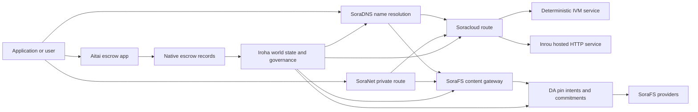

# SORA Nexus Services {#sora-nexus-services}

SORA Nexus ajoute des avions de service face à l'application autour Iroha 3. Ces services
Ce n'est pas un registre séparé. Iroha État mondial, Norito
les manifestes, les dossiers de gouvernance et Torii les familles de la route.

La disponibilité dépend de la construction du nœud et du profil réseau.
[`/openapi`](/fr/reference/torii-endpoints.md#app-and-sora-route-families) sur le
le nœud cible en tant que liste d'autorisation des itinéraires activés.

## Carte des composants {#component-map}

| Components              | Rôle                                                                                                                                        | Surfaces principales                                                                            |
| ---------------------- | ------------------------------------------------------------------------------------------------------------------------------------------- | ---------------------------------------------------------------------------------------- |
| Soracloud              | Déploiement des applications, services hébergés, mode privé/état d'exécution et contrôle du cycle de vie du service.                                        | `/v1/soracloud/*`, `/api/*`, `iroha app soracloud ...`                                   |
| Dans le cadre de la procédure                  | Soracloud hébergé HTTP temps d'exécution pour les révisions de service qui nécessitent un HTTP Un avion.                                                            | Soracloud configuration de l'heure d'exécution, annonces sur les capacités d'hébergement, état d'extension réplique                 |
| SoraNet                | La protection de la vie privée et la superposition des transports pour les circuits, le trafic en relais, VPN, Connectez les sessions et les itinéraires de streaming.                                     | `/v1/connect/*`, `/v1/vpn/*`, SoraNet métadonnées de route                                     |
| Disponibilité des données (DA) | L'indice de disponibilité, l'engagement et la couche d'intention de pin pour les charges utiles visées par: Nexus les voies, SoraFS Il y a des manifestations et des preuves. | `/v1/da/*`, `FindDaPinIntent*`, `[sumeragi.da]`                                          |
| SoraFS                 | Tissu de stockage destiné à l'adresse du contenu des manifestes, CAR les charges utiles, le contenu fixé, les sorties de la passerelle et les flux de preuve de récupérabilité.           | `/v1/sorafs/*`, `/sorafs/*`, `FindSorafsProviderOwner`                                   |
| SoraDNS                | La couche de dénomination déterministe et d'attestation résolutive pour SORA- services et contenus hébergés.                                                   | `/v1/soradns/*`, `/soradns/*`, événements du répertoire résolveur                                 |
| Aitai                  | Corridor de règlement d'actifs et de fiançailles au niveau de l'application soutenu par des registres fiduciaires natifs, pas par un registre séparé.                                     | `OpenAssetEscrow`, `FindAssetEscrow*`, `EscrowEventFilter`, Kotodama `escrow_*` bâtiments |



## Les flux courants {#common-flows}

### L' application Split hébergée {#hosted-split-application}

Une application mixte typique utilise toutes les pièces ensemble:

1. Les actifs statiques de frontend sont emballés et collés SoraFS.
2. L'hôte public, par exemple `<app>.sora`, est enregistré par
   SoraDNS.
3. Soracloud Route `/api/v1/search` ou `/api/v1/stream` à une Inrou HTTP
   Le service.
4. Soracloud Route `/api/auth` et `/api/v1/user` à déterministe IVM
   les gestionnaires.
5. Les clients qui ont besoin de confidentialité peuvent accéder au même contenu ou API Route
   à travers un SoraNet Le circuit.

| Chemin              | Avion d'arrière         | Pourquoi ?                                               |
| ----------------- | --------------------- | ------------------------------------------------- |
| `/`               | SoraFS contenu statique | Réservation en cache de contenu reproductible     |
| `/assets/*`       | SoraFS contenu statique | Les actifs et les preuves manifestes adressés au contenu      |
| `/api/auth*`      | Soracloud IVM         | L'état de l'auteur et du portefeuille en sécurité pour la reproduction       |
| `/api/v1/user*`   | Soracloud IVM         | Mutations d'état sensibles à la gouvernance              |
| `/api/v1/search*` | Soracloud Dans le cadre de la procédure       | Vivant HTTP service, cache, SSE, ou l'État de collecte |

### Publiation du contenu {#content-publication}

SoraFS La publication produit des objets durables avant qu'un nom ne les pointe:

1. Construisez une charge utile ou un répertoire.
2. Enveloppez-le dans un CAR l'archivage et le plan en morceaux.
3. Construire un Norito le manifeste avec des données de politique et de gouvernance pin.
4. Envoyer le manifeste à: Torii.
5. Enregistrer un DA l'intention de pin ou l'engagement en matière de disponibilité lorsque la cible
   le profil exige des preuves explicites.
6. Lier le manifeste à un SoraDNS nom ou Soracloud la route statique de l'avant.

### Route privée de transport ou de diffusion {#private-fetch-or-streaming-route}

SoraNet peut s'asseoir devant SoraFS ou Soracloud:

1. Le client résout le nom ou le manifeste.
2. Un répertoire de garde ou un manifeste de route choisit les relais d'entrée et de sortie.
3. La circulation est remplie et envoyée à travers le SoraNet Le circuit.
4. Le relais de sortie atteint le SoraFS porte d'entrée, Torii courant, ou Soracloud
   La route.

## Aitai {#aitai}

Aitai est le SORA corridor d'applications pour un règlement de type marché où une
l'acheteur et le vendeur coordonnent un paiement hors chaîne alors que Iroha contrôle le
Il devrait utiliser la famille d'instructions de dépôt native
au lieu d'un compte de fiducie détenu par contrat pour la nouvelle garde des actifs numériques
Il coule.

Le vendeur ouvre une offre avec
`OpenAssetEscrow`, l'acheteur accepte et marque le paiement hors chaîne avec
`AcceptAssetEscrow` et `MarkEscrowPaymentSent`, et le vendeur libère
avec `ReleaseAssetEscrow` ou annule avant que le paiement ne soit marqué.
si le vendeur n'est pas d'accord, l'une ou l'autre partie peut ouvrir un litige et résoudre
`CanResolveEscrowDispute` peut partager la somme verrouillée.

Pour le cycle de vie complet, verrouillage des actifs génériques, garantie anonyme, requêtes,
événements, et Rust Exemples, voir
[Réservation des actifs natifs](/fr/blockchain/escrow.md).

| Surfaces d'aitai                                                                                                                                                 | Utilisez-le pour                                                                                |
| ------------------------------------------------------------------------------------------------------------------------------------------------------------- | ----------------------------------------------------------------------------------------- |
| `OpenAssetEscrow`, `AcceptAssetEscrow`, `MarkEscrowPaymentSent`, `ReleaseAssetEscrow`, `CancelAssetEscrow`                                                    | Offres d'actifs numériques transparentes, y compris XOR- les flux de règlement désignés.             |
| `OpenAnonymousAssetEscrow`, `AcceptAnonymousAssetEscrow`, `MarkAnonymousEscrowPaymentSent`, `ReleaseAnonymousAssetEscrow`, `CancelAnonymousAssetEscrow`       | Offres protégées lorsque les mouvements de financement et de clôture sont effectués par des pièces jointes. |
| `OpenEscrowDispute`, `ResolveEscrowDispute`, `OpenAnonymousEscrowDispute`, `ResolveAnonymousEscrowDispute`                                                    | L'introduction de différends et la résolution à la manière des tribunaux.                                                 |
| `FindAssetEscrowById`, `FindAssetEscrowsBySeller`, `FindAssetEscrowsByBuyer`, `FindAssetEscrowsByStatus`                                                      | Pages d'état des applications, tâches de réconciliation et outils de support.                               |
| `EscrowEventFilter`                                                                                                                                           | Les abonnements à escrow transparents en direct par identité d'escrow, vendeur, acheteur, statut ou type d'événement. |
| Kotodama `escrow_open_offer`, `escrow_accept`, `escrow_mark_payment_sent`, `escrow_release`, `escrow_cancel`, `escrow_open_dispute`, `escrow_resolve_dispute` | Kotodama Les appels contractuels soutenus par le V1 Les services de dépôt des comptes.                                 |

Pour le public Taira ou Minamoto l'utilisation, le traitement du rail de paiement hors chaîne et
tout flux de travail d'appui ou de justice en tant que politique de demande. Iroha enregistrent les
l'état de la détention, les événements du cycle de vie, les hachages des preuves et le mouvement final des actifs;
elle ne vérifie pas la liquidation par voie fiduciaire.

## Vérifiez un nœud cible {#check-a-target-node}

Avant d'utiliser des exemples de cette page, confirmez que la famille de routes existe
sur le nœud que vous ciblez:

```bash
export TORII_URL=https://taira.sora.org

curl -fsS "$TORII_URL/openapi.json" \
  | jq '.paths | keys[] | select(test("^/v1/(soracloud|sorafs|soradns|connect|vpn|da)/"))'

curl -fsS "$TORII_URL/status" | jq .
```

Si `/openapi.json` n'est pas exposé par le profil, essayez `/openapi`. Exactement .
la disponibilité du itinéraire dépend des caractéristiques de construction et de la configuration du réseau.

### Taira Véhicules de fumée uniquement lisibles {#taira-read-only-smoke-checks}

Le public Taira le point final est utile pour les contrôles côté lecture, mais ne l'utilise pas
pour les exemples de mutation, sauf si vous exploitez un compte autorisé et
Ils ont l'intention de changer d'état.

```bash
export TORII_URL=https://taira.sora.org

curl -fsS "$TORII_URL/status" \
  | jq '{version: .build.version, peers, blocks, lanes: (.teu_lane_commit | length)}'

curl -fsS "$TORII_URL/v1/connect/status" | jq '{enabled, sessions_active}'

curl -fsS "$TORII_URL/v1/vpn/profile" \
  | jq '{available, relay_endpoint, supported_exit_classes}'

curl -fsS "$TORII_URL/v1/sorafs/storage/state" \
  | jq '{bytes_capacity, bytes_used, pin_queue_depth, por_inflight}'

curl -fsS -H 'Accept: application/json' "$TORII_URL/v1/soracloud/status" \
  | jq '.control_plane | {service_count, services: [.services[] | {service_name, current_version}]}'
```

Taira peuvent exposer des routes de contrôle spécifiques au déploiement qui ne sont pas
répertorié dans le OpenAPI Carte de route. `/openapi` en tant que première générée
API contrat, puis confirmer toute route spécifique au déploiement directement avant
Il est enregistré en direct.

## Soracloud {#soracloud}

Soracloud est le SORA Application de l'appareil de contrôle.
les paquets, les révisions de service, le routage, l'état du déploiement, la configuration autorisée
les entrées, les secrets de service cryptés, les enregistrements modèles du registre, privé
les séances d'inférence, et les reçus en temps de fonctionnement.

Soracloud utilise deux plans d'exécution:

| Plan d'exécution        | Temps d'exécution | Utilisez-le pour                                                                                   |
| ---------------------- | ------- | -------------------------------------------------------------------------------------------- |
| `DeterministicService` | `Ivm`   | Autre, état de la caisse, lecture certifiée, gestionnaires de boîtes postales commandés, mutations sensibles à la gouvernance |
| `HttpService`          | `Inrou` | Vivant HTTP APIs, travail de collecte lourd, services protégés par cache, SSE, flux assistés par le navigateur     |

L'avion de contrôle est autorisé.
commandes secrètes, modèle et statut soumettre à travers Torii et lire commis
l'État mondial; ils ne dépendent pas d'un État CLI- le miroir local.
Le routage est basé sur le préfixe le plus long, donc un hôte enregistré peut diviser le trafic
entre les hôtes HTTP Route et déterminisme API les routes.

### Établissez une application Split {#scaffold-a-split-app}

Le modèle split-app crée un frontend statique plus un hébergé en direct API
et une voûte déterministe/API le service:

```bash
iroha app soracloud app init \
  --template split-app \
  --app-name solswap_indexer \
  --app-version 0.1.0 \
  --public-host solswap-indexer.sora \
  --output-dir ./apps/solswap-indexer

iroha app soracloud app local-plan \
  --manifest ./apps/solswap-indexer/app_manifest.json

iroha app soracloud app doctor \
  --manifest ./apps/solswap-indexer/app_manifest.json
```

`local-plan` imprime la section de route, les manifestes du service pour enfants, l'espace de travail
les chemins du script et le mode de publication anticipé. `doctor`
valides le contrat de relâchement local avant que vous ne Torii.

### Déployer et inspecter l'état de l'application {#deploy-and-inspect-app-state}

```bash
export SORACLOUD_TORII_URL=https://<soracloud-enabled-torii>

iroha app soracloud app deploy \
  --manifest ./apps/solswap-indexer/app_manifest.json \
  --torii-url "$SORACLOUD_TORII_URL"

iroha app soracloud app status \
  --manifest ./apps/solswap-indexer/app_manifest.json \
  --torii-url "$SORACLOUD_TORII_URL"
```

Pour un service déjà déployé, utilisez les commandes de service:

```bash
iroha app soracloud status \
  --service-name solswap_indexer_live \
  --torii-url "$SORACLOUD_TORII_URL"

iroha app soracloud rollback \
  --service-name solswap_indexer_live \
  --target-version 0.1.0 \
  --torii-url "$SORACLOUD_TORII_URL"
```

### Le matériel config et secret {#config-and-secret-material}

Soracloud les entrées config et secrètes font partie du déploiement autorisé
Déploiement, mise à niveau et réinitialisation ne sont pas fermées lorsque la configuration ou
les liaisons secrètes manquent ou sont incompatibles avec les manifestes actifs.

```bash
iroha app soracloud config-set \
  --service-name solswap_indexer_live \
  --config-name indexer/public_config \
  --value-file ./config/public-config.json \
  --torii-url "$SORACLOUD_TORII_URL"

iroha app soracloud secret-set \
  --service-name solswap_indexer_live \
  --secret-name indexer/api_key \
  --secret-file ./secrets/api-key.envelope.json \
  --torii-url "$SORACLOUD_TORII_URL"
```

Utilisez le CLI l'aide pour les signes d'identification exacts exigés par votre profil:

```bash
iroha app soracloud config-set --help
iroha app soracloud secret-set --help
```

## Dans le cadre de la procédure {#inrou}

Inrou est l'hôte. HTTP temps d'exécution utilisé par Soracloud. Une Iroha nœud avec le
intégré Soracloud projets de temps d'exécution admis Soracloud l'état dans un local
plan de matérialisation, démarre les réplices assignées du service hébergé en tant que loopback
services, et rapports réplique l'état d'exécution de retour dans le
Le modèle.

Utilisez Inrou pour les charges de travail qui nécessitent un HTTP surface, comme
collecteur lourd APIs, SSE des flux, des manipulateurs protégés par cache, ou
services assistés par le navigateur.

### Exigences relatives au temps d'exécution {#runtime-requirements}

- L'heure d'exécution du manifeste de conteneur doit être `Inrou`.
- Le plan d'exécution du manifeste de service doit être `HttpService`.
- `HttpService + Inrou` nécessite exactement un `PersistentRootLeaseVolume`
  monté à `/`.
- Les services Inrou répétés nécessitent également un service partagé ou une location confidentielle
  stockage lorsqu'ils conservent un état partagé mutable.
- Les nœuds d'hébergement de production devraient faire la publicité sur une capacité Inrou réelle au lieu
  ne fonctionne que comme un mandat.

### Un fragment manifeste {#manifest-fragment}

L'exemple ci-dessous montre la forme des deux manifestes.
pas un paquet de déploiement complet.

```jsonc
// container_manifest.json
{
  "schema_version": 1,
  "runtime": { "runtime": "Inrou", "value": null },
  "bundle_path": "/bundles/solswap-indexer.inrou",
  "entrypoint": "/app/bin/launch-indexer.sh",
  "args": [],
  "env": {
    "RUST_LOG": "info",
  },
  "inrou": {
    "schema_version": 1,
    "guest_os": { "guest_os": "DebianSlim", "value": null },
    "guest_images": {
      "x86_64": {
        "kernel_image_path": "/inrou/x86_64/vmlinux",
        "rootfs_image_path": "/inrou/x86_64/rootfs.ext4",
        "initrd_image_path": null,
      },
      "aarch64": {
        "kernel_image_path": "/inrou/aarch64/vmlinux",
        "rootfs_image_path": "/inrou/aarch64/rootfs.ext4",
        "initrd_image_path": null,
      },
    },
  },
  "lifecycle": {
    "start_grace_secs": 60,
    "stop_grace_secs": 30,
    "healthcheck_path": "/api/indexer/v1/health",
  },
}
```

```jsonc
// service_manifest.json
{
  "schema_version": 1,
  "service_name": "solswap_indexer_live",
  "service_version": "0.1.0",
  "execution_plane": { "execution_plane": "HttpService", "value": null },
  "replicas": 2,
  "route": {
    "host": "solswap-indexer.sora",
    "path_prefix": "/api/v1/search",
    "service_port": 8080,
    "visibility": { "visibility": "Public", "value": null },
    "tls_mode": { "tls": "Required", "value": null },
  },
  "lease_volumes": [
    {
      "volume_name": "root_disk",
      "kind": {
        "lease_volume": "PersistentRootLeaseVolume",
        "value": null,
      },
      "storage_class": { "storage_class": "Warm", "value": null },
      "mount_path": "/",
      "max_total_bytes": 8589934592,
    },
    {
      "volume_name": "index_state",
      "kind": { "lease_volume": "ServiceLeaseVolume", "value": null },
      "storage_class": { "storage_class": "Warm", "value": null },
      "mount_path": "/var/lib/solswap-indexer",
      "max_total_bytes": 1073741824,
    },
  ],
}
```

Au moment de l'exécution, chaque volume de location monté est exposé à travers l'environnement
variables dérivées du nom de volume:

```text
SORACLOUD_LEASE_VOLUME_ROOT_DISK_DIR
SORACLOUD_LEASE_VOLUME_ROOT_DISK_MOUNT_PATH
SORACLOUD_LEASE_VOLUME_INDEX_STATE_DIR
SORACLOUD_LEASE_VOLUME_INDEX_STATE_MOUNT_PATH
```

## SoraNet {#soranet}

SoraNet Il fournit une superposition de la vie privée et du transport.
les routes de circulation qui ne devraient pas se connecter directement à la passerelle cible
Le design du transport utilise des rôles de relais d'entrée, de milieu et de sortie
QUIC le transport, une poignée de main hybride basée sur le bruit, la négociation des capacités,
Metadata du répertoire de relais et cellules rembourrées de taille fixe.

Dans Nexus déploiements, SoraNet peut transporter des contenus, du trafic de passerelle,
VPN ou les séances Connect, et Norito Les entrées de répertoire peuvent
le relais de marque qui supporte `norito-stream`, qui permet aux clients de préférer les itinéraires
adapté à: Torii RPC ou le trafic en streaming.

### Configuration de diffusion {#streaming-configuration}

Les Nexus le profil est activé SoraNet fourniture de services pour les itinéraires de diffusion:

```toml
[streaming]
feature_bits = 0b11

[streaming.soranet]
enabled = true
exit_multiaddr = "/dns/torii/udp/9443/quic"
padding_budget_ms = 25
access_kind = "authenticated"
provision_spool_dir = "./storage/streaming/soranet_routes"
provision_spool_max_bytes = 0
provision_window_segments = 4
provision_queue_capacity = 256
```

Utilisation `access_kind = "read-only"` pour les itinéraires de contenu qui ne nécessitent pas
l'authentification du spectateur. `authenticated` lorsque le relais de sortie doit être appliqué
les billets ou l'identité du spectateur avant de rejoindre Torii ou un service hébergé.

### SoraNet- Je le sais. SoraFS Apportez. {#soranet-aware-sorafs-fetch}

Les SoraFS la récupération CLI peut émettre un manifeste proxy local et bobine SoraNet
métadonnées de route pour les extensions de navigateur ou SDK adaptateurs:

```bash
sorafs_cli fetch \
  --plan artifacts/payload_plan.json \
  --manifest-id 7bb2...9d31 \
  --provider name=alpha,provider-id=9f5c...73aa,base-url=https://gw-alpha.example.org/,stream-token="$(cat alpha.token)" \
  --output artifacts/payload.bin \
  --json-out artifacts/fetch_summary.json \
  --local-proxy-manifest-out artifacts/proxy_manifest.json \
  --local-proxy-mode bridge \
  --local-proxy-norito-spool storage/streaming/soranet_routes \
  --local-proxy-kaigi-spool storage/streaming/soranet_routes \
  --local-proxy-kaigi-policy authenticated \
  --max-peers=2 \
  --retry-budget=4
```

Les rapports du fournisseur de dossiers sommaires, les reçus par morceaux, les métadonnées locales proxy,
et les paramètres d'itinéraire effectifs utilisés pour le ramassage.

## Disponibilité des données (DA) {#data-availability-da}

DA est la couche de preuve de disponibilité pour les charges utiles qui sont trop grandes, aussi
la protection de la vie privée, ou trop spécifique au service pour être placée directement dans le monde
Il enregistre les engagements déterministes et les obligations de récupération
les validateurs, les passerelles et les clients peuvent se mettre d'accord sur les octets qui ont été promis,
les politiques qui s'appliquent et quelles preuves ont été observées.

DA ne remplace pas Kura ou SoraFS:

- Kura stocke les données de récupération des blocs et du consensus définis.
- SoraFS stocks et serveurs d'octets adressés au contenu, CAR les charges utiles et
  Les manifestes.
- DA enregistrement des engagements, des politiques de preuve, des ouvertures de preuves et des intentions de pin
  qui permettent à ces octets d'être programmé, vérifié et relié au registre
  l'état.

Utilisation DA lorsqu'une demande ou Nexus Lane a besoin d'une promesse visible dans le livre.
que les données hors chaîne restent récupérables.
engagements de charge utile pour les flux de règlement, SoraFS les intentions de pin pour la publication
le contenu, les paquets de preuve qui doivent être conservés pour une vérification ultérieure; et
les objets d'application dont l'état public devrait être un digeste plutôt que le
pleine charge utile.

### Cycle de vie {#lifecycle}

| Étapes      | Ce qui est enregistré                                                                                                                                      |
| ---------- | ----------------------------------------------------------------------------------------------------------------------------------------------------- |
| Intentation     | Un billet, une référence manifeste, un alias, une référence à la voie/à l'époque/à la séquence, une politique de conservation ou une cible de réplication.                                          |
| L'engagement | Digérer du matériel qui lie le manifeste, la charge utile de la voie, le paquet de preuves ou la racine du contenu au registre visible.                                    |
| Les preuves   | Les votes sur la disponibilité, les ouvertures de preuve, les attestations des fournisseurs ou toute autre preuve spécifique au profil acceptée par le réseau cible.                         |
| Résumé      | Des recherches à travers `FindDaPinIntentByTicket`, `FindDaPinIntentByManifest`, `FindDaPinIntentByAlias`, ou `FindDaPinIntentByLaneEpochSequence`. |

Un type typique DA- le flux de publication soutenu est:

1. Construire ou recevoir la charge utile en dehors du WSV, par exemple une SoraFS CAR
   fichier ou Nexus La charge utile de la voie.
2. Hash et décrire la charge utile dans un Norito Manifest ou spécifique à la route
   enregistrement des engagements.
3. Soumettez le manifeste, l'intention ou l'engagement par `/v1/da/*` lorsque
   que la famille de route est activée, ou par l'intermédiaire du réseau signé
   le chemin de la transaction.
4. Laissez les validateurs ou les fournisseurs de disponibilité recueillir les preuves requises
   par la politique de preuve active.
5. Demandez l'intention ou l'engagement de la pin résultant avant de promouvoir un alias,
   la preuve de règlement, ou route de passerelle qui dépend de la charge utile.

### Modèle algorithmique {#algorithmic-model}

DA transforme une charge utile en un engagement signé, protégé par la répétition et indexé par bloc.
Les algorithmes importants sont déterministes afin que les validateurs et les passerelles puissent
recomputer les mêmes digests à partir des mêmes octets.

1. **Canonisez la charge utile.** Torii accepte une demande d'ingestion avec
   `(lane_id, epoch, sequence)`, octets de charge utile, métadonnées de compression, pièce
   taille, profil d'effacement, politique de conservation et signature du soumissionnaire.
   décompresse les charges utiles gzip, deflate ou Zstandard lorsque cela est demandé, puis
   vérifie que la longueur du octet canonique est égale `total_size`.
2. **Valider les paramètres de la voie et des pièces.** La voie doit exister dans le Nexus
   le catalogue des voies. `chunk_size` doit avoir une puissance non nulle de deux, au moins deux
   le profil d'effacement doit être
   Le catalogue de voies sélectionne
   le régime de preuve, soit `merkle_sha256` ou `kzg_bls12_381`.
3. **Appliquer la politique du réseau.** Le nœud impose la réplication configurée et
   la ligne de base de rétention pour la classe blob. les métadonnées publiques doivent rester en texte clair;
   Les métadonnées de gouvernance uniquement sont cryptées avec la gouvernances configurée du nœud
   clé de métadonnées avant qu'elle ne soit inscrite dans le manifeste.
4. **Décomposez-vous.** La charge utile canonique est chargée d'une taille fixe.
   profil dérivé de `chunk_size`. Torii calcul de la charge utile,
   Les données de l'arbre de preuve de récupérabilité et les engagements par pièce.
   transporter BLAKE3 les engagements sur leurs octets.
5. **Ajouter des engagements de suppression.** Les morceaux sont regroupés en bandes
   `data_shards`. Les cellules manquantes dans la bande finale sont zéro rembourrée pour parité
   le calcul. RS(16) parité crée des tranches de parité rangées/globales; optionnel
   `row_parity_stripes` ajouter la parité des bandes de style colonne à travers la matrice.
   Les engagements en matière de parité sont BLAKE3 digeste de la petite andie `u16` Les symboles.
6. **Faites le manifeste.** `DaManifestV1` enregistrer la voie, l'époque, la classe de blob,
   codec, digestion de la charge utile, racine des morceaux, taille des morceauses, profil d'effacement, rétention
   politique, cotation de loyer, engagements par lots, facultatif IPA l'engagement, les métadonnées,
   Le billet de stockage est déterministe: le nœud hashes d'abord un
   le modèle manifeste avec un billet vide, puis écrit cette empreinte digitale comme
   la finale `storage_ticket`.
7. **Rejetez les conflits de répétition.** La clé de répétition est
   `(lane_id, epoch, sequence, manifest_fingerprint)`. Une copie avec le
   La même empreinte digitale est idempotente.
   une empreinte digitale différente est rejetée.
8. **Émettez des objets signés.** Torii computes un PDP l'engagement, signe un
   `DaIngestReceipt`, construit un `DaCommitmentRecord`, et écrit des artefacts de bobines
   pour les manifestes, PDP l'engagement, les antécédents d'engagement et le calendrier des engagements;
   L'intention de la pin, le fichier de réception et le journal de réception.
   monotonie par `(lane_id, epoch)`.

Les enregistrements d'engagement sont ce que les blocs portent.

- voie, époque et séquence
- bulle d'appelant ID et le hash du manifeste canonique
- système de détection des voies
- racine en morceaux
- optionnel KZG engagement pour KZG les voies
- PDP/proof digest
- classe de conservation et billet de stockage
- Torii DA signature de reconnaissance

Avant l'intégration d'un bloc DA les enregistrements, le chemin d'assemblage de bloc valide le paquet:

- `(lane_id, epoch, sequence)` doit être unique à l'intérieur du paquet.
- Les hash manifestes doivent être non zéro et uniques à l'intérieur du paquet.
- Le système de preuve d'engagement doit correspondre à la politique de voie configurée.
- Les voies de Merkle sont rejetées KZG engagements; KZG les voies nécessitent un non-zéro KZG
  l'engagement.
- Les intentions de pin sont canonisées, triées et filtrées par voie, hash manifesté,
  billet de stockage, compte du propriétaire et règles d'alias de collision.

L'en-tête de bloc stocke des hashes pour DA les politiques de preuve, les engagements et le pin
Pour les preuves d'adhésion, le paquet d'engagement expose également un Merkle
racine dont les feuilles sont des haches de canonique Norito- codé
`DaCommitmentRecord` les valeurs. Les nœuds parents hash la concaténation de gauche et
enfants droits; une feuille étrange est promue inchangée vers la couche suivante.

### Vérification des preuves {#proof-verification}

`/v1/da/commitments/prove` peut produire une preuve d'un engagement dans un bloc.
La preuve contient l'engagement, la hauteur du bloc, l'indice dans le paquet, le paquet
hash, longueur du paquet, racine de Merkle et parcours.

1. Le hash du paquet de preuves correspond à celui de l'en-tête de bloc DA Le hash de l'engagement.
2. La hauteur du bloc de preuve correspond à l'en-tête du bloc référencé.
3. L'indice est en limite et l'engagement équivaut à l'entrée du paquet à cette date.
   l'indice.
4. La politique d'épreuve de la voie accepte l'engagement.
5. En repliant le chemin parcouru par les frères à partir de la feuille d'engagement, on reconstitue l'offre
   la racine.
6. La racine reconstituée est égale à la racine du groupe.

Cela prouve qu'un engagement spécifique en matière de disponibilité a été inclus dans un
- le blocage de la charge utile; cela ne prouve pas que toutes les répliques sont actuellement en ligne.
la récupérabilité est vérifiée séparément par SoraFS les recettes du fournisseur, PDP/PoTR
des contrôles ou des preuves de disponibilité spécifiques au profil.

### Interaction par consensus {#consensus-interaction}

DA est couplé à Sumeragi par une diffusion fiable (RBC), mais ce n'est pas un
deuxième protocole de finalisation. RBC diffuse et récupère les charges utiles proposées:
le proposant annonce une séance pour `(height, view, payload_hash)`, les pairs
des morceaux d'échange, et `READY`/`DELIVER` les signaux suivent si des validateurs suffisants
J'ai observé la même charge utile.

Dans Iroha 3, un homologue considère la charge utile de bloc en attente comme disponible lorsque:

- le bloc local en attente hash des octets au hash de charge utile attendu, ou
- RBC a récupéré une charge utile correspondant au hash du bloc, à la hauteur, à la vue et
  Le hachage de charge utile.

Si aucune des deux conditions ne s'applique, les dossiers partagés `missing_local_data`, continue à essayer
pour récupérer la charge utile à travers RBC ou de blocage de synchronisation, et rapporte le DA porte d'entrée
La mise en œuvre actuelle de ces DA Les signaux sont
avis de finalisation: un bloc est toujours terminé à partir du certificat d'engagement plus
la charge utile locale correspondante, et non à partir d'une cargaison séparée DA le certificat de quorum.

DA Le temps de récupération élargit les fenêtres. DA le délai de quorum est dérivé
à partir du bloc configuré et des délais d'engagement, puis multipliés par
`sumeragi.advanced.da.quorum_timeout_multiplier`. Le délai de disponibilité est
`max(quorum_timeout, availability_timeout_floor_ms) * availability_timeout_multiplier`.
Avant l'expiration du délai de disponibilité, le nœud favorise la récupération de charge utile et
évite une replanification prématurée; après son expiration, la récupération normale et
les voies de changement de vue peuvent être poursuivies.

### Notes de l'opérateur {#operator-notes}

Iroha 3 Les profils de consensus comprennent RBC- diffusion de la charge utile, manifeste
les gardes, DA la validation de paquets et la télémétrie de récupération.
expositions de modèle `[sumeragi.da]` limites pour les engagements et les offres de preuve par
bloc, plus `[sumeragi.advanced.da]` multipliers de temps d'arrêt pour le quorum et
maintenir ces paramètres cohérents entre les validateurs dans un
profil réseau.

Pour la découverte de route, commencez par le nœud OpenAPI document:

```bash
curl -fsS "$TORII_URL/openapi.json" \
  | jq '.paths | keys[] | select(startswith("/v1/da/"))'
```

Utilisez le
[référence de requête](/fr/reference/queries.md#nexus-data-availability-and-packages)
pour le courant DA les noms des requêtes et le
[modèle de configuration par rapport aux pairs](/fr/reference/peer-config/) pour les locaux
`[sumeragi.da]` les boutons exposés par votre construction.

## SoraFS {#sorafs}

SoraFS Il s'agit du tissu de stockage décentralisé à contenu adressé.
les octets en morceaux déterministes, CAR les archives, et Norito montre que
lier les racines du contenu, les profils de déchiquetage, les politiques de pin et la gouvernance
Les fournisseurs de stockage annoncent la capacité et le contenu
la disponibilité, tandis que les passerelles vérifient les manifestes et les engagements par morceau avant
le contenu à fournir.

Typique SoraFS Les utilisations comprennent les actifs d'application statique, la documentation
les bâtiments, les groupes de zones, les références au modèle ou à l'artefact et la preuve de gouvernance
Les paquets. Iroha les expositions du modèle de données SoraFS événements de la porte d'entrée et une
[`FindSorafsProviderOwner`](/fr/reference/queries.md#nexus-data-availability-and-packages)
demande de résolution de la propriété du fournisseur.

### Emballez, manifestez, signez et soumettez {#pack-manifest-sign-and-submit}

```bash
cargo run -p sorafs_car --features cli --bin sorafs_cli -- \
  car pack \
  --input ./dist \
  --car-out artifacts/site.car \
  --plan-out artifacts/site.chunk-plan.json \
  --summary-out artifacts/site.car-summary.json

cargo run -p sorafs_car --features cli --bin sorafs_cli -- \
  manifest build \
  --summary artifacts/site.car-summary.json \
  --manifest-out artifacts/site.manifest.to \
  --manifest-json-out artifacts/site.manifest.json \
  --pin-min-replicas=3 \
  --pin-storage-class=warm \
  --pin-retention-epoch=42

SIGSTORE_ID_TOKEN=$(oidc-client fetch-token) \
cargo run -p sorafs_car --features cli --bin sorafs_cli -- \
  manifest sign \
  --manifest artifacts/site.manifest.to \
  --bundle-out artifacts/site.manifest.bundle.json \
  --signature-out artifacts/site.manifest.sig

cargo run -p sorafs_car --features cli --bin sorafs_cli -- \
  manifest submit \
  --manifest artifacts/site.manifest.to \
  --chunk-plan artifacts/site.chunk-plan.json \
  --torii-url "$TORII_URL" \
  --resolve-submitted-epoch=true \
  --authority=<i105-account-id> \
  --private-key-file ./secrets/authority.ed25519 \
  --summary-out artifacts/site.manifest.submit.json \
  --response-out artifacts/site.manifest.submit.body
```

Si `/v1/sorafs/pin/register` n'est pas parcouru sur le nœud cible, le CLI peut
retourner à une signature `/transaction` de soumettre et d'attendre un terminal
l'état du pipeline.

### Vérifiez et apportez {#verify-and-fetch}

```bash
cargo run -p sorafs_car --features cli --bin sorafs_cli -- \
  proof verify \
  --manifest artifacts/site.manifest.to \
  --car artifacts/site.car \
  --chunk-plan artifacts/site.chunk-plan.json \
  --summary-out artifacts/site.verify.json

sorafs_cli fetch \
  --plan artifacts/site.chunk-plan.json \
  --manifest-id <manifest-digest-hex> \
  --provider name=primary,provider-id=<provider-id-hex>,base-url=https://gateway.example.org/,stream-token="$(cat provider.token)" \
  --output artifacts/site.fetch.tar \
  --json-out artifacts/site.fetch.json
```

### Contrôles de preuve de récupérabilité {#proof-of-retrievability-checks}

Les exploitants peuvent inspecter et déclencher des vérifications de preuve pour les fournisseurs de stockage:

```bash
sorafs_cli por status \
  --torii-url "$TORII_URL" \
  --manifest <manifest-digest-hex> \
  --status=failed \
  --limit=20

sorafs_cli por trigger \
  --torii-url "$TORII_URL" \
  --manifest <manifest-digest-hex> \
  --provider <provider-id-hex> \
  --reason=latency_probe \
  --samples=48 \
  --auth-token artifacts/challenge_token.to
```

## SoraDNS {#soradns}

SoraDNS est la couche de nommage déterministe pour SORA Les services et le contenu.
normalises les noms, ancrer résoudre les mises à jour de répertoires dans Iroha, et
distribue des paquets de zones ou de résolutions signés à travers SoraFS. Les résolvateurs et
les passerelles vérifient les documents d'attestation du résolveur avant de faire confiance à la découverte
les métadonnées.

Pour l'accès au navigateur, SoraDNS dérive des hôtes de passerelle d'une plateforme enregistrée FQDN.
L'hôte de vanité enregistré demeure l'origine canonique de l'application, tandis que
les profils de passerelle déployés exposent le navigateur et Torii les itinéraires de retour pour cela
d'origine.

### Formulaires d'accueil {#host-forms}

| Formule | Exemple | Le but |
| --- | --- | --- |
| Origine de la vanité | `https://<fqdn>/<path>` | Application canonique URL enregistrés dans des manifestes et des notes de délivrance |
| Taira passerelle de navigateur | `https://<fqdn>.mon.taira.sora.net/<path>` | Gateway de navigateur public pour un alias actif |
| Torii chemin de retour | `https://taira.sora.org/soradns/<fqdn>/<path>` | Torii Route de débogage et de rétroaction pour un alias actif |
| Portée de hachage canonique | `<base32(blake3(name))>.gw.sora.id` | L'identité de la passerelle déterministe et GAR vérification |

Les `/soradns/<alias>/...` Le retour n'est pas le public préféré. URL.
L'outillage, les manifestes d'applications et la configuration de frontend devraient préférer la vanité
si un alias n'est pas actif sur Taira, la passerelle du navigateur ou
la voie de retour peut revenir `404` ou échouent TLS avant le routage des applications
Ça commence.

### Les hôtes de passerelle dérivées {#derive-gateway-hosts}

```ts
import {
  deriveSoradnsGatewayHosts,
  hostPatternsCoverDerivedHosts,
} from '@iroha/iroha-js'

const derived = deriveSoradnsGatewayHosts('docs.sora')
console.log(derived.canonicalHost)
console.log(derived.prettyHost)

const taira = deriveSoradnsGatewayHosts('solswap-indexer.sora', {
  prettySuffix: 'mon.taira.sora.net',
})
console.log(taira.prettyHost)

const patterns = [
  derived.canonicalHost,
  derived.canonicalWildcard,
  derived.prettyHost,
]
console.log(hostPatternsCoverDerivedHosts(patterns, derived))
```

GAR les charges utiles doivent couvrir l'hôte hash canonique, la carte sauvage canonique;
et la jolie hôtesse sélectionnée.

### Apportez une capture d'écran du répertoire résolveur {#fetch-a-resolver-directory-snapshot}

```bash
curl -i "$TORII_URL/v1/soradns/directory/latest"

soradns_resolver directory fetch \
  --record-url "$TORII_URL/v1/soradns/directory/latest" \
  --directory-url https://gateway.example.org/soradns/directory/latest.car \
  --output ./state/soradns-directory

soradns_resolver rad verify \
  --rad ./state/soradns-directory/rad/resolver-a.norito
```

Les passerelles doivent rejeter les résolveurs dont le document d'attestation de résolution est
manquant, expiré, non signé ou non ancré dans le répertoire Merkle le plus récent
sur un réseau où aucun répertoire résolveur n'a encore été publié,
`/v1/soradns/directory/latest` peut revenir `404` même si la route est
activé.

### Le public DNS Délégué {#public-dns-delegation}

SoraDNS dérivé de l'hôte ne remplace pas Internet régulier DNS La délégation.
Si un public DNS le nom doit indiquer un SoraDNS la porte d'entrée:

- pour les sous-domaines, publier un CNAME à la jolie hôtesse sélectionnée
- pour les noms d'axe, utilisez ALIAS/ANAME ou A/AAAA enregistrements à la passerelle anycast
  IPs
- conserver l' hébergeur hash canonique sous le SoraDNS domaine de passerelle pour GAR
  les contrôles

## FHE et UAID {#fhe-and-uaid}

FHE- les surfaces connexes disponibles pour Nexus Les services comprennent:

- `iroha_crypto::fhe_bfv` implémentation déterministique BFV appui à l'équipement scalaire
  Évaluation du texte crypté. Utilisation de résolution d'identifiant
  `BfvIdentifierPublicParameters` et `BfvIdentifierCiphertext`, où la fente
  0 stocke la longueur des octets d'entrée et les fentes ultérieures stockent un octet crypté
  Chacun d'entre eux.
- Soracloud modèle des régimes d'état et d'emploi FHE charge de travail du texte chiffré avec
  régimes de paramètres gérés par la gouvernance, politiques d'exécution, texte chiffré
  les engagements, les enveloppes de requêtes et les demandes de divulgation.

Les BFV Le chemin d'identification est utilisé pour l'inscription qui préserve la vie privée.
peut soumettre un identifiant crypté à la Torii Le résolveur.
l'évaluation dans le cadre de la politique d'identification active, déduit une
`OpaqueAccountId`, et émet un reçu. `ClaimIdentifier` alors lient que
réception à l' UAID attaché au compte cible.

Les UAID l'identité et les capacités sont ancrées autour de ce flux.
modèle de données, `UniversalAccountId` est supporté par hash et affiche comme
`uaid:<hash>`. Les parseurs acceptent l'une ou l'autre `uaid:<hash>` ou le 64-hex brut
Le digeste. `Account` et `NewAccount` inclure facultatif `uaid` et `opaque_ids`
L'enregistrement en temps d'exécution impose une UAID- l'indice des comptes,
rejette les identifiants opaques dupliqués ou en collision et rejette l'opacité
les identifiants sans UAID. Chaque fois qu'une UAID les modifications obligatoires des comptes,
runtime reconstruit les liaisons espace répertoire de données espace pour que UAID.

Le répertoire spatial manifeste des capacités de connexion à un UAID. Une
`AssetPermissionManifest` les noms des UAID, espace de données, activation et
une période d'expiration facultative et des entrées autorisées/déniées ordonnées dans le cadre de l'espace de données,
programme, méthode, actif et AMX L'évaluation est une négation des gains: la première
refus de correspondance rejette la demande, sinon le dernier accord permet
Le candidat est vérifié contre toute limite de montant.
La révocation de ces manifestes est protégée par `CanPublishSpaceDirectoryManifest`.

Pour Soracloud FHE Les régimes mis en œuvre sont les suivants:

| Le schéma                                    | Ce qu'il contrôle                                                                                                            |
| ----------------------------------------- | --------------------------------------------------------------------------------------------------------------------------- |
| `SoraStateBindingV1` avec `FheCiphertext` | Déclare que les valeurs sous un préfixe de clé d'état sont FHE les textes chiffrés.                                                          |
| `FheParamSetV1`                           | Nom du schéma, backend, chaîne de modules, degré polynomial, nombre de fentes, cible de sécurité, cycle de vie et digestion des paramètres.  |
| `FheExecutionPolicyV1`                    | Limite la taille du texte crypté, la taille du texto ordinaire, le nombre d'entrées/sorties, la profondeur de multiplication, les rotations, les démarrages et le mode arrondissement. |
| `FheGovernanceBundleV1`                   | Couples d'un paramètre réglé avec une politique d'exécution pour la validation de l'admission.                                               |
| `FheJobSpecV1`                            | Décrive déterministe `Add`, `Multiply`, `RotateLeft`, ou `Bootstrap` travailler sur les clés d'état et les engagements du texte crypté.    |
| `CiphertextQuerySpecV1`                   | Les requêtes ne contiennent que du texte crypté en fonction du service, de la liaison, du préfixe clé, de la limite des résultats, du niveau des métadonnées et de la preuve d'inclusion facultative.  |
| `DecryptionRequestV1`                     | Demande la divulgation d'un seul texte crypté engagé dans le cadre d'une politique de décryptage.                                      |

`FheJobSpecV1::validate_for_execution` contrôle que le travail, l'exécution
Il s'agit d'une politique de mise en œuvre et d'un ensemble de paramètres convenus avant admission.
règles spécifiques à l'exploitation: ajouter et multiplier nécessitent au moins deux entrées, tourner
et bootstrap ont besoin exactement une entrée, et la profondeur demandée, le nombre de rotations,
le nombre de démarches, le nombre d'entrées, les octets de charge utile et la taille déterministe des sorties
Les résultats des requêtes de chiffrement ne doivent pas être renvoyés
des lignes de texte clair.

UAID n'est pas le texte chiffré et non le FHE La politique elle-même.
Ancrage de capacité du compte utilisé pour trouver le compte, identifiant opaque
les revendications et les obligations du répertoire d'espace qui autorisent un service ou un espace de données
le flux. FHE les régimes régissent l'admission et l'exécution des charges utiles cryptées
séparément par des ensembles de paramètres, des politiques d'exécution, du texte crypté
les engagements et les politiques des autorités de déchiffrement.

Réalent Torii les surfaces comprennent:

- `/v1/identifier-policies`
- `/v1/identifiers/resolve`
- `/v1/accounts/{account_id}/identifiers/claim-receipt`
- `/v1/identifiers/receipts/{receipt_hash}`
- `/v1/accounts/{uaid}/portfolio`
- `/v1/space-directory/uaids/{uaid}`
- `/v1/space-directory/uaids/{uaid}/manifests`
- `/v1/soracloud/model/run-private`
- `/v1/soracloud/model/run-private/finalize`
- `/v1/soracloud/model/decrypt-output`

La limite des métadonnées publiques est explicite dans les schémas: UAID des obligations,
enregistrements d'identification opaques, cycle de vie manifeste, digestion des clés d'état,
Tailles de texte chiffré, engagements en matière de texte chiffrés, noms des politiques, ensemble de paramètres
versions, opérations de travail, clés d'état de sortie et demande de divulgation
Les métadonnées peuvent être visibles.
les entrées et sorties, et FHE Les clés secrètes sont en dehors de ces requêtes publiques
les dossiers.

## Liste de contrôle opérationnelle {#operational-checklist}

- Confirmer les familles de service activées avec `/openapi` sur la cible Torii
  le nœud.
- Le traitement Soracloud manifestes de déploiement, SoraFS les manifestes, SoraDNS résolveur
  enregistrements de répertoires, SoraNet enregistrements de répertoires de relais, et DA les intentions de pin ou
  les engagements en matière de disponibilité comme objets sensibles à la gouvernance.
- Utilisez le même SORA Nexus profil cohérent entre les validateurs en une seule
  le réseau.
- Garder les volumes de location partagés et de racine d'Inrou dans des manifestes au lieu de compter sur
  sur les voies ad hoc des nœuds locaux.
- Utilisation SoraFS la vérification des preuves avant de promouvoir les pseudonymes de contenu.
- Moniteur SoraNet défaillances de poignée de main, DA quorum ou délais de disponibilité,
  SoraFS les refus de passerelle, SoraDNS RAD fraîcheur, et Soracloud déploiement
  la santé.
- Pour le public Taira ou Minamoto l'utilisation, à commencer par
  [Connectez-vous SORA Nexus espaces de données](/fr/get-started/sora-nexus-dataspaces.md).

Voir aussi:

- [Torii points de fin](/fr/reference/torii-endpoints.md)
- [Filtres d'événements de données](/fr/blockchain/filters.md#data-event-filters)
- [Références à la requête](/fr/reference/queries.md#nexus-data-availability-and-packages)
