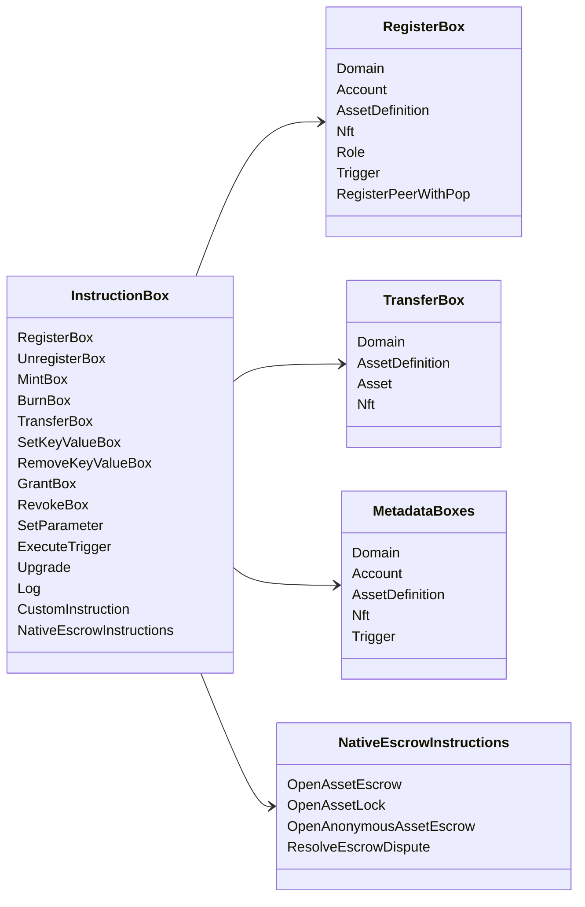

# Iroha Instructions spéciales {#iroha-special-instructions}

Le modèle de données actuel expose ces familles d'instructions intégrées:

|Instruction |Les variantes |
| --- | --- |
| [`RegisterBox`](/fr/blockchain/instructions.md#un-register) | `Domain`, `Account`, `AssetDefinition`, `Nft`, `Role`, `Trigger`, `RegisterPeerWithPop` |
| [`UnregisterBox`](/fr/blockchain/instructions.md#un-register) | `Peer`, `Domain`, `Account`, `AssetDefinition`, `Nft`, `Role`, `Trigger` |
| [`MintBox`](/fr/blockchain/instructions.md#mint-burn) |Numérique `Asset`, déclencheur de répétitions |
| [`BurnBox`](/fr/blockchain/instructions.md#mint-burn) |Numérique `Asset`, déclencheur de répétitions |
| [`TransferBox`](/fr/blockchain/instructions.md#transfer) |`Domain`, `AssetDefinition`, numérique `Asset`, `Nft` |
| [`SetKeyValueBox`](/fr/blockchain/instructions.md#setkeyvalue-removekeyvalue) | `Domain`, `Account`, `AssetDefinition`, `Nft`, `Trigger` métadonnées |
| [`RemoveKeyValueBox`](/fr/blockchain/instructions.md#setkeyvalue-removekeyvalue) | `Domain`, `Account`, `AssetDefinition`, `Nft`, `Trigger` métadonnées |
| [`GrantBox`](/fr/blockchain/instructions.md#grant-revoke) |permis de rendre compte, rôle à rendre compte, autorisation de jouer un rôle |
| [`RevokeBox`](/fr/blockchain/instructions.md#grant-revoke) |autorisation de compte, rôle de compte, autorisation de rôle |
| [`SetParameter`](/fr/blockchain/instructions.md#setparameter) |mise à jour des paramètres de la chaîne |
| [`ExecuteTrigger`](/fr/blockchain/instructions.md#executetrigger) |déclencheur d' exécution |
| [`Upgrade`](/fr/blockchain/instructions.md#other-instructions) |mise à niveau de l' exécuteur |
| [`Log`](/fr/blockchain/instructions.md#other-instructions) |entrée dans le journal de l' exécuteur |
| [`CustomInstruction`](/fr/blockchain/instructions.md#other-instructions) |charge utile spécifique à l'exécuteur JSON |
| [Réserve de l'actif natif](/fr/blockchain/escrow.md) | `OpenAssetEscrow`, `AcceptAssetEscrow`, `MarkEscrowPaymentSent`, `ReleaseAssetEscrow`, `CancelAssetEscrow`, `OpenEscrowDispute`, `ResolveEscrowDispute` |
| [Les verrous d'actifs génériques ](/fr/blockchain/escrow.md#generic-asset-locks) |`OpenAssetLock`, `DrawdownAssetLock`, `CancelAssetLock`, `ExpireAssetLock` |
| [Réservation d'actifs anonymes ](/fr/blockchain/escrow.md#anonymous-escrow) | `OpenAnonymousAssetEscrow`, `AcceptAnonymousAssetEscrow`, `MarkAnonymousEscrowPaymentSent`, `ReleaseAnonymousAssetEscrow`, `CancelAnonymousAssetEscrow`, `OpenAnonymousEscrowDispute`, `ResolveAnonymousEscrowDispute` |

D'autres modules Iroha 3 peuvent enregistrer des types d'instructions spécifiques à un domaine par l'intermédiaire du registre des instructions. Pour la liste de niveau de schéma générée à partir de l'arbre source actuel, voir [Schéma modèle de données](./data-model-schema.md).

::: details Diagramme: Familles de l'instruction principale

:::
