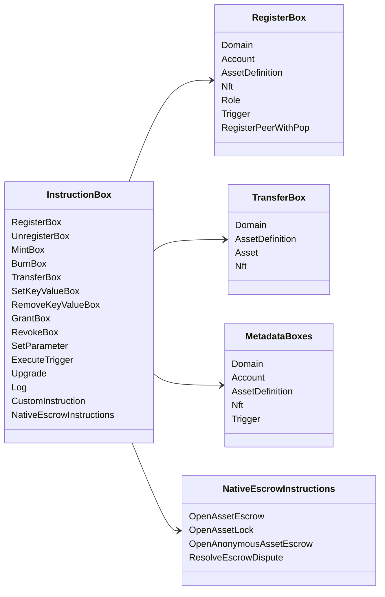

# Iroha Opérations d'instruction {#iroha-special-instructions}

Le modèle de données actuel expose ces familles d'instructions intégrées :

|Instruction|Variantes|
| --- | --- |
| [`RegisterBox`](/fr/blockchain/instructions.md#un-register) | `Domain`, `Account`, `AssetDefinition`, `Nft`, `Role`, `Trigger`, `RegisterPeerWithPop` |
| [`UnregisterBox`](/fr/blockchain/instructions.md#un-register) | `Peer`, `Domain`, `Account`, `AssetDefinition`, `Nft`, `Role`, `Trigger` |
| [`MintBox`](/fr/blockchain/instructions.md#mint-burn) |numérique `Asset`, déclencher des répétitions|
| [`BurnBox`](/fr/blockchain/instructions.md#mint-burn) |numérique `Asset`, déclencher des répétitions|
| [`TransferBox`](/fr/blockchain/instructions.md#transfer) | `Domain`, `AssetDefinition`, numérique `Asset`, `Nft` |
| [`SetKeyValueBox`](/fr/blockchain/instructions.md#setkeyvalue-removekeyvalue) | `Domain`, `Account`, `AssetDefinition`, `Nft`, `Trigger` métadonnées |
| [`RemoveKeyValueBox`](/fr/blockchain/instructions.md#setkeyvalue-removekeyvalue) | `Domain`, `Account`, `AssetDefinition`, `Nft`, `Trigger` métadonnées |
| [`GrantBox`](/fr/blockchain/instructions.md#grant-revoke) | `Permission` (`Grant<Permission, Account>`), `Role` (`Grant<RoleId, Account>`), `RolePermission` (`Grant<Permission, Role>`) |
| [`RevokeBox`](/fr/blockchain/instructions.md#grant-revoke) | `Permission` (`Revoke<Permission, Account>`), `Role` (`Revoke<RoleId, Account>`), `RolePermission` (`Revoke<Permission, Role>`) |
| [`SetParameter`](/fr/blockchain/instructions.md#setparameter) |mise à jour du paramètre de chaîne|
| [`ExecuteTrigger`](/fr/blockchain/instructions.md#executetrigger) |déclencher l'exécution|
| [`Upgrade`](/fr/blockchain/instructions.md#other-instructions) |mise à niveau de l'exécuteur|
| [`Log`](/fr/blockchain/instructions.md#other-instructions) |entrée de journal de l'exécuteur|
| [`CustomInstruction`](/fr/blockchain/instructions.md#other-instructions) | charge utile spécifique à l'exécuteur JSON |
| [Séquestre d'actifs natifs](/fr/blockchain/escrow.md) | `OpenAssetEscrow`, `AcceptAssetEscrow`, `MarkEscrowPaymentSent`, `ReleaseAssetEscrow`, `CancelAssetEscrow`, `OpenEscrowDispute`, `ResolveEscrowDispute` |
| [Verrous d'actifs génériques](/fr/blockchain/escrow.md#generic-asset-locks) | `OpenAssetLock`, `DrawdownAssetLock`, `CancelAssetLock`, `ExpireAssetLock` |
| [Séquestre d'actifs anonyme](/fr/blockchain/escrow.md#anonymous-escrow) | `OpenAnonymousAssetEscrow`, `AcceptAnonymousAssetEscrow`, `MarkAnonymousEscrowPaymentSent`, `ReleaseAnonymousAssetEscrow`, `CancelAnonymousAssetEscrow`, `OpenAnonymousEscrowDispute`, `ResolveAnonymousEscrowDispute` |
| [Règlement privé atomique](/fr/blockchain/instructions.md#atomic-private-settlement) | `ActivatePrivateSettlementPoolV1`, `RotatePrivateSettlementPoolPolicyV1`, `FinalizeAtomicPrivateSettlementV1`, `AbortAtomicPrivateSettlementV1` |

Des modules supplémentaires Iroha 3 peuvent enregistrer des types d'instructions spécifiques au domaine via le registre des instructions. Pour le schéma autoritaire pour le nœud et une commande qui le capture, voir [Schéma du modèle de données](./data-model-schema.md).

::: details Diagramme : Familles d'instructions principales

:::
