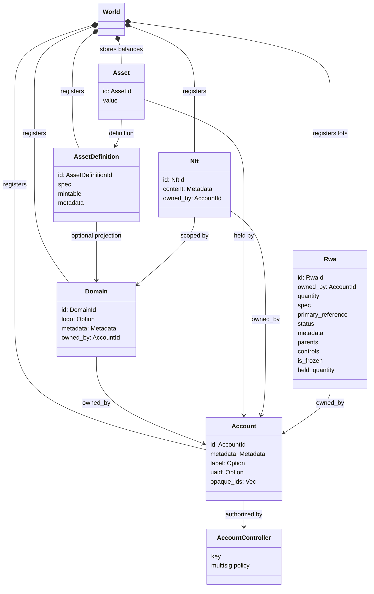
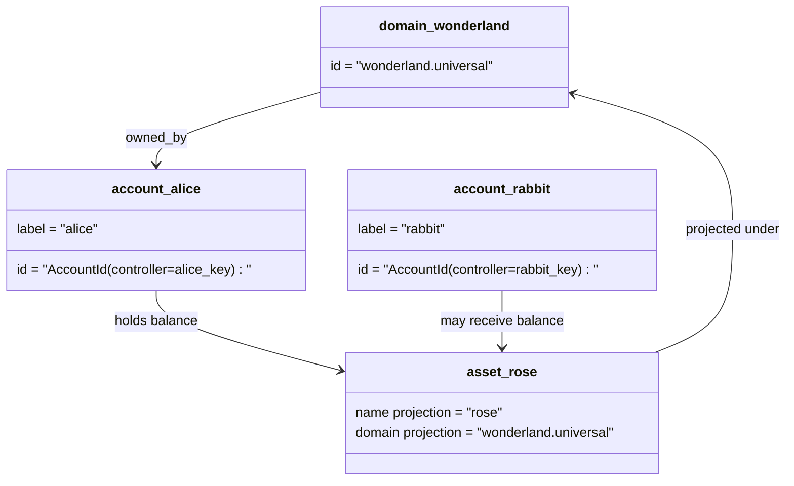

# מודל נתונים {#data-model}

Iroha מאחסן את מדינת ההדף ב- `World`. מודל הנתונים הראשון שלה משתמש באותיות ונושאים קנוניים הבאים:

- דומנים מוכשרים למרחב נתונים, למשל `payments.universal`
- חשבונות הם קאנוניקים וחסר דומנים; החשבון ID נגזר מהמונהל החשבון.
- הגדרות נכסים יכולות לשמור על תחזית דומיין/שם, אבל כתובת הטקסט הקנוניקה שלהם היא מזהה Base58 לא ברורה.
- נכסים הם סולאנים שנחזיקו בחשבונות להגדרה מסוימת של נכסים
- NFTs הם רשומות בבעלות יחידה עם תוכן נתונים מטאטא IDs בעלת רשימת תחום.
- RWAs יוצרים- ID גורמים המייצגים נכסים מחוץ למשרשרת עם הבעלים הנוכחיים, כמותם, מקורם, מטא נתונים, אחזקות, קפואות ופיקוח על מחזור החיים.

## דוגמה {#example}

ברשת Iroha 3, `wonderland.universal` הוא תחום בתוך חלל הנתונים `universal`. החשבונות הקנוניים בדוגמה זו נשלטים על ידי המפתחות או המדיניות שלהם ונקודדים כחשבון ללא תחום I105 IDs. תוויות קריאות כגון `alice@wonderland.universal` הם שם פרטיים מחוברים לאלה IDs. הגדרה מתוכננת של נכס עדיין ניתן לבנות מתוך תחום ושם כגון `rose` ב `wonderland.universal`, בעוד כתובת הגדרת נכס קנונית המשמשת על הקשר היא כתובת Base58 המוצרת.

## פרופילים {#aliases}

כינויים הם שמות פנים לאדם שכבונים מעל מזהים של ספריה קנוניקה. הם מועילים ב API, CLI, הארנק, וגבולות המוקדשים, אבל הקנוניקה IDs נשארת מזוהי יציב שנחזק בשדות ספריה מחוייבים.

|מטרה.|מטרה קאנוניקה |פרופיל מילולי |מודל תמיכה |
| -------------- | --------------------------------------------------- | ------------------------------------------------------ | ----------------------------------------------------------------------------- |
|חשבון משתמש |ללא תחום `AccountId` מקודד כתובת I105 |`name@domain.dataspace` או `name@dataspace` |`AccountAlias`; כינוי ראשוני הוא `Account.label`, כינויים נוספים הם חיבורים |
|הגדרה של נכסים |כתובת קנוניקה `AssetDefinitionId` Base58 |`name#domain.dataspace` או `name#dataspace` |`AssetDefinitionAlias` מחויבת להגדרה של נכס |
|חוזה|קאנוניקה Bech32m `ContractAddress` |`name::domain.dataspace` או `name::dataspace` |`ContractAlias` מחויבת כתובת חוזה משמשת |
|שם דומיין |`DomainId` בצורה `domain.dataspace` |`domain.dataspace` |SNS `domain` רישום מקום שמות |
|שם חלקי נתונים |מספר `DataSpaceId` מהקטלוג פעיל Nexus |שם כינוי למרחב נתונים כגון `universal`, `paynet`, או `zk` |SNS `dataspace` רישום חלל שמות ועוד קטלוג החלל נתונים הפעיל |

הכינויים של חשבונות הם שמות החשבונות המופנים בפני המשתמש. הם שרדים את ריקיוי החשבון כי הכינוי מצביע על החשבון הפעיל ID באמצעות אינדיקסים של מדינות העולם ורישומים של רקיוי חשבון. השתמש `SetPrimaryAccountAlias` עבור התווית העיקרית של החשבון, `SetAccountAliasBinding` עבור כינויים נוספים שאינם ראשוניים, ו `FindAccountByAlias` או `FindAliasesByAccountId` עבור קריאה. כינוי החשבון דורש בדרך כלל רכישה פעילה של כינוי חשבון SNS שנרכשת עם `AcquireAccountAliasLease` ונחדשת עם `RenewAccountAliasLease`.

כינויים של נכסים הם הגדרות של נכסים, לא סולדות חשבונות בודדים. הכינוי של נכסים והכינוי של חוזים הם חיבורים ישירים מהשם קריא למטרה קנוניקה קיימת. הכינוי של נכסים נקבע עם `SetAssetDefinitionAlias`; שקטת שם כינוי חייב להיות תואם לכינוי הגילוי של ההגדרה של נכס או השם של ההגדרת המתוכננת. הכינוי של החוזה נקבוע עם `SetContractAlias`; חלל הנתונים של הכינוי חייב להתאמה עם החלל הנתוני המוצפן בכתובת החוזה. שני הקשרים יכולים לשאת `lease_expiry_ms`; לאחר סיום תקופה הם מפסיקים לפתור כאשר חלון החסד עובר ומוחקים מפריטים של מדינת העולם .

לדומיינים אין אובייקט נפרד `DomainAlias`. מזהד דומיין הוא כבר שם מיומן למרחב נתונים כגון `payments.universal`. SNS מעקב על רכישת השכרה עבור שמות דומנים במרחב שמות `domain` ולתכונות כינויים של מרחב נתונים במרחב המודעים `dataspace`. שמה של חלל הנתונים `universal` צריך להישאר מוגדר.

## מסמכים קשורים {#related-docs}

|נושא |לאן ללכת?|
| -------------------------------------- | ------------------------------------------- |
|תחומים | [תחומים](/he/blockchain/domains.md) |
|חשבונות | [חשבונות](/he/blockchain/accounts.md) |
|נכסים | [נכסים ](/he/blockchain/assets.md) |
|NFTs | [NFTs](/he/blockchain/nfts.md) |
|נכסים בעולם האמיתי | [נכסים בעולם האמיתי](/he/blockchain/rwas.md) |
|נתונים מטאטא| [נתונים מטאטא](/he/blockchain/metadata.md) |
|הוראות רישום והעברות | [הוראות](/he/blockchain/instructions.md) |
|אישור זמן ההופעה | [רשיונות](/he/blockchain/permissions.md) |
|כללי הכינוי | [כללי הכינוי ](/he/reference/naming.md) |
