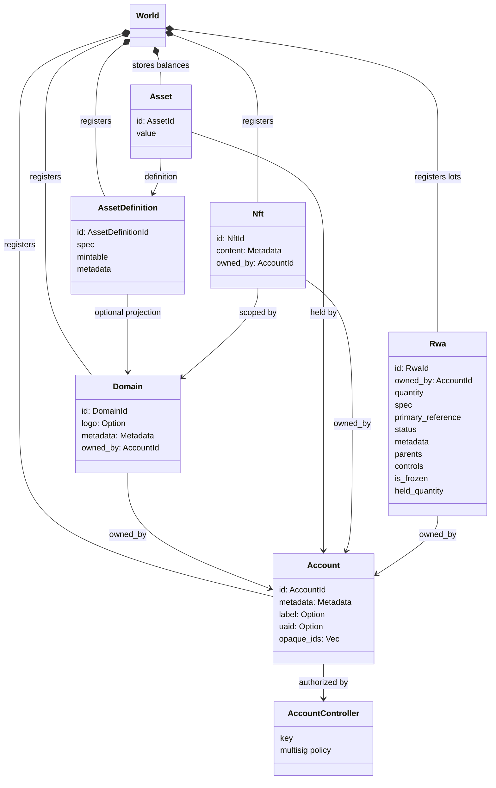
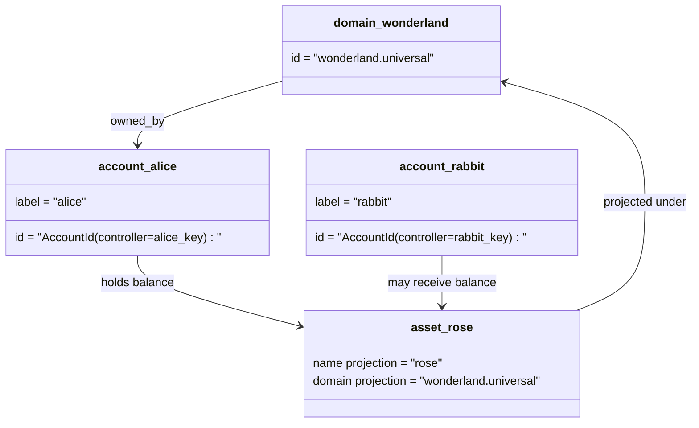

# מודל נתונים {#data-model}

Iroha חנויות ספריה המדינה `World`. השימוש במודל הנתונים הראשון שלו
זהויות וארגונים קנוניים הבאים:

- דומנים הם מיומנים במרחב נתונים, למשל `payments.universal`
- החשבונות הם קנוניים וחסרי תחום; החשבון ID הוא נגזר מה
  מנהל החשבון
- הגדרות נכסים יכולות לשמור על תחזית דומיין/שם, אבל הקאנוניקה שלהם
  כתובת טקסטלית היא מזהה Base58 לא ברור.
- נכסים הם סולאנים שנחזיקו בחשבונות להגדיר נכס מסוים
- NFTs הם רשומות בבעלות יחידה עם רשימת דומיין IDs ונתונים מטא
  תוכן
- RWAs הם נוצרו...ID סרפים המייצגים נכסים מחוץ לשאשרת עם קרן
  בעל, כמות, מקור, מטא-מידע, מחזיקים, קפואים ותיקום חיים
  בדיקות

## דוגמה {#example}

ב- Iroha 3 רשת, `wonderland.universal` הוא תחום בתוך
`universal` את החשבונות הקנוניים בדוגמה זו נשלטו
על ידי המפתחות או מדיניות שלהם ומוסווגים כלא דומיין I105 חשבון IDs. ניתן לקרוא.
תוויות כגון `alice@wonderland.universal` הם כינויים נפרדים קשורים אלה
IDs. הגדרת נכס מתוכננת עדיין ניתן לבנות מתוך תחום ו
שם כגון `rose` ב `wonderland.universal`, בעוד הנכס הקנוני
כתובת הגדרה המשמשת על הקבל היא כתובת Base58 המוצא.

## פרופילים {#aliases}

הכינויים הם שמות פונים לבני אדם שכבות מעל מזהים של ספר הספר הקנוני.
הם שימושיים API, CLI, ארנק, וגבולות המחקרים, אבל קאנוני
IDs נשארו מזהים יציבים שנחזקו בשדות ספריה קפדניים.

| מטרה         | מטרה קאנוניקה                                    | פרופיל מילולית                                          | מודל תמיכה                                                                 |
| -------------- | --------------------------------------------------- | ------------------------------------------------------ | ----------------------------------------------------------------------------- |
| חשבון המשתמש   | ללא תחום `AccountId` קוד כ- I105 כתובת   | `name@domain.dataspace` או `name@dataspace`            | `AccountAlias`; הכינוי העיקרי הוא `Account.label`, פרופילים נוספים הם חיבורים  |
| הגדרה של נכסים | קאנוניקה `AssetDefinitionId` כתובת Base58     | `name#domain.dataspace` או `name#dataspace`            | `AssetDefinitionAlias` קשור להגדרה של נכס                           |
| חוזה       | קאנוניקה Bech32m `ContractAddress`                 | `name::domain.dataspace` או `name::dataspace`          | `ContractAlias` מחויבת לכתובת חוזית משמשת                          |
| שם הדומיין    | `DomainId` ב `domain.dataspace` טופס               | `domain.dataspace`                                    | SNS `domain` רישום חלל שמות                                                 |
| שם חלקי נתונים | מספר `DataSpaceId` מהפעיל Nexus קטלוג | שם כינוי של חלקי נתונים כגון `universal`, `paynet`, או `zk` | SNS `dataspace` רשום חלל שמות ועוד קטלוג חלל נתונים פעיל            |

כינוי חשבונות הם שמות החשבונות המופנים בפני המשתמש. הם שורדים חשבון
ריקיוינג בגלל כי השלט הזה מצביע על החשבון הפעיל ID דרך המדינה העולמית
אינדיקסים ורישומים של רכיבי חשבונות. `SetPrimaryAccountAlias` עבור
התווית העיקרית של החשבון, `SetAccountAliasBinding` עבור תוספות שאינן יסודיות
שם כינוי, ו `FindAccountByAlias` או `FindAliasesByAccountId` עבור קריאה.
כינוי חשבונות בדרך כלל דורש פעיל SNS רכישת מחירי שכר
עם `AcquireAccountAliasLease` וחדש עם `RenewAccountAliasLease`.

פרופיל נכסים נקבעות בשם נכסים, לא סולדות חשבונות בודדים.
כינוי וכינוי חוזי הם חיבורים ישירים
מטרה קנוניקה קיימת. `SetAssetDefinitionAlias`;
סגמנט השם המזוין חייב להתאים את שם ההצגה של הגדרת הנכסים או
שם ההגדרה המתוכננת. `SetContractAlias`;
חלל הנתונים בעלת התכלית תואם את החלל הנתוני המפורסם בכתובת החוזה.
שני הקשרים יכולים לשאת `lease_expiry_ms`; לאחר סיום תקופה הם מפסיקים לפתור.
כאשר חלון החסד עובר ונחלק מפריטים של מדינות העולם.

תחומים אינם בעלי תחום נפרד `DomainAlias` אובייקט. מזהד תחום הוא
כבר שם מוסמך למרחב נתונים כגון: `payments.universal`. SNS עקבות
בעלות השכרה של שמות דומנים `domain` חלל שמות ולחלל נתונים
פרופיל ב- `dataspace` חלל שמות. `universal` שם-תג שפת הנתונים
חייב להישאר מוגדר.

## מסמכים קשורים {#related-docs}

| נושא                                  | לאן ללכת?                                 |
| -------------------------------------- | ------------------------------------------- |
| תחומים                                | [תחומים](/he/blockchain/domains.md)           |
| חשבונות                               | [חשבונות](/he/blockchain/accounts.md)         |
| נכסים                                 | [נכסים](/he/blockchain/assets.md)             |
| NFTs                                   | [NFTs](/he/blockchain/nfts.md)                 |
| נכסים בעולם האמיתי                      | [נכסים בעולם האמיתי](/he/blockchain/rwas.md)    |
| נתונים מטאטא                               | [נתונים מטאטא](/he/blockchain/metadata.md)         |
| הוראות רישום והעברה | [הוראות](/he/blockchain/instructions.md) |
| פתרונות זמן ההופעה                    | [רשיונות](/he/blockchain/permissions.md)   |
| כללי הכינוי                           | [כללי הכינוי](/he/reference/naming.md)        |
