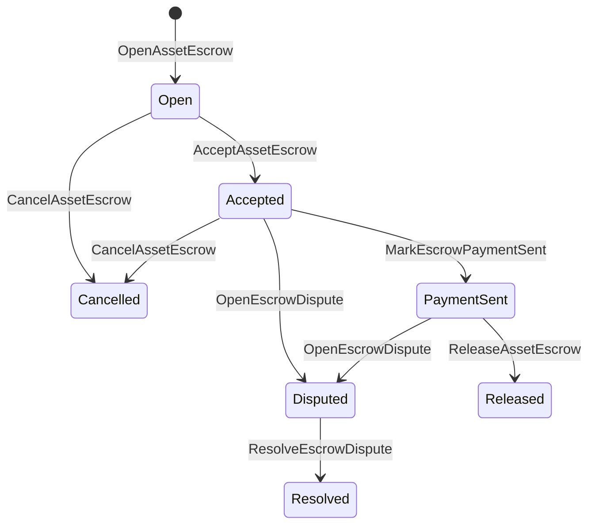

# אבטחה של נכסים מקומיים {#native-asset-escrow}

אבטחה מקומית היא מנגנון אחסון של נכסים מספרים שמנהל בספר. במקום לשלוח נכסים לחשבון בבעלות יישום ולהתבסס על קוד היישום כדי להגן על החשבון, הסקרו ISIs להעביר את הערך לחשבון אחסון פרוטוקול דטרמיניסטי וירשום את מחזור החיים של הסקרו במצב העולם.

השתמשו ב-escrow המקומי עבור הסדר בשוק, תיאום תשלומים מחוץ לשרשרת בסגנון אייטאי, מנעולים של אבני דרך, ותנועות עבודה ב-escro מוגנות שדורשות מצב מחזור חיים נראים במספרים.

## תפיסות {#concepts}

|הרעיון|תיאור |
| --- | --- |
|`EscrowId` |זיהוי נבחר על ידי המתקשר שמסובב חשיש. הוא חייב להיות ייחודי בין אבטחים שקופים ואנונימיים. |
|`AssetEscrowRecord` |רישום אבטחת נכסים מספרים שקופים או סגור. |
|`AnonymousAssetEscrowRecord` |רישום מאבטח מוגן, מבוסס על ביטול, מחויבויות ותיקומים של הוכחה. |
|חשבון שמירה |חשבון פרוטוקול דטרמיניסטי המוצא מרשת ID, מאבטחה ID, והגדרה של נכסים. |
|ראיות השטויות |כמות של חשבונות, משפטים, הודעות, מוניסטים של אחסון או ראיות אחרות מחוץ לרשת.|

רישומים שקופים מכילים את המוכר, הקונה אופציונלי, הגדרה של נכס, סכום הכולל, חשבון אחסון, מצב מחזור החיים, סוג התנהגות, הסכום הנותר, סמכות השחרור אופציונלית, חותמת זמן גמרת אופציונליים, חותמות ראיות, חותמים זמן ופרטים על פתרון אופציונלים.

סכומי אבטחה חייבים להיות כמות נכסים מספרית חיובית וצפויה להתאים לתאריך המספרי של הגדרת נכס. בעוד אבטחה או נעול פעיל, העברת נכסים גנרית לא יכולה לספיק את חשבון השמורות; נתיבי היציאה מהשמורות הם האבטחה ISIs המתוארת בהמשך.

## משכנתא בשוק {#marketplace-escrow}

שוק הבטחון מתואם את השחרור של נכסים בתוך שרשרת עם זרימת עבודה של תשלומים או משלוחים מחוץ לרשת.



|ISI |מי מגיש את זה?|השפעה |
| --- | --- | --- |
|`OpenAssetEscrow` |מוכר |מנעול את הנכס המספרי של המוכר בשמורת הפרוטוקול ויוצר רישום שוק `Open`. |
|`AcceptAssetEscrow` |קונה |רשום את הקונה ומעביר `Open` ל `Accepted`. המוכר לא יכול לקבל את הבטחון שלו. |
|`MarkEscrowPaymentSent` |קונה מקובל |עובר `Accepted` ל `PaymentSent` לאחר שקונה שולח את התשלום מחוץ למשרשרת. |
|`ReleaseAssetEscrow` |מוכר |מעביר את `PaymentSent` ל `Released` ומעביר את הסכום המובטח במלואו למקונה |
|`CancelAssetEscrow` |מוכר |עובר `Open` או `Accepted` ל `Cancelled` ומחזיר את המוכר לפני שהשלם מסומן. |
|`OpenEscrowDispute` |מוכר או קונה מקובל |מזיז `Accepted` או `PaymentSent` ל `Disputed` ומוסיף חישוב ראיות. |
|`ResolveEscrowDispute` |חשבון עם `CanResolveEscrowDispute` |עובר `Disputed` ל `Resolved` ומחלק את הסכום בין הקונה למכר. |

סכומי פתרון מחלוקות חייבים להיות לא שליליים, ו `buyer_amount + seller_amount` חייב להיות שווה לסכום הבטחון. רגל בעלת ערך אפס מותרת, אך כל ההפצה חייבת להיות נתונה על הירי המנעול.

### Rust דוגמה {#rust-example}

דוגמה זו מניחה כי חשבונות המוכר והקונה קיימים כבר, ההגדרה של נכס נרשמת כמספרית, והמכר יש איזון מספיק.

```rust
use iroha::{
    client::Client,
    data_model::{
        isi::escrow::{
            AcceptAssetEscrow, MarkEscrowPaymentSent, OpenAssetEscrow,
            ReleaseAssetEscrow,
        },
        prelude::*,
    },
};
use iroha_crypto::Hash;

fn release_marketplace_escrow(
    seller_client: &Client,
    buyer_client: &Client,
    asset_definition_id: AssetDefinitionId,
) -> eyre::Result<()> {
    let escrow_id = EscrowId::new(Hash::new("docs-marketplace-escrow-001"));

    seller_client.submit_blocking(OpenAssetEscrow::with_evidence_hashes(
        escrow_id,
        asset_definition_id,
        Numeric::from(40_u64),
        vec![Hash::new("invoice:2026-001")],
    ))?;

    buyer_client.submit_blocking(AcceptAssetEscrow::new(escrow_id))?;
    buyer_client.submit_blocking(MarkEscrowPaymentSent::new(escrow_id))?;
    seller_client.submit_blocking(ReleaseAssetEscrow::new(escrow_id))?;

    let record = seller_client.query_single(FindAssetEscrowById::new(escrow_id))?;
    assert_eq!(record.status, AssetEscrowStatus::Released);
    assert_eq!(record.remaining_amount, Numeric::zero());

    Ok(())
}
```

## מנעולים נכסים כלליים {#generic-asset-locks}

מנעולים נכסים משתמשים באותו סוג של רשומות אחסון, אבל הם אינם הצעות קונה-מכר. הם מנעולים כספים לחשבון יעד ואפשרותך דורשים סמכות שחרור נפרדת כדי למשוך כספים.

|ISI |מי מגיש את זה?|השפעה |
| --- | --- | --- |
|`OpenAssetLock` |חשבון מקור |מנעול סכום חיובי, רשום את היעד כקונה הקובץ ומסביר את מצבו ל `Locked`. |
|`DrawdownAssetLock` |סמכות השחרור, או יעד כאשר לא נקבע סמכות שחרור |מעבירים חלק או את כל השמורות הנותרות ליעד. |
|`CancelAssetLock` |פתיחת המנעול|מבטל מנעול פעיל ומחזיר את הסכום הנותר לפתיחת. |
|`ExpireAssetLock` |כל סמכות עסקאות לאחר המועד האחרון |תקופת סגר עם `expires_at_ms` בעבר ומחזיר את הסכום הנותר לפתיחת. |

`DrawdownAssetLock` שומר את הקלטה ב `Locked` בזמן שחלק מהסכומים נשארים. כאשר הסכום הנותר מגיע לאפס, המצב הופך ל `DrawnDown` והקלט נסגר.

```rust
use iroha::{
    client::Client,
    data_model::{
        isi::escrow::{CancelAssetLock, DrawdownAssetLock, ExpireAssetLock, OpenAssetLock},
        prelude::*,
    },
};
use iroha_crypto::Hash;

fn drawdown_and_close_asset_locks(
    opener_client: &Client,
    destination_client: &Client,
    release_authority_client: &Client,
    asset_definition_id: AssetDefinitionId,
    destination: AccountId,
    release_authority: AccountId,
) -> eyre::Result<()> {
    let trusted_lock_id = EscrowId::new(Hash::new("docs-asset-lock-trusted"));

    opener_client.submit_blocking(OpenAssetLock::with_options(
        trusted_lock_id,
        asset_definition_id.clone(),
        destination.clone(),
        Numeric::from(40_u64),
        Some(release_authority),
        None,
        vec![Hash::new("milestone-plan-v1")],
    ))?;

    release_authority_client.submit_blocking(DrawdownAssetLock::new(
        trusted_lock_id,
        Numeric::from(15_u64),
    ))?;

    let partially_drawn =
        opener_client.query_single(FindAssetEscrowById::new(trusted_lock_id))?;
    assert_eq!(partially_drawn.status, AssetEscrowStatus::Locked);
    assert_eq!(partially_drawn.remaining_amount, Numeric::from(25_u64));

    opener_client.submit_blocking(CancelAssetLock::new(trusted_lock_id))?;
    let cancelled = opener_client.query_single(FindAssetEscrowById::new(trusted_lock_id))?;
    assert_eq!(cancelled.status, AssetEscrowStatus::Cancelled);

    let expiring_lock_id = EscrowId::new(Hash::new("docs-asset-lock-expiring"));
    opener_client.submit_blocking(OpenAssetLock::with_options(
        expiring_lock_id,
        asset_definition_id,
        destination,
        Numeric::from(10_u64),
        None,
        Some(0),
        Vec::new(),
    ))?;

    destination_client.submit_blocking(ExpireAssetLock::new(expiring_lock_id))?;
    let expired = opener_client.query_single(FindAssetEscrowById::new(expiring_lock_id))?;
    assert_eq!(expired.status, AssetEscrowStatus::Expired);

    Ok(())
}
```

Python כיום חשוף עוזרים ברמה גבוהה למנעולים גנטיים: `open_asset_lock`, `drawdown_asset_lock`, `cancel_asset_lock`, ו `expire_asset_lock`. למקומות השוק ולשמורת אנונימית Python, שימוש קאנוני `InstructionBox` JSON דרך SDK זה... JSON פתח בריחה, או להגיש דרך SDK זה חושף את הבניינים של אבטחה מדרגה ראשונה.

## מחלוקות {#disputes}

סגור בשוק יכול להגיש מחלוקת מ- `Accepted` או `PaymentSent`. רק המוכר רשום או הקונה יכולים לפתוח את המחלוקת. פתרון דורש `CanResolveEscrowDispute`, בין אם ניתן ישירות לחשבון הגורם או מורשת דרך תפקיד.

```rust
use iroha::{
    client::Client,
    data_model::{
        isi::escrow::{OpenEscrowDispute, ResolveEscrowDispute},
        prelude::*,
    },
};
use iroha_crypto::Hash;
use iroha_executor_data_model::permission::escrow::CanResolveEscrowDispute;

fn resolve_disputed_escrow(
    admin_client: &Client,
    buyer_client: &Client,
    court_client: &Client,
    court: AccountId,
    escrow_id: EscrowId,
) -> eyre::Result<()> {
    admin_client.submit_blocking(Grant::account_permission(
        Permission::from(CanResolveEscrowDispute),
        court,
    ))?;

    buyer_client.submit_blocking(OpenEscrowDispute::with_evidence_hashes(
        escrow_id,
        vec![Hash::new("buyer-payment-receipt")],
    ))?;

    court_client.submit_blocking(ResolveEscrowDispute::with_evidence_hashes(
        escrow_id,
        Numeric::from(30_u64),
        Numeric::from(10_u64),
        vec![Hash::new("court-judgement-001")],
    ))?;

    let record = admin_client.query_single(FindAssetEscrowById::new(escrow_id))?;
    assert_eq!(record.status, AssetEscrowStatus::Resolved);
    assert_eq!(
        record.resolution.as_ref().map(|resolution| resolution.buyer_amount.clone()),
        Some(Numeric::from(30_u64)),
    );

    Ok(())
}
```

## אסקרו אנונימי {#anonymous-escrow}

אבטחה אנונימית משתמשת באותו מחזור החיים של השוק, אך תנועת המימון והסגירת נכסים מוגן. רישום הציבורי עדיין מאחסן מוכר, קונה, מעמד, ראיות האשיזים, חותמות זמן ורשומות תנועה מקושרות לתוכנות. סכומים ומקבלים בתוך הערות מובטחות מתייצגים על ידי מחויבויות, ביטוליות, ותיקומי הוכחה.

|שקוף ISI |אנונימי ISI |
| --- | --- |
|`OpenAssetEscrow` |`OpenAnonymousAssetEscrow` |
|`AcceptAssetEscrow` |`AcceptAnonymousAssetEscrow` |
|`MarkEscrowPaymentSent` |`MarkAnonymousEscrowPaymentSent` |
|`ReleaseAssetEscrow` |`ReleaseAnonymousAssetEscrow` |
|`CancelAssetEscrow` |`CancelAnonymousAssetEscrow` |
|`OpenEscrowDispute` |`OpenAnonymousEscrowDispute` |
|`ResolveEscrowDispute` |`ResolveAnonymousEscrowDispute` |

כלי הארנק או סבר חייבים לבנות את קישור ההוכחה ואת הכנסות הציבוריות. פתיחת יוצרת מחויבות מאובטח אחת. השחרור, ביטול ופיתרון מחלוקת אנונימי צריכים להשקיע בדיוק מחויבות מובטח אחד ויצאו את הקונה, המוכר, או מחויבות יציר חלקית הנדרשות על ידי הפעולה.

```rust
use iroha::{
    client::Client,
    data_model::{
        isi::escrow::{
            AcceptAnonymousAssetEscrow, MarkAnonymousEscrowPaymentSent,
            OpenAnonymousAssetEscrow,
        },
        prelude::*,
        proof::ProofAttachment,
    },
};
use iroha_crypto::Hash;

fn open_anonymous_escrow(
    seller_client: &Client,
    buyer_client: &Client,
    escrow_id: EscrowId,
    asset_definition_id: AssetDefinitionId,
    funding_nullifiers: Vec<[u8; 32]>,
    escrow_commitment: [u8; 32],
    proof: ProofAttachment,
    root_hint: Option<[u8; 32]>,
) -> eyre::Result<()> {
    seller_client.submit_blocking(OpenAnonymousAssetEscrow::with_evidence_hashes(
        escrow_id,
        asset_definition_id,
        funding_nullifiers,
        escrow_commitment,
        proof,
        root_hint,
        vec![Hash::new("shielded-invoice")],
    ))?;

    buyer_client.submit_blocking(AcceptAnonymousAssetEscrow::new(escrow_id))?;
    buyer_client.submit_blocking(MarkAnonymousEscrowPaymentSent::new(escrow_id))?;

    Ok(())
}
```

עבור מודל העסקאות המסתתנים הבסיסי, ראה [העסקות אנונימיות ](/he/blockchain/anonymous-transactions.md).

## SDK שימוש {#sdk-usage}

תמיכה בנקודת אבטחה נחשפת באופן שונה בכל רחבי SDKs. Rust יש את מודל הנתונים הטייפד קנוני. Python חושף כיום עוזרים גנטיים לחסום נכסים. JavaScript ו TypeScript משתמשים Kotodama בקריאות מארח אבטחה. Kotlin/JVM ו Swift מספקים בניית מטען מועיל עם טופס עבור שוק ושמורת אנונימית.

|SDK |השתמשו על פני השטח הזה.|טווח|
| --- | --- | --- |
| [Rust](#rust-sdk) |`iroha::data_model::isi::escrow` |מאבטחה בשוק, מנעולים גנטיים, מאבטחת אנונימית, שאלות ואירועים. |
| [Python](#python-asset-locks) |`Instruction.open_asset_lock`, `TransactionDraft.open_asset_lock`, ועוזרי הלקוח `*_and_wait` |סגרות נכסים גנריות. השוק ועוזרי אבטחה אנונימיים אינם עדיין שיטות Python מעמד ראשון. |
| [JavaScript / TypeScript ](#javascript-and-typescript-kotodama) |`compileKotodamaProgram` מ- `@iroha/iroha-js/kotodama-compiler` |קריאות מארח אסקרו בתוך Kotodama חוזים. |
| [Kotlin / JVM ](#kotlin-and-jvm) |סוגי `InstructionTemplate` ב- `org.hyperledger.iroha.sdk.core.model.instructions` |שוק וטמבלים אנונימיים של הוראות אישית. |
| [Swift / iOS](#swift-and-ios) |עוזרים `NativeEscrowInstructionBuilders` ו `IrohaSDK.build*Escrow*` |שוק ומעובדים אנונימיים של הוראות Norito JSON. |

הדוגמאות הבאות מתמקדות בבניית ההוראות. מימון חשבונות, ניהול חתימות ושלוח עסקאות עוקבים אחרי הזרימה הרגילה עבור כל אחד SDK.

### Rust SDK {#rust-sdk}

השתמש Rust SDK כאשר אתה צריך כיסוי מקומי מלא או חיפוש / אירוע תמיכה. הדוגמאות לעיל מראות שחרור בשוק, קבלת נעילה גנרית, פתרון מחלוקת, ובנייה מאבטחה אנונימית עם `iroha::data_model::isi::escrow`.

```rust
use iroha::{
    client::Client,
    data_model::{isi::escrow::OpenAssetEscrow, prelude::*},
};
use iroha_crypto::Hash;

fn open_and_read(
    client: &Client,
    asset_definition_id: AssetDefinitionId,
) -> eyre::Result<AssetEscrowRecord> {
    let escrow_id = EscrowId::new(Hash::new("docs-rust-sdk-escrow"));

    client.submit_blocking(OpenAssetEscrow::new(
        escrow_id,
        asset_definition_id,
        Numeric::from(10_u64),
    ))?;

    client.query_single(FindAssetEscrowById::new(escrow_id))
}
```

### Python מנעולים נכסים {#python-asset-locks}

Python SDK חושף עוזרים מדרגה ראשונה למנעולים נכסים גנטיים. השתמש בהם עבור תשלומים של אבני דרך, משיכות על ידי רשות שחרור, ביטול על ידי הפתיחה, ותחזות סגירת תקופה.

```python
client.open_asset_lock_and_wait(
    chain_id="dev-chain",
    authority="<source-account-id>",
    private_key_hex="<source-private-key-hex>",
    escrow_id="merchant-lock-001",
    asset_definition_id="<asset-definition-base58>",
    destination="<destination-account-id>",
    amount="2500",
    release_authority="<trusted-release-account-id>",
    expires_at_ms=1_704_000_000_000,
)

client.drawdown_asset_lock_and_wait(
    chain_id="dev-chain",
    authority="<trusted-release-account-id>",
    private_key_hex="<trusted-release-private-key-hex>",
    escrow_id="merchant-lock-001",
    amount="1000",
)

client.expire_asset_lock_and_wait(
    chain_id="dev-chain",
    authority="<any-account-id>",
    private_key_hex="<any-private-key-hex>",
    escrow_id="merchant-lock-001",
)
```

עבור מנעול משתי צדדים, השאירו `release_authority`; חשבון היעד יכול לאחר מכן לשלוח `drawdown_asset_lock`.

### JavaScript ו TypeScript Kotodama {#javascript-and-typescript-kotodama}

JavaScript SDK לא חושף כיום את הבניינים המקומיים של עסקאות מאבטחה ישירות. עבור יישומים של JavaScript או TypeScript שמפיצים חוזים של Kotodama, תארו שיחות מארחת מאבטחים עם מתאסוף Kotodama.

שיחות מארח אבטחה מקומית דורשות רמזות גישה מפורסות כי הקאמפילור לא יכול להוציא קבוצות גישה צר יותר עבור אבטחה בלתי ברורה ISIs. השתמשו ברמזים של קלפים חיצוניים על נקודות כניסה שנוצאו שמקורות ב- `escrow_*` מבוססים.

```js
import { compileKotodamaProgram } from "@iroha/iroha-js/kotodama-compiler";

const source = `
seiyaku MarketplaceEscrow {
  meta { abi_version: 1; }

  #[access(read="*", write="*")]
  kotoage fn run() permission(Admin) {
    let asset = asset_definition("62Fk4FPcMuLvW5QjDGNF2a4jAmjM");
    let offer = name("aitai_offer");
    let evidence = norito_bytes("00");

    call escrow_open_offer(offer, asset, 10, evidence);
    call escrow_accept(offer);
    call escrow_mark_payment_sent(offer);
    call escrow_release(offer);
  }
}
`;

const compiled = compileKotodamaProgram(source, {
  sourceName: "escrow.ko",
});

if (compiled.diagnostics.length > 0) {
  throw new Error(compiled.diagnostics.map((item) => item.message).join("\n"));
}
```

עבור מחלוקות, השתמשו ב- `escrow_open_dispute(offer, evidence)` ו- `escrow_resolve_dispute(offer, buyer_amount, seller_amount, evidence)`. טלפונים anonymizes escrow host מקבלים ב- Norito בקשות של מטען מועיל, למשל `anonymous_escrow_open_offer(request)`

### Kotlin ו JVM {#kotlin-and-jvm}

הטמבל Kotlin/JVM SDK מודלים אבטחה מקומית כטמבלים של הוראות מותאם. כל טמבל מעודד את השדות הנדרשים ומחשף את המפה הקנוניקה של הטיעונים המשמשת על ידי בונה העסקאות.

```kotlin
import org.hyperledger.iroha.sdk.core.model.escrow.NativeEscrowPermissions
import org.hyperledger.iroha.sdk.core.model.instructions.AcceptAssetEscrowInstruction
import org.hyperledger.iroha.sdk.core.model.instructions.MarkEscrowPaymentSentInstruction
import org.hyperledger.iroha.sdk.core.model.instructions.OpenAssetEscrowInstruction
import org.hyperledger.iroha.sdk.core.model.instructions.ReleaseAssetEscrowInstruction
import org.hyperledger.iroha.sdk.core.model.instructions.ResolveEscrowDisputeInstruction

val open = OpenAssetEscrowInstruction(
    escrowId = "escrow-hash",
    assetDefinition = "xor#wonderland",
    amount = "42.5",
    evidenceHashes = listOf("invoice-hash"),
)
val accept = AcceptAssetEscrowInstruction("escrow-hash")
val paid = MarkEscrowPaymentSentInstruction("escrow-hash")
val release = ReleaseAssetEscrowInstruction("escrow-hash")
val resolve = ResolveEscrowDisputeInstruction(
    escrowId = "escrow-hash",
    buyerAmount = "30",
    sellerAmount = "12.5",
    evidenceHashes = listOf("judgement-hash"),
)

println(open.arguments)
println(NativeEscrowPermissions.CAN_RESOLVE_ESCROW_DISPUTE)
```

תבניות אנונימיות זמינות: `OpenAnonymousAssetEscrowInstruction`, `AcceptAnonymousAssetEscrowInstruction`, `MarkAnonymousEscrowPaymentSentInstruction`, `ReleaseAnonymousAssetEscrowInstruction`, `CancelAnonymousAssetEscrowInstruction`, `OpenAnonymousEscrowDisputeInstruction`, ו `ResolveAnonymousEscrowDisputeInstruction`. Android טלפנים של ג'אווה יכולים להשתמש בהתאם `NativeEscrowInstructions.*` הבניינים מ Android ארטיפקט.

### Swift ו-iOS {#swift-and-ios}

ה- Swift SDK מבנה הוראות אבטחה כ Norito JSON מטענים מועילים. `NativeEscrowInstructionBuilders` ישירות, או להתקשר למשקל המקביל `IrohaSDK.build*Escrow*` עוזר כאשר האפליקציה שלך כבר מחזיקה `IrohaSDK` דוגמה.

```swift
import IrohaSwift

let open = try NativeEscrowInstructionBuilders.openAssetEscrow(
    escrowId: "escrow-hash",
    assetDefinition: "xor#wonderland",
    amount: "42.5",
    evidenceHashes: ["invoice-hash"]
)
let accept = try NativeEscrowInstructionBuilders.acceptAssetEscrow(
    escrowId: "escrow-hash"
)
let paid = try NativeEscrowInstructionBuilders.markEscrowPaymentSent(
    escrowId: "escrow-hash"
)
let release = try NativeEscrowInstructionBuilders.releaseAssetEscrow(
    escrowId: "escrow-hash"
)
let resolve = try NativeEscrowInstructionBuilders.resolveEscrowDispute(
    escrowId: "escrow-hash",
    buyerAmount: "30",
    sellerAmount: "12.5",
    evidenceHashes: ["judgement-hash"]
)
```

אנונימי. Swift הבניינים לוקחים רשימות ביטול, רשימות מחויבות יצירה, מילון הוכחה, ואופנציאליים `rootHint` הערכים. סימן רשות פתרון מחלוקת זמין כ: `NativeEscrowPermissions.canResolveEscrowDispute`.

## שאלות ואירועים {#queries-and-events}

השתמשו בשאלות אבטחה עבור דפים של מצב, עבודות פיצוי, וכלי תמיכה:

|שאלה |מטרה.|
| --- | --- |
|`FindAssetEscrowById` |קראו אבטחה חיונית אחת או סגור על ידי `EscrowId`. |
|`FindAssetEscrows` |רשום רישומי אבטחה ונעלי שקופים. |
|`FindAssetEscrowsBySeller` |רשימה של רשומות שנפתחו על ידי מוכר או פותח מנעולים. |
|`FindAssetEscrowsByBuyer` |רשימה של מאבטחות שוק מקובלות על ידי קונה או מנעולים המתמקדים ביעד. |
|`FindAssetEscrowsByStatus` |רשימת רשומות עד `AssetEscrowStatus`. |
|`FindAnonymousAssetEscrowById` |קראו מאבטח אנונימי אחד על ידי `EscrowId`. |
|`FindAnonymousAssetEscrows*` |רשימה של מאבטחים אנונימיים לפי כל הרשומות, מוכר, קונה או מצב. |

`EscrowEventFilter` יכול לחתום על אירועי אבטחה מקומית שקופים ומנעולים באמצעות אבטחה ID, מוכר, קונה, מעמד, ומסכת אירוע. `Opened`, `Accepted`, `PaymentSent`, `Released`, `Cancelled`, `Expired`, `Disputed`, ו `Resolved`. רישומי אבטחה אנונימיים מבוקשים באמצעות שאלונות אבטחת אנונימית.

## הערות הפעילות {#operational-notes}

- שמור חשבונות גדולים, רישומי שיחות, משפטים או חבילות בדיקה מחוץ לרשימת הבטוחים ותתקין את ה-hashes שלהם כראיות.
- השתמשו בהשוואה יציבה `EscrowId` בתביעות, כך שבניסיון חוזר לא ניתן ליצור מאבטחים כפולים עבור אותה הצעה.
- תוספת `CanResolveEscrowDispute` רק לחשבונות או תפקידים המפעילים את תהליך העימות.
- Iroha מתעד את המעברים של מעצר ותיקום חיים; הוא אינו בודק את מסלול התשלומים הפוטנציאליים או החיצוניים בעצמו.
