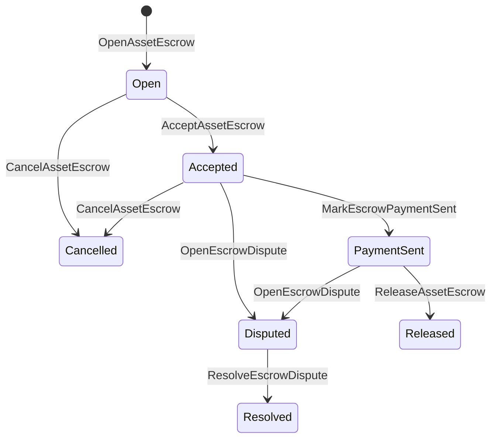

# נאמנות נכסים מובנית {#native-asset-escrow}

נאמנות מובנית היא מנגנון משמורת לנכסים מספריים שמנוהל בידי ספר החשבונות. במקום לשלוח נכסים לחשבון שבבעלות יישום ולהסתמך על קוד היישום שיגן עליו, הוראות הנאמנות (ISIs) מעבירות את הערך לחשבון משמורת דטרמיניסטי של הפרוטוקול ומתעדות את מחזור חיי הנאמנות במצב העולם.

השתמשו בנאמנות המובנית להסדרי שוק, לתיאום תשלומים מחוץ לשרשרת בסגנון Aitai, לנעילות לפי אבני דרך ולתהליכי נאמנות מוגנים שצריכים מצב מחזור חיים גלוי בספר החשבונות.

## תפיסות {#concepts}

|הרעיון|תיאור |
| --- | --- |
|`EscrowId` |מזהה שבוחר המתקשר ועוטף גיבוב. עליו להיות ייחודי בכל רשומות הנאמנות השקופות והאנונימיות. |
|`AssetEscrowRecord` |רשומת נאמנות או נעילה שקופה של נכס מספרי. |
|`AnonymousAssetEscrowRecord` |רשומת נאמנות מוגנת הנשענת על nullifiers, התחייבויות וצרופות הוכחה. |
|חשבון משמורת |חשבון פרוטוקול דטרמיניסטי הנגזר ממזהה השרשרת (ID), ממזהה הנאמנות (ID) ומהגדרת הנכס. |
|גיבובי ראיות |גיבובי ראיות יכולים לזהות חשבוניות, פסקי דין, הודעות, מניפסטים של אחסון או ראיות אחרות מחוץ לשרשרת. מטען הראיה עצמו אינו נשמר ברשומת הנאמנות. |

רשומות שקופות כוללות את המוכר, קונה אופציונלי, הגדרת הנכס, הסכום הכולל, חשבון המשמורת, מצב מחזור החיים, סוג ההתנהגות, הסכום שנותר, סמכות שחרור אופציונלית, חותמת זמן תפוגה אופציונלית, גיבובי ראיות, חותמות זמן ופרטי פתרון אופציונליים.

סכומי נאמנות חייבים להיות כמויות חיוביות של נכס מספרי ולהתאים למפרט המספרי של הגדרת הנכס. כל עוד נאמנות או נעילה פעילות, העברות נכסים כלליות אינן יכולות לרוקן את חשבון המשמורת; היציאה מן המשמורת נעשית רק באמצעות ה־ISIs של הנאמנות המתוארות להלן.

## נאמנות בשוק {#marketplace-escrow}

נאמנות בשוק מתאמת שחרור נכס בשרשרת עם תהליך תשלום או מסירה מחוץ לשרשרת.



|ISI |מי מגיש את זה?|השפעה |
| --- | --- | --- |
|`OpenAssetEscrow` |מוכר |נועל את הנכס המספרי של המוכר במשמורת הפרוטוקול ויוצר רשומת שוק במצב `Open`. |
|`AcceptAssetEscrow` |קונה |מתעד את הקונה ומעביר מ־`Open` ל־`Accepted`. המוכר אינו יכול לקבל את הנאמנות של עצמו. |
|`MarkEscrowPaymentSent` |הקונה שהתקבל |מעביר מ־`Accepted` ל־`PaymentSent` לאחר שהקונה שולח את התשלום מחוץ לשרשרת. |
|`ReleaseAssetEscrow` |מוכר |מעביר מ־`PaymentSent` ל־`Released` ומעביר לקונה את מלוא הסכום שהופקד בנאמנות. |
|`CancelAssetEscrow` |מוכר |מעביר מ־`Open` או `Accepted` ל־`Cancelled` ומחזיר את הכספים למוכר לפני סימון התשלום. |
|`OpenEscrowDispute` |המוכר או הקונה שהתקבל |מעביר מ־`Accepted` או `PaymentSent` ל־`Disputed` ומצרף גיבובי ראיות. |
|`ResolveEscrowDispute` |חשבון בעל `CanResolveEscrowDispute` |מעביר מ־`Disputed` ל־`Resolved` ומחלק את הסכום בין הקונה למוכר. |

הסכומים בפתרון מחלוקת חייבים להיות לא־שליליים, והסכום `buyer_amount + seller_amount` חייב להיות שווה לסכום הנאמנות. מותר שאחד החלקים יהיה אפס, אך החלוקה כולה חייבת לכסות את היתרה הנעולה.

### Rust דוגמה {#rust-example}

הדוגמה מניחה שחשבונות המוכר והקונה כבר קיימים, שהגדרת הנכס רשומה כמספרית ושיש למוכר יתרה מספקת.

```rust
use iroha::{
    client::Client,
    data_model::{
        isi::escrow::{
            AcceptAssetEscrow, MarkEscrowPaymentSent, OpenAssetEscrow,
            ReleaseAssetEscrow,
        },
        prelude::*,
    },
};
use iroha_crypto::Hash;

fn release_marketplace_escrow(
    seller_client: &Client,
    buyer_client: &Client,
    asset_definition_id: AssetDefinitionId,
) -> eyre::Result<()> {
    let escrow_id = EscrowId::new(Hash::new("docs-marketplace-escrow-001"));

    seller_client.submit_blocking(OpenAssetEscrow::with_evidence_hashes(
        escrow_id,
        asset_definition_id,
        Numeric::from(40_u64),
        vec![Hash::new("invoice:2026-001")],
    ))?;

    buyer_client.submit_blocking(AcceptAssetEscrow::new(escrow_id))?;
    buyer_client.submit_blocking(MarkEscrowPaymentSent::new(escrow_id))?;
    seller_client.submit_blocking(ReleaseAssetEscrow::new(escrow_id))?;

    let record = seller_client.query_single(FindAssetEscrowById::new(escrow_id))?;
    assert_eq!(record.status, AssetEscrowStatus::Released);
    assert_eq!(record.remaining_amount, Numeric::zero());

    Ok(())
}
```

## נעילות נכסים כלליות {#generic-asset-locks}

נעילות נכסים משתמשות באותו סוג של רשומת משמורת, אך אינן הצעות בין קונה למוכר. הן נועלות כספים עבור חשבון יעד, ויכולות לדרוש סמכות שחרור נפרדת למשיכת הכספים.

|ISI |מי מגיש את זה?|השפעה |
| --- | --- | --- |
|`OpenAssetLock` |חשבון המקור |נועל סכום חיובי, מתעד את היעד כקונה ברשומה ומגדיר את המצב `Locked`. |
|`DrawdownAssetLock` |סמכות השחרור, או היעד אם לא הוגדרה סמכות שחרור |מעביר חלק מן המשמורת שנותרה או את כולה אל היעד. |
|`CancelAssetLock` |פותח הנעילה |מבטל נעילה פעילה ומחזיר את הסכום שנותר לפותח. |
|`ExpireAssetLock` |כל סמכות עסקה לאחר המועד האחרון |מסיים נעילה שהערך `expires_at_ms` שלה נמצא בעבר ומחזיר את הסכום שנותר לפותח. |

`DrawdownAssetLock` משאיר את הרשומה במצב `Locked` כל עוד נותר סכום כלשהו. כאשר הסכום שנותר מגיע לאפס, המצב הופך ל־`DrawnDown` והרשומה נסגרת.

```rust
use iroha::{
    client::Client,
    data_model::{
        isi::escrow::{CancelAssetLock, DrawdownAssetLock, ExpireAssetLock, OpenAssetLock},
        prelude::*,
    },
};
use iroha_crypto::Hash;

fn drawdown_and_close_asset_locks(
    opener_client: &Client,
    destination_client: &Client,
    release_authority_client: &Client,
    asset_definition_id: AssetDefinitionId,
    destination: AccountId,
    release_authority: AccountId,
) -> eyre::Result<()> {
    let trusted_lock_id = EscrowId::new(Hash::new("docs-asset-lock-trusted"));

    opener_client.submit_blocking(OpenAssetLock::with_options(
        trusted_lock_id,
        asset_definition_id.clone(),
        destination.clone(),
        Numeric::from(40_u64),
        Some(release_authority),
        None,
        vec![Hash::new("milestone-plan-v1")],
    ))?;

    release_authority_client.submit_blocking(DrawdownAssetLock::new(
        trusted_lock_id,
        Numeric::from(15_u64),
    ))?;

    let partially_drawn =
        opener_client.query_single(FindAssetEscrowById::new(trusted_lock_id))?;
    assert_eq!(partially_drawn.status, AssetEscrowStatus::Locked);
    assert_eq!(partially_drawn.remaining_amount, Numeric::from(25_u64));

    opener_client.submit_blocking(CancelAssetLock::new(trusted_lock_id))?;
    let cancelled = opener_client.query_single(FindAssetEscrowById::new(trusted_lock_id))?;
    assert_eq!(cancelled.status, AssetEscrowStatus::Cancelled);

    let expiring_lock_id = EscrowId::new(Hash::new("docs-asset-lock-expiring"));
    opener_client.submit_blocking(OpenAssetLock::with_options(
        expiring_lock_id,
        asset_definition_id,
        destination,
        Numeric::from(10_u64),
        None,
        Some(0),
        Vec::new(),
    ))?;

    destination_client.submit_blocking(ExpireAssetLock::new(expiring_lock_id))?;
    let expired = opener_client.query_single(FindAssetEscrowById::new(expiring_lock_id))?;
    assert_eq!(expired.status, AssetEscrowStatus::Expired);

    Ok(())
}
```

Python מספק כיום עזרים עיליים לנעילות נכסים כלליות: `open_asset_lock`, ‏`drawdown_asset_lock`, ‏`cancel_asset_lock` ו־`expire_asset_lock`. עבור נאמנות שוק ונאמנות אנונימית ב־Python, השתמשו ב־JSON קנוני של `InstructionBox` דרך נתיב המילוט ל־JSON של ה־SDK, או שלחו באמצעות SDK שמספק בוני נאמנות ייעודיים.

## מחלוקות {#disputes}

אפשר לפתוח מחלוקת על נאמנות שוק במצב `Accepted` או `PaymentSent`. רק המוכר הרשום או הקונה יכולים לפתוח אותה. פתרון המחלוקת דורש `CanResolveEscrowDispute`, בין שההרשאה הוענקה ישירות לחשבון הפועל ובין שהתקבלה בירושה מתפקיד.

```rust
use iroha::{
    client::Client,
    data_model::{
        isi::escrow::{OpenEscrowDispute, ResolveEscrowDispute},
        prelude::*,
    },
};
use iroha_crypto::Hash;
use iroha_executor_data_model::permission::escrow::CanResolveEscrowDispute;

fn resolve_disputed_escrow(
    admin_client: &Client,
    buyer_client: &Client,
    court_client: &Client,
    court: AccountId,
    escrow_id: EscrowId,
) -> eyre::Result<()> {
    admin_client.submit_blocking(Grant::account_permission(
        Permission::from(CanResolveEscrowDispute),
        court,
    ))?;

    buyer_client.submit_blocking(OpenEscrowDispute::with_evidence_hashes(
        escrow_id,
        vec![Hash::new("buyer-payment-receipt")],
    ))?;

    court_client.submit_blocking(ResolveEscrowDispute::with_evidence_hashes(
        escrow_id,
        Numeric::from(30_u64),
        Numeric::from(10_u64),
        vec![Hash::new("court-judgement-001")],
    ))?;

    let record = admin_client.query_single(FindAssetEscrowById::new(escrow_id))?;
    assert_eq!(record.status, AssetEscrowStatus::Resolved);
    assert_eq!(
        record.resolution.as_ref().map(|resolution| resolution.buyer_amount.clone()),
        Some(Numeric::from(30_u64)),
    );

    Ok(())
}
```

## נאמנות אנונימית {#anonymous-escrow}

נאמנות אנונימית משתמשת באותו מחזור חיים של נאמנות השוק, אך תנועות המימון והסגירה של הנכסים מוגנות. הרשומה הציבורית עדיין שומרת את המוכר, הקונה, המצב, גיבובי הראיות, חותמות הזמן ורשומות התנועה המקושרות להוכחות. סכומים ונמענים בתוך פתקים מוגנים מיוצגים באמצעות התחייבויות, nullifiers וצרופות הוכחה.

|ISI שקוף |ISI אנונימי |
| --- | --- |
|`OpenAssetEscrow` |`OpenAnonymousAssetEscrow` |
|`AcceptAssetEscrow` |`AcceptAnonymousAssetEscrow` |
|`MarkEscrowPaymentSent` |`MarkAnonymousEscrowPaymentSent` |
|`ReleaseAssetEscrow` |`ReleaseAnonymousAssetEscrow` |
|`CancelAssetEscrow` |`CancelAnonymousAssetEscrow` |
|`OpenEscrowDispute` |`OpenAnonymousEscrowDispute` |
|`ResolveEscrowDispute` |`ResolveAnonymousEscrowDispute` |

כלי הארנק או כלי ההוכחה חייבים לבנות את צרופת ההוכחה ואת הקלטים הציבוריים. פתיחה יוצרת התחייבות נאמנות אחת. שחרור, ביטול ופתרון מחלוקת אנונימית חייבים לצרוך בדיוק התחייבות נאמנות אחת וליצור את התחייבויות הפלט לקונה, למוכר או לחלוקה, לפי דרישת הפעולה.

```rust
use iroha::{
    client::Client,
    data_model::{
        isi::escrow::{
            AcceptAnonymousAssetEscrow, MarkAnonymousEscrowPaymentSent,
            OpenAnonymousAssetEscrow,
        },
        prelude::*,
        proof::ProofAttachment,
    },
};
use iroha_crypto::Hash;

fn open_anonymous_escrow(
    seller_client: &Client,
    buyer_client: &Client,
    escrow_id: EscrowId,
    asset_definition_id: AssetDefinitionId,
    funding_nullifiers: Vec<[u8; 32]>,
    escrow_commitment: [u8; 32],
    proof: ProofAttachment,
    root_hint: Option<[u8; 32]>,
) -> eyre::Result<()> {
    seller_client.submit_blocking(OpenAnonymousAssetEscrow::with_evidence_hashes(
        escrow_id,
        asset_definition_id,
        funding_nullifiers,
        escrow_commitment,
        proof,
        root_hint,
        vec![Hash::new("shielded-invoice")],
    ))?;

    buyer_client.submit_blocking(AcceptAnonymousAssetEscrow::new(escrow_id))?;
    buyer_client.submit_blocking(MarkAnonymousEscrowPaymentSent::new(escrow_id))?;

    Ok(())
}
```

למודל העסקאות המוגנות שבבסיס המנגנון, ראו [עסקאות אנונימיות](/he/blockchain/anonymous-transactions.md).

## שימוש בערכות SDK {#sdk-usage}

התמיכה בנאמנות נחשפת באופן שונה בין ה־SDKs. ל־Rust יש את מודל הנתונים הקנוני בעל הטיפוסים המוגדרים. Python מספקת כיום עזרים לנעילות נכסים כלליות. JavaScript ו־TypeScript משתמשות בקריאות המארח לנאמנות של Kotodama. ‏Kotlin/JVM ו־Swift מספקות בונים בעלי טיפוס מוגדר למטעני נאמנות בשוק ולנאמנות אנונימית.

|SDK |השתמשו על פני השטח הזה.|טווח|
| --- | --- | --- |
| [Rust](#rust-sdk) |`iroha::data_model::isi::escrow` |נאמנות שוק, נעילות כלליות, נאמנות אנונימית, שאילתות ואירועים. |
| [Python](#python-asset-locks) |`Instruction.open_asset_lock`, `TransactionDraft.open_asset_lock`, ועזרי הלקוח `*_and_wait` |נעילות נכסים כלליות. עזרי marketplace ו־escrow אנונימי עדיין אינם שיטות Python מובנות. |
| [JavaScript / TypeScript ](#javascript-and-typescript-kotodama) |`compileKotodamaProgram` מ- `@iroha/iroha-js/kotodama-compiler` |קריאות מארח אסקרו בתוך Kotodama חוזים. |
| [Kotlin / JVM ](#kotlin-and-jvm) |מחלקות `InstructionTemplate` ב־`org.hyperledger.iroha.sdk.core.model.instructions` |תבניות של הוראות מותאמות לנאמנות שוק ולנאמנות אנונימית. |
| [Swift / iOS](#swift-and-ios) |הבונים `NativeEscrowInstructionBuilders` ועזרי `IrohaSDK.build*Escrow*` |מטעני הוראות Norito JSON לנאמנות שוק ולנאמנות אנונימית. |

הדוגמאות הבאות מתמקדות בבניית ההוראות. מימון חשבונות, ניהול חתימות ושליחת עסקאות נעשים בתהליך הרגיל של כל ערכת SDK.

### Rust SDK {#rust-sdk}

השתמשו ב־Rust SDK כאשר אתם צריכים כיסוי מובנה מלא או תמיכה בשאילתות ובאירועים. הדוגמאות לעיל מציגות שחרור של נאמנות שוק, משיכה מנעילה כללית, פתרון מחלוקת ובניית נאמנות אנונימית באמצעות `iroha::data_model::isi::escrow`.

```rust
use iroha::{
    client::Client,
    data_model::{isi::escrow::OpenAssetEscrow, prelude::*},
};
use iroha_crypto::Hash;

fn open_and_read(
    client: &Client,
    asset_definition_id: AssetDefinitionId,
) -> eyre::Result<AssetEscrowRecord> {
    let escrow_id = EscrowId::new(Hash::new("docs-rust-sdk-escrow"));

    client.submit_blocking(OpenAssetEscrow::new(
        escrow_id,
        asset_definition_id,
        Numeric::from(10_u64),
    ))?;

    client.query_single(FindAssetEscrowById::new(escrow_id))
}
```

### נעילות נכסים ב־Python {#python-asset-locks}

Python SDK מספקת עזרים ייעודיים לנעילות נכסים כלליות. השתמשו בהם לתשלומים לפי אבני דרך, למשיכות בידי סמכות שחרור, לביטול בידי פותח הנעילה ולהחזרים בעת תפוגה.

```python
client.open_asset_lock_and_wait(
    chain_id="dev-chain",
    authority="<source-account-id>",
    private_key_hex="<source-private-key-hex>",
    escrow_id="merchant-lock-001",
    asset_definition_id="<asset-definition-base58>",
    destination="<destination-account-id>",
    amount="2500",
    release_authority="<trusted-release-account-id>",
    expires_at_ms=1_704_000_000_000,
)

client.drawdown_asset_lock_and_wait(
    chain_id="dev-chain",
    authority="<trusted-release-account-id>",
    private_key_hex="<trusted-release-private-key-hex>",
    escrow_id="merchant-lock-001",
    amount="1000",
)

client.expire_asset_lock_and_wait(
    chain_id="dev-chain",
    authority="<any-account-id>",
    private_key_hex="<any-private-key-hex>",
    escrow_id="merchant-lock-001",
)
```

בנעילה בין שני צדדים, השמיטו את `release_authority`; לאחר מכן חשבון היעד יוכל לשלוח `drawdown_asset_lock`.

### JavaScript ו TypeScript Kotodama {#javascript-and-typescript-kotodama}

JavaScript SDK אינה מספקת כיום בוני עסקאות ישירים לנאמנות מובנית. ביישומי JavaScript או TypeScript שפורסים חוזי Kotodama, הידרו את קריאות המארח לנאמנות באמצעות המהדר של Kotodama.

קריאות המארח לנאמנות מובנית דורשות רמזי גישה מפורשים, מפני שהמהדר אינו יכול להסיק קבוצות גישה מצומצמות יותר ל־ISIs אטומות של נאמנות. השתמשו ברמזי wildcard בנקודות כניסה מיוצאות שקוראות לפונקציות המובנות `escrow_*`.

```js
import { compileKotodamaProgram } from "@iroha/iroha-js/kotodama-compiler";

const source = `
seiyaku MarketplaceEscrow {
  meta { abi_version: 1; }

  #[access(read="*", write="*")]
  kotoage fn run() permission(Admin) {
    let asset = asset_definition("62Fk4FPcMuLvW5QjDGNF2a4jAmjM");
    let offer = name("aitai_offer");
    let evidence = norito_bytes("00");

    call escrow_open_offer(offer, asset, 10, evidence);
    call escrow_accept(offer);
    call escrow_mark_payment_sent(offer);
    call escrow_release(offer);
  }
}
`;

const compiled = compileKotodamaProgram(source, {
  sourceName: "escrow.ko",
});

if (compiled.diagnostics.length > 0) {
  throw new Error(compiled.diagnostics.map((item) => item.message).join("\n"));
}
```

למחלוקות השתמשו ב־`escrow_open_dispute(offer, evidence)` וב־`escrow_resolve_dispute(offer, buyer_amount, seller_amount, evidence)`. קריאות המארח לנאמנות אנונימית מקבלות בתים של מטען בקשה מסוג Norito, לדוגמה `anonymous_escrow_open_offer(request)`.

### Kotlin ו JVM {#kotlin-and-jvm}

Kotlin/JVM SDK מייצגת נאמנות מובנית כתבניות של הוראות מותאמות. כל תבנית מאמתת את שדות החובה וחושפת את מפת הארגומנטים הקנונית שבה משתמש בונה העסקאות.

```kotlin
import org.hyperledger.iroha.sdk.core.model.escrow.NativeEscrowPermissions
import org.hyperledger.iroha.sdk.core.model.instructions.AcceptAssetEscrowInstruction
import org.hyperledger.iroha.sdk.core.model.instructions.MarkEscrowPaymentSentInstruction
import org.hyperledger.iroha.sdk.core.model.instructions.OpenAssetEscrowInstruction
import org.hyperledger.iroha.sdk.core.model.instructions.ReleaseAssetEscrowInstruction
import org.hyperledger.iroha.sdk.core.model.instructions.ResolveEscrowDisputeInstruction

val open = OpenAssetEscrowInstruction(
    escrowId = "escrow-hash",
    assetDefinition = "xor#wonderland",
    amount = "42.5",
    evidenceHashes = listOf("invoice-hash"),
)
val accept = AcceptAssetEscrowInstruction("escrow-hash")
val paid = MarkEscrowPaymentSentInstruction("escrow-hash")
val release = ReleaseAssetEscrowInstruction("escrow-hash")
val resolve = ResolveEscrowDisputeInstruction(
    escrowId = "escrow-hash",
    buyerAmount = "30",
    sellerAmount = "12.5",
    evidenceHashes = listOf("judgement-hash"),
)

println(open.arguments)
println(NativeEscrowPermissions.CAN_RESOLVE_ESCROW_DISPUTE)
```

התבניות האנונימיות הזמינות הן `OpenAnonymousAssetEscrowInstruction`, ‏`AcceptAnonymousAssetEscrowInstruction`, ‏`MarkAnonymousEscrowPaymentSentInstruction`, ‏`ReleaseAnonymousAssetEscrowInstruction`, ‏`CancelAnonymousAssetEscrowInstruction`, ‏`OpenAnonymousEscrowDisputeInstruction` ו־`ResolveAnonymousEscrowDisputeInstruction`. קוד Java ב־Android יכול להשתמש בבוני `NativeEscrowInstructions.*` המתאימים מן הארטיפקט של Android.

### Swift ו-iOS {#swift-and-ios}

Swift SDK בונה הוראות נאמנות כמטעני Norito JSON. השתמשו ישירות ב־`NativeEscrowInstructionBuilders`, או קראו לעזר המקביל `IrohaSDK.build*Escrow*` כאשר היישום כבר מחזיק מופע `IrohaSDK`.

```swift
import IrohaSwift

let open = try NativeEscrowInstructionBuilders.openAssetEscrow(
    escrowId: "escrow-hash",
    assetDefinition: "xor#wonderland",
    amount: "42.5",
    evidenceHashes: ["invoice-hash"]
)
let accept = try NativeEscrowInstructionBuilders.acceptAssetEscrow(
    escrowId: "escrow-hash"
)
let paid = try NativeEscrowInstructionBuilders.markEscrowPaymentSent(
    escrowId: "escrow-hash"
)
let release = try NativeEscrowInstructionBuilders.releaseAssetEscrow(
    escrowId: "escrow-hash"
)
let resolve = try NativeEscrowInstructionBuilders.resolveEscrowDispute(
    escrowId: "escrow-hash",
    buyerAmount: "30",
    sellerAmount: "12.5",
    evidenceHashes: ["judgement-hash"]
)
```

בוני Swift האנונימיים מקבלים רשימות nullifiers, רשימות של התחייבויות פלט, מילון הוכחה וערכי `rootHint` אופציונליים. אסימון ההרשאה לפתרון מחלוקת זמין בשם `NativeEscrowPermissions.canResolveEscrowDispute`.

## שאילתות ואירועים {#queries-and-events}

השתמשו בשאילתות הנאמנות לדפי מצב, למשימות התאמה ולכלי תמיכה:

|שאילתה |מטרה.|
| --- | --- |
|`FindAssetEscrowById` |קוראת נאמנות שקופה או נעילה אחת לפי `EscrowId`. |
|`FindAssetEscrows` |מציגה רשומות נאמנות ונעילה שקופות. |
|`FindAssetEscrowsBySeller` |מציגה רשומות שפתח מוכר או פותח נעילה. |
|`FindAssetEscrowsByBuyer` |מציגה נאמנויות שוק שקונה קיבל או נעילות המיועדות ליעד. |
|`FindAssetEscrowsByStatus` |מציגה רשומות לפי `AssetEscrowStatus`. |
|`FindAnonymousAssetEscrowById` |קוראת נאמנות אנונימית אחת לפי `EscrowId`. |
|`FindAnonymousAssetEscrows*` |מציגה נאמנויות אנונימיות לפי כל הרשומות, המוכר, הקונה או המצב. |

`EscrowEventFilter` יכול להירשם לאירועי נאמנות מובנית שקופה ולנעילות לפי מזהה נאמנות (ID), מוכר, קונה, מצב ומסכת קבוצת אירועים. משפחת האירועים כוללת `Opened`, ‏`Accepted`, ‏`PaymentSent`, ‏`Released`, ‏`Cancelled`, ‏`Expired`, ‏`Disputed` ו־`Resolved`. רשומות נאמנות אנונימיות נבדקות באמצעות שאילתות הנאמנות האנונימית.

## הערות הפעילות {#operational-notes}

- שמרו חשבוניות גדולות, יומני שיחות, פסקי דין או חבילות ביקורת מחוץ לרשומת הנאמנות, וצרפו את הגיבובים שלהם כראיות.
- גזרו `EscrowId` באופן יציב ביישומים, כדי שניסיונות חוזרים לא ייצרו נאמנויות כפולות לאותה הצעה.
- העניקו `CanResolveEscrowDispute` רק לחשבונות או לתפקידים שמפעילים את תהליך המחלוקת.
- התייחסו לאימות תשלום מחוץ לשרשרת כמדיניות יישום. Iroha מתעד משמורת ומעברי מחזור חיים; הוא אינו מאמת בעצמו מסילות תשלום fiat או חיצוניות.
