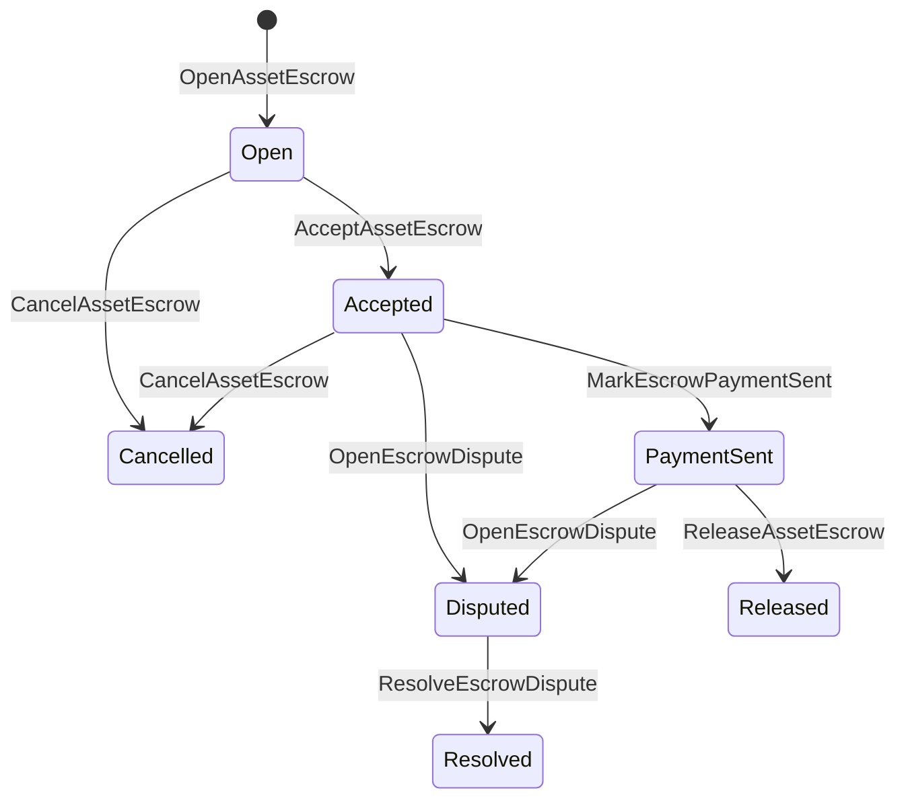

# אסיטום נטיב {#native-asset-escrow}

אבטחה מקומית היא מנגנון אחסון של נכסים מספרים שמנהל בספר.
במקום לשלוח נכסים לחשבון בבעלות היישום ולהסתמך על
קוד בקשה להגן על החשבון הזה, מאבטח ISIs להעביר ערך ל
פרוטוקול דטרמיניסטית חשבון אחסון וירשום את מחזור החיים של הסקרו
מדינה עולמית.

השתמשו בכספת מקומית עבור פיתוח בשוק, תשלום מחוץ למשרשרת בסגנון אייטאי
קואורדינציה, סגרות שלגמים ופרוטוקולי עבודה עם אבטחה מוגנים שדורשים
מצב מחזור החיים נראית במספר.

## תפיסות {#concepts}

| תפיסה | תיאור |
| --- | --- |
| `EscrowId` | מזהה שנבחר על ידי המתקשר שמסגרת את האש. הוא חייב להיות ייחודי בין אבטחים שקופים ואנונימיים. |
| `AssetEscrowRecord` | רישום אבטחת נכסים מספרים שקוף או סגור. |
| `AnonymousAssetEscrowRecord` | רישום מאבטח מוגן, מבוסס על ביטול, התחייבויות ותיקומים של הוכחה. |
| חשבון שומרת | חשבון פרוטוקול דטרמיניסטי נגזר מהשרשרת ID, סכום כספי ID, והגדרה של נכסים. |
| חשיש ראיות | חבילות של חשבונות, משפטים, הודעות, מוניסטים של אחסון או ראיות אחרות מחוץ למשרשרת. |

רישומים שקופים מכילים את המוכר, הקונה בחופשי, הגדרה של נכסים,
סכום הכולל, חשבון המשמורת, מצב מחזור החיים, סוג ההתנהגות, נותר
סכום, סמכות השחרור אופציונלית, סימן תקופת ירידה אופציונלי, ראיות
חישובים, סימנים של זמן ופרטים על הגדרות אופציונליים.

סכומי הבנקאות חייבים להיות סכומים חיוביים של נכסים
ההגדרה המספרית של הגדרת נכס. בזמן ש- escrow או lock הוא פעיל,
העברת נכסים גנריים לא יכולה לספיק את חשבון השמורת; היציאה משמורת
דרכים הם הבטוח. ISIs מתוארת בהמשך.

## שוק אסקו {#marketplace-escrow}

שוק מאבטח מתואם שחרור נכס בשולש עם שחרור מחוץ לשולש
זרימת עבודה של תשלום או משלוח.



| ISI | מי המגיש את זה | השפעה |
| --- | --- | --- |
| `OpenAssetEscrow` | מוכר | מנעול את הנכסים המספריים של המוכר בפיקוח הפרוטוקול ויוצר `Open` שיא בשוק. |
| `AcceptAssetEscrow` | קונה | רשום את הקונה וזיז `Open` ל `Accepted`. המוכר לא יכול לקבל את הבטחון שלו. |
| `MarkEscrowPaymentSent` | קונה מוכר | מהלך `Accepted` ל `PaymentSent` לאחר שהקונה שולח את התשלום מחוץ למשרשרת. |
| `ReleaseAssetEscrow` | מוכר | מהלך `PaymentSent` ל `Released` ומעביר את הסכום המובטח במלואו לקונה. |
| `CancelAssetEscrow` | מוכר | מהלך `Open` או `Accepted` ל `Cancelled` ומחזיר את המוכר לפני שהשלם מסומן. |
| `OpenEscrowDispute` | מוכר או קונה מקובל | מהלך `Accepted` או `PaymentSent` ל `Disputed` ומוסיף ראיות. |
| `ResolveEscrowDispute` | חשבון עם `CanResolveEscrowDispute` | מהלך `Disputed` ל `Resolved` ומחלק את הסכום בין קונה למכר. |

סכומי פתרון מחלוקות חייבים להיות לא שליליים, ו
`buyer_amount + seller_amount` חייב להיות שווה לסכום הבטחון.
רגליים מותרות, אבל כל ההפסקת חייבת לספור את המשקל המנעול.

### Rust דוגמה {#rust-example}

דוגמה זו מניחה שחשבונות המוכר והמכר כבר קיימים, נכס
ההגדרה רשומה כמספרית, והמכר יש איזון מספיק.

```rust
use iroha::{
    client::Client,
    data_model::{
        isi::escrow::{
            AcceptAssetEscrow, MarkEscrowPaymentSent, OpenAssetEscrow,
            ReleaseAssetEscrow,
        },
        prelude::*,
    },
};
use iroha_crypto::Hash;

fn release_marketplace_escrow(
    seller_client: &Client,
    buyer_client: &Client,
    asset_definition_id: AssetDefinitionId,
) -> eyre::Result<()> {
    let escrow_id = EscrowId::new(Hash::new("docs-marketplace-escrow-001"));

    seller_client.submit_blocking(OpenAssetEscrow::with_evidence_hashes(
        escrow_id,
        asset_definition_id,
        Numeric::from(40_u64),
        vec![Hash::new("invoice:2026-001")],
    ))?;

    buyer_client.submit_blocking(AcceptAssetEscrow::new(escrow_id))?;
    buyer_client.submit_blocking(MarkEscrowPaymentSent::new(escrow_id))?;
    seller_client.submit_blocking(ReleaseAssetEscrow::new(escrow_id))?;

    let record = seller_client.query_single(FindAssetEscrowById::new(escrow_id))?;
    assert_eq!(record.status, AssetEscrowStatus::Released);
    assert_eq!(record.remaining_amount, Numeric::zero());

    Ok(())
}
```

## מנעולים נכסים כלליים {#generic-asset-locks}

סגרות נכסים משתמשות באותו סוג של תיק אחסון, אבל הן לא קונה-מכר
הצעות. הם מנעולים כספים לחשבון יעד ואפשר
סמכות השחרור נפרדת למשוך כספים.

| ISI | מי המגיש את זה | השפעה |
| --- | --- | --- |
| `OpenAssetLock` | חשבון מקור | מנעול סכום חיובי, רשום את היעד כקונה הקלטת, ומקובע מצב ל `Locked`. |
| `DrawdownAssetLock` | סמכות השחרור, או יעד כאשר לא נקבע סמכות שחרור | העברת חלק או כל החזקת הנותרת ליעד. |
| `CancelAssetLock` | פתיחת מנעול | מבטל נעילה פעילה ומחזיר את הסכום הנותר למפתח. |
| `ExpireAssetLock` | כל רשות העסקה לאחר המועד | סופך של מנעול עם `expires_at_ms` בעבר וחזיר את הסכום הנותר לפתיחת. |

`DrawdownAssetLock` שומר את התיק `Locked` בזמן שמרות על סכום.
כאשר הסכום הנותר מגיע לאפס, המצב הופך `DrawnDown` ו
התיק סגור.

```rust
use iroha::{
    client::Client,
    data_model::{
        isi::escrow::{CancelAssetLock, DrawdownAssetLock, ExpireAssetLock, OpenAssetLock},
        prelude::*,
    },
};
use iroha_crypto::Hash;

fn drawdown_and_close_asset_locks(
    opener_client: &Client,
    destination_client: &Client,
    release_authority_client: &Client,
    asset_definition_id: AssetDefinitionId,
    destination: AccountId,
    release_authority: AccountId,
) -> eyre::Result<()> {
    let trusted_lock_id = EscrowId::new(Hash::new("docs-asset-lock-trusted"));

    opener_client.submit_blocking(OpenAssetLock::with_options(
        trusted_lock_id,
        asset_definition_id.clone(),
        destination.clone(),
        Numeric::from(40_u64),
        Some(release_authority),
        None,
        vec![Hash::new("milestone-plan-v1")],
    ))?;

    release_authority_client.submit_blocking(DrawdownAssetLock::new(
        trusted_lock_id,
        Numeric::from(15_u64),
    ))?;

    let partially_drawn =
        opener_client.query_single(FindAssetEscrowById::new(trusted_lock_id))?;
    assert_eq!(partially_drawn.status, AssetEscrowStatus::Locked);
    assert_eq!(partially_drawn.remaining_amount, Numeric::from(25_u64));

    opener_client.submit_blocking(CancelAssetLock::new(trusted_lock_id))?;
    let cancelled = opener_client.query_single(FindAssetEscrowById::new(trusted_lock_id))?;
    assert_eq!(cancelled.status, AssetEscrowStatus::Cancelled);

    let expiring_lock_id = EscrowId::new(Hash::new("docs-asset-lock-expiring"));
    opener_client.submit_blocking(OpenAssetLock::with_options(
        expiring_lock_id,
        asset_definition_id,
        destination,
        Numeric::from(10_u64),
        None,
        Some(0),
        Vec::new(),
    ))?;

    destination_client.submit_blocking(ExpireAssetLock::new(expiring_lock_id))?;
    let expired = opener_client.query_single(FindAssetEscrowById::new(expiring_lock_id))?;
    assert_eq!(expired.status, AssetEscrowStatus::Expired);

    Ok(())
}
```

Python כיום חשוף עוזרים ברמה גבוהה עבור נעולות גנריות:
`open_asset_lock`, `drawdown_asset_lock`, `cancel_asset_lock`, ו
`expire_asset_lock`. למקומות השוק ולשמורת אנונימית Python, שימוש
קאנוניקה `InstructionBox` JSON דרך SDK אני... JSON כפתור בריחה, או להגיש
דרך SDK זה חושף את הבניינים של אבטחה מדרגה ראשונה.

## מחלוקות {#disputes}

שוק מאבטח יכול להיכנס לוויכוח `Accepted` או `PaymentSent`.
רק המוכר או הבائع רשומים יכולים לפתוח את המחלוקת.
`CanResolveEscrowDispute`, או שהועברו ישירות לחשבון המפתר
או מורשת באמצעות תפקיד.

```rust
use iroha::{
    client::Client,
    data_model::{
        isi::escrow::{OpenEscrowDispute, ResolveEscrowDispute},
        prelude::*,
    },
};
use iroha_crypto::Hash;
use iroha_executor_data_model::permission::escrow::CanResolveEscrowDispute;

fn resolve_disputed_escrow(
    admin_client: &Client,
    buyer_client: &Client,
    court_client: &Client,
    court: AccountId,
    escrow_id: EscrowId,
) -> eyre::Result<()> {
    admin_client.submit_blocking(Grant::account_permission(
        Permission::from(CanResolveEscrowDispute),
        court,
    ))?;

    buyer_client.submit_blocking(OpenEscrowDispute::with_evidence_hashes(
        escrow_id,
        vec![Hash::new("buyer-payment-receipt")],
    ))?;

    court_client.submit_blocking(ResolveEscrowDispute::with_evidence_hashes(
        escrow_id,
        Numeric::from(30_u64),
        Numeric::from(10_u64),
        vec![Hash::new("court-judgement-001")],
    ))?;

    let record = admin_client.query_single(FindAssetEscrowById::new(escrow_id))?;
    assert_eq!(record.status, AssetEscrowStatus::Resolved);
    assert_eq!(
        record.resolution.as_ref().map(|resolution| resolution.buyer_amount.clone()),
        Some(Numeric::from(30_u64)),
    );

    Ok(())
}
```

## חטיפת חסכונות אנונימית {#anonymous-escrow}

הבטחון אנונימי משתמש באותו מחזור חיים של השוק, אבל ההמון
תנועת נכסים סגורה מוגנת.
קונה, מעמד, חישובים של ראיות, תותחים זמן ותנועה הקשורה לראיות
רישומים. סכום וקיבלים בתוך הערות מחוסרות נצוגים על ידי
התחייבויות, ביטוליות, ותיקים של הוכחה.

| שקיפות ISI | אנונימי ISI |
| --- | --- |
| `OpenAssetEscrow` | `OpenAnonymousAssetEscrow` |
| `AcceptAssetEscrow` | `AcceptAnonymousAssetEscrow` |
| `MarkEscrowPaymentSent` | `MarkAnonymousEscrowPaymentSent` |
| `ReleaseAssetEscrow` | `ReleaseAnonymousAssetEscrow` |
| `CancelAssetEscrow` | `CancelAnonymousAssetEscrow` |
| `OpenEscrowDispute` | `OpenAnonymousEscrowDispute` |
| `ResolveEscrowDispute` | `ResolveAnonymousEscrowDispute` |

כלי הארנק או סבר חייבים לבנות את קישור ההוכחה ואת הכניסה הציבורית.
פתיחה יוצרת מחויבות מאובטחת אחת.
פתרון מחלוקות חייב להשקיע בדיוק התחייבות מאבטחת אחת
מחויבות הקונה, המוכר או ההוצאה הנפוצה הנדרשות על ידי הפעולה.

```rust
use iroha::{
    client::Client,
    data_model::{
        isi::escrow::{
            AcceptAnonymousAssetEscrow, MarkAnonymousEscrowPaymentSent,
            OpenAnonymousAssetEscrow,
        },
        prelude::*,
        proof::ProofAttachment,
    },
};
use iroha_crypto::Hash;

fn open_anonymous_escrow(
    seller_client: &Client,
    buyer_client: &Client,
    escrow_id: EscrowId,
    asset_definition_id: AssetDefinitionId,
    funding_nullifiers: Vec<[u8; 32]>,
    escrow_commitment: [u8; 32],
    proof: ProofAttachment,
    root_hint: Option<[u8; 32]>,
) -> eyre::Result<()> {
    seller_client.submit_blocking(OpenAnonymousAssetEscrow::with_evidence_hashes(
        escrow_id,
        asset_definition_id,
        funding_nullifiers,
        escrow_commitment,
        proof,
        root_hint,
        vec![Hash::new("shielded-invoice")],
    ))?;

    buyer_client.submit_blocking(AcceptAnonymousAssetEscrow::new(escrow_id))?;
    buyer_client.submit_blocking(MarkAnonymousEscrowPaymentSent::new(escrow_id))?;

    Ok(())
}
```

עבור מודל העסקה המסתתרת הבסיסי, ראה
[עסקאות אנונימיות](/he/blockchain/anonymous-transactions.md).

## SDK שימוש {#sdk-usage}

תמיכה בכספים נחשפת באופן שונה בכל SDKs. Rust יש את הקנוניקה
מודל נתונים מדופס. Python כרגע חושף עוזרים לסגור נכסים גנטיים.
JavaScript ו TypeScript שימוש Kotodama שיחות של מארח אשראי. Kotlin/JVM ו Swift
לספק בונים משמשים עם טייפים עבור שוק ומענין אנונימי.

| SDK | השתמשו על פני השטח הזה | טווח |
| --- | --- | --- |
| [Rust](#rust-sdk) | `iroha::data_model::isi::escrow` | מאבטחה בשוק, נעולים גנטיים, מאבטחת אנונימית, שאלות ואירועים. |
| [Python](#python-asset-locks) | `Instruction.open_asset_lock`, `TransactionDraft.open_asset_lock`, ולקוח `*_and_wait` עוזרים | סגרות נכסים גנריות. שוק ומסיידי אבטחה אנונימיים אינם מסוג ראשון Python שיטות עדיין. |
| [JavaScript / TypeScript](#javascript-and-typescript-kotodama) | `compileKotodamaProgram` מ `@iroha/iroha-js/kotodama-compiler` | שיחות מארח הבנקות בפנים Kotodama חוזים. |
| [Kotlin / JVM](#kotlin-and-jvm) | `InstructionTemplate` שיעורים ב `org.hyperledger.iroha.sdk.core.model.instructions` | שוק ותמונות של הוראות אישית בנקודת אשראי אנונימיות. |
| [Swift / iOS](#swift-and-ios) | `NativeEscrowInstructionBuilders` ו `IrohaSDK.build*Escrow*` עוזרים | מקום השוק והסכום הבלתי ידוע Norito JSON מטענים שימושיים של הוראות. |

הדוגמאות הבאות מתמקדות בניית הוראות. מימון חשבונות,
ניהול חתימה, והמסירת עסקאות עוקבים אחרי הזרימה הרגילה עבור
כל אחד SDK.

### Rust SDK {#rust-sdk}

השתמש ב Rust SDK כאשר אתה צריך כיסוי מקומי מלא או תמיכה בקשב/מקרה.
הדוגמאות לעיל מראות שחרור בשוק, סגר כללי, מחלוקת
פיתוח, בניית אבטחה אנונימית עם
`iroha::data_model::isi::escrow`.

```rust
use iroha::{
    client::Client,
    data_model::{isi::escrow::OpenAssetEscrow, prelude::*},
};
use iroha_crypto::Hash;

fn open_and_read(
    client: &Client,
    asset_definition_id: AssetDefinitionId,
) -> eyre::Result<AssetEscrowRecord> {
    let escrow_id = EscrowId::new(Hash::new("docs-rust-sdk-escrow"));

    client.submit_blocking(OpenAssetEscrow::new(
        escrow_id,
        asset_definition_id,
        Numeric::from(10_u64),
    ))?;

    client.query_single(FindAssetEscrowById::new(escrow_id))
}
```

### Python סגרות נכסים {#python-asset-locks}

ה- Python SDK מגלה עוזרים מדרגה ראשונה עבור נעלי נכסים גנריים.
עבור תשלומים חשובים, משיכות על ידי רשות השחרור, ביטול על ידי
פתיחה, ותחזקות תקופת תשלום.

```python
client.open_asset_lock_and_wait(
    chain_id="dev-chain",
    authority="<source-account-id>",
    private_key_hex="<source-private-key-hex>",
    escrow_id="merchant-lock-001",
    asset_definition_id="<asset-definition-base58>",
    destination="<destination-account-id>",
    amount="2500",
    release_authority="<trusted-release-account-id>",
    expires_at_ms=1_704_000_000_000,
)

client.drawdown_asset_lock_and_wait(
    chain_id="dev-chain",
    authority="<trusted-release-account-id>",
    private_key_hex="<trusted-release-private-key-hex>",
    escrow_id="merchant-lock-001",
    amount="1000",
)

client.expire_asset_lock_and_wait(
    chain_id="dev-chain",
    authority="<any-account-id>",
    private_key_hex="<any-private-key-hex>",
    escrow_id="merchant-lock-001",
)
```

למנעול משתי צדדים, תשאירו `release_authority`; חשבון היעד יכול
לאחר מכן להגיש `drawdown_asset_lock`.

### JavaScript ו TypeScript Kotodama {#javascript-and-typescript-kotodama}

ה- JavaScript SDK לא חושף כרגע עסקאות ביסוד ילידי ישירות
לבניינים. JavaScript או TypeScript יישומים המפיצים Kotodama
החוזים, לעסוק בקריאות מארח הבטחון עם Kotodama מתאסוף.

שיחות מארח אסיסטור מקורי דורשות רמזים מפורשים על גישה כי הקאמפיילר
לא יכול להפיק קבוצות גישה צר יותר עבור אבטחה בלתי ברורה ISIs. השתמשו בהנחיות קלפים
נקודות כניסה שנשלחו שיקראו `escrow_*` בנויים.

```js
import { compileKotodamaProgram } from "@iroha/iroha-js/kotodama-compiler";

const source = `
seiyaku MarketplaceEscrow {
  meta { abi_version: 1; }

  #[access(read="*", write="*")]
  kotoage fn run() permission(Admin) {
    let asset = asset_definition("62Fk4FPcMuLvW5QjDGNF2a4jAmjM");
    let offer = name("aitai_offer");
    let evidence = norito_bytes("00");

    call escrow_open_offer(offer, asset, 10, evidence);
    call escrow_accept(offer);
    call escrow_mark_payment_sent(offer);
    call escrow_release(offer);
  }
}
`;

const compiled = compileKotodamaProgram(source, {
  sourceName: "escrow.ko",
});

if (compiled.diagnostics.length > 0) {
  throw new Error(compiled.diagnostics.map((item) => item.message).join("\n"));
}
```

עבור מחלוקות, שימוש `escrow_open_dispute(offer, evidence)` ו
`escrow_resolve_dispute(offer, buyer_amount, seller_amount, evidence)`.
טלפונים של מארח אבטחה אנונימיים מקבלים Norito בקשת בייטים של עומס מועיל, למשל
`anonymous_escrow_open_offer(request)`.

### Kotlin ו JVM {#kotlin-and-jvm}

ה- Kotlin/JVM SDK דוגמאות אבטחה ילידית כטמבלטים של הוראות מותאמות.
הטמבל מדגיש את השדות הנדרשים ומחשף את המפה הקנונית של הטיעונים המשמשים
על ידי בונה העסקה.

```kotlin
import org.hyperledger.iroha.sdk.core.model.escrow.NativeEscrowPermissions
import org.hyperledger.iroha.sdk.core.model.instructions.AcceptAssetEscrowInstruction
import org.hyperledger.iroha.sdk.core.model.instructions.MarkEscrowPaymentSentInstruction
import org.hyperledger.iroha.sdk.core.model.instructions.OpenAssetEscrowInstruction
import org.hyperledger.iroha.sdk.core.model.instructions.ReleaseAssetEscrowInstruction
import org.hyperledger.iroha.sdk.core.model.instructions.ResolveEscrowDisputeInstruction

val open = OpenAssetEscrowInstruction(
    escrowId = "escrow-hash",
    assetDefinition = "xor#wonderland",
    amount = "42.5",
    evidenceHashes = listOf("invoice-hash"),
)
val accept = AcceptAssetEscrowInstruction("escrow-hash")
val paid = MarkEscrowPaymentSentInstruction("escrow-hash")
val release = ReleaseAssetEscrowInstruction("escrow-hash")
val resolve = ResolveEscrowDisputeInstruction(
    escrowId = "escrow-hash",
    buyerAmount = "30",
    sellerAmount = "12.5",
    evidenceHashes = listOf("judgement-hash"),
)

println(open.arguments)
println(NativeEscrowPermissions.CAN_RESOLVE_ESCROW_DISPUTE)
```

טמבלטים אנונימיים זמינים:
`OpenAnonymousAssetEscrowInstruction`, `AcceptAnonymousAssetEscrowInstruction`,
`MarkAnonymousEscrowPaymentSentInstruction`,
`ReleaseAnonymousAssetEscrowInstruction`,
`CancelAnonymousAssetEscrowInstruction`,
`OpenAnonymousEscrowDisputeInstruction`, ו
`ResolveAnonymousEscrowDisputeInstruction`. Android טלפנים של ג'אווה יכולים להשתמש
התאמה `NativeEscrowInstructions.*` הבניינים מה Android ארטיפקט.

### Swift ו-iOS {#swift-and-ios}

ה- Swift SDK מבנה הוראות אבטחה כ Norito JSON מטענים מועילים.
`NativeEscrowInstructionBuilders` ישירות, או להתקשר למשקל
`IrohaSDK.build*Escrow*` עוזר כאשר האפליקציה שלך כבר מחזיקה `IrohaSDK`
דוגמה.

```swift
import IrohaSwift

let open = try NativeEscrowInstructionBuilders.openAssetEscrow(
    escrowId: "escrow-hash",
    assetDefinition: "xor#wonderland",
    amount: "42.5",
    evidenceHashes: ["invoice-hash"]
)
let accept = try NativeEscrowInstructionBuilders.acceptAssetEscrow(
    escrowId: "escrow-hash"
)
let paid = try NativeEscrowInstructionBuilders.markEscrowPaymentSent(
    escrowId: "escrow-hash"
)
let release = try NativeEscrowInstructionBuilders.releaseAssetEscrow(
    escrowId: "escrow-hash"
)
let resolve = try NativeEscrowInstructionBuilders.resolveEscrowDispute(
    escrowId: "escrow-hash",
    buyerAmount: "30",
    sellerAmount: "12.5",
    evidenceHashes: ["judgement-hash"]
)
```

אנונימי Swift הבניינים לוקחים רשימות ביטול, רשימות מחויבות יצירה, הוכחה
מילון, ופתרתי `rootHint` הערכים. אישור פתרון מחלוקת
טוקן זמין כ `NativeEscrowPermissions.canResolveEscrowDispute`.

## שאלות ואירועים {#queries-and-events}

השתמשו בקשבויות אבטחה עבור דפים של מצב, עבודות פישר וכלי תמיכה:

| שאלה | מטרה |
| --- | --- |
| `FindAssetEscrowById` | תקרא מאבטח שקוף אחד או סגור אותו `EscrowId`. |
| `FindAssetEscrows` | רשום רישומים שקופים של אבטחה ונעול. |
| `FindAssetEscrowsBySeller` | רשימה של רשומות שנפתחו על ידי מוכר או פותח נעילה. |
| `FindAssetEscrowsByBuyer` | רשימה של אבטחות שוק קובעות על ידי הקונה או סגרות המכוונות לקראת יעד. |
| `FindAssetEscrowsByStatus` | רשימת רשומות על ידי `AssetEscrowStatus`. |
| `FindAnonymousAssetEscrowById` | תקרא מאבטח אנונימי אחד `EscrowId`. |
| `FindAnonymousAssetEscrows*` | רשימה של מאבטחים אנונימיים על ידי כל הרשומות, מוכר, קונה או מצב. |

`EscrowEventFilter` יכול לחתום על אבטחה מקומית ונעול חיונית
אירועים על ידי מאבטח ID, מכר, קונה, מצב, ומסך אירוע.
המשפחה כוללת `Opened`, `Accepted`, `PaymentSent`, `Released`,
`Cancelled`, `Expired`, `Disputed`, ו `Resolved`. מאבטח אנונימי
הרשומות מבוקשות באמצעות שאילת הבטוחים אנונימית.

## הערות הפעלה {#operational-notes}

- שמור חשבונות גדולים, שירי צ'אט, משפטים או חבילות בדיקה מחוץ
  רשום מאבטח ולוגן את ההשדים שלהם כראיות.
- השתמשו במקביל `EscrowId` תוצרת בתשובות כך ניסיונות חוזרים לא יכולים ליצור
  משותפים של מאבטחים עבור אותה הצעה.
- גרנט `CanResolveEscrowDispute` רק לחשבונות או תפקידים המפעילים את
  תהליך מחלוקת.
- להתייחס לאמת תשלומים מחוץ למשרשרת כמדיניות היישום. Iroha רשומות
  מעבר לטיפול ותיקום חיים; הוא לא מאשר את הנתונים הפוטנציאליים או החיצוניים
  מסילות תשלומים על עצמן.
