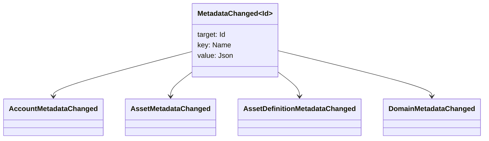

# נתונים מטאטא {#metadata}

מטאדאטה היא מפה של ערך מפתח מבוקש המוסמך לאובייקטים של ספר הגדול.
`Name` הערכים והערכים הם JSON (`Json`) מטענים מועילים.

האובייקטים הבאים יכולים להכיל מטא נתונים:

- תחומים
- חשבונות
- נכסים
- הגדרות נכסים
- NFTs
- RWAs
- תפעילים
- עסקאות

השתמשו בתנתונים מטאטא עבור שדות תיאוריים קטנים או אינדקסינג שייכים למספר
מטענים שימושיים גדולים צריכים להיות מאוחסנים מחוץ WSV ונקרא ב-
מזין, URI, או SoraFS דרך.

לקבלת הדרכה בחירת מטא-מנתונים, נכסים, NFTs, RWAs, או מחוץ למשרשרת
אחסון, ראה
[אמצעי אחסון נתונים מטאטא ונתונים גדולים](/he/guide/configure/metadata-and-store-assets.md).

## נסה את זה. Taira {#try-it-on-taira}

הנתונים המטאטאניים נראים באמצעות קריאת משאבים רגילה. Taira
הגדרות נכסים שיש בהן כיום מעטא נתונים:

```bash
curl -fsS 'https://taira.sora.org/v1/assets/definitions?limit=100' \
  | jq '.items[]
    | select((.metadata | length) > 0)
    | {id, name, metadata}'
```

השתמשו באותו דפוס עבור תחומים וחשבות:

```bash
curl -fsS 'https://taira.sora.org/v1/domains?limit=20' \
  | jq '.items[] | select((.metadata // {} | length) > 0)'

curl -fsS 'https://taira.sora.org/v1/accounts?limit=20' \
  | jq '.items[] | select((.metadata // {} | length) > 0)'
```

מתייחס לתוצאת ריקה כنتيجة תקפה. Taira
האובייקטים אינם נושאים מטא נתונים, לא כי נקודת הסיום נכשלה.

## עדכון נתונים מטאטא {#updating-metadata}

הנתונים המטא משתנים עם Iroha הוראות מיוחדות:

- [`SetKeyValue`](/he/blockchain/instructions.md#setkeyvalue-removekeyvalue)
  מכניס או מחליף מפתח
- [`RemoveKeyValue`](/he/blockchain/instructions.md#setkeyvalue-removekeyvalue)
  מוריד מפתח.

לרשות המגיש את העסקה חייב להיות הרשיון הנדרש.
על ידי אישור זמן הפעלה פעיל. עבור פני השטח של הרשאות מקובלות, ראה
[סימני רשות](/he/reference/permissions.md).

## אירועים {#events}

אירועי נתונים נחשפים כאשר מתנתונים משתנים.
`MetadataChanged<Id>`:



שימוש [פילטר אירועי נתונים](/he/blockchain/filters.md#data-event-filters) ל
לחתום רק על אירועים של מטא נתונים עבור סוג הארגון או אובייקט ID זה
זה חשוב לאינטגרציה.

## שאלות {#queries}

הנתונים המטאטאליים חוזרים כחלק מהאובייקט הנדרש. למשל, שימוש
[`FindAccountById`](/he/reference/queries.md#accounts-and-permissions),
[`FindDomainById`](/he/reference/queries.md#domains-and-peers), או
[`FindAssetDefinitionById`](/he/reference/queries.md#assets-nfts-and-rwas).
שימוש [`FindNfts`](/he/reference/queries.md#assets-nfts-and-rwas) או
[`FindNftsByAccountId`](/he/reference/queries.md#assets-nfts-and-rwas) עבור
NFTs, ו [`FindRwas`](/he/reference/queries.md#assets-nfts-and-rwas) עבור RWA
אז קרא את שדה הנתונים של האובייקט. NFT תשובות השאלות חושפות את
NFT `content` מפה כמתא נתונים.

מפתחות הנתונים המטאטאליים הם חלק ממדינה של הספר הגדול, אז לשמור אותם יציבים ולהימנע
קודינג גרסה ספציפית לתطبيق תופס לתוך שם המפתח כאשר JSON
הערך יכול לשאת את הגרסה הזאת באופן מפורש.
