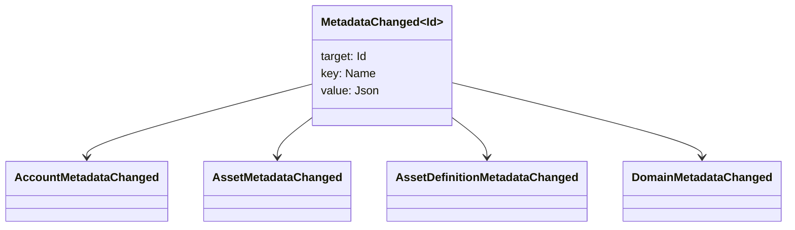

# מטאדאטה {#metadata}

מטאדאטה היא מפה של ערך מפתח מבוקש הקשורת לאובייקטים במספר. המפתחות הן ערכים `Name` והערכים הם מטענים JSON (`Json`).

האובייקטים הבאים יכולים להכיל מטא נתונים:

- תחומים
- חשבונות
- נכסים
- הגדרות נכסים
- NFTs
- RWAs
- טריגרים
- עסקאות

השתמשו ב־metadata עבור שדות תיאוריים או שדות אינדוקס קטנים ששייכים למצב ספר החשבונות. Payloads גדולים צריכים להישמר מחוץ ל־WSV ולהיות מופנים באמצעות digest, URI או נתיב SoraFS.

לקבלת הוראות על בחירת מטא-נתונים, נכסים NFTs, RWAs או אחסון מחוץ לרשת, ראה [הבחירות לאחסון מטא-נתוניםטא ונתונים ספריים ](/he/guide/configure/metadata-and-store-assets.md).

## נסה את זה על Taira {#try-it-on-taira}

מטא-נתונים נראים באמצעות קריאת משאבים רגילה. פקודה זו רשימה הגדרות נכסים Taira שיש להם כיום מטא-נתונים:

```bash
curl -fsS 'https://taira.sora.org/v1/assets/definitions?limit=100' \
  | jq '.items[]
    | select((.metadata | length) > 0)
    | {id, name, metadata}'
```

השתמשו בדפוס זהה עבור דומנים וחשבות:

```bash
curl -fsS 'https://taira.sora.org/v1/domains?limit=20' \
  | jq '.items[] | select((.metadata // {} | length) > 0)'

curl -fsS 'https://taira.sora.org/v1/accounts?limit=20' \
  | jq '.items[] | select((.metadata // {} | length) > 0)'
```

מתייחס לתוצאת ריקה כתוצאה תקפה. זה אומר שהדף הנוכחי של Taira אובייקטים אינו מכיל מטא נתונים, לא כי נקודת הסיום נכשלה.

## עדכון מטא-נתונים {#updating-metadata}

המטא-נתונים משתנים עם הוראות מיוחדות Iroha:

- [`SetKeyValue`](/he/blockchain/instructions.md#setkeyvalue-removekeyvalue) מדביקים או מחליפים מפתח
- [`RemoveKeyValue`](/he/blockchain/instructions.md#setkeyvalue-removekeyvalue) מסיר מפתח

לרשות המגיש את העסקה חייב להיות הרשיון הנדרש על ידי מתוקן הזמן הפעיל. עבור שטח הרשיונות המקובל, ראה [Tokens Permission ](/he/reference/permissions.md).

## אירועים {#events}

אירועי נתונים יוצרים כאשר מתנתונים משתנים. עומס השימוש של אירוע כללי הוא `MetadataChanged<Id>`:



השתמשו ב- [filters של אירועים נתונים ](/he/blockchain/filters.md#data-event-filters) כדי לחתום רק על אירועי מטא נתונים עבור סוג הארגון או אובייקט ID החשוב לאינטגרציה.

## שאילתות {#queries}

מטא-נתונים מוחזרים כחלק מהאובייקט שעליו בוצעה השאילתה. לדוגמה, השתמשו ב-[`FindAccountById`](/he/reference/queries.md#accounts-and-permissions), ב-[`FindDomainById`](/he/reference/queries.md#domains-and-peers) או ב-[`FindAssetDefinitionById`](/he/reference/queries.md#assets-nfts-and-rwas). השתמשו ב-[`FindNfts`](/he/reference/queries.md#assets-nfts-and-rwas) או ב-[`FindNftsByAccountId`](/he/reference/queries.md#assets-nfts-and-rwas) עבור NFTs, וב-[`FindRwas`](/he/reference/queries.md#assets-nfts-and-rwas) עבור אצוות RWA. לאחר מכן קראו את שדה הנתונים המתאים של האובייקט. תשובות לשאילתות NFT חושפות את מפת ה-`content` של ה-NFT כמטא-נתונים רשומים.

מפתחות המטא-נתונים הם חלק ממצב הספרים, אז לשמור אותם יציבים ולהימנע מקודד גרסה ספציפית יישום ל-churn לתוך שם המפתח כאשר ערך JSON יכול לשאת את הגרסה הזו באופן בולט.
