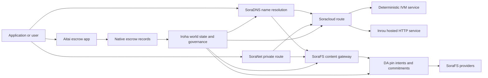

# SORA Nexus שירותים {#sora-nexus-services}

SORA Nexus מוסיפה סביב Iroha 3 מישורי שירות המיועדים ליישומים. שירותים אלה אינם ספרי חשבונות נפרדים. הם מעוגנים במצב העולם של Iroha, במניפסטים של Norito, ברשומות ממשל ובמשפחות המסלולים של Torii.

זמינות תלויה בניית הערך ובפרופיל הרשת. השתמש [`/openapi.json`](/he/reference/torii-endpoints.md#app-and-sora-route-families) כדי לגלות את המסלולים המיוצרים של האפליקציה-API על הערך המטרה. מסלולים מקומיים ציבוריים SoraFS CID ומוכרים היטב מובנים מחוץ לתסמך שנוצר, כך שתבדקו את המסלולים האלה ישירות בעת בדיקה של הפעלת.

## מפה מרכיבים {#component-map}

|מרכיב |תפקיד |פני השטח העיקריים |
| ---------------------- | ------------------------------------------------------------------------------------------------------------------------------------------- | ---------------------------------------------------------------------------------------- |
|Soracloud |פריסת יישומים, שירותים מתארחים, מצב פרטי של מודל/runtime ובקרת מחזור חיי השירות. |`/v1/soracloud/*`, `/api/*`, `iroha soracloud service ...` |
|Inrou|סביבת HTTP מתארחת של Soracloud עבור גרסאות שירות שזקוקות למישור HTTP חי.|תצורת סביבת הריצה של Soracloud, פרסומי יכולת המארח, מצב סביבת הריצה של העתק השירות|
|SoraNet |פרטיות ותחבורה על גבי מעגלים, תנועה רלוונטית, VPN, פגישות חיבור, וסלולים זרימה. |`/v1/connect/*`, `/v1/vpn/*`, SoraNet מטא-נתונים של מסלול |
|זמינות נתונים (DA) |הוכחות זמינות, התחייבויות, שכבת כוונה למטענים שמפורסמים בנתיבי Nexus, מניפסטים של SoraFS ומדיניות הוכחה. |`/v1/da/*`, `FindDaPinIntent*`, `[nexus.da]` |
|SoraFS |מערך אחסון ממוען־תוכן למניפסטים, מטעני CAR, תוכן מקובע, אחזור דרך gateway ותהליכי הוכחת יכולת אחזור. |`/v1/sorafs/*`, `/sorafs/*`, `FindSorafsProviderOwner` |
|SoraDNS |שכבת כינוי דטרמיניסטית ותישור פתרון עבור שירותים ותוכן הועברו ב SORA. |`/v1/soradns/*`, `/soradns/*`, אירועים של תיקון הגורם |
|Aitai |מסדרון לסליקת פיאט ונכסים ברמת האפליקציה, המבוסס על רשומות נאמנות מובנות ולא על ספר חשבונות נפרד.|`OpenAssetEscrow`, `FindAssetEscrow*`, `EscrowEventFilter`, בוני Kotodama מסוג `escrow_*` |



## זרמים נפוצים {#common-flows}

### יישום מפוצל מתארח {#hosted-split-application}

אפליקציה טיפיינית מעורבת משמשת את כל החלקים ביחד:

1. נכסים סטטיים של הקצה הקדמי מצטופפים ומחוסרים דרך SoraFS.
2. המארח הציבורי, למשל `<app>.sora`, רשום באמצעות SoraDNS.
3. מסלולים Soracloud `/api/v1/search` או `/api/v1/stream` לשירות Inrou HTTP.
4. מסלולים Soracloud `/api/auth` ו `/api/v1/user` למפעילים דטרמיניסטיים IVM.
5. לקוחות שזקוקים לפרטיות יכולים להגיע לאותו תוכן או למסלול API דרך מעגילת SoraNet.

|מסלול|מישור תומך|למה?|
| ----------------- | --------------------- | ------------------------------------------------- |
| `/`               |SoraFS תוכן סטטי |קש של תוכן שניתן לשחזר .|
|`/assets/*` |SoraFS תוכן סטטי |נכסים עם כתובת תוכן וראיות מפורשות |
|`/api/auth*` |Soracloud IVM |מצב האותופיות והמטבעות מאובטחים|
|`/api/v1/user*` |Soracloud IVM |שינויי מצב רגישים לממשל |
|`/api/v1/search*` |Soracloud Inrou |שירות HTTP חי, קש, SSE או מצב הקולקטור |

### תוכן פרסום {#content-publication}

פרסום SoraFS יוצר ארטיפקטים קבועים לפני שמות מצביעים עליהם:

1. תבנה מטען נתונים או תיק.
2. ארוז את זה בארכיון CAR ותוכנית חתיכות.
3. בנו מניפסט Norito עם מדיניות קיבוע ומטא־נתונים של ממשל.
4. להגיש את ההודעה ל- Torii.
5. רשום כוונה סימן DA או מחויבות זמינות כאשר הפרופיל היעד דורש ראיות מפורשות.
6. קשור את המניפסט לשמות SoraDNS או למסלול הפנים סטטי של Soracloud.

### מסלול רכיבה פרטית או זרימה {#private-fetch-or-streaming-route}

SoraNet יכול לשבת מול SoraFS או Soracloud:

1. הלקוח פותר את השם או המוניפסט.
2. ספריית מרחב או מניפסט מסלול בוחרים ממסרי כניסה ויציאה.
3. התנועה נמלאה ונשלחת דרך המעגל SoraNet.
4. רלוף היציאה מגיע לשער SoraFS, זרם Torii, או נתיב Soracloud.

## אייטאי {#aitai}

אייטאי הוא מסלול האפליקציה SORA עבור הסדר בסגנון שוק שבו קונה ומוכר מתואמים תשלום מחוץ לשרשרת בעוד Iroha שולח את ה- שומרון נכסים על שרשרת. הוא צריך להשתמש במשפחת ההוראות המקומית של השמורות במקום חשבון משמורת בבעלות חוזה עבור זרמים חדשים של שמרון נכסים מספרים.

Native escrow שומר את המשמורת ב-ledger. המוכר פותח הצעה באמצעות `OpenAssetEscrow`, הקונה מקבל ומסמן תשלום מחוץ לשרשרת באמצעות `AcceptAssetEscrow` ו-`MarkEscrowPaymentSent`, והמוכר משחרר באמצעות `ReleaseAssetEscrow` או מבטל לפני שהתשלום מסומן. אם הקונה והמוכר אינם מסכימים, כל אחד מהצדדים יכול לפתוח מחלוקת ו-resolver בעל `CanResolveEscrowDispute` יכול לפצל את הסכום הנעול.

למחזור החיים המלא, נעילות נכסים כלליות, escrow אנונימי, שאילתות, אירועים ודוגמאות ב-Rust, ראו [escrow מובנה לנכסים](/he/blockchain/escrow.md).

|פני השטח Aitai |השתמשו בו עבור |
| ------------------------------------------------------------------------------------------------------------------------------------------------------------- | ----------------------------------------------------------------------------------------- |
| `OpenAssetEscrow`, `AcceptAssetEscrow`, `MarkEscrowPaymentSent`, `ReleaseAssetEscrow`, `CancelAssetEscrow`                                                    |הצעות חותמות של נכסים מספריים, כולל זרמי הסדר במספרים XOR. |
| `OpenAnonymousAssetEscrow`, `AcceptAnonymousAssetEscrow`, `MarkAnonymousEscrowPaymentSent`, `ReleaseAnonymousAssetEscrow`, `CancelAnonymousAssetEscrow`       |הצעות מוגנות משתמשות בתוספות ראיות עבור מימון וסיום תנועות. |
|`OpenEscrowDispute`, `ResolveEscrowDispute`, `OpenAnonymousEscrowDispute`, `ResolveAnonymousEscrowDispute` |פתרון ויכוחים בסגנון בית המשפט. |
|`FindAssetEscrowById`, `FindAssetEscrowsBySeller`, `FindAssetEscrowsByBuyer`, `FindAssetEscrowsByStatus` |דפים של מצב האפליקציה, עבודות הפיוס, וכלים לתמיכה. |
|`EscrowEventFilter` |חתימות אשראי גלויות חיות על ידי זהת אשראי, מכר, קונה, מעמד או סוג אירוע. |
| Kotodama `escrow_open_offer`, `escrow_accept`, `escrow_mark_payment_sent`, `escrow_release`, `escrow_cancel`, `escrow_open_dispute`, `escrow_resolve_dispute` |קריאות חוזה של Kotodama הנתמכות בידי קריאות המערכת V1 לנאמנות. |

לשימוש ציבורי Taira או Minamoto, התייחסו לרכבת תשלומים מחוץ למשרשרת ולכל זרימת עבודה של תמיכה או בית המשפט כמדיניות היישום. Iroha רשום את מצב האבטחה, אירועי מחזור החיים, חישובים ראיות, ותנועה נכסים סופית; הוא אינו בודק את הסדר הפיהט בעצמו.

## בדוק קו יעד {#check-a-target-node}

לפני השימוש בדוגמאות מהדף הזה, אושר כי משפחת המסלול קיימת על הערך שאתה מכוון:

```bash
export TORII_URL=https://taira.sora.org

curl -fsS "$TORII_URL/openapi.json" \
  | jq '.paths | keys[] | select(test("^/v1/(soracloud|sorafs|soradns|connect|vpn|da)/"))'

curl -fsS -H 'Accept: application/json' "$TORII_URL/status" | jq .
```

`/openapi.json` הוא נקודת הסיום הקנונית OpenAPI. זמינות הנתיב המדויקת תלויה בתכונות הבניין ובהסדרת הרשת. המסמך אינו רושם את המסלולים המקומיים הציבוריים SoraFS CID והמוכרים היטב; בדוק את נקודות הסיום הללו ישירות כפי שמתואר בהמשך.

### Taira בדיקות עישון קריאה בלבד {#taira-read-only-smoke-checks}

נקודת הסיום הציבורית Taira היא שימושית בדיקות בצד קריאה, אך אל תשתמש בה לדוגמאות מוטציות אלא אם כן אתה מפעיל חשבון מורשה וכוונך לשנות את מצב הרשת המבחנת ציבורית.

```bash
export TORII_URL=https://taira.sora.org

curl -fsS -H 'Accept: application/json' "$TORII_URL/status" \
  | jq '{version: .build.version, peers, blocks, lanes: (.teu_lane_commit | length)}'

curl -fsS "$TORII_URL/v1/vpn/profile" \
  | jq '{available, relay_endpoint, supported_exit_classes}'

curl -fsS "$TORII_URL/v1/sorafs/storage/peers?limit=4" \
  | jq '{gateway_base_url, pin_torii_urls}'

curl -fsS -H 'Accept: application/json' "$TORII_URL/v1/soracloud/status" \
  | jq '.control_plane | {service_count, services: [.services[] | {service_name, current_version}]}'
```

Taira עשויה לחשוף מסלולי מישור בקרה ייחודיים לפריסה שאינם מופיעים במפת המסלולים של OpenAPI. התייחסו אל `/openapi.json` כאל החוזה שנוצר עבור המסלולים שהוא מכיל, ולאחר מכן אמתו ישירות את המסלולים הייחודיים לפריסה ואת מסלולי SoraFS המקומיים הציבוריים לפני שתתעדו אותם כזמינים.

## Soracloud {#soracloud}

Soracloud הוא מישור הבקרה של יישומי SORA. הוא עוקב אחר חבילות פריסה, גרסאות שירות, ניתוב, מצב rollout, רשומות תצורה מוסמכות, סודות שירות מוצפנים, רשומות במאגר המודלים, הפעלות inference פרטיות וקבלות סביבת ריצה.

Soracloud משתמשת בשני מישורי ביצוע:

|מישור ביצוע|סביבת ריצה|השתמשו בו עבור|
| ---------------------- | ------- | -------------------------------------------------------------------------------------------- |
|`DeterministicService` |`Ivm` |מחבר, מצב הכספת, קריאה מוסמכת, מנהלים של תיבת הדואר, מוטציות רגישות לניהול |
|`HttpService` |`Inrou` |חיים HTTP APIs, עבודה כבדה בקולקטור, שירותים באבטחת קש, SSE, זרמים בעזרת דפדפן |

מישור הבקרה הוא המקור הסמכותי. שלחו פקודות פריסה, שדרוג, rollback, תצורה, סודות, מודלים ומצב דרך Torii וקראו את מצב העולם commit; הן אינן נשענות על מראה מקומית נפרדת של ה-CLI. הניתוב הציבורי מבוסס על התחילית הארוכה ביותר, ולכן מארח רשום יחיד יכול לפצל תעבורה בין מסלולי HTTP מתארחים למסלולי API דטרמיניסטיים.

### תפיסה אפליקציה מחולקת {#scaffold-a-split-app}

הטמבלן של אפליקציה מחולקת יוצר קצה מקדימה סטטי ועוד שירות חי API מאורח ואחד דeterministic vault/ API:

```bash
iroha soracloud app init \
  --template split-app \
  --app-name solswap_indexer \
  --app-version 0.1.0 \
  --public-host solswap-indexer.sora \
  --output-dir ./apps/solswap-indexer

iroha soracloud app plan \
  --manifest ./apps/solswap-indexer/app_manifest.json

iroha soracloud app doctor \
  --manifest ./apps/solswap-indexer/app_manifest.json
```

`plan` מדפיס את חלוקת המסלול, מניפסטים של שירותי־משנה, נתיבי סודות במרחב העבודה ואת מצב הפרסום הצפוי, בלי לשנות דבר. `doctor` מאמת את חוזה הגרסה המקומי לפני פנייה ל־Torii.

### פריסה ובדיקת מצב האפליקציה {#deploy-and-inspect-app-state}

השתמשו מחדש ב־epoch שמירה עתידי יחיד של SoraFS בכל ניסיון חוזר של ההפצה. מכיוון שתבנית האפליקציה המפוצלת כוללת שירות Inrou, הכשירו מראש את הארטיפקט המדויק שלו במאגרי הספק הבלתי־מקוונים שנבחרו לפני השינוי המקוון:

```bash
export SORACLOUD_TORII_URL=https://<soracloud-enabled-torii>
export SORAFS_RETENTION_EPOCH=<future-unix-seconds>

iroha soracloud app preseed \
  --manifest ./apps/solswap-indexer/app_manifest.json \
  --sorafs-retention-epoch "$SORAFS_RETENTION_EPOCH" \
  --inrou-preseed-target <validator-account,peer-id,absolute-store-path> \
  --inrou-preseed-max-capacity-bytes <bytes> \
  --inrou-preseed-helper /absolute/path/to/sorafs-node \
  --inrou-preseed-helper-sha256 <lowercase-sha256> \
  --receipt-out /absolute/path/to/solswap-inrou-preseed.json

iroha soracloud app release \
  --manifest ./apps/solswap-indexer/app_manifest.json \
  --sorafs-retention-epoch "$SORAFS_RETENTION_EPOCH" \
  --inrou-preseed-receipt /absolute/path/to/solswap-inrou-preseed.json \
  --torii-url "$SORACLOUD_TORII_URL"

iroha soracloud app status \
  --manifest ./apps/solswap-indexer/app_manifest.json \
  --torii-url "$SORACLOUD_TORII_URL"
```

חזרו על `--inrou-preseed-target` עבור כל מאגר ספק שנדרש במדיניות הפריסה. `release` בונה ומסנכרן את המניפסטים, מריץ את בדיקת תקינות היישום, מגיש שינוי קנוני יחיד של תשתית היישום, מיישב את המצב המוסמך ומאמת את היעדים הפעילים שהוצהרו. קבלת preseed היא חובה כאשר היישום מכיל ארטיפקטים של Inrou.

עבור שירות שהוצא כבר, השתמשו בפיקוד של שירות:

```bash
iroha soracloud service status \
  --service-name solswap_indexer_live \
  --torii-url "$SORACLOUD_TORII_URL"

iroha soracloud service rollback \
  --service-name solswap_indexer_live \
  --target-version 0.1.0 \
  --torii-url "$SORACLOUD_TORII_URL"
```

### חומר סודי {#config-and-secret-material}

רשומות התצורה והסודות של Soracloud הן חלק ממצב הפריסה המוסמך. פריסה, שדרוג וחזרה לאחור נכשלים באופן סגור כאשר תצורה נדרשת או קישורי סודות חסרים או אינם תואמים למניפסטים הפעילים.

```bash
iroha soracloud service config-set \
  --service-name solswap_indexer_live \
  --config-name indexer/public_config \
  --value-file ./config/public-config.json \
  --torii-url "$SORACLOUD_TORII_URL"

iroha soracloud service secret-set \
  --service-name solswap_indexer_live \
  --secret-name indexer/api_key \
  --secret-file ./secrets/api-key.envelope.json \
  --torii-url "$SORACLOUD_TORII_URL"
```

השתמשו בעזרה CLI עבור דגלי האשראי המדויקים הנדרשים על ידי הפרופיל שלכם:

```bash
iroha soracloud service config-set --help
iroha soracloud service secret-set --help
```

## אינטרו {#inrou}

Inrou הוא זמן ההפעלה HTTP המארח המשמש על ידי Soracloud. קשר Iroha עם הפרויקטים של זמן ההפקה המשתולבים Soracloud הודאו למצב Soracloud תכנית חומרת מקומית, תפעיל את הדפוסי השירות המארח המיועדים כשירותים לופ-באק, ותדווח על מצב זמן ההפעלה של הדפוסים בחזרה למודל הרשמי.

השתמשו ב- Inrou עבור עומסי עבודה שצריכים שטח חי HTTP, כגון זרמים כבדים של הקולקטור APIs, זרמי SSE, מתפקידי אחסון מאובטחים בקאש, או שירותים עזרים בסייר.

### דרישות בזמן ההפעלה {#runtime-requirements}

- סביבת הריצה במניפסט הקונטיינר חייבת להיות `Inrou`.
- מישור הביצוע במניפסט השירות חייב להיות `HttpService`.
- `HttpService + Inrou` דורש בדיוק אחד `PersistentRootLeaseVolume` המוסד על `/`.
- שירותי Inrou משותפים זקוקים גם לשירות משותף או לאחסון שכר סודי כאשר הם שומרים מצב משותף משתנה.
- עמודי האוסטינג לייצור צריכים לפרסם יכולת אינטרו אמיתית במקום לפעול רק בתור פרוקסי.

### מקטע מניפסט {#manifest-fragment}

הדוגמה למטה מראה את צורת שני המניפסטים. זה פיסוק, לא חבילה שלמה.

```jsonc
// container_manifest.json
{
  "schema_version": 1,
  "runtime": { "runtime": "Inrou", "value": null },
  "bundle_path": "/bundles/solswap-indexer.inrou",
  "entrypoint": "/app/bin/launch-indexer.sh",
  "args": [],
  "env": {
    "RUST_LOG": "info",
  },
  "inrou": {
    "schema_version": 1,
    "guest_os": { "guest_os": "DebianSlim", "value": null },
    "guest_images": {
      "x86_64": {
        "kernel_image_path": "/inrou/x86_64/vmlinux",
        "rootfs_image_path": "/inrou/x86_64/rootfs.ext4",
        "initrd_image_path": null,
      },
      "aarch64": {
        "kernel_image_path": "/inrou/aarch64/vmlinux",
        "rootfs_image_path": "/inrou/aarch64/rootfs.ext4",
        "initrd_image_path": null,
      },
    },
  },
  "lifecycle": {
    "start_grace_secs": 60,
    "stop_grace_secs": 30,
    "healthcheck_path": "/api/indexer/v1/health",
  },
}
```

```jsonc
// service_manifest.json
{
  "schema_version": 1,
  "service_name": "solswap_indexer_live",
  "service_version": "0.1.0",
  "execution_plane": { "execution_plane": "HttpService", "value": null },
  "replicas": 2,
  "route": {
    "host": "solswap-indexer.sora",
    "path_prefix": "/api/v1/search",
    "service_port": 8080,
    "visibility": { "visibility": "Public", "value": null },
    "tls_mode": { "tls": "Required", "value": null },
  },
  "lease_volumes": [
    {
      "volume_name": "root_disk",
      "kind": {
        "lease_volume": "PersistentRootLeaseVolume",
        "value": null,
      },
      "storage_class": { "storage_class": "Warm", "value": null },
      "mount_path": "/",
      "max_total_bytes": 8589934592,
    },
    {
      "volume_name": "index_state",
      "kind": { "lease_volume": "ServiceLeaseVolume", "value": null },
      "storage_class": { "storage_class": "Warm", "value": null },
      "mount_path": "/var/lib/solswap-indexer",
      "max_total_bytes": 1073741824,
    },
  ],
}
```

בזמן ההפעלה, כל נפח שכר המינוי המוסך נחשף באמצעות משתנים סביבתיים שמוצאים מהשם של נפח:

```text
SORACLOUD_LEASE_VOLUME_ROOT_DISK_DIR
SORACLOUD_LEASE_VOLUME_ROOT_DISK_MOUNT_PATH
SORACLOUD_LEASE_VOLUME_INDEX_STATE_DIR
SORACLOUD_LEASE_VOLUME_INDEX_STATE_MOUNT_PATH
```

## SoraNet {#soranet}

SoraNet הוא הגדרת הפרטיות והתנועה. היא מספקת דרכים מבוססות רלוף עבור תנועה שלא אמורות להתחבר ישירות לשער היעד או לשירות. עיצוב התחבורה משתמש בתפקידי רלוף הכניסה, הביניים והוצאת, תחבורה QUIC, מחיצת יד היברידית מבוססת רעש, משא ומתן על יכולת, מטא-נתונים של תיקון הרלוף, ותאי מרכיבים קבועים.

בפיצוצים Nexus, SoraNet יכול לשאת קישורים של תוכן, תנועת שער, VPN או פגישות Connect, ו Norito מסלולי סטרימינג. הכניסים לקובץ יכולים לסמן רלעים שתומכים `norito-stream`, המאפשרות ללקוחות להעדיף דרכים המתאימות ל Torii RPC או תנועת סטרימינג.

### הגדרת הזרם {#streaming-configuration}

הפרופיל Nexus מאפשר סיפקת SoraNet למסלולים של זרימה:

```toml
[streaming]
feature_bits = 0b11

[streaming.soranet]
enabled = true
exit_multiaddr = "/dns/torii/udp/9443/quic"
padding_budget_ms = 25
access_kind = "authenticated"
provision_spool_dir = "./storage/streaming/soranet_routes"
provision_spool_max_bytes = 0
provision_window_segments = 4
provision_queue_capacity = 256
```

השתמש `access_kind = "read-only"` בשבילים של תוכן שאינם דורשים אימות הצופים. השתמש ב- `authenticated` כאשר רלווי היציאה חייב לאכוף כרטיסים או זהותו של הצופה לפני הגשר ל- Torii או לשירות מקובל.

### אחזור SoraFS המודע ל־SoraNet {#soranet-aware-sorafs-fetch}

כלי האחזור CLI של SoraFS יכול להפיק מניפסט proxy מקומי ולשמור מטא־נתונים של נתיב SoraNet עבור הרחבות דפדפן או מתאמי SDK. קובץ ה־JSON של המתזמר חייב להגדיר `local_proxy` עם `"emit_browser_manifest": true`, ויש לבנות את ה־CLI עם תמיכה ב־`local-quic-proxy`. ב־Taira, בדקו תחילה את קטלוג הספקים שהתקבל בשורש הציבורי של רשת הבדיקה, ולאחר מכן מלאו את פרטי הספק המוגנים שהונפקו לאותו ספק:

```bash
export TAIRA_ROOT=https://taira.sora.org
curl -fsS "$TAIRA_ROOT/v1/sorafs/providers?limit=20" | jq '.providers'

: "${TAIRA_SORAFS_PROVIDER_ID:?set the admitted provider ID from Taira discovery}"
: "${TAIRA_SORAFS_GATEWAY_KEY:?set the provider gateway key}"
: "${TAIRA_SORAFS_PROVIDER_URL:?set the advertised provider base URL}"
: "${TAIRA_SORAFS_STREAM_TOKEN_FILE:?set the issued stream-token file}"

cargo run -p sorafs_orchestrator --features=local-quic-proxy --bin=sorafs_cli -- \
  fetch \
  --plan=artifacts/payload_plan.json \
  --manifest-id=<manifest-digest-hex> \
  --orchestrator-config=artifacts/orchestrator.json \
  --provider=name=taira,provider-id="$TAIRA_SORAFS_PROVIDER_ID",gateway-key="$TAIRA_SORAFS_GATEWAY_KEY",base-url="$TAIRA_SORAFS_PROVIDER_URL",stream-token="$(cat "$TAIRA_SORAFS_STREAM_TOKEN_FILE")" \
  --output=artifacts/payload.bin \
  --json-out=artifacts/fetch_summary.json \
  --local-proxy-manifest-out=artifacts/proxy_manifest.json \
  --local-proxy-mode=bridge \
  --local-proxy-norito-spool=storage/streaming/soranet_routes \
  --local-proxy-kaigi-spool=storage/streaming/soranet_routes \
  --local-proxy-kaigi-policy=authenticated \
  --max-peers=2 \
  --retry-budget=4
```

התקציר מתעד דוחות של ספקים, קבלות על נתחים, מטא־נתונים של ה־proxy המקומי ואת הגדרות הנתיב בפועל ששימשו לאחזור.

### רשימת מאמתי תמריצי הממסר {#relay-incentive-verifier-roster}

קליטת תמריצי ממסר נכשלת באופן סגור. כאשר `incentives.enable` הוא true, ‏`incentives.trusted_verifier_ids` חייב להכיל לפחות חשבון קנוני אחד בעל ID. הרשימה אינה יכולה לכלול יותר מ־64 רשומות, גם כשהתמריצים מושבתים. סביבת הריצה שומרת אותה כקבוצה דטרמיניסטית מסודרת ודוחה מבנה רשימה לא חוקי בעת אתחול הממסר.

כל `RelayBandwidthProofV1` מפוענח במסגרת תקציב קבוע למסגרת ולהקצאה, וחייב לצרוך את המסגרת במלואה. חשבון ה־verifier של ההוכחה חייב להופיע ברשימה שהוגדרה, ו־`RelayBandwidthProofV1::verify_signature()` חייב להצליח לפני שהממסר נועל או משנה את צובר הביצועים שלו. לכן חותם שאינו מהימן או הוכחה שחתימתה שגויה או שעברה שינוי אינם תורמים מדידה ואינם יכולים ליצור תמונת מצב לתמריצים.

## זמינות נתונים (DA) {#data-availability-da}

DA היא שכבת ראיות הזמינות עבור מטענים גדולים מדי, רגישים מדי לפרטיות או ייחודיים מדי לשירות מכדי להכניסם ישירות למצב העולם. היא מתעדת התחייבויות דטרמיניסטיות וחובות אחזור, כדי ש־validators, שערים ולקוחות יוכלו להסכים אילו בתים הובטחו, איזו מדיניות חלה ואילו ראיות נצפו.

DA לא מחליף את Kura או SoraFS:

- Kura שומר את זרם הבלוקים הסופי ואת נתוני שחזור הקונצנזוס.
- SoraFS שומר ומגיש בתים ממועני־תוכן, מטעני CAR ומניפסטים.
- DA מתעדת התחייבויות, מדיניות הוכחה, פתיחות הוכחה וכוונות pin, המאפשרות לתזמן את הבתים, לבקר אותם ולקשור אותם בחזרה למצב ספר החשבונות.

השתמשו ב־DA כאשר יישום או lane של Nexus זקוקים להבטחה הנראית בספר החשבונות שנתונים מחוץ לשרשרת יישארו ניתנים לאחזור. דוגמאות נפוצות הן התחייבויות למטעני lane בתהליכי סליקה, כוונות pin של SoraFS עבור תוכן שפורסם, חבילות הוכחה שיש לשמור לאימות מאוחר וארטיפקטים של יישום שמצבם הציבורי צריך להיות תקציר ולא המטען המלא.

### מחזור החיים {#lifecycle}

|שלב |מה נרשם.|
| ---------- | ----------------------------------------------------------------------------------------------------------------------------------------------------- |
|כוונה |כרטיס, הפניה למניפסט, כינוי, הפניה ל־lane/epoch/sequence, מדיניות שמירה או יעד שכפול. |
|התחייבות |חומר תקציר הקושר את המניפסט, מטען ה־lane, חבילת ההוכחה או שורש התוכן לרשומה הנראית בספר החשבונות. |
|ראיות |קולות זמינות, פתיחות הוכחה, אישורי ספק או ראיות אחרות התלויות בפרופיל ושאותן קיבלה רשת היעד. |
|שאילתה |חיפוש כוונות pin באמצעות `FindDaPinIntentByTicket`, ‏`FindDaPinIntentByManifest`, ‏`FindDaPinIntentByAlias` או `FindDaPinIntentByLaneEpochSequence`. |

זרימת פרסום טיפוסית DA היא:

1. לבנות או לקבל את מטען הנתונים מחוץ ל- WSV, למשל קבוצה של SoraFS CAR או מטען פועל של Nexus.
2. תארו את מטען הנתונים במניפסט Norito או רשמו התחייבויות ייעודיות לנתיב.
3. להגיש את ההודעה, כוונת הסימן או התחייבות באמצעות `/v1/da/*` כאשר משפחת הנתיב הזו מופעלת, או דרך מסלול העסקה המותומן של הרשת.
4. תן לאישורנים או לספקי זמינות לאסוף את הראיות הנדרשות על ידי מדיניות ההוכחה הפעילה.
5. בצעו שאילתה על כוונת הקיבוע או ההתחייבות שהתקבלה לפני קידום alias, הוכחת סליקה או נתיב gateway התלויים במטען.

### מודל אלגוריתמי {#algorithmic-model}

DA הופך מטען לתוך מחויבות חתומה, מוגנת על ידי שידור חוזר, ה-block-indexed. האלגוריתמים החשובים הם דטרמיסטיים כך שתואלידורים ו-gateways יכולים לחשב מחדש את אותם דיגסטים מאותו בייט.

1. קאנוניקליז את מטען הנתונים הנשלח. Torii מקבל בקשה לנטול עם `(lane_id, epoch, sequence)`, בייטים מטען פועל, נתונים מתאחסנים, גודל חתיכה, פרופיל חיסוך, מדיניות שמירה, וחתום של המגיש. הערך מפרץ את עומסי השימוש gzip, deflate או Zstandard בעת בקשה, ולאחר מכן מאשר כי אורך הביט הקנוני הוא שווה `total_size`.
2. **אמתו פרמטרים של lane ו-chunk.** ה-lane חייב להתקיים בקטלוג ה-lanes של Nexus. `chunk_size` חייב להיות חזקה לא-אפסית של שתיים, בגודל שני bytes לפחות ולא גדול מהמקסימום שהוגדר. פרופיל המחיקה חייב לכלול data shards ולפחות שני parity shards. קטלוג ה-lanes בוחר את סכמת ההוכחה, `merkle_sha256` או `kzg_bls12_381`.
3. ליישם מדיניות רשת. הערך מכיל את קו בסיס ההשפכה והתחזוקה המוגדרים עבור מעמד ה-blob. מטא נתונים ציבוריים חייבים להישאר טקסט ברורה; מטא נתוני הממשל בלבד מוצפן עם מפתח המטא נתונים המוגדר של הערך לפני שהוא נכתב למניפסט.
4. **חלוקה למקטעים ויצירת התחייבויות.** המטען הקנוני מחולק לפי פרופיל בגודל קבוע הנגזר מ-`chunk_size`. Torii מחשב את תקציר המטען, את שורש עץ הוכחת יכולת האחזור ואת ההתחייבויות לכל מקטע. מקטעי הנתונים נושאים התחייבויות BLAKE3 על הבתים שלהם.
5. **הוסיפו התחייבויות מחיקה.** ה-chunks מקובצים לפסים של `data_shards`. תאים חסרים בפס האחרון מרופדים באפסים לצורך חישוב parity. ‏RS(16) parity יוצר shards של row/global parity; הערך האופציונלי `row_parity_stripes` מוסיף parity בסגנון עמודות על פני המטריצה. התחייבויות parity shard הן BLAKE3 digests של סמלי `u16` ב-little-endian.
6. **בנו את המניפסט.** `DaManifestV1` מתעד את הנתיב, התקופה, מחלקת ה־blob, ה־codec, תקציר המטען, שורש המקטעים, גודל המקטע, פרופיל המחיקה, מדיניות השמירה, הצעת דמי האחסון, התחייבויות המקטעים, התחייבות IPA אופציונלית, מטא־נתונים וזמן ההנפקה. כרטיס האחסון דטרמיניסטי: הצומת חותם תחילה תבנית מניפסט שכרטיסה ריק, ואז כותב את טביעת האצבע שלה בחזרה כ־`storage_ticket` הסופי.
7. סירוב קונפליקטים של שידור חוזר. מפתח שידור הוא `(lane_id, epoch, sequence, manifest_fingerprint)`. דופליקציה עם אותו טביעת אצבע היא אידומטנטה. רצף ישן או אותה רצף עם טביעת יד שונה נדחתה.
8. שחרר ארטיפקטים חתומים. Torii מחשובים a PDP מחויבות, חתום על `DaIngestReceipt`, בונה a `DaCommitmentRecord`, והוא כותב חתיכות של מכתבים, PDP התחייבות, רישום התחייבות. לוח הזמנים של התחייבות; כוונה של פין. קורסר הקבלה מתקדם באופן מונוטוני לכל `(lane_id, epoch)`.

רישומים של מחויבות הם מה שבליקים יש.

- מסלול, תקופה וסדר
- ‏blob ID של המתקשר וגיבוב מניפסט קנוני
- תכנית אבטחת המסלול
- שורש חתיכה
- מחויבות KZG בחופשית לכיוון KZG
- PDP/הזיהום של ראיות
- שיעור שמירה וכרטיס אחסון
- Torii DA חותמת אישור

לפני שבלוק יכלול רשומות DA, מסלול ההסדר של הבלוק מאשר את החבילה:

- `(lane_id, epoch, sequence)` חייב להיות ייחודי בתוך החבילה.
- האשיס המפורסם חייב להיות לא אפס וחיוני בתוך החבילה.
- תוכנית הוכחת התחייבויות חייבת להיות תואמת למדיניות המסלול המוגנת.
- קווי מרקל דוחקים מחויבות KZG; קווי KZG דורשים מחויבות שאינה אפס KZG.
- כוונות פין קנוניקליות, מסווגות ומסגורות על ידי ליין, המניפסט האש, כרטיס אחסון, חשבון הבעלים, וחוקים של התנגשות תחת השם.

כותרת הבלוק מאחסנת חשיפים למדיניות ההוכחה של DA, מחויבויות וכוונות פין. עבור הוכחות חברות, קובץ ההתחייבויות חושף גם שורש מרקל אשר עורות הם חישובים של ערכי `DaCommitmentRecord` קנוניקלים Norito. הערכים ההורים חישובים את הקשר בין הילדים השמאלי והימין; דף מוזר מופעל ללא שינוי לשכת הבאה.

### ביקורת ראיות {#proof-verification}

`/v1/da/commitments/prove` יכול להפיק הוכחה עבור מחויבות אחת בלוק. ההוכחה מכילה את המחויבות, גובה הבלוק, אינדיקס בבלק, חישוב חבילה, אורך החבילה, שורש מרקל, ומסלול אחים:

1. ה-Hash של חבילה הוכחה מתאים ל- DA ההתחייבות של כותרת הבלוק.
2. גובה הבלוק ההוכחה תואם את כותרת הבלוק המוצגת.
3. האינדיקס נמצא בגבולות וההתחייבויות שוות את הכניסה של הקבוצה באינדיקס הזה.
4. מדיניות ההגנה על המסלול מקבלת את התחייבות.
5. כפוף את הנתיב האחים מן העלת ההתחייבות מייצג מחדש את השורש המוצא.
6. השורש המוקם מחדש שווה לשורש הקוטב.

זה מוכיח כי מחויבות זמינות ספציפית נכללה במשולש מועיל של בלוק ספציפי; זה לא מוכיח שכל דגמה נמצאת כיום מקוון. ניתן לבדוק את השימוש בשידור חי בנפרד באמצעות קניות של ספק SoraFS, בדיקה של PDP/PoTR, או ראיות זמינות ספציפיות לפרופיל.

### אינטראקציה בהסכמה {#consensus-interaction}

זמינות מטען הנתונים של הסכמה היא חובה, אך זו אינה פרוטוקול סיום שני. המנהיג משדר `PayloadManifest` חתום לוועדת `3f + 1` המלאה. הגוף הראשון ואת RS16 חתיכה אירוע מטרות קבוצה A, שחבריו `2f + 1` כוללים את המנהיג והצוואר הסמכותי. שידור חוזר עם אותו צפה מוגבל מוסיף שירות גוף וחתיכה לוועדה כולה.

מניפסט או קבוצה חלקית של רסיסים אינם מספיקים להצבעה. לפני Prepare, כל מאמת חייב לאמת את הרסיסים, לשחזר את הגוף הקנוני המלא, לאמת את אורכו, שורש הרסיסים וגיבוב הגוף, לשמור את הגוף ולהשלים אימות בלוק דטרמיניסטי. המאמת שומר את הגוף המדויק עד להחלת CommitQC או עד לשחזור מוסמך.

כאשר צמתים לומדים תעודה לפני שהם מקבלים את הגוף, הם מבקשים קודם כל חתיכות מאותיות או את הגוף הקנוני חותמים על תעודות, ואז מרחיב את השימוש לוועדה הקפואה. כל תגובה נשארת קשורה לקונקסט הגובה המדויק, מסבך הצעה, מוניפסטר, ונושא הגוף. החסום יישמש רק לאחר שהגוף המוקם מחדש מקומו מתאים לאישור.

### הערות של המפעילים {#operator-notes}

פרופיל ההסכמה של Iroha 3 תמיד כולל מגוון חתימה ושידור מטען שימושי של RS16, אישור גוף מלא לפני הכנה, אישור קבוצת DA וטלמטריה קצרה. הגבולות של תכנון ופרוטוקול קפואים בהקשר הגובה הנחתם; אין כביש מקומי או פרופיל זמן-הקצבה שיכול לנטרל אותם או להגדיר מחדש. גבולות של בלוקים מקומיים ומסורות עדיין צריכים להתאים לתכנון ולחץ עבודה הנחתים של ההתיישבות.

כדי לגלות את המסלול, התחל עם המסמך OpenAPI של הערך:

```bash
curl -fsS "$TORII_URL/openapi.json" \
  | jq '.paths | keys[] | select(startswith("/v1/da/"))'
```

השתמשו ב[הפניית השאילתות](/he/reference/queries.md#nexus-data-availability-and-packages) עבור שמות שאילתות ה־DA הנוכחיים, וב[תבנית תצורת העמית](/he/reference/peer-config/) עבור מגבלות הקליטה, הדגימה, הביקורת והשחזור ברמת היישום של `[nexus.da]`, וכן עבור מגבלות הבלוקים והתורים המקומיות של Sumeragi.

## SoraFS {#sorafs}

SoraFS היא תשתית אחסון מבוזרת וממוענת־תוכן. היא אורזת בתים לנתחים דטרמיניסטיים, ארכיוני CAR ומניפסטים של Norito הקושרים שורשי תוכן, פרופילי חלוקה לנתחים, מדיניות pin ואישורי ממשל. ספקי אחסון מפרסמים קיבולת וזמינות תוכן, ואילו השערים מאמתים מניפסטים והתחייבויות לנתחים לפני הגשת התוכן.

שימושים נפוצים ב־SoraFS כוללים נכסי יישום סטטיים, גרסאות build של תיעוד, חבילות zone, הפניות למודלים או לארטיפקטים וחבילות ראיות ממשל. מודל הנתונים של Iroha חושף אירועי gateway של SoraFS ושאילתת [`FindSorafsProviderOwner`](/he/reference/queries.md#nexus-data-availability-and-packages) לפתרון בעלות על ספק.

### פרופיל רשת הבדיקה Taira {#taira-testnet-profile}

Taira היא רשת הבדיקה הציבורית הקנונית של SoraFS. פרופיל ה־validator שנשמר במאגר משתמש בשרשרת `fc56984b-2be7-431d-840e-21514d1883f0` ובמבחין שרשרת `369`. ה־`NetworkId` להלן הוא הזהות המדויקת של Genesis המקובע הנוכחי של Taira. איפוס Taira יכול לשנות את הגיבוב תוך שמירה על תווית השרשרת; לכן יש לרענן אותו מפרופיל הפריסה החתום הנוכחי ולעולם לא לגזור אותו מ־UUID של השרשרת. הגדרות SoraFS התקפות של Taira הן:

- רשת ID: `hash:82531CE8EAE8BFF6BEECA4698BFD13A3BC8BEC5F0EE0D23D428C97FC17AB0F3B#3E94`
- בסיס שער URL: `https://taira.sora.org`
- קישור Torii URLs: `https://taira-validator-1.sora.org` עד `https://taira-validator-4.sora.org`
- יכולות גילוי: `torii_gateway`, `chunk_range_fetch`, ו `potr_mldsa`
- מקור תוכן מבודד: `https://{cid}.sorafs.taira.sora.org/{path}`
- מדיניות ה-PIN הציבורית: ללא רשות ומוסגרת תשלום, עם `require_council_signatures = false`

```toml
[sorafs.storage]
enabled = false
max_capacity_bytes = 13743895347

[sorafs.discovery]
discovery_enabled = true
known_capabilities = ["torii_gateway", "chunk_range_fetch", "potr_mldsa"]

[sorafs.discovery.admission]
envelopes_dir = "configs/soranexus/taira/sorafs_admission"
trusted_council_keys = ["REPLACE_WITH_TAIRA_SORAFS_COUNCIL_PUBLIC_KEY"]
signature_threshold = "REPLACE_WITH_TAIRA_SORAFS_COUNCIL_SIGNATURE_THRESHOLD"

[sorafs.discovery.publish]
gateway_base_url = "https://taira.sora.org"
pin_torii_urls = [
  "https://taira-validator-1.sora.org",
  "https://taira-validator-2.sora.org",
  "https://taira-validator-3.sora.org",
  "https://taira-validator-4.sora.org",
]

[sorafs.gateway]
require_manifest_envelope = true
enforce_admission = true
enforce_capabilities = true

[sorafs.gateway.untrusted_hosting]
enabled = true
path_gateway_redirect = true
redirect_html_only = true

[sorafs.gateway.untrusted_hosting.cid_host_suffixes]
live = "sorafs.sora.org"
taira = "sorafs.taira.sora.org"

[sorafs.repair]
enabled = false
claim_ttl_secs = 900
heartbeat_interval_secs = 60
max_attempts = 3
worker_concurrency = 4

[sorafs.gc]
enabled = false
interval_secs = 900
max_deletions_per_run = 500
retention_grace_secs = 86400

[gov.sorafs_pin_policy]
require_council_signatures = false
```

שלושת ערכי השער ברמה העליונה הם ברירות מחדל שעוברות בירושה ונכשלות באופן סגור; כל שאר הערכים בקטע מוגדרים במפורש בפרופיל המוכנס של Taira. מפעיל חייב להחליף את מצייני המקום של גילוי־וקבלה בחומר הפריסה החתום. כל בקשה שמוגשת חייבת לשאת מעטפת מניפסט, לעבור את קבלת הספק ולהשתמש ביכולת שפורסמה.

במאמתי Taira מושבתים האחסון המוטמע של SoraFS, התיקון ואיסוף האשפה. הקיבולת המוגדרת שלהם עדיין נכללת בבדיקת תקציב הדיסק של המאמת; אין פירוש הדבר שהמאמת הוא ספק אחסון. לפני בדיקה, השתמשו ב־`GET /v1/sorafs/storage/peers?limit=4` כדי לקרוא את ה־gateway ויעדי ה־pin המוגדרים כעת.

תצורת הסכמה של Taira מקבלת הן את מפתחי סיומת מארח ה־CID מסוג `live` והן את `taira`. במניפסטים של רשת הבדיקה הציבורית, בבדיקות מקור ובבדיקות דפדפן יש להשתמש ב־`sorafs.taira.sora.org`, כדי שהמקור יהיה קשור בבירור ל־Taira; אין לראות בקבלת המפתח `live` המלצה לפרסם תוכן של רשת בדיקה תחת מקור שנראה כמו ייצור. פריסות אחרות חייבות להשתמש בזהות הרשת, במפתחות הממשל, בחומר קבלת הספקים, בנקודות הקצה לקיבוע ובמדיניות הקיבולת והתיקון שלהן.

### שערות מקומיות ציבוריות CID ושערים באתר {#public-local-cid-and-site-gateways}

כל צומת Torii שבו SoraFS מופעל מתקין את המסלולים הציבוריים האנונימיים האלה גם כאשר ממשק ה־API האופציונלי של היישום אינו נכלל בבנייה:

|שיטה ונקודת סוף |מטרה.|
| ---------------------------------- | -------------------------------------------------------------------- |
|`GET /.well-known/sorafs/manifest` |תחזיר את המניפסט שנבחר על ידי מארח בקשה קנוניקה |
|`GET /v1/sorafs/cid/{cid}` |להחזיר מטא נתונים מקומיים מגבילים ופרסומים בקבצים עבור אחד CID |
|`GET /sorafs/cid/{cid}` |לשרת את המסמך המקור עבור אתר אחד מקומי עם כתובת תוכן |
|`GET /sorafs/cid/{cid}/{*path}` |לשרת מסלול נורמלי אחד, או טווח בייט מוגבל אחד, תחת CID |

נתיבים אלה אינם מקבלים לעולם `x-sorafs-stream-token` או `x-sorafs-token-id`. נוכחות של אחד משני ה־headers היא בקשה שגויה. Manifest קנוני שכבר נמצא ב־authoritative local store של ה־node הוא יכולת הקריאה הציבורית; cache miss אינו מתיר hydration מספק מרוחק. נתיבי CAR ו־chunk מוגנים של ספקים נשארים משטחי פרוטוקול מאומתים ונפרדים.

לפני קריאת בייטים, Torii מאשר את ההצפנה הקנוניקה של המניסט מקומי, המגבלות סימנטיות, דיגסט והשורש CID. לאחר מכן הוא דורש את זהותו של ספק מקומי סמכותי, הכרת הממשל והתאימות נשלטת למניסט, CID ו- Provider. מדיניות שערי השער / איסור משתמשת בכתובת הלקוח הפועלת, מכבדת כתובות מועברות רק באמצעות פרוקסי אמינים מותאם. מדיניות, תאימות, זהות או מצב קבלה חסרים גורמים לכשל סגור.

בקשה אחת מחזיקה בהרשאת שער ציבורי מקצה לקצה; המגבלה לכל התהליך היא 64 קריאות בו־זמניות, ובקשות עודפות מחזירות `503 Service Unavailable` ו־`Retry-After: 1`. תגובות מניפסט מוגבלות ל־16 MiB, רשימות קבצים כוללות כברירת מחדל 50 רשומות ומחזירות לכל היותר 500, וקובץ מלא או טווח בתים יחיד מוגבלים ל־8 MiB. ניתוח השאילתה תלוי בגרסת הבנייה. גרסת `app_api` המסופקת מקבלת `limit` מפוענח כמספר שלם ללא סימן בן 32 סיביות, מתעלמת ממפתחות שאילתה אחרים, משתמשת בערך האחרון כאשר `limit` חוזר ומגבילה את הערך לטווח `1..=500`. גרסה מזערית ללא `app_api` מקבלת רק זוג קנוני יחיד מסוג `limit=1..500` ודוחה צורות לא מוכרות, חוזרות, מקודדות באחוזים או לא קנוניות. שלחו בדיוק זוג אחד מסוג `limit=<1..500>` כדי לקבל התנהגות ניידת בין גרסאות בנייה. מזהי CIDs, מארחים, נתיבים וכותרות טווח נשארים קנוניים ובעלי ערך יחיד בשתי הגרסאות. תוכן פעיל מסוג HTML, CSS, JavaScript, SVG, XML, PDF או Wasm מוגש רק ממקור מבודד שהוגדר ונגזר מן ה־CID, או מופנה אליו, וכך נמנעת הפעלת תוכן לא מהימן ממקור משותף של שער מבוסס־נתיב.

### חבילת, בנייה ושלוח {#pack-build-and-submit}

דוגמת השינוי הבאה משתמשת ב־`NetworkId` המקובע הנוכחי של Taira, בנקודת הקצה לקיבוע, בסף השכפול ובמדיניות הממשל. השתמשו בחשבון ממומן ברשת הבדיקה ובקובץ מפתח חד־פעמי לבעלים בלבד. Taira מקבלת קיבועים ללא הרשאה וללא חתימות המועצה, אך עדיין גובה את העמלה שנקבעה בממשל.

```bash
cargo run -p sorafs_orchestrator --bin sorafs_cli -- \
  car pack \
  --input=./dist \
  --car-out=artifacts/site.car \
  --plan-out=artifacts/site.chunk-plan.json \
  --summary-out=artifacts/site.car-summary.json

: "${TAIRA_AUTHORITY:?set a funded Taira I105 account}"
export TAIRA_NETWORK_ID='hash:82531CE8EAE8BFF6BEECA4698BFD13A3BC8BEC5F0EE0D23D428C97FC17AB0F3B#3E94'
export TAIRA_PIN_TORII_URL=https://taira-validator-1.sora.org
export TAIRA_PRIVATE_KEY_FILE="${TAIRA_PRIVATE_KEY_FILE:-./secrets/taira-authority.ed25519}"
export TAIRA_RETENTION_EPOCH=$(( $(date -u +%s) + 86400 ))

cargo run -p sorafs_orchestrator --bin sorafs_cli -- \
  manifest build \
  --summary=artifacts/site.car-summary.json \
  --manifest-out=artifacts/site.manifest.to \
  --manifest-json-out=artifacts/site.manifest.json \
  --pin-min-replicas=1 \
  --pin-storage-class=warm \
  --pin-retention-epoch="$TAIRA_RETENTION_EPOCH"

cargo run -p sorafs_orchestrator --bin sorafs_cli -- \
  manifest submit \
  --manifest=artifacts/site.manifest.to \
  --chunk-plan=artifacts/site.chunk-plan.json \
  --torii-url="$TAIRA_PIN_TORII_URL" \
  --network-id="$TAIRA_NETWORK_ID" \
  --authority="$TAIRA_AUTHORITY" \
  --private-key-file="$TAIRA_PRIVATE_KEY_FILE" \
  --summary-out=artifacts/site.manifest.submit.json \
  --response-out=artifacts/site.manifest.submit.body
```

`manifest submit` דורש את `/v1/sorafs/pin/register`. אם צומת היעד אינו מנתב אותו, הפקודה נכשלת; ה־CLI של הגרסה הראשונה אינו נסוג לנקודת הקצה הכללית `/transaction`.

### אימות ואחזור {#verify-and-fetch}

צירוף ה-protected fetch הוא ספציפי לספק. קבלו את מזהה הספק (provider ID) ואת כתובת הבסיס המפורסמת שלו (base URL) מקטלוג הספקים של Taira, ואת מפתח ה-gateway ו-stream token דרך תהליך הקבלה של אותו ספק. ערכים אלה אינם הגדרות אחסון של validator. ל-validators של Taira שנמצאים במאגר יש אחסון משובץ מושבת, ולכן אל תחליפו URL של pin ב-validator ב-URL של ספק.

```bash
export TAIRA_ROOT=https://taira.sora.org
curl -fsS "$TAIRA_ROOT/v1/sorafs/providers?limit=20" | jq '.providers'

: "${TAIRA_SORAFS_PROVIDER_ID:?set the admitted provider ID from Taira discovery}"
: "${TAIRA_SORAFS_GATEWAY_KEY:?set the provider gateway key}"
: "${TAIRA_SORAFS_PROVIDER_URL:?set the advertised provider base URL}"
: "${TAIRA_SORAFS_STREAM_TOKEN_FILE:?set the issued stream-token file}"

cargo run -p sorafs_orchestrator --bin sorafs_cli -- \
  proof verify \
  --manifest=artifacts/site.manifest.to \
  --car=artifacts/site.car \
  --chunk-plan=artifacts/site.chunk-plan.json \
  --summary-out=artifacts/site.verify.json

cargo run -p sorafs_orchestrator --bin sorafs_cli -- \
  fetch \
  --plan=artifacts/site.chunk-plan.json \
  --manifest-id=<manifest-digest-hex> \
  --provider=name=taira,provider-id="$TAIRA_SORAFS_PROVIDER_ID",gateway-key="$TAIRA_SORAFS_GATEWAY_KEY",base-url="$TAIRA_SORAFS_PROVIDER_URL",stream-token="$(cat "$TAIRA_SORAFS_STREAM_TOKEN_FILE")" \
  --output=artifacts/site.fetch.tar \
  --json-out=artifacts/site.fetch.json
```

### בדיקות הוכחה לגיבוי {#proof-of-retrievability-checks}

מפעילים יכולים לבדוק, לייצא ולדווח על תוצאות proof-of-retrievability. האתגרים מתוזמנים בידי שרשרת עיבוד ההוכחות של הרשת, וה־CLI מציג את תוצאותיהם.

```bash
cargo run -p sorafs_orchestrator --bin sorafs_cli -- \
  por status \
  --torii-url="$TAIRA_PIN_TORII_URL" \
  --manifest=<manifest-digest-hex> \
  --status=failed \
  --limit=20

cargo run -p sorafs_orchestrator --bin sorafs_cli -- \
  por report \
  --torii-url="$TAIRA_PIN_TORII_URL" \
  --week=<YYYY-Www> \
  --format=json
```

## SoraDNS {#soradns}

SoraDNS הוא שכבת ההגדרה של השמות עבור שירותים ותוכן SORA. זה נורמליז את שמות, מקושר עדכונים לקובץ הגורמים ב Iroha, ומפצה חבילות אזורים או פיתוחים חתומים דרך SoraFS. פיתוחי פיתוח וערוצים בודקים מסמכים של אישור פיתוח לפני שהם סומכים על מטא-נתונים.

לגישה מדפדפן, SoraDNS גוזר מארחי gateway מתוך ה־FQDN הרשום של המקור. מארח המקור הרשמי נשאר מקור היישום הקנוני, ואילו פרופילי gateway פרוסים חושפים שרת דפדפן ונתיבי אחזור של Torii עבור אותו מקור.

### טופסים מארח {#host-forms}

|טופס |דוגמה |מטרה.|
| ---------------------- | ---------------------------------------------- | --------------------------------------------------------- |
|כתובת URL של המקור |`https://<fqdn>/<path>` |כתובת ה־URL הקנונית של היישום, הרשומה במניפסטים ובפריסות |
|Taira שער הדפדפן |`https://<fqdn>.mon.taira.sora.net/<path>` |שער דפדפן ציבורי לכינוי זיהוי פעיל |
|Torii נתיב אחורה |`https://taira.sora.org/soradns/<fqdn>/<path>` |Torii תיקון ומסלול אחזור לכינוי כתיב פעיל |
|שער חישוי קאנוני|`<base32(blake3(name))>.gw.sora.id` |זהות כניסה דטרמינסטית והבדיקת GAR |

הנתיב החלופי `/soradns/<alias>/...` אינו כתובת ה־URL הציבורית המועדפת. כלים, מניפסטים של יישומים וקוד frontend צריכים להעדיף את המארח מבוסס הכינוי עצמו. אם כינוי עדיין אינו פעיל ב־Taira, שער הדפדפן או הנתיב החלופי עלולים להחזיר `404` או להיכשל ב־TLS לפני הפעלת סביבת הריצה של היישום.

### מארגני שער נגזרים {#derive-gateway-hosts}

```ts
import {
  deriveSoradnsGatewayHosts,
  hostPatternsCoverDerivedHosts,
} from '@iroha/iroha-js'

const derived = deriveSoradnsGatewayHosts('docs.sora')
console.log(derived.canonicalHost)
console.log(derived.prettyHost)

const taira = deriveSoradnsGatewayHosts('solswap-indexer.sora', {
  prettySuffix: 'mon.taira.sora.net',
})
console.log(taira.prettyHost)

const patterns = [
  derived.canonicalHost,
  derived.canonicalWildcard,
  derived.prettyHost,
]
console.log(hostPatternsCoverDerivedHosts(patterns, derived))
```

מטעני GAR חייבים לכסות את מארח הגיבוב הקנוני, את תבנית ה־wildcard הקנונית ואת שם המארח הידידותי שנבחר.

### קבלת תמונת מצב של ספריית הפותר {#fetch-a-resolver-directory-snapshot}

```bash
curl -i "$TORII_URL/v1/soradns/directory/latest"

soradns_resolver directory fetch \
  --record-url "$TORII_URL/v1/soradns/directory/latest" \
  --directory-url https://gateway.example.org/soradns/directory/latest.car \
  --output ./state/soradns-directory

soradns_resolver rad verify \
  --rad ./state/soradns-directory/rad/resolver-a.norito
```

שערות צריכות לסרב את המפתחים אשר מסמך אישור הגורם שלהם חסר, נגמר, לא חתום או לא מקושר לקובץ Merkle root האחרון. ברשת שבה עדיין לא פורסם קובץ גורם הגורם, `/v1/soradns/directory/latest` יכול להחזיר `404` גם אם הנתיב פעיל.

### מחלקת ציבורית DNS {#public-dns-delegation}

SoraDNS תוצרת מארח לא מחליפה את משלחת האינטרנט הרגילה DNS. אם שם ציבורי DNS צריך להצביע על שער SoraDNS:

- עבור תת-גופים, לפרסם CNAME למארח הנבחר יפה
- עבור שמות העליון, השתמשו ALIAS/ANAME או A/AAAA רשומות בשער anycast IPs
- לשמור על מארח ההש הקנוני תחת תחום שער SoraDNS עבור בדיקות GAR

## FHE ו UAID {#fhe-and-uaid}

שטחים הקשורים FHE הזמינים לשירותים Nexus כוללים:

- `iroha_crypto::fhe_bfv` מממש תמיכת BFV דטרמיניסטית להערכת טקסט מוצפן סקלרי. פתרון מזהים משתמש ב־`BfvIdentifierPublicParameters` וב־`BfvIdentifierCiphertext`: תא 0 שומר את אורך הקלט בבתים, וכל תא מאוחר יותר שומר בית מוצפן אחד.
- סכמות המצב והמשימות של Soracloud מייצגות עומסי עבודה של טקסט מוצפן ב־FHE, עם קבוצות פרמטרים שמנוהלות בממשל, מדיניות ביצוע, התחייבויות לטקסט מוצפן, מעטפות שאילתה ובקשות גילוי.

נתיב מזהה BFV משמש להירשם שמגן על הפרטיות. לקוח יכול לשלוח מזהה מוצפן למפתר Torii. המפתר מעריך על פי מדיניות ההזהה הפעילה, הוא מוצא `OpaqueAccountId` ומעניק קבלה. `ClaimIdentifier` לאחר מכן מחבר את הקבלה ל- UAID המוסמך לחשבון היעד.

ה־UAID הוא עוגן הזהות והיכולת של תהליך זה. במודל הנתונים, `UniversalAccountId` מגובה בגיבוב ומוצג כ־`uaid:<hash>`. המנתחים מקבלים `uaid:<hash>` או תקציר גולמי בן 64 ספרות הקסדצימליות. השדות `uaid` ו־`opaque_ids` הם אופציונליים ב־`Account` וב־`NewAccount`. הרישום בסביבת הריצה אוכף אינדקס חד־חד־ערכי בין UAID לחשבון, דוחה מזהים אטומים כפולים או מתנגשים ודוחה מזהים אטומים שאין להם UAID. בכל שינוי בכריכה בין חשבון ל־UAID, סביבת הריצה בונה מחדש את כריכות מרחבי הנתונים של Space Directory עבור אותו UAID.

מניפסט של ספריית מרחב מקשר יכולות ל־UAID. ‏`AssetPermissionManifest` קובע את ה־UAID, מרחב הנתונים, עידן ההפעלה וגבול אופציונלי, וכן רשומות allow/deny מסודרות לפי מרחב נתונים, תוכנית, שיטה, נכס ותפקיד AMX. ההערכה נותנת עדיפות לדחייה: רשומת deny תואמת ראשונה דוחה את הבקשה; אחרת רשומת allow התואמת האחרונה נבדקת מול כל מגבלת סכום. פרסום, החלפה וביטול של מניפסטים אלה מוגנים על ידי `CanPublishSpaceDirectoryManifest`.

עבור מצב Soracloud FHE, התכניות המוצעות הן:

|תכנית |מה הוא שולח.|
| ----------------------------------------- | --------------------------------------------------------------------------------------------------------------------------- |
|`SoraStateBindingV1` עם `FheCiphertext` |מצביע כי הערכים תחת מפתח מצב מקודם הם FHE טקסטים קובעים. |
|`FheParamSetV1` |שמות של הסכמה, הגבול האחורי, שרשרת המודולוס, מעלת פולינומיה, ספירת חלונות, מטרה אבטחה, מחזור חיים וחיקוי פרמטרים. |
|`FheExecutionPolicyV1` |מגבילים את גודל הטקסט הצפוני, גודל טקסט פשוט, ספירת הכניסות/הוצא, עומק ההרכבות, סיבובים, קישורים ומצב הסיבוב. |
|`FheGovernanceBundleV1` |זוג פרמטר אחד להגדיר עם מדיניות ביצוע אחת עבור אישור הכניסה. |
|`FheJobSpecV1` |מתאר עבודה דטרמיניסטית מסוג `Add`, ‏`Multiply`, ‏`RotateLeft` או `Bootstrap` על מפתחות מצב והתחייבויות של טקסט מוצפן. |
|`CiphertextQuerySpecV1` |מבצע שאילתה על מצב המכיל טקסט מוצפן בלבד, לפי שירות, קישור, קידומת מפתח, מגבלת תוצאות, רמת מטא־נתונים והוכחת הכללה אופציונלית.|
|`DecryptionRequestV1` |מבקש גילוי עבור מחויבות טקסט חותם אחת במסגרת מדיניות של סמכות פירור. |

`FheJobSpecV1::validate_for_execution` בודק אם המשימה, מדיניות הביצוע והסגנום של הפרמטרים מסכימים לפני הקבלה. הוא גם מכיל חוקים ספציפיים לפעילות: חיבור וכפל דורשים לפחות שני הכניסות. רוטוט ו-bootstrap צריכים בדיוק הכניסה אחת, ואת עומק המבוקש, ספירת הרוטציה, ספירה של bootstrap, ספירת הכניסה, בייטים של עומס מועיל וגודל ההוצאת הדeterministic חייבים להישאר בתוך גבולות המדיניות. תוצאות שאילתת סיפר טקסט לא צריכות להחזיר שורות של טקסט פשוט.

UAID אינו הטקסט המוצפן ואינו מדיניות ה־FHE עצמה. זהו עוגן יציב ליכולת החשבון, המשמש לאיתור החשבון, תביעות מזהה אטומות וקישורי Space Directory שמאשרים תהליך של שירות או מרחב נתונים. סכמות FHE מנהלות בנפרד את קבלת המטענים המוצפנים ואת ביצועם, באמצעות קבוצות פרמטרים, מדיניות ביצוע, התחייבויות לטקסט מוצפן ומדיניות של סמכות פענוח.

שטחי Torii רלוונטיים כוללים:

- `/v1/identifier-policies`
- `/v1/identifiers/resolve`
- `/v1/accounts/{account_id}/identifiers/claim-receipt`
- `/v1/identifiers/receipts/{receipt_hash}`
- `/v1/accounts/{uaid}/portfolio`
- `/v1/space-directory/uaids/{uaid}`
- `/v1/space-directory/uaids/{uaid}/manifests`
- `/v1/soracloud/fhe/job/run`
- `/v1/soracloud/ciphertext/query`
- `/v1/soracloud/decrypt/request`

גבול ה־metadata הציבורי מפורש בסכמות: קישורי UAID, רשומות מזהים אטומים, מחזור חיי manifest, גיבובי מפתחות מצב, גדלי ciphertext, התחייבויות ciphertext, שמות מדיניות, גרסאות parameter set, פעולות job, מפתחות מצב של הפלט ו־metadata של בקשות גילוי עשויים להיות גלויים. טקסט גלוי של מזהים, מצב מפוענח, קלט ופלט של מודלים ומפתחות FHE סודיים אינם נכללים ברשומות השאילתה הציבוריות האלה.

## רשימת בדיקת פעילות {#operational-checklist}

- אישור משפחות שירות שנוצרו עם `/openapi.json` על הערך המטרה Torii, ולחקור באופן ישיר את המסלולים הציבוריים המקומיים SoraFS CID ומוכרים היטב.
- מתייחסו למניפסטים של הפעלת Soracloud, למניפסטן של SoraFS, לרשומות של תיק המפתר SoraDNS, לרשומים של תיק המשך SoraNet, ולכוונות של פין או מחויבויות זמינות DA כאל ארטיפקטים רגישים לניהול.
- השתמשו באותו פרופיל SORA Nexus באופן עקבי בין מתוארים ברשת אחת.
- שמרו על שורש Inrou וקובץ השכרה משותפים במניפסטים במקום להסתמך על מסלולים מקומיים של עמודי דף.
- השתמשו בדיקת הוכחה SoraFS לפני קידום שם כינוי לתוכן.
- מעקב SoraNet כישלונות לחיבור ידיים, מצב הגוף של Sumeragi ושיקום המטען החסר, סירוב שער SoraFS, טריות SoraDNS RAD ובריאות ההפעלה של Soracloud.
- לשימוש ברשת בדיקת ציבורית, השתמשו בפרופיל Taira ותתחילו עם [התקשרות לשטחי נתונים SORA Nexus ](/he/get-started/sora-nexus-dataspaces.md).

ראו גם:

- [נקודות קצה Torii ](/he/reference/torii-endpoints.md)
- [פילטר אירועי נתונים ](/he/blockchain/filters.md#data-event-filters)
- [רשיון השאילתות](/he/reference/queries.md#nexus-data-availability-and-packages)
- [קנוניקה Taira תאי אישור ב- commit pinned](https://github.com/hyperledger-iroha/iroha/blob/0010c5a70039eac101a4846499ba9ceaf43eb65c/configs/soranexus/taira/config.toml)
