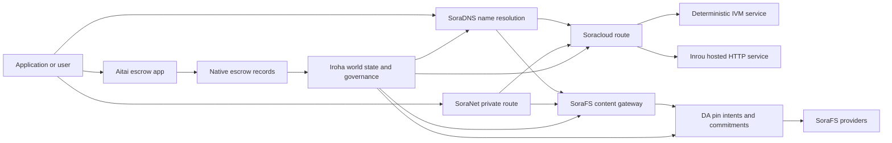

# SORA Nexus שירותים {#sora-nexus-services}

SORA Nexus מוסיפה מטוסים של שירותים פונים לאפליקציות סביב Iroha 3. השירותים האלה אינם ספרי ספרים נפרדים. הם מקושרים על ידי משפחות המסלול של Iroha המדינה העולמית, Norito מסמכים, רישומי ממשל, ו Torii.

זמינות תלויה בניית הערך ובפרופיל הרשת. השתמש [`/openapi`](/he/reference/torii-endpoints.md#app-and-sora-route-families) על הערך היעד בתור רשימת סמכותית של הדרכים המאפשרות.

## מפה מרכיבים {#component-map}

|מרכיב |תפקיד |פני השטח העיקריים |
| ---------------------- | ------------------------------------------------------------------------------------------------------------------------------------------- | ---------------------------------------------------------------------------------------- |
|Soracloud |הפעלת יישומים, שירותי הוסטים, מודל פרטי/מדינה של זמן ההפעלה ופיקוח על מחזור החיים של השירות. |`/v1/soracloud/`, `/api/`, `iroha app soracloud ...` |
|בפנים.|Soracloud מארח את זמן הפעולה של HTTP לשינויים בשירותים שזקוקים למטוס חי HTTP. |Soracloud קונפיגציה של זמן ההפעלה, מודעות יכולת מארח, מדינת זמן ההפקה.|
|SoraNet |פרטיות ותחבורה על גבי מעגלים, תנועה רלוונטית, VPN, פגישות חיבור, וסלולים זרימה. |`/v1/connect/`, `/v1/vpn/`, SoraNet נתונים מטאטא של מסלול |
|זמינות נתונים (DA) |ראיות זמינות, מחויבות, שכבת כוונה של חומרי תועלת המוצגים על ידי שורות Nexus, מוניסטים SoraFS וזרזות הוכחה. |`/v1/da/`, `FindDaPinIntent`, `[sumeragi.da]` |
|SoraFS |שטח אחסון עם כתובת תוכן למניפסטים, מטענים מועילים CAR, תוכן מחובר, קביעות שערות וזרמים של הוכחה לתאוששות. |`/v1/sorafs/`, `/sorafs/`, `FindSorafsProviderOwner` |
|SoraDNS |שכבת כינוי דטרמיניסטית ותישור פתרון עבור שירותים ותוכן הועברו ב SORA. |`/v1/soradns/`, `/soradns/`, אירועים של תיקון הגורם |
|אייטאי |קורדור פיתטי ושלון נכסים ברמה של אפליקציה, המבוסס על רישומים מקומיים, לא על ידי ספרי ספרים נפרדים.|`OpenAssetEscrow`, `FindAssetEscrow*`, `EscrowEventFilter`, Kotodama `escrow_*` בניינים |



## זרמים נפוצים {#common-flows}

### אפליקציה מחולקת הHosted {#hosted-split-application}

אפליקציה טיפיינית מעורבת משמשת את כל החלקים ביחד:

1. נכסים סטטיים של הקצה הקדמי מצטופפים ומחוסרים דרך SoraFS.
2. המארח הציבורי, למשל `<app>.sora`, רשום באמצעות SoraDNS.
3. מסלולים Soracloud `/api/v1/search` או `/api/v1/stream` לשירות Inrou HTTP.
4. מסלולים Soracloud `/api/auth` ו `/api/v1/user` למפעילים דטרמיניסטיים IVM.
5. לקוחות שזקוקים לפרטיות יכולים להגיע לאותו תוכן או למסלול API דרך מעגילת SoraNet.

|דרך |מטוס תומך |למה?|
| ----------------- | --------------------- | ------------------------------------------------- |
| `/`               |SoraFS תוכן סטטי |קש של תוכן שניתן לשחזר .|
|`/assets/*` |SoraFS תוכן סטטי |נכסים עם כתובת תוכן וראיות מפורשות |
|`/api/auth*` |Soracloud IVM |מצב האותופיות והמטבעות מאובטחים|
|`/api/v1/user*` |Soracloud IVM |מוטציות מדינה רגישות לניהול |
|`/api/v1/search*` |Soracloud Inrou |שירות HTTP חי, קש, SSE או מצב הקולקטור |

### תוכן פרסום {#content-publication}

פרסום SoraFS יוצר חפצים קבועים לפני שמות מצביעים עליהם:

1. תבנה מטען מועיל או תיק.
2. ארוז את זה בארכיון CAR ותוכנית חתיכות.
3. לבנות מוניסט Norito עם מדיניות פין ונתונים לניהול.
4. להגיש את ההודעה ל- Torii.
5. רשום כוונה סימן DA או מחויבות זמינות כאשר הפרופיל היעד דורש ראיות מפורשות.
6. קשור את המניפסט לשמות SoraDNS או למסלול הפנים סטטי של Soracloud.

### מסלול רכיבה פרטית או זרימה {#private-fetch-or-streaming-route}

SoraNet יכול לשבת מול SoraFS או Soracloud:

1. הלקוח פותר את השם או המוניפסט.
2. מדריך משמר או מוניסטר מסלול בוחר רלעי כניסה ויציאה.
3. התנועה נמלאה ונשלחת דרך המעגל SoraNet.
4. רלוף היציאה מגיע לשער SoraFS, זרם Torii, או נתיב Soracloud.

## אייטאי {#aitai}

אייטאי הוא מסלול האפליקציה SORA עבור הסדר בסגנון שוק שבו קונה ומוכר מתואמים תשלום מחוץ לשרשרת בעוד Iroha שולח את ה- שומרון נכסים על שרשרת. הוא צריך להשתמש במשפחת ההוראות המקומית של השמורות במקום חשבון משמורת בבעלות חוזה עבור זרמים חדשים של שמרון נכסים מספרים.

הבנק האזרחי שומר על המשמורת בספר. `OpenAssetEscrow`, הקונה מקבל ומכריז על תשלום מחוץ לשרשרת: `AcceptAssetEscrow` ו `MarkEscrowPaymentSent`, והמכר משחרר עם `ReleaseAssetEscrow` אם קונה ומוכר אינם מסכימים, כל צד יכול לפתוח מחלוקת ולפתור עם `CanResolveEscrowDispute` אני יכול לחלק את הסכום המנעול.

לדוגמאות של מחזור החיים המלא, סגורי נכסים גנריים, אסקרו אנונימי, שאלות, אירועים Rust, ראה [ אסקרו נכסים ילידים ](/he/blockchain/escrow.md).

|פני השטח Aitai |השתמשו בו עבור |
| ------------------------------------------------------------------------------------------------------------------------------------------------------------- | ----------------------------------------------------------------------------------------- |
| `OpenAssetEscrow`, `AcceptAssetEscrow`, `MarkEscrowPaymentSent`, `ReleaseAssetEscrow`, `CancelAssetEscrow`                                                    |הצעות חותמות של נכסים מספריים, כולל זרמי הסדר במספרים XOR. |
| `OpenAnonymousAssetEscrow`, `AcceptAnonymousAssetEscrow`, `MarkAnonymousEscrowPaymentSent`, `ReleaseAnonymousAssetEscrow`, `CancelAnonymousAssetEscrow`       |הצעות מוגנות משתמשות בתוספות ראיות עבור מימון וסיום תנועות. |
|`OpenEscrowDispute`, `ResolveEscrowDispute`, `OpenAnonymousEscrowDispute`, `ResolveAnonymousEscrowDispute` |פתרון ויכוחים בסגנון בית המשפט. |
|`FindAssetEscrowById`, `FindAssetEscrowsBySeller`, `FindAssetEscrowsByBuyer`, `FindAssetEscrowsByStatus` |דפים של מצב האפליקציה, עבודות הפיוס, וכלים לתמיכה. |
|`EscrowEventFilter` |חתימות אשראי גלויות חיות על ידי זהת אשראי, מכר, קונה, מעמד או סוג אירוע. |
| Kotodama `escrow_open_offer`, `escrow_accept`, `escrow_mark_payment_sent`, `escrow_release`, `escrow_cancel`, `escrow_open_dispute`, `escrow_resolve_dispute` |Kotodama קריאות חוזה שתומכנת על ידי V1 סיסטומים מאבטחים. |

לשימוש ציבורי Taira או Minamoto, התייחסו לרכבת תשלומים מחוץ למשרשרת ולכל זרימת עבודה של תמיכה או בית המשפט כמדיניות היישום. Iroha רשום את מצב האבטחה, אירועי מחזור החיים, חישובים ראיות, ותנועה נכסים סופית; הוא אינו בודק את הסדר הפיהט בעצמו.

## בדוק קו יעד {#check-a-target-node}

לפני השימוש בדוגמאות מהדף הזה, אושר כי משפחת המסלול קיימת על הערך שאתה מכוון:

```bash
export TORII_URL=https://taira.sora.org

curl -fsS "$TORII_URL/openapi.json" \
  | jq '.paths | keys[] | select(test("^/v1/(soracloud|sorafs|soradns|connect|vpn|da)/"))'

curl -fsS -H 'Accept: application/json' "$TORII_URL/status" | jq .
```

אם `/openapi.json` אינו חשוף על ידי הפרופיל, נסה `/openapi`. זמינות הנתיב המדויקת תלויה בתכונות הבניין ובהסדרת הרשת.

### Taira בדיקות עישון קריאה בלבד {#taira-read-only-smoke-checks}

נקודת הסיום הציבורית Taira היא שימושית עבור בדיקות בצד קריאה, אך אל תשתמשו בה לדוגמאות מוטציות אלא אם כן אתם מפעילים חשבון מורשה וכוונתם לשנות את מצב הקבלה.

```bash
export TORII_URL=https://taira.sora.org

curl -fsS -H 'Accept: application/json' "$TORII_URL/status" \
  | jq '{version: .build.version, peers, blocks, lanes: (.teu_lane_commit | length)}'

curl -fsS "$TORII_URL/v1/connect/status" | jq '{enabled, sessions_active}'

curl -fsS "$TORII_URL/v1/vpn/profile" \
  | jq '{available, relay_endpoint, supported_exit_classes}'

curl -fsS "$TORII_URL/v1/sorafs/storage/state" \
  | jq '{bytes_capacity, bytes_used, pin_queue_depth, por_inflight}'

curl -fsS -H 'Accept: application/json' "$TORII_URL/v1/soracloud/status" \
  | jq '.control_plane | {service_count, services: [.services[] | {service_name, current_version}]}'
```

Taira עשוי לחשוף דרכים של מטוס בקרה ספציפיות לשימוש שאינן רשומות במפה של המסלול של OpenAPI. מתייחסו ל- `/openapi` כלקוח הנגרם העיקרי של API, ולאחר מכן מאשרו את כל מסלול ספציפי לשימוש ישירות לפני שתדokumentו אותו כחיה.

## Soracloud {#soracloud}

Soracloud הוא שטח הבקרה של היישום SORA. הוא מעקב על חבילות הפעלת, תיקונים שירותים, כיוון, מצב ההשפעה, הכניסים הרשמיים של הקונפיגציה, סודות שירות מוצפן, רשומות רישום מודל, פגישות דמיון פרטיים וקבלות זמני תשלום.

Soracloud משתמשת בשתי מטוסים של ביצוע:

|מטוס ההוצאה להורג |זמן ההפעלה |השתמשו בו עבור |
| ---------------------- | ------- | -------------------------------------------------------------------------------------------- |
|`DeterministicService` |`Ivm` |מחבר, מצב הכספת, קריאה מוסמכת, מנהלים של תיבת הדואר, מוטציות רגישות לניהול |
|`HttpService` |`Inrou` |חיים HTTP APIs, עבודה כבדה בקולקטור, שירותים באבטחת קש, SSE, זרמים בעזרת דפדפן |

שטוח הבקרה הוא סמכותי. פקודות הפעלת, העדכון, ההפסקות, הקונפיגציה, סודיות, מודל ומצב מסופקים באמצעות Torii וקוראים את מצב העולם המחויב; הם לא מסתמכים על מראה מקומי נפרד CLI . מסלול ציבורי מבוסס על קובץ מקדם ארוך ביותר, כך שאחד מארח רשום יכול לחלק את התנועה בין מסלולי HTTP ומסלולים דטרמיניסטיים API.

### תפיסה אפליקציה מחולקת {#scaffold-a-split-app}

הטמבלן של אפליקציה מחולקת יוצר קצה מקדימה סטטי ועוד שירות חי API מאורח ואחד דeterministic vault/ API:

```bash
iroha app soracloud app init \
  --template split-app \
  --app-name solswap_indexer \
  --app-version 0.1.0 \
  --public-host solswap-indexer.sora \
  --output-dir ./apps/solswap-indexer

iroha app soracloud app local-plan \
  --manifest ./apps/solswap-indexer/app_manifest.json

iroha app soracloud app doctor \
  --manifest ./apps/solswap-indexer/app_manifest.json
```

`local-plan` מדפס את חלוקת המסלול, מוניסט שירותי ילדים, מסלולי סקרט במרחב עבודה, ואת מצב הפרסום צפוי בחזית. `doctor` מאשר את חוזה השחרור המקומי לפני שאתה מעורב Torii.

### שימו לב את המצב של האפליקציה {#deploy-and-inspect-app-state}

```bash
export SORACLOUD_TORII_URL=https://<soracloud-enabled-torii>

iroha app soracloud app deploy \
  --manifest ./apps/solswap-indexer/app_manifest.json \
  --torii-url "$SORACLOUD_TORII_URL"

iroha app soracloud app status \
  --manifest ./apps/solswap-indexer/app_manifest.json \
  --torii-url "$SORACLOUD_TORII_URL"
```

עבור שירות שהוצא כבר, השתמשו בפיקוד של שירות:

```bash
iroha app soracloud status \
  --service-name solswap_indexer_live \
  --torii-url "$SORACLOUD_TORII_URL"

iroha app soracloud rollback \
  --service-name solswap_indexer_live \
  --target-version 0.1.0 \
  --torii-url "$SORACLOUD_TORII_URL"
```

### חומר סודי {#config-and-secret-material}

Soracloud הכניסה וסודיות הם חלק ממצב הפעלת סמכותי. פיתוח, העדכון ו- rollback נכשלים לסגור כאשר הכניסה או הקשרים הסודיים הנדרשים חסרים או אינם תואמים עם המוניסטים הפעילים.

```bash
iroha app soracloud config-set \
  --service-name solswap_indexer_live \
  --config-name indexer/public_config \
  --value-file ./config/public-config.json \
  --torii-url "$SORACLOUD_TORII_URL"

iroha app soracloud secret-set \
  --service-name solswap_indexer_live \
  --secret-name indexer/api_key \
  --secret-file ./secrets/api-key.envelope.json \
  --torii-url "$SORACLOUD_TORII_URL"
```

השתמשו בעזרה CLI עבור דגלי האשראי המדויקים הנדרשים על ידי הפרופיל שלכם:

```bash
iroha app soracloud config-set --help
iroha app soracloud secret-set --help
```

## אינטרו {#inrou}

Inrou הוא זמן ההפעלה HTTP המארח המשמש על ידי Soracloud. קשר Iroha עם הפרויקטים של זמן ההפקה המשתולבים Soracloud הודאו למצב Soracloud תכנית חומרת מקומית, תפעיל את הדפוסי השירות המארח המיועדים כשירותים לופ-באק, ותדווח על מצב זמן ההפעלה של הדפוסים בחזרה למודל הרשמי.

השתמשו ב- Inrou עבור עומסי עבודה שצריכים שטח חי HTTP, כגון זרמים כבדים של הקולקטור APIs, זרמי SSE, מתפקידי אחסון מאובטחים בקאש, או שירותים עזרים בסייר.

### דרישות בזמן ההפעלה {#runtime-requirements}

- זמן ההפעלה של מוניסטר המכולות חייב להיות `Inrou`.
- רמת ההפעלה של מסמך שירות חייבת להיות `HttpService`.
- `HttpService + Inrou` דורש בדיוק אחד `PersistentRootLeaseVolume` המוסד על `/`.
- שירותי Inrou משותפים זקוקים גם לשירות משותף או לאחסון שכר סודי כאשר הם שומרים מצב משותף משתנה.
- עמודי האוסטינג לייצור צריכים לפרסם יכולת אינטרו אמיתית במקום לפעול רק בתור פרוקסי.

### קטע מפורסם {#manifest-fragment}

הדוגמה למטה מראה את צורת שני המניפסטים. זה פיסוק, לא חבילה שלמה.

```jsonc
// container_manifest.json
{
  "schema_version": 1,
  "runtime": { "runtime": "Inrou", "value": null },
  "bundle_path": "/bundles/solswap-indexer.inrou",
  "entrypoint": "/app/bin/launch-indexer.sh",
  "args": [],
  "env": {
    "RUST_LOG": "info",
  },
  "inrou": {
    "schema_version": 1,
    "guest_os": { "guest_os": "DebianSlim", "value": null },
    "guest_images": {
      "x86_64": {
        "kernel_image_path": "/inrou/x86_64/vmlinux",
        "rootfs_image_path": "/inrou/x86_64/rootfs.ext4",
        "initrd_image_path": null,
      },
      "aarch64": {
        "kernel_image_path": "/inrou/aarch64/vmlinux",
        "rootfs_image_path": "/inrou/aarch64/rootfs.ext4",
        "initrd_image_path": null,
      },
    },
  },
  "lifecycle": {
    "start_grace_secs": 60,
    "stop_grace_secs": 30,
    "healthcheck_path": "/api/indexer/v1/health",
  },
}
```

```jsonc
// service_manifest.json
{
  "schema_version": 1,
  "service_name": "solswap_indexer_live",
  "service_version": "0.1.0",
  "execution_plane": { "execution_plane": "HttpService", "value": null },
  "replicas": 2,
  "route": {
    "host": "solswap-indexer.sora",
    "path_prefix": "/api/v1/search",
    "service_port": 8080,
    "visibility": { "visibility": "Public", "value": null },
    "tls_mode": { "tls": "Required", "value": null },
  },
  "lease_volumes": [
    {
      "volume_name": "root_disk",
      "kind": {
        "lease_volume": "PersistentRootLeaseVolume",
        "value": null,
      },
      "storage_class": { "storage_class": "Warm", "value": null },
      "mount_path": "/",
      "max_total_bytes": 8589934592,
    },
    {
      "volume_name": "index_state",
      "kind": { "lease_volume": "ServiceLeaseVolume", "value": null },
      "storage_class": { "storage_class": "Warm", "value": null },
      "mount_path": "/var/lib/solswap-indexer",
      "max_total_bytes": 1073741824,
    },
  ],
}
```

בזמן ההפעלה, כל נפח שכר המינוי המוסך נחשף באמצעות משתנים סביבתיים שמוצאים מהשם של נפח:

```text
SORACLOUD_LEASE_VOLUME_ROOT_DISK_DIR
SORACLOUD_LEASE_VOLUME_ROOT_DISK_MOUNT_PATH
SORACLOUD_LEASE_VOLUME_INDEX_STATE_DIR
SORACLOUD_LEASE_VOLUME_INDEX_STATE_MOUNT_PATH
```

## SoraNet {#soranet}

SoraNet הוא הגדרת הפרטיות והתנועה. היא מספקת דרכים מבוססות רלוף עבור תנועה שלא אמורות להתחבר ישירות לשער היעד או לשירות. עיצוב התחבורה משתמש בתפקידי רלוף הכניסה, הביניים והוצאת, תחבורה QUIC, מחיצת יד היברידית מבוססת רעש, משא ומתן על יכולת, נתונים מטאטא של תיקון הרלוף, ותאי מרכיבים קבועים.

בפיצוצים Nexus, SoraNet יכול לשאת קישורים של תוכן, תנועת שער, VPN או פגישות Connect, ו Norito מסלולי סטרימינג. הכניסים לקובץ יכולים לסמן רלעים שתומכים `norito-stream`, המאפשרות ללקוחות להעדיף דרכים המתאימות ל Torii RPC או תנועת סטרימיνγκ.

### הגדרת הזרם {#streaming-configuration}

הפרופיל Nexus מאפשר סיפקת SoraNet למסלולים של זרימה:

```toml
[streaming]
feature_bits = 0b11

[streaming.soranet]
enabled = true
exit_multiaddr = "/dns/torii/udp/9443/quic"
padding_budget_ms = 25
access_kind = "authenticated"
provision_spool_dir = "./storage/streaming/soranet_routes"
provision_spool_max_bytes = 0
provision_window_segments = 4
provision_queue_capacity = 256
```

השתמש `access_kind = "read-only"` בשבילים של תוכן שאינם דורשים אימות הצופים. השתמש ב- `authenticated` כאשר רלווי היציאה חייב לאכוף כרטיסים או זהותו של הצופה לפני הגשר ל- Torii או לשירות מקובל.

### SoraNet-יודעת SoraFS {#soranet-aware-sorafs-fetch}

SoraFS קבל CLI יכול להוציא מוניסט פרוקסי מקומי ומטאטא הנתונים של מסלול SoraNet למרחבות הדפדפן או לאדפקטורים SDK:

```bash
sorafs_cli fetch \
  --plan artifacts/payload_plan.json \
  --manifest-id 7bb2...9d31 \
  --provider name=alpha,provider-id=9f5c...73aa,base-url=https://gw-alpha.example.org/,stream-token="$(cat alpha.token)" \
  --output artifacts/payload.bin \
  --json-out artifacts/fetch_summary.json \
  --local-proxy-manifest-out artifacts/proxy_manifest.json \
  --local-proxy-mode bridge \
  --local-proxy-norito-spool storage/streaming/soranet_routes \
  --local-proxy-kaigi-spool storage/streaming/soranet_routes \
  --local-proxy-kaigi-policy authenticated \
  --max-peers=2 \
  --retry-budget=4
```

אספק מסמכים סיכומים מדווחים, קבלות חתיכות, מטא נתונים מקומיים, ואת הגדרות של הנסיעה הפועלת בשימוש עבור הביאה.

### רשימה של בדיקות תמריצים {#relay-incentive-verifier-roster}

כשיש `incentives.enable` נכון, `incentives.trusted_verifier_ids` חייב להכיל לפחות חשבון קנוני אחד ולא יותר מ-64 חשבונות קנוניים IDs. זמן ההפעלה מאחסן את הרשימה כמجموعת מסודרת דטרמיסטית, וגיאומטריה של רשימה לא חוקית נדחתה בעת הפעלת הרשת.

כל `RelayBandwidthProof` מפורסמת תחת מסגרת קבועה/צעת תקציב וצריכה לצרוך את המסגרת המלאה. חשבון הבדיקת הראיה חייב להיות נוכח ברשימת הקונפיגירציה, ו`RelayBandwidthProof::verify_signature()` חייב להצליח - לפני המנוחה מנעול או משנה את אקימולטור הביצועים שלה. חותם לא מבוסס על אמון או הוכחת חתימה חסרת תקף/טמיפציה, לכן אינה מספקת מדידה ולא יכולה להפיק תמונת תמונה מעודדת.

## זמינות נתונים (DA) {#data-availability-da}

DA הוא שכבת הראיות של זמינות עבור מטענים שימושיים גדולים מדי, רגישים מדי לפרטיות או ספציפיים מדי לשירות כדי להציב אותם ישירות במצב העולם. הוא רשום מחויבויות דטרמיסטיות וחובות חיפוש כדי שהמתאשרים, שערים ולקוחות יוכלו להסכים על אילו בייטים הובטחו, איזו מדיניות חל ואיזה ראיות נאמרו .

DA לא מחליף את Kura או SoraFS:

- Kura מאחסן את זרם הבלוק הסופית ואת נתוני השיקום של ההסכמה.
- SoraFS מאחסנים ומשרתים בייטים עם כתובת תוכן, מטענים מועילים של CAR ומניסטרים.
- DA רשום מחויבויות, מדיניות הוכחה, פתיחות הוכחה, וכוונות קישור שמאפשרים את בייטים אלה להיות מתוכננים, בודקים, ומקושרים בחזרה למצב הספרה.

השתמש DA כאשר יישום או קו Nexus זקוק לאבטחה נראית למספרים שהנתונים מחוץ לשערות נשארים ניתנים למשוך. דוגמאות נפוצות כוללות התחייבויות של עומס נוח בקו עבור זרמי הסדר, כוונות סימן SoraFS לתוכן פורסם, חבילות ראיות שעליהם לשמור כדי לאמת מאוחר יותר, ואנטיפקטים של יישום אשר מצבם הציבורי צריך להיות דיגסט ולא המטען הפועל המלא.

### מחזור החיים {#lifecycle}

|שלב |מה נרשם.|
| ---------- | ----------------------------------------------------------------------------------------------------------------------------------------------------- |
|כוונה |כרטיס, תיקון מפורסם, שם כינוי, תיקוני קו/עונה/שלב, מדיניות שמירה או מטרה של כתיבה. |
|התחייבות |ציין את החומר שמקשר את המניפסט, עומס המסלול, חבילה של ראיות, או שורש התוכן לרקוד הנראה בספר. |
|ראיות |קולות זמינות, פתיחות הוכחה, תעודות ספקית או ראיות אחרות ספציפיות לפרופיל שהרשת היעד קיבלה. |
|שאלה |חיפושים של כוונות סימון באמצעות `FindDaPinIntentByTicket`, `FindDaPinIntentByManifest`, `FindDaPinIntentByAlias` או `FindDaPinIntentByLaneEpochSequence`. |

זרימת פרסום טיפוסית DA היא:

1. לבנות או לקבל את המטען הפועל מחוץ ל- WSV, למשל קבוצה של SoraFS CAR או מטען פועל של Nexus.
2. תיאר את המטען הפועל במוניסט Norito או רשום התחייבויות ספציפית למסלול.
3. להגיש את ההודעה, כוונת הסימן או התחייבות באמצעות `/v1/da/*` כאשר משפחת הנתיב הזו מופעלת, או דרך מסלול העסקה המותומן של הרשת.
4. תן לאישורנים או לספקי זמינות לאסוף את הראיות הנדרשות על ידי מדיניות ההוכחה הפעילה.
5. שאל את כוונתו או ההתחייבות המוצאת לפני קידום שם פרטי, הוכחת הסדר, או דרך שער שתלוי במשקל.

### מודל אלגוריתמי {#algorithmic-model}

DA הופך עומס תועלת לתוך מחויבות חתומה, מוגנת על ידי שידור חוזר, ה-block-indexed. האלגוריתמים החשובים הם דטרמיסטיים כך שתואלידורים ו-gateways יכולים לחשב מחדש את אותם דיגסטים מאותו בייט.

1. קאנוניקליז את המטען הפועל הנשלח. Torii מקבל בקשה לנטול עם `(lane_id, epoch, sequence)`, בייטים מטען פועל, נתונים מתאחסנים, גודל חתיכה, פרופיל חיסוך, מדיניות שמירה, וחתום של המגיש. הערך מפרץ את עומסי השימוש gzip, deflate או Zstandard בעת בקשה, ולאחר מכן מאשר כי אורך הביט הקנוני הוא שווה `total_size`.
2. אישור רצועה ופרמטרים של חתיכות. הרצועה חייבת להתקיים בקאטלוג הרצועות Nexus. `chunk_size` חייב להיות בעל כוח שאינו אפס של שני, לפחות שני בייטים, פרופיל החיסול חייב לכלול חלקי נתונים ושתי חלקי שוויון לפחות. קטלוג המסלול בוחר את תוכנית ההוכחה, `merkle_sha256` או `kzg_bls12_381`.
3. ליישם מדיניות רשת. הערך מכיל את קו בסיס ההשפכה והתחזוקה המוגדרים עבור מעמד ה-blob. מטא נתונים ציבוריים חייבים להישאר טקסט ברורה; מטא נתוני הממשל בלבד מוצפן עם מפתח המטא נתונים המוגדר של הערך לפני שהוא נכתב למניפסט.
4. חתיכה ומחייב. המטען הפועל הקנוני הוא חתיכה עם פרופיל בגודל קבוע המוצא מ `chunk_size`. Torii מחושב את ההזיה של המטען הפוטנציאלי, שורש עץ הוכחת השיקום, וההתחייבויות לחתיכה. חתיכות הנתונים נושאות התחייבות BLAKE3 מעל בייטים שלהם.
5. הוספת מחויבויות למחוק. חתיכות מתקבצים לשורות של `data_shards`. תאים חסרים בשורה הסופית הם אפס מכבשים לחישוב השוויון. RS חתיכות משוויון של שורה/גלובלית; בחופשי `row_parity_stripes` מוסיפים את השוויון של קישור בסגנון עמוד בכל המתריש. מחויבויות לחתיכות השוויון הן BLAKE3 סימבולות של סמלים קטנים `u16`.
6. `DaManifestV1` רשום את המסלול, התקופה, כיתה של בלאב, קודק, תרגיל המטען הפועל, שורש חתיכה, גודל החתיכה, פרופיל למחוק, מדיניות שמירה, ציטוט שכר, מחויבות חתיכת, התחייבות אופציונלית IPA, מטאדאטה, וזמן ההוצאה. כרטיס האחסון הוא דטרמיניסטי: הערך קודם כל חותם טמבלט מוניסט עם כרטיס ריק, ולאחר מכן כותב את טביעת האצבע הזאת בחזרה בתור `storage_ticket` הסופי.
7. סירוב קונפליקטים של שידור חוזר. מפתח שידור הוא `(lane_id, epoch, sequence, manifest_fingerprint)`. דופליקציה עם אותו טביעת אצבע היא אידומטנטה. רצף ישן או אותה רצף עם טביעת יד שונה נדחתה.
8. שחרר חפצים חתומים. Torii מחשובים a PDP מחויבות, חתום על `DaIngestReceipt`, בונה a `DaCommitmentRecord`, והוא כותב חתיכות של מכתבים, PDP התחייבות, רישום התחייבות. לוח הזמנים של התחייבות; כוונה של פין. קורסר הקבלה מתקדם באופן מונוטוני לכל `(lane_id, epoch)`.

רישומים של מחויבות הם מה שבליקים יש.

- מסלול, תקופה וסדר
- בלוב הקלול ID והשיש של מוניסט קנוני
- תכנית אבטחת המסלול
- שורש חתיכה
- מחויבות KZG בחופשית לכיוון KZG
- PDP/הזיהום של ראיות
- שיעור שמירה וכרטיס אחסון
- Torii DA חותמת אישור

לפני שבלוק יכלול רשומות DA, מסלול ההסדר של הבלוק מאשר את החבילה:

- `(lane_id, epoch, sequence)` חייב להיות ייחודי בתוך החבילה.
- האשיס המפורסם חייב להיות לא אפס וחיוני בתוך החבילה.
- תוכנית הוכחת התחייבויות חייבת להיות תואמת למדיניות המסלול המוגנת.
- קווי מרקל דוחקים מחויבות KZG; קווי KZG דורשים מחויבות שאינה אפס KZG.
- כוונות פין קנוניקליות, מסווגות ומסגורות על ידי ליין, המניפסט האש, כרטיס אחסון, חשבון הבעלים, וחוקים של התנגשות תחת השם.

כותרת הבלוק מאחסנת חשיפים למדיניות ההוכחה של DA, מחויבויות וכוונות פין. עבור הוכחות חברות, קובץ ההתחייבויות חושף גם שורש מרקל אשר עורות הם חישובים של ערכי `DaCommitmentRecord` קנוניקלים Norito. הערכים ההורים חישובים את הקשר בין הילדים השמאלי והימין; דף מוזר מופעל ללא שינוי לשכת הבאה.

### ביקורת ראיות {#proof-verification}

`/v1/da/commitments/prove` יכול להפיק הוכחה עבור מחויבות אחת בלוק. ההוכחה מכילה את המחויבות, גובה הבלוק, אינדיקס בבלק, חישוב חבילה, אורך החבילה, שורש מרקל, ומסלול אחים:

1. ה-Hash של חבילה הוכחה מתאים ל- DA ההתחייבות של כותרת הבלוק.
2. גובה הבלוק ההוכחה תואם את כותרת הבלוק המוצגת.
3. האינדיקס נמצא בגבולות וההתחייבויות שוות את הכניסה של הקבוצה באינדיקס הזה.
4. מדיניות ההגנה על המסלול מקבלת את התחייבות.
5. כפוף את הנתיב האחים מן העלת ההתחייבות מייצג מחדש את השורש המוצא.
6. השורש המוקם מחדש שווה לשורש הקוטב.

זה מוכיח כי מחויבות זמינות ספציפית נכללה במשולש מועיל של בלוק ספציפי; זה לא מוכיח שכל דגמה נמצאת כיום מקוון. ניתן לבדוק את השימוש בשידור חי בנפרד באמצעות קניות של ספק SoraFS, בדיקה של PDP/PoTR, או ראיות זמינות ספציפיות לפרופיל.

### אינטראקציה בהסכמה {#consensus-interaction}

DA מקושר ל- Sumeragi באמצעות שידור אמין (RBC), אך זה לא פרוטוקול של סיום שני. RBC משך ומחזיר את עומסי ההצעה: המציע מכריז על ישיבה עבור `(height, view, payload_hash)`, חתיכות חילופי עמיתים, ואת אותות `READY`/`DELIVER` לעקוב אחר האם מספיק מבחינים צפו באותה עומס תועלת.

ב- Iroha 3, שוויון נחשב לנטל הפועל המתמשך של בלוק זמין כאשר או:

- האש של הבלוק הממתין המקומי באייטים לשאש המטען הפועל הנצפה, או
- RBC השיא מטען שימושי מתאים לבלוק האש, גובה, תצוגה, ואש של המטען.

אם אף אחד מהמצבים לא מתקיים, הדוגמא רשום `missing_local_data`, ממשיך לנסות לשחזר את המטען המשפטי באמצעות RBC או סינכרון בלוק, ומודיע על שער DA במצב וטלמטריה. בהיישום הנוכחי, אותות אלה DA הם ייעוץ עבור סופית: בלוק עדיין מסתיים מתוך תעודת ההתחייבויות ועוד המטען המקומי המתאים, ולא מתוך תעודת קוורום נפרדת DA .

זמן DA מרחיב את חלונות ההתאוששות. הזמן הקוורום הפועל של DA נגזר מהבלוק המוגדר והזמני ההתחייבויות, ואז הוכפל על ידי `sumeragi.advanced.da.quorum_timeout_multiplier`. זמן זמינות הזמינות הוא `max(quorum_timeout, availability_timeout_floor_ms) * availability_timeout_multiplier`. לפני שזמן זמינות זה ייגמר, הערך מעדיף את השיקום של עומס תועלת וממנע מחודש מוקדם; לאחר שהוא יגמר, ניתן להמשיך בנתיבים רגילים של חיזור ושינוי התצפיות .

### הערות של המפעילים {#operator-notes}

Iroha 3 פרופיל ההסכמה כולל: RBC-פצת מטען מועיל, אבטחה מפורשת, DA אישור חבילה, טלמטריה התאוששות. `[sumeragi.da]` גבולות עבור התחייבויות ופתוחות ראיות על כמות, ועוד `[sumeragi.advanced.da]` משפילים של זמן פסק זמן עבור התנהגות קוורום ושימוש. לשמור על הגדרות הללו עקביות בין מתוקפים ברשת אחת פרופיל.

כדי לגלות את המסלול, התחל עם המסמך OpenAPI של הערך:

```bash
curl -fsS "$TORII_URL/openapi.json" \
  | jq '.paths | keys[] | select(startswith("/v1/da/"))'
```

השתמשו ברשימת השאלות [](/he/reference/queries.md#nexus-data-availability-and-packages) עבור שמות השאלות הנוכחיים DA, ובנמגם ההסדרים של הדוגמאות [ ](/he/reference/peer-config/) עבור כפתורים מקומיים `[sumeragi.da]` שנחשפו על ידי הבנייה שלכם.

## SoraFS {#sorafs}

SoraFS הוא הרכב האחסון הבלתי מרכזי עם כתובת תוכן. הוא מסגר בייטים לחלקים דטרמיסטיים, ארכיונים CAR, ומניפסטים Norito שמחברים את שורשי התוכן, פרופילים של חתיכות, מדיניות פין ומסמכים לניהול. ספקי אחסון מפרסמים על קיבולת וזמינות התוכן, בעוד שערות בדיקות את המניפסטים והתחייבויות של חתיכה לפני שיצאו תוכן.

טיפוסי SoraFS השימוש כולל נכסי יישומים סטטיים, בניית מסמכים, אזור קבוצות, דוגמאות או תיקונים של חפצים, וקבוצות ראיות לניהול. Iroha מודל נתונים חשוף SoraFS אירועים כניסה ו [`FindSorafsProviderOwner`](/he/reference/queries.md#nexus-data-availability-and-packages) בקשה לפתרון הבעלים של ספק.

### שערות מקומיות ציבוריות CID ושערים באתר {#public-local-cid-and-site-gateways}

כל קשר Torii המאפשר SoraFS מקין את המסלולים הציבוריים האנונימיים האלה גם כאשר האפליקציה אופציונלית API אינה נבננת:

|שיטה ונקודת סוף |מטרה.|
| --- | --- |
|`GET /.well-known/sorafs/manifest` |תחזיר את המניפסט שנבחר על ידי מארח בקשה קנוניקה |
|`GET /v1/sorafs/cid/{cid}` |להחזיר מטא נתונים מקומיים מגבילים ופרסומים בקבצים עבור אחד CID |
|`GET /sorafs/cid/{cid}` |לשרת את המסמך המקור עבור אתר אחד מקומי עם כתובת תוכן |
|`GET /sorafs/cid/{cid}/{*path}` |לשרת מסלול נורמלי אחד, או טווח בייט מוגבל אחד, תחת CID |

הנתיבים האלה אף פעם לא מקבלים `x-sorafs-stream-token` או `x-sorafs-token-id`. נוכחות של שני כותרות היא בקשה גרועה. מוניסט קנוני כבר קיים בחנות המקומית הרשמית של הערך הוא יכולת קריאה ציבורית; חוסר קש לא מאפשר מיזוג מתפקד מרוחק. ספק מוגן CAR וסלולים קטלניים נשארים שטחים פרטיים של פרוטוקול מאושרים.

לפני קריאת בייטים, Torii מאשר את ההצפנה הקנוניקה של המניסט מקומי, המגבלות סימנטיות, דיגסט והשורש CID. לאחר מכן הוא דורש את זהותו של ספק מקומי סמכותי, הכרה בהנהלה, ובדיקות תקיפות וחיסול נשלטים למניסט, CID. ומספק. מדיניות שערי השער / איסור משתמשת בכתובת הלקוח הפועלת, מכבדת כתובות מועברות רק באמצעות פרוקסי אמונים מוגדרים. מדיניות נעלמת, תמימות, ביטול, זהות או מדינה הכניסה נכשלים לסגור.

בקשה אחת יש רישיון שער ציבורי מסוף עד הסוף; הגבול של התהליך כולו הוא 64 קריאות בו זמנית. עם בקשות מוגזמות שהוחזרו `503 Service Unavailable` ו `Retry-After: 1`. תגובות מפורשות מוגבלות ל-16 MiB, רשימות קבצים מקובלות ל-50 כתיבים ומקבלות לכל היותר 500, וקובץ שלם או טווח בייט אחד מוגבל ל-8 MiB. CIDs, שאלות, מארחים, דרכים וראיות טווח חייבים להשתמש בצורות קנוניות בעלות ערך אחד. פעיל HTML, תסריט, SVG, XML, PDF, או תוכן Wasm משמש רק ממערכת מוגדרת CID-מוצא מבודד (או ממוקם לשם), שמונע מקורות שער משותפים מבצעים תוכן לא אמין.

### מאתגרים במדינות {#moderation-challenges}

SoraFS כלכלת האתגר המתואם היא מדינה של הסכמה. המדיניות הפעילה מכנה את נכס ההצבעה של השלטון ואת חשבונות השלטון המשמשים ל-escrow ו-slashing. כל מהלך דורש בדיוק 150 יחידות של נכס זה; הגדלתו עוברת באופן אטומטי את הקשר לתוך שכר. תיק מסירב מזהה מאתגר כפול, מאתגר שני על ידי אותו חשבון, או מאתגר ראיות משומש מחדש ללא שינוי של סכומים או ספקי מאתגר.

המועד האחרון להגיש אתגר ולתקן אתגר הוא שונה. השלטון מקבל בדיוק 24 שעות לאחר ההצעות הקרובות לקבל או לסרב את האתגר המתמשך. האתגרים המתקיימים בבלוק ההצבעה חושפים רק עד מועד הגבלת ההחלטה הזה:

- מאתגר מקובל מפסיק את התיק ומחזיר את השכר המלא;
- התביעה הוגנתה מאפשרת להמשיך את התיק, שולחת 25% מההתחייבויות למקבל הקצבה (מגושלת למטה בהתאם לדיוק של נכס ההצבעה), ומחזירה את השאר;
- מאתגר לא פתר ייגמר לאחר חלון החסד, אינו נפתח, ומחזיר את ההתחייבויות המלאות.

`ExpireSorafsModerationChallenge` הוא ללא רשות ואינו בעלת היכולת לבעיה שכבר נגמרה. סיום התיק מבצע את אותו הסדר גמלאות כמו סגור, אז שומר חסר לא יכול להשאיר כספים נעולים או לשמור גילויים חוסמים. כל הסדר הוא אטומטי: אם כל החזר או קצץ רגל נכשל, הסדר המלא חוזר חזרה.

מדיניות המדרציה ודוחות התיקים משתמשים באופן ישיר בתוכנית השחרור הראשון. קשרים דוחקים תכנון נמשך מראש במהלך ההחלקה/מדינה או לשחזור תמונות מיידיות; לשחזר את התקנים האלה במקום להסיק את נכס ההצבעה, חשבונות השמורת, מועדים, או כלכלה מהמדינה המורשת.

### קבלו, הודיעו, חתמו ושלחו {#pack-manifest-sign-and-submit}

```bash
cargo run -p sorafs_car --features cli --bin sorafs_cli -- \
  car pack \
  --input ./dist \
  --car-out artifacts/site.car \
  --plan-out artifacts/site.chunk-plan.json \
  --summary-out artifacts/site.car-summary.json

cargo run -p sorafs_car --features cli --bin sorafs_cli -- \
  manifest build \
  --summary artifacts/site.car-summary.json \
  --manifest-out artifacts/site.manifest.to \
  --manifest-json-out artifacts/site.manifest.json \
  --pin-min-replicas=3 \
  --pin-storage-class=warm \
  --pin-retention-epoch=42

SIGSTORE_ID_TOKEN=$(oidc-client fetch-token) \
cargo run -p sorafs_car --features cli --bin sorafs_cli -- \
  manifest sign \
  --manifest artifacts/site.manifest.to \
  --bundle-out artifacts/site.manifest.bundle.json \
  --signature-out artifacts/site.manifest.sig

cargo run -p sorafs_car --features cli --bin sorafs_cli -- \
  manifest submit \
  --manifest artifacts/site.manifest.to \
  --chunk-plan artifacts/site.chunk-plan.json \
  --torii-url "$TORII_URL" \
  --resolve-submitted-epoch=true \
  --authority=<i105-account-id> \
  --private-key-file ./secrets/authority.ed25519 \
  --summary-out artifacts/site.manifest.submit.json \
  --response-out artifacts/site.manifest.submit.body
```

אם `/v1/sorafs/pin/register` לא נשלח על הערך היעד, CLI יכול לחזור למסר `/transaction` חתום ולחכות לסטטוס של צינור טערמין.

### תבדקו ותביאו {#verify-and-fetch}

```bash
cargo run -p sorafs_car --features cli --bin sorafs_cli -- \
  proof verify \
  --manifest artifacts/site.manifest.to \
  --car artifacts/site.car \
  --chunk-plan artifacts/site.chunk-plan.json \
  --summary-out artifacts/site.verify.json

sorafs_cli fetch \
  --plan artifacts/site.chunk-plan.json \
  --manifest-id <manifest-digest-hex> \
  --provider name=primary,provider-id=<provider-id-hex>,base-url=https://gateway.example.org/,stream-token="$(cat provider.token)" \
  --output artifacts/site.fetch.tar \
  --json-out artifacts/site.fetch.json
```

### בדיקות הוכחה לגיבוי {#proof-of-retrievability-checks}

המפעילים יכולים לבדוק ולפעול בדיקות ראיות עבור ספקי אחסון:

```bash
sorafs_cli por status \
  --torii-url "$TORII_URL" \
  --manifest <manifest-digest-hex> \
  --status=failed \
  --limit=20

sorafs_cli por trigger \
  --torii-url "$TORII_URL" \
  --manifest <manifest-digest-hex> \
  --provider <provider-id-hex> \
  --reason=latency_probe \
  --samples=48 \
  --auth-token artifacts/challenge_token.to
```

## SoraDNS {#soradns}

SoraDNS הוא שכבת ההגדרה של השמות עבור שירותים ותוכן SORA. זה נורמליז את שמות, מקושר עדכונים לקובץ הגורמים ב Iroha, ומפצה חבילות אזורים או פיתוחים חתומים דרך SoraFS. פיתוחי פיתוח וערוצים בודקים מסמכים של אישור פיתוח לפני שהם סומכים על נתונים מטאטא.

עבור גישה בדפדפן, SoraDNS מוציא את מארחי שער ממקור רשום FQDN. מארח השטויות הרשמי נשאר מקור היישום הקנוני, בעוד פרופילי שער המוצבים חושפים את שרת הדפדפן וסלולים אחזור Torii למקור זה.

### טופסים מארח {#host-forms}

|טופס |דוגמה |מטרה.|
| --- | --- | --- |
|מקור השטויות |`https://<fqdn>/<path>` |אפליקציית קאנוניקה URL נרשמת במניפסטים ובנקודות השחרור |
|Taira שער הדפדפן |`https://<fqdn>.mon.taira.sora.net/<path>` |שער דפדפן ציבורי לכינוי זיהוי פעיל |
|Torii נתיב אחורה |`https://taira.sora.org/soradns/<fqdn>/<path>` |Torii תיקון ומסלול אחזור לכינוי כתיב פעיל |
|שער חישוי קאנוני|`<base32(blake3(name))>.gw.sora.id` |זהות כניסה דטרמינסטית והבדיקת GAR |

ההפסקות `/soradns/<alias>/...` אינה הציבורית המועדפת URL. כלי, מוניסטים של אפליקציות, ועיצוב קצה הקדמי צריך להעדיף את המארח הריק עצמו. אם שם כינוי אינו פעיל ב Taira, שער הדפדפן או מסלול ההחזרה יכול לחזור `404` או להיכשל TLS לפני שתתחיל הנסיעה של היישום. .

### מארגני שער נגזרים {#derive-gateway-hosts}

```ts
import {
  deriveSoradnsGatewayHosts,
  hostPatternsCoverDerivedHosts,
} from '@iroha/iroha-js'

const derived = deriveSoradnsGatewayHosts('docs.sora')
console.log(derived.canonicalHost)
console.log(derived.prettyHost)

const taira = deriveSoradnsGatewayHosts('solswap-indexer.sora', {
  prettySuffix: 'mon.taira.sora.net',
})
console.log(taira.prettyHost)

const patterns = [
  derived.canonicalHost,
  derived.canonicalWildcard,
  derived.prettyHost,
]
console.log(hostPatternsCoverDerivedHosts(patterns, derived))
```

GAR המשאבים הפועלים צריכים לכסות את מארח ההש הקנוני, את כרטיס הברזל הקנוני והארח היפה הנבחר.

### קבל תמונה של תיקון Resolver Snapshot {#fetch-a-resolver-directory-snapshot}

```bash
curl -i "$TORII_URL/v1/soradns/directory/latest"

soradns_resolver directory fetch \
  --record-url "$TORII_URL/v1/soradns/directory/latest" \
  --directory-url https://gateway.example.org/soradns/directory/latest.car \
  --output ./state/soradns-directory

soradns_resolver rad verify \
  --rad ./state/soradns-directory/rad/resolver-a.norito
```

שערות צריכות לסרב את המפתחים אשר מסמך אישור הגורם שלהם חסר, נגמר, לא חתום או לא מקושר לקובץ Merkle root האחרון. ברשת שבה עדיין לא פורסם קובץ גורם הגורם, `/v1/soradns/directory/latest` יכול להחזיר `404` גם אם הנתיב פעיל.

### מחלקת ציבורית DNS {#public-dns-delegation}

SoraDNS תוצרת מארח לא מחליפה את משלחת האינטרנט הרגילה DNS. אם שם ציבורי DNS צריך להצביע על שער SoraDNS:

- עבור תת-גופים, לפרסם CNAME למארח הנבחר יפה
- עבור שמות העליון, השתמשו ALIAS/ANAME או A/AAAA רשומות בשער anycast IPs
- לשמור על מארח ההש הקנוני תחת תחום שער SoraDNS עבור בדיקות GAR

## FHE ו UAID {#fhe-and-uaid}

שטחים הקשורים FHE הזמינים לשירותים Nexus כוללים:

- `iroha_crypto::fhe_bfv` מיישמת תמיכה דטרמיסטית BFV לביצוע הערכה של טקסט סיפר סקאלארי. החלטת מזהה משתמשת ב `BfvIdentifierPublicParameters` ו `BfvIdentifierCiphertext`, שבו חלון 0 מאחסן את אורך הביט הכניסה ואת חלונות מאוחר יותר מאחסנים בייט אחד מוצפן לכל אחד.
- Soracloud מודל של תכניות מצב ומשרות FHE עומסי עבודה של טקסט סיפר עם קבוצות פרמטרים ניהוליות, מדיניות ביצוע, מחויבות בטקסט סיפרי, מעטפות בקשות וזמנות גילוי מידע.

נתיב מזהה BFV משמש להירשם שמגן על הפרטיות. לקוח יכול לשלוח מזהה מוצפן למפתר Torii. המפתר מעריך על פי מדיניות ההזהה הפעילה, הוא מוצא `OpaqueAccountId` ומעניק קבלה. `ClaimIdentifier` לאחר מכן מחבר את הקבלה ל- UAID המוסמך לחשבון היעד.

ה- UAID הוא זהות ויכולת מעוגד סביב הזרימה הזאת. במודל הנתונים, `UniversalAccountId` הוא נתמך בהשיש ומוצג כ `uaid:<hash>`. הפרסורים מקבלים או `uaid:<hash>` או את ה-64 העקסיות המקוריות. `Account` ו `NewAccount` כולל אופציונלי `uaid` ו `opaque_ids` שדות. רישום בזמן ההפעלה מכיל UAID-אינדקס לחשבון, דוחה מזהים חיוורים כפולים או מתנגשים, ודוחה מזהים לא שקולים ללא UAID. בכל פעם ש UAID שינויים בהקשר לחשבון, זמן ההפעלה מבנה מחדש Space Directory קשרים נתונים UAID.

קובץ מרחב מונפסט מקושר יכולות ל UAID. `AssetPermissionManifest` מכניסים את UAID, חלל נתונים, תקופת הפעולה והסגירה אופציונלית, ומזוהרים הרשמי / סירוב הכתיבות על ידי חלל נתוני, תוכנית, שיטה, נכס, ו AMX תפקיד. הערכה היא סירוב-ניצחונות: סירוב התאמה הראשון דוחה את בקשה, אחרת המועמד האחרון מאפשר התאמה הוא בודק נגד כל גבול הסכום. פרסום, סיפוק וביטול המוניסטרים אלה מוגנים על ידי `CanPublishSpaceDirectoryManifest`.

עבור מצב Soracloud FHE, התכניות המוצעות הן:

|תכנית |מה הוא שולח.|
| ----------------------------------------- | --------------------------------------------------------------------------------------------------------------------------- |
|`SoraStateBindingV1` עם `FheCiphertext` |מצביע כי הערכים תחת מפתח מצב מקודם הם FHE טקסטים קובעים. |
|`FheParamSetV1` |שמות של הסכמה, הגבול האחורי, שרשרת המודולוס, מעלת פולינומיה, ספירת חלונות, מטרה אבטחה, מחזור חיים וחיקוי פרמטרים. |
|`FheExecutionPolicyV1` |מגבילים את גודל הטקסט הצפוני, גודל טקסט פשוט, ספירת הכניסות/הוצא, עומק ההרכבות, סיבובים, קישורים ומצב הסיבוב. |
|`FheGovernanceBundleV1` |זוג פרמטר אחד להגדיר עם מדיניות ביצוע אחת עבור אישור הכניסה. |
|`FheJobSpecV1` |מתארת עבודה דטרמינסטית `Add`, `Multiply`, `RotateLeft` או `Bootstrap` על מפתחות מצב ותחייבויות של טקסט סיפר. |
|`CiphertextQuerySpecV1` |שאילתות מצביעות רק טקסט סיפר על ידי שירות, חיבור, מקדמת מפתח, גבול תוצאות, רמה של מטא-מנתונים, וראיה לכלול אופציונלית.|
|`DecryptionRequestV1` |מבקש גילוי עבור מחויבות טקסט חותם אחת במסגרת מדיניות של סמכות פירור. |

`FheJobSpecV1::validate_for_execution` בודק אם המשימה, מדיניות הביצוע והסגנום של הפרמטרים מסכימים לפני הקבלה. הוא גם מכיל חוקים ספציפיים לפעילות: הוספת ומضاعفة דורשים לפחות שני הכניסות. רוטוט ו-bootstrap צריכים בדיוק הכניסה אחת, ואת עומק המבוקש, ספירת הרוטציה, ספירה של bootstrap, ספירת הכניסה, בייטים של עומס מועיל וגודל ההוצאת הדeterministic חייבים להישאר בתוך גבולות המדיניות. תוצאות שאלת סיפר טקסט לא צריכות להחזיר שורות של טקסט פשוט.

UAID אינו טקסט הסיפר ולא המדיניות של FHE עצמה. זהו מעגד יכולת חשבון יציב המשמש למצוא את החשבון, דרישות מזהה לא ברורות, וחיבורי תיווך מרחב אשר מאשרים שירות או זרם חלל נתונים. תכניות FHE משלטות את הכניסה והבצע של מטען מועיל מוצפן בנפרד באמצעות קבוצות פרמטרים, מדיניות ביצוע, מחויבות טקסט סיפרים, ומדיניות סמכות פירוק.

שטחי Torii רלוונטיים כוללים:

- `/v1/identifier-policies`
- `/v1/identifiers/resolve`
- `/v1/accounts/{account_id}/identifiers/claim-receipt`
- `/v1/identifiers/receipts/{receipt_hash}`
- `/v1/accounts/{uaid}/portfolio`
- `/v1/space-directory/uaids/{uaid}`
- `/v1/space-directory/uaids/{uaid}/manifests`
- `/v1/soracloud/model/run-private`
- `/v1/soracloud/model/run-private/finalize`
- `/v1/soracloud/model/decrypt-output`

גבול הנתונים המטאציוניים הציבוריים מפורסם בתכניות: UAID חיבורים, רשומות מזהה לא ברורות, מחזור חיים של manifesto, סימנים למפתח המדינה, גודלים של טקסט הסיפר, התחייבויות לטקסט הסיפרי, שמות מדיניות, גרסאות קובץ פרמטרים, פעולות עבודה, מפתחות מצב יצירה, ונתונים מטאטא של בקשות גילוי יכולים להיות נראים. טקסטים פשוטים של מזהה, מצב מפורסם, הכניסה והוצאת מודל, ומפתחות סודיות FHE נמצאים מחוץ לרשומות השאלות הציבוריות הללו.

## רשימת בדיקת פעילות {#operational-checklist}

- אישור משפחות שירות פעילות עם `/openapi` על הערך היעד Torii.
- מתייחסו למניפסטים של הפעלת Soracloud, למניפסטן של SoraFS, לרשומות של תיק המפתר SoraDNS, לרשומים של תיק המשך SoraNet, ולכוונות של פין או מחויבויות זמינות DA כאל חפצים רגישים לניהול.
- השתמשו באותו פרופיל SORA Nexus באופן עקבי בין מתוארים ברשת אחת.
- שמרו על שורש Inrou וקובץ השכרה משותפים במניפסטים במקום להסתמך על מסלולים מקומיים של עמודי דף.
- השתמשו בדיקת הוכחה SoraFS לפני קידום שם כינוי לתוכן.
- מעקב SoraNet תקלות של מחזק יד, DA קוורום או זמן זמינות, SoraFS סירובים בשער, SoraDNS RAD טריות, ו Soracloud רולאוט בריאות.
- לשימוש ציבורי Taira או Minamoto, תתחיל עם [תקשר לתאונות הנתונים SORA Nexus ](/he/get-started/sora-nexus-dataspaces.md).

ראו גם:

- [נקודות קצה Torii ](/he/reference/torii-endpoints.md)
- [פילטר אירועי נתונים ](/he/blockchain/filters.md#data-event-filters)
- [רשיון השאלות](/he/reference/queries.md#nexus-data-availability-and-packages)
