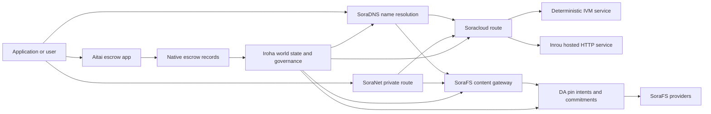

# SORA Nexus שירותים {#sora-nexus-services}

SORA Nexus מוסיף מטוסים שירות פונה אפליקציה סביב Iroha 3. שירותים אלה
הם לא ספרי ספרים נפרדים. Iroha מדינה עולמית, Norito
מסמכים, רשומות של ממשל, ו Torii משפחות מסלול.

זמינות תלויה בבניית הערך ובפרופיל הרשת.
[`/openapi`](/he/reference/torii-endpoints.md#app-and-sora-route-families) על
הערך היעד כרשימה סמכותית של מסלולים פעילים.

## מפה של מרכיבים {#component-map}

| מרכיב              | תפקיד                                                                                                                                        | שטחים מרכזיים                                                                            |
| ---------------------- | ------------------------------------------------------------------------------------------------------------------------------------------- | ---------------------------------------------------------------------------------------- |
| Soracloud              | פיתוח יישומים, שירותים הוגדרים, מודל פרטי / מצב זמן הפעלה, ופיקוח על מחזור החיים של השירות.                                        | `/v1/soracloud/*`, `/api/*`, `iroha app soracloud ...`                                   |
| אינטרו                  | Soracloud מקלט HTTP זמן הפעלה של תיקונים שירותים שדורשים חי HTTP מטוס.                                                            | Soracloud קונפיגציה של זמן ההפעלה, מודעות על יכולת המארח, מצב זמן ההפקה                 |
| SoraNet                | פרטיות ותחבורה על גבי מעגלים, תנועה רלוונטית, VPN, חיבור שלבים, מסלול שידור.                                     | `/v1/connect/*`, `/v1/vpn/*`, SoraNet נתונים מטאטא של מסלול                                     |
| זמינות הנתונים (DA) | ראיות זמינות, מחויבות ושלב כוונה של מטענים שימושיים שנקראים על ידי Nexus כבישים, SoraFS מופגשים, והראיות זורמות. | `/v1/da/*`, `FindDaPinIntent*`, `[sumeragi.da]`                                          |
| SoraFS                 | חומר אחסון עם כתובת תוכן למניפסטים, CAR מטענים מועילים, תוכן מחוברים, קביעות שערות, וזרמים של הוכחה לתאוששות.           | `/v1/sorafs/*`, `/sorafs/*`, `FindSorafsProviderOwner`                                   |
| SoraDNS                | שכבת תיאוריות וסימויים של פתרון עבור: SORA-שירותים ותוכן מאוחזים.                                                   | `/v1/soradns/*`, `/soradns/*`, אירועים של תיבת resolver                                 |
| אייטאי                  | קורדורי פית ושלון נכסים ברמה של אפליקציה, מבוססים על ידי רישומי אבטחה מקומיים, לא על ידי ספרי ספרים נפרדים.                                     | `OpenAssetEscrow`, `FindAssetEscrow*`, `EscrowEventFilter`, Kotodama `escrow_*` מבנים |



## זרמים נפוצים {#common-flows}

### אפליקציה מחולקת מארחת {#hosted-split-application}

אפליקציה טיפוסית של מטוס מעורב משתמשת בכל החלקים ביחד:

1. נכסים סטטיים של הקצה הקדמי נפתחים ונחובשים דרך SoraFS.
2. המארח הציבורי, למשל `<app>.sora`, רשום באמצעות
   SoraDNS.
3. Soracloud מסלולים `/api/v1/search` או `/api/v1/stream` ל-Inrou HTTP
   שירות.
4. Soracloud מסלולים `/api/auth` ו `/api/v1/user` לדיטורמיסטית IVM
   מנהלים.
5. לקוחות שזקוקים לפרטיות יכולים להגיע לאותו תוכן או API דרך
   באמצעות SoraNet מסלול.

| דרך              | מטוס תמיכה         | למה?                                               |
| ----------------- | --------------------- | ------------------------------------------------- |
| `/`               | SoraFS תוכן סטטי | קישור שורש וערוץ של תוכן שניתן לשחזר     |
| `/assets/*`       | SoraFS תוכן סטטי | נכסים וראיות מפורשות      |
| `/api/auth*`      | Soracloud IVM         | מצב האות' והמטבע מאתגר       |
| `/api/v1/user*`   | Soracloud IVM         | מוטציות במדינה רגישות לניהול              |
| `/api/v1/search*` | Soracloud אינטרו       | חיה HTTP שירות, קש, SSE, או המדינה הקולקטורית |

### תוכן פרסום {#content-publication}

SoraFS פרסום מייצר חפצים קבועים לפני שמות מצביעים עליהם:

1. לבנות מטען מועיל או תיק.
2. ארוז את זה לתוך CAR ארכיון ותוכנית חתיכה.
3. לבנות Norito מפרסם עם נתונים של מדיניות פין ושל ממשל.
4. הגיש את המוניסטר Torii.
5. רשום a DA התכוון או ההתחייבות לקיומו כאשר המטרה
   פרופיל דורש ראיות מפורשות.
6. לחבר את המוניפסט ל SoraDNS שם או Soracloud מסלול סטטי של קצה הקדמי.

### מסלול רכיבה פרטית או זרימה {#private-fetch-or-streaming-route}

SoraNet יכול לשבת מול SoraFS או Soracloud:

1. הלקוח פותר את השם או המוניסט.
2. מדריך משמר או מסמן הנתיב בוחר רלי הכניסה והצאת.
3. התנועה ממוטבת ומשלחת דרך SoraNet מסלול.
4. רלוף היציאה מגיע SoraFS שער, Torii זרם, או Soracloud
   מסלול.

## אייטאי {#aitai}

אייטאי הוא SORA מעבר אפליקציות עבור הסדר בסגנון שוק
קונה ומכר מתואמים תשלום מחוץ למשרשרת בזמן Iroha ישנה שליטה
שומרון נכסים על שרשרת. זה צריך להשתמש במשפחה של הוראות אבטחה מקומית
במקום חשבון מאבטח בבעלות חוזה עבור אחזקה חדשה של נכסים מספרים
זורמים.

הבנק המקומי שומר על המשמורת בספר.
`OpenAssetEscrow`, הקונה מקבל ומכריז על תשלום מחוץ למשרשרת:
`AcceptAssetEscrow` ו `MarkEscrowPaymentSent`, והמוכר משחרר
עם `ReleaseAssetEscrow` או מבטל לפני שהשלם מסומן.
אם המוכר לא מסכים, כל צד יכול לפתוח ויכוח
`CanResolveEscrowDispute` יכול לחלק את הסכום המנעול.

עבור מחזור החיים שלם, נעולות נכסים גנטיות, מאבטחה אנונימית, שאלות,
אירועים, ו Rust דוגמאות, ראה
[אסיטום נטיב](/he/blockchain/escrow.md).

| פני השטח Aitai                                                                                                                                                 | השתמשו בו                                                                                |
| ------------------------------------------------------------------------------------------------------------------------------------------------------------- | ----------------------------------------------------------------------------------------- |
| `OpenAssetEscrow`, `AcceptAssetEscrow`, `MarkEscrowPaymentSent`, `ReleaseAssetEscrow`, `CancelAssetEscrow`                                                    | הצעות נכסים מספרים שקופות, כולל XOR- זרמי ההתנחלויות המוגדרים.             |
| `OpenAnonymousAssetEscrow`, `AcceptAnonymousAssetEscrow`, `MarkAnonymousEscrowPaymentSent`, `ReleaseAnonymousAssetEscrow`, `CancelAnonymousAssetEscrow`       | הצעות מוגנות כאשר תנועות המימון והסגירה נעשות על ידי תוספות ראיות. |
| `OpenEscrowDispute`, `ResolveEscrowDispute`, `OpenAnonymousEscrowDispute`, `ResolveAnonymousEscrowDispute`                                                    | פתרון ויכוחים בסגנון בית המשפט.                                                 |
| `FindAssetEscrowById`, `FindAssetEscrowsBySeller`, `FindAssetEscrowsByBuyer`, `FindAssetEscrowsByStatus`                                                      | דפים של מצב האפליקציה, עבודות עידוד וכלי תמיכה.                               |
| `EscrowEventFilter`                                                                                                                                           | חי חי חי חתיכות אבטחה שקופות לפי זהות אבטחה, מוכר, קונה, מעמד או סוג אירוע. |
| Kotodama `escrow_open_offer`, `escrow_accept`, `escrow_mark_payment_sent`, `escrow_release`, `escrow_cancel`, `escrow_open_dispute`, `escrow_resolve_dispute` | Kotodama טלפונים בחוזה V1 סייסקולס.                                 |

לציבור Taira או Minamoto שימוש, עיבוד רכבת התשלום מחוץ לשולש
כל תמיכה או תהליך עבודה של בית המשפט כמדיניות בקשה. Iroha רשום את
מצב החזקה, אירועים במחזור החיים, חשיבות ראיות ותנועה סופית של נכסים;
היא לא מבקשת את ההשלמה הפוטנציאלית בעצמה.

## תבדוק קשר מטרה {#check-a-target-node}

לפני השימוש בדוגמאות מהעמוד הזה, אישר כי המשפחה של המסלול קיימת
על הערך שאתה מכוון:

```bash
export TORII_URL=https://taira.sora.org

curl -fsS "$TORII_URL/openapi.json" \
  | jq '.paths | keys[] | select(test("^/v1/(soracloud|sorafs|soradns|connect|vpn|da)/"))'

curl -fsS "$TORII_URL/status" | jq .
```

אם `/openapi.json` לא חשוף על ידי הפרופיל, נסה `/openapi`. בדיוק.
זמינות המסלול תלויה בתכונות הבנייה ובשינוי הרשת.

### Taira צ'קים לעשן בלבד {#taira-read-only-smoke-checks}

הציבור Taira נקודת הסיום היא שימושית בדיקות בצד קריאה, אך אל תשתמש בה
לדוגמאות של מוטציות, אלא אם כן אתה מנהל חשבון מורשה ו
התכוונתי לשנות את מצב החיים.

```bash
export TORII_URL=https://taira.sora.org

curl -fsS "$TORII_URL/status" \
  | jq '{version: .build.version, peers, blocks, lanes: (.teu_lane_commit | length)}'

curl -fsS "$TORII_URL/v1/connect/status" | jq '{enabled, sessions_active}'

curl -fsS "$TORII_URL/v1/vpn/profile" \
  | jq '{available, relay_endpoint, supported_exit_classes}'

curl -fsS "$TORII_URL/v1/sorafs/storage/state" \
  | jq '{bytes_capacity, bytes_used, pin_queue_depth, por_inflight}'

curl -fsS -H 'Accept: application/json' "$TORII_URL/v1/soracloud/status" \
  | jq '.control_plane | {service_count, services: [.services[] | {service_name, current_version}]}'
```

Taira יכול לחשוף את מסלול המטוסים הבדידים למצבה שאינם
רשום ב- OpenAPI מפת הנתיב. `/openapi` כראשון המיוצר
API חוזה, ולאחר מכן אישר כל מסלול ספציפי לשימוש ישירות לפני
תיעוד את זה חי.

## Soracloud {#soracloud}

Soracloud האם זה SORA מטוס הבקרה של יישום. הוא מעקב על הפעלת
חבילות, תיקונים לשירותים, מסלול, מצב ההפעלה, הגדרת סמכותית
רשומות, סודות שירות מוצפן, רישומי רישום מודלים, פרטי
פגישות ההנחה, וקבלות זמנים.

Soracloud משתמש בשני מטוסים של ביצוע:

| מטוס ההוצאה להורג        | זמן הפעלת | השתמשו בו                                                                                   |
| ---------------------- | ------- | -------------------------------------------------------------------------------------------- |
| `DeterministicService` | `Ivm`   | מחבר, מצב כספת, קריאה מוסמכת, מנהלים קופסאות דואר, מוטציות רגישות לניהול |
| `HttpService`          | `Inrou` | חיה HTTP APIs, עבודה כבדה של אספנים, שירותים בעלים בסיוע מקש, SSE, זרימים בעזרת הדפדפן     |

מטוס הבקרה הוא סמכותי.
פקודות סוד, מודל ומעמד להגיש דרך Torii וקורא מחויב
המדינה העולמית; הם לא מסתמכים על מדינה נפרדת CLI מראה מקומי.
הנתיב מבוסס על קובץ ארוך ביותר, כך שאדם רשום יכול לחלק את התנועה
בין המארחים HTTP מסלולים ודטרמיניסטיים API מסלולים.

### תארג את אפליקציית חלוקה {#scaffold-a-split-app}

הטמפלוט של אפליקציה מחולקת יוצר קצה מקדימה סטטי ועוד אחד הועבר חי API
וטלת דטרמינסטית אחת.API שירות:

```bash
iroha app soracloud app init \
  --template split-app \
  --app-name solswap_indexer \
  --app-version 0.1.0 \
  --public-host solswap-indexer.sora \
  --output-dir ./apps/solswap-indexer

iroha app soracloud app local-plan \
  --manifest ./apps/solswap-indexer/app_manifest.json

iroha app soracloud app doctor \
  --manifest ./apps/solswap-indexer/app_manifest.json
```

`local-plan` מדפס את חלקי הנתיב, מספרי שירות לילדים, שטח עבודה
מסלולים של תסריט, ומצב פרסום מקדימה צפוי. `doctor`
מאשר את חוזה השחרור המקומי לפני שאתה מעורב Torii.

### שימו לב למצב האפליקציה {#deploy-and-inspect-app-state}

```bash
export SORACLOUD_TORII_URL=https://<soracloud-enabled-torii>

iroha app soracloud app deploy \
  --manifest ./apps/solswap-indexer/app_manifest.json \
  --torii-url "$SORACLOUD_TORII_URL"

iroha app soracloud app status \
  --manifest ./apps/solswap-indexer/app_manifest.json \
  --torii-url "$SORACLOUD_TORII_URL"
```

עבור שירות שהוצא כבר, השתמשו בפיקוד של שירות:

```bash
iroha app soracloud status \
  --service-name solswap_indexer_live \
  --torii-url "$SORACLOUD_TORII_URL"

iroha app soracloud rollback \
  --service-name solswap_indexer_live \
  --target-version 0.1.0 \
  --torii-url "$SORACLOUD_TORII_URL"
```

### חומר סודי {#config-and-secret-material}

Soracloud הכניסה הסודית ועיצוב סודי הם חלק מפיתוח סמכותי
מצב. הפעלת, העדכון, ו- rollback נכשלים לסגור כאשר נדרשת הקונפיגציה או
קשרים סודיים חסרים או לא תואמים עם התוכניות הפעילות.

```bash
iroha app soracloud config-set \
  --service-name solswap_indexer_live \
  --config-name indexer/public_config \
  --value-file ./config/public-config.json \
  --torii-url "$SORACLOUD_TORII_URL"

iroha app soracloud secret-set \
  --service-name solswap_indexer_live \
  --secret-name indexer/api_key \
  --secret-file ./secrets/api-key.envelope.json \
  --torii-url "$SORACLOUD_TORII_URL"
```

השתמש ב CLI עזרה עבור דגלי האשראי המדויקים הנדרשים על ידי הפרופיל שלך:

```bash
iroha app soracloud config-set --help
iroha app soracloud secret-set --help
```

## אינטרו {#inrou}

אינטרו היא המארחת. HTTP זמן הפעלה המשמש על ידי Soracloud. א Iroha קשר עם
מעוצבים Soracloud פרויקטים בזמן ההפעלה הודאו Soracloud מדינה לתוך מקומי
תכנית חומרות, מתחילת מיועדת שירות הוסט דפוסי כ-loopback
שירותים, ודיווחים דפוקת תקופת הפעלה בחזרה
מודל.

השתמש באינטרו עבור עומסי עבודה שצריכים חי HTTP פני השטח, כגון
כבדים APIs, SSE זרימים, מעבדים בעלים בסיס מאחז, או
שירותים בסיוע בדפדפן.

### דרישות בזמן ההפעלה {#runtime-requirements}

- זמן הפעלה של מסמן המכולות חייב להיות `Inrou`.
- מטוס ביצוע מוניטין שירות חייב להיות `HttpService`.
- `HttpService + Inrou` דורש בדיוק אחד `PersistentRootLeaseVolume`
  מתוספת ב `/`.
- שירותי Inrou המשכילים גם זקוקים לשירות משותף או ליז סודי
  אחסון כאשר הם שומרים מצב משותף משתנה.
- קווי האוסטינג ייצור צריכים לפרסם יכולת Inrou אמיתית במקום
  פועלת רק כמשותף.

### פרגמנט מפורסם {#manifest-fragment}

הדוגמה למטה מראה את צורת שני המניפסטים.
לא חבילה שלמה.

```jsonc
// container_manifest.json
{
  "schema_version": 1,
  "runtime": { "runtime": "Inrou", "value": null },
  "bundle_path": "/bundles/solswap-indexer.inrou",
  "entrypoint": "/app/bin/launch-indexer.sh",
  "args": [],
  "env": {
    "RUST_LOG": "info",
  },
  "inrou": {
    "schema_version": 1,
    "guest_os": { "guest_os": "DebianSlim", "value": null },
    "guest_images": {
      "x86_64": {
        "kernel_image_path": "/inrou/x86_64/vmlinux",
        "rootfs_image_path": "/inrou/x86_64/rootfs.ext4",
        "initrd_image_path": null,
      },
      "aarch64": {
        "kernel_image_path": "/inrou/aarch64/vmlinux",
        "rootfs_image_path": "/inrou/aarch64/rootfs.ext4",
        "initrd_image_path": null,
      },
    },
  },
  "lifecycle": {
    "start_grace_secs": 60,
    "stop_grace_secs": 30,
    "healthcheck_path": "/api/indexer/v1/health",
  },
}
```

```jsonc
// service_manifest.json
{
  "schema_version": 1,
  "service_name": "solswap_indexer_live",
  "service_version": "0.1.0",
  "execution_plane": { "execution_plane": "HttpService", "value": null },
  "replicas": 2,
  "route": {
    "host": "solswap-indexer.sora",
    "path_prefix": "/api/v1/search",
    "service_port": 8080,
    "visibility": { "visibility": "Public", "value": null },
    "tls_mode": { "tls": "Required", "value": null },
  },
  "lease_volumes": [
    {
      "volume_name": "root_disk",
      "kind": {
        "lease_volume": "PersistentRootLeaseVolume",
        "value": null,
      },
      "storage_class": { "storage_class": "Warm", "value": null },
      "mount_path": "/",
      "max_total_bytes": 8589934592,
    },
    {
      "volume_name": "index_state",
      "kind": { "lease_volume": "ServiceLeaseVolume", "value": null },
      "storage_class": { "storage_class": "Warm", "value": null },
      "mount_path": "/var/lib/solswap-indexer",
      "max_total_bytes": 1073741824,
    },
  ],
}
```

בזמן הפעלת, כל נפח שכר רכישה מותקן נחשף דרך הסביבה
משתנים המוצאים מהשם של הקובץ:

```text
SORACLOUD_LEASE_VOLUME_ROOT_DISK_DIR
SORACLOUD_LEASE_VOLUME_ROOT_DISK_MOUNT_PATH
SORACLOUD_LEASE_VOLUME_INDEX_STATE_DIR
SORACLOUD_LEASE_VOLUME_INDEX_STATE_MOUNT_PATH
```

## SoraNet {#soranet}

SoraNet הוא הפרטיות והתנועה עלות.
מסלולים לתנועה שאינם אמורים להתחבר ישירות לשער היעד
או שירות. העיצוב של התחבורה משתמש בתפקידי רלוף כניסה, ביניים ויציאה,
QUIC תחבורה, מחיצת יד היברידית מבוססת רעש, משא ומתן על יכולות,
נתונים מטאטא של תיקון רלי, ותאי סגורים בגודל קבוע.

ב Nexus הפעלות, SoraNet יכול לשאת תוכן, תנועת שערות,
VPN או מפגשים Connect, ו Norito מסלול זרימה.
סימן מסדרת את התמיכה `norito-stream`, מה שמאפשר ללקוחות להעדיף דרכים
מתאים ל: Torii RPC או שידור תנועה.

### הגדרת הזרם {#streaming-configuration}

ה- Nexus פרופיל מאפשר SoraNet אספקת מסלולי שידור:

```toml
[streaming]
feature_bits = 0b11

[streaming.soranet]
enabled = true
exit_multiaddr = "/dns/torii/udp/9443/quic"
padding_budget_ms = 25
access_kind = "authenticated"
provision_spool_dir = "./storage/streaming/soranet_routes"
provision_spool_max_bytes = 0
provision_window_segments = 4
provision_queue_capacity = 256
```

שימוש `access_kind = "read-only"` עבור מסלולי תוכן שאינם דורשים
אימות הצופה. `authenticated` כאשר רלווי היציאה חייב להפעיל
כרטיסים או זהות הצופה לפני הגשר ל Torii או שירות מקובל.

### SoraNet-יודע. SoraFS תביאו. {#soranet-aware-sorafs-fetch}

ה- SoraFS קבל CLI יכול להזין מוניסט פרוקסי מקומי ו- spool SoraNet
נתונים מטאטא של מסלול להרחיבות הדפדפן או SDK אדפסטורים:

```bash
sorafs_cli fetch \
  --plan artifacts/payload_plan.json \
  --manifest-id 7bb2...9d31 \
  --provider name=alpha,provider-id=9f5c...73aa,base-url=https://gw-alpha.example.org/,stream-token="$(cat alpha.token)" \
  --output artifacts/payload.bin \
  --json-out artifacts/fetch_summary.json \
  --local-proxy-manifest-out artifacts/proxy_manifest.json \
  --local-proxy-mode bridge \
  --local-proxy-norito-spool storage/streaming/soranet_routes \
  --local-proxy-kaigi-spool storage/streaming/soranet_routes \
  --local-proxy-kaigi-policy authenticated \
  --max-peers=2 \
  --retry-budget=4
```

דיווחים של ספקי מסמכים סיכומים, קבלות חתיכות, מטא נתונים מקומיים,
ואת ההגדרות הפועלות של הנתיב שהשתמשו בה.

## זמינות הנתונים (DA) {#data-availability-da}

DA הוא שכבת ראיות זמינות עבור מטענים שימושיים גדולים מדי, גם
רגיש לפרטיות, או יותר מדי ספציפי לשירות כדי להציב ישירות בעולם
הוא רשום מחויבויות דטרמיסטיות וחובות חיפוש כך
מבטיחים, שערים ולקוחות יכולים להסכים על אילו בייטים הובטחו,
איזה מדיניות מתמשכת, ומה הוכחות הושקפו.

DA לא מחליף Kura או SoraFS:

- Kura מאחסן את זרימת הבלוק הסופית ונתונים של התאוששות הסכמה.
- SoraFS חנויות ומשרות בייטים עם כתובת תוכן, CAR מטענים מועילים, ו
  מוניפסטים.
- DA רשום התחייבויות, מדיניות הוכחה, פתיחות הוכחה וכוונות סימן
  שמאפשרים לביט'ים אלה להיות מתוכננים, בודקים ומוחברים בחזרה לספריה
  המדינה.

שימוש DA כאשר בקשה או Nexus ליין זקוקה להבטיח נראית בספר.
הנתונים מחוץ למשרשרת נשארים ניתנים לאסוף. דוגמאות נפוצות כוללות קו
התחייבויות לנטל שימושי עבור זרמי הסדרים, SoraFS כוונות סיסמה לפרסם
תוכן, חבילות ראיות שעליהם לשמור כדי לאמת מאוחר יותר, ו
חפצים יישומים שהמדינה הציבורית שלהם צריכה להיות מעכל ולא
מטען מלא.

### מחזור החיים {#lifecycle}

| שלב      | מה נרשם                                                                                                                                      |
| ---------- | ----------------------------------------------------------------------------------------------------------------------------------------------------- |
| כוונה     | כרטיס, תיקון מפורסם, כינוי, תיקוני קו/עונה/תור, מדיניות שמירה או מטרה לשכפל.                                          |
| התחייבות | ציין את החומר שמקשר את המניפסט, עומס הנתיב, חבילת הוכחות או שורש התוכן לרקוד הנראה בספר.                                    |
| ראיות   | קולות זמינות, פתיחות ראיות, תעודות ספקית או הוכחה אחרת ספציפית לפרופיל שהרשת היעד קיבלה.                         |
| שאלה      | חיפושים במכוון. `FindDaPinIntentByTicket`, `FindDaPinIntentByManifest`, `FindDaPinIntentByAlias`, או `FindDaPinIntentByLaneEpochSequence`. |

טיפוס DA- זרם פרסום תומך הוא:

1. לבנות או לקבל את המטען הפועל מחוץ WSV, לדוגמה, SoraFS CAR
   תיק או Nexus חומר נוח של המסלול.
2. חישוב ותאר את המטען Norito מופע או ספציפי למסלול
   רישום התחייבות.
3. הגיש את ההודעה, כוונה או התחייבות באמצעות `/v1/da/*` כאשר
   משפחת המסלול הזאת מופעלת, או באמצעות רשת החתימה
   מסלול העסקה.
4. תן לאישורנים או לספקי זמינות לאסוף את הראיות הנדרשות
   על ידי מדיניות ההוכחה הפעילה.
5. שאל את כוונת הסיסמה או ההתחייבות המוצאת לפני קידום שם פרופיל,
   הוכחת הסדר, או מסלול שער שתלוי במשקל.

### מודל אלגוריתמי {#algorithmic-model}

DA הופך את המטען הפועל לחוזה חתום, מוגן על ההצגה מחדש ומועדור בבלוק.
האלגוריתמים החשובים הם דטרמיסטיים, כך שהבדיקנים והשערים יכולים
לחשב מחדש את אותם סימנים מאותם בייטים.

1. **קנוניקליז את המטען הפועל שהוצא.** Torii מקבלת בקשה להשתיק
   `(lane_id, epoch, sequence)`, בייטים של עומס תועלת, מטא-מנתונים לחיסול, חתיכה
   גודל, פרופיל למחוק, מדיניות שמירה וחתום של המגיש.
   פוצץ gzip, deflate, או Zstandard עומסים מועילים כאשר נדרש, ואז
   אושר כי אורך הביט הקנוני שווה `total_size`.
2. **תאמינו את פרמטרים המסלול והחלק.** המסלול חייב להיות קיים Nexus
   קטלוג המסלול. `chunk_size` חייב להיות כוח שאינו אפס של שני, לפחות שני
   בייטים, ולא גדולים יותר מקסימום המוגדר.
   לכלול חלקי נתונים ושני חלקי שוויון לפחות.
   תוכנית ההוכחה, או `merkle_sha256` או `kzg_bls12_381`.
3. **ליישם את מדיניות הרשת.** הערך מחייב את ההשפכה המוגדרת
   שורה בסיסית של שמירה עבור כיתת ה-blob. מטא נתונים ציבוריים חייבים להישאר טקסט פשוט;
   נתונים מטאטא-ממשל בלבד מוצפן עם ממשלת הקו המוגדרת של הערך
   מפתח נתונים מטאטא לפני שהוא נכתב במניפסט.
4. **חבורת ותחייב.** המטען הפועל הקנוני הוא חבורת עם גודל קבוע
   פרופיל המוצא `chunk_size`. Torii מחושב את ההזיהוי של המטען הפועל,
   שורש עץ הוכחה לתאוששות, והתחייבויות לפרק.
   לשאת BLAKE3 התחייבויות על בייטים שלהם.
5. **הוסף התחייבות למחוק.** חתיכות הם קבוצתיים בשורות של
   `data_shards`. תאים חסרים ברצועה הסופית הם אפס מכוסה עבור שוויון
   חישוב. RS(16) שוויון יוצר חלקי שורה/שוויון גלובלי; בחופשי
   `row_parity_stripes` הוספת שוויון של קשת בסגנון עמוד במתריכה.
   התחייבויות של חטיבת השוויון הן BLAKE3 צמחים של אנדינים קטנים `u16` סימבלים.
6. **תבנה את המוניפסט.** `DaManifestV1` רשום את המסלול, התקופה, כיתת הבלוב,
   קודק, סימום מטען מועיל, שורש חתיכה, גודל חתיכת, פרופיל למחוק, שמירה
   מדיניות, שכר דירה, מחויבות בחלק, אופציונלית IPA מחויבות, מטא-נתונים,
   טופס האחסון הוא דטרמיניסטי: הערך קודם
   תבנית מופשטת עם כרטיס ריק, ואז כותבת את טביעת האצבע בחזרה
   הסיום `storage_ticket`.
7. **דחוף סכסוכים משקפים.** המפתח לשחזור הוא
   `(lane_id, epoch, sequence, manifest_fingerprint)`. כפול עם
   טביעת אצבע זהה היא אידומטנטית. רצף ישן או אותו רצף עם
   טביעת אצבע שונה נדחה.
8. **שחרר חפצים חתומים.** Torii מחשבים a PDP מחויבות, חותמת
   `DaIngestReceipt`, בונה `DaCommitmentRecord`, והוא כותב חפצים של סגל
   על המבט הנדיר, PDP מחויבות, רישום מחויבות. לוח זמנים של מחויבות
   כוונת סימן, תיק קבלה וזומן קבלה.
   מונוטוני על כל `(lane_id, epoch)`.

רישומים של מחויבות הם מה שבליקים יש.

- מסלול, תקופה וסדר
- פנקס התקשרות ID ו- "האש" מפורסם בקנוני
- תכנית חסינות מסלול
- שורש חתיכה
- בחופשי KZG התחייבות KZG כבישים
- PDP/המחקה הראייה
- שיעור שמירה וכרטיס אחסון
- Torii DA חתימה של הכרה

לפני שהבלוק יתערבב DA רישומים, מסלול ההסדר של הבלוק מאשר את הקופה:

- `(lane_id, epoch, sequence)` חייב להיות ייחודי בתוך החבילה.
- ה-Hashes המפורטים חייבים להיות לא אפס ובינוניים בתוך החבילה.
- תכנית ההוכחה של התחייבות חייבת להתאים למדיניות המסלול המוגדרת.
- קווי מרקל דוחקים KZG התחייבויות; KZG קווי דרכים דורשים רצועה שאינה אפס KZG
  מחויבות.
- כוונות סימנים קנוניקה, מסוגנת ומסנן לפי שדה, ה-הש מופשטת,
  כרטיס אחסון, חשבון הבעלים, ותקנות התנגשות תחת השוואה.

כותרת הבלוק מחזיקה חשיש עבור DA מדיניות הוכחה, מחויבויות ופין
כוונות. עבור הוכחות חברות, קובץ ההתחייבויות חושף גם
שורש אשר העלים שלו הם חשיפים של קאנוניקה Norito-מוצפן
`DaCommitmentRecord` הערכים. קשרים הורי האש את הקונקייטציה של שמאל ו
ילדים ישרים; עץ מוזר מופעל ללא שינוי לכתבה הבאה.

### אימות ראיות {#proof-verification}

`/v1/da/commitments/prove` יכול להפיק הוכחה לקבל מחויבות אחת בלוק.
ההוכחה מכילה את התחייבות, גובה הקלפים, אינדקס בקבוצת, קבוצת
חישוב, אורך קמע, שורש מרקל, ודרך אחים.

1. ה-Hash של חבילה הוכחה תואם את כותרת הבלוק DA מחויבות.
2. הגובה של כביש ההוכחה תואם את ראשי הכביש המתייחס.
3. האינדיקס הוא בקצוות והתחייבויות שווה את הכניסה של הקצבה
   אינדיקס.
4. מדיניות ההגנה על המסלול מקבלת את ההתחייבות.
5. פיתוח את הדרך האחורה מברק ההתחייבויות
   שורש.
6. השורש המוקדם שווה לשורש הקוטב.

זה מוכיח כי מחויבות זמינות ספציפית הייתה כוללת
חבילת תועלת; זה לא מוכיח שכל דפוס הוא כרגע באינטרנט.
ניתן לבדוק את השימוש בנפרד באמצעות SoraFS אספקה של ספקית, PDP/PoTR
בדיקות או ראיות זמינות ספציפיות לפרופיל.

### אינטראקציה של הסכמה {#consensus-interaction}

DA הוא מקובל Sumeragi באמצעות שידור אמין (RBC), אבל זה לא
פרוטוקול סיום שני. RBC מפרירים ומחזירים מטענים מועילים של הצעות:
המציע מכריז על ישיבה `(height, view, payload_hash)`, עמיתים
חתיכות חילופי, ו `READY`/`DELIVER` סימנים מעקב אם יש מספיק מדווחים
צפו באותו מטען.

ב Iroha 3, עמידה נחשבת לנטל הפועל המתמשך של בלוק זמין כאשר:

- בלוק הממתין המקומי מחזיק בייטים של האש לשאח המשפטי הנצפה, או
- RBC השיג מטען שימושי המתאים ל-block hash, גובה, תצפית ו
  חשיש מטען מועיל.

אם אף אחת מהמצבים לא מתאימות, הרשומות של השותפים `missing_local_data`, ממשיך לנסות.
כדי להחזיר את המטען המשפטי דרך RBC או לחסום סינכרון, ולדווח על DA שער ב
הסטטוס והטלמטריה. DA סימנים הם
ייעוץ עבור סופית: בלוק עדיין מסתיים מהסמכות ההתחייבות ועוד
המטען המשמש המקומי המתאים, לא ממטען נפרד DA תעודת קוורום.

DA הזמנים מרחיבים את חלונות השיקום. DA קוורום זמן הוא נגזר
מהבלוק המוגדר וזמני ההתחייבויות, ואז כפולה על
`sumeragi.advanced.da.quorum_timeout_multiplier`. זמן זמינות הוא
`max(quorum_timeout, availability_timeout_floor_ms) * availability_timeout_multiplier`.
לפני שהזמן של זמינות ייגמר, הערך מעדיף התאוששות עומס מועיל
הוא מונע מחזית מוקדמת; לאחר שעלך, התאוששות נורמליות
ניתן להמשיך במסלולים לשינוי התצפית.

### הערות המפעילים {#operator-notes}

Iroha 3 פרופילים של הסכמה כוללים RBC-הפיצה של מטען מועיל, מוניפסט
שומרים, DA אישור חבילה, ו- telemetry השיקום.
חשיבות של תבנית `[sumeragi.da]` גבולות עבור התחייבויות ופתוחות ראיות על
בלוק, ועוד `[sumeragi.advanced.da]` מכפילים של זמן הפסקות עבור קוורום ו
שימו את ההגדרות הללו עקביות בין המאשרים
פרופיל רשת.

כדי לגלות את המסלול, תתחיל עם OpenAPI מסמך:

```bash
curl -fsS "$TORII_URL/openapi.json" \
  | jq '.paths | keys[] | select(startswith("/v1/da/"))'
```

השתמש ב
[רשיון בקשה](/he/reference/queries.md#nexus-data-availability-and-packages)
עבור הזרם DA שמות השאלות, ואת
[דפוס קונפיגורת עמיתים](/he/reference/peer-config/) עבור המקומי
`[sumeragi.da]` כפתורים חשופים על ידי הבניין שלך.

## SoraFS {#sorafs}

SoraFS הוא הרקמה של אחסון מתועדת לאתר.
בייטים לחתיכות דטרמיסטיות, CAR ארכיונים, ו Norito מראה כי
קשור שורשי התוכן, פרופילים של חתיכות, מדיניות פין, ושלטון
תעודות: ספקי אחסון מפרסמים על כושר ותוכן
זמינות, בעוד שערים בודקים מוניסטים וחלק מחויבויות לפני
מספקת תוכן.

טיפוסי SoraFS השימוש כולל נכסי יישום סטטי, תיעוד
מבנים, קבוצות אזורים, דוגמאות או תיאור של חפצים ומוכיחות של ממשל
חבילות. Iroha דגימות של מודל נתונים SoraFS אירועי שער ו
[`FindSorafsProviderOwner`](/he/reference/queries.md#nexus-data-availability-and-packages)
בקשה לפתרון הבעלות על ספק.

### תארג, תכריז, חתום ותגיש {#pack-manifest-sign-and-submit}

```bash
cargo run -p sorafs_car --features cli --bin sorafs_cli -- \
  car pack \
  --input ./dist \
  --car-out artifacts/site.car \
  --plan-out artifacts/site.chunk-plan.json \
  --summary-out artifacts/site.car-summary.json

cargo run -p sorafs_car --features cli --bin sorafs_cli -- \
  manifest build \
  --summary artifacts/site.car-summary.json \
  --manifest-out artifacts/site.manifest.to \
  --manifest-json-out artifacts/site.manifest.json \
  --pin-min-replicas=3 \
  --pin-storage-class=warm \
  --pin-retention-epoch=42

SIGSTORE_ID_TOKEN=$(oidc-client fetch-token) \
cargo run -p sorafs_car --features cli --bin sorafs_cli -- \
  manifest sign \
  --manifest artifacts/site.manifest.to \
  --bundle-out artifacts/site.manifest.bundle.json \
  --signature-out artifacts/site.manifest.sig

cargo run -p sorafs_car --features cli --bin sorafs_cli -- \
  manifest submit \
  --manifest artifacts/site.manifest.to \
  --chunk-plan artifacts/site.chunk-plan.json \
  --torii-url "$TORII_URL" \
  --resolve-submitted-epoch=true \
  --authority=<i105-account-id> \
  --private-key-file ./secrets/authority.ed25519 \
  --summary-out artifacts/site.manifest.submit.json \
  --response-out artifacts/site.manifest.submit.body
```

אם `/v1/sorafs/pin/register` הוא לא נשלח על הערך המטרה, CLI יכולת
לחזור לחתימה. `/transaction` הגיש ולחכות לתרום
מצב הצינור.

### תבדקו ותביאו {#verify-and-fetch}

```bash
cargo run -p sorafs_car --features cli --bin sorafs_cli -- \
  proof verify \
  --manifest artifacts/site.manifest.to \
  --car artifacts/site.car \
  --chunk-plan artifacts/site.chunk-plan.json \
  --summary-out artifacts/site.verify.json

sorafs_cli fetch \
  --plan artifacts/site.chunk-plan.json \
  --manifest-id <manifest-digest-hex> \
  --provider name=primary,provider-id=<provider-id-hex>,base-url=https://gateway.example.org/,stream-token="$(cat provider.token)" \
  --output artifacts/site.fetch.tar \
  --json-out artifacts/site.fetch.json
```

### בדיקות הוכחה של השימוש {#proof-of-retrievability-checks}

המפעילים יכולים לבדוק ולפעול בדיקות ראיות עבור ספקי אחסון:

```bash
sorafs_cli por status \
  --torii-url "$TORII_URL" \
  --manifest <manifest-digest-hex> \
  --status=failed \
  --limit=20

sorafs_cli por trigger \
  --torii-url "$TORII_URL" \
  --manifest <manifest-digest-hex> \
  --provider <provider-id-hex> \
  --reason=latency_probe \
  --samples=48 \
  --auth-token artifacts/challenge_token.to
```

## SoraDNS {#soradns}

SoraDNS הוא שכבת הכינוי הדeterministic עבור SORA שירותים ותוכן.
משגר את שמות, מקושר את עדכונים בתיקון Iroha, ו
מפיץ אזורים חתומים או חבילות פתרון דרך SoraFS. פיתוחים ו
שערות לאמת מסמכים של אישור פתרון לפני שמאמינים גילוי
מטא-מנתונים.

עבור גישה בדפדפן, SoraDNS מוציא את מארגני שער ממערכת רשומה FQDN.
המארח הזולת הרשום נשאר מקור היישום הקנוני, בעוד
פרופילים שערות המוצבים חושפים את הדפדפן ואת Torii מסלולים אחורה עבור זה
מקור.

### טופסים מארח {#host-forms}

| טופס | דוגמה | מטרה |
| --- | --- | --- |
| מקור השטויות | `https://<fqdn>/<path>` | אפליקציה קאנוניקה URL רשום במניפסטים ובנקודות השחרור |
| Taira שער הדפדפן | `https://<fqdn>.mon.taira.sora.net/<path>` | שער דפדפן ציבורי לכינוי זיהוי פעיל |
| Torii מסלול אחורה | `https://taira.sora.org/soradns/<fqdn>/<path>` | Torii מסלול תיקון ותחזור לכינוי כתיב פעיל |
| שער ה-Hash קאנוני | `<base32(blake3(name))>.gw.sora.id` | זהות כניסה דטרמינסטית GAR אימות |

ה- `/soradns/<alias>/...` ההפסקות איננה הציבור המועדף URL.
הכלי, מוניסטים של אפליקציות, ועיצוב קצה הקדמי צריך להעדיף את השטויות
אם שם כינוי אינו פעיל על Taira, שער הדפדפן או
הדרך חזרה יכולה לחזור. `404` או כישלון TLS לפני מסלול היישום
מתחילים.

### מארגני שער מוצא {#derive-gateway-hosts}

```ts
import {
  deriveSoradnsGatewayHosts,
  hostPatternsCoverDerivedHosts,
} from '@iroha/iroha-js'

const derived = deriveSoradnsGatewayHosts('docs.sora')
console.log(derived.canonicalHost)
console.log(derived.prettyHost)

const taira = deriveSoradnsGatewayHosts('solswap-indexer.sora', {
  prettySuffix: 'mon.taira.sora.net',
})
console.log(taira.prettyHost)

const patterns = [
  derived.canonicalHost,
  derived.canonicalWildcard,
  derived.prettyHost,
]
console.log(hostPatternsCoverDerivedHosts(patterns, derived))
```

GAR מטענים מועילים צריכים לכסות את מארח ההש הקנוני, את כרטיס הפראי הקנוני.
ואת המארחת היפה הנבחרת.

### תביא תמונה של תיקון Resolver {#fetch-a-resolver-directory-snapshot}

```bash
curl -i "$TORII_URL/v1/soradns/directory/latest"

soradns_resolver directory fetch \
  --record-url "$TORII_URL/v1/soradns/directory/latest" \
  --directory-url https://gateway.example.org/soradns/directory/latest.car \
  --output ./state/soradns-directory

soradns_resolver rad verify \
  --rad ./state/soradns-directory/rad/resolver-a.norito
```

שערות צריכות לסרב את הספגנים של מסמך אישור הספג
חסרים, גמורים, לא חתומים או לא מעוגנים במספר Merkle האחרון
רוט. ברשת שבה עדיין לא פורסם קובץ פתרון,
`/v1/soradns/directory/latest` יכול לחזור `404` למרות שהדרך היא
אפשרות.

### ציבורי DNS משלחת {#public-dns-delegation}

SoraDNS תוצרת המארח לא מחליפה את האינטרנט הרגיל DNS משלחת.
אם ציבור DNS שם צריך להצביע על SoraDNS שער:

- עבור תת-גופים, לפרסם CNAME למארח היפה הנבחר.
- עבור שמות גבוהים, השתמש ALIAS/ANAME או A/AAAA רישומים לשער כלשהו
  IPs
- שמרו את המארח האש קנוני תחת SoraDNS תחום שער עבור GAR
  בדיקות

## FHE ו UAID {#fhe-and-uaid}

FHE-שטח הקשור זמין ל Nexus שירותים כוללים:

- `iroha_crypto::fhe_bfv` מיישמת דטרמיניסטית BFV תמיכה בסקלה
  הערכת טקסט סיפר.
  `BfvIdentifierPublicParameters` ו `BfvIdentifierCiphertext`, איפה חלל
  0 מאחסן את אורך הביט ההכנסה ומרחיבות מאוחר יותר מאחסן אחד בייט מוצפן
  כל אחד.
- Soracloud מודל של סכמות המדינה והעסקים FHE עומסי עבודה של טקסט סיפר עם
  מערכות פרמטרים ניהוליות, מדיניות ביצוע, טקסט סיפר
  התחייבויות, מעטפות חיפוש וביקשות גילוי מידע.

ה- BFV נתיב מזהה משמש לשימור הפרטיות של ההרשאה.
יכול להגיש מזהה מוצפן Torii המפתר.
הוא מעריך את זה במסגרת מדיניות ההזהה הפעילה, מוצא
`OpaqueAccountId`, ומוציאה קבלה. `ClaimIdentifier` ואז מחבר את זה
קבלה UAID קשור לחשבון היעד.

ה- UAID זהות ויכולת מקננת סביב הזרם הזה.
מודל נתונים, `UniversalAccountId` הוא בעל תמיכה בהש ומועדור כ
`uaid:<hash>`. הפרסורים מקבלים או `uaid:<hash>` או 64-הקס רוטב
מזין. `Account` ו `NewAccount` כולל בחופשי `uaid` ו `opaque_ids`
רישום בזמן ההפעלה מכיל UAID-אינדקס החשבון,
דוחה מזהים חיוורים כפולים או מתנגשים, ודוחה לא-חלופיים
מזהים ללא UAID. בכל פעם ש UAID שינויים מחויבים לחשבון,
runtime מייצג מחדש את קישורים של מספרי הנתונים UAID.

מדריך החלל מונפסטים לתקשר יכולות UAID. א
`AssetPermissionManifest` שמות UAID, מרחב נתונים, פעילות ו
תקופת תוקף אופציונלית, ופרשני הרשות/הסרב מסודרים על ידי חלל נתונים,
תכנית, שיטה, נכס ו AMX הערכה היא הכחשה-ניצחונות: הראשון
איסור התאמה דוחה את הבקשה, אחרת האפשרות האחרונה של התאמה מאפשרת
מועמד נבדק על כל גבול סכום.
ביטול המוניפסטים האלה מוגן על ידי `CanPublishSpaceDirectoryManifest`.

עבור Soracloud FHE המדינה, התכניות המוקדמות הן:

| תכנון                                    | מה הוא שולט בו                                                                                                            |
| ----------------------------------------- | --------------------------------------------------------------------------------------------------------------------------- |
| `SoraStateBindingV1` עם `FheCiphertext` | מצביע כי הערכים תחת מפתח מצב מקודם הם FHE טקסטים מקובעים.                                                          |
| `FheParamSetV1`                           | שמות של הסכמה, האחורי, שרשרת המודולוס, גודל פולינומי, ספירת חללונות, מטרה אבטחה, מחזור חיים וחיזוק פרמטרים.  |
| `FheExecutionPolicyV1`                    | מגבילים את גודל הטקסט הצפוני, גודל טקסט פשוט, ספירת הכניסות/הוצא, עומק ההרכבות, סיבובים, קישורים ומצב הסיבוב. |
| `FheGovernanceBundleV1`                   | זוג פרמטר אחד להגדיר עם מדיניות ביצוע אחת לאישור הכניסה.                                               |
| `FheJobSpecV1`                            | מתארת דטרמיניסטי `Add`, `Multiply`, `RotateLeft`, או `Bootstrap` עבודה על מפתחות המדינה של טקסט סיפריות והתחייבויות.    |
| `CiphertextQuerySpecV1`                   | שאלתות צפנות-טקסט בלבד דווקא על ידי שירות, חיבור, קוד מפתח, גבול תוצאות, רמת מטא נתונים, וראיה לכלול אופציונלית.  |
| `DecryptionRequestV1`                     | מבקש גילוי עבור מחויבות אחת של טקסט סיפרת במסגרת מדיניות סמכות פירוק.                                      |

`FheJobSpecV1::validate_for_execution` בודקים כי העבודה, ביצוע
מדיניות, ופרמטרים הקבועים מסכימים לפני הכניסה.
כללים ספציפיים לפעילות: הוספת ומضاعفة זקוקים לפחות לשני הכניסות, סיבוב
ו-bootstrap צריך בדיוק הכניסות אחת, ואת עומק מבוקש, מספר ההופעה,
ספירת תצוגת התחזית, ספירת הכניסות, בייטים של עומס מועיל וגודל ההוצאת הדeterministic
תוצאות חיפוש טקסט סיפר לא יכולות לחזור
שורות של טקסט פשוט.

UAID זה לא הטקסט הצפוני ולא FHE המדיניות עצמה.
מעגן יכולת החשבון המשמש כדי למצוא את החשבון, מזהה לא ברור
טענות, וקשרים של תיקון חלל שמאשר שירות או שטח נתונים
זרימה. FHE סכמים שולטים על כניסה וביצוע מטען מועיל מוצפן
בנפרד באמצעות קבוצות פרמטרים, מדיניות ביצוע, טקסט סיפר
התחייבויות, ומדיניות של סמכות ההפרה.

רלוונטי Torii פני השטח כוללים:

- `/v1/identifier-policies`
- `/v1/identifiers/resolve`
- `/v1/accounts/{account_id}/identifiers/claim-receipt`
- `/v1/identifiers/receipts/{receipt_hash}`
- `/v1/accounts/{uaid}/portfolio`
- `/v1/space-directory/uaids/{uaid}`
- `/v1/space-directory/uaids/{uaid}/manifests`
- `/v1/soracloud/model/run-private`
- `/v1/soracloud/model/run-private/finalize`
- `/v1/soracloud/model/decrypt-output`

הגבול של הנתונים המטאציוניים הציבוריים הוא מפורש בתכניות: UAID מחייבויות,
רישומי מזהה לא ברורים, מחזור חיים מופלאים, סימנים למפתח המדינה,
גודלים של טקסט סיפר, מחויבות בטקסט סיפרי, שמות מדיניות, קבוצת פרמטרים
גרסאות, פעולות עבודה, מפתחות מצב יצירה, בקשה לגלות
מטא-מנתונים יכולים להיות נראים.
הכניסה והוצאת, ו FHE מפתחות סודיות הן מחוץ לחיקוי ציבורי זה
רשומות.

## רשימת הבדיקה המבצעית {#operational-checklist}

- אישור משפחות שירות מעודדות `/openapi` על המטרה Torii
  עמודה.
- טיפול Soracloud מסמכים של הפעלת, SoraFS מסמכים, SoraDNS פיתור
  רישומי תיבות, SoraNet רישומי תיק המשלוחים, ו DA כוונות סימן או
  התחייבות לקיום זמינות כפריטים רגישים לשליטה.
- השתמשו באותה SORA Nexus פרופיל באופן עקבי בין מדווחים באחד
  רשת.
- שמרו על רוץ Inrou ומוזמים משותפים של השכרה במוניסטים במקום להסתמך
  על מסלולים מקומיים של עמודים.
- שימוש SoraFS אימות ראיות לפני קידום שם שמה של התוכן.
- מעקב SoraNet כשלו של מחזק יד, DA קוורום או זמן זמינות,
  SoraFS סירובים של שער, SoraDNS RAD טריות, ו Soracloud הפעלת
  בריאות.
- לציבור Taira או Minamoto השימוש, להתחיל עם
  [חיבור ל SORA Nexus חלקי נתונים](/he/get-started/sora-nexus-dataspaces.md).

ראו גם:

- [Torii נקודות סוף](/he/reference/torii-endpoints.md)
- [פילטר אירוע נתונים](/he/blockchain/filters.md#data-event-filters)
- [רשיון בקשה](/he/reference/queries.md#nexus-data-availability-and-packages)
