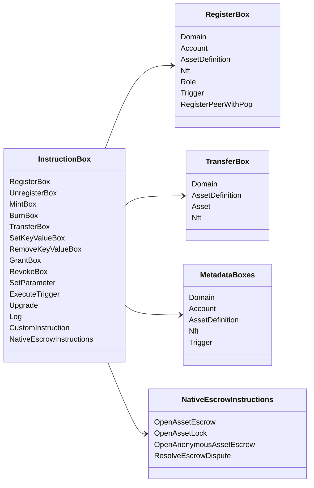

# Iroha הוראות מיוחדות {#iroha-special-instructions}

מודל הנתונים הנוכחי חושף את משפחות ההוראה המובנות הללו:

|הוראות |סוגיות |
| --- | --- |
| [`RegisterBox`](/he/blockchain/instructions.md#un-register) | `Domain`, `Account`, `AssetDefinition`, `Nft`, `Role`, `Trigger`, `RegisterPeerWithPop` |
| [`UnregisterBox`](/he/blockchain/instructions.md#un-register) | `Peer`, `Domain`, `Account`, `AssetDefinition`, `Nft`, `Role`, `Trigger` |
| [`MintBox`](/he/blockchain/instructions.md#mint-burn) |מספר `Asset`, תפעיל חוזרים |
| [`BurnBox`](/he/blockchain/instructions.md#mint-burn) |מספר `Asset`, תפעיל חוזרים |
| [`TransferBox`](/he/blockchain/instructions.md#transfer) |`Domain`, `AssetDefinition`, מספרים `Asset`, `Nft` |
| [`SetKeyValueBox`](/he/blockchain/instructions.md#setkeyvalue-removekeyvalue) | `Domain`, `Account`, `AssetDefinition`, `Nft`, `Trigger` נתונים מטאטא |
| [`RemoveKeyValueBox`](/he/blockchain/instructions.md#setkeyvalue-removekeyvalue) | `Domain`, `Account`, `AssetDefinition`, `Nft`, `Trigger` נתונים מטאטא |
| [`GrantBox`](/he/blockchain/instructions.md#grant-revoke) |`Permission` (`Grant<Permission, Account>`), `Role` (`Grant<RoleId, Account>`), `RolePermission` (`Grant<Permission, Role>`) |
| [`RevokeBox`](/he/blockchain/instructions.md#grant-revoke) |`Permission` (`Revoke<Permission, Account>`), `Role` (`Revoke<RoleId, Account>`), `RolePermission` (`Revoke<Permission, Role>`) |
| [`SetParameter`](/he/blockchain/instructions.md#setparameter) |עדכון הפרמטרים של שרשרת |
| [`ExecuteTrigger`](/he/blockchain/instructions.md#executetrigger) |תפעול ההוצאה .|
| [`Upgrade`](/he/blockchain/instructions.md#other-instructions) |העדכון של מבצע |
| [`Log`](/he/blockchain/instructions.md#other-instructions) |הכניסה ללוג המבצעים |
| [`CustomInstruction`](/he/blockchain/instructions.md#other-instructions) |מטען מועיל ספציפי למבצע JSON |
| [אבטחה של נכסים מקומיים ](/he/blockchain/escrow.md) | `OpenAssetEscrow`, `AcceptAssetEscrow`, `MarkEscrowPaymentSent`, `ReleaseAssetEscrow`, `CancelAssetEscrow`, `OpenEscrowDispute`, `ResolveEscrowDispute` |
| [סגרות נכסים גנריות ](/he/blockchain/escrow.md#generic-asset-locks) |`OpenAssetLock`, `DrawdownAssetLock`, `CancelAssetLock`, `ExpireAssetLock` |
| [אבטחה נכסים אנונימית ](/he/blockchain/escrow.md#anonymous-escrow) | `OpenAnonymousAssetEscrow`, `AcceptAnonymousAssetEscrow`, `MarkAnonymousEscrowPaymentSent`, `ReleaseAnonymousAssetEscrow`, `CancelAnonymousAssetEscrow`, `OpenAnonymousEscrowDispute`, `ResolveAnonymousEscrowDispute` |
| [סליקה פרטית אטומית](/he/blockchain/instructions.md#atomic-private-settlement) | `ActivatePrivateSettlementPoolV1`, `RotatePrivateSettlementPoolPolicyV1`, `FinalizeAtomicPrivateSettlementV1`, `AbortAtomicPrivateSettlementV1` |

מודולים נוספים Iroha 3 עשויים לרשום סוגים של הוראות ספציפיות לתחום באמצעות רישום ההוראות. עבור רשימת רמת התוכנית שנוצרה מעץ המקור הנוכחי, ראה [סכמה מודל הנתונים](./data-model-schema.md).

::: details דיאגרם: הוראות בסיסיות למשפחות

:::
