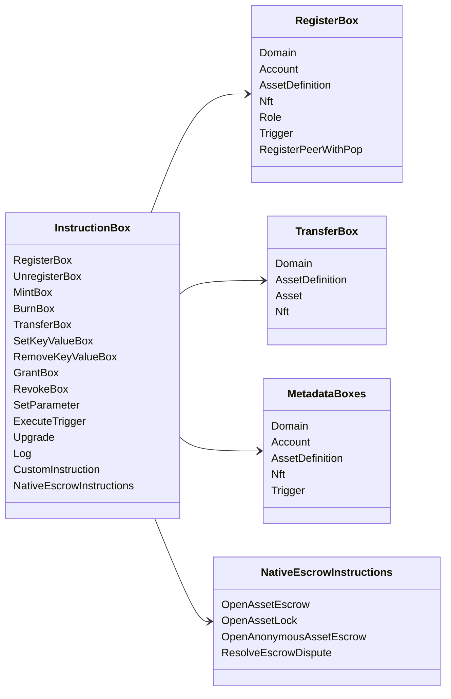

# Iroha הוראות מיוחדות {#iroha-special-instructions}

מודל הנתונים הנוכחי חושף את משפחות ההוראה המובנות הללו:

| הוראות | תופעות |
| --- | --- |
| [`RegisterBox`](/he/blockchain/instructions.md#un-register) | `Domain`, `Account`, `AssetDefinition`, `Nft`, `Role`, `Trigger`, `RegisterPeerWithPop` |
| [`UnregisterBox`](/he/blockchain/instructions.md#un-register) | `Peer`, `Domain`, `Account`, `AssetDefinition`, `Nft`, `Role`, `Trigger` |
| [`MintBox`](/he/blockchain/instructions.md#mint-burn) | מספר `Asset`, תפעול חוזרים |
| [`BurnBox`](/he/blockchain/instructions.md#mint-burn) | מספר `Asset`, תפעול חוזרים |
| [`TransferBox`](/he/blockchain/instructions.md#transfer) | `Domain`, `AssetDefinition`, מספר `Asset`, `Nft` |
| [`SetKeyValueBox`](/he/blockchain/instructions.md#setkeyvalue-removekeyvalue) | `Domain`, `Account`, `AssetDefinition`, `Nft`, `Trigger` נתונים |
| [`RemoveKeyValueBox`](/he/blockchain/instructions.md#setkeyvalue-removekeyvalue) | `Domain`, `Account`, `AssetDefinition`, `Nft`, `Trigger` נתונים |
| [`GrantBox`](/he/blockchain/instructions.md#grant-revoke) | רשות לחשבון, תפקיד לחשבון |
| [`RevokeBox`](/he/blockchain/instructions.md#grant-revoke) | אישור מחשב, תפקיד מחשב, אישור מפקיד |
| [`SetParameter`](/he/blockchain/instructions.md#setparameter) | עדכון פרמטרים של שרשרת |
| [`ExecuteTrigger`](/he/blockchain/instructions.md#executetrigger) | תפעול פעל |
| [`Upgrade`](/he/blockchain/instructions.md#other-instructions) | מעודדת המפעיל |
| [`Log`](/he/blockchain/instructions.md#other-instructions) | הכניסה ללוג המוציא לפועל |
| [`CustomInstruction`](/he/blockchain/instructions.md#other-instructions) | ספציפי למבצע JSON מטען מועיל |
| [מאבטחון נכסים מקומיים](/he/blockchain/escrow.md) | `OpenAssetEscrow`, `AcceptAssetEscrow`, `MarkEscrowPaymentSent`, `ReleaseAssetEscrow`, `CancelAssetEscrow`, `OpenEscrowDispute`, `ResolveEscrowDispute` |
| [סגורות נכסים גנריות](/he/blockchain/escrow.md#generic-asset-locks) | `OpenAssetLock`, `DrawdownAssetLock`, `CancelAssetLock`, `ExpireAssetLock` |
| [אבטחת נכסים אנונימית](/he/blockchain/escrow.md#anonymous-escrow) | `OpenAnonymousAssetEscrow`, `AcceptAnonymousAssetEscrow`, `MarkAnonymousEscrowPaymentSent`, `ReleaseAnonymousAssetEscrow`, `CancelAnonymousAssetEscrow`, `OpenAnonymousEscrowDispute`, `ResolveAnonymousEscrowDispute` |

תוספת Iroha 3 מודולים יכולים לרשום סוגים של הוראות ספציפיות לתחום
באמצעות רישום ההוראות. עבור רשימת רמת התוכנית שנוצרה
עץ המקור הנוכחי, ראה [תוכנית מודל נתונים](./data-model-schema.md).

::: details דיאגרף: הוראות בסיסיות למשפחות

:::
