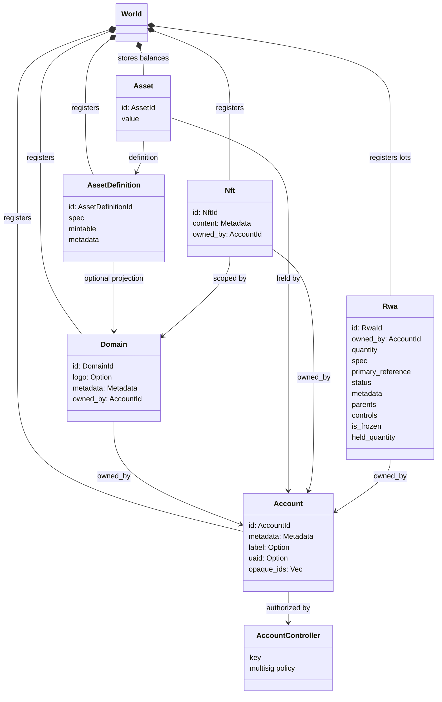
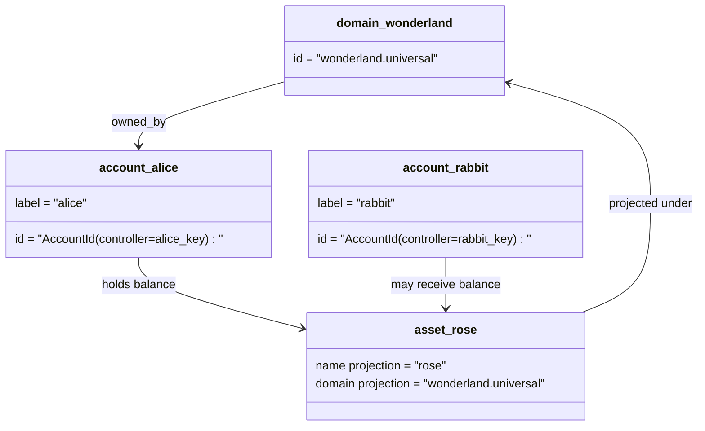

# Տվյալների մոդել {#data-model}

Iroha-ը պահում է գլխավոր գրքի վիճակը `World`: Առաջին թողարկման տվյալների մոդելը օգտագործում է հետեւյալ կանոնիկ ինքնությունները եւ կազմակերպությունները.

- Դոմեյնները տվյալների տարածքի համար նախատեսված են, օրինակ՝ `payments.universal`
- հաշվետվությունները կանոնիկ են եւ չունեն դոմեյն: հաշիվը ID ստացվում է հաշվառման վերահսկողից
- ակտիվների սահմանումները կարող են պահպանել դոմեյն/անունի կանխատեսում, բայց դրանց քանոնիկ տեքստային հասցեն անհապաղ Base58 նույնականացնող է:
- ակտիվները հաշվետվություններ են, որոնք պահվում են հատուկ ակտիվի սահմանման համար:
- NFTs եզակի սեփականություն ունեցող գրանցումներ են, որոնք ունեն տիրույթի որակավորված IDs եւ մետադատա պարունակություն:
- RWAs արտադրվում են ID խմբաքանակներ, որոնք ներկայացնում են շղթայից դուրս գտնվող ակտիվները' ընթացիկ սեփականատերերի, քանակության, ծագման, մետադատայի, պահեստների, սառեցումների եւ կյանքի շրջանի վերահսկողությունների հետ:

## Օրինակ {#example}

Մինչեւ Iroha 3 ցանց, `wonderland.universal` է դոմեյնը ներսում `universal` Տվյալների տարածք. Այս օրինակում կանոնիկ հաշիվները վերահսկվում են իրենց բանալիներով կամ քաղաքականություններով եւ կոդավորվում են որպես դոմեյնային առանց I105 հաշիվ IDs. Կարդալուն մակնիշներ, ինչպիսիք են `alice@wonderland.universal` են առանձին կեղծանուններ, որոնք կապված են այդ IDs. Նախատեսված ակտիվի սահմանումը դեռ կարող է կառուցվել այնպիսի տիրույթի եւ անունից, ինչպիսիք են: `rose` մինետ `wonderland.universal`, մինչդեռ գրաֆիկում օգտագործվող ակտիվի սահմանման կանոնական հասցեն ստեղծված Base58 հասցեն է:

## Անանուններ {#aliases}

Անանունները մարդկային դեմքի անուններ են, որոնք շերտավորվում են կանոնիկ գրառման նույնականացուցիչների վրա: Նրանք օգտակար են API, CLI, դրամապանակի եւ հետազոտողի սահմաններում, բայց կանոնիկ IDs-ը մնում է ստանդարտ նույնականացնողները, որոնք պահվում են խիստ գրառման դաշտերում։

|Նպատակ |Քանոնիկ թիրախ |Ալիեւ բառացի |Աջակցող մոդել |
| -------------- | --------------------------------------------------- | ------------------------------------------------------ | ----------------------------------------------------------------------------- |
|Օգտագործողի հաշիվ |առանց տիրույթի `AccountId` կոդավորված՝ որպես I105 հասցե |`name@domain.dataspace` կամ `name@dataspace` |`AccountAlias`; առաջնային կեղծանունը `Account.label` է, լրացուցիչ կեղծանվանները պարտադիր են: |
|Աշունների սահմանումը|Canonical `AssetDefinitionId` Base58 հասցե |`name#domain.dataspace` կամ `name#dataspace` |`AssetDefinitionAlias` կապված ակտիվի սահմանման հետ |
|Պայմանագիր |Canonical Bech32m `ContractAddress` |`name::domain.dataspace` կամ `name::dataspace` |`ContractAlias` կապված տեղակայված պայմանագրի հասցեի հետ |
|Դոմեյնային անուն |`DomainId` ձեւով `domain.dataspace` |`domain.dataspace` |SNS `domain` անունների տարածության գրանցում |
|Տվյալների տարածքի անունը |թվային `DataSpaceId` ակտիվ Nexus կատալոգից |Տվյալների տարածքի կեղծանուններ, ինչպիսիք են `universal`, `paynet` կամ `zk` |SNS `dataspace` անունների տարածքի արձանագրություն գումարած ակտիվ տվյալների տարածքի կատալոգը |

Հաշվի կեղծանունները օգտատիրոջը ցուցադրվող հաշվի անուններն են։ Դրանք պահպանվում են հաշվի բանալու փոխարինման դեպքում, քանի որ կեղծանունը համաշխարհային վիճակի ինդեքսների և հաշվի բանալու փոխարինման գրառումների միջոցով մատնանշում է ակտիվ հաշվի ID-ն։ Հաշվի հիմնական պիտակի համար օգտագործեք `SetPrimaryAccountAlias`, լրացուցիչ ոչ հիմնական կեղծանունների համար՝ `SetAccountAliasBinding`, իսկ ընթերցման համար՝ `FindAccountByAlias` կամ `FindAliasesByAccountId`։ Հաշվի կեղծանունները սովորաբար պահանջում են SNS հաշվի կեղծանվան ակտիվ վարձակալություն, որը ձեռք է բերվում `AcquireAccountAliasLease`-ով և երկարաձգվում `RenewAccountAliasLease`-ով։

Ակտիվների կեղծանունները անվանում են ակտիվների սահմանումները, ոչ թե առանձին հաշիվների մնացորդները։ Ակտիվների և պայմանագրերի կեղծանունները ընթեռնելի անունը գոյություն ունեցող կանոնական թիրախին կապող ուղղակի կապեր են։ Ակտիվի կեղծանունը սահմանվում է `SetAssetDefinitionAlias`-ով․ կեղծանվան անվան հատվածը պետք է համապատասխանի ակտիվի սահմանման ցուցադրվող կամ նախագծված անվանը։ Պայմանագրի կեղծանունը սահմանվում է `SetContractAlias`-ով․ կեղծանվան տվյալների տարածքը պետք է համապատասխանի պայմանագրի հասցեում կոդավորված տվյալների տարածքին։ Երկու կապերն էլ կարող են պարունակել `lease_expiry_ms`․ ժամկետը լրանալուց և արտոնյալ պատուհանն անցնելուց հետո դրանք այլևս չեն լուծվում և հեռացվում են համաշխարհային վիճակի ինդեքսներից։

Դոմեյնները չունեն առանձին `DomainAlias` օբյեկտ: Դոմեյնի նույնականացողը արդեն տվյալների տարածքի համար որակավորված անուն է, ինչպիսիք են `payments.universal`. SNS-ը հետեւում է տիրույթի անունների վարձակալության սեփականությանը `domain` անվան տարածքում եւ տվյալների տարածության կեղծանունների համար `dataspace` անվան տարածությունում: Պահանջված `universal` տվյալների տարածքի alias- ը պետք է մնում է սահմանված:

## Հարաբերական փաստաթղթեր {#related-docs}

|Նախագիծ |Որտեղ գնալ:|
| -------------------------------------- | ------------------------------------------- |
|Դոմեյններ| [Դոմեյններ](/hy/blockchain/domains.md) |
|հաշիվներ | [Հաշվարկներ](/hy/blockchain/accounts.md) |
|Գործիքներ| [Գործիքներ](/hy/blockchain/assets.md) |
|NFTs | [NFTs](/hy/blockchain/nfts.md) |
|Իրական աշխարհի ակտիվներ | [Իրական աշխարհի ակտիվներ](/hy/blockchain/rwas.md) |
|Մետադատա| [Մետադատա](/hy/blockchain/metadata.md) |
|Գրանցման եւ փոխանցման հրահանգներ | [հրահանգներ](/hy/blockchain/instructions.md) |
|Գործնական ժամանակի թույլտվությունները | [թույլտվություններ](/hy/blockchain/permissions.md) |
|Անունավորման կանոններ | [Անունավորման կանոններ](/hy/reference/naming.md) |
