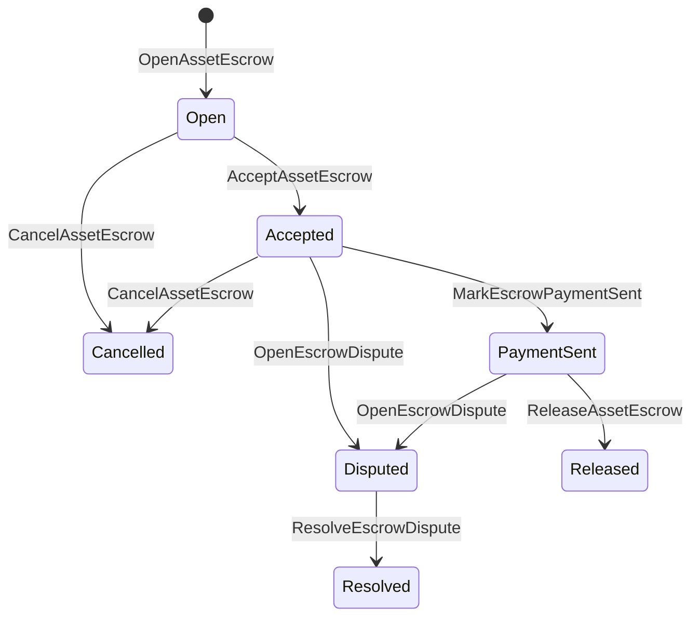

# Բնական ակտիվների վարկավճար {#native-asset-escrow}

Native escrow- ը թվային ակտիվների պահեստավորման մեխանիզմ է, որը կառավարվում է գլխավոր գրասենյակում: Փոխարենը ակտիվները ուղարկելու համար հավելվածի սեփական հաշվին եւ դիմման կոդի վրա հիմնվելով այդ հաշիվը պաշտպանելու համար, escrow ISIs փոխանցում է արժեքը դետերմինիստական արձանագրության պահպանումի հաշիվ եւ գրանցում է escrow կյանքի ցիկլը համաշխարհային վիճակում:

Օգտագործեք ներքին պահպանումներ շուկայական կարգավորման համար, Aitai ոճի արտահոսքային վճարների համակարգում, կարեւորագույն փակիչներ եւ պաշտպանված պահպանումների աշխատանքային հոսքեր, որոնք պահանջում են գլխավոր գրասենյակի տեսանելի կենսաշրջանային վիճակը:

## Գլխավոր գաղափարներ {#concepts}

|Գլխավոր |Նկարագրություն |
| --- | --- |
|`EscrowId` |Հաղորդողի կողմից ընտրված նույնականացողը փակվում է hash- ի մեջ: Այն պետք է լինի եզակի թափանցիկ եւ անանուն պահպանակների միջեւ: |
|`AssetEscrowRecord` |Թվային ակտիվների թափանցիկ պահպանումը կամ փակումը: |
|`AnonymousAssetEscrowRecord` |Պաշտպանված պահպանակային արձանագրություն, որը հաստատվում է չեղյալ հայտարարողների, պարտավորությունների եւ ապացույցների հավելվածներով: |
|Պահպանության հաշիվ |Դիտերմինիստական արձանագրության հաշիվ, որը ստացվել է շղթայից ID, պահպանումից ID եւ ակտիվի սահմանումից: |
|Բացադրիչներ |Բացադրիչները կարող են բացահայտել հաշիվներ, դատավճիռներ, հաղորդագրություններ, պահեստային մանիֆեսներ կամ այլ ապացույցներ դուրս շղթայից: Ապացույցների օգտակար բեռնվածքը չի պահվում գրասենյակում:|

Անցանցիկ արձանագրությունները պարունակում են վաճառողին, ընտրական գնորդին, ակտիվների սահմանումը, ընդհանուր գումարը, պահպանումի հաշիվը, կյանքի շրջանի կարգավիճակը, վարքագծի տեսակը, մնացած գումարը, ընտրական թողարկման լիազորությունը, ընտրական ժամկետն ավարտելու ժամանակային նշանը, ապացույցների շիշերը, ժամանակային նշակները եւ ընտրական լուծումների մանրամասները:

Պահպանման գումարը պետք է լինի դրական թվային ակտիվների քանակությունը եւ պետք է համապատասխանի ակտիվի սահմանման թվային բնութագրին: Քանի դեռ պահպանման կամ փակման գործողություն կա, ընդհանուր ակտիվների փոխանցումները չեն կարող սպառել պահպանումի հաշիվը. պահպանումից դուրս գալու ուղիները ստորեւ նկարագրված են ISIs։

## Շուկայի պահպանումը {#marketplace-escrow}

Շուկայի պահպանումները համակարգում են շղթայական ակտիվների թողարկումը եւ արտաքին վճարման կամ առաքման աշխատանքային հոսքը:



|ISI |Ո՞վ է ներկայացնում այն:|Արդյունք |
| --- | --- | --- |
|`OpenAssetEscrow` |Վաճառող |Փակվում է վաճառողի թվային ակտիվը արձանագրության պահեստում եւ ստեղծվում `Open` շուկայական ռեկորդ: |
|`AcceptAssetEscrow` |Գնորդ |Գնորդը գրանցում է եւ փոխանցում `Open` դեպի `Accepted`. Վաճառողը չի կարող ընդունել իր սեփական գրավականը: |
|`MarkEscrowPaymentSent` |Ընդունված գնորդ |Տեղափոխվում է `Accepted` դեպի `PaymentSent` այն բանից հետո, երբ գնորդը ուղարկում է վճարումը դուրս շղթայից: |
|`ReleaseAssetEscrow` |Վաճառող |Տեղափոխում է `PaymentSent` դեպի `Released` եւ փոխանցում ամբողջ գրավված գումարը գնորդին: |
|`CancelAssetEscrow` |Վաճառող |Տեղափոխում է `Open` կամ `Accepted` դեպի `Cancelled` եւ փոխհատուցում վաճառողին մինչեւ վճարման նշումը: |
|`OpenEscrowDispute` |Վաճառող կամ ընդունված գնորդ |Տեղափոխում է `Accepted` կամ `PaymentSent` դեպի `Disputed` եւ հավելում ապացույցների շիշներ: |
|`ResolveEscrowDispute` |Հաշիվ `CanResolveEscrowDispute` |Տեղափոխում է `Disputed` դեպի `Resolved` եւ բաժանում գումարը գնորդի եւ վաճառողի միջեւ: |

Վեճերի լուծման գումարը պետք է ոչ բացասական լինի, եւ `buyer_amount + seller_amount` պետք է հավասար լինի պահպանումի գումարի: Թույլատրվում են զրոյական արժեք ունեցող ոտքերը, բայց ամբողջ բաժանումը պետք է հաշվի առնի փակված հաշվառումը:

### Rust Օրինակ {#rust-example}

Այս օրինակը ենթադրում է, որ վաճառողի եւ գնորդի հաշիվները արդեն գոյություն ունեն, ակտիվների սահմանումը գրանցվում է որպես թվային, եւ վաճառողը ունի բավարար հավասարակշռություն:

```rust
use iroha::{
    client::Client,
    data_model::{
        isi::escrow::{
            AcceptAssetEscrow, MarkEscrowPaymentSent, OpenAssetEscrow,
            ReleaseAssetEscrow,
        },
        prelude::*,
    },
};
use iroha_crypto::Hash;

fn release_marketplace_escrow(
    seller_client: &Client,
    buyer_client: &Client,
    asset_definition_id: AssetDefinitionId,
) -> eyre::Result<()> {
    let escrow_id = EscrowId::new(Hash::new("docs-marketplace-escrow-001"));

    seller_client.submit_blocking(OpenAssetEscrow::with_evidence_hashes(
        escrow_id,
        asset_definition_id,
        Numeric::from(40_u64),
        vec![Hash::new("invoice:2026-001")],
    ))?;

    buyer_client.submit_blocking(AcceptAssetEscrow::new(escrow_id))?;
    buyer_client.submit_blocking(MarkEscrowPaymentSent::new(escrow_id))?;
    seller_client.submit_blocking(ReleaseAssetEscrow::new(escrow_id))?;

    let record = seller_client.query_single(FindAssetEscrowById::new(escrow_id))?;
    assert_eq!(record.status, AssetEscrowStatus::Released);
    assert_eq!(record.remaining_amount, Numeric::zero());

    Ok(())
}
```

## Գնացական ակտիվների կոճակները {#generic-asset-locks}

Աշունների կողպեքները օգտագործում են նույն պահեստային արձանագրության տեսակը, բայց դրանք չեն գնորդ-վաճառողի առաջարկներ: Նրանք արգելափակում են միջոցները նպատակակետային հաշիվի համար եւ ընտրանքային կերպով պահանջում են առանձին թողարկման մարմին ՝ գումարները հանելու համար:

|ISI |Ո՞վ է ներկայացնում այն:|Արդյունք |
| --- | --- | --- |
|`OpenAssetLock` |Աղբյուրի հաշիվ|Բացառիկ գումարը փակվում է, գրանցում է նպատակակետը որպես ռեկորդային գնորդ եւ կարգավորում `Locked`: |
|`DrawdownAssetLock` |Ազատացման լիազորություն կամ նպատակակետ, երբ ոչ մի ազատման լիազորությունը չի սահմանվել |Մնացած պահապանների մի մասը կամ ամբողջությունը տեղափոխում է նպատակակետ: |
|`CancelAssetLock` |Կոշտացման բացիչը|Անջատում է ակտիվ փակումը եւ վերադարձնում է մնացած գումարը բացողին: |
|`ExpireAssetLock` |Ցանկացած գործարքի իշխանություն ժամկետից հետո |Անցյալում `expires_at_ms` հետ փակված բանալին ավարտվում է եւ մնացած գումարը վերադարձվում է բացողին: |

`DrawdownAssetLock` պահում է արձանագրությունը `Locked`, մինչդեռ որոշակի գումարը մնում է: Երբ մնացած գումարը հասնում է զրոյին, կարգավիճակը դառնում է `DrawnDown` եւ արձանագրությունն փակվում է:

```rust
use iroha::{
    client::Client,
    data_model::{
        isi::escrow::{CancelAssetLock, DrawdownAssetLock, ExpireAssetLock, OpenAssetLock},
        prelude::*,
    },
};
use iroha_crypto::Hash;

fn drawdown_and_close_asset_locks(
    opener_client: &Client,
    destination_client: &Client,
    release_authority_client: &Client,
    asset_definition_id: AssetDefinitionId,
    destination: AccountId,
    release_authority: AccountId,
) -> eyre::Result<()> {
    let trusted_lock_id = EscrowId::new(Hash::new("docs-asset-lock-trusted"));

    opener_client.submit_blocking(OpenAssetLock::with_options(
        trusted_lock_id,
        asset_definition_id.clone(),
        destination.clone(),
        Numeric::from(40_u64),
        Some(release_authority),
        None,
        vec![Hash::new("milestone-plan-v1")],
    ))?;

    release_authority_client.submit_blocking(DrawdownAssetLock::new(
        trusted_lock_id,
        Numeric::from(15_u64),
    ))?;

    let partially_drawn =
        opener_client.query_single(FindAssetEscrowById::new(trusted_lock_id))?;
    assert_eq!(partially_drawn.status, AssetEscrowStatus::Locked);
    assert_eq!(partially_drawn.remaining_amount, Numeric::from(25_u64));

    opener_client.submit_blocking(CancelAssetLock::new(
        trusted_lock_id,
        partially_drawn.remaining_amount.clone(),
    ))?;
    let cancelled = opener_client.query_single(FindAssetEscrowById::new(trusted_lock_id))?;
    assert_eq!(cancelled.status, AssetEscrowStatus::Cancelled);

    let expiring_lock_id = EscrowId::new(Hash::new("docs-asset-lock-expiring"));
    opener_client.submit_blocking(OpenAssetLock::with_options(
        expiring_lock_id,
        asset_definition_id,
        destination,
        Numeric::from(10_u64),
        None,
        Some(0),
        Vec::new(),
    ))?;

    destination_client.submit_blocking(ExpireAssetLock::new(expiring_lock_id))?;
    let expired = opener_client.query_single(FindAssetEscrowById::new(expiring_lock_id))?;
    assert_eq!(expired.status, AssetEscrowStatus::Expired);

    Ok(())
}
```

Python ներկայումս բաց է թողնում բարձր մակարդակի օգնականները գեներիկ փակիչների համար. `open_asset_lock`, `drawdown_asset_lock`, `cancel_asset_lock`, եւ `expire_asset_lock`. Վաճառքի վայրերի եւ անանուն գրավի համար Python, օգտագործման քանոնիկ `InstructionBox` JSON միջով SDK Էս JSON փախուստի խցիկ, կամ անցնել մի SDK որը բացահայտում է առաջին դասի հանձնառուների շինարարներին:

## Վեճեր {#disputes}

Շուկայի պահպանումը կարող է վեճ մուտք գործել `Accepted` կամ `PaymentSent`: Միայն գրանցված վաճառողը կամ գնորդը կարող է բացել վեճը: Որոշումը պահանջում է `CanResolveEscrowDispute`, որը կամ ուղղակիորեն տրվում է լուծողի հաշիվին կամ ժառանգվում է դերի միջոցով:

```rust
use iroha::{
    client::Client,
    data_model::{
        isi::escrow::{OpenEscrowDispute, ResolveEscrowDispute},
        prelude::*,
    },
};
use iroha_crypto::Hash;
use iroha_executor_data_model::permission::escrow::CanResolveEscrowDispute;

fn resolve_disputed_escrow(
    admin_client: &Client,
    buyer_client: &Client,
    court_client: &Client,
    court: AccountId,
    escrow_id: EscrowId,
) -> eyre::Result<()> {
    admin_client.submit_blocking(Grant::account_permission(
        Permission::from(CanResolveEscrowDispute),
        court,
    ))?;

    buyer_client.submit_blocking(OpenEscrowDispute::with_evidence_hashes(
        escrow_id,
        vec![Hash::new("buyer-payment-receipt")],
    ))?;

    court_client.submit_blocking(ResolveEscrowDispute::with_evidence_hashes(
        escrow_id,
        Numeric::from(30_u64),
        Numeric::from(10_u64),
        vec![Hash::new("court-judgement-001")],
    ))?;

    let record = admin_client.query_single(FindAssetEscrowById::new(escrow_id))?;
    assert_eq!(record.status, AssetEscrowStatus::Resolved);
    assert_eq!(
        record.resolution.as_ref().map(|resolution| resolution.buyer_amount.clone()),
        Some(Numeric::from(30_u64)),
    );

    Ok(())
}
```

## Անանուն վարձակալություն {#anonymous-escrow}

Անանուն պահապանը օգտագործում է նույն շուկայական կյանքի ցիկլը, բայց ֆինանսավորման եւ փակման ակտիվների շարժումը պաշտպանված են: Հանրային արձանագրությունը դեռեւս պահում է վաճառողին, գնորդին, կարգավիճակը, ապացույցների հաշեսները, ժամային տպիչները եւ ապացույցների հետ կապված շարժումների արձանագրությունները: Պաշտպանված գրքերի մեջ գտնվող գումարներն ու ստացողները ներկայացվում են պարտավորություններով, չեղյալ հայտարարողների եւ ապացույցների հավելվածներով:

|թափանցիկ ISI |Անանուն ISI |
| --- | --- |
|`OpenAssetEscrow` |`OpenAnonymousAssetEscrow` |
|`AcceptAssetEscrow` |`AcceptAnonymousAssetEscrow` |
|`MarkEscrowPaymentSent` |`MarkAnonymousEscrowPaymentSent` |
|`ReleaseAssetEscrow` |`ReleaseAnonymousAssetEscrow` |
|`CancelAssetEscrow` |`CancelAnonymousAssetEscrow` |
|`OpenEscrowDispute` |`OpenAnonymousEscrowDispute` |
|`ResolveEscrowDispute` |`ResolveAnonymousEscrowDispute` |

Պարապիկ կամ պրով գործիքները պետք է կառուցեն ապացույցի հավելվածը եւ հանրային ներմուծումները: Բացումը ստեղծում է մեկ պահեստային պարտավորություն: Ազատումը, չեղարկումը եւ անանուն վեճերի լուծումը պետք է ծախսեն ճիշտ մեկ պահեստական պարտավորությունը եւ ստեղծեն գնորդին, վաճառողին կամ բաժանել արտադրանքի պարտավորությունները, որոնք պահանջվում են գործողության համար:

```rust
use iroha::{
    client::Client,
    data_model::{
        isi::escrow::{
            AcceptAnonymousAssetEscrow, MarkAnonymousEscrowPaymentSent,
            OpenAnonymousAssetEscrow,
        },
        prelude::*,
        proof::ProofAttachment,
    },
};
use iroha_crypto::Hash;

fn open_anonymous_escrow(
    seller_client: &Client,
    buyer_client: &Client,
    escrow_id: EscrowId,
    asset_definition_id: AssetDefinitionId,
    funding_nullifiers: Vec<[u8; 32]>,
    escrow_commitment: [u8; 32],
    proof: ProofAttachment,
    root_hint: Option<[u8; 32]>,
) -> eyre::Result<()> {
    seller_client.submit_blocking(OpenAnonymousAssetEscrow::with_evidence_hashes(
        escrow_id,
        asset_definition_id,
        funding_nullifiers,
        escrow_commitment,
        proof,
        root_hint,
        vec![Hash::new("shielded-invoice")],
    ))?;

    buyer_client.submit_blocking(AcceptAnonymousAssetEscrow::new(escrow_id))?;
    buyer_client.submit_blocking(MarkAnonymousEscrowPaymentSent::new(escrow_id))?;

    Ok(())
}
```

Հիմնական պաշտպանված գործարքի մոդելի համար տես [ Անանուն գործարքներ ](/hy/blockchain/anonymous-transactions.md):

## SDK Օգտագործում {#sdk-usage}

Հաշվարկային աջակցության ցուցանիշը տարբերվում է SDKs. Rust ունի կանոնիկ տիպված տվյալների մոդելը: Python Ներկայումս բաց է թողնում գեներիկ ակտիվների արգելափակումի օգնականները: JavaScript եւ TypeScript օգտագործումը Kotodama Վարկային հյուրընկալողների զանգերը: Kotlin/JVM եւ Swift ապահովել շուկայական եւ անանուն պահպանումների համար տիպավորված օգտակար բեռներ կառուցողներ:

|SDK |Օգտագործեք այս մակերեսը:|Հասարակություն |
| --- | --- | --- |
| [Rust](#rust-sdk) |`iroha::data_model::isi::escrow` |Շուկայի պահպանումներ, ընդհանուր փակումներ, անանուն պահպանումեր, հարցումներ եւ իրադարձություններ: |
| [Python](#python-asset-locks) |`Instruction.open_asset_lock`, `TransactionDraft.open_asset_lock`, եւ հաճախորդի `*_and_wait` օգնականներ |Գնացական ակտիվների կոճակները. շուկայում եւ անանուն պահպանակային օգնականները դեռեւս առաջին դասի Python մեթոդներ չեն: |
| [JavaScript / TypeScript](#javascript-and-typescript-kotodama) |`compileKotodamaProgram`ից `@iroha/iroha-js/kotodama-compiler` |Kotodama պայմանագրերի ներսում պահպանումների հյուրընկալող զանգեր: |
| [Kotlin / JVM](#kotlin-and-jvm) |`InstructionTemplate` դասերը `org.hyperledger.iroha.sdk.core.model.instructions` |Շուկա եւ անանուն պահպանակի անհատական հրահանգների ձեւանմուշներ: |
| [Swift / iOS](#swift-and-ios) |`NativeEscrowInstructionBuilders` եւ `IrohaSDK.build*Escrow*` օգնականներ |Շուկա եւ անանուն պահպանակ Norito JSON հրահանգների օգտակար բեռնվածքներ: |

Ստորեւ բերված օրինակները կենտրոնանում են հրահանգների կառուցման վրա: Հաշվի ֆինանսավորումը, ստորագրությունների կառավարումը եւ գործարքի ներկայացումը հետեւում են յուրաքանչյուրի համար սովորական հոսքին SDK.

### Rust SDK {#rust-sdk}

Օգտագործեք Rust SDK, երբ ձեզ անհրաժեշտ է լիարժեք ներքին ծածկույթ կամ հարցումներ / իրադարձությունների աջակցություն: Վերոնշյալ օրինակները ցույց են տալիս շուկայում թողարկումը, ընդհանուր փակման դուրսբերումը, վեճերի լուծումը եւ անանուն պահպանումների կառուցումը `iroha::data_model::isi::escrow`:

```rust
use iroha::{
    client::Client,
    data_model::{isi::escrow::OpenAssetEscrow, prelude::*},
};
use iroha_crypto::Hash;

fn open_and_read(
    client: &Client,
    asset_definition_id: AssetDefinitionId,
) -> eyre::Result<AssetEscrowRecord> {
    let escrow_id = EscrowId::new(Hash::new("docs-rust-sdk-escrow"));

    client.submit_blocking(OpenAssetEscrow::new(
        escrow_id,
        asset_definition_id,
        Numeric::from(10_u64),
    ))?;

    client.query_single(FindAssetEscrowById::new(escrow_id))
}
```

### Python Աշունների կողպեքներ {#python-asset-locks}

Python SDK-ը բացահայտում է առաջին դասի օգնականները գեներիկ ակտիվների փակման համար: Օգտագործեք դրանք կարեւորագույն վճարումների, ազատագրման մարմնի կողմից դուրսբերումների, բացողի կողմից չեղարկման եւ ժամկետով վերադարձերի համար:

```python
client.open_asset_lock_and_wait(
    chain_id="dev-chain",
    authority="<source-account-id>",
    private_key_hex="<source-private-key-hex>",
    escrow_id="merchant-lock-001",
    asset_definition_id="<asset-definition-base58>",
    destination="<destination-account-id>",
    amount="2500",
    release_authority="<trusted-release-account-id>",
    expires_at_ms=1_704_000_000_000,
)

client.drawdown_asset_lock_and_wait(
    chain_id="dev-chain",
    authority="<trusted-release-account-id>",
    private_key_hex="<trusted-release-private-key-hex>",
    escrow_id="merchant-lock-001",
    amount="1000",
)

client.expire_asset_lock_and_wait(
    chain_id="dev-chain",
    authority="<any-account-id>",
    private_key_hex="<any-private-key-hex>",
    escrow_id="merchant-lock-001",
)
```

Երկու կողմի փակման դեպքում բաց թողնել `release_authority`; ապա նպատակային հաշիվը կարող է ներկայացնել `drawdown_asset_lock`.

### JavaScript եւ TypeScript Kotodama {#javascript-and-typescript-kotodama}

JavaScript SDK-ը ներկայումս չի բացահայտում անմիջական բնիկ պահպանակային գործարքների ստեղծողներին: JavaScript կամ TypeScript ծրագրերի համար, որոնք տեղադրում են Kotodama պայմանագրեր, կազմեք պահպանակների հյուրընկալող զանգերը Kotodama-ի համալրիչով:

Native escrow հյուրընկալող զանգերը պահանջում են բացասական մուտքի ակնարկներ, քանի որ կոմպիլյատորը չի կարող ստանալ ոչ թափանցիկ escrow ISIs համար ավելի նեղ մուտքի հավաքածուներ: Օգտագործեք արտահանված մուտքային կետերի վրա վայլդքարտի ակնարկեր, որոնք կանչում են `escrow_*` կառուցվածքներ:

```js
import { compileKotodamaProgram } from "@iroha/iroha-js/kotodama-compiler";

const source = `
seiyaku MarketplaceEscrow {
  meta { abi_version: 1; }

  #[access(read="*", write="*")]
  kotoage fn run() permission(Admin) {
    let asset = asset_definition("62Fk4FPcMuLvW5QjDGNF2a4jAmjM");
    let offer = name("aitai_offer");
    let evidence = norito_bytes("00");

    call escrow_open_offer(offer, asset, 10, evidence);
    call escrow_accept(offer);
    call escrow_mark_payment_sent(offer);
    call escrow_release(offer);
  }
}
`;

const compiled = compileKotodamaProgram(source, {
  sourceName: "escrow.ko",
});

if (compiled.diagnostics.length > 0) {
  throw new Error(compiled.diagnostics.map((item) => item.message).join("\n"));
}
```

Վեճերի համար օգտագործեք `escrow_open_dispute(offer, evidence)` եւ `escrow_resolve_dispute(offer, buyer_amount, seller_amount, evidence)`. Անանուն պահպանումների հյուրընկալող զանգերը ընդունում են Norito խնդրանքային բեռի բայթները, օրինակ, `anonymous_escrow_open_offer(request)`.

### Kotlin եւ JVM {#kotlin-and-jvm}

Kotlin/JVM SDK մոդելները բնիկ պահպանում որպես հարմարեցված հրահանգների ձեւանմուշներ: Յուրաքանչյուր ձեւանմունք հաստատում է պահանջվող դաշտերը եւ բացահայտում է գործարքի ստեղծողի կողմից օգտագործվող կանոնական փաստարկների քարտեզը:

```kotlin
import org.hyperledger.iroha.sdk.core.model.escrow.NativeEscrowPermissions
import org.hyperledger.iroha.sdk.core.model.instructions.AcceptAssetEscrowInstruction
import org.hyperledger.iroha.sdk.core.model.instructions.MarkEscrowPaymentSentInstruction
import org.hyperledger.iroha.sdk.core.model.instructions.OpenAssetEscrowInstruction
import org.hyperledger.iroha.sdk.core.model.instructions.ReleaseAssetEscrowInstruction
import org.hyperledger.iroha.sdk.core.model.instructions.ResolveEscrowDisputeInstruction

val open = OpenAssetEscrowInstruction(
    escrowId = "escrow-hash",
    assetDefinition = "xor#wonderland",
    amount = "42.5",
    evidenceHashes = listOf("invoice-hash"),
)
val accept = AcceptAssetEscrowInstruction("escrow-hash")
val paid = MarkEscrowPaymentSentInstruction("escrow-hash")
val release = ReleaseAssetEscrowInstruction("escrow-hash")
val resolve = ResolveEscrowDisputeInstruction(
    escrowId = "escrow-hash",
    buyerAmount = "30",
    sellerAmount = "12.5",
    evidenceHashes = listOf("judgement-hash"),
)

println(open.arguments)
println(NativeEscrowPermissions.CAN_RESOLVE_ESCROW_DISPUTE)
```

Անանուն ձեւանմուշներ հասանելի են որպես `OpenAnonymousAssetEscrowInstruction`, `AcceptAnonymousAssetEscrowInstruction`, `MarkAnonymousEscrowPaymentSentInstruction`, `ReleaseAnonymousAssetEscrowInstruction`, `CancelAnonymousAssetEscrowInstruction`, `OpenAnonymousEscrowDisputeInstruction`, եւ `ResolveAnonymousEscrowDisputeInstruction`. Android Java- ի զանգահարողները կարող են օգտագործել համապատասխանեցումը `NativeEscrowInstructions.*` շինարարներ Android արվեստի գործարք:

### Swift եւ iOS {#swift-and-ios}

Swift SDK կառուցում է գրավման հրահանգները որպես Norito JSON օգտակար բեռնվածքներ: Օգտագործեք `NativeEscrowInstructionBuilders` անմիջապես կամ զանգահարեք հավասար `IrohaSDK.build*Escrow*` օգնականը, երբ ձեր ծրագիրը արդեն ունի `IrohaSDK` օրինակ:

```swift
import IrohaSwift

let open = try NativeEscrowInstructionBuilders.openAssetEscrow(
    escrowId: "escrow-hash",
    assetDefinition: "xor#wonderland",
    amount: "42.5",
    evidenceHashes: ["invoice-hash"]
)
let accept = try NativeEscrowInstructionBuilders.acceptAssetEscrow(
    escrowId: "escrow-hash"
)
let paid = try NativeEscrowInstructionBuilders.markEscrowPaymentSent(
    escrowId: "escrow-hash"
)
let release = try NativeEscrowInstructionBuilders.releaseAssetEscrow(
    escrowId: "escrow-hash"
)
let resolve = try NativeEscrowInstructionBuilders.resolveEscrowDispute(
    escrowId: "escrow-hash",
    buyerAmount: "30",
    sellerAmount: "12.5",
    evidenceHashes: ["judgement-hash"]
)
```

Անանուն Swift ստեղծողները վերցնում են չեղարկիչների ցուցակներ, արտադրանքի պարտավորությունների ցուցակներ, ապացուցման բառարան եւ ընտրանքային `rootHint` արժեքներ: Վեճի լուծման թույլտվության տոմենը հասանելի է որպես `NativeEscrowPermissions.canResolveEscrowDispute`.

## Հարցեր եւ իրադարձություններ {#queries-and-events}

Օգտագործեք պահպանակային հարցումներ վիճակի էջերի, համատեղման աշխատանքների եւ աջակցության գործիքների համար.

|Հարց |Նպատակ |
| --- | --- |
|`FindAssetEscrowById` |Կարդացեք մեկ թափանցիկ պահապան կամ փակեք `EscrowId`. |
|`FindAssetEscrows` |Թողարկեք թափանցիկ պահեստային եւ փակման գրառումները: |
|`FindAssetEscrowsBySeller` |Թողարկեք վաճառողի կամ բանտի բացողի կողմից բացված գրառումները: |
|`FindAssetEscrowsByBuyer` |Ցուցադրել գնորդի կողմից ընդունված շուկայական պահուստները կամ փակել նպատակակետին ուղղված բանալիները: |
|`FindAssetEscrowsByStatus` |`AssetEscrowStatus` հաշվետվությունների ցուցակը: |
|`FindAnonymousAssetEscrowById` |Կարդացեք `EscrowId` կողմից մեկ անանուն պահպանում: |
|`FindAnonymousAssetEscrows*` |Անանուն գրավյալների ցանկը բոլոր գրանցումների, վաճառողի, գնորդի կամ կարգավիճակի համաձայն: |

`EscrowEventFilter` կարող է բաժանորդագրվել թափանցիկ ներքին պահպանումների եւ փակման միջոցառումներին ՝ պահպանումներով ID, վաճառող, գնորդ, կարգավիճակ եւ իրադարձությունների հավաքածու դիմակը: `Opened`, `Accepted`, `PaymentSent`, `Released`, `Cancelled`, `Expired`, `Disputed`, եւ `Resolved`. Անհայտ պահապանների արձանագրությունները ստուգվում են անանուն պահապաների հարցումների միջոցով:

## Գործառական գրառումներ {#operational-notes}

- Պահեք խոշոր հաշիվներ, զրուցային օրագրեր, դատավճիռներ կամ աուդիտների փաթեթներ պահեք վարկային գրառումներից դուրս եւ դրանց հետ միացրեք որպես ապացույց:
- Օգտագործեք հավելվածներում կայուն `EscrowId` ծագումը, այնպես որ կրկնակի փորձերը չեն կարող ստեղծել նույն առաջարկի համար կրկնօրինակ երաշխիքներ:
- Հատկացում `CanResolveEscrowDispute` միայն վեճի ընթացակարգն իրականացնող հաշիվների կամ դերի համար:
- Պահանջվում է հաշվի առնել վճարումների վավերացումը, որը կատարվում է ոչ թե շղթայից դուրս: Iroha արձանագրում է պահպանումների եւ կյանքի շրջանի անցումները. այն ինքնուրույն չի ստուգում ֆիատային կամ արտաքին վճարման ուղիները:
