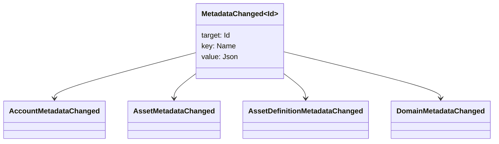

# Մետադատա {#metadata}

Մետադատները հիմնաբառի օբյեկտներին միացված ստուգված առանցքային արժեքի քարտեզն են: Քայլերը `Name` արժեքներն են, իսկ արժեքները JSON (`Json`) օգտակար բեռներ:

Ստորեւ բերված օբյեկտները կարող են պարունակել մեթադատա:

- տիրույթներ
- հաշիվներ
- ակտիվներ
- ակտիվների սահմանումները
- NFTs
- RWAs
- գործարկիչներ
- գործարքներ

Օգտագործեք մետադատա փոքր նկարագրական կամ ինդեքսավորման դաշտերի համար, որոնք պատկանում են գլխավոր գրքի վիճակին: Մեծ օգտակար բեռները պետք է պահվեն WSV-ի սահմաններից դուրս եւ հղում կատարեն URI կամ SoraFS ուղով:

Մետադատների, ակտիվների NFTs, RWAs կամ շղթայից դուրս պահեստավորման ընտրության վերաբերյալ ուղեցույցի համար տես [Մետադատայի եւ Ledger Storage Options](/hy/guide/configure/metadata-and-store-assets.md).

## Փորձեք այն Taira {#try-it-on-taira}

Metadata- ն տեսանելի է սովորական ռեսուրսային ընթերցումների միջոցով: Այս հրամանը ցուցակում է Taira ակտիվների սահմանումները, որոնք ներկայումս ունեն մետադատա:

```bash
curl -fsS 'https://taira.sora.org/v1/assets/definitions?limit=100' \
  | jq '.items[]
    | select((.metadata | length) > 0)
    | {id, name, metadata}'
```

Օգտագործեք նույն ձեւաչափը տիրույթների եւ հաշիվների համար.

```bash
curl -fsS 'https://taira.sora.org/v1/domains?limit=20' \
  | jq '.items[] | select((.metadata // {} | length) > 0)'

curl -fsS 'https://taira.sora.org/v1/accounts?limit=20' \
  | jq '.items[] | select((.metadata // {} | length) > 0)'
```

Բարոյական արդյունքի համար դատարկ արտադրանքը: Դա նշանակում է, որ Taira օբյեկտների ընթացիկ էջը չի պարունակում մեթադատա, ոչ թե այն, որ վերջային կետը ձախողվել է:

## Մետատվյալների թարմացում {#updating-metadata}

Metadata- ն փոխվում է Iroha հատուկ հրահանգներով.

- [`SetKeyValue`](/hy/blockchain/instructions.md#setkeyvalue-removekeyvalue) միացվում է կամ փոխարինում է բանալին
- [`RemoveKeyValue`](/hy/blockchain/instructions.md#setkeyvalue-removekeyvalue) հեռացնում է բանալին

Գործարքը ներկայացնող մարմինը պետք է ունենա ակտիվ վարկային ժամանակով հաստատողի պահանջած թույլտվությունը: Նախնական թույլտվության մակերեսի համար դիտեք [Թույլտվության տոքեր](/hy/reference/permissions.md).

## Միջոցառումներ {#events}

Տվյալների իրադարձությունները արտանետվում են, երբ մետադատները փոխվում են: Գնացական իրադարձության օգտակար բեռը `MetadataChanged<Id>`:



Օգտագործեք [ տվյալների իրադարձությունների ֆիլտրերը ](/hy/blockchain/filters.md#data-event-filters) միայն միավորման համար կարեւորող կազմակերպության տիպի կամ օբյեկտի ID մետադատային իրադարձությունների բաժանորդագրվելու համար:

## Հարցումներ {#queries}

Metadata- ն վերադարձվում է որպես հարցված օբյեկտի մաս: Օրինակ, օգտագործեք [`FindAccountById`](/hy/reference/queries.md#accounts-and-permissions), [`FindDomainById`](/hy/reference/queries.md#domains-and-peers) կամ [`FindAssetDefinitionById`](/hy/reference/queries.md#assets-nfts-and-rwas): Օգտագործեք [`FindNfts`](/hy/reference/queries.md#assets-nfts-and-rwas) կամ [`FindNftsByAccountId`](/hy/reference/queries.md#assets-nfts-and-rwas) NFTs, եւ [`FindRwas`](/hy/reference/queries.md#assets-nfts-and-rwas) RWA խմբերի համար: Այնուհետեւ կարդացեք օբյեկտի մետադատա դաշտը: NFT հարցման պատասխանները բացահայտում են NFT `content` քարտեզը որպես ձայնագրական մետադատա:

Metadata բանալիները մաս են կազմում ledger- ի վիճակի, այնպես որ պահեք դրանք կայուն եւ խուսափեք կոդավորելուց հավելվածի հատուկ տարբերակը churn բանալին անվանումը, երբ JSON արժեքը կարող է ունենալ այդ տարբերակը բացարձակ:
