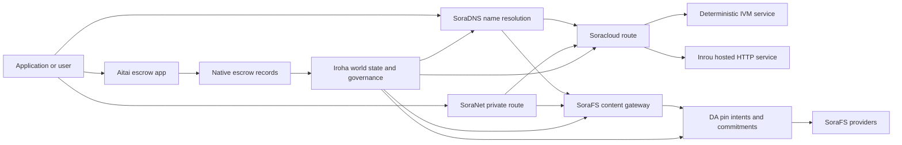

# SORA Nexus Ծառայություններ {#sora-nexus-services}

SORA Nexus-ը Iroha 3-ի շուրջ ավելացնում է հավելվածներին ուղղված սպասարկման շերտեր։ Այս ծառայությունները առանձին մատյաններ չեն։ Դրանք խարսխված են Iroha-ի համաշխարհային վիճակով, Norito մանիֆեստներով, կառավարման գրառումներով և Torii երթուղիների ընտանիքներով։

Գործունակությունը կախված է բջիջների կառուցվածքից եւ ցանցի պրոֆիլից: Օգտագործել [`/openapi.json`](/hy/reference/torii-endpoints.md#app-and-sora-route-families) ստեղծված հավելվածների հայտնաբերման համար:API նպատակային հանգույցի երթուղիները: SoraFS CID եւ հայտնի երթուղիները տեղադրված են ստեղծված փաստաթղթից դուրս, այնպես որ ստուգեք այդ երթուղները անմիջապես տեղակայման ժամանակ:

## բաղադրիչների քարտեզը {#component-map}

|բաղադրիչ |դեր |Հիմնական մակերեւույթներ |
| ---------------------- | ------------------------------------------------------------------------------------------------------------------------------------------- | ---------------------------------------------------------------------------------------- |
|Soracloud |Հավելվածների տեղակայումը, հոսթված ծառայությունները, մասնավոր մոդելը/կիրառման ժամանակը եւ ծառայության կյանքի ցիկլը: |`/v1/soracloud/*`, `/api/*`, `iroha soracloud service ...` |
|Inrou|Soracloud-ի կողմից հյուրընկալվող HTTP գործարկման միջավայր՝ ակտիվ HTTP շերտ պահանջող ծառայության վերանայումների համար։|Soracloud-ի գործարկման միջավայրի կազմաձևում, հոսթի հնարավորությունների հայտարարություններ, կրկնօրինակների գործարկման վիճակ|
|SoraNet |Պrivacy եւ տրանսպորտային overlay շրջանների, ռեալի երթեւեկության, VPN, Connect նստաշրջանները, եւ հոսքուղիների. |`/v1/connect/*`, `/v1/vpn/*`, SoraNet երթուղի մետադատա |
|Տվյալների մատչելիությունը (DA) |Գործունակության ապացույցները, պարտավորությունները եւ շահագործման ծանրաբեռնվածքների նպատակային շերտերը, որոնք հղում են Nexus երթուղիների, SoraFS մանիֆեստների եւ ապացուցման հոսքերի համար: |`/v1/da/*`, `FindDaPinIntent*`, `[nexus.da]` |
|SoraFS |Մանֆիսների, CAR օգտակար բեռնվածքների, փակված բովանդակության, մուտքի ուղեւորների եւ վերականգնման ապացույցի հոսքերի պարունակությամբ հասցեագրված պահեստային կտոր: |`/v1/sorafs/*`, `/sorafs/*`, `FindSorafsProviderOwner` |
|SoraDNS |SORA հյուրընկալված ծառայությունների եւ բովանդակության համար որոշիչ անվանումների եւ լուծման հավատարմագրերի շերտ: |`/v1/soradns/*`, `/soradns/*`, լուծիչի ցուցակային իրադարձություններ |
|Aitai |App- ի մակարդակի ֆիատային եւ ակտիվների կարգավորման միջանցք, որը աջակցվում է տեղական պահպանակային գրառումներով, այլ ոչ թե առանձին գլխավոր հաշվառմամբ: | `OpenAssetEscrow`, `FindAssetEscrow*`, `EscrowEventFilter`, Kotodama `escrow_*` շինություններ |



## Հասարակական հոսքեր {#common-flows}

### Հյուրընկալվող բաժանված հավելված {#hosted-split-application}

Տարբեր շերտեր համադրող սովորական հավելվածը բոլոր բաղադրիչներն օգտագործում է միասին։

1. Static frontend ակտիվները փաթեթավորվում են եւ կոշտացված են SoraFS:
2. Հանրային հյուրընկալողը, օրինակ՝ `<app>.sora`, գրանցվում է SoraDNS հասցեի միջոցով:
3. Soracloud երթուղիներ `/api/v1/search` կամ `/api/v1/stream` դեպի Inrou HTTP ծառայություն:
4. Soracloud երթուղիները `/api/auth` եւ `/api/v1/user`՝ deterministic IVM վարորդներին:
5. Հաճախորդները, ովքեր գաղտնիության կարիք ունեն, կարող են հասնել նույն բովանդակությանը կամ API երթուղին SoraNet շրջանառության միջոցով:

|Ուղի|Հիմքում ընկած շերտ|Ինչու|
| ----------------- | --------------------- | ------------------------------------------------- |
| `/`               |SoraFS ստատիկ պարունակություն |Վերարտադրելի բովանդակության արմատային եւ մուտքային պահեստավորում |
|`/assets/*` |SoraFS ստատիկ պարունակություն |Բովանդակությամբ հասցեագրված ակտիվներ եւ բացահայտ ապացույցներ |
|`/api/auth*` |Soracloud IVM |Կրկնահարձակումներից պաշտպանված նույնականացման և դրամապանակի մարտահրավերի վիճակ |
|`/api/v1/user*` |Soracloud IVM |Կառավարմանը զգայուն վիճակի մուտացիաներ |
|`/api/v1/search*` |Soracloud Inrou |Live HTTP ծառայություն, պահեստային, SSE կամ հավաքող վիճակը |

### Հրապարակման բովանդակություն {#content-publication}

SoraFS հրատարակությունը արտադրում է տեւական արվեստի գործիքներ, նախքան դրանց անվանումը նշվում է.

1. Կառուցեք օգտակար բեռնվածք կամ ցուցակ:
2. Հավաքեք այն CAR արխիվ եւ մասային պլան:
3. Կառուցեք Norito մանիֆես ՝ փաթեթային քաղաքականության եւ կառավարման տվյալներով:
4. Տեղեկագրությունը պետք է ներկայացվի Torii հասցեին:
5. Նշեք DA փաթեթի մտադրությունը կամ մատչելիության պարտավորությունները, երբ նպատակային պրոֆիլը պահանջում է հստակ ապացույցներ:
6. Հաշվետը միացրեք SoraDNS անվանումի կամ Soracloud ստատիկ առաջատար երթուղու վրա:

### Անձնական տրանսպորտ կամ հեռարձակման երթուղի {#private-fetch-or-streaming-route}

SoraNet կարող է նստել SoraFS կամ Soracloud դիմաց.

1. Հաճախորդը լուծում է անունը կամ ցուցակը:
2. Պաշտպանական ցուցակ կամ երթուղի մանիֆեսը ընտրում է մուտքի եւ դուրս գալու ռելեյերը:
3. Ճանապարհային երթեւեկությունը լցվում է եւ ուղարկվում SoraNet շրջանակի միջոցով:
4. Հեռացման ռելեյը հասնում է SoraFS մուտքի դարպասի, Torii հոսքի կամ Soracloud երթուղու:

## Aitai {#aitai}

Aitai-ն SORA հավելվածի միջանցքն է շուկայական կարգավորման համար, որտեղ գնորդը եւ վաճառողը համակարգում են վճարումը առանց շղթայի, մինչդեռ Iroha վերահսկում է շղթայական ակտիվների պահպանումը: Այն պետք է օգտագործի ներկառուցված հանձնարարականների ընտանիքը, փոխարենը պայմանագրային սեփականատերական հանձնարարումային հաշիվը թվային ակտիվների նոր պահպանակային հոսքերի համար:

Native escrow-ը պահում է պահպանումը գլխավոր գրքում: Վաճառողը առաջարկ է բացում `OpenAssetEscrow`, գնորդը ընդունում եւ նշում է վճարումը `AcceptAssetEscrow` եւ `MarkEscrowPaymentSent`, եւ վաճառողը թողնում է `ReleaseAssetEscrow` կամ չեղյալ հայտարարում վճարումը նշելուց առաջ: Եթե գնորդը եւ վաճառողը համաձայն չեն, երկու կողմերը կարող են վեճ բացել, իսկ լուծողը՝ `CanResolveEscrowDispute`-ով, կարող է բաժանել փակված գումարը:

Ամբողջ կյանքի ցիկլը, ընդհանուր ակտիվների փակումը, անանուն պահպանումները, հարցումները, իրադարձությունները եւ Rust օրինակները, տես [Ակտիվների ներկառուցված էսքրո](/hy/blockchain/escrow.md):

|Aitai մակերեսը |Օգտագործեք այն |
| ------------------------------------------------------------------------------------------------------------------------------------------------------------- | ----------------------------------------------------------------------------------------- |
|`OpenAssetEscrow`, `AcceptAssetEscrow`, `MarkEscrowPaymentSent`, `ReleaseAssetEscrow`, `CancelAssetEscrow` |Թվային ակտիվների թափանցիկ առաջարկներ, ներառյալ XOR դոմինալացված հաշվետվությունների հոսքերը: |
|`OpenAnonymousAssetEscrow`, `AcceptAnonymousAssetEscrow`, `MarkAnonymousEscrowPaymentSent`, `ReleaseAnonymousAssetEscrow`, `CancelAnonymousAssetEscrow` |Պաշտպանված առաջարկները ֆինանսավորման եւ փակման շարժումների համար օգտագործում են ապացույցների հավելվածներ: |
|`OpenEscrowDispute`, `ResolveEscrowDispute`, `OpenAnonymousEscrowDispute`, `ResolveAnonymousEscrowDispute` |Բողոքի ակցիան եւ դատական կարգավորումը: |
|`FindAssetEscrowById`, `FindAssetEscrowsBySeller`, `FindAssetEscrowsByBuyer`, `FindAssetEscrowsByStatus` |Հավելվածների վիճակագրության էջեր, համատեղման աշխատանքներ եւ աջակցության գործիքներ: |
|`EscrowEventFilter` |Կայուն թափանցիկ վարկային բաժանորդագրություններ՝ ըստ վարկային ID-ի, վաճառողի, գնորդի, կարգավիճակի կամ միջոցառման տեսակի: |
| Kotodama `escrow_open_offer`, `escrow_accept`, `escrow_mark_payment_sent`, `escrow_release`, `escrow_cancel`, `escrow_open_dispute`, `escrow_resolve_dispute` |Kotodama պայմանագրային զանգեր, որոնք աջակցվում են V1 հանձնառու համակարգերի կողմից: |

Հանրային Taira կամ Minamoto օգտագործման համար դիմումի քաղաքականությունը պետք է դիտարկվի վճարային փաթեթից դուրս եւ ցանկացած աջակցության կամ դատարանի աշխատանքային հոսքի հետ: Iroha արձանագրում է պահպանումների վիճակը, կյանքի շրջանակի իրադարձությունները, ապացույցների քաշը եւ վերջնական ակտիվների շարժումը. այն ինքնուրույն չի ստուգում ֆիատային հաշվետվությունը:

## Ստուգեք թիրախային հանգույցը {#check-a-target-node}

Նախքան այս էջից օրինակներ օգտագործելը, հաստատեք, որ երթուղու ընտանիքը գոյություն ունի թիրախավորվող հանգույցում.

```bash
export TORII_URL=https://taira.sora.org

curl -fsS "$TORII_URL/openapi.json" \
  | jq '.paths | keys[] | select(test("^/v1/(soracloud|sorafs|soradns|connect|vpn|da)/"))'

curl -fsS -H 'Accept: application/json' "$TORII_URL/status" | jq .
```

`/openapi.json` -ը կանոնիկ OpenAPI վերջնական կետն է: Ճիշտ երթուղու հասանելիությունը կախված է կառուցման առանձնահատկություններից եւ ցանցի կազմաձեւումից: Փաստաթղթում չեն թվարկվում հանրային տեղական SoraFS CID եւ հայտնի երթուղիներ. ստուգեք այդ վերջնական կետերը անմիջապես, ինչպես նկարագրվել է ստորեւ։

### Taira Կարդալ միայն ծխախոտի ստուգումներ {#taira-read-only-smoke-checks}

Հասարակական Taira վերջային կետը օգտակար է ընթերցման կողմի ստուգումների համար, բայց մի օգտագործեք այն մուտացիոն օրինակների համար, քանի դեռ դուք չեք վարում թույլատրված հաշիվ եւ մտադիր եք փոխել հանրային թեստնետի վիճակը:

```bash
export TORII_URL=https://taira.sora.org

curl -fsS -H 'Accept: application/json' "$TORII_URL/status" \
  | jq '{version: .build.version, peers, blocks, lanes: (.teu_lane_commit | length)}'

curl -fsS "$TORII_URL/v1/vpn/profile" \
  | jq '{available, relay_endpoint, supported_exit_classes}'

curl -fsS "$TORII_URL/v1/sorafs/storage/peers?limit=4" \
  | jq '{gateway_base_url, pin_torii_urls}'

curl -fsS -H 'Accept: application/json' "$TORII_URL/v1/soracloud/status" \
  | jq '.control_plane | {service_count, services: [.services[] | {service_name, current_version}]}'
```

Taira-ը կարող է տրամադրել տեղակայմանը հատուկ կառավարման շերտի երթուղիներ, որոնք նշված չեն OpenAPI ուղիների քարտեզում։ `/openapi.json`-ը դիտարկեք որպես դրանում ներառված երթուղիների համար ստեղծված պայմանագիր, ապա տեղակայմանը հատուկ և հանրային տեղական SoraFS երթուղիները ստուգեք անմիջապես՝ նախքան դրանք հասանելի փաստագրելը։

## Soracloud {#soracloud}

Soracloud-ը SORA հավելվածների կառավարման շերտն է։ Այն հետևում է տեղակայման փաթեթներին, ծառայությունների վերանայումներին, երթուղավորմանը, գործարկման վիճակին, հեղինակավոր կազմաձևման գրառումներին, գաղտնագրված ծառայության գաղտնիքներին, մոդելների գրանցամատյանի գրառումներին, մասնավոր ինֆերենսի նիստերին և գործարկման միջավայրի ստացականներին։

Soracloud-ն օգտագործում է կատարման երկու շերտ։

|Կատարման շերտ|Գործարկման միջավայր|Օգտագործեք հետևյալի համար|
| ---------------------- | ------- | -------------------------------------------------------------------------------------------- |
|`DeterministicService` |`Ivm` |Նույնականացում, պահոցի վիճակ, հավաստագրված ընթերցումներ, պատվիրված փոստային տուփերի վարորդներ, կառավարման համար զգայուն մուտացիաներ |
|`HttpService` |`Inrou` |Live HTTP APIs, հավաքիչների ծանր աշխատանք, պահեստային աջակցությամբ ծառայություններ, SSE, բրաուզեր-օգնվող հոսքեր |

Կառավարման շերտը հեղինակավոր է։ deploy, upgrade, rollback, config, secret, model և status հրամաններն ուղարկվում են Torii-ի միջոցով և կարդում են հաստատված համաշխարհային վիճակը․ դրանք չեն ապավինում CLI-ի առանձին տեղական հայելուն։ Հանրային երթուղավորումը հիմնված է ամենաերկար նախածանցի վրա, ուստի մեկ գրանցված հոսթը կարող է երթևեկությունը բաժանել հյուրընկալվող HTTP երթուղիների և դետերմինիստական API երթուղիների միջև։

### Պահպանեք բաժանված հավելվածը {#scaffold-a-split-app}

Split-app ձեւանմուշը ստեղծում է ստատիկ frontend գումարած մեկ հյուրընկալված կենդանի API եւ մեկ deterministic vault / API ծառայություն:

```bash
iroha soracloud app init \
  --template split-app \
  --app-name solswap_indexer \
  --app-version 0.1.0 \
  --public-host solswap-indexer.sora \
  --output-dir ./apps/solswap-indexer

iroha soracloud app plan \
  --manifest ./apps/solswap-indexer/app_manifest.json

iroha soracloud app doctor \
  --manifest ./apps/solswap-indexer/app_manifest.json
```

`plan` տպագրում է երթուղու բաժանումը, երեխայի ծառայության մանիֆեսները, աշխատանքային տարածքի սցենարների ուղիները եւ ակնկալվող առաջատար հրապարակման ռեժիմը: `doctor` հավաստիացնում է տեղական թողարկման պայմանագիրը նախքան ձեր ներգրավումը Torii.

### Հավելվածների տեղակայման եւ ստուգման վիճակը {#deploy-and-inspect-app-state}

Վերաօգտագործեք մեկ ապագա SoraFS պահման ժամանակաշրջան թողարկման յուրաքանչյուր կրկնօրինակ փորձի համար: Քանի որ բաժանված հավելվածի ձեւանմուշը պարունակում է Inrou ծառայություն, նախքան առցանց մուտացիան համապատասխանեցրեք ընտրված օֆլեյն մատակարարների խանութներում դրա ճշգրիտ արվեստախաղը.

```bash
export SORACLOUD_TORII_URL=https://<soracloud-enabled-torii>
export SORAFS_RETENTION_EPOCH=<future-unix-seconds>

iroha soracloud app preseed \
  --manifest ./apps/solswap-indexer/app_manifest.json \
  --sorafs-retention-epoch "$SORAFS_RETENTION_EPOCH" \
  --inrou-preseed-target <validator-account,peer-id,absolute-store-path> \
  --inrou-preseed-max-capacity-bytes <bytes> \
  --inrou-preseed-helper /absolute/path/to/sorafs-node \
  --inrou-preseed-helper-sha256 <lowercase-sha256> \
  --receipt-out /absolute/path/to/solswap-inrou-preseed.json

iroha soracloud app release \
  --manifest ./apps/solswap-indexer/app_manifest.json \
  --sorafs-retention-epoch "$SORAFS_RETENTION_EPOCH" \
  --inrou-preseed-receipt /absolute/path/to/solswap-inrou-preseed.json \
  --torii-url "$SORACLOUD_TORII_URL"

iroha soracloud app status \
  --manifest ./apps/solswap-indexer/app_manifest.json \
  --torii-url "$SORACLOUD_TORII_URL"
```

Կրկնեք `--inrou-preseed-target` յուրաքանչյուր մատակարար խանութի համար, որը պահանջվում է տեղակայման քաղաքականությամբ: `release` կառուցում եւ սինխրոնացնում է մանիֆեսները, վարում է հավելվածների բժիշկը, ներկայացնում է մեկ կանոնական  հավելվածի ենթակառուցվածքի մուտացիան, համատեղում է հեղինակային կարգավիճակը եւ ստուգում է հայտարարված կենդանի թիրախները: Նախանշված վոմսաթուղթը ընտրական չէ, երբ հավելվածը պարունակում է Inrou արվեստագետներ:

Արդեն տեղակայված ծառայության համար օգտագործեք սպասարկման չափով հրամաններ.

```bash
iroha soracloud service status \
  --service-name solswap_indexer_live \
  --torii-url "$SORACLOUD_TORII_URL"

iroha soracloud service rollback \
  --service-name solswap_indexer_live \
  --target-version 0.1.0 \
  --torii-url "$SORACLOUD_TORII_URL"
```

### Գաղտնի եւ գաղտնի նյութեր {#config-and-secret-material}

Soracloud-ի կազմաձևման և գաղտնիքների գրառումները տեղակայման հեղինակավոր վիճակի մաս են։ Տեղակայումը, թարմացումը և հետարկումը անվտանգորեն արգելափակվում են, եթե պահանջվող կազմաձևման կամ գաղտնիքի կապակցումները բացակայում են կամ չեն համապատասխանում ակտիվ մանիֆեստներին։

```bash
iroha soracloud service config-set \
  --service-name solswap_indexer_live \
  --config-name indexer/public_config \
  --value-file ./config/public-config.json \
  --torii-url "$SORACLOUD_TORII_URL"

iroha soracloud service secret-set \
  --service-name solswap_indexer_live \
  --secret-name indexer/api_key \
  --secret-file ./secrets/api-key.envelope.json \
  --torii-url "$SORACLOUD_TORII_URL"
```

Օգտագործեք CLI օգնությունը ձեր պրոֆիլը պահանջող հավատարմագրերի ճշգրիտ դրոշների համար.

```bash
iroha soracloud service config-set --help
iroha soracloud service secret-set --help
```

## Inrou {#inrou}

Inrou- ը հյուրընկալված HTTP վազման ժամանակն է, որը օգտագործվում է Soracloud կողմից: Iroha հանգույց ՝ ներկառուցված Soracloud վազման ժամանակը նախագծերի հետ, որոնք ընդունվել են Soracloud վիճակում տեղական նյութավորման ծրագիրը, սկսում է հյուրընկալվող ծառայության պատճենները որպես loopback ծառայություններ, եւ զեկույցներ կրկնօրինակել վազման ժամանակի վիճակը վերադառնալ հեղինակավոր մոդելը.

Օգտագործեք Inrou- ը աշխատանքային բեռների համար, որոնք պահանջում են կենդանի HTTP մակերես, ինչպիսիք են կոլեկտոր ծանր APIs, SSE հոսքերը, պահեստային աջակցություն ունեցող կառավարիչները կամ զննարկչի օգնությամբ ծառայությունները:

### Գործընթացային ժամկետի պահանջներ {#runtime-requirements}

- Կոնտեյների մանիֆեստի գործարկման ժամկետը պետք է լինի `Inrou`.
- Ծառայության մանիֆեստի կատարման շերտը պետք է լինի `HttpService`։
- `HttpService + Inrou` պահանջում է ճշգրիտ մեկին `PersistentRootLeaseVolume`, որը տեղադրված է `/`:
- Inrou ծառայությունների կրկնօրինակման համար անհրաժեշտ է նաեւ կիսված ծառայություն կամ գաղտնի վարձակալության պահեստավորում, երբ դրանք պահպանում են փոխվող համատեղ վիճակը:
- Արտադրանքի հոսթինգի հանգույցները պետք է գովազդեն իրական Inrou- ի կարողությունները, այլ ոչ թե միայն որպես պրոքսի:

### Մանիֆեստի հատված {#manifest-fragment}

Ստորեւ բերված օրինակը ցույց է տալիս երկու մանիֆեսների ձեւը: Դա կտտություն է, այլ ոչ թե ամբողջական տեղակայման փաթեթ:

```jsonc
// container_manifest.json
{
  "schema_version": 1,
  "runtime": { "runtime": "Inrou", "value": null },
  "bundle_path": "/bundles/solswap-indexer.inrou",
  "entrypoint": "/app/bin/launch-indexer.sh",
  "args": [],
  "env": {
    "RUST_LOG": "info",
  },
  "inrou": {
    "schema_version": 1,
    "guest_os": { "guest_os": "DebianSlim", "value": null },
    "guest_images": {
      "x86_64": {
        "kernel_image_path": "/inrou/x86_64/vmlinux",
        "rootfs_image_path": "/inrou/x86_64/rootfs.ext4",
        "initrd_image_path": null,
      },
      "aarch64": {
        "kernel_image_path": "/inrou/aarch64/vmlinux",
        "rootfs_image_path": "/inrou/aarch64/rootfs.ext4",
        "initrd_image_path": null,
      },
    },
  },
  "lifecycle": {
    "start_grace_secs": 60,
    "stop_grace_secs": 30,
    "healthcheck_path": "/api/indexer/v1/health",
  },
}
```

```jsonc
// service_manifest.json
{
  "schema_version": 1,
  "service_name": "solswap_indexer_live",
  "service_version": "0.1.0",
  "execution_plane": { "execution_plane": "HttpService", "value": null },
  "replicas": 2,
  "route": {
    "host": "solswap-indexer.sora",
    "path_prefix": "/api/v1/search",
    "service_port": 8080,
    "visibility": { "visibility": "Public", "value": null },
    "tls_mode": { "tls": "Required", "value": null },
  },
  "lease_volumes": [
    {
      "volume_name": "root_disk",
      "kind": {
        "lease_volume": "PersistentRootLeaseVolume",
        "value": null,
      },
      "storage_class": { "storage_class": "Warm", "value": null },
      "mount_path": "/",
      "max_total_bytes": 8589934592,
    },
    {
      "volume_name": "index_state",
      "kind": { "lease_volume": "ServiceLeaseVolume", "value": null },
      "storage_class": { "storage_class": "Warm", "value": null },
      "mount_path": "/var/lib/solswap-indexer",
      "max_total_bytes": 1073741824,
    },
  ],
}
```

Գործնական ժամանակ, յուրաքանչյուր տեղադրված վարձակալության ծավալը բացատրվում է ծավալի անվանումից ստացված միջավայրային փոփոխականների միջոցով.

```text
SORACLOUD_LEASE_VOLUME_ROOT_DISK_DIR
SORACLOUD_LEASE_VOLUME_ROOT_DISK_MOUNT_PATH
SORACLOUD_LEASE_VOLUME_INDEX_STATE_DIR
SORACLOUD_LEASE_VOLUME_INDEX_STATE_MOUNT_PATH
```

## SoraNet {#soranet}

SoraNet -ը գաղտնիության եւ տրանսպորտային ծածկույթն է: Այն ապահովում է փոխանցման վրա հիմնված երթուղիներ երթեւեկության համար, որոնք չպետք է ուղղակիորեն կապվեն նպատակային մուտքի կամ ծառայության հետ: Տրանսպորտային նախագիծը օգտագործում է մուտքի, միջին եւ ելքային ռելեյի դերակատարություններ, QUIC տրանսպորտ, աղմուկային հիբրիդային ձեռքսեղմում, հնարավորությունների բանակցություններ, ռելեի ցուցահանդեսների մետադատա եւ ֆիքսված չափերի փոշոտված բջիջներ:

Մինչեւ Nexus տեղակայում, SoraNet կարող է բովանդակության բեռնել, մուտքային երթեւեկություն, VPN կամ Connect նստաշրջանները, եւ Norito Streaming երթուղիներ. Directory մուտքագրերը կարող են նշանավորել Relays, որ աջակցում `norito-stream`, որը թույլ է տալիս հաճախորդներին նախընտրել ուղիներ, որոնք հարմար են Torii RPC կամ հոսող երթեւեկություն:

### Սթրիմինգի կարգավորումը {#streaming-configuration}

Nexus պրոֆիլը հնարավորություն է տալիս SoraNet տրամադրել հոսքային երթեւեկության համար.

```toml
[streaming]
feature_bits = 0b11

[streaming.soranet]
enabled = true
exit_multiaddr = "/dns/torii/udp/9443/quic"
padding_budget_ms = 25
access_kind = "authenticated"
provision_spool_dir = "./storage/streaming/soranet_routes"
provision_spool_max_bytes = 0
provision_window_segments = 4
provision_queue_capacity = 256
```

Օգտագործեք `access_kind = "read-only"` բովանդակության երթուղիների համար, որոնք չեն պահանջում դիտորդի հավատարմագրումը: Օգտագործիր `authenticated`, երբ ելքային ռեալիը պետք է ուժի մեջ դնի տոմսերը կամ դիտորդի ինքնությունը, նախքան կապվելը Torii կամ հյուրընկալվող ծառայություն:

### SoraNet-Գիտակցված SoraFS Գտնել {#soranet-aware-sorafs-fetch}

Գլխավոր էջ SoraFS բեռնել CLI կարող է թողարկել տեղական proxy manifest եւ spool SoraNet բրաուզերային ընդլայնումների երթեւեկության մետադատա կամ SDK ադապտերներ, նվագավորիչ JSON պետք է սահմանել `local_proxy` հետ `"emit_browser_manifest": true`, եւ CLI պետք է կառուցված լինի `local-quic-proxy` աջակցություն: Taira, ստուգել ընդունված մատակարարների կատալոգը հանրային փորձարկման ցանցի արմատի վրա, այնուհետեւ լրացնել այդ մատակարարին տրամադրված պաշտպանված մատակարարի տուփը.

```bash
export TAIRA_ROOT=https://taira.sora.org
curl -fsS "$TAIRA_ROOT/v1/sorafs/providers?limit=20" | jq '.providers'

: "${TAIRA_SORAFS_PROVIDER_ID:?set the admitted provider ID from Taira discovery}"
: "${TAIRA_SORAFS_GATEWAY_KEY:?set the provider gateway key}"
: "${TAIRA_SORAFS_PROVIDER_URL:?set the advertised provider base URL}"
: "${TAIRA_SORAFS_STREAM_TOKEN_FILE:?set the issued stream-token file}"

cargo run -p sorafs_orchestrator --features=local-quic-proxy --bin=sorafs_cli -- \
  fetch \
  --plan=artifacts/payload_plan.json \
  --manifest-id=<manifest-digest-hex> \
  --orchestrator-config=artifacts/orchestrator.json \
  --provider=name=taira,provider-id="$TAIRA_SORAFS_PROVIDER_ID",gateway-key="$TAIRA_SORAFS_GATEWAY_KEY",base-url="$TAIRA_SORAFS_PROVIDER_URL",stream-token="$(cat "$TAIRA_SORAFS_STREAM_TOKEN_FILE")" \
  --output=artifacts/payload.bin \
  --json-out=artifacts/fetch_summary.json \
  --local-proxy-manifest-out=artifacts/proxy_manifest.json \
  --local-proxy-mode=bridge \
  --local-proxy-norito-spool=storage/streaming/soranet_routes \
  --local-proxy-kaigi-spool=storage/streaming/soranet_routes \
  --local-proxy-kaigi-policy=authenticated \
  --max-peers=2 \
  --retry-budget=4
```

Ամփոփագրության մատակարարի զեկույցները, բաժնետոմսերի ստացումները, տեղական պրոկսի մետադատաները եւ ներգրավման համար օգտագործված արդյունավետ երթուղու կարգավորումները:

### Relay-ի խրախուսման ստուգողների ցանկը {#relay-incentive-verifier-roster}

Relay խրախուսման ընդունումը փակվում է: Եթե `incentives.enable` ճիշտ է, `incentives.trusted_verifier_ids`-ը պետք է պարունակում է առնվազն մեկ կանոնական հաշիվ ID: Գրանցումը չպետք է Չափազանցում է 64 մուտքը, նույնիսկ այն ժամանակ, երբ խրախուսումները անջատված են: Runtime- ը պահպանում է այն որպես դետերմինիստիկ կարգավորված հավաքածու եւ մերժում է անվավեր ցուցակի երկրաչափությունը ռելեյի սկիզբավորման ընթացքում:

Յուրաքանչյուր `RelayBandwidthProofV1` կոդավորվում է ֆիքսված շրջանակի/բաշխման բյուջեի հիման վրա եւ պետք է սպառի ամբողջական շրջանակը: ապացույցի ստուգիչ հաշիվը պետք է լինի կազմված ցուցակում, եւ `RelayBandwidthProofV1::verify_signature()`-ն պետք է հաջողվի, նախքան ռելեյը փակում է կամ փոխում է իր կատարողականի կուտակիչը: Անհավատալի ստորագրող կամ ստորագրության անվավեր/խեղդված ապացույցը, հետեւաբար, ոչ մի չափման մեջ չի ներգրավվում եւ չի կարող խրախուսական ակնթարթություն ստեղծել:

## Տվյալների մատչելիությունը (DA) {#data-availability-da}

DA -ը հասանելիության ապացույցների շերտ է այն օգտակար բեռերի համար, որոնք չափազանց մեծ են, չափազանց զգայուն են գաղտնիության նկատմամբ կամ չափազանց հատուկ ծառայությունների համար, որպեսզի կարողանան ուղղակիորեն տեղակայվել համաշխարհային վիճակում: Այն արձանագրում է դետերմինիստական պարտավորությունները եւ վերականգնման պարտավորությունները, որպեսզի վավերացողները, մուտք գործիչները եւ հաճախորդները կարողանան համաձայնվել այն մասին, թե որ բայտներ են խոստացել, որ քաղաքականություն է կիրառվում, եւ որ ապացույցներն են դիտարկվել։

DA-ը չի փոխարինում Kura կամ SoraFS:

- Kura պահում է վերջնականացված բլոկային հոսքի եւ համաձայնության վերականգնման տվյալները:
- SoraFS պահում եւ սպասարկում է բովանդակությամբ հասցեագրված բայթներ, CAR օգտակար ծանրաբեռնվածքներ եւ մանիֆեստներ:
- DA արձանագրում է պարտավորությունները, ապացույցների քաղաքականությունը, ապացույցի բացումները եւ պին մտադրությունները, որոնք թույլ են տալիս այդ բայթներին պլանավորել, վերլուծել եւ կապել գրքի վիճակի հետ:

Օգտագործեք DA, երբ հավելվածի կամ Nexus երթուղու համար անհրաժեշտ է հաշվառման տեսանելի խոստում, որ շղթայից դուրս տվյալները մնում են վերականգնվող: Հաճախակի օրինակներ ներառում են երթուղի օգտակար բեռնվածության պարտավորությունները կարգավորման հոսքերի համար, SoraFS փաթեթային մտադրություններ հրապարակված բովանդակության համար. ապացույցների փաթեթներ, որոնք պետք է պահվեն հետագա ստուգման համար, եւ կիրառման արվեստի գործիքներ, որոնց հանրային վիճակը պետք է լինի ամբողջական բեռնվածքի փոխարեն:

### Կյանքի ցիկլ {#lifecycle}

|Դասընթաց |Ինչ է արձանագրվում|
| ---------- | ----------------------------------------------------------------------------------------------------------------------------------------------------- |
|Նպատակ |Տոմս, մատչելի հղում, կեղծանուն, երթուղի / ժամանակաշրջանի / հաջորդականության հղում, պահեստավորման քաղաքականություն կամ կրկնօրինակման նպատակ: |
|Հանձնառություն |Digest նյութը, որը կապում է manifesto- ի, երթուղի օգտակար բեռը, ապացուցման փաթեթ, կամ բովանդակության արմատը ledger տեսանելի արձանագրություն. |
|ապացույցներ |Գործունակության քվեներ, ապացույցների բացություններ, մատակարարների վկայականներ կամ այլ պրոֆիլային հատուկ փաստաթղթեր, որոնք ընդունվել են նպատակային ցանցի կողմից: |
|Հարցում |Պին մտադրության որոնումները `FindDaPinIntentByTicket`, `FindDaPinIntentByManifest`, `FindDaPinIntentByAlias` կամ `FindDaPinIntentByLaneEpochSequence`: |

Տիպիկ DA աջակցությամբ հրապարակման հոսքը հետեւյալն է.

1. Կառուցեք կամ ստացեք օգնական բեռը WSV-ից դուրս, օրինակ՝ SoraFS CAR ֆայլ կամ Nexus ճամբարային օգնական բեռն.
2. Հիշեք եւ նկարագրեք օգնական բեռը Norito մանիֆեստում կամ երթուղային հատուկ պարտավորությունների գրանցման մեջ:
3. Մանֆիսը, պին մտադրությունը կամ պարտավորությունը ներկայացրեք `/v1/da/*` միջոցով, երբ այդ երթուղային ընտանիքը ակտիվացված է, կամ ցանցի ստորագրված գործարքի ուղու միջոցով:
4. Թույլ տվեք վավերացնողներին կամ մատչելիության մատակարարներին հավաքել ակտիվ ապացույցի քաղաքականությամբ պահանջվող ապացույցները:
5. Կատարեք հարցում ստացվող փաթեթի մտադրությունը կամ պարտավորությունը նախքան կեղծանունը, վճարման ապացույցը կամ մուտքի ուղին առաջացնելը, որը կախված է օգնական բեռնվածությունից:

### Ալգորիթմիկ մոդել {#algorithmic-model}

DA փոխակերպում է օգտակար բեռը ստորագրված, կրկնում-պաշտպանված, բլոկի ինդեքսացված պարտավորություն: Կարեւոր ալգորիթմները որոշիչ են, այնպես որ հավաստիացնողներն ու մուտքերը կարող են նույն դիջեստերը վերաքննել նույն բայթներից.

1. Torii ընդունում է ներբեռնումի խնդրանք, որը պարունակում է `(lane_id, epoch, sequence)`, օգտակար բեռնվածության բայտներ, կոճման մետադատա, մասերի չափը, ջնջման պրոֆիլը, պահպանումի քաղաքականությունը եւ ուղարկողի ստորագրությունը: Նոդը պահանջելիս կոմպրեսում է gzip, deflate կամ Zstandard օգտակար բեռնվածքները, այնուհետեւ ստուգում է, որ կանոնական բայթ երկարությունը հավասար է `total_size`:
2. Հաստատեք ուղու և chunk-ի պարամետրերը։ Ուղին պետք է գոյություն ունենա Nexus-ի ուղիների կատալոգում։ `chunk_size`-ը պետք է լինի երկուսի ոչ զրոյական աստիճան, առնվազն երկու byte և ոչ ավելի մեծ, քան կանխասահմանված առավելագույնը։ Erasure profile-ը պետք է ներառի data shard-եր և առնվազն երկու parity shard։ Ուղիների կատալոգը ընտրում է ապացույցի սխեման՝ `merkle_sha256` կամ `kzg_bls12_381`։
3. Կիրառեք ցանցի քաղաքականություն: Նոդը պարտադրում է բլոբ դասի համար ձեւակերպված կրկնապատկման եւ պահեստավորման հիմնարար գիծը: Հանրային մետադատները պետք է մնան պարզ տեքստով. միայն կառավարման մեթադատները գաղտնագրվում են նոդի կարգավորվող կառավարման մետադատվական կոճակով, նախքան դրանք գրվել են մանիֆեսում:
4. **Բաժանել chunk-երի և ստեղծել commitment-ներ։** Կանոնիկ payload-ը բաժանվում է `chunk_size`-ից ստացված ֆիքսված չափի պրոֆիլով։ Torii-ն հաշվարկում է payload digest-ը, proof-of-retrievability tree root-ը և յուրաքանչյուր chunk-ի commitment-ը։ Data chunk-երը իրենց բայթերի համար կրում են BLAKE3 commitment-ներ։
5. Բաժանները խմբագրվում են `data_shards` գծերի մեջ: Վերջնական գիծում բացակայող բջիջները զրոյական են զուգահեռության հաշվարկի համար: RS(16) զուգահեռնություն ստեղծում է գծի/գլոբալ զուգահեռության հատվածներ. ընտրանքային `row_parity_stripes` ավելացրեք սյունակի ոճի ժողերի զուգահեռնություն ամբողջ մատrix- ում: Զուգահեռական հատվածների commitment-ները little-endian `u16` նշանների BLAKE3 digest-ներ են:
6. Կառուցեք մանիֆիսը: `DaManifestV1` գրում է երթուղին, ժամանակահատվածը, բլոբ դասը, կոդեկը, օգտակար բեռի դիժեստը, մասերի արմատը, մասի չափը, ջնջման պրոֆիլը, պահպանումի քաղաքականությունը, վարձակալության գինը, մասի պարտավորությունները, ընտրական IPA պարտավորությունը, մետադատաները եւ թողարկման ժամանակը: Պահեստավորման տոմսը դետերմինիստիկ է. բջիջը նախ բաց տոմսով էշավորում է մանիֆեստի ձեւանմուշը, այնուհետեւ գրում է այդ մատնահետքը որպես վերջնական `storage_ticket`։
7. Թույլ տվեք կրկնօրինակել հակամարտությունները. կրկնապատկման բանալին `(lane_id, epoch, sequence, manifest_fingerprint)` է: Նույն մատնահետք ունեցող կրկնօրինակը անկայուն է: Թույլատրվում է թարմացված հաջորդականություն կամ նույն հաջորդականությունը, որն ունի այլ մատնահատակ.
8. Torii հաշվարկում է PDP պարտավորությունը, ստորագրում `DaIngestReceipt`, կառուցում `DaCommitmentRecord` եւ գրում մանիֆեստի համար սցենարային արվեստագետներ: PDP պարտավորություն, պարտավորության արձանագրությունը, պարտավորությունների ժամանակացույցը, գրիչի մտադրությունը, գրավման ֆայլը եւ գրավման օրագիրը: Գրանցման կուրսորը առաջ է շարժվում միանգամայն յուրաքանչյուր `(lane_id, epoch)` համար:

Հանձնառության արձանագրությունները այն են, ինչ բլոկները կրում են:

- գոտի, ժամանակաշրջանի եւ հաջորդականության
- Caller blob ID եւ կանոնիկ manifest hash
- երթուղային ապացուցման ծրագիր
- կոտրված արմատ
- KZG երթուղիների համար նախընտրական KZG պարտավորություն
- PDP/անվտանգության մատակարար
- պահեստավորման դաս եւ պահպանման տոմս
- Torii DA հաստատման ստորագրություն

Նախքան բլոկը ներմուծում է DA գրառումները, բլոկի հավաքման ուղին հաստատում է փաթեթը.

- `(lane_id, epoch, sequence)` պետք է յուրահատուկ լինի փաթեթի ներսում:
- Բացահայտված շիշերը պետք է լինեն ոչ զրոյական եւ յուրահատուկ փաթեթի մեջ:
- Հանձնառության ապացուցման ծրագիրը պետք է համապատասխանի սահմանված երթուղի քաղաքականությանը:
- Merkle-ի երթուղիները մերժում են KZG պարտավորությունները, իսկ KZG երթուղիների համար անհրաժեշտ է ոչ զրոյական KZG պարտավորություն:
- Pin մտադրությունները կանոնիկացվում են, դասակարգվում եւ ֆիլտրվում են երթուղի, manifest hash, պահեստային տոմս, սեփականատերերի հաշիվ եւ alias-հանդիպման կանոններով:

Բլոկի գլուխը պահպանում է DA ապացույցի քաղաքականությունների, պարտավորությունների եւ փաթեթավորման մտադրությունների հեշեր: Անդամության ապացույցների համար, պարտավորության փաթեթն նաեւ բացահայտում է Merkle արմատ, որի տերեւները կանոնիկ Norito կոդավորված `DaCommitmentRecord` արժեքների շիշեր են: Ծնողական բջիջները շիշում են ձախ եւ աջ երեխաների համակցվածությունը. զարմանալի թերթը անփոփոխ առաջադրվում է հաջորդ շերտին:

### ապացույցների ստուգում {#proof-verification}

`/v1/da/commitments/prove` կարող է ապացույց ներկայացնել մեկ պարտավորության համար բլոկում: Ապացույցը պարունակում է պարտավորությունը, բլոկի բարձրությունը, ինդեքսը փաթեթի մեջ, փաթեթային շիշը, փոթեթի երկարությունը, Merkle արմատը եւ եղբայրական ուղին: Փորձարկումները ստուգում են.

1. Ապացուցման փաթեթը համընկնում է բլոկի գլխարկի DA պարտավորությունների հետ:
2. Ապացուցման բլոկի բարձրությունը համապատասխանում է հղում կատարված բլոկային գլխավորագրին:
3. Հաշվարկային ցուցանիշը սահմաններում է, եւ պարտավորությունը հավասար է այդ ցուցանիշի փաթեթի մուտքի:
4. Ուղու ապացույցի քաղաքականությունը ընդունում է commitment-ը։
5. Հանձնառության տերեւից եղբայրական ուղին փակելը վերականգնում է մատակարարված արմատը:
6. Վերակառուցված արմատը հավասար է խմբաքանակի արմատին:

Սա ապացուցում է, որ կոնկրետ բլոկի օգտակար լիցքավորման մեջ ներառվել է հատուկ մատչելիության պարտավորություն. դա չի ապացուցել, որ յուրաքանչյուր կրկնօրինակ ներկայումս առցանց է: Live- ի վերականգնման հնարավորությունը ստուգվում է առանձին SoraFS մատակարարների հետաքննությամբ, PDP/PoTR ստուգումներով կամ պրոֆիլային առկաության ապացույցներով:

### Համաձայնության փոխազդեցություն {#consensus-interaction}

Համաձայնության օգտակար բեռի հասանելիությունը պարտադիր է, բայց դա երկրորդ վերջնականության արձանագրություն չէ: Գլխավորը ստորագրված `PayloadManifest` հաղորդում է ամբողջական `3f + 1` կոմիտեին: Առաջին մարմինը եւ RS16 մասի առաջադրանքի նպատակները Set A-ն են, որի `2f + 1` անդամների թվում են առաջնորդը եւ պրոքսի ականջը: Նույն տեսանկյունից սահմանափակ կրկնօրինակումով ընդլայնվում է մարմնի եւ մասի ծառայությունը ամբողջ կոմիտեի համար:

Պարզ կամ մասնակի կտորների հավաքածուն բավարար չէ քվեարկելու համար: Նախքան Prepare- ը, յուրաքանչյուր վավերացնող պետք է հավաստիացնի կտորները, վերակառուցի ամբողջական կանոնիկ մարմինը, ստուգի դրա երկարությունը, chunk root, եւ մարմնի hash, մնում է այդ մարմինը, եւ ավարտել deterministic բլոկը հավաստիացում: Validator պահպանում է ճշգրիտ մարմինը միջոցով CommitQC դիմում կամ վկայակոչված վերականգնման.

Երբ հանգույցները սովորում են վկայական, նախքան մարմինը ձեռք բերելը, նրանք առաջին հերթին պահանջում են հավատարմագրված կտորներ կամ քանոնիկ մարմին վկայականի ստորագրողներից, ապա ընդլայնում են վերադարձը սառեցված կոմիտեի: Յուրաքանչյուր պատասխան մնում է կապված ճշգրիտ բարձրության համատեքստին, առաջարկի շրջանառությանը, manifesto- ին եւ մարմնի առարկային: Բլոկը կիրառվում է միայն այն բանից հետո, երբ տեղական վերակառուցված մարմինը համապատասխանում է վկայագրին:

### Օպերատորի գրառումները {#operator-notes}

Iroha 3 կոնսենսուսային պրոֆիլները միշտ ներառում են ստորագրված մանիֆես եւ RS16 օգտակար բեռի տարածումը, ամբողջ մարմինը նախքան պատրաստելը հաստատումը, DA փաթեթի հավաստումը եւ սահմանափակ վերականգնման հեռաչափը: Կազմակերպման եւ արձանագրության սահմանները սառեցված են ստորագրված բարձրության համատեքստում: Չկա տեղական շեղիչ կամ ժամանակային պրոֆիլ, որը կարող է դրանք անջատել կամ վերապրել: Նոդ-տեղական բլոկը եւ հերթի սահմանները դեռ պետք է համապատասխանան տեղադրման ստորագրված դասակարգմանը եւ աշխատանքային ծանրաբեռնվածությանը:

Ճանապարհային հայտնաբերման համար սկսեք բջիջի OpenAPI փաստաթղթից.

```bash
curl -fsS "$TORII_URL/openapi.json" \
  | jq '.paths | keys[] | select(startswith("/v1/da/"))'
```

Օգտագործեք [հարցման հղում](/hy/reference/queries.md#nexus-data-availability-and-packages) հոսքի համար DA հարցման անունները, եւ [հանգույցների կարգավորման ձեւանմուշ](/hy/reference/peer-config/) դիմման մակարդակի համար `[nexus.da]` ներմուծման, նմուշների հավաքման, աուդիտի եւ վերականգնման սահմանները գումարած տեղական Sumeragi բլոկի եւ հերթի սահմանափակումներ:

## SoraFS {#sorafs}

SoraFS -ը բովանդակության վրա հասցեագրված ապակենտրոնացված պահեստային կտոր է: Այն փաթեթավորում է բայտները դետերմինիստիկ մասերի, CAR արխիվների եւ Norito մանիֆեսների մեջ, որոնք կապում են բովանդակության արմատները. խանութային մատակարարները գովազդում են հզորության եւ բովանդակության հասանելիության մասին, մինչդեռ մուտք գործիչները ստուգում են մանիֆեսներն ու խանութի պարտավորությունները նախքան բովանդակությունը մատուցելը։

Տիպիկ SoraFS օգտագործումները ներառում են ստատիկ ծրագրային ակտիվներ, փաստաթղթերի կառուցվածք, գոտի փաթեթներ, մոդել կամ արվեստի գործիքների հղումներ եւ կառավարման ապացույցների փաթետներ: Iroha տվյալների մոդելը բացահայտում է SoraFS մուտքի իրադարձությունները եւ մատակարարների սեփականության լուծման համար [`FindSorafsProviderOwner`](/hy/reference/queries.md#nexus-data-availability-and-packages) հարցումը:

### Taira Թեստնետի պրոֆիլ {#taira-testnet-profile}

Taira է կանոնական հանրությունը SoraFS փորձարկման ցանց: Նրա ստուգված հավաստիացնող պրոֆիլը օգտագործում է շղթա `fc56984b-2be7-431d-840e-21514d1883f0` եւ շղթայական խտրական `369`. Գլխավոր էջ `NetworkId` ներքեւում է ճշգրիտ ինքնությունը հոսքի pinned Taira գեներեսը Taira reset կարող է փոխել, որ hash պահպանելով շղթայի նշանը, այնպես որ թարմացնել այն ներկա ստորագրված տեղակայման պրոֆիլից եւ երբեք չստեղծեք այն շղթայից UUID. Taira արդյունավետ է SoraFS կարգավորումները հետեւյալն են.

- ցանց ID: `hash:82531CE8EAE8BFF6BEECA4698BFD13A3BC8BEC5F0EE0D23D428C97FC17AB0F3B#3E94`
- մուտքի շտեմարան URL: `https://taira.sora.org`
- փաթեթ Torii URLs: `https://taira-validator-1.sora.org` մինչեւ `https://taira-validator-4.sora.org`
- հայտնաբերման ունակությունները. `torii_gateway`, `chunk_range_fetch` եւ `potr_mldsa`
- մեկուսացված բովանդակության ծագում. `https://{cid}.sorafs.taira.sora.org/{path}`
- հանրային փաթեթային քաղաքականություն. առանց թույլտվության եւ վճարովի նպատակակետով, `require_council_signatures = false`

```toml
[sorafs.storage]
enabled = false
max_capacity_bytes = 13743895347

[sorafs.discovery]
discovery_enabled = true
known_capabilities = ["torii_gateway", "chunk_range_fetch", "potr_mldsa"]

[sorafs.discovery.admission]
envelopes_dir = "configs/soranexus/taira/sorafs_admission"
trusted_council_keys = ["REPLACE_WITH_TAIRA_SORAFS_COUNCIL_PUBLIC_KEY"]
signature_threshold = "REPLACE_WITH_TAIRA_SORAFS_COUNCIL_SIGNATURE_THRESHOLD"

[sorafs.discovery.publish]
gateway_base_url = "https://taira.sora.org"
pin_torii_urls = [
  "https://taira-validator-1.sora.org",
  "https://taira-validator-2.sora.org",
  "https://taira-validator-3.sora.org",
  "https://taira-validator-4.sora.org",
]

[sorafs.gateway]
require_manifest_envelope = true
enforce_admission = true
enforce_capabilities = true

[sorafs.gateway.untrusted_hosting]
enabled = true
path_gateway_redirect = true
redirect_html_only = true

[sorafs.gateway.untrusted_hosting.cid_host_suffixes]
live = "sorafs.sora.org"
taira = "sorafs.taira.sora.org"

[sorafs.repair]
enabled = false
claim_ttl_secs = 900
heartbeat_interval_secs = 60
max_attempts = 3
worker_concurrency = 4

[sorafs.gc]
enabled = false
interval_secs = 900
max_deletions_per_run = 500
retention_grace_secs = 86400

[gov.sorafs_pin_policy]
require_council_signatures = false
```

Բարձրագույն մակարդակի երեք գեյթվեյի արժեքները ժառանգված են բացակայությամբ փակված անսահմանափակումների համար: Գլխավոր հատվածի բոլոր մնացած արժեքները հստակ են Taira- ի գրանցված պրոֆիլում: Օպերատորը պետք է փոխարինի հայտնաբերման ընդունման տեղակալները ստորագրված տեղակայման նյութով: Յուրաքանչյուր ուղարկված խնդրանք պետք է ունենա բաց փոստ, անցնի մատակարարների ընդունումը եւ օգտագործի գովազդային հնարավորությունը:

Taira վավերացողները ներկառուցել են SoraFS պահեստավորման, վերանորոգման եւ թափոնների հավաքման անջատված: Նրանց կոմֆիգուրացված հզորությունը մնում է վավերացողի մի մասը: Դիսք-բյուջեի ստուգում. դա չի նշանակում, որ վավերացնողը պահեստային մատակարար է: Օգտագործեք `GET /v1/sorafs/storage/peers?limit=4` ՝ նախքան փորձարկումը ընթերցելու համար ընթացիկ կոմֆիգուրացված մուտքի դարպասը եւ փաթեթային ուղղությունները:

Taira Շեմայի կարգավորումը ընդունում է եւ երկու `live` եւ `taira` CID- հյուրընկալել զուգահեռական բանալիները: Հանրային թեստային ցանցի մանիֆեստները, ծագման ստուգումները եւ բրաուզերային փորձարկումները պետք է օգտագործվեն `sorafs.taira.sora.org` Այսպիսով, նրանց ծագումը ակնհայտորեն կապված է Taira; չի վերաբերվում ընդունված `live` որպես առաջարկություն փորձարկման ցանցի բովանդակությունը հրապարակելու համար արտադրական տեսք ունեցող ծագմամբ: Այլ տեղակայումները պետք է օգտագործեն իրենց սեփական ցանցային ինքնությունը, կառավարման բանալիները, մատակարարների ընդունման նյութը, փայտի վերջային կետերը եւ հզորության/վերանորոգման քաղաքականությունը:

### Հանրային տեղական CID եւ կայքի մուտք գործիչներ {#public-local-cid-and-site-gateways}

Յուրաքանչյուր SoraFS ակտիվացված Torii հանգույց տեղադրում է այս անանուն հանրային երթուղիները նույնիսկ այն ժամանակ, երբ ընտրական հավելվածը API չի կառուցվել:

|մեթոդ եւ վերջնական կետ |Նպատակ |
| ---------------------------------- | -------------------------------------------------------------------- |
|`GET /.well-known/sorafs/manifest` |Վերադարձ տեքստը , որը ընտրել է քանոնական խնդրանքների հյուրընկալող |
|`GET /v1/sorafs/cid/{cid}` |Վերադարձ դեպի CID մեկի համար սահմանված տեղական մանիֆեստի մետադատա եւ ֆայլերի գրառումներ |
|`GET /sorafs/cid/{cid}` |Ծառայել արմատային փաստաթուղթը մեկ տեղական բովանդակության հասցեագրված կայքի համար |
|`GET /sorafs/cid/{cid}/{*path}` |Ծառայել մեկ նորմալացված ուղին, կամ մեկ սահմանված բայթային տիրույթը, որ CID |

Այս երթուղիները երբեք չեն ընդունում `x-sorafs-stream-token` կամ `x-sorafs-token-id`. Ցանկացած գլուխի ներկայությունը վատ խնդրանք է: Կոնոնիկական մանիֆեստն արդեն ներկա է հանգույցի հեղինակավոր տեղական խանութում հանրային ընթերցման ունակություն; պահեստային բացակայությունը թույլ չի տալիս հեռավոր մատակարարի հիդրատացիան: Պաշտպանված մատակարար CAR եւ կտոր երթուղիները մնում են առանձին վավերացված արձանագրական մակերեւույթներ:

Նախքան բայթները կարդալը, Torii հավաստիացնում է տեղական մանիֆեստի կանոնիկ կոդավորումը, սեմանտիկական սահմանափակումները, դիջեստը եւ արմատը CID. Այնուհետեւ պահանջում է հեղինակավոր տեղական մատակարարի ինքնությունը, կառավարման ընդունումը եւ կարգավորված համապատասխանությունը մանիֆետի, CID եւ մատակարարին: Գեյթվեյի տոկոսադրույք / արգելքի քաղաքականությունը օգտագործում է հաճախորդի արդյունավետ հասցեն, պատվիրելով փոխանցված հասցեները միայն կոնֆիգուրացված վստահելի պրոկսիների միջոցով: Մնացած քաղաքականությունը, համապատասխանությունը, ինքնությունը կամ ընդունման վիճակը չի փակվում:

Մեկ խնդրանք ունի հանրային մուտքի թույլտվություն վերջից մինչեւ վերջ. գործընթացի համար սահմանված է 64 միաժամանակ ընթերցում, ավելորդ պահանջների հետ վերադարձված `503 Service Unavailable` եւ `Retry-After: 1`. Բացահայտված պատասխանները սահմանափակվում են 16 MiB, ֆայլերի ցուցակները նախապայման 50 մուտքագրեր են եւ վերադարձնում են առավելագույնը 500, իսկ ամբողջ ֆայլ կամ մեկ բայթային տիրույթը սահմանափակվում է 8 MiB. Հարցման վերլուծությունը կախված է շինարարությունից: `app_api` build- ը ընդունում է ոչ կոդավորված 32-բիթային ստորագրություն `limit`, անտեսում է այլ հարցման բանալիներ, թույլ է տալիս վերջին կրկնել `limit` հաղթել, եւ clamps արժեքը `1..=500`. Առանց առանձնահատկությունների նվազագույն կառուցվածք `app_api` ընդունում է միայն մեկ կանոնական `limit=1..500` զույգվել եւ մերժել անհայտ, կրկնվող, տոկոսային կոդավորված կամ ոչ-կանոնիկ ձեւերը. ուղարկեք ճիշտ մեկ `limit=<1..500>` զույգը վարքագծի համար, որը կարող է տեղափոխվել տարբեր կառուցվածքների վրա: CIDs, հյուրընկալողներ, ուղիներ եւ հեռահարության գլխավորիչները մնում են կանոնիկ եւ մեկ արժեքով երկու կառուցվածքներում: Active HTML, CSS, JavaScript, SVG, XML, PDF, կամ Wasm պարունակությունը մատուցվում է միայն կոնֆիգուրացված CID-բացառված մեկուսացված ծագումը (կամ վերանայվում այնտեղ), կանխելով կիսվող ուղի-գեյթվեյ ծագման անվստահելի բովանդակության իրականացումը:

### Հավաքել, կառուցել եւ ուղարկել {#pack-build-and-submit}

Ստորեւ բերված մուտացիոն օրինակում օգտագործվում է ներկա փաթեթավորված Taira `NetworkId`, փաթեթի վերջային կետ, կրկնապատկման մակարդակ եւ կառավարման քաղաքականություն: Օգտագործեք ֆինանսավորվող թեստնետի հաշիվ եւ միաժամանակ օգտագործվող միայն սեփականատերերի հիմնական ֆայլ։ Taira ընդունում է թույլտվություն չունեցող փայլեր առանց խորհրդի ստորագրությունների, բայց դեռեւս վճարում է կառավարվող վճարը.

```bash
cargo run -p sorafs_orchestrator --bin sorafs_cli -- \
  car pack \
  --input=./dist \
  --car-out=artifacts/site.car \
  --plan-out=artifacts/site.chunk-plan.json \
  --summary-out=artifacts/site.car-summary.json

: "${TAIRA_AUTHORITY:?set a funded Taira I105 account}"
export TAIRA_NETWORK_ID='hash:82531CE8EAE8BFF6BEECA4698BFD13A3BC8BEC5F0EE0D23D428C97FC17AB0F3B#3E94'
export TAIRA_PIN_TORII_URL=https://taira-validator-1.sora.org
export TAIRA_PRIVATE_KEY_FILE="${TAIRA_PRIVATE_KEY_FILE:-./secrets/taira-authority.ed25519}"
export TAIRA_RETENTION_EPOCH=$(( $(date -u +%s) + 86400 ))

cargo run -p sorafs_orchestrator --bin sorafs_cli -- \
  manifest build \
  --summary=artifacts/site.car-summary.json \
  --manifest-out=artifacts/site.manifest.to \
  --manifest-json-out=artifacts/site.manifest.json \
  --pin-min-replicas=1 \
  --pin-storage-class=warm \
  --pin-retention-epoch="$TAIRA_RETENTION_EPOCH"

cargo run -p sorafs_orchestrator --bin sorafs_cli -- \
  manifest submit \
  --manifest=artifacts/site.manifest.to \
  --chunk-plan=artifacts/site.chunk-plan.json \
  --torii-url="$TAIRA_PIN_TORII_URL" \
  --network-id="$TAIRA_NETWORK_ID" \
  --authority="$TAIRA_AUTHORITY" \
  --private-key-file="$TAIRA_PRIVATE_KEY_FILE" \
  --summary-out=artifacts/site.manifest.submit.json \
  --response-out=artifacts/site.manifest.submit.body
```

`manifest submit` պահանջում է `/v1/sorafs/pin/register`. Եթե թիրախային հանգույցը չի երթեւեկում այն, հրամանը ձախողվում է: Առաջին թողարկումը CLI չի վերադառնում ընդհանուր ավարտական կետին `/transaction`.

### Ստուգեք եւ բերեք {#verify-and-fetch}

Պաշտպանված բեռնել tuple է մատակարար-հատուկ. ստանալ իր մատակարարը ID եւ գովազդային հիմքը URL ՝ Taira մատակարարների կատալոգից, եւ ստանալ մուտքի բանալին եւ հոսքային տոքեր այդ միջոցով պրովայդերի ընդունման հոսքը: Այս արժեքները չեն վավերացողի պահեստավորման կարգավորումները: Փաստագրված Taira վավերացողները ներկառուցված են պահեստը անջատել, այնպես որ չփոխարինեք վավերացու փայտ URL ՝ մատակարարի համար URL:

```bash
export TAIRA_ROOT=https://taira.sora.org
curl -fsS "$TAIRA_ROOT/v1/sorafs/providers?limit=20" | jq '.providers'

: "${TAIRA_SORAFS_PROVIDER_ID:?set the admitted provider ID from Taira discovery}"
: "${TAIRA_SORAFS_GATEWAY_KEY:?set the provider gateway key}"
: "${TAIRA_SORAFS_PROVIDER_URL:?set the advertised provider base URL}"
: "${TAIRA_SORAFS_STREAM_TOKEN_FILE:?set the issued stream-token file}"

cargo run -p sorafs_orchestrator --bin sorafs_cli -- \
  proof verify \
  --manifest=artifacts/site.manifest.to \
  --car=artifacts/site.car \
  --chunk-plan=artifacts/site.chunk-plan.json \
  --summary-out=artifacts/site.verify.json

cargo run -p sorafs_orchestrator --bin sorafs_cli -- \
  fetch \
  --plan=artifacts/site.chunk-plan.json \
  --manifest-id=<manifest-digest-hex> \
  --provider=name=taira,provider-id="$TAIRA_SORAFS_PROVIDER_ID",gateway-key="$TAIRA_SORAFS_GATEWAY_KEY",base-url="$TAIRA_SORAFS_PROVIDER_URL",stream-token="$(cat "$TAIRA_SORAFS_STREAM_TOKEN_FILE")" \
  --output=artifacts/site.fetch.tar \
  --json-out=artifacts/site.fetch.json
```

### Գտվողության ապացույցի ստուգումները {#proof-of-retrievability-checks}

Օպերատորները կարող են ստուգել, արտահանել եւ զեկուցել վերականգնվողության ապացուցման արդյունքները: մարտահրավերները պլանավորված են ցանցի ապացուցումային մշակման շղթայի միջոցով; CLI մակերեւույթում են դրանց արդյունքները:

```bash
cargo run -p sorafs_orchestrator --bin sorafs_cli -- \
  por status \
  --torii-url="$TAIRA_PIN_TORII_URL" \
  --manifest=<manifest-digest-hex> \
  --status=failed \
  --limit=20

cargo run -p sorafs_orchestrator --bin sorafs_cli -- \
  por report \
  --torii-url="$TAIRA_PIN_TORII_URL" \
  --week=<YYYY-Www> \
  --format=json
```

## SoraDNS {#soradns}

SoraDNS -ը SORA ծառայությունների եւ բովանդակության համար սահմանված անվանումների տերեւն է: Այն կարգավորում է անունները, ամրացնում է լուծիչի ցուցակային թարմացումները Iroha , եւ SoraFS միջոցով բաժանորդագրված գոտի կամ լուծման փաթեթներ է տարածում: Որոշիչներն ու դարպասները հաստատում են լուծման վկայականների փաստաթղթերը, նախքան վստահել հայտնաբերման մետադատային տվյալներին:

Բրաուզերային մուտքի համար SoraDNS բռնում է gateway հոստերը գրանցված FQDN կայքից: Գրանցված vanity հոստը մնում է կանոնիկ ծրագրի ծագումը, մինչդեռ տեղադրված gateway պրոֆիլները բացահայտում են այդ ծագման համար բրաուզեր եւ Torii հետադարձ ուղիները:

### Հյուրընկալող ձեւեր {#host-forms}

|ձեւը |Օրինակ |Նպատակ |
| ---------------------- | ---------------------------------------------- | --------------------------------------------------------- |
|Անիմաստության ծագումը|`https://<fqdn>/<path>` |Քանոնիկ հավելված URL գրված է մանիֆիսներում եւ արձանագրություններում |
|Taira բրաուզերային մուտք |`https://<fqdn>.mon.taira.sora.net/<path>` |Գլխավոր բրաուզերային մուտք գործիչը ակտիվ կեղծանունի համար |
|Torii ընկնելու ուղին |`https://taira.sora.org/soradns/<fqdn>/<path>` |Torii Debug եւ fallback երթեւեկությունը ակտիվ alias |
|Canonical hash gateway |`<base32(blake3(name))>.gw.sora.id` |Դիտերմինիստական մուտք գործիչի ինքնությունը եւ GAR ստուգումը |

`/soradns/<alias>/...` fallback- ը նախընտրելի հանրային չէ URL. Օգտագործման գործիքներ, հավելվածների մանիֆեսներ եւ առաջադեմ կողմի կոնֆիգուրացիան պետք է նախընտրեն ինքնուրույն տիրողը: Եթե alias- ը ակտիվ չէ Taira- ում, բրաուզերային դարպասը կամ հետադարձ ուղին կարող է վերադառնալ `404` կամ ձախողել TLS- ը նախքան ծրագրի երթեւեկությունը սկսելը:

### Պահանջվող մուտքի հյուրընկալողներ {#derive-gateway-hosts}

```ts
import {
  deriveSoradnsGatewayHosts,
  hostPatternsCoverDerivedHosts,
} from '@iroha/iroha-js'

const derived = deriveSoradnsGatewayHosts('docs.sora')
console.log(derived.canonicalHost)
console.log(derived.prettyHost)

const taira = deriveSoradnsGatewayHosts('solswap-indexer.sora', {
  prettySuffix: 'mon.taira.sora.net',
})
console.log(taira.prettyHost)

const patterns = [
  derived.canonicalHost,
  derived.canonicalWildcard,
  derived.prettyHost,
]
console.log(hostPatternsCoverDerivedHosts(patterns, derived))
```

GAR օգտակար բեռները պետք է ծածկել կանոնիկ hash հյուրընկալող, կանոնական wildcard, եւ ընտրված գեղեցիկ հյուրընկեր.

### Ստացեք լուծիչի գրացուցակի պատկերը {#fetch-a-resolver-directory-snapshot}

```bash
curl -i "$TORII_URL/v1/soradns/directory/latest"

soradns_resolver directory fetch \
  --record-url "$TORII_URL/v1/soradns/directory/latest" \
  --directory-url https://gateway.example.org/soradns/directory/latest.car \
  --output ./state/soradns-directory

soradns_resolver rad verify \
  --rad ./state/soradns-directory/rad/resolver-a.norito
```

Gateways- ը պետք է մերժի ռեսուլվորները, որոնց լուծման վկայականի փաստաթուղթը բացակայում է, ժամկետն անցել է, ստորագրված չէ կամ չի ամրացված Merkle արմատի վերջին ցուցահանդեսի մեջ: Մի ցանցում, որտեղ դեռեւս որեւէ լուծման ցուցահանդես չի հրապարակվել, `/v1/soradns/directory/latest` կարող է վերադարձնել `404`, չնայած երթուղին հնարավորություն է տալիս:

### Հասարակական DNS պատվիրակություն {#public-dns-delegation}

SoraDNS հյուրընկալող ծագումը չի փոխարինում սովորական ինտերնետի DNS պատվիրակությունը: Եթե հանրային DNS անվանումը պետք է ցույց տա SoraDNS մուտք գործելու ուղիղ ճանապարհին.

- ենթատիրույթների համար հրապարակեք CNAME ընտրված գեղեցիկ հյուրընկալողին
- գագաթնաժողովի անվանումների համար օգտագործեք ALIAS/ANAME կամ A/AAAA գրառումները ցանկացած մուտքի համար IPs:
- պահել GAR ստուգումների համար կանոնիկ հեշ հոստը SoraDNS մուտքային տիրույթի տակ

## FHE եւ UAID {#fhe-and-uaid}

FHE ծառայությունների համար հասանելի Nexus հետ կապված մակերեսները ներառում են:

- `iroha_crypto::fhe_bfv` իրականացնում է BFV որոշողական աջակցություն skalar ciphertext գնահատման համար: Identifier բանաձեւը օգտագործում է`BfvIdentifierPublicParameters` եւ `BfvIdentifierCiphertext`, որտեղ 0 սլատը պահում է մուտքի բայթերի երկարությունը, իսկ հետագա սլատները պահում են յուրաքանչյուրը մեկ կոդավորված բայթ:
- Soracloud պետության եւ աշխատանքի սխեմաների մոդել FHE կոդային տեքստի աշխատանքային բեռնվածքները կառավարման կողմից կառավարվող պարամետրերի հավաքածուներով, կատարման քաղաքականություններով, կոդային թեքստի պարտավորությունները, հարցումների փաթեթները եւ բացահայտման խնդրանքները։

BFV նույնականացման ուղին օգտագործվում է գաղտնիությունը պահպանող գրանցման համար: Հաճախորդը կարող է կոդավորված նույնականացում ներկայացնել Torii լուծիչին: Բացուցողը գնահատում է այն, ըստ ակտիվ նույնականացման քաղաքականության, ստանում է `OpaqueAccountId`, եւ թողարկում է վիտամին `ClaimIdentifier`: Այնուհետեւ այդ վիտամինը կապվում է նպատակային հաշիվի հետ կապված UAID:

UAID-ն այդ հոսքի ինքնության և հնարավորությունների հենակետն է։ Տվյալների մոդելում `UniversalAccountId`-ը հիմնված է հեշի վրա և ցուցադրվում է `uaid:<hash>` ձևով։ Վերլուծիչներն ընդունում են կամ `uaid:<hash>`, կամ չմշակված 64-նիշանոց տասնվեցական դայջեսթը։ `Account`-ը և `NewAccount`-ը ներառում են ընտրովի `uaid` և `opaque_ids` դաշտեր։ Կատարման միջավայրում գրանցումը պարտադրում է UAID-ի և հաշվի մեկ-առ-մեկ ինդեքս, մերժում է կրկնվող կամ բախվող անթափանց նույնացուցիչները և մերժում է UAID չունեցող անթափանց նույնացուցիչները։ UAID-ի ու հաշվի կապակցման յուրաքանչյուր փոփոխությունից հետո կատարման միջավայրը վերակառուցում է Տարածքների գրացուցակի տվյալների տարածքի կապակցումները տվյալ UAID-ի համար։

Տարածքների գրացուցակի մանիֆեստները հնարավորություններ են կապում UAID-ին։ `AssetPermissionManifest`-ը նշում է UAID-ը, տվյալների տարածքը, ակտիվացման և ընտրովի ավարտի դարաշրջանը, ինչպես նաև տվյալների տարածքով, ծրագրով, մեթոդով, ակտիվով և AMX դերով սահմանափակված թույլատրող ու արգելող կարգավորված գրառումները։ Գնահատման ժամանակ արգելումն ունի առաջնահերթություն․ առաջին համապատասխան արգելումը մերժում է հարցումը, իսկ հակառակ դեպքում վերջին համապատասխան թույլտվության թեկնածուն ստուգվում է գումարի հնարավոր սահմանաչափի նկատմամբ։ Այս մանիֆեստների հրապարակումը, ժամկետի ավարտը և հետկանչը պաշտպանվում են `CanPublishSpaceDirectoryManifest`-ով։

Soracloud FHE վիճակի համար իրականացված schema-ներն են․

|Շեմա |Ինչն է այն վերահսկում|
| ----------------------------------------- | --------------------------------------------------------------------------------------------------------------------------- |
|`SoraStateBindingV1` հետ `FheCiphertext` |Հռչակում է, որ վիճակի կոդի նախածանցի տակ գտնվող արժեքները FHE ծածկագրային տեքստեր են: |
|`FheParamSetV1` |Շեմայի անվանումները, backend-ը, մոդուլների շղթան, բազմակողմանի աստիճանը, փաթեթների քանակը, անվտանգության թիրախը, կյանքի ցիկլը եւ պարամետրերի դիգեստը: |
|`FheExecutionPolicyV1` |Սահմանափակում է կոդագրված տեքստի չափը, պարզ տեքստի չափը, մուտք/արտադրման թիվը, բազմապատկման խորությունը, պտույտները, սկիզբառաջները եւ շրջանաձեւումը: |
|`FheGovernanceBundleV1` |Զույգում է մեկ պարամետր սահմանել մեկ կատարման քաղաքականություն ընդունման վավերացման համար. |
|`FheJobSpecV1` |Նկարագրում է deterministic `Add`, `Multiply`, `RotateLeft` կամ `Bootstrap` աշխատանքը կոդային տեքստի վիճակի բանալիները եւ պարտավորությունները. |
|`CiphertextQuerySpecV1` |Հարցումները միայն կոդավորված տեքստային են, ըստ ծառայության, կապման, առանցքային նախադրյալի, արդյունքի սահմանի, մետադատայի մակարդակի եւ ընտրական ներառման ապացույցի: |
|`DecryptionRequestV1` |Պահանջում է բացահայտել մեկ կոդավորված տեքստի պարտավորության մասին՝ գաղտնաբառման իրավասության քաղաքականության շրջանակներում: |

`FheJobSpecV1::validate_for_execution` ստուգում է, որ աշխատանքը, կատարման քաղաքականությունը եւ պարամետրերի հավաքածուն համաձայն են ընդունվելուց առաջ: Այն նաեւ իրականացնում է շահագործման հատուկ կանոններ. ավելացնել եւ բազմապատկել անհրաժեշտ է առնվազն երկու մուտք գործելու համար: rotate- ը եւ bootstrap- ը պետք է ճիշտ մեկ մուտք գործեն, եւ պահանջված խորությունը, պտույտային հաշիվը, Bootstrap- ի թիվը, մուտքի հաշվարկը, օգտակար բայթները եւ որոշիչ արտադրանքի չափը պետք է մնան քաղաքականության սահմաններում: Ciphertext հարցման արդյունքները չպետք է վերադարձնեն պարզ տեքստի գծեր:

UAID-ը ո՛չ գաղտնագիր տեքստն է, ո՛չ էլ հենց FHE քաղաքականությունը։ Այն հաշվի հնարավորությունների կայուն հենակետն է, որով գտնում են հաշիվը, անթափանց նույնացուցիչների հավակնությունները և ծառայության կամ տվյալների տարածքի հոսքը թույլատրող Տարածքների գրացուցակի կապակցումները։ FHE սխեմաները գաղտնագրված օգտակար բեռի ընդունումն ու կատարումը առանձին կառավարում են պարամետրերի հավաքածուների, կատարման քաղաքականությունների, գաղտնագիր տեքստի պարտավորությունների և վերծանման լիազորության քաղաքականությունների միջոցով։

Torii համապատասխան մակերեւույթները ներառում են:

- `/v1/identifier-policies`
- `/v1/identifiers/resolve`
- `/v1/accounts/{account_id}/identifiers/claim-receipt`
- `/v1/identifiers/receipts/{receipt_hash}`
- `/v1/accounts/{uaid}/portfolio`
- `/v1/space-directory/uaids/{uaid}`
- `/v1/space-directory/uaids/{uaid}/manifests`
- `/v1/soracloud/fhe/job/run`
- `/v1/soracloud/ciphertext/query`
- `/v1/soracloud/decrypt/request`

Հանրային metadata-ի սահմանը schema-ներում հստակ է․ տեսանելի կարող են լինել UAID binding-ները, opaque identifier գրառումները, manifest lifecycle-ը, վիճակի բանալիների digest-ները, ciphertext-ի չափերն ու commitment-ները, policy անունները, parameter-set version-ները, job operation-ները, ելքային վիճակի բանալիները և disclosure request-ի metadata-ն։ Identifier-ի plaintext-ները, գաղտնազերծված վիճակը, մոդելի մուտքերն ու ելքերը և FHE գաղտնի բանալիները այս հանրային query գրառումներից դուրս են։

## Օպերացիոն ստուգման ցուցակ {#operational-checklist}

- Համոզվեք, որ `/openapi.json` թիրախային Torii հանգույցում ստեղծված ծառայությունների ընտանիքները եւ անմիջապես ստուգեք հանրային տեղական SoraFS CID եւ հայտնի երթուղիները:
- Soracloud տեղակայման մանիֆեսները, SoraFS մանիֆեստները, SoraDNS լուծիչների ցուցակային արձանագրությունները, SoraNet ռելեյի ցուցակի արձանագրություններն ու DA փայլերի մտադրությունները կամ մատչելիության պարտավորությունները կառավարման համար զգայուն արվեստագետներ են։
- Օգտագործեք նույն SORA Nexus պրոֆիլը միեւնույն ցանցում հաստատիչների միջեւ հետեւողականորեն:
- Պահպանեք Inrou- ի արմատային եւ կիսված վարձակալության ծավալները մանիֆեսների մեջ, այլ ոչ թե ապավինել ad hoc node-lokal ուղիների վրա:
- Օգտագործեք SoraFS ապացույցի ստուգումը' բովանդակության կեղծանունները խթանելուց առաջ:
- Մոնիտոր SoraNet ձեռքի սեղմման ձախողումներ, Sumeragi մարմնի վիճակը եւ բացակայող շահագործման բեռի վերականգնումը, SoraFS դարպասային մերժումները, SoraDNS RAD թարմություն, եւ Soracloud Առողջություն:
- Հանրային փորձարկման ցանցի օգտագործման համար օգտագործեք Taira պրոֆիլը եւ սկսեք [Կապվեք SORA Nexus տվյալների տուփերի հետ](/hy/get-started/sora-nexus-dataspaces.md).

Տես նաեւ.

- [Torii վերջնական կետեր](/hy/reference/torii-endpoints.md)
- [Տվյալների իրադարձությունների ֆիլտրեր](/hy/blockchain/filters.md#data-event-filters)
- [Հարցման հղում](/hy/reference/queries.md#nexus-data-availability-and-packages)
- [Canonical Taira վավերացնող կոֆիգուրացիան փակված commit-ում](https://github.com/hyperledger-iroha/iroha/blob/0010c5a70039eac101a4846499ba9ceaf43eb65c/configs/soranexus/taira/config.toml)
