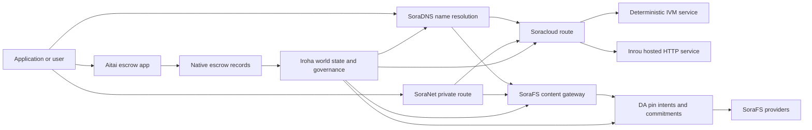

# SORA Nexus Ծառայություններ {#sora-nexus-services}

SORA Nexus հավելում է ծրագրային ուղղությամբ սպասարկման ինքնաթիռները շուրջ Iroha 3. Այս ծառայությունները չեն առանձին գրքեր: Նրանք ամրագրված են Iroha համաշխարհային պետության, Norito մանիֆեսների, կառավարման արձանագրությունների եւ Torii երթուղիների ընտանիքների կողմից:

Հասանելիությունը կախված է հանգույցի կառուցվածքից եւ ցանցի պրոֆիլից: Օգտագործեք [`/openapi`](/hy/reference/torii-endpoints.md#app-and-sora-route-families) թիրախային հանգույցում որպես թույլատրված երթուղիների հեղինակավոր ցուցակ:

## բաղադրիչների քարտեզը {#component-map}

|բաղադրիչ |դեր |Հիմնական մակերեւույթներ |
| ---------------------- | ------------------------------------------------------------------------------------------------------------------------------------------- | ---------------------------------------------------------------------------------------- |
|Soracloud |Հավելվածների տեղակայումը, հոսթված ծառայությունները, մասնավոր մոդելը/կիրառման ժամանակը եւ ծառայության կյանքի ցիկլը: |`/v1/soracloud/`, `/api/`, `iroha app soracloud ...` |
|Ներքեւում|Soracloud հյուրընկալվել է HTTP վազման ժամանակը ծառայության վերանայման համար, որոնք պահանջում են կենդանի HTTP ինքնաթիռ: |Soracloud Runtime կարգավորումը, հյուրընկալող հնարավորությունների գովազդները, կրկնօրինակային runtime վիճակը |
|SoraNet |Պrivacy եւ տրանսպորտային overlay շրջանների, ռեալի երթեւեկության, VPN, Connect նստաշրջանները, եւ հոսքուղիների. |`/v1/connect/`, `/v1/vpn/`, SoraNet երթուղի մետադատա |
|Տվյալների մատչելիությունը (DA) |Գործունակության ապացույցները, պարտավորությունները եւ շահագործման ծանրաբեռնվածքների նպատակային շերտերը, որոնք հղում են Nexus երթուղիների, SoraFS մանիֆեստների եւ ապացուցման հոսքերի համար: |`/v1/da/`, `FindDaPinIntent`, `[sumeragi.da]` |
|SoraFS |Մանֆիսների, CAR օգտակար բեռնվածքների, փակված բովանդակության, մուտքի ուղեւորների եւ վերականգնման ապացույցի հոսքերի պարունակությամբ հասցեագրված պահեստային կտոր: |`/v1/sorafs/`, `/sorafs/`, `FindSorafsProviderOwner` |
|SoraDNS |SORA հյուրընկալված ծառայությունների եւ բովանդակության համար որոշիչ անվանումների եւ լուծման հավատարմագրերի շերտ: |`/v1/soradns/`, `/soradns/`, լուծիչի ցուցակային իրադարձություններ |
|Aitai |App- ի մակարդակի ֆիատային եւ ակտիվների կարգավորման միջանցք, որը աջակցվում է տեղական պահպանակային գրառումներով, այլ ոչ թե առանձին գլխավոր հաշվառմամբ: | `OpenAssetEscrow`, `FindAssetEscrow*`, `EscrowEventFilter`, Kotodama `escrow_*` շինություններ |



## Հասարակական հոսքեր {#common-flows}

### Հյուրընկալված Split ծրագիրը {#hosted-split-application}

Տիպիկ խառնաշփոթային հավելվածը օգտագործում է բոլոր մասերը միասին.

1. Static frontend ակտիվները փաթեթավորվում են եւ կոշտացված են SoraFS:
2. Հանրային հյուրընկալողը, օրինակ՝ `<app>.sora`, գրանցվում է SoraDNS հասցեի միջոցով:
3. Soracloud երթուղիներ `/api/v1/search` կամ `/api/v1/stream` դեպի Inrou HTTP ծառայություն:
4. Soracloud երթուղիները `/api/auth` եւ `/api/v1/user`՝ deterministic IVM վարորդներին:
5. Հաճախորդները, ովքեր գաղտնիության կարիք ունեն, կարող են հասնել նույն բովանդակությանը կամ API երթուղին SoraNet շրջանառության միջոցով:

|Ճանապարհ |Վերադարձային ինքնաթիռ |Ինչո՞ւ։|
| ----------------- | --------------------- | ------------------------------------------------- |
| `/`               |SoraFS ստատիկ պարունակություն |Վերարտադրելի բովանդակության արմատային եւ մուտքային պահեստավորում |
|`/assets/*` |SoraFS ստատիկ պարունակություն |Բովանդակությամբ հասցեագրված ակտիվներ եւ բացահայտ ապացույցներ |
|`/api/auth*` |Soracloud IVM |Հեղինակային եւ դրամապանակային մարտահրավերների վերականգնում |
|`/api/v1/user*` |Soracloud IVM |Կառավարության նկատմամբ զգայուն պետական մուտացիաներ |
|`/api/v1/search*` |Soracloud Inrou |Live HTTP ծառայություն, պահեստային, SSE կամ հավաքող վիճակը |

### Հրապարակման բովանդակություն {#content-publication}

SoraFS հրատարակությունը արտադրում է տեւական արվեստի գործիքներ, նախքան դրանց անվանումը նշվում է.

1. Կառուցեք օգտակար բեռնվածք կամ ցուցակ:
2. Հավաքեք այն CAR արխիվ եւ մասային պլան:
3. Կառուցեք Norito մանիֆես ՝ փաթեթային քաղաքականության եւ կառավարման տվյալներով:
4. Տեղեկագրությունը պետք է ներկայացվի Torii հասցեին:
5. Նշեք DA փաթեթի մտադրությունը կամ մատչելիության պարտավորությունները, երբ նպատակային պրոֆիլը պահանջում է հստակ ապացույցներ:
6. Հաշվետը միացրեք SoraDNS անվանումի կամ Soracloud ստատիկ առաջատար երթուղու վրա:

### Անձնական տրանսպորտ կամ հեռարձակման երթուղի {#private-fetch-or-streaming-route}

SoraNet կարող է նստել SoraFS կամ Soracloud դիմաց.

1. Հաճախորդը լուծում է անունը կամ ցուցակը:
2. Պաշտպանական ցուցակ կամ երթուղի մանիֆեսը ընտրում է մուտքի եւ դուրս գալու ռելեյերը:
3. Ճանապարհային երթեւեկությունը լցվում է եւ ուղարկվում SoraNet շրջանակի միջոցով:
4. Հեռացման ռելեյը հասնում է SoraFS մուտքի դարպասի, Torii հոսքի կամ Soracloud երթուղու:

## Aitai {#aitai}

Aitai-ն SORA հավելվածի միջանցքն է շուկայական կարգավորման համար, որտեղ գնորդը եւ վաճառողը համակարգում են վճարումը առանց շղթայի, մինչդեռ Iroha վերահսկում է շղթայական ակտիվների պահպանումը: Այն պետք է օգտագործի բնիկ հանձնարարականների ընտանիքը, փոխարենը պայմանագրային սեփականատերական հանձնարարումային հաշիվը թվային ակտիվների նոր պահպանակային հոսքերի համար:

Native escrow-ը պահում է պահպանումը գլխավոր գրքում: Վաճառողը առաջարկ է բացում `OpenAssetEscrow`, գնորդը ընդունում եւ նշում է վճարումը `AcceptAssetEscrow` եւ `MarkEscrowPaymentSent`, եւ վաճառողը թողնում է `ReleaseAssetEscrow` կամ չեղյալ հայտարարում վճարումը նշելուց առաջ: Եթե գնորդը եւ վաճառողը համաձայն չեն, երկու կողմերը կարող են վեճ բացել, իսկ լուծողը՝ `CanResolveEscrowDispute`-ով, կարող է բաժանել փակված գումարը:

Ամբողջ կյանքի ցիկլը, ընդհանուր ակտիվների փակումը, անանուն պահպանումները, հարցումները, իրադարձությունները եւ Rust օրինակները, տես [Native Asset Escrow](/hy/blockchain/escrow.md):

|Aitai մակերեսը |Օգտագործեք այն |
| ------------------------------------------------------------------------------------------------------------------------------------------------------------- | ----------------------------------------------------------------------------------------- |
|`OpenAssetEscrow`, `AcceptAssetEscrow`, `MarkEscrowPaymentSent`, `ReleaseAssetEscrow`, `CancelAssetEscrow` |Թվային ակտիվների թափանցիկ առաջարկներ, ներառյալ XOR դոմինալացված հաշվետվությունների հոսքերը: |
|`OpenAnonymousAssetEscrow`, `AcceptAnonymousAssetEscrow`, `MarkAnonymousEscrowPaymentSent`, `ReleaseAnonymousAssetEscrow`, `CancelAnonymousAssetEscrow` |Պաշտպանված առաջարկները ֆինանսավորման եւ փակման շարժումների համար օգտագործում են ապացույցների հավելվածներ: |
|`OpenEscrowDispute`, `ResolveEscrowDispute`, `OpenAnonymousEscrowDispute`, `ResolveAnonymousEscrowDispute` |Բողոքի ակցիան եւ դատական կարգավորումը: |
|`FindAssetEscrowById`, `FindAssetEscrowsBySeller`, `FindAssetEscrowsByBuyer`, `FindAssetEscrowsByStatus` |Հավելվածների վիճակագրության էջեր, համատեղման աշխատանքներ եւ աջակցության գործիքներ: |
|`EscrowEventFilter` |Կայուն թափանցիկ վարկային բաժանորդագրություններ՝ ըստ վարկային ID-ի, վաճառողի, գնորդի, կարգավիճակի կամ միջոցառման տեսակի: |
| Kotodama `escrow_open_offer`, `escrow_accept`, `escrow_mark_payment_sent`, `escrow_release`, `escrow_cancel`, `escrow_open_dispute`, `escrow_resolve_dispute` |Kotodama պայմանագրային զանգեր, որոնք աջակցվում են V1 հանձնառու համակարգերի կողմից: |

Հանրային Taira կամ Minamoto օգտագործման համար դիմումի քաղաքականությունը պետք է դիտարկվի վճարային փաթեթից դուրս եւ ցանկացած աջակցության կամ դատարանի աշխատանքային հոսքի հետ: Iroha արձանագրում է պահպանումների վիճակը, կյանքի շրջանակի իրադարձությունները, ապացույցների քաշը եւ վերջնական ակտիվների շարժումը. այն ինքնուրույն չի ստուգում ֆիատային հաշվետվությունը:

## Ստուգեք թիրախային հանգույցը {#check-a-target-node}

Նախքան այս էջից օրինակներ օգտագործելը, հաստատեք, որ երթուղու ընտանիքը գոյություն ունի թիրախավորվող հանգույցում.

```bash
export TORII_URL=https://taira.sora.org

curl -fsS "$TORII_URL/openapi.json" \
  | jq '.paths | keys[] | select(test("^/v1/(soracloud|sorafs|soradns|connect|vpn|da)/"))'

curl -fsS -H 'Accept: application/json' "$TORII_URL/status" | jq .
```

Եթե `/openapi.json` չի բացահայտվում պրոֆիլով, փորձեք `/openapi`. Ճշգրիտ երթեւեկության հասանելիությունը կախված է կառուցման առանձնահատկություններից եւ ցանցի կազմաձեւումից:

### Taira Կարդալ միայն ծխախոտի ստուգումներ {#taira-read-only-smoke-checks}

Հասարակական Taira վերջային կետը օգտակար է ընթերցման կողմի ստուգումների համար, բայց մի օգտագործեք այն մուտացիոն օրինակների համար, քանի դեռ չեք գործարկում թույլատրված հաշիվ եւ մտադիր եք փոխել կենդանի վիճակը.

```bash
export TORII_URL=https://taira.sora.org

curl -fsS -H 'Accept: application/json' "$TORII_URL/status" \
  | jq '{version: .build.version, peers, blocks, lanes: (.teu_lane_commit | length)}'

curl -fsS "$TORII_URL/v1/connect/status" | jq '{enabled, sessions_active}'

curl -fsS "$TORII_URL/v1/vpn/profile" \
  | jq '{available, relay_endpoint, supported_exit_classes}'

curl -fsS "$TORII_URL/v1/sorafs/storage/state" \
  | jq '{bytes_capacity, bytes_used, pin_queue_depth, por_inflight}'

curl -fsS -H 'Accept: application/json' "$TORII_URL/v1/soracloud/status" \
  | jq '.control_plane | {service_count, services: [.services[] | {service_name, current_version}]}'
```

Taira-ը կարող է բացահայտել տեղակայման հատուկ վերահսկողության ինքնաթիռի երթուղիներ, որոնք նշված չեն OpenAPI ճամփորդության քարտեզում: Բարեւեք `/openapi` որպես հիմնական ստեղծված API պայմանագիր, այնուհետեւ հաստատեք ցանկացած տեղակայման որոշակի երթուղին անմիջապես նախքան այն փաստագրելը որպես կենդանի:

## Soracloud {#soracloud}

Soracloud է SORA ծրագրի կառավարման հարթակը: Այն հետեւում է տեղակայման փաթեթներին, ծառայության վերանայմաններին, երթեւեկությանը, գործարկման վիճակին, հեղինակավոր կոնֆիգերի մուտքագրություններին, կոդավորված ծառայությունների գաղտնիքներին, մոդելային գրանցամատյանների արձանագրություններին, մասնավոր եզրակացումների նստաշրջաններին եւ վազքի ժամանակահատվածի ստանձնումներին։

Soracloud օգտագործում է երկու իրականացման ինքնաթիռներ.

|Գործադրանքի ինքնաթիռը|Գործընթաց |Օգտագործեք այն |
| ---------------------- | ------- | -------------------------------------------------------------------------------------------- |
|`DeterministicService` |`Ivm` |Հեղինակ, պահեստային վիճակ, հավաստագրված ընթերցումներ, պատվիրված փոստային տուփերի վարորդներ, կառավարման համար զգայուն մուտացիաներ |
|`HttpService` |`Inrou` |Live HTTP APIs, հավաքիչների ծանր աշխատանք, պահեստային աջակցությամբ ծառայություններ, SSE, բրաուզեր-օգնվող հոսքեր |

Կառավարման ինքնաթիռը հեղինակավոր է: Զեղուցեք, թարմացրեք, վերափոխեք, տեղաշարժեք, կոմֆիգացրեք, գաղտնիքներ, մոդել եւ կարգավիճակ հրամանները ուղարկեք Torii եւ կարդացեք պարտավորված համաշխարհային վիճակը. դրանք չեն դիմում առանձին CLI- ի տեղական հայելու վրա: Հանրային երթեւեկությունը հիմնված է ամենաերկար նախադրյալի վրա, այնպես որ մեկ գրանցված հյուրընկալող կարող է բաժանել երթեւանությունը հյուրասիրված HTTP երթուղիների եւ որոշիչ API երթուղների միջեւ:

### Պահեք Split App- ը {#scaffold-a-split-app}

Split-app ձեւանմուշը ստեղծում է ստատիկ frontend գումարած մեկ հյուրընկալված կենդանի API եւ մեկ deterministic vault / API ծառայություն:

```bash
iroha app soracloud app init \
  --template split-app \
  --app-name solswap_indexer \
  --app-version 0.1.0 \
  --public-host solswap-indexer.sora \
  --output-dir ./apps/solswap-indexer

iroha app soracloud app local-plan \
  --manifest ./apps/solswap-indexer/app_manifest.json

iroha app soracloud app doctor \
  --manifest ./apps/solswap-indexer/app_manifest.json
```

`local-plan` տպագրում է երթուղու բաժանումը, երեխայի ծառայության մանիֆեսները, աշխատանքային տարածքի սցենարների ուղիները եւ ակնկալվող առաջատար հրապարակման ռեժիմը: `doctor` հավաստիացնում է տեղական թողարկման պայմանագիրը նախքան ձեր ներգրավումը Torii.

### Հավելվածների տեղակայման եւ ստուգման վիճակը {#deploy-and-inspect-app-state}

```bash
export SORACLOUD_TORII_URL=https://<soracloud-enabled-torii>

iroha app soracloud app deploy \
  --manifest ./apps/solswap-indexer/app_manifest.json \
  --torii-url "$SORACLOUD_TORII_URL"

iroha app soracloud app status \
  --manifest ./apps/solswap-indexer/app_manifest.json \
  --torii-url "$SORACLOUD_TORII_URL"
```

Արդեն տեղակայված ծառայության համար օգտագործեք սպասարկման չափով հրամաններ.

```bash
iroha app soracloud status \
  --service-name solswap_indexer_live \
  --torii-url "$SORACLOUD_TORII_URL"

iroha app soracloud rollback \
  --service-name solswap_indexer_live \
  --target-version 0.1.0 \
  --torii-url "$SORACLOUD_TORII_URL"
```

### Գաղտնի եւ գաղտնի նյութեր {#config-and-secret-material}

Soracloud config եւ գաղտնի մուտքերը հանդիսանում են հեղինակավոր տեղադրման վիճակի մի մասը: տեղակայումը, թարմացումը եւ վերադարձը չեն փակվում, երբ անհրաժեշտ config կամ գաղտնի կապերը բացակայում են կամ անհամատեղելի են ակտիվ մանիֆիսների հետ:

```bash
iroha app soracloud config-set \
  --service-name solswap_indexer_live \
  --config-name indexer/public_config \
  --value-file ./config/public-config.json \
  --torii-url "$SORACLOUD_TORII_URL"

iroha app soracloud secret-set \
  --service-name solswap_indexer_live \
  --secret-name indexer/api_key \
  --secret-file ./secrets/api-key.envelope.json \
  --torii-url "$SORACLOUD_TORII_URL"
```

Օգտագործեք CLI օգնությունը ձեր պրոֆիլը պահանջող հավատարմագրերի ճշգրիտ դրոշների համար.

```bash
iroha app soracloud config-set --help
iroha app soracloud secret-set --help
```

## Inrou {#inrou}

Inrou- ը հյուրընկալված HTTP վազման ժամանակն է, որը օգտագործվում է Soracloud կողմից: Iroha հանգույց ՝ ներկառուցված Soracloud վազման ժամանակը նախագծերի հետ, որոնք ընդունվել են Soracloud վիճակում տեղական նյութավորման ծրագիրը, սկսում է հյուրընկալվող ծառայության պատճենները որպես loopback ծառայություններ, եւ զեկույցներ կրկնօրինակել վազման ժամանակի վիճակը վերադառնալ հեղինակավոր մոդելը.

Օգտագործեք Inrou- ը աշխատանքային բեռների համար, որոնք պահանջում են կենդանի HTTP մակերես, ինչպիսիք են կոլեկտոր ծանր APIs, SSE հոսքերը, պահեստային աջակցություն ունեցող կառավարիչները կամ զննարկչի օգնությամբ ծառայությունները:

### Գործընթացային ժամկետի պահանջներ {#runtime-requirements}

- Կոնտեյների մանիֆեստի գործարկման ժամկետը պետք է լինի `Inrou`.
- Ծառայության մանիֆեսի իրականացման մակարդակը պետք է լինի `HttpService`:
- `HttpService + Inrou` պահանջում է ճշգրիտ մեկին `PersistentRootLeaseVolume`, որը տեղադրված է `/`:
- Inrou ծառայությունների կրկնօրինակման համար անհրաժեշտ է նաեւ կիսված ծառայություն կամ գաղտնի վարձակալության պահեստավորում, երբ դրանք պահպանում են փոխվող համատեղ վիճակը:
- Արտադրանքի հոսթինգի հանգույցները պետք է գովազդեն իրական Inrou- ի կարողությունները, այլ ոչ թե միայն որպես պրոքսի:

### Բացահայտված հատված {#manifest-fragment}

Ստորեւ բերված օրինակը ցույց է տալիս երկու մանիֆեսների ձեւը: Դա կտտություն է, այլ ոչ թե ամբողջական տեղակայման փաթեթ:

```jsonc
// container_manifest.json
{
  "schema_version": 1,
  "runtime": { "runtime": "Inrou", "value": null },
  "bundle_path": "/bundles/solswap-indexer.inrou",
  "entrypoint": "/app/bin/launch-indexer.sh",
  "args": [],
  "env": {
    "RUST_LOG": "info",
  },
  "inrou": {
    "schema_version": 1,
    "guest_os": { "guest_os": "DebianSlim", "value": null },
    "guest_images": {
      "x86_64": {
        "kernel_image_path": "/inrou/x86_64/vmlinux",
        "rootfs_image_path": "/inrou/x86_64/rootfs.ext4",
        "initrd_image_path": null,
      },
      "aarch64": {
        "kernel_image_path": "/inrou/aarch64/vmlinux",
        "rootfs_image_path": "/inrou/aarch64/rootfs.ext4",
        "initrd_image_path": null,
      },
    },
  },
  "lifecycle": {
    "start_grace_secs": 60,
    "stop_grace_secs": 30,
    "healthcheck_path": "/api/indexer/v1/health",
  },
}
```

```jsonc
// service_manifest.json
{
  "schema_version": 1,
  "service_name": "solswap_indexer_live",
  "service_version": "0.1.0",
  "execution_plane": { "execution_plane": "HttpService", "value": null },
  "replicas": 2,
  "route": {
    "host": "solswap-indexer.sora",
    "path_prefix": "/api/v1/search",
    "service_port": 8080,
    "visibility": { "visibility": "Public", "value": null },
    "tls_mode": { "tls": "Required", "value": null },
  },
  "lease_volumes": [
    {
      "volume_name": "root_disk",
      "kind": {
        "lease_volume": "PersistentRootLeaseVolume",
        "value": null,
      },
      "storage_class": { "storage_class": "Warm", "value": null },
      "mount_path": "/",
      "max_total_bytes": 8589934592,
    },
    {
      "volume_name": "index_state",
      "kind": { "lease_volume": "ServiceLeaseVolume", "value": null },
      "storage_class": { "storage_class": "Warm", "value": null },
      "mount_path": "/var/lib/solswap-indexer",
      "max_total_bytes": 1073741824,
    },
  ],
}
```

Գործնական ժամանակ, յուրաքանչյուր տեղադրված վարձակալության ծավալը բացատրվում է ծավալի անվանումից ստացված միջավայրային փոփոխականների միջոցով.

```text
SORACLOUD_LEASE_VOLUME_ROOT_DISK_DIR
SORACLOUD_LEASE_VOLUME_ROOT_DISK_MOUNT_PATH
SORACLOUD_LEASE_VOLUME_INDEX_STATE_DIR
SORACLOUD_LEASE_VOLUME_INDEX_STATE_MOUNT_PATH
```

## SoraNet {#soranet}

SoraNet -ը գաղտնիության եւ տրանսպորտային ծածկույթն է: Այն ապահովում է փոխանցման վրա հիմնված երթուղիներ երթեւեկության համար, որոնք չպետք է ուղղակիորեն կապվեն նպատակային մուտքի կամ ծառայության հետ: Տրանսպորտային նախագիծը օգտագործում է մուտքի, միջին եւ ելքային ռելեյի դերակատարություններ, QUIC տրանսպորտ, աղմուկային հիբրիդային ձեռքսեղմում, հնարավորությունների բանակցություններ, ռելեի ցուցահանդեսների մետադատա եւ ֆիքսված չափերի փոշոտված բջիջներ:

Մինչեւ Nexus տեղակայում, SoraNet կարող է բովանդակության բեռնել, մուտքային երթեւեկություն, VPN կամ Connect նստաշրջանները, եւ Norito Streaming երթուղիներ. Directory մուտքագրերը կարող են նշանավորել Relays, որ աջակցում `norito-stream`, որը թույլ է տալիս հաճախորդներին նախընտրել ուղիներ, որոնք հարմար են Torii RPC կամ հոսող երթեւեկություն:

### Սթրիմինգի կարգավորումը {#streaming-configuration}

Nexus պրոֆիլը հնարավորություն է տալիս SoraNet տրամադրել հոսքային երթեւեկության համար.

```toml
[streaming]
feature_bits = 0b11

[streaming.soranet]
enabled = true
exit_multiaddr = "/dns/torii/udp/9443/quic"
padding_budget_ms = 25
access_kind = "authenticated"
provision_spool_dir = "./storage/streaming/soranet_routes"
provision_spool_max_bytes = 0
provision_window_segments = 4
provision_queue_capacity = 256
```

Օգտագործեք `access_kind = "read-only"` բովանդակության երթուղիների համար, որոնք չեն պահանջում դիտորդի հավատարմագրումը: Օգտագործիր `authenticated`, երբ ելքային ռեալիը պետք է ուժի մեջ դնի տոմսերը կամ դիտորդի ինքնությունը, նախքան կապվելը Torii կամ հյուրընկալվող ծառայություն:

### SoraNet-Գիտակցված SoraFS Գտնել {#soranet-aware-sorafs-fetch}

SoraFS բեռնելը CLI կարող է թողարկել տեղական պրոկսի մանիֆես եւ SoraNet երթուղի մետադատա տվյալներ բրաուզերային ընդլայնումների կամ SDK ադապտերի համար.

```bash
sorafs_cli fetch \
  --plan artifacts/payload_plan.json \
  --manifest-id 7bb2...9d31 \
  --provider name=alpha,provider-id=9f5c...73aa,base-url=https://gw-alpha.example.org/,stream-token="$(cat alpha.token)" \
  --output artifacts/payload.bin \
  --json-out artifacts/fetch_summary.json \
  --local-proxy-manifest-out artifacts/proxy_manifest.json \
  --local-proxy-mode bridge \
  --local-proxy-norito-spool storage/streaming/soranet_routes \
  --local-proxy-kaigi-spool storage/streaming/soranet_routes \
  --local-proxy-kaigi-policy authenticated \
  --max-peers=2 \
  --retry-budget=4
```

Ամփոփագրության մատակարարի զեկույցները, բաժնետոմսերի ստացումները, տեղական պրոկսի մետադատաները եւ ներգրավման համար օգտագործված արդյունավետ երթուղու կարգավորումները:

## Տվյալների մատչելիությունը (DA) {#data-availability-da}

DA -ը հասանելիության ապացույցների շերտ է այն օգտակար բեռերի համար, որոնք չափազանց մեծ են, չափազանց զգայուն են գաղտնիության նկատմամբ կամ չափազանց հատուկ ծառայությունների համար, որպեսզի կարողանան ուղղակիորեն տեղակայվել համաշխարհային վիճակում: Այն արձանագրում է դետերմինիստական պարտավորությունները եւ վերականգնման պարտավորությունները, որպեսզի վավերացողները, մուտք գործիչները եւ հաճախորդները կարողանան համաձայնվել այն մասին, թե որ բայտներ են խոստացել, որ քաղաքականություն է կիրառվում, եւ որ ապացույցներն են դիտարկվել։

DA-ը չի փոխարինում Kura կամ SoraFS:

- Kura պահում է վերջնականացված բլոկային հոսքի եւ համաձայնության վերականգնման տվյալները:
- SoraFS պահում եւ սպասարկում է բովանդակությամբ հասցեագրված բայթներ, CAR օգտակար ծանրաբեռնվածքներ եւ մանիֆեստներ:
- DA արձանագրում է պարտավորությունները, ապացույցների քաղաքականությունը, ապացույցի բացումները եւ պին մտադրությունները, որոնք թույլ են տալիս այդ բայթներին պլանավորել, վերլուծել եւ կապել գրքի վիճակի հետ:

Օգտագործեք DA, երբ հավելվածի կամ Nexus երթուղու համար անհրաժեշտ է հաշվառման տեսանելի խոստում, որ շղթայից դուրս տվյալները մնում են վերականգնվող: Հաճախակի օրինակներ ներառում են երթուղի օգտակար բեռնվածության պարտավորությունները կարգավորման հոսքերի համար, SoraFS փաթեթային մտադրություններ հրապարակված բովանդակության համար. ապացույցների փաթեթներ, որոնք պետք է պահվեն հետագա ստուգման համար, եւ կիրառման արվեստի գործիքներ, որոնց հանրային վիճակը պետք է լինի ամբողջական բեռնվածքի փոխարեն:

### Կյանքի ցիկլ {#lifecycle}

|Դասընթաց |Ինչ է արձանագրվում|
| ---------- | ----------------------------------------------------------------------------------------------------------------------------------------------------- |
|Նպատակ |Տոմս, մատչելի հղում, կեղծանուն, երթուղի / ժամանակաշրջանի / հաջորդականության հղում, պահեստավորման քաղաքականություն կամ կրկնօրինակման նպատակ: |
|Հանձնառություն |Digest նյութը, որը կապում է manifesto- ի, երթուղի օգտակար բեռը, ապացուցման փաթեթ, կամ բովանդակության արմատը ledger տեսանելի արձանագրություն. |
|ապացույցներ |Գործունակության քվեներ, ապացույցների բացություններ, մատակարարների վկայականներ կամ այլ պրոֆիլային հատուկ փաստաթղթեր, որոնք ընդունվել են նպատակային ցանցի կողմից: |
|Հարց |Պին մտադրության որոնումները `FindDaPinIntentByTicket`, `FindDaPinIntentByManifest`, `FindDaPinIntentByAlias` կամ `FindDaPinIntentByLaneEpochSequence`: |

Տիպիկ DA աջակցությամբ հրապարակման հոսքը հետեւյալն է.

1. Կառուցեք կամ ստացեք օգնական բեռը WSV-ից դուրս, օրինակ՝ SoraFS CAR ֆայլ կամ Nexus ճամբարային օգնական բեռն.
2. Հիշեք եւ նկարագրեք օգնական բեռը Norito մանիֆեստում կամ երթուղային հատուկ պարտավորությունների գրանցման մեջ:
3. Մանֆիսը, պին մտադրությունը կամ պարտավորությունը ներկայացրեք `/v1/da/*` միջոցով, երբ այդ երթուղային ընտանիքը ակտիվացված է, կամ ցանցի ստորագրված գործարքի ուղու միջոցով:
4. Թույլ տվեք վավերացնողներին կամ մատչելիության մատակարարներին հավաքել ակտիվ ապացույցի քաղաքականությամբ պահանջվող ապացույցները:
5. Հարցրեք ստացվող փաթեթի մտադրությունը կամ պարտավորությունը նախքան կեղծանունը, վճարման ապացույցը կամ մուտքի ուղին առաջացնելը, որը կախված է օգնական բեռնվածությունից:

### Ալգորիթմիկ մոդել {#algorithmic-model}

DA փոխակերպում է օգտակար բեռը ստորագրված, կրկնում-պաշտպանված, բլոկի ինդեքսացված պարտավորություն: Կարեւոր ալգորիթմները որոշիչ են, այնպես որ հավաստիացնողներն ու մուտքերը կարող են նույն դիջեստերը վերաքննել նույն բայթներից.

1. Torii ընդունում է ներբեռնումի խնդրանք, որը պարունակում է `(lane_id, epoch, sequence)`, օգտակար բեռնվածության բայտներ, կոճման մետադատա, մասերի չափը, ջնջման պրոֆիլը, պահպանումի քաղաքականությունը եւ ուղարկողի ստորագրությունը: Նոդը պահանջելիս կոմպրեսում է gzip, deflate կամ Zstandard օգտակար բեռնվածքները, այնուհետեւ ստուգում է, որ կանոնական բայթ երկարությունը հավասար է `total_size`:
2. Ճանապարհի եւ մասերի պարամետրերը հաստատեք: Ճանապարհը պետք է լինի Nexus ճանապարհային կատալոգում: `chunk_size` պետք է ունենա ոչ զրոյական հզորություն ՝ երկու, առնվազն երկու բայտ, եւ ոչ ավելի մեծ, քան սահմանված առավելագույնը: Սեղմման պրոֆիլը պետք է ներառի տվյալների հատվածներ եւ առնվազն երկու հավասարակշռության հատվածներ: Ճանապարհային կատալոգում ընտրվում է ապացուցման սխեմայի `merkle_sha256` կամ `kzg_bls12_381`.
3. Կիրառեք ցանցի քաղաքականություն: Նոդը պարտադրում է բլոբ դասի համար ձեւակերպված կրկնապատկման եւ պահեստավորման հիմնարար գիծը: Հանրային մետադատները պետք է մնան պարզ տեքստով. միայն կառավարման մեթադատները գաղտնագրվում են նոդի կարգավորվող կառավարման մետադատվական կոճակով, նախքան դրանք գրվել են մանիֆեսում:
4. Մաս եւ պարտավորություն: Կանոնիկ օգտակար բեռնվածքը բաժանվում է `chunk_size`ից ստացված ֆիքսված չափի պրոֆիլով: Torii հաշվարկում է օգտակար բեռի դիժեսը, ապացուցման վերականգնվողականության ծառի արմատը եւ յուրաքանչյուր մասի պարտավորությունները: Տվյալների փաթեթները կրում են BLAKE3 պարտավորություններ իրենց բայտերի վրա.
5. Բաժանները խմբագրվում են `data_shards` գծերի մեջ: Վերջնական գիծում բացակայող բջիջները զրոյական են զուգահեռության հաշվարկի համար: RS(16) զուգահեռնություն ստեղծում է գծի/գլոբալ զուգահեռության հատվածներ. ընտրանքային `row_parity_stripes` ավելացրեք սյունակի ոճի ժողերի զուգահեռնություն ամբողջ մատrix- ում: Զուգահեռական զեկույցի պարտավորությունները BLAKE3 են փոքր տերեւների `u16` խորհրդանիշները:
6. Կառուցեք մանիֆիսը: `DaManifestV1` գրում է երթուղին, ժամանակահատվածը, բլոբ դասը, կոդեկը, օգտակար բեռի դիժեստը, մասերի արմատը, մասի չափը, ջնջման պրոֆիլը, պահպանումի քաղաքականությունը, վարձակալության գինը, մասի պարտավորությունները, ընտրական IPA պարտավորությունը, մետադատաները եւ թողարկման ժամանակը: Պահեստավորման տոմսը դետերմինիստիկ է. բջիջը նախ բաց տոմսով էշավորում է մանիֆեստի ձեւանմուշը, այնուհետեւ գրում է այդ մատնահետքը որպես վերջնական `storage_ticket`։
7. Թույլ տվեք կրկնօրինակել հակամարտությունները. կրկնապատկման բանալին `(lane_id, epoch, sequence, manifest_fingerprint)` է: Նույն մատնահետք ունեցող կրկնօրինակը անկայուն է: Թույլատրվում է թարմացված հաջորդականություն կամ նույն հաջորդականությունը, որն ունի այլ մատնահատակ.
8. Torii հաշվարկում է PDP պարտավորությունը, ստորագրում `DaIngestReceipt`, կառուցում `DaCommitmentRecord` եւ գրում մանիֆեստի համար սցենարային արվեստագետներ: PDP պարտավորություն, պարտավորության արձանագրությունը, պարտավորությունների ժամանակացույցը, գրիչի մտադրությունը, գրավման ֆայլը եւ գրավման օրագիրը: Գրանցման կուրսորը առաջ է շարժվում միանգամայն յուրաքանչյուր `(lane_id, epoch)` համար:

Հանձնառության արձանագրությունները այն են, ինչ բլոկները կրում են:

- գոտի, ժամանակաշրջանի եւ հաջորդականության
- Caller blob ID եւ կանոնիկ manifest hash
- երթուղային ապացուցման ծրագիր
- կոտրված արմատ
- KZG երթուղիների համար նախընտրական KZG պարտավորություն
- PDP/անվտանգության մատակարար
- պահեստավորման դաս եւ պահպանման տոմս
- Torii DA հաստատման ստորագրություն

Նախքան բլոկը ներմուծում է DA գրառումները, բլոկի հավաքման ուղին հաստատում է փաթեթը.

- `(lane_id, epoch, sequence)` պետք է յուրահատուկ լինի փաթեթի ներսում:
- Բացահայտված շիշերը պետք է լինեն ոչ զրոյական եւ յուրահատուկ փաթեթի մեջ:
- Հանձնառության ապացուցման ծրագիրը պետք է համապատասխանի սահմանված երթուղի քաղաքականությանը:
- Merkle-ի երթուղիները մերժում են KZG պարտավորությունները, իսկ KZG երթուղիների համար անհրաժեշտ է ոչ զրոյական KZG պարտավորություն:
- Pin մտադրությունները կանոնիկացվում են, դասակարգվում եւ ֆիլտրվում են երթուղի, manifest hash, պահեստային տոմս, սեփականատերերի հաշիվ եւ alias-հանդիպման կանոններով:

Բլոկի գլուխը պահպանում է DA ապացույցի քաղաքականությունների, պարտավորությունների եւ փաթեթավորման մտադրությունների хэշեր: Անդամության ապացույցների համար, պարտավորության փաթեթն նաեւ բացահայտում է Merkle արմատ, որի տերեւները կանոնիկ Norito կոդավորված `DaCommitmentRecord` արժեքների շիշեր են: Ծնողական բջիջները շիշում են ձախ եւ աջ երեխաների համակցվածությունը. զարմանալի թերթը անփոփոխ առաջադրվում է հաջորդ շերտին:

### ապացույցների ստուգում {#proof-verification}

`/v1/da/commitments/prove` կարող է ապացույց ներկայացնել մեկ պարտավորության համար բլոկում: Ապացույցը պարունակում է պարտավորությունը, բլոկի բարձրությունը, ինդեքսը փաթեթի մեջ, փաթեթային շիշը, փոթեթի երկարությունը, Merkle արմատը եւ եղբայրական ուղին: Փորձարկումները ստուգում են.

1. Ապացուցման փաթեթը համընկնում է բլոկի գլխարկի DA պարտավորությունների հետ:
2. Ապացուցման բլոկի բարձրությունը համապատասխանում է հղում կատարված բլոկային գլխավորագրին:
3. Հաշվարկային ցուցանիշը սահմաններում է, եւ պարտավորությունը հավասար է այդ ցուցանիշի փաթեթի մուտքի:
4. Ճանապարհային ապացույցի քաղաքականությունը ընդունում է պարտավորությունը:
5. Հանձնառության տերեւից եղբայրական ուղին փակելը վերականգնում է մատակարարված արմատը:
6. Վերակառուցված արմատը հավասար է խմբաքանակի արմատին:

Սա ապացուցում է, որ կոնկրետ բլոկի օգտակար լիցքավորման մեջ ներառվել է հատուկ մատչելիության պարտավորություն. դա չի ապացուցել, որ յուրաքանչյուր կրկնօրինակ ներկայումս առցանց է: Live- ի վերականգնման հնարավորությունը ստուգվում է առանձին SoraFS մատակարարների հետաքննությամբ, PDP/PoTR ստուգումներով կամ պրոֆիլային առկաության ապացույցներով:

### Համաձայնության փոխազդեցություն {#consensus-interaction}

DA-ը կապվում է Sumeragi-ի հետ հուսալի հեռարձակման միջոցով (RBC), բայց դա երկրորդ վերջնականության արձանագրություն չէ: RBC-ն տարածում եւ վերականգնում է առաջարկային օգտակար բեռները. առաջարկողը հայտարարում է `(height, view, payload_hash)`, զուգընկերների փոխանակման մասերի եւ `READY`/`DELIVER` ազդանշանների համար նստաշրջանի մասին, որը հետեւում է, թե արդյոք բավարար վավերացողները դիտարկել են նույն օգտակար բեռը:

Iroha 3 կետում, զուգընկերն ընդունում է սպասարկվող բլոկի օգտակար լիցքաբաժինը, երբ կամ

- տեղական սպասվող բլոկը բայթ է хэշում սպասվող օգտակար լիցքային хэշի վրա, կամ
- RBC վերականգնել է օգտակար բեռը համընկնում բլոկի hash, բարձրություն, տեսք, եւ օգտակար բեռնման hash.

Եթե ոչ մի պայման չի համապատասխանում, զուգընկերային արձանագրությունը `missing_local_data`, շարունակում է փորձել վերականգնել օգտակար բեռը RBC կամ արգելափակման համաժամացման միջոցով եւ հայտնում է DA մուտքի վիճակի եւ հեռաչափության մասին: Ներկայումս իրականացվող այս DA ազդանշանները խորհրդատվական են վերջնականության համար. բլոկը դեռեւս ավարտվում է պարտավորության վկայակոչից գումարած համապատասխան տեղական օգտակար բեռնվածքից, այլ ոչ թե առանձին DA քվորոմային վկայակոչերից:

DA ժամկետը ընդլայնում է վերականգնման պատուհանները: Արդյունավետ DA քվորոմային ժամանակահատվածը տրվում է կոնֆիգուրացված բլոկից եւ պարտավորությունների ժամկետներից, այնուհետեւ բազմապատկվում է `sumeragi.advanced.da.quorum_timeout_multiplier` -ով: Գործունակության ժամանակահատվածն է `max(quorum_timeout, availability_timeout_floor_ms) * availability_timeout_multiplier`. Մինչ այդ հասանելիության ժամկետն ավարտվում է, հանգույցը նպաստում է օգտակար բեռի վերականգնմանը եւ խուսափում վաղաժամ վերաբացուցմանից. այն ավարտելուց հետո կարող են շարունակվել նորմալ վերականգնման եւ դիտարկման փոփոխության ուղիները:

### Օպերատորի գրառումները {#operator-notes}

Iroha 3 կոնսենսուսային պրոֆիլները ներառում են օգտակար բեռի տարածումը, որը աջակցվում է RBC- ի կողմից, manifest guards- ը, DA փաթեթի հավաստագրումը եւ վերականգնման հեռաչափը: Համանախագահական ձեւանմուշը բացահայտում է `[sumeragi.da]` սահմանները բլոկի համար պարտավորությունների եւ ապացույցների բացումների համար, գումարած `[sumeragi.advanced.da]` ժամանակահատվածի բազմապատկիչների քվորումի եւ մատչելիության վարքի համար: Այս կարգավորումները պահպանեք համահունչ մեկ ցանցային պրոֆիլում վավերացողների միջեւ:

Ճանապարհային հայտնաբերման համար սկսեք բջիջի OpenAPI փաստաթղթից.

```bash
curl -fsS "$TORII_URL/openapi.json" \
  | jq '.paths | keys[] | select(startswith("/v1/da/"))'
```

Օգտագործեք [ հարցման հղումը](/hy/reference/queries.md#nexus-data-availability-and-packages) ընթացիկ DA հարցման անունների համար, եւ [ զուգընկերների կարգավորման ձեւանմուշը](/hy/reference/peer-config/) ձեր կառուցվածքի կողմից բացահայտված տեղական `[sumeragi.da]` կոճակների համար.

## SoraFS {#sorafs}

SoraFS -ը բովանդակության վրա հասցեագրված ապակենտրոնացված պահեստային կտոր է: Այն փաթեթավորում է բայտները դետերմինիստիկ մասերի, CAR արխիվների եւ Norito մանիֆեսների մեջ, որոնք կապում են բովանդակության արմատները. խանութային մատակարարները գովազդում են հզորության եւ բովանդակության հասանելիության մասին, մինչդեռ մուտք գործիչները ստուգում են մանիֆեսներն ու խանութի պարտավորությունները նախքան բովանդակությունը մատուցելը։

Տիպիկ SoraFS օգտագործումները ներառում են ստատիկ ծրագրային ակտիվներ, փաստաթղթերի կառուցվածք, գոտի փաթեթներ, մոդել կամ արվեստի գործիքների հղումներ եւ կառավարման ապացույցների փաթետներ: Iroha տվյալների մոդելը բացահայտում է SoraFS մուտքի իրադարձությունները եւ մատակարարների սեփականության լուծման համար [`FindSorafsProviderOwner`](/hy/reference/queries.md#nexus-data-availability-and-packages) հարցումը:

### Հավաքեք, հրապարակեք, ստորագրեք եւ ներկայացրեք {#pack-manifest-sign-and-submit}

```bash
cargo run -p sorafs_car --features cli --bin sorafs_cli -- \
  car pack \
  --input ./dist \
  --car-out artifacts/site.car \
  --plan-out artifacts/site.chunk-plan.json \
  --summary-out artifacts/site.car-summary.json

cargo run -p sorafs_car --features cli --bin sorafs_cli -- \
  manifest build \
  --summary artifacts/site.car-summary.json \
  --manifest-out artifacts/site.manifest.to \
  --manifest-json-out artifacts/site.manifest.json \
  --pin-min-replicas=3 \
  --pin-storage-class=warm \
  --pin-retention-epoch=42

SIGSTORE_ID_TOKEN=$(oidc-client fetch-token) \
cargo run -p sorafs_car --features cli --bin sorafs_cli -- \
  manifest sign \
  --manifest artifacts/site.manifest.to \
  --bundle-out artifacts/site.manifest.bundle.json \
  --signature-out artifacts/site.manifest.sig

cargo run -p sorafs_car --features cli --bin sorafs_cli -- \
  manifest submit \
  --manifest artifacts/site.manifest.to \
  --chunk-plan artifacts/site.chunk-plan.json \
  --torii-url "$TORII_URL" \
  --resolve-submitted-epoch=true \
  --authority=<i105-account-id> \
  --private-key-file ./secrets/authority.ed25519 \
  --summary-out artifacts/site.manifest.submit.json \
  --response-out artifacts/site.manifest.submit.body
```

Եթե `/v1/sorafs/pin/register` չի ուղղորդվում թիրախային հանգույցի վրա, ապա CLI-ը կարող է վերադառնալ ստորագրված `/transaction` հաղորդագրության եւ սպասել վերջնական խողովակաշարի կարգավիճակի:

### Ստուգեք եւ բերեք {#verify-and-fetch}

```bash
cargo run -p sorafs_car --features cli --bin sorafs_cli -- \
  proof verify \
  --manifest artifacts/site.manifest.to \
  --car artifacts/site.car \
  --chunk-plan artifacts/site.chunk-plan.json \
  --summary-out artifacts/site.verify.json

sorafs_cli fetch \
  --plan artifacts/site.chunk-plan.json \
  --manifest-id <manifest-digest-hex> \
  --provider name=primary,provider-id=<provider-id-hex>,base-url=https://gateway.example.org/,stream-token="$(cat provider.token)" \
  --output artifacts/site.fetch.tar \
  --json-out artifacts/site.fetch.json
```

### Գտվողության ապացույցի ստուգումները {#proof-of-retrievability-checks}

Օպերատորները կարող են ստուգել եւ պահեստավորման մատակարարների համար ապացույցների ստուգումներ գործարկել.

```bash
sorafs_cli por status \
  --torii-url "$TORII_URL" \
  --manifest <manifest-digest-hex> \
  --status=failed \
  --limit=20

sorafs_cli por trigger \
  --torii-url "$TORII_URL" \
  --manifest <manifest-digest-hex> \
  --provider <provider-id-hex> \
  --reason=latency_probe \
  --samples=48 \
  --auth-token artifacts/challenge_token.to
```

## SoraDNS {#soradns}

SoraDNS -ը SORA ծառայությունների եւ բովանդակության համար սահմանված անվանումների տերեւն է: Այն կարգավորում է անունները, ամրացնում է լուծիչի ցուցակային թարմացումները Iroha , եւ SoraFS միջոցով բաժանորդագրված գոտի կամ լուծման փաթեթներ է տարածում: Որոշիչներն ու դարպասները հաստատում են լուծման վկայականների փաստաթղթերը, նախքան վստահել հայտնաբերման մետադատային տվյալներին:

Բրաուզերային մուտքի համար SoraDNS բռնում է gateway հոստերը գրանցված FQDN կայքից: Գրանցված vanity հոստը մնում է կանոնիկ ծրագրի ծագումը, մինչդեռ տեղադրված gateway պրոֆիլները բացահայտում են այդ ծագման համար բրաուզեր եւ Torii հետադարձ ուղիները:

### Հյուրընկալող ձեւեր {#host-forms}

|ձեւը |Օրինակ |Նպատակ|
| --- | --- | --- |
|Անիմաստության ծագումը|`https://<fqdn>/<path>` |Քանոնիկ հավելված URL գրված է մանիֆիսներում եւ արձանագրություններում |
|Taira բրաուզերային մուտք |`https://<fqdn>.mon.taira.sora.net/<path>` |Գլխավոր բրաուզերային մուտք գործիչը ակտիվ կեղծանունի համար |
|Torii ընկնելու ուղին |`https://taira.sora.org/soradns/<fqdn>/<path>` |Torii Debug եւ fallback երթեւեկությունը ակտիվ alias |
|Canonical hash gateway |`<base32(blake3(name))>.gw.sora.id` |Դիտերմինիստական մուտք գործիչի ինքնությունը եւ GAR ստուգումը |

`/soradns/<alias>/...` fallback- ը նախընտրելի հանրային չէ URL. Օգտագործման գործիքներ, հավելվածների մանիֆեսներ եւ առաջադեմ կողմի կոնֆիգուրացիան պետք է նախընտրեն ինքնուրույն տիրողը: Եթե alias- ը ակտիվ չէ Taira- ում, բրաուզերային դարպասը կամ հետադարձ ուղին կարող է վերադառնալ `404` կամ ձախողել TLS- ը նախքան ծրագրի երթեւեկությունը սկսելը:

### Պահանջվող մուտքի հյուրընկալողներ {#derive-gateway-hosts}

```ts
import {
  deriveSoradnsGatewayHosts,
  hostPatternsCoverDerivedHosts,
} from '@iroha/iroha-js'

const derived = deriveSoradnsGatewayHosts('docs.sora')
console.log(derived.canonicalHost)
console.log(derived.prettyHost)

const taira = deriveSoradnsGatewayHosts('solswap-indexer.sora', {
  prettySuffix: 'mon.taira.sora.net',
})
console.log(taira.prettyHost)

const patterns = [
  derived.canonicalHost,
  derived.canonicalWildcard,
  derived.prettyHost,
]
console.log(hostPatternsCoverDerivedHosts(patterns, derived))
```

GAR օգտակար բեռները պետք է ծածկել կանոնիկ hash հյուրընկալող, կանոնական wildcard, եւ ընտրված գեղեցիկ հյուրընկեր.

### Վերցրեք Resolver Directory Snapshot- ը {#fetch-a-resolver-directory-snapshot}

```bash
curl -i "$TORII_URL/v1/soradns/directory/latest"

soradns_resolver directory fetch \
  --record-url "$TORII_URL/v1/soradns/directory/latest" \
  --directory-url https://gateway.example.org/soradns/directory/latest.car \
  --output ./state/soradns-directory

soradns_resolver rad verify \
  --rad ./state/soradns-directory/rad/resolver-a.norito
```

Gateways- ը պետք է մերժի ռեսուլվորները, որոնց լուծման վկայականի փաստաթուղթը բացակայում է, ժամկետն անցել է, ստորագրված չէ կամ չի ամրացված Merkle արմատի վերջին ցուցահանդեսի մեջ: Մի ցանցում, որտեղ դեռեւս որեւէ լուծման ցուցահանդես չի հրապարակվել, `/v1/soradns/directory/latest` կարող է վերադարձնել `404`, չնայած երթուղին հնարավորություն է տալիս:

### Հասարակական DNS պատվիրակություն {#public-dns-delegation}

SoraDNS հյուրընկալող ծագումը չի փոխարինում սովորական ինտերնետի DNS պատվիրակությունը: Եթե հանրային DNS անվանումը պետք է ցույց տա SoraDNS մուտք գործելու ուղիղ ճանապարհին.

- ենթատիրույթների համար հրապարակեք CNAME ընտրված գեղեցիկ հյուրընկալողին
- գագաթնաժողովի անվանումների համար օգտագործեք ALIAS/ANAME կամ A/AAAA գրառումները ցանկացած մուտքի համար IPs:
- պահել GAR ստուգումների համար կանոնիկ хэշ հոստը SoraDNS մուտքային տիրույթի տակ

## FHE եւ UAID {#fhe-and-uaid}

FHE ծառայությունների համար հասանելի Nexus հետ կապված մակերեսները ներառում են:

- `iroha_crypto::fhe_bfv` իրականացնում է BFV որոշողական աջակցություն skalar ciphertext գնահատման համար: Identifier բանաձեւը օգտագործում է`BfvIdentifierPublicParameters` եւ `BfvIdentifierCiphertext`, որտեղ 0 սլատը պահում է մուտքի բայթերի երկարությունը, իսկ հետագա սլատները պահում են յուրաքանչյուրը մեկ կոդավորված բայթ:
- Soracloud պետության եւ աշխատանքի սխեմաների մոդել FHE կոդային տեքստի աշխատանքային բեռնվածքները կառավարման կողմից կառավարվող պարամետրերի հավաքածուներով, կատարման քաղաքականություններով, կոդային թեքստի պարտավորությունները, հարցումների փաթեթները եւ բացահայտման խնդրանքները։

BFV նույնականացման ուղին օգտագործվում է գաղտնիությունը պահպանող գրանցման համար: Հաճախորդը կարող է կոդավորված նույնականացում ներկայացնել Torii լուծիչին: Բացուցողը գնահատում է այն, ըստ ակտիվ նույնականացման քաղաքականության, ստանում է `OpaqueAccountId`, եւ թողարկում է վիտամին `ClaimIdentifier`: Այնուհետեւ այդ վիտամինը կապվում է նպատակային հաշիվի հետ կապված UAID:

Գլխավոր էջ UAID տվյալների մոդելում, `UniversalAccountId` է hash-backed եւ ցույց է տալիս, որպես `uaid:<hash>`. Պարսերները ընդունում են կամ `uaid:<hash>` կամ 64 հեքիաթների պտուղը: `Account` եւ `NewAccount` ներառում են նախընտրական `uaid` եւ `opaque_ids` դաշտեր. Runtime գրանցման պարտադիր է մեկ-մեկ UAID-հաշվարկային ինդեքս, մերժում է կրկնակի կամ բախվող անբացատրելի նույնականացուցիչներ եւ մերժում են անբացահայտելի նույնականացնողներ առանց UAID. Երբ UAID հաշիվների կապի փոփոխությունները, վազման ժամանակը վերակառուցում Space Directory տվյալների տիրույթի կապերի համար այդ UAID.

Տիեզերական Directory manifests միացնել հնարավորություններ է UAID. Մինետ `AssetPermissionManifest` անունները UAID, Տվյալների տարածք, ակտիվացման եւ ընտրանքային ժամկետի ավարտի ժամանակահատվածը, ինչպես նաեւ տվյալների տարածքի, ծրագրի, մեթոդի, ակտիվի եւ AMX դերակատարություն: գնահատումը մերժում է շահերը. առաջին համապատասխանող մերժումը մերժել է խնդրանքը, հակառակ դեպքում վերջին հավասարակշռման թույլտվությունը ստուգվում է ցանկացած չափի սահմանի դեմ: Հրապարակումը, ժամկետի ավարտը եւ վերագրերի չեղարկումը պաշտպանված է `CanPublishSpaceDirectoryManifest`.

Soracloud FHE պետության համար իրականացված սխեմաները հետեւյալն են.

|Շեմա |Ինչն է այն վերահսկում|
| ----------------------------------------- | --------------------------------------------------------------------------------------------------------------------------- |
|`SoraStateBindingV1` հետ `FheCiphertext` |Հռչակվում է, որ պետական կոդի նախանշանի տակ գտնվող արժեքները FHE ծածկագրային տեքստներ են: |
|`FheParamSetV1` |Շեմայի անվանումները, backend-ը, մոդուլների շղթան, բազմակողմանի աստիճանը, փաթեթների քանակը, անվտանգության թիրախը, կյանքի ցիկլը եւ պարամետրերի դիգեստը: |
|`FheExecutionPolicyV1` |Սահմանափակում է կոդագրված տեքստի չափը, պարզ տեքստի չափը, մուտք/արտադրման թիվը, բազմապատկման խորությունը, պտույտները, սկիզբառաջները եւ շրջանաձեւումը: |
|`FheGovernanceBundleV1` |Զույգում է մեկ պարամետր սահմանել մեկ կատարման քաղաքականություն ընդունման վավերացման համար. |
|`FheJobSpecV1` |Նկարագրում է deterministic `Add`, `Multiply`, `RotateLeft` կամ `Bootstrap` աշխատանքը կոդային տեքստի վիճակի բանալիները եւ պարտավորությունները. |
|`CiphertextQuerySpecV1` |Հարցումները միայն կոդավորված տեքստային են, ըստ ծառայության, կապման, առանցքային նախադրյալի, արդյունքի սահմանի, մետադատայի մակարդակի եւ ընտրական ներառման ապացույցի: |
|`DecryptionRequestV1` |Պահանջում է բացահայտել մեկ կոդավորված տեքստի պարտավորության մասին՝ գաղտնաբառման իրավասության քաղաքականության շրջանակներում: |

`FheJobSpecV1::validate_for_execution` ստուգում է, որ աշխատանքը, կատարման քաղաքականությունը եւ պարամետրերի հավաքածուն համաձայն են ընդունվելուց առաջ: Այն նաեւ իրականացնում է շահագործման հատուկ կանոններ. ավելացնել եւ բազմապատկել անհրաժեշտ է առնվազն երկու մուտք գործելու համար: rotate- ը եւ bootstrap- ը պետք է ճիշտ մեկ մուտք գործեն, եւ պահանջված խորությունը, պտույտային հաշիվը, Bootstrap- ի թիվը, մուտքի հաշվարկը, օգտակար բայթները եւ որոշիչ արտադրանքի չափը պետք է մնան քաղաքականության սահմաններում: Ciphertext հարցման արդյունքները չպետք է վերադարձնեն պարզ տեքստի գծեր:

UAID ոչ թե կոդավորվող տեքստն է, եւ ոչ էլ ինքնուրույն FHE քաղաքականությունը: Այն կայուն հաշիվի ունակության թղթադրամն է, որը օգտագործվում է հաշիվը գտնելու համար, անբացատրելի նույնականացման պահանջները եւ Space Directory- ի կապերը, որոնք թույլ են տալիս ծառայություն կամ տվյալների տարածքի հոսք: FHE սխեմաները կառավարում են կոդավորված օգտակար բեռի ընդունումը եւ իրականացումը առանձին պարամետրերի հավաքածուների, կատարման քաղաքականությունների, կոդային տեքստի պարտավորությունների եւ ապականագրման իշխանության քաղաքականությունների միջոցով:

Torii համապատասխան մակերեւույթները ներառում են:

- `/v1/identifier-policies`
- `/v1/identifiers/resolve`
- `/v1/accounts/{account_id}/identifiers/claim-receipt`
- `/v1/identifiers/receipts/{receipt_hash}`
- `/v1/accounts/{uaid}/portfolio`
- `/v1/space-directory/uaids/{uaid}`
- `/v1/space-directory/uaids/{uaid}/manifests`
- `/v1/soracloud/model/run-private`
- `/v1/soracloud/model/run-private/finalize`
- `/v1/soracloud/model/decrypt-output`

Հանրային մետադատայի սահմանը հստակ է նշված սխեմաներում. UAID կապեր, անբացատրելի նույնականացման արձանագրություններ, manifest կյանքի ցիկլ, պետական բանալիրների դիգեստներ, կոդային տեքստի չափերը, կոդավորվող տեքստի պարտավորությունները, քաղաքականության անունները, պարամետրերի հավաքած տարբերակները, աշխատանքային գործողությունները, արտադրանքի պետության բանալիները, եւ բացահայտման խնդրանքային մետադատները կարող են տեսանելի լինել: Հայտնաբերող պարզ տեքստերը, կոդավորված վիճակը, մոդելի ներմուծումները եւ արտադրանքը, ինչպես նաեւ FHE գաղտնի բանալիները գտնվում են հանրային հարցումների գրառումներից դուրս.

## Օպերացիոն ստուգման ցուցակ {#operational-checklist}

- Կոնֆորմացրեք `/openapi` թիրախային Torii բջիջի հետ հնարավոր ծառայությունների ընտանիքները:
- Soracloud տեղակայման մանիֆեսները, SoraFS մանիֆեստները, SoraDNS լուծիչների ցուցակային արձանագրությունները, SoraNet ռելեյի ցուցակի արձանագրություններն ու DA փայլերի մտադրությունները կամ մատչելիության պարտավորությունները կառավարման համար զգայուն արվեստագետներ են։
- Օգտագործեք նույն SORA Nexus պրոֆիլը միեւնույն ցանցում հաստատիչների միջեւ հետեւողականորեն:
- Պահպանեք Inrou- ի արմատային եւ կիսված վարձակալության ծավալները մանիֆեսների մեջ, այլ ոչ թե ապավինել ad hoc node-lokal ուղիների վրա:
- Օգտագործեք SoraFS ապացույցի ստուգումը' բովանդակության կեղծանունները խթանելուց առաջ:
- Մոնիտոր SoraNet ձեռքի սեղմման ձախողումներ, DA քվորում կամ հասանելիության ժամկետներ, SoraFS դարպասային բացման մերժումները, SoraDNS RAD թարմություն, եւ Soracloud Առողջություն:
- Հանրային Taira կամ Minamoto օգտագործման համար սկսեք [Կապակցել SORA Nexus տվյալների տիրույթներին](/hy/get-started/sora-nexus-dataspaces.md):

Տես նաեւ.

- [Torii վերջնական կետեր](/hy/reference/torii-endpoints.md)
- [Տվյալների իրադարձությունների ֆիլտրեր](/hy/blockchain/filters.md#data-event-filters)
- [Հարցման հղում](/hy/reference/queries.md#nexus-data-availability-and-packages)
