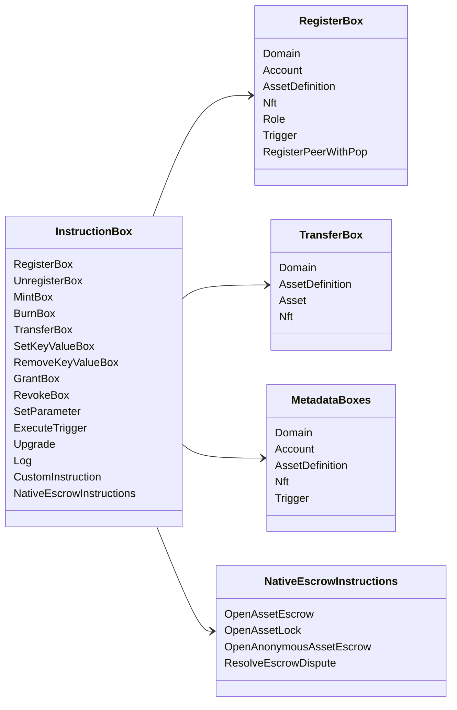

# Iroha Հատուկ հրահանգներ {#iroha-special-instructions}

Ներկա տվյալների մոդելը բացահայտում է այս ներկառուցված հրահանգային ընտանիքները.

|Ուսուցում |Փոփոխություններ |
| --- | --- |
| [`RegisterBox`](/hy/blockchain/instructions.md#un-register) | `Domain`, `Account`, `AssetDefinition`, `Nft`, `Role`, `Trigger`, `RegisterPeerWithPop` |
| [`UnregisterBox`](/hy/blockchain/instructions.md#un-register) | `Peer`, `Domain`, `Account`, `AssetDefinition`, `Nft`, `Role`, `Trigger` |
| [`MintBox`](/hy/blockchain/instructions.md#mint-burn) |թվային `Asset`, կրկնումների առաջացման |
| [`BurnBox`](/hy/blockchain/instructions.md#mint-burn) |թվային `Asset`, կրկնումների առաջացման |
| [`TransferBox`](/hy/blockchain/instructions.md#transfer) |`Domain`, `AssetDefinition`, թվային `Asset`, `Nft` |
| [`SetKeyValueBox`](/hy/blockchain/instructions.md#setkeyvalue-removekeyvalue) |`Domain`, `Account`, `AssetDefinition`, `Nft`, `Trigger` մետադատները |
| [`RemoveKeyValueBox`](/hy/blockchain/instructions.md#setkeyvalue-removekeyvalue) |`Domain`, `Account`, `AssetDefinition`, `Nft`, `Trigger` մետադատները |
| [`GrantBox`](/hy/blockchain/instructions.md#grant-revoke) |հաշվառման թույլտվություն, հաշվառման դերակատարություն, պարտականության թույլտվությունը|
| [`RevokeBox`](/hy/blockchain/instructions.md#grant-revoke) |Հաշվից թույլտվություն, դերակատարություն, դերի թույլտվությունը |
| [`SetParameter`](/hy/blockchain/instructions.md#setparameter) |շղթայի պարամետրերի թարմացում |
| [`ExecuteTrigger`](/hy/blockchain/instructions.md#executetrigger) |գործարկում |
| [`Upgrade`](/hy/blockchain/instructions.md#other-instructions) |իրականացնող վերանորոգում |
| [`Log`](/hy/blockchain/instructions.md#other-instructions) |իրականացնող օրագրի մուտք |
| [`CustomInstruction`](/hy/blockchain/instructions.md#other-instructions) |իրականացնողին հատուկ JSON շահագործման բեռ |
| [Բնական ակտիվների պահպանումը](/hy/blockchain/escrow.md) | `OpenAssetEscrow`, `AcceptAssetEscrow`, `MarkEscrowPaymentSent`, `ReleaseAssetEscrow`, `CancelAssetEscrow`, `OpenEscrowDispute`, `ResolveEscrowDispute` |
| [Գնացական ակտիվների փակիչներ](/hy/blockchain/escrow.md#generic-asset-locks) |`OpenAssetLock`, `DrawdownAssetLock`, `CancelAssetLock`, `ExpireAssetLock` |
| [Անանուն ակտիվների պահպանումը](/hy/blockchain/escrow.md#anonymous-escrow) | `OpenAnonymousAssetEscrow`, `AcceptAnonymousAssetEscrow`, `MarkAnonymousEscrowPaymentSent`, `ReleaseAnonymousAssetEscrow`, `CancelAnonymousAssetEscrow`, `OpenAnonymousEscrowDispute`, `ResolveAnonymousEscrowDispute` |

Iroha 3 լրացուցիչ մոդուլները կարող են գրանցել տիրույթի հատուկ հրահանգների տեսակներ հրահանգների ռեգիստրիի միջոցով: Ներկայիս աղբյուրային ծառից ստեղծված սխեմայի մակարդակի ցուցակի համար դիտեք [Տվյալների մոդելի սխեման](./data-model-schema.md).

::: details Սցենար. Հիմնական ուսուցման ընտանիքներ

:::
