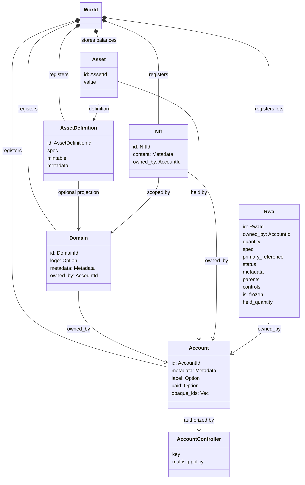
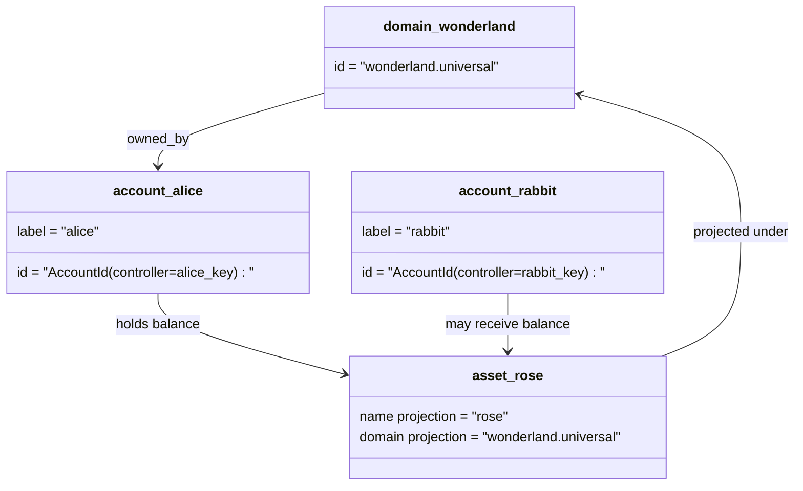

# データモデル {#data-model}

Iroha は `World` で本簿状態を保存する.その最初のリリースデータモデルでは,以下の定例的なアイデンティティとエンティティを使用します:

- ドメインはデータスペースに適している,例えば `payments.universal`
- アカウントはカノニカルでドメインがない;アカウント ID は,口座管理者から得られます.
- アセット定義はドメイン/ネームプロジェクションを保持できるが,そのカノニカルテキストアドレスは不透明なBase58識別子である.
- 資産は,特定の資産定義のための会計に保有されている余分である
- NFTs は,ドメイン資格のある IDs とメタデータを含む独占所有の記録です.
- RWAs は,現在の所有者,数量,出産地,メタデータ,保有物,凍結およびライフサイクルの制御を含むオフチェーン資産を代表する-ID パトが生成されます.

## 例 {#example}

Iroha 3 ネットワークでは, `wonderland.universal` は`universal`データスペース内のドメインである.この例のカノニカルアカウントは,そのキーまたはポリシーによって制御され,ドメインレス I105 アカウント IDs として暗号化されている. `alice@wonderland.universal` のような読めるラベルは,それらの IDs に結合した別名です.予測された資産定義は, `wonderland.universal` の `rose` などのドメインと名前から構築されてもよいが,ワイヤ上で使用されるカノニカルな資産定義アドレスは生成された Base58アドレスである.

## 副名 {#aliases}

副名とは,常識的なレジャー識別子の上に層を重ねた人間面の名前である. API, CLI,財布,および探検器境界で有用であるが,常識的 IDs は厳格なレジャーフィールドに保存されている安定した識別子であり続ける.

|ターゲット|Canonical ターゲット|字面上|支援モデル|
| -------------- | --------------------------------------------------- | ------------------------------------------------------ | ----------------------------------------------------------------------------- |
|ユーザーアカウント|ドメインのない `AccountId` を I105 アドレスとしてコードする|`name@domain.dataspace` または `name@dataspace` |`AccountAlias`;プライマリー・アリスは `Account.label`,追加のアリスは拘束力がある |
|資産の定義|`AssetDefinitionId` Base58 アドレス |`name#domain.dataspace` または `name#dataspace` |`AssetDefinitionAlias` 資産の定義に縛られている|
|契約|神聖なBech32m `ContractAddress` |`name::domain.dataspace` または `name::dataspace` |`ContractAlias` 配備された契約アドレスに結びついている|
|ドメイン名 |`DomainId`は `domain.dataspace`形式で|`domain.dataspace`|SNS `domain` 名前空間記録|
|データの域名|アクティブ Nexus カタログから番号 `DataSpaceId` |`universal`,`paynet`,または `zk`などのデータスペースの名前です.|SNS `dataspace` 名前空間記録とアクティブなデータスペースカタログ|

アカウント・アライアスはユーザー向けのアカウント名です. アライアスがアクティブアカウントを指しているため,アカウントを再開する上で生き残ります ID 世界国家指数や口座レケイ記録を通して `SetPrimaryAccountAlias` 口座の主要ラベルについて `SetAccountAliasBinding` プライマリーでない追加的な仮名について,および `FindAccountByAlias` または `FindAliasesByAccountId` アカウント・アライスには通常,アクティブ SNS アカウント・アリアリース `AcquireAccountAliasLease` 更新された `RenewAccountAliasLease`.

アセット・アリエスは,個人口座の余分ではなく,資産名前の定義である.資産・アライエスと契約名は,読める名前から既存の正規目標に直接結合するものである.アセット・アリスは `SetAssetDefinitionAlias` と設定される.アリスの名前セグメントは,資産定義表示名または予測定義名と一致しなければならない.コントラクト・アリスが `SetContractAlias` と設定される;アリスのデータスペースは,契約アドレスにコードされているデータ空間と一致する必要があります.両結合は `lease_expiry_ms` を運ぶことができる. 期限切れ後,グレースウィンドウが過ぎると解消し,世界国家指数から削除されます.

ドメインには別々の `DomainAlias` オブジェクトがありません.ドメイン識別子は既に `payments.universal`などのデータスペースに適した名前です. SNS は, `domain` 命名空間内のドメイン名および `dataspace` 名域内のデータ領域のニックネームのためのリース所有権を追跡します.予約された `universal` データスペースの別名は,定義され続けなければならない.

## 関連文書 {#related-docs}

|テーマ|どこに行くか|
| -------------------------------------- | ------------------------------------------- |
|ドメイン | [ドメイン](/ja/blockchain/domains.md) |
|口座| [口座](/ja/blockchain/accounts.md)|
|資産| [資産](/ja/blockchain/assets.md)|
|NFTs| [NFTs](/ja/blockchain/nfts.md) |
|リアルワールドの資産| [リアルワールド・アセット](/ja/blockchain/rwas.md) |
|メタデータ| [メタデータ](/ja/blockchain/metadata.md) |
|登録と転送の指示| [指示](/ja/blockchain/instructions.md)|
|実行時間の許可| [許可](/ja/blockchain/permissions.md)|
|名前付け規則| [名付け規則](/ja/reference/naming.md) |
